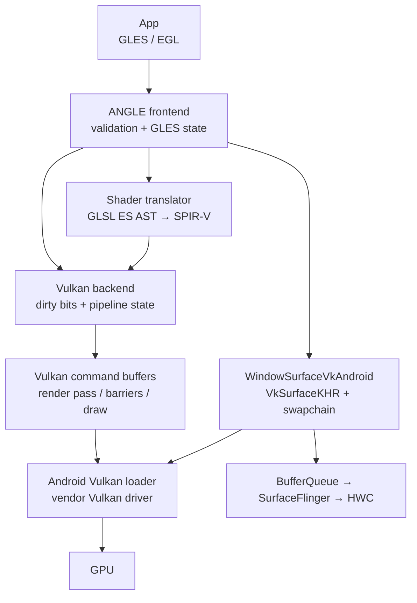
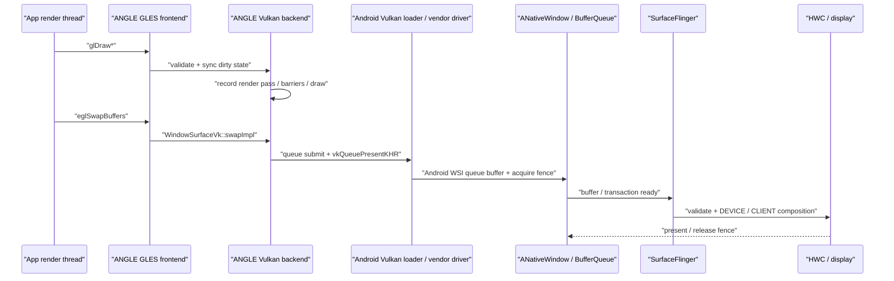

---


title: Android 17 ANGLE（GLES-over-Vulkan 翻译层）
chapter: '18.11'
section: '18.11'
applicable_versions: Android 10 (API 29) - Android 17 (API 37)
tags:
- ANGLE
- GLES
- Vulkan
- 翻译层
- SPIR-V
- 图形驱动
- 渲染路径
related_chapters:
- '2.14'
- '18.8'
- '18.9'
sources:
- type: internal-reference
  path: /Users/gracker/Library/Mobile Documents/iCloud~md~obsidian/Documents/Writer/rendering_pipelines/S08_native_graphics_type.md
  role: Native Graphics 类型边界、ANGLE backend、frame pacing 与显示后半段
- type: internal-reference
  path: /Users/gracker/Library/Mobile Documents/iCloud~md~obsidian/Documents/Writer/rendering_pipelines/images/S08_angle_gles_to_vulkan_pipeline/source.md
  role: ANGLE frontend、Vulkan backend、driver selection 与 trace 证据边界
- type: aosp
  path: https://android.googlesource.com/platform/frameworks/base/+/refs/tags/android-17.0.0_r1/core/java/android/os/GraphicsEnvironment.java
  role: Settings、allowlist/denylist、game policy、manifest 偏好与 APK/system ANGLE 选路
- type: aosp
  path: https://android.googlesource.com/platform/frameworks/native/+/refs/tags/android-17.0.0_r1/opengl/libs/EGL/Loader.cpp
  role: native、ANGLE namespace、system ANGLE 与 updatable driver 加载边界
- type: aosp
  path: https://android.googlesource.com/platform/external/angle/+/refs/tags/android-17.0.0_r1/android/AndroidManifest.xml
  role: AOSP ANGLE system package 与 intent action
- type: aosp
  path: https://android.googlesource.com/platform/external/angle/+/refs/tags/android-17.0.0_r1/src/libANGLE/renderer/vulkan/CompilerVk.cpp
  role: Vulkan backend 的 SPIR-V translator 输出类型
- type: aosp
  path: https://android.googlesource.com/platform/external/angle/+/refs/tags/android-17.0.0_r1/src/compiler/translator/CodeGen.cpp
  role: TranslatorSPIRV 创建分支
- type: aosp
  path: https://android.googlesource.com/platform/external/angle/+/refs/tags/android-17.0.0_r1/src/libANGLE/renderer/vulkan/ContextVk.cpp
  role: dirty-state 同步、draw、flush 与 Vulkan command submit
- type: aosp
  path: https://android.googlesource.com/platform/external/angle/+/refs/tags/android-17.0.0_r1/src/libANGLE/renderer/vulkan/android/WindowSurfaceVkAndroid.cpp
  role: ANativeWindow 到 VkSurfaceKHR 的 Android 桥接
- type: aosp
  path: https://android.googlesource.com/platform/external/angle/+/refs/tags/android-17.0.0_r1/src/libANGLE/renderer/vulkan/SurfaceVk.cpp
  role: swapchain acquire、swap、throttle、present 与 gpu.angle event
- type: aosp
  path: https://android.googlesource.com/platform/external/angle/+/refs/tags/android-17.0.0_r1/src/libANGLE/renderer/vulkan/ProgramExecutableVk.cpp
  role: per-program pipeline cache、warm-up、merge 与序列化
- type: aosp
  path: https://android.googlesource.com/platform/external/angle/+/refs/tags/android-17.0.0_r1/src/libANGLE/renderer/vulkan/SyncVk.cpp
  role: native fence client/server wait、临时 semaphore、fd 所有权与 trace event
- type: kernel
  path: https://android.googlesource.com/kernel/common/+/refs/tags/android17-6.18-2026-06_r6/drivers/dma-buf/sync_file.c
  role: dma-fence 的 sync_file fd 接口
- type: kernel
  path: https://android.googlesource.com/kernel/common/+/refs/tags/android17-6.18-2026-06_r6/drivers/dma-buf/dma-fence.c
  role: fence signal、callback 与 wait
- type: official
  path: https://developer.android.com/games/develop/vulkan/overview
  role: Android 15 可选 ANGLE、包级测试、API 37 manifest 偏好与回退
- type: official
  path: https://perfetto.dev/docs/data-sources/frametimeline
  role: App SurfaceFrame、DisplayFrame 与显示端 jank
task6_state: "reviewed"
task2b_state: fixed
status: finalized
pipeline_stage: "ready-to-publish"
task9_state: reviewed
last_verified: "2026-07-31"
last_verified_against: "android-17.0.0_r1 (GraphicsEnvironment.java, Loader.cpp, ANGLE AndroidManifest.xml, CompilerVk.cpp, CodeGen.cpp, ContextVk.cpp, WindowSurfaceVkAndroid.cpp, SurfaceVk.cpp, ProgramExecutableVk.cpp, SyncVk.cpp) / android17-6.18-2026-06_r6 (sync_file.c, dma-fence.c)"
confidence: high
last_idle_audit_at: "2026-07-26T14:35:30+08:00"
last_idle_audit_run_id: "20260726-143530-idle-audit-2c5482aa"
---

# 18.11 Android 17 ANGLE（GLES-over-Vulkan 翻译层）

本文以 Android 平台 `android-17.0.0_r1` 和同一 tag 的 AOSP `external/angle` 为源码基线，讨论 Android 上最常见的 OpenGL ES/EGL frontend（接收并解释应用 API 的前端）+ Vulkan backend（生成 Vulkan 工作的后端）。ANGLE 也支持其他平台和 backend，但它们不属于本文的 Android runtime path。

从应用接口看，代码仍调用 GLES 和 EGL；向下看驱动接口，ANGLE 会维护 GLES 状态、翻译 shader、记录 Vulkan 命令，并通过 Android Vulkan WSI（Vulkan 与窗口系统的连接层）提交显示。ANGLE 减少的是 GLES frontend 的厂商实现差异，厂商 Vulkan 驱动、GPU 和显示硬件仍然位于执行路径中。

## ANGLE 解决什么问题

Android 应用面对的 GLES 实现来自不同 GPU 厂商、驱动版本和 OEM 集成。即使应用遵守规范，也可能遇到 shader compiler、扩展行为和驱动缺陷方面的差异；如果应用依赖规范未定义的行为，换设备后更容易暴露问题。

ANGLE 提供由 Google 维护的 GLES/EGL 实现，把规范校验、状态跟踪、shader 翻译和大量兼容处理集中在同一套 frontend 中。在 Android 的 Vulkan backend 路径下，设备仍由厂商提供 Vulkan 驱动：

```text
App 的 GLES / EGL 调用
        ↓
ANGLE frontend、状态跟踪、shader translator
        ↓
ANGLE Vulkan backend
        ↓
Android Vulkan loader / vendor Vulkan driver
        ↓
GPU、BufferQueue、SurfaceFlinger、HWC
```

这条路径带来两个直接边界：

- ANGLE 可以绕过部分厂商 GLES frontend 问题，但底层仍依赖厂商 Vulkan compiler、内核 GPU 驱动和硬件。
- ANGLE 能让 GLES 行为更加一致，但不会保证每一种 workload（工作负载）都更快；性能仍要逐场景测量。

使用 ANGLE 的应用仍然通过 GLES API 编程，不能直接操作 Vulkan descriptor、render pass 或 queue；这些对象由 ANGLE backend 管理。如果新引擎需要完整控制 Vulkan 资源、命令和同步，应直接使用原生 Vulkan API。

## 翻译层架构

### 四层职责

下面的结构图把 API 语义、shader、Vulkan 命令和窗口展示分开。



ANGLE frontend 负责 GLES 对象、错误检查和状态机。Vulkan backend 的 `ContextVk::syncState()` 会读取 GLES dirty bits（自上次同步后发生变化的状态标记），再更新 viewport、blend、depth/stencil、program、texture、vertex array 等 Vulkan 状态，随后准备 pipeline 和 draw。

### 一个 GLES draw 不一定只对应一个 Vulkan draw

`ContextVk::drawArrays()` 的普通分支会准备状态并记录 draw，但特殊 primitive 和兼容处理可能改变命令形态。例如，`GL_LINE_LOOP` 分支会生成或复用索引数据，再记录 indexed draw；deferred clear（延后执行的清理）、format conversion、framebuffer fetch emulation 和 render-pass 切换，也可能在 draw 前后插入额外命令。

因此，下面这种写法只适合做概念图：

```text
glDrawArrays()  →  ANGLE 状态同步与兼容处理  →  一组 Vulkan 命令
```

因此，不能把每个 GLES 调用一一映射成同名、同数量的 `vkCmd*` 调用。分析 frame capture 时，应按 GLES draw、ANGLE event 和 Vulkan command buffer 三个层级建立关联。

### GLSL ES 到 SPIR-V

Android 17 tag 的 `CompilerVk::getTranslatorOutputType()` 返回 `SH_SPIRV_VULKAN_OUTPUT`。下面的源码片段说明 Vulkan backend 选择 SPIR-V translator 输出。

```cpp
ShShaderOutput CompilerVk::getTranslatorOutputType() const
{
    return SH_SPIRV_VULKAN_OUTPUT;
}
```

`CodeGen.cpp` 随后为该 output type 创建 `TranslatorSPIRV`。translator 会处理 GLES 语义、注入 driver uniform（由 ANGLE/驱动维护的统一参数）、改写部分 AST（抽象语法树），并输出 SPIR-V blob。厂商 Vulkan 驱动仍要结合 pipeline state，把 SPIR-V 编译为设备可执行形式。

这段工作发生在 shader 编译、program link、cache 恢复或 pipeline 准备阶段，并不会在每次 `glDraw*` 时都从 GLSL ES 文本重新开始。

## Android 17 的运行时选路

### 决策发生在应用进程启动阶段

`GraphicsEnvironment.setup()` 会在应用进程初始化图形环境时调用 `setupAngle()`。类注释明确说明，相关 Settings 改动只会影响尚未完成 setup 的进程。因此，每次修改驱动选择后都要停止并重启目标应用；只重建 EGLContext 不会重新执行 Java 侧选路。

`queryAngleChoice()` 在 `android-17.0.0_r1` 中按以下顺序检查：

| 优先级 | 来源 | 结果 |
|:---:|:---|:---|
| 1 | `angle_gl_driver_all_angle=1` | 为后续启动的 Java runtime 应用进程请求 ANGLE |
| 2 | 包名列表与取值列表 | 当前包可指定 `angle`、`native` 或继续默认 |
| 3 | `config_angleAllowList` | 命中包请求 ANGLE |
| 4 | flag 控制的 device/global/dynamic denylist | 命中包改用 native driver |
| 5 | 同一 flag 分支下的 game 策略 | 可由调试属性或设备资源为 game 请求 ANGLE |
| 6 | Android 17 manifest metadata | 满足平台条件时请求 ANGLE |
| 7 | 无匹配项 | 返回 default |

denylist（禁用名单）和 game 分支受 `enableAngleDenyList` 平台 flag 控制。源码中存在该分支，不代表目标设备已经启用。返回 default 后，`setupAngle()` 还会检查 `persist.graphics.egl` 和只读属性 `ro.hardware.egl`；系统也可能把 ANGLE 配置为默认 GL driver。

### Android 17 manifest 偏好

Android 17 允许应用在 manifest 中请求 ANGLE。下面是官方面向 game 的写法。

```xml
<application
    android:appCategory="game">
    <meta-data
        android:name="com.android.graphics.driver.prefer_angle"
        android:value="true" />
</application>
```

这是偏好信号，不是强制开关。遇到 essential-tier SoC、low-RAM 设备或 `ro.vendor.api_level < 202604` 时，`GraphicsEnvironment` 会跳过该请求；更高优先级的显式选择和 denylist 也会先决定结果。应用仍要在运行时确认实际加载的驱动。

### ANGLE APK、system ANGLE 与 vendor updatable driver

选择结果要求使用 ANGLE 时，`setupAngle()` 会先调用 `setupAngleFromApk()`，失败后再尝试 `setupAngleFromSystem()`：

1. debuggable 应用或 debuggable 设备可以通过 `angle_debug_package` 指定开发包；
2. 否则根据 `android.app.action.ANGLE_FOR_ANDROID` 查询唯一的 system app；
3. Android 17 的 AOSP manifest 对应包名为 `com.android.angle`；
4. APK 路径不可用时，loader 可以改用 system ANGLE library。

ANGLE package 与 vendor updatable graphics driver 是两套独立机制。前者提供 GLES-over-Vulkan 实现；后者通过 `ro.gfx.driver.*`、独立 linker namespace（动态库加载隔离空间）和厂商 driver package 更新 GLES/Vulkan 驱动。看到 “driver from APK” 时，必须先确认它来自 ANGLE namespace 还是 updatable driver namespace。

EGL loader 的 `attempt_to_load_angle()` 会装入 ANGLE 的 `libEGL`、`libGLESv1_CM` 和 `libGLESv2` 实现。源码注释中的 “ANGLE doesn't ship with GLES library” 是指不提供旧式合并库 `libGLES.so`，并非 ANGLE 不提供 GLES 1/2/3 入口。

### 用 ADB 做包级 A/B

下面的命令为一个包请求 ANGLE；设置后必须停止并重新启动进程。

```bash
adb shell settings put global angle_gl_driver_selection_pkgs com.example.game
adb shell settings put global angle_gl_driver_selection_values angle
adb shell am force-stop com.example.game
```

测试结束后删除两个列表，避免该调试配置影响后续测量。

```bash
adb shell settings delete global angle_gl_driver_selection_pkgs
adb shell settings delete global angle_gl_driver_selection_values
adb shell am force-stop com.example.game
```

多个包共用列表时，`pkgs` 与 `values` 必须按逗号一一对应；两者长度不同会被 `GraphicsEnvironment` 忽略。量产设备还可能限制 Settings 写入或包级覆盖。命令执行成功只说明配置写入成功，不能证明 ANGLE 已经加载。

## 一帧怎样从 GLES 走到显示

### Draw 阶段

应用的 render loop 仍然调用 `glUseProgram()`、`glBind*()` 和 `glDraw*()`。ANGLE frontend 先记录 GLES 对象与状态，Vulkan backend 通过 dirty bits 延后处理许多变化，直到 draw、dispatch、clear 等需要实际执行的命令到来时才同步到 Vulkan 状态。

这种延迟处理可以解释一个常见现象：某个看似轻量的 `glDrawArrays()` 在 CPU trace 中耗时很长，时间未必来自 draw 编码本身，也可能包含此前积累的 texture、framebuffer、pipeline 或 shader 准备工作。

### Swap 阶段

Android 上的 `WindowSurfaceVkAndroid::createSurfaceVk()` 会把 `ANativeWindow` 交给 `vkCreateAndroidSurfaceKHR()`。`eglSwapBuffers()` 进入 ANGLE 的 `WindowSurfaceVk` 后，可能执行：

- 结束或提交当前 render pass；
- 处理 present layout transition；
- 等待或取得下一块 swapchain image；
- 进行 CPU throttle 或 swap interval pacing；
- 由 `Renderer::queuePresent()` 提交 Vulkan present。

下面的时序图刻意保留了 ANGLE、Vulkan WSI 和 Android 显示端的边界。



`vkQueuePresentKHR()` 返回，只说明 present 请求已经处理到 Vulkan WSI 规定的边界，无法证明屏幕已经扫描出该帧。SurfaceFlinger 仍要选择可展示的内容，与 HWC 协商 composition，并完成 Display present。

SurfaceFlinger 接收到的是目标 Layer、buffer、dataspace、damage、几何、时间信息和 acquire fence。对显示系统而言，上游使用厂商 GLES、ANGLE Vulkan 还是原生 Vulkan，并不会改变这些合成输入的基本形式。

## Shader、program 与 pipeline cache

ANGLE Vulkan 路径至少有三层容易被统称为“shader cache”：

| 层级 | 缓存对象 | 主要减少什么 |
|:---|:---|:---|
| ANGLE program/blob cache | 编译、链接后的 program 数据 | 重复的 frontend 翻译和 program 恢复工作 |
| ANGLE graphics pipeline cache | pipeline 描述到 Vulkan pipeline 的映射 | 同一进程内重复的 pipeline 查找与创建 |
| Vulkan pipeline cache data | vendor compiler 可复用的数据 | 驱动侧 pipeline 编译成本，实际收益由驱动决定 |

Android 17 tag 中的 `ProgramExecutableVk` 包含 per-program pipeline cache、global cache 合并、warm-up（预热）和序列化分支，具体策略取决于 ANGLE feature 与驱动能力。看到 `VkPipelineCache` 不能证明每次启动都会完整持久化；cache 命中也不会消除全部 CPU 翻译和状态处理成本。

cache 命中仍可能保留：

- GLES 参数校验与对象查找；
- dirty-state 同步；
- descriptor/dynamic state 更新；
- command buffer 记录；
- render-pass 边界和资源 barrier；
- WSI acquire、present 和 fence 等待。

评估首帧和场景切换时，要同时测量 cold（无可用缓存）和 warm（缓存可复用）两种状态：

1. cold：清理应用可控 cache 或使用全新安装，记录 shader compile、program link 和 pipeline creation；
2. warm：保持相同 App、ANGLE package、vendor driver 和资源版本再次运行；
3. 比较相同场景的 CPU slice、GPU stage、present 间隔与 cache 命中情况，不能只比较平均 FPS。

应用更新 shader、ANGLE 更新、vendor driver 更新、GPU 型号变化或 pipeline state 改变，都可能让旧 cache 不再适用。

## Native fence 与 Vulkan 同步

### server wait：把 sync fd 导入临时 semaphore

`EGL_ANDROID_native_fence_sync` 让 EGL/GLES 与 Android native fence 互操作。Android 17 ANGLE 的 `SyncHelperNativeFence::serverWait()` 会为下一次 Vulkan submit 准备 binary semaphore，并导入一份 duplicated sync fd（复制出的文件描述符）。这里的 server wait 把依赖交给后续 GPU submit，不要求当前 CPU 线程先等 fence 完成。

下面的精简片段保留了 fd ownership 和 submit stage 两个要点。

```cpp
importFdInfo.flags =
        VK_SEMAPHORE_IMPORT_TEMPORARY_BIT_KHR;
importFdInfo.handleType =
        VK_EXTERNAL_SEMAPHORE_HANDLE_TYPE_SYNC_FD_BIT_KHR;
importFdInfo.fd = dup(mExternalFence->getFenceFd());

contextVk->addWaitSemaphore(
        waitSemaphore.get().getHandle(),
        VK_PIPELINE_STAGE_ALL_COMMANDS_BIT);
contextVk->addGarbage(&waitSemaphore.get());
```

传给 Vulkan import 的 duplicated fd 由 Vulkan 同步导入规则接管；`mExternalFence` 持有的原 fd 继续由 ANGLE 管理。temporary import 表示等待完成后，semaphore payload 会恢复到导入前的语义，因此它不是持久共享 semaphore。

### client wait：调用线程仍在等待

`SyncHelperNativeFence::clientWait()` 会先检查 signal 和 timeout，必要时把等待放入 `UnlockedTailCall`。tail call 在释放 frontend 锁后、对应 EGL API 返回前执行；`SyncHelper::clientWait()` 对 GL sync 使用类似设计。这样可以避免等待期间一直持有 ANGLE 全局/display 锁，但调用线程本身仍然阻塞，等待不会自动转移到异步 GPU worker。

该等待使用 `poll()`，把纳秒 timeout 转换成毫秒；非零且小于 1 ms 的 timeout 会提升为 1 ms。这里描述的是 ANGLE 用户态的等待方式，fd 的底层同步语义仍由内核 sync_file/dma-fence 提供。内核源码统一参照 `android17-6.18-2026-06_r6` 中的 `drivers/dma-buf/sync_file.c` 与 `drivers/dma-buf/dma-fence.c`。

`serverWait()` 本身没有 `ANGLE_TRACE_EVENT`，因此在 Perfetto 中搜索函数名通常找不到对应 slice。需要结合 Vulkan submit、调用栈采样和后续 GPU 执行确认；`clientWait` 与 `clientWait block (unlocked)` 在 Android 17 tag 中则有 `gpu.angle` event。

## 性能特征与 A/B 方法

### 成本和收益分别量

| 观察维度 | ANGLE 可能增加的工作 | ANGLE 可能带来的收益 |
|:---|:---|:---|
| CPU frontend | GLES validation、状态映射、命令编码 | 统一实现和一致的错误处理 |
| Shader/pipeline | GLSL ES → SPIR-V、pipeline 准备 | cache、并行编译和持续维护的 workaround（兼容修复） |
| GPU | 兼容 pass、格式转换、额外 barrier | 更合适的 Vulkan 驱动路径或驱动优化 |
| 同步/WSI | acquire、throttle、native-fence 转换 | 较统一的 present 与 fence 实现 |
| 兼容性 | 更严格暴露应用未定义行为 | 避开部分 vendor GLES 缺陷 |

ANGLE 变快或变慢都不能从架构图直接推出。CPU-bound（主要受 CPU 限制）的 GLES 游戏可能受益于更成熟的 Vulkan 驱动，也可能被高频状态切换和 pipeline churn（大量创建或切换 pipeline）拖慢；GPU-bound 场景可能几乎不受 frontend 成本影响，也可能因为兼容 pass 或格式选择改变 GPU 工作量。

### 公平对比的固定项

对比 native GLES 与 ANGLE 时，至少固定以下条件：

- 设备、系统 build、ANGLE package 和厂商驱动版本；
- 分辨率、刷新率、Game Mode、帧率上限和 thermal 状态；
- 相同场景，以及相同的 shader/texture cache 冷热状态；
- 前台窗口、Surface 尺寸、色彩空间和 swap interval；
- 运行时 backend 证据。

指标应包含 CPU frame time 分布、GPU stage、present-to-present 间隔、1% low（最慢 1% 帧所反映的流畅度）、输入延迟、内存和持续温度。只测几十秒的平均 FPS，容易遗漏 pipeline warm-up 和热降频问题。

### 常见优化顺序

1. 修正 GLES 未定义行为、shader 编译错误和扩展依赖；
2. 合并没有实际作用的细碎状态切换，减少 program/FBO/texture 反复切换；
3. 控制 shader variant 和 pipeline state 数量；
4. 使用应用与 EGL 提供的 cache 能力，并验证恢复是否命中；
5. 避免同步 readback（GPU 结果回读到 CPU）、无界 `glFinish()` 和过长 client wait；
6. 重新测量 swap、GPU 和 SurfaceFlinger 显示段，确认成本没有转移。

ANGLE 拒绝某段 GLSL ES 时，应先检查 shader 是否符合目标 GLES 版本对 precision、layout、extension 和 link 的约束。依赖厂商驱动宽松行为的代码本身就不具备可移植性，不能直接把问题归为 ANGLE 缺陷。

## 启用检测与调试

### 三类证据要一致

确认 ANGLE 时，应组合检查配置意图、进程实际加载和 API 字符串三类证据：

| 证据 | 能说明什么 | 局限 |
|:---|:---|:---|
| Settings / manifest / platform resource | 系统为何请求某个 driver | 请求可能失败或被更高优先级覆盖 |
| `/proc/<pid>/maps` 中的 ANGLE library | 目标进程实际装入 ANGLE 实现 | 非 debuggable 进程可能无权读取 |
| `GL_VENDOR`/`GL_RENDERER`、`EGL_VENDOR` | 当前 context/display 的实现标识 | 必须在正确的 context 和线程查询 |
| `gpu.angle` trace event | ANGLE Vulkan backend 正在执行对应代码 | category 未启用时看不到 |

下面的代码在 EGLContext current 后打印 API 字符串。

```cpp
const char* glVendor =
        reinterpret_cast<const char*>(glGetString(GL_VENDOR));
const char* glRenderer =
        reinterpret_cast<const char*>(glGetString(GL_RENDERER));
const char* eglVendor = eglQueryString(eglGetCurrentDisplay(), EGL_VENDOR);

ALOGI("GL_VENDOR=%s", glVendor ? glVendor : "<null>");
ALOGI("GL_RENDERER=%s", glRenderer ? glRenderer : "<null>");
ALOGI("EGL_VENDOR=%s", eglVendor ? eglVendor : "<null>");
```

ANGLE renderer 字符串通常包含 `ANGLE`、vendor、GPU 和 Vulkan 版本信息，但格式不是稳定 ABI。不要依赖固定的逗号位置解析；用于遥测时，应保存原始字符串和系统 build。

debuggable 应用可以用下面的命令检查映射。`run-as` 失败时不要通过放宽系统安全策略来做日常验证。

```bash
pid=$(adb shell pidof -s com.example.game)
adb shell run-as com.example.game \
    sh -c "cat /proc/$pid/maps | grep -E 'lib(EGL|GLES).*angle'"
```

`angle_debug_package` 只对允许加载调试 package 的进程生效。修改后仍要重启目标进程，并核对 ABI、system app/debug app 身份和实际 maps。

### 回归范围

ANGLE 与 native GLES 都要覆盖：

- GLES 版本和扩展查询；
- external image、camera/video texture；
- protected content 和 wide color/HDR；
- context loss、后台恢复和 Surface 重建；
- shader cache 升级与 driver 更新；
- RenderDoc/AGI 等调试工具注入；
- 32/64 位 ABI 和 Android 15+ 的 16 KB page-size 设备。

不能假设 ANGLE 会提供厂商私有的 `GL_*` 扩展。应用应在运行时查询，并为扩展缺失准备符合规范的替代路径。

## 在 Perfetto 中识别 ANGLE

### 先证实 backend，再解释 slice

单独出现 `vkQueueSubmit` 或 Vulkan GPU stage，无法证明 GLES 正在通过 ANGLE 运行：原生 Vulkan、HWUI Vulkan 和其他库也会产生 Vulkan 工作。Perfetto 结论应同时具备：

1. 目标进程的 GL/EGL 字符串或已加载 library；
2. `gpu.angle` category 中的 ANGLE event；
3. 同一进程的 Vulkan submit / GPU stage；
4. 对应 App Surface 的 BufferQueue、FrameTimeline 和 Display present。

Android 17 tag 中较有辨识度的 event 包括：

| Event | 说明 | 误读风险 |
|:---|:---|:---|
| `ContextVk::flushAndSubmitCommands` | ANGLE 正在准备或提交 Vulkan 工作 | 无法证明 GPU 已经完成 |
| `CommandQueue::submitCommands`/`queueSubmitLocked` | command queue 提交阶段 | 需要结合线程状态和驱动调用 |
| `WindowSurfaceVk::swapImpl` | EGL swap 的 Vulkan backend 实现 | 范围可能包含 acquire、submit 和 pacing |
| `WindowSurfaceVk::present` | ANGLE 组织 present | 无法证明 Display 已经显示该帧 |
| `acquireNextSwapchainImage` | 取得下一张 swapchain image | 长等待可能是 backpressure / pacing |
| `WindowSurfaceVk::throttleCPU` | ANGLE 主动限制 CPU 超前 | 不能直接标成无效卡顿 |
| `SyncHelperNativeFence::clientWait block (unlocked)` | 调用线程在无 frontend 锁状态等待 | 不是异步 GPU worker |
| `CreateMonolithicPipelineTask`/cache warm-up | pipeline 创建或预热 | 要区分 cold/warm |

具体 event 取决于 build、ANGLE revision 和 trace category。找不到某个名称时，应回到调用栈、API marker 和 buffer 时间；缺少 slice 只能说明没有采集到该事件，不能证明代码没有执行。

### 用 SQL 限定目标进程

下面的 Perfetto SQL 只列出目标进程中常见 ANGLE Vulkan event，适合确认耗时集中在哪一类操作。

```sql
SELECT
  p.name AS process,
  t.name AS thread,
  s.name,
  ROUND(s.dur / 1e6, 3) AS dur_ms
FROM slice s
JOIN thread_track tt ON s.track_id = tt.id
JOIN thread t ON tt.utid = t.utid
JOIN process p ON t.upid = p.upid
WHERE p.name = 'com.example.game'
  AND (
    s.name GLOB 'WindowSurfaceVk::*'
    OR s.name GLOB 'ContextVk::*'
    OR s.name GLOB 'CommandQueue::*'
    OR s.name GLOB 'SyncHelper*'
    OR s.name GLOB '*Pipeline*'
  )
ORDER BY s.ts;
```

查询结果只能定位 CPU event。GPU 是否繁忙要检查 GPU render stage/counter；buffer 是否显示则要检查 SurfaceFlinger FrameTimeline 和 Display present。

### 按等待位置归因

| 长段位置 | 优先核对 | 可能的根因 |
|:---|:---|:---|
| shader link/pipeline task | cold/warm、variant、驱动 compiler | shader 或 pipeline churn |
| `syncState` 附近 | 之前积累的 dirty state | 高频 state/FBO/resource 变化 |
| `clientWait block (unlocked)` | 谁创建 fence、timeout、CPU thread state | 显式同步或 readback |
| acquire/throttle | queue depth、release fence、swap interval | CPU 超前、Display backpressure |
| queue submit 后 GPU stage 长 | GPU counter、频率、thermal | shader、带宽、overdraw 或降频 |
| ANGLE present 正常，FrameTimeline 晚 | SF latch、composition、HWC present | 显示端或 acquire fence |

一帧的最小时间线是：App GLES call → ANGLE state/command → Vulkan submit → GPU completion fence → WSI queue → SurfaceFlinger latch → HWC/RenderEngine composition → Display present。任何一段缺少证据，都应明确保留为待验证边界。

## Android 10—17 的版本边界

### Android 10—14

早期 Android 已具备 ANGLE 集成和包级调试选择能力，但 system image、ANGLE build、device policy 和 OEM 支持差异较大。平台源码中存在开关，只能说明系统具备该机制，不能证明所有零售设备都把 ANGLE 作为常规受支持的 GLES 驱动。

### Android 15

Android 官方把 ANGLE 描述为 Android 15+ 可选的 GLES-over-Vulkan 层，并提供开发者选项与包级 ADB 测试方式。这是当前进行兼容性和性能 A/B 的公开基线，但不代表所有应用都会默认切换到 ANGLE。

### Android 16

`GraphicsEnvironment` 注释明确把 `config_angleAllowList` 作为 Android 16 起的平台包名单。Android 17 源码还包含由 flag 控制的 denylist 和 game 默认策略；分析 Android 16 设备时应阅读对应 tag，不能把 Android 17 分支倒推到旧 build。

### Android 17

Android 17 增加 manifest 请求 `com.android.graphics.driver.prefer_angle`。平台仍保留显式 Settings、platform resource、system property、ANGLE package 和 system ANGLE 多层选择；最终要通过运行时字符串和进程 maps 确认实际结果。

本文的平台行为固定到 `android-17.0.0_r1`，ANGLE 实现也固定到 AOSP `external/angle` 的同一 tag。native fence 的内核语义固定到 `android17-6.18-2026-06_r6`。厂商 Vulkan userspace 与 GPU 内核驱动不在 AOSP 通用源码中，因此设备结论还要记录 vendor build。

## Android 17 源码索引

- [Android 官方 Vulkan / ANGLE 说明](https://developer.android.com/games/develop/vulkan/overview)：Android 15+ 可选 ANGLE、包级 ADB 测试和 Android 17 manifest 请求。
- [`GraphicsEnvironment.java`](https://android.googlesource.com/platform/frameworks/base/+/android-17.0.0_r1/core/java/android/os/GraphicsEnvironment.java)：包级选择、platform resource、manifest 偏好和 APK/system 设置。
- [`Loader.cpp`](https://android.googlesource.com/platform/frameworks/native/+/android-17.0.0_r1/opengl/libs/EGL/Loader.cpp)：system driver、ANGLE namespace 和 updatable driver 的加载边界。
- [`AndroidManifest.xml`](https://android.googlesource.com/platform/external/angle/+/android-17.0.0_r1/android/AndroidManifest.xml)：AOSP ANGLE system package 和 intent action。
- [`CompilerVk.cpp`](https://android.googlesource.com/platform/external/angle/+/android-17.0.0_r1/src/libANGLE/renderer/vulkan/CompilerVk.cpp) 与 [`TranslatorSPIRV.cpp`](https://android.googlesource.com/platform/external/angle/+/android-17.0.0_r1/src/compiler/translator/spirv/TranslatorSPIRV.cpp)：Vulkan backend 的 SPIR-V 输出。
- [`ContextVk.cpp`](https://android.googlesource.com/platform/external/angle/+/android-17.0.0_r1/src/libANGLE/renderer/vulkan/ContextVk.cpp)：dirty-state 同步、draw 和 command submit。
- [`WindowSurfaceVkAndroid.cpp`](https://android.googlesource.com/platform/external/angle/+/android-17.0.0_r1/src/libANGLE/renderer/vulkan/android/WindowSurfaceVkAndroid.cpp) 与 [`SurfaceVk.cpp`](https://android.googlesource.com/platform/external/angle/+/android-17.0.0_r1/src/libANGLE/renderer/vulkan/SurfaceVk.cpp)：Android `VkSurfaceKHR`、swapchain acquire 和 present。
- [`ProgramExecutableVk.cpp`](https://android.googlesource.com/platform/external/angle/+/android-17.0.0_r1/src/libANGLE/renderer/vulkan/ProgramExecutableVk.cpp)：pipeline cache 初始化、warm-up、合并与序列化。
- [`SyncVk.cpp`](https://android.googlesource.com/platform/external/angle/+/android-17.0.0_r1/src/libANGLE/renderer/vulkan/SyncVk.cpp)：native fence、client wait 和 server wait。
- 内核 [`sync_file.c`](https://android.googlesource.com/kernel/common/+/refs/tags/android17-6.18-2026-06_r6/drivers/dma-buf/sync_file.c) 与 [`dma-fence.c`](https://android.googlesource.com/kernel/common/+/refs/tags/android17-6.18-2026-06_r6/drivers/dma-buf/dma-fence.c)：sync fd、signal、callback 和 wait。

---

> **交叉引用**
>
> - 原生 GLES 与 EGL 路径详见 [18.8 Android 17 EGL / OpenGL ES 渲染链路](08-opengl-es.md)
> - Android Vulkan WSI 详见 [18.9 Android 17 Vulkan 原生渲染管线](09-vulkan-native.md)
> - SurfaceControl 与 fence 所有权详见 [18.10 Android 17 SurfaceControl NDK API](10-surface-control-api.md)
> - 游戏 render loop 与 frame pacing 详见 [18.16 游戏引擎渲染路径](16-game-engine.md)
> - 图形 API 选择详见 [2.14 图形 API 演进与选择策略](../../part1-fundamentals/ch02-rendering/14-graphics-api-evolution.md)
