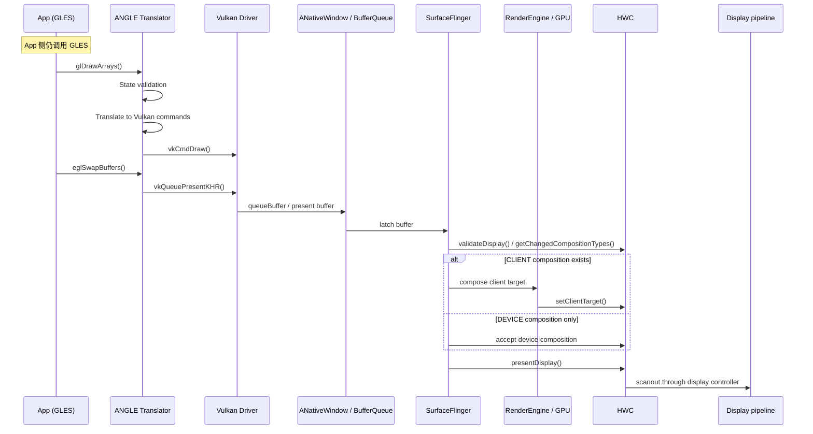

<!-- outline-start -->

**锚点（必须覆盖）：**
- ANGLE 解决的核心问题：GLES 驱动碎片化
- 翻译层架构：GLSL → SPIR-V → Vulkan
- 渲染时序：App 调用 GLES → ANGLE 翻译 → Vulkan 执行
- 性能特征：翻译开销 vs 驱动一致性收益
- 在 Perfetto 中识别 ANGLE 层的方法

**扩展（可选深入）：**
- ANGLE 启用检测与调试
- Shader 编译差异（GLSL vs SPIR-V pipeline cache）
- Android 15+ 的 ANGLE 生态趋势

<!-- outline-end -->

## 为什么需要 ANGLE

Android 的 GLES 兼容性长期受厂商驱动差异影响。同一个 `glDrawArrays` 调用或同一份 GLSL，在不同设备上可能遇到结果偏差、shader 编译差异，或者直接踩到驱动 Bug。

**ANGLE**（Almost Native Graphics Layer Engine）是 Google 维护的开源图形翻译层。App 侧仍然调用 GLES API，ANGLE 负责把 GLES 状态和命令翻译成 Vulkan 指令，再交给厂商 Vulkan driver 执行。统一的是 GLES frontend、状态管理和 shader 翻译流程，底层执行仍然落在厂商 Vulkan driver 和 GPU 上。

Android 10 起支持把 ANGLE 作为 GLES driver 选项。Android 15 之后，Google 继续扩大 ANGLE 的覆盖范围，官方口径是兼容性更好，部分场景性能更好。默认是否启用仍取决于设备配置、allowlist 和调试开关。

## 核心架构

ANGLE 的翻译流程可以概括为三个步骤：

```mermaid
graph TD
    subgraph "App Layer"
        App[App (GLES Calls)]
    end
    
    subgraph "ANGLE Layer"
        Translator[GLES → Vulkan Translator]
        Shader[SPIR-V Compiler]
        State[State Tracker]
    end
    
    subgraph "System"
        VK[Vendor Vulkan Driver]
        GPU[GPU]
    end
    
    App -->|glDrawArrays| Translator
    Translator -->|vkCmdDraw| VK
    Translator -->|Shader| Shader
    Shader -->|SPIR-V| VK
    VK -->|Execute| GPU
```

1. **GLES API 拦截**：App 调用 `glDrawArrays`、`glUseProgram` 等 GLES 函数，被 ANGLE 的翻译层拦截。
2. **状态跟踪**：ANGLE 维护一个 GLES 状态机的镜像，将隐式的 GLES 状态转换为 Vulkan 所需的显式状态。
3. **Shader 翻译**：GLSL Shader 源码先编译为 SPIR-V，再由厂商 Vulkan driver 编译为 GPU Binary。
4. **Vulkan 指令生成**：GLES 绘制调用被翻译为 Vulkan Command Buffer 操作，提交给 Vulkan 队列。

## 启用条件与运行时选路

AOSP 里，`GraphicsEnvironment.queryAngleChoice()` 会先决定当前进程该走哪条 GLES driver 路径，顺序如下：

1. `Settings.Global.ANGLE_GL_DRIVER_ALL_ANGLE`，ADB 对应键 `angle_gl_driver_all_angle`。值为 `1` 时，全局强制走 ANGLE。
2. `angle_gl_driver_selection_pkgs` 和 `angle_gl_driver_selection_values`。两个设置按逗号分组，按包名给出 `angle`、`native` 或 `default`。
3. 平台自带 allowlist，AOSP 资源里是 `config_angleAllowList`。

如果结果是 `angle`，`GraphicsEnvironment.setupAngle()` 会先尝试 ANGLE APK，再回退到 system ANGLE。EGL loader 随后在 `frameworks/native/opengl/libs/EGL/Loader.cpp` 按当前选择加载 ANGLE 或 native GLES driver。ANGLE 路径的实际执行路径是 ANGLE frontend → vendor Vulkan driver → GPU。Vulkan driver 自身的行为差异仍然会透传到应用侧。

Android 15 以后还要把 ANGLE 当成可更新的系统图形层（Updatable Graphics Layer）看。设备可以预装 `com.android.angle`，通过系统包或 Play Store 更新把 ANGLE 库带到新版本；`GraphicsEnvironment.setupAngle()` 会先查可用 ANGLE package，再决定是否回退到 system ANGLE。排查“为什么这台机型走 ANGLE”时，除 Settings 键值外，还要记录 `com.android.angle` 的版本、是否禁用，以及进程实际加载的 EGL/GLES 库。

如果结果是 `native`，loader 会回到设备自带 GLES driver。调试时需要把设置值和运行时证据放在一起看，因为 ANGLE APK 缺失、库加载失败、system ANGLE 与 native driver 切换都会影响最终落点。

## 渲染时序

从 App 的视角，它仍然在调用 GLES API。底层执行路径已经变成 ANGLE frontend → vendor Vulkan driver → GPU，每一段都会引入自己的成本：



这张图把 ANGLE 的责任边界停在 Vulkan WSI 与 BufferQueue。SurfaceFlinger latch 之后会先和 HWC 协商每个 layer 的 composition type；只有 CLIENT layer 需要 RenderEngine / GPU 生成 client target，最终送显由 HWC 和显示控制器完成。

关键差异点：

| 操作 | 原生 GLES | ANGLE 翻译后 |
|:---|:---|:---|
| `glDrawArrays` | 直接调用 GLES 驱动 | 翻译为 `vkCmdDraw` |
| `glShaderSource` | GLSL → GPU Binary | GLSL → SPIR-V → GPU Binary |
| `eglSwapBuffers` | GLES 驱动提交 buffer | ANGLE 走 Vulkan WSI / ANativeWindow 提交 buffer，后段由 SurfaceFlinger、HWC 和显示控制器处理 |

## 性能特征

ANGLE 带来的主要收益在兼容性和行为收敛。性能方向要按 workload 判断，Android 官方对它的表述也是“兼容性更好，部分场景性能更好”。

| 维度 | 原生 GLES 路径 | ANGLE 路径 |
|:---|:---|:---|
| Driver frontend | 厂商 GLES driver | ANGLE GLES frontend + 厂商 Vulkan driver |
| Shader 路径 | GLSL → vendor compiler | GLSL → SPIR-V → vendor pipeline |
| 状态管理 | 厂商维护 GLES 状态机 | ANGLE 做状态映射，再落到 Vulkan |
| 调试可见性 | 厂商差异较大 | ANGLE 路径更容易和源码、设置项对应 |

常见成本来自几处：

- **Shader 首次编译**：多了一层 GLSL → SPIR-V，再进入 Vulkan pipeline 建立
- **State mapping**：GLES 的隐式状态要转换成 Vulkan 的显式状态
- **命令翻译**：Draw call、render pass、同步对象都要经过一层映射
- **Cache 冷启动**：pipeline cache 未命中时，首帧和场景切换更容易抬高 CPU / GPU 开销

更容易受益的场景，通常是原生 GLES driver 质量不稳定、机型差异大，或者需要把问题稳定复现到一条更统一的图形路径上。更容易吃亏的场景，通常是 shader 首编很多、pipeline churn 明显，或者目标机型的原生 GLES driver 本来就足够成熟。同一份 workload 在两台设备上可能得出相反结论，发布前要在目标机型上对比 native 与 ANGLE 两条路径。

## 在 Perfetto 中识别 ANGLE

单看 `vkQueueSubmit` 或 `vkCmdDraw` 不够。native Vulkan、Skia Vulkan、系统图形组件都可能产生 `vk*` slice。确认 ANGLE 时，要把 driver 选择、运行时标识和目标进程 trace 放在一起看。

建议至少打开这几类数据源：

- Graphics and display
- SurfaceFlinger
- GPU render stages / counters
- 目标进程的 Vulkan 相关 slice 或 track_event 数据（设备支持时）

### 1. 先确认 driver 选择

```bash
# 读取当前设置
adb shell settings get global angle_gl_driver_all_angle
adb shell settings get global angle_gl_driver_selection_pkgs
adb shell settings get global angle_gl_driver_selection_values

# 全局强制 ANGLE（调试后记得恢复）
adb shell settings put global angle_gl_driver_all_angle 1
adb shell settings put global angle_gl_driver_all_angle 0

# 按包切到 ANGLE
adb shell settings put global angle_gl_driver_selection_pkgs com.example.demo
adb shell settings put global angle_gl_driver_selection_values angle
```

`angle_gl_driver_selection_pkgs` 和 `angle_gl_driver_selection_values` 在 AOSP 中按逗号一一对应。查多包配置时，要确认两个列表长度一致。

### 2. 再看运行时标识

- `glGetString(GL_RENDERER)` 返回值包含 `ANGLE`，例如 `ANGLE (Vendor, Vulkan 1.3.x, ...)`
- debuggable 进程可以结合 `logcat | grep ANGLE` 或进程已加载库，确认 ANGLE 库已经进入目标进程

### 3. 限定目标进程做 trace 归因

```sql
SELECT p.name AS process,
       t.name AS thread,
       s.name,
       ROUND(s.dur / 1e6, 3) AS dur_ms
FROM slice s
JOIN thread_track tt ON s.track_id = tt.id
JOIN thread t ON tt.utid = t.utid
JOIN process p ON t.upid = p.upid
WHERE p.name = 'com.example.demo'
  AND (s.name GLOB 'vk*' OR s.name LIKE '%ANGLE%')
ORDER BY s.ts DESC
LIMIT 50;
```

这条查询只能说明目标进程走过 Vulkan 路径。把它和 settings、`GL_RENDERER`、已加载库放在一起，才能把 `vk*` slice 归因到 ANGLE。需要更细的 command 级证据时，用 AGI 抓一帧会更稳。

## 开发者建议

1. **测试覆盖**：确保 App 在 ANGLE 和原生 GLES 下都测试过，特别是依赖厂商扩展（`GL_QCOM_*` 等）的代码
2. **Shader 规范**：ANGLE 对 GLSL 语法要求更严格，不合规的 GLSL 会直接报错
3. **新项目优先 Vulkan**：如果不需要兼容旧设备，直接用 Vulkan 比 ANGLE 更高效

## 与其他章节的关系

- **2.14 图形 API 演进与选择策略**：ANGLE 在 Android 图形生态中的定位
- **18.8 OpenGL ES 渲染路径**：原生 GLES 路径，与 ANGLE 形成对比
- **18.9 Vulkan 原生渲染路径**：ANGLE 底层走的就是 Vulkan


<!-- AIW-源码调研-2026-04-18 -->
## Driver Selection 机制：按版本看入口

ANGLE driver selection 集中在 `android.os.GraphicsEnvironment`（`frameworks/base/core/java/android/os/GraphicsEnvironment.java`），但 Android 14、15、16 的方法名和 allowlist 入口不同。源码阅读时先确认平台 tag，不能把 android-14.0.0_r1 的方法名直接套到 Android 15/16。

| Android 版本 | 决策入口 | allowlist / 额外来源 | 排查边界 |
|:---|:---|:---|:---|
| Android 14 | `shouldUseAngleInternal()`，Game Mode 分支会走 `isAngleEnabledByGameMode()` | Settings、Game Mode、ANGLE APK 规则 | 这一版可以按旧方法名读源码 |
| Android 15 | `queryAngleChoiceInternal()` | Settings 与包级配置 | 方法名已从 Android 14 口径变化 |
| Android 16 | `queryAngleChoice()` | Settings 与 framework resource `config_angleAllowList` | 复核树中不再有 `shouldUseAngleInternal()` / `isAngleEnabledByGameMode()` 作为主路径 |

Android 16 的常用排查顺序如下：

1. `Settings.Global.ANGLE_GL_DRIVER_ALL_ANGLE`，ADB 对应键 `angle_gl_driver_all_angle`。值为 `1` 时，全局强制走 ANGLE。
2. `angle_gl_driver_selection_pkgs` 和 `angle_gl_driver_selection_values`。两个设置按逗号分组，按包名给出 `angle`、`native` 或 `default`。
3. `config_angleAllowList`。这是 Android 16 平台 allowlist 入口，适合核对系统为什么默认允许某个包走 ANGLE。

如果 trace 或源码阅读对象是 Android 15/16，不要沿用 Android 14 的 `shouldUseAngleInternal()` 伪代码。先按平台 tag 确认方法名，再看 Settings 和 allowlist 命中情况。

### ANGLE 包发现：Debug Package 与 System ANGLE

`GraphicsEnvironment.setupAngle()` 负责找到可用的 ANGLE 库，有两条常见路径：

**路径 A — Debug Package（用户通过 ADB 指定）**：

```bash
adb shell settings put global angle_debug_package org.chromium.angle
```

- 通过 `Settings.Global.ANGLE_DEBUG_PACKAGE` 读取
- 仅对 debuggable 进程或 root 调试场景生效
- 可加载开发者安装的 ANGLE APK，包名不要求等于系统 ANGLE 包名

**路径 B — System ANGLE（预装系统应用）**：

- AOSP android-16.0.0_r1 的 `external/angle/android/AndroidManifest.xml` 包名是 `com.android.angle`
- `GraphicsEnvironment.getAnglePackageName()` 通过 `ACTION_ANGLE_FOR_ANDROID` 和 `PackageManager.MATCH_SYSTEM_ONLY` 查询系统 ANGLE 包
- `org.chromium.angle` 只能作为历史包名或 debug package 示例，不能写成 Android 16 system package

ANGLE 只能用于 Java 运行时启动的进程；SurfaceFlinger 和 native executable 不走这套 App 侧 driver selection。

### A4A Rules JSON 的边界

Chromium / 旧版 ANGLE APK 里包含 `a4a_rules.json`（如 `src/feature_support_util/a4a_rules.json`），用于描述 APK 自带的应用规则。Android 16 的平台 allowlist 入口是 framework resource `config_angleAllowList`。分析具体 ANGLE APK 时可以读 `a4a_rules.json`；分析 AOSP 16 平台决策时，应回到 `config_angleAllowList` 和 `GraphicsEnvironment.queryAngleChoice()`。

### Debuggable / Dumpable 限制

| 机制 | 限制条件 |
|:---|:---|
| `angle_debug_package` | debuggable 进程或 root 调试场景 |
| Debug layer injection | debuggable 进程，或满足平台允许的 layer 注入条件 |
| `angle_gl_driver_selection_*` 全局设置 | debuggable App 或 root 调试场景更容易验证；量产设备还受系统策略限制 |
| Platform allowlist | 由系统资源和包名命中情况决定 |

`isDebuggable()` 在 native 侧对应 `GraphicsEnv::getInstance().isDebuggable()`，常见实现会检查进程 dumpable 状态。调试 ANGLE 时，包是否 debuggable、进程是否重启、设置是否被系统策略接受，要和 `glGetString(GL_RENDERER)`、已加载库、logcat 放在一起核对。

### EGL Loader 实际加载顺序

`frameworks/native/opengl/libs/EGL/Loader.cpp` 接收 Java 层配置后的实际加载序列：

1. ANGLE namespace 已设置时，加载 ANGLE 版本的 `libEGL.so`
2. Updatable driver path 已设置时，从 APK 加载 vendor driver
3. 读取 `ro.hardware.egl`，加载对应厂商 GLES driver
4. 没有命中前面路径时，加载默认 driver

ANGLE namespace 隔离保证 ANGLE 库不会污染 system 库命名空间，同一设备上不同 App 可以使用不同 GLES driver。确认“这台机型是否走 ANGLE”时，最终证据仍然是目标进程加载了哪套 EGL / GLES 库，以及 `GL_RENDERER` 是否包含 `ANGLE`。

## 参考资料

- Google ANGLE 项目：https://chromium.googlesource.com/angle/angle/
- AOSP `frameworks/base/core/java/android/os/GraphicsEnvironment.java`
- AOSP `frameworks/native/opengl/libs/EGL/Loader.cpp`
- AOSP `external/angle/`


## ANGLE 同步机制：EGL Native Fence → Vulkan Semaphore 转换路径 🔸

当 App 通过 ANGLE 使用 Vulkan 而非原生 GLES 时，Android native fence（来自 `EGL_ANDROID_native_fence_sync` 扩展）需要转换为 Vulkan Semaphore 才能在 Vulkan 命令队列中正确等待。ANGLE 的转换实现在 `external/angle/src/libANGLE/renderer/vulkan/SyncVk.cpp` 中。

### 核心转换路径

ANGLE 在 `SyncHelperNativeFence::initializeWithFd()` 中接收来自 EGL 层的 Android native fence fd（通过 `EGL_ANDROID_native_fence_sync` 扩展），直接将 fd 传递给 `ExternalFence::init()`，不做额外复制（fd 所有权由 EGL 规范定义：接收方必须在其不再需要时关闭它）。

**关键函数**：`SyncHelperNativeFence::serverWait()` — 当 Vulkan command buffer 需要等待 native fence 信号时执行：

```cpp
// external/angle/src/libANGLE/renderer/vulkan/SyncVk.cpp:521-551
// 注：Chromium ANGLE main 行号；AOSP android-16.0.0_r1 同一逻辑在 L508-L538
angle::Result SyncHelperNativeFence::serverWait(ContextVk *contextVk)
{
    // 创建 Binary 类型 Vulkan Semaphore
    DeviceScoped<Semaphore> waitSemaphore(device);
    ANGLE_VK_TRY(contextVk, waitSemaphore.get().init(device, VK_SEMAPHORE_TYPE_BINARY));

    // 将 Android sync fd 导入 Vulkan Semaphore
    VkImportSemaphoreFdInfoKHR importFdInfo = {};
    importFdInfo.sType       = VK_STRUCTURE_TYPE_IMPORT_SEMAPHORE_FD_INFO_KHR;
    importFdInfo.semaphore   = waitSemaphore.get().getHandle();
    importFdInfo.flags       = VK_SEMAPHORE_IMPORT_TEMPORARY_BIT_KHR;  // 临时语义
    importFdInfo.handleType  = VK_EXTERNAL_SEMAPHORE_HANDLE_TYPE_SYNC_FD_BIT_KHR;
    importFdInfo.fd          = dup(mExternalFence->getFenceFd());  // 复制 fd
    ANGLE_VK_TRY(contextVk, waitSemaphore.get().importFd(device, importFdInfo));

    // 添加到下一次 vkQueueSubmit 的等待列表
    contextVk->addWaitSemaphore(waitSemaphore.get().getHandle(),
                                VK_PIPELINE_STAGE_ALL_COMMANDS_BIT);
    return angle::Result::Continue;
}
```

**关键设计决策**：
- `VK_SEMAPHORE_IMPORT_TEMPORARY_BIT_KHR`：导入的 fd 语义是临时的，不需要在 Vulkan API 外持久化
- `VK_EXTERNAL_SEMAPHORE_HANDLE_TYPE_SYNC_FD_BIT_KHR`：明确指定 handle 类型为 Android native sync fd，确保跨进程语义正确
- `dup()` 复制 fd：`serverWait()` 为 Vulkan semaphore 导入再 `dup()` 一份 fd。发生 ownership transfer 的是这份 duplicated fd——`vkImportSemaphoreFdKHR` 接管 dup 出来的 fd，Vulkan 端负责关闭它；`mExternalFence` 持有的原 fd 继续由 ANGLE 的 ExternalFence 管理，不受影响

### Perfetto 中的识别

ANGLE Vulkan 路径下，同步相关 trace event 需要按以下方式检索：

可优先搜索 `gpu.angle` category 下的 `SyncHelperNativeFence::clientWait` / `SyncHelperNativeFence::clientWait block (unlocked)`——这两个是 `SyncVk.cpp` 中 `ANGLE_TRACE_EVENT0` 覆盖的 slice。

`SyncHelperNativeFence::serverWait()` 是函数名但没有对应 trace event，需要依赖调用栈采样、Vulkan submit/present 事件或 AGI frame trace 辅助确认。不要把 `serverWait` 函数名当成 Perfetto slice 名称来搜索。

原生 GLES 路径的同步事件为：
- `eglClientWaitSyncKHR`
- `BufferQueue releaseFence` 相关 slice

### Linux sync 用户态等待

ANGLE 使用 `poll()` 实现用户态等待，不依赖内核 ioctl：

```cpp
// SyncVk.cpp:28-68 SyncWaitFd()
VkResult SyncWaitFd(int fd, uint64_t timeoutNs, VkResult timeoutResult = VK_TIMEOUT) {
    struct pollfd fds;
    fds.fd     = fd;
    fds.events = POLLIN;
    int ret = poll(&fds, 1, timeoutMs);
    // ret > 0 → POLLIN set → fence signaled → VK_SUCCESS
    // ret == 0 → timeout → timeoutResult (VK_TIMEOUT)
}
```

`poll()` 比 `sync_wait()` ioctl 更轻量，timeout 精度为毫秒级。

[AIW-源码调研-2026-05-06]

