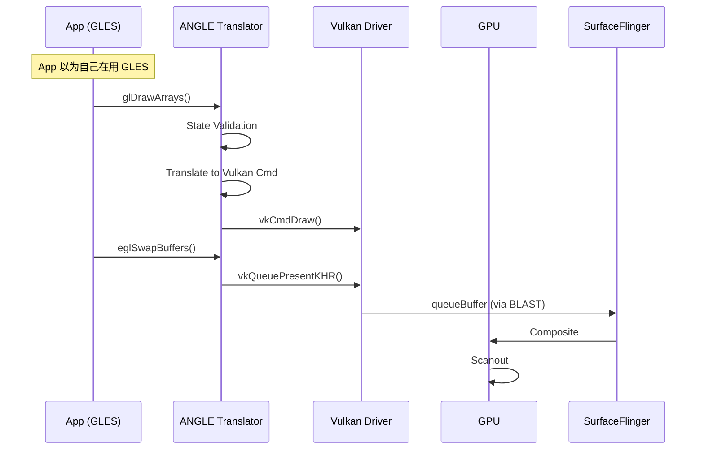

<!-- outline-start -->

**锚点（必须覆盖）：**
- ANGLE 解决的核心问题：GLES 驱动碎片化
- 翻译层架构：GLSL → SPIR-V → Vulkan
- 渲染时序：App 调用 GLES → ANGLE 翻译 → Vulkan 执行
- 性能特征：翻译开销 vs 驱动一致性收益
- 在 Perfetto 中识别 ANGLE 层的方法

**扩展（可选深入）：**
- ANGLE 启用检测与调试
- Shader 编译差异（GLSL vs SPIR-V pipeline cache）
- Android 15+ 的 ANGLE 生态趋势

<!-- outline-end -->

## 为什么需要 ANGLE

Android 的 GLES 兼容性长期受厂商驱动差异影响。同一个 `glDrawArrays` 调用或同一份 GLSL，在不同设备上可能遇到结果偏差、shader 编译差异，或者直接踩到驱动 Bug。

**ANGLE**（Almost Native Graphics Layer Engine）是 Google 维护的开源图形翻译层。App 侧仍然调用 GLES API，ANGLE 负责把 GLES 状态和命令翻译成 Vulkan 指令，再交给厂商 Vulkan driver 执行。统一的是 GLES frontend、状态管理和 shader 翻译流程，底层执行仍然落在厂商 Vulkan driver 和 GPU 上。

Android 10 起支持把 ANGLE 作为 GLES driver 选项。Android 15 之后，Google 继续扩大 ANGLE 的覆盖范围，官方口径是兼容性更好，部分场景性能更好。默认是否启用仍取决于设备配置、allowlist 和调试开关。

## 核心架构

ANGLE 的翻译流程可以概括为三个步骤：

```mermaid
graph TD
    subgraph "App Layer"
        App[App (GLES Calls)]
    end
    
    subgraph "ANGLE Layer"
        Translator[GLES → Vulkan Translator]
        Shader[SPIR-V Compiler]
        State[State Tracker]
    end
    
    subgraph "System"
        VK[Vendor Vulkan Driver]
        GPU[GPU]
    end
    
    App -->|glDrawArrays| Translator
    Translator -->|vkCmdDraw| VK
    Translator -->|Shader| Shader
    Shader -->|SPIR-V| VK
    VK -->|Execute| GPU
```

1. **GLES API 拦截**：App 调用 `glDrawArrays`、`glUseProgram` 等 GLES 函数，被 ANGLE 的翻译层拦截。
2. **状态跟踪**：ANGLE 维护一个 GLES 状态机的镜像，将隐式的 GLES 状态转换为 Vulkan 所需的显式状态。
3. **Shader 翻译**：GLSL Shader 源码先编译为 SPIR-V，再由厂商 Vulkan driver 编译为 GPU Binary。
4. **Vulkan 指令生成**：GLES 绘制调用被翻译为 Vulkan Command Buffer 操作，提交给 Vulkan 队列。

## 启用条件与运行时选路

AOSP 里，`GraphicsEnvironment.queryAngleChoice()` 会先决定当前进程该走哪条 GLES driver 路径，顺序如下：

1. `Settings.Global.ANGLE_GL_DRIVER_ALL_ANGLE`，ADB 对应键 `angle_gl_driver_all_angle`。值为 `1` 时，全局强制走 ANGLE。
2. `angle_gl_driver_selection_pkgs` 和 `angle_gl_driver_selection_values`。两个设置按逗号分组，按包名给出 `angle`、`native` 或 `default`。
3. 平台自带 allowlist，AOSP 资源里是 `config_angleAllowList`。

如果结果是 `angle`，`GraphicsEnvironment.setupAngle()` 会先尝试 ANGLE APK，再回退到 system ANGLE。EGL loader 随后在 `frameworks/native/opengl/libs/EGL/Loader.cpp` 按当前选择加载 ANGLE 或 native GLES driver。ANGLE 路径的实际执行路径是 ANGLE frontend → vendor Vulkan driver → GPU。Vulkan driver 自身的行为差异仍然会透传到应用侧。

如果结果是 `native`，loader 会回到设备自带 GLES driver。调试时需要把设置值和运行时证据放在一起看，因为 ANGLE APK 缺失、库加载失败、system ANGLE 与 native driver 切换都会影响最终落点。

## 渲染时序

从 App 的视角，它仍然在调用 GLES API。底层执行路径已经变成 ANGLE frontend → vendor Vulkan driver → GPU，每一段都会引入自己的成本：



关键差异点：

| 操作 | 原生 GLES | ANGLE 翻译后 |
|:---|:---|:---|
| `glDrawArrays` | 直接调用 GLES 驱动 | 翻译为 `vkCmdDraw` |
| `glShaderSource` | GLSL → GPU Binary | GLSL → SPIR-V → GPU Binary |
| `eglSwapBuffers` | GLES 驱动处理 | 翻译为 `vkQueuePresentKHR` |

## 性能特征

ANGLE 带来的主要收益在兼容性和行为收敛。性能方向要按 workload 判断，Android 官方对它的表述也是“兼容性更好，部分场景性能更好”。

| 维度 | 原生 GLES 路径 | ANGLE 路径 |
|:---|:---|:---|
| Driver frontend | 厂商 GLES driver | ANGLE GLES frontend + 厂商 Vulkan driver |
| Shader 路径 | GLSL → vendor compiler | GLSL → SPIR-V → vendor pipeline |
| 状态管理 | 厂商维护 GLES 状态机 | ANGLE 做状态映射，再落到 Vulkan |
| 调试可见性 | 厂商差异较大 | ANGLE 路径更容易和源码、设置项对应 |

常见成本来自几处：

- **Shader 首次编译**：多了一层 GLSL → SPIR-V，再进入 Vulkan pipeline 建立
- **State mapping**：GLES 的隐式状态要转换成 Vulkan 的显式状态
- **命令翻译**：Draw call、render pass、同步对象都要经过一层映射
- **Cache 冷启动**：pipeline cache 未命中时，首帧和场景切换更容易抬高 CPU / GPU 开销

更容易受益的场景，通常是原生 GLES driver 质量不稳定、机型差异大，或者需要把问题稳定复现到一条更统一的图形路径上。更容易吃亏的场景，通常是 shader 首编很多、pipeline churn 明显，或者目标机型的原生 GLES driver 本来就足够成熟。同一份 workload 在两台设备上可能得出相反结论，发布前要在目标机型上对比 native 与 ANGLE 两条路径。

## 在 Perfetto 中识别 ANGLE

单看 `vkQueueSubmit` 或 `vkCmdDraw` 不够。native Vulkan、Skia Vulkan、系统图形组件都可能产生 `vk*` slice。确认 ANGLE 时，要把 driver 选择、运行时标识和目标进程 trace 放在一起看。

建议至少打开这几类数据源：

- Graphics and display
- SurfaceFlinger
- GPU render stages / counters
- 目标进程的 Vulkan 相关 slice 或 track_event 数据（设备支持时）

### 1. 先确认 driver 选择

```bash
# 读取当前设置
adb shell settings get global angle_gl_driver_all_angle
adb shell settings get global angle_gl_driver_selection_pkgs
adb shell settings get global angle_gl_driver_selection_values

# 全局强制 ANGLE（调试后记得恢复）
adb shell settings put global angle_gl_driver_all_angle 1
adb shell settings put global angle_gl_driver_all_angle 0

# 按包切到 ANGLE
adb shell settings put global angle_gl_driver_selection_pkgs com.example.demo
adb shell settings put global angle_gl_driver_selection_values angle
```

`angle_gl_driver_selection_pkgs` 和 `angle_gl_driver_selection_values` 在 AOSP 中按逗号一一对应。查多包配置时，要确认两个列表长度一致。

### 2. 再看运行时标识

- `glGetString(GL_RENDERER)` 返回值包含 `ANGLE`，例如 `ANGLE (Vendor, Vulkan 1.3.x, ...)`
- debuggable 进程可以结合 `logcat | grep ANGLE` 或进程已加载库，确认 ANGLE 库已经进入目标进程

### 3. 限定目标进程做 trace 归因

```sql
SELECT p.name AS process,
       t.name AS thread,
       s.name,
       ROUND(s.dur / 1e6, 3) AS dur_ms
FROM slice s
JOIN thread_track tt ON s.track_id = tt.id
JOIN thread t ON tt.utid = t.utid
JOIN process p ON t.upid = p.upid
WHERE p.name = 'com.example.demo'
  AND (s.name GLOB 'vk*' OR s.name LIKE '%ANGLE%')
ORDER BY s.ts DESC
LIMIT 50;
```

这条查询只能说明目标进程走过 Vulkan 路径。把它和 settings、`GL_RENDERER`、已加载库放在一起，才能把 `vk*` slice 归因到 ANGLE。需要更细的 command 级证据时，用 AGI 抓一帧会更稳。

## 开发者建议

1. **测试覆盖**：确保 App 在 ANGLE 和原生 GLES 下都测试过，特别是依赖厂商扩展（`GL_QCOM_*` 等）的代码
2. **Shader 规范**：ANGLE 对 GLSL 语法要求更严格，不合规的 GLSL 会直接报错
3. **新项目优先 Vulkan**：如果不需要兼容旧设备，直接用 Vulkan 比 ANGLE 更高效

## 与其他章节的关系

- **2.14 图形 API 演进与选择策略**：ANGLE 在 Android 图形生态中的定位
- **18.8 OpenGL ES 渲染链路**：原生 GLES 链路，与 ANGLE 形成对比
- **18.9 Vulkan 原生渲染链路**：ANGLE 底层走的就是 Vulkan


<!-- AIW-源码调研-2026-04-18 -->
## Driver-Selection 机制：分层决策链

> 以下内容基于 AOSP android-14.0.0_r1 源码深度调研补充。

### 决策入口：GraphicsEnvironment.setup()

ANGLE driver selection 的 Java 层决策集中在一个类：`android.os.GraphicsEnvironment`（`frameworks/base/core/java/android/os/GraphicsEnvironment.java`）。

关键调用链：

```
ActivityThread.attach()
  └─> GraphicsEnvironment.getInstance().setup(context, coreSettings)
        ├─> setupGpuLayers()           — Debug layer 路径配置
        ├─> setupAngle()                — ANGLE 包发现 + setAngleInfo() JNI
        │     └─> shouldUseAngle() / shouldUseAngleInternal()
        └─> chooseDriver()              — Updatable driver 选择
```

核心方法是 `shouldUseAngleInternal()`，其**优先级顺序**如下：

**优先级 1**：`Settings.Global.ANGLE_GL_DRIVER_ALL_ANGLE`（ADB: `angle_gl_driver_all_angle`）
- 值 `1`：全局强制所有进程走 ANGLE（进程启动后生效，重启清除）
- 设备厂商可利用此机制在系统层面灰度切 ANGLE

**优先级 2**：`angle_gl_driver_selection_pkgs` + `angle_gl_driver_selection_values`
- 前者填包名（逗号分隔），后者填驱动选择（`angle` / `native` / `default`，逗号对应）
- 两个列表必须等长；列表外的包不触发此规则

**优先级 3**：Game Mode ANGLE（Android 12+）
- `GameManager.isAngleEnabled(packageName)` — Game Mode API 的一部分
- OEM 可通过 Game Mode 干预对游戏启用 ANGLE，无需用户手动开启 Developer Options
- 在 GraphicsEnvironment 中通过 `isAngleEnabledByGameMode()` 查询

**优先级 4**（兜底）：Platform allowlist — `a4a_rules.json`

```java
// GraphicsEnvironment.shouldUseAngleInternal() 简化逻辑
private boolean shouldUseAngleInternal(Context context, Bundle bundle, String packageName) {
    // 1. 全局开关
    if (allUseAngle == ANGLE_GL_DRIVER_ALL_ANGLE_ON) return true;

    // 2. 按包配置
    int pkgIndex = getPackageIndex(packageName, optInPackages); // optInPackages 从 Settings.Global 读取
    if (pkgIndex >= 0) {
        String optInValue = optInValues.get(pkgIndex);
        if (optInValue.equals("angle")) return true;
        if (optInValue.equals("native")) return false;
    }

    // 3. Game Mode（Android 12+）
    return isAngleEnabledByGameMode(context, packageName);
}
```

### ANGLE 包发现：Debug Package vs System ANGLE

`GraphicsEnvironment.setupAngle()` 负责找到可用的 ANGLE 库，有两条路径：

**路径 A — Debug Package（用户通过 ADB 指定）**：
```bash
adb shell settings put global angle_debug_package org.chromium.angle
```
- 通过 `Settings.Global.ANGLE_DEBUG_PACKAGE` 读取
- **仅对 debuggable 进程生效**（`isDebuggable()` 检查）
- 不要求预装，可加载任意已安装 APK 中的 ANGLE 库

**路径 B — System ANGLE（预装系统应用）**：
- 通过 `ACTION_ANGLE_FOR_ANDROID` intent 在 PackageManager 中查询
- 要求 `PackageManager.MATCH_SYSTEM_ONLY` — 必须是 system app
- 通常对应 `org.chromium.angle` 系统 APK（在 Google 设备上预装）

**关键约束**：ANGLE 只能用于 **Java 运行时启动的进程**；SurfaceFlinger 和 native executable 无法使用 ANGLE。

### A4A Rules JSON：Platform Allowlist 机制

ANGLE APK 内置 `a4a_rules.json`（Chromium 仓库路径：`src/feature_support_util/a4a_rules.json`），定义平台级 ANGLE 启用规则：

```json
{
   "Rules":[
      {
         "Rule":"Default Rule (i.e. use native driver)",
         "UseANGLE":false
      },
      {
         "Rule":"Supported application(s)",
         "UseANGLE":true,
         "Applications":[{"AppName":"org.chromium.angle"}],
         "Devices":[{"Manufacturer":"Google"}]
      }
   ]
}
```

解读：
- **默认规则**：使用 native driver，不自动启用 ANGLE
- **规则 2**：仅允许 `org.chromium.angle` 包在 Google 设备上默认走 ANGLE
- 临时 override：`adb shell setprop debug.angle.rules /path/to/temp_rules.json`（重启清除）

### Debuggable/Dumpable 限制

ANGLE driver selection 的多个机制有 dumpable 限制：

| 机制 | 限制条件 |
|------|---------|
| `angle_debug_package` | 必须 debuggable（`isDebuggable()`）或 root |
| Debug layer injection | 必须 debuggable 或 `canInjectLayers()`（metadata flag） |
| `angle_gl_driver_selection_*` 全局设置 | debuggable App 或 root |
| Game Mode ANGLE | 无特殊限制，通过 GameManager API 生效 |

`isDebuggable()` 在 JNI 层对应 `GraphicsEnv::getInstance().isDebuggable()`，检查的是 `pr_get_dumpable()` 标志（Zygote fork 时设置）。

### EGL Loader 实际加载顺序

EGL Loader.cpp（`frameworks/native/opengl/libs/EGL/Loader.cpp`）接收 Java 层配置后的实际加载序列：

1. **ANGLE namespace 已设置** → 加载 `libEGL.so`（ANGLE 版本）到 ANGLE namespace
2. **Updatable driver path 已设置** → 从 APK 加载 vendor driver
3. **`ro.hardware.egl`** 系统属性 → 加载对应厂商 GLES driver
4. **Default** → 兜底加载默认 driver

ANGLE namespace 隔离确保 ANGLE 库的加载不会污染 system 库命名空间，使得同一设备上不同 App 可以使用不同的 GLES driver。

### ANGLE EGL Features：按包特性配置

`Settings.Global.ANGLE_EGL_FEATURES` 允许为每个包单独配置 ANGLE EGL 扩展列表，通过冒号分隔：

```java
// GraphicsEnvironment.getAngleEglFeatures()
final List<String> featuresLists = getGlobalSettingsString(
    context.getContentResolver(), coreSettings, Settings.Global.ANGLE_EGL_FEATURES);
return featuresLists.get(mAngleOptInIndex).split(":");
```

这些特性字符串（如 `angle_platform_angle`）最终通过 `setAngleInfo()` 传递给 ANGLE C++ 层，控制 ANGLE 启用哪些 EGL 扩展。


## 参考资料

- Google ANGLE 项目：https://chromium.googlesource.com/angle/angle/
- AOSP `frameworks/base/core/java/android/os/GraphicsEnvironment.java`
- AOSP `frameworks/native/opengl/libs/EGL/Loader.cpp`
- AOSP `external/angle/`
