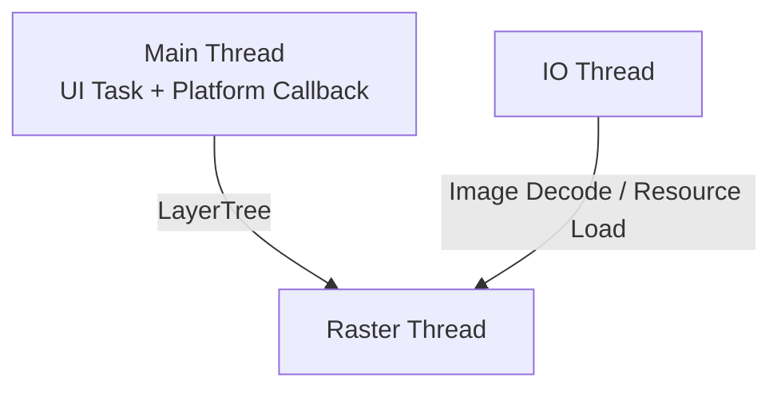
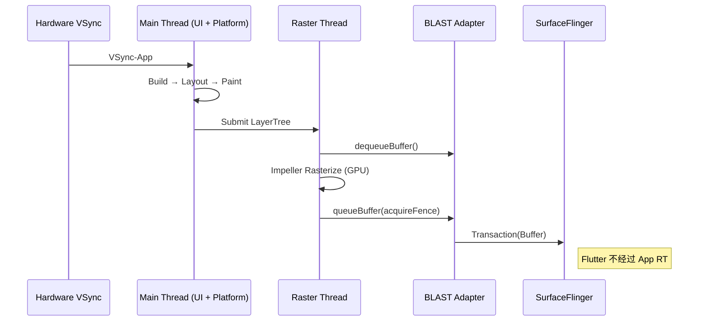
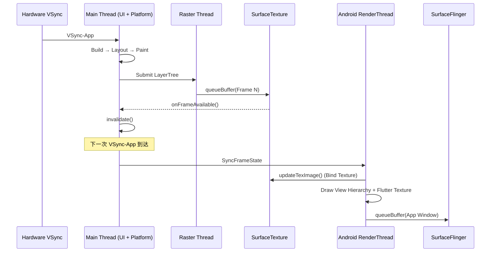

---


title: Flutter 渲染管线
chapter: '18.12'
status: ready-for-review
applicable_versions: Flutter 3.29+（Merged Platform Model 主路径） / Flutter 3.27+（Android
  API 29+ 默认 Impeller） / Android 10 (API 29) - Android 16 (API 36)
tags:
- Flutter
- Impeller
- Skia
- SurfaceView
- TextureView
- Merged-Thread
- PlatformView
- 渲染管线
related_chapters:
- '2.5'
- '2.11'
- '18.6'
- '18.7'
created_by: rendering-pipelines-merge
created_date: '2026-04-09'
sources:
  - Flutter 官方文档：Flutter rendering pipeline
  - Flutter 官方文档：Impeller rendering engine
  - Flutter engine 仓库：shell/platform/android/
section: '18.12'
review_notes: "2026-04-23 task6 re-review (revisiting): pass-light-edit. 10 L1 fixes (禁用词「链路」→「管线」全量替换: 标题/tags/大纲/正文). 无B类大问题。评分: 结构5/5·措辞4/5·一致性4/5·验证4/5·元数据4/5。"
task6_state: reviewed
pipeline_stage: task6_pending
task9_state: pending
task2b_state: fixed
reviewed_by: "openclaw-task6"
reviewed_date: 2026-06-04
task6_result: "pass-light-edit"
task2b_result: fixed
last_task2b_at: 2026-06-04T12:54:39
task9_result: needs-rework
task9_reviewed_by: openclaw-task9
task9_reviewed_date: "2026-04-26"
last_task9_at: "2026-04-26T13:26:21+08:00"
repaired_date: "2026-04-26"
repaired_by: "openclaw-task2b"
last_task9_audit: "2026-05-21"
last_task9_audit_at: "2026-05-21T06:36:00+08:00"
last_task9_audit_log: "logs/deep-review/2026-05-21-06-audit-18.12.md"
task2b_notes: 2026-06-04 Task2B main 回炉：新增 VSync 协调扩展锚点（VsyncWaiter → Choreographer 链路、Merged Model 差异、TextureView 额外延迟、Perfetto 观察点）；P0 RenderMode.image 和 P1 HCPP 已在前序修复中修正，确认本轮文本已覆盖
last_task6_at: "2026-06-04T15:21:59.742576+08:00"
task6_reviewed_date: 2026-06-04
task6_reviewed_by: "openclaw-task6"
task6_l1_l2_fixes: 0
task6_l3_l4_issues: 0
task6_review_notes: "2026-06-04 Task6 revisiting review: pass-light-edit。本轮无 L1/L2 问题，无新增 L3/L4 回炉项。"
---
<!-- outline-start -->

**锚点（必须覆盖）：**
- Flutter 线程模型：Flutter 3.29+ 的 Merged Platform Model（UI + Platform 合并）
- Main Thread（Dart UI task）→ Raster Thread → GPU → Display 的渲染管线
- Impeller vs Skia 渲染后端
- SurfaceView render mode vs TextureView render mode
- Platform Views 的 Hybrid Composition 模式
- 在 Perfetto 中识别 Flutter 渲染管线的方法

**扩展（可选深入）：**
- Flutter 3.29+ Merged Model 的线程优化
- Platform View 的 Z-Order 和手势问题
- Flutter 与宿主 App 的 VSync 协调

<!-- outline-end -->

## 为什么 Flutter 的渲染管线值得单独一章

Flutter 在 Android 上的渲染管线与原生 App 有本质区别：**Flutter 不走 Android View 体系的 Measure/Layout/Draw 流程**。它有一套完全独立的渲染管线，Dart 代码生成 LayerTree，C++ Raster Thread 将 LayerTree 光栅化为像素，最终通过独立 Surface 或 SurfaceTexture 提交给 SurfaceFlinger。

理解这条管线，你才能在 Perfetto 中区分"Flutter Dart 代码慢了"、"Raster Thread GPU 光栅化慢了"和"宿主 App 侧的合成慢了"，这三类问题的优化方向完全不同。[已验证: Flutter 官方文档]

## 版本边界

这一章把三个边界拆开写，避免把线程模型、渲染后端和 Android API 范围压成一个版本号：

- **线程模型**：正文主线按 Flutter 3.29+ 的 merged model 讲，UI task 和平台回调都落在宿主 Main thread
- **渲染后端**：Impeller 自 Flutter 3.27 起在 Android API 29+ 默认启用，低版本或不满足条件时仍可能回退到 Skia
- **Android 侧范围**：Platform Views、SurfaceView、TextureView 的组合能力跨多个 Android 版本存在，具体代价要按嵌入控件和系统版本分别判断
- **Platform Views 演进**：Flutter 3.44+ 新增 Hybrid Composition++（HCPP），实验性 opt-in，要求 Android API 34+ 和 Vulkan，不满足条件时回退到 HC/TLHC

## 线程模型：Merged Platform Model

本文主线按 Flutter 3.29+ 在 Android 上的 merged model 讲。此时 Dart UI task、MethodChannel、插件回调和 Activity 生命周期回调都落在宿主 Main thread 上。Perfetto 里最先要找的是一个合并后的 Main 视图，而不是单独的 `Platform Thread`。



Engine 内部仍有 task runner 的概念，但在 merged model 下，插件和平台代码看到的是宿主主线程。把 `platform task` 直接画成独立线程，会把 Trace 里的瓶颈归因搞反。

| 线程 | 职责 | 常见观察点 |
|:---|:---|:---|
| **Main（UI + Platform）** | Dart Build/Layout/Paint、MethodChannel、插件回调、Activity 生命周期与输入回调 | `Engine::BeginFrame`、MethodChannel 回调、Dart Build/Layout/Paint |
| **Raster Thread** | LayerTree 光栅化、GPU 指令提交 | `Rasterizer::DrawToSurfaces` |
| **IO Thread** | 图片解码、资源加载 | `ImageDecoder` |

如果工程仍停留在旧版 engine 或定制 embedding，上述主线程合并可能没有完全生效。遇到这类 Trace，先按工程实际 Flutter 版本确认线程模型，再做归因。

## 渲染管线全景

Flutter 的渲染流程分为四个阶段，每个阶段对应不同的线程和组件。

### 阶段一：Main Thread（Dart UI Task）

Android `Choreographer` 发出的 VSync-App 到达宿主 Main thread 后，Flutter engine 在同一线程执行 Dart UI task：

1. **Build**：执行 `Widget.build()`，构建 Element Tree。
2. **Layout**：`RenderObject.performLayout()`，计算每个渲染对象的大小和位置（对应 Android 的 Measure/Layout，但全在 Dart 里完成）。
3. **Paint**：`RenderObject.paint()`，生成 **LayerTree**（图层树）——一份绘制指令列表，不产生像素。
4. **Submit**：将 LayerTree 打包，发送给 Raster Thread。

### 阶段二：Raster Thread（光栅化）

1. **LayerTree Processing**：接收 Main Thread 提交的 LayerTree，进行优化和合成排序。
2. **Rasterization**：
   - **Impeller**（Flutter 3.27+ 在 Android API 29+ 的默认后端）：使用预编译 Shader，优先走 Vulkan，不满足条件时可回退到 GLES
   - **Skia**（旧版默认或回退路径）：运行时编译 GLSL Shader
3. **Present**：通过 `vkQueuePresentKHR`（Vulkan）或 `eglSwapBuffers`（GLES）提交到 Surface。

### 阶段三：系统合成

取决于 render mode：
- **SurfaceView mode**：直接提交到独立 Surface，由 SurfaceFlinger 合成
- **TextureView mode**：提交到 SurfaceTexture，由宿主 RenderThread 再合成

## SurfaceView vs TextureView Render Mode

这是 Flutter 在 Android 上最重要的管线选择，直接决定了性能特征。

Android 侧的入口可以直接对照 Flutter engine 仓库里的 `shell/platform/android/io/flutter/embedding/android/FlutterSurfaceView.java`、`FlutterTextureView.java` 和 `io/flutter/view/VsyncWaiter.java`。Render mode 决定 Embedding 层创建哪种宿主 View，`VsyncWaiter` 决定 Flutter 怎样接上 Android `Choreographer` 的节拍。

### SurfaceView Render Mode（推荐默认）

Flutter 的独立 Surface 直接与 SurfaceFlinger 交互，**不经过宿主 App 的 RenderThread**。



**优势**：主要绕开宿主 RenderThread 的纹理采样与窗口合成路径。全屏 Flutter 页面、视频、游戏场景更容易拿到更低的合成开销。宿主主线程一旦阻塞，Dart 的 Build/Layout/Paint 和平台回调仍会一起变慢。

**限制**：Flutter SurfaceView 与宿主原生 View 仍是两个独立 Layer，普通 View 很难和它做稳定的 Z 轴交错、View 级 transform 和圆角裁剪。透明背景是另一回事：`RenderMode.surface` 可以配合 `TransparencyMode.transparent` 输出透明 Surface，但这不会消掉独立 Layer 的边界。

### TextureView Render Mode（兼容路径）

Flutter 渲染到 SurfaceTexture，再由宿主 App RenderThread 采样合成到主窗口。



宿主侧的上屏过程是：`SurfaceTexture.setOnFrameAvailableListener()` 先把新帧消息抛回宿主主线程，主线程触发 `invalidate()`，再等下一次 VSync 由宿主 `RenderThread` 执行 `updateTexImage()`，把 Flutter 的离屏结果采样进应用窗口。Flutter Raster Thread 只负责把帧写进 `SurfaceTexture`；真正能不能按时上屏，还要看宿主主线程和 `RenderThread` 是否空闲。

**优势**：可以当普通 View 使用，支持 alpha、rotation、scale、clip 等 View 级变换。

**代价**：多一次宿主侧纹理采样和同步；帧率上限受宿主窗口渲染节奏约束；宿主主线程或 `RenderThread` 一忙，Flutter 帧就会卡在 `updateTexImage()` 之前。

### 选型建议

| 场景 | 推荐 Mode | 理由 |
|:---|:---|:---|
| 全屏 Flutter App | SurfaceView | 直接走独立 Surface，合成链更短 |
| Flutter 嵌入复杂 View 层级 | TextureView | 需要和宿主普通 View 交错、一起参与 View 级变换 |
| 需要透明背景，但不要求和宿主 View 做复杂交错 | SurfaceView + `TransparencyMode.transparent` | 透明可以保留 Surface 路径，不必为了“透明”直接切到 TextureView |
| 需要圆角、旋转、alpha 动画 | TextureView | 这类效果依赖普通 View 变换与裁剪 |
| 视频 / 游戏 | SurfaceView | 延迟更低，宿主 RenderThread 负担更小 |

### `FlutterActivity` 的默认 `RenderMode` 怎么定

`FlutterActivity` 的默认 `RenderMode` 和 `BackgroundMode` 绑定，不是统一的硬编码默认：

| `BackgroundMode` | 默认 `RenderMode` | 承载 View | 为什么这样选 |
|:---|:---|:---|:---|
| `opaque` | `RenderMode.surface` | `FlutterSurfaceView` | 不透明背景下 SurfaceView 直出最省事 |
| `transparent` | `RenderMode.texture` | `FlutterTextureView` | SurfaceView 的挖洞机制不支持透明混合，只能走 TextureView |

嵌入到其他 View 层级（`FlutterFragment` 或 `FlutterView` 直接使用）时，`RenderMode` 由调用方显式配置，不走这套默认推断。SurfaceView 模式下还存在 z-ordering 约束——`FlutterSurfaceView` 背后的 Surface 默认在 Window 下方，可通过 `setZOrderOnTop` / `setZOrderMediaOverlay` 调整，这会影响 SurfaceFlinger 侧的 layer 叠加关系（参见 [18.6 SurfaceView 直出路径](06-surfaceview.md#z-order-与图层结构)）。

[已验证: Flutter engine `shell/platform/android/io/flutter/embedding/android/FlutterActivity.java` `getRenderMode()` + `FlutterSurfaceView.java` 默认 z-order 行为]

### Flutter 与宿主 App 的 VSync 协调

Flutter engine 在 Android 上通过 `VsyncWaiter` 接上宿主 `Choreographer` 的 VSync-App 节拍。这不是"Flutter 自己生成一个 VSync"，而是复用 Android 已有的帧率驱动信号。理解这一层，才能在 Perfetto 中区分"Flutter 自己慢了"和"宿主 VSync 安排出问题了"。

**核心链路**：

```
Android Choreographer → VsyncWaiter.asyncWaitForVsync()
    → Flutter Engine (Shell) 收到 VSync 回调
    → Animator::BeginFrame → Dart Build/Layout/Paint
    → Rasterizer::DrawToSurfaces
```

`VsyncWaiter` 在 Android embedding 层以 `Choreographer.FrameCallback` 注册回调，每次 `doFrame` 到达时通过 JNI 通知 engine 的 `Shell::OnVsync`。engine 内部把这当成"可以开始下一帧"的信号，驱动整个 Dart → Raster 管线。

**Merged Model 下的区别（Flutter 3.29+）**：

在旧版 engine（UI Thread 独立）中，`VsyncWaiter` 收到回调后还需要跨线程唤醒 UI Thread，增加一次线程同步延迟。Merged Model 下，`VsyncWaiter`、Dart UI task、平台回调都在同一条 Main Thread 上，VSync 回调到达后可以立即进入 Build/Layout/Paint——没有跨线程唤醒开销。

**TextureView Mode 下的额外延迟**：

`SurfaceTexture.setOnFrameAvailableListener()` 的回调也落在 Main Thread。如果这个回调的执行时间与 VSync-App 到达时间产生竞争，宿主 `RenderThread` 的 `updateTexImage()` 可能延迟到下一个 VSync 周期才能执行，Flutter Raster Thread 产出的帧要多等 1 帧才能上屏。

**Perfetto 观察点**：

| 观察目标 | 轨道/关键词 | 怎么看 |
|:---|:---|:---|
| VSync 信号是否准时到达引擎 | `Choreographer#doFrame` → `VsyncWaiter.asyncWaitForVsync` | 两个 slice 之间的间隔应在 1ms 以内；超过 2ms 说明宿主主线程有阻塞 |
| Merged Model 是否生效 | 查看 Main Thread 上是否同时有 `Engine::BeginFrame` 和 `Choreographer#doFrame` | 二者在同一线程轨上相邻出现 = merged model 生效 |
| TextureView 模式下的帧延迟 | `SurfaceTexture.onFrameAvailable` → `updateTexImage` → `DrawFrame` | 如果 `updateTexImage` 的 slice 比 `SurfaceTexture.onFrameAvailable` 晚超过 1 个 VSync 周期，宿主 RenderThread 在背锅 |

**常见问题**：

- **宿主主线程阻塞拖慢 Flutter VSync**：如果在 VSync-App 到达时宿主主线程正在执行长时间操作（如复杂的 MethodChannel 回复、大量平台 View 的 measure/layout），`VsyncWaiter` 的回调会被推迟，Flutter 的 BeginFrame 也会相应延迟。
- **RenderThread 过载导致 TextureView 帧堆积**：宿主 RenderThread 忙不过来时，`updateTexImage()` 会积压，Flutter 已经产出的帧迟迟不能上屏。
- **SurfaceView mode 不受宿主 RenderThread 影响**：这是 SurfaceView 在性能上的核心优势——Flutter 的 VSync 节奏只受宿主主线程影响（共用一条线程），`Raster Thread` 产出后直接通过 BLAST 提交，不需要宿主 RenderThread 采样。

### `FlutterImageView` 与 `RenderMode.image`

`io.flutter.embedding.android.RenderMode` 当前包含三个枚举值：`surface`、`texture`、`image`。常规 `FlutterActivity`/`FlutterFragment` 默认路径主要在 `surface`/`texture` 之间选择；`image` 对应 `FlutterImageView`/`ImageReader`/`Canvas` 路径，多用于 PlatformView 交互、overlay 或内部转换场景。

`FlutterView(Context, FlutterImageView)` 构造器会创建 `image` 模式的视图，但旧的 `FlutterView(Context, RenderMode)` 构造器不支持 `image`。`FlutterImageView` 的主要角色是：

- **Hybrid Composition 下 overlay Surface 的承载 View**：`PlatformViewsController.createOverlaySurface(...)` 在 HC 路径里创建 `ImageReader` 提供的 Surface 作为 overlay，结果由 `FlutterImageView` 承载并绘回宿主 View 层级；
- **`FlutterView.convertToImageView()` 特殊过渡场景**：内部能力，遇到需要把当前 Flutter 内容快照为 image 时使用。

`FlutterImageView` 的渲染链路是：Engine 渲染到 `ImageReader` 提供的 Surface → `acquireLatestImage()` → API 29+ 主要走 `Image` → `HardwareBuffer` → `Bitmap.wrapHardwareBuffer()`（`Config.HARDWARE`）→ `Canvas.drawBitmap` 绘到宿主。Trace 上看到 `FlutterImageView` 相关 slice 时，不要把它当成独立 root render mode 分析——它是 HC overlay 的承载形态。

[已验证: Flutter engine `shell/platform/android/io/flutter/embedding/android/FlutterImageView.java` + `io/flutter/plugin/platform/PlatformViewsController.java` `createOverlaySurface`]

## Platform Views 嵌入

当 Flutter 需要嵌入原生 Android View（如 WebView、MapView）时，要分开看两套开关：

1. **Flutter 根视图 render mode**：SurfaceView 或 TextureView，决定 Flutter 内容怎么出图
2. **Platform Views composition mode**：Hybrid Composition 或 Texture Layer Hybrid Composition，决定原生 View 怎么和 Flutter 内容组合

这两套配置会叠加出不同的性能边界，不能混成一句“某种模式更快”。Android 10 是一个明显分水岭：Hybrid Composition 在 Android 10+ 可以借助 `SurfaceControl` 把 Platform View 和 Flutter 内容交给 SurfaceFlinger 做 Layer 级合成，Z-order、输入和 a11y 路径都更稳；Android 10 之前没有这条路，拷贝和同步成本会高不少。

| Composition mode | 适合场景 | 优点 | 主要代价 |
|:---|:---|:---|:---|
| **Hybrid Composition** | WebView、MapView、输入与无障碍要求高的控件 | 原生 View 更接近 Android 自身行为；Android 10+ 走 `SurfaceControl` 合成后，Layer 组织更稳定 | Flutter 自身渲染更容易掉帧；Android 10 之前拷贝和同步成本更高 |
| **Texture Layer Hybrid Composition** | 需要变换、裁剪、透明度、和 Flutter 内容一起动画的控件 | Flutter 侧变换能力更完整，宿主布局融合更灵活 | WebView 快速滚动更容易 janky；若嵌入树里出现 SurfaceView，可能被挪进 virtual display，a11y 也会受影响；文本放大镜依赖 Flutter 以 TextureView 渲染 |
| **Hybrid Composition++ (HCPP)** | Flutter 3.44+ 实验性 opt-in；目标改善原 Hybrid Composition 的合成性能与同步问题 | 减少原生 View 与 Flutter 内容之间的合成开销；同步更高效 | 要求 Android API 34+ 与 Vulkan 后端，条件不满足时自动回退到 HC/TLHC；仍为实验性方案，API 可能变化 |

再按控件类型看，差异会更直观：

| 嵌入对象 | Hybrid Composition | Texture Layer Hybrid Composition |
|:---|:---|:---|
| **WebView** | 滚动、输入、a11y 路径更稳，适合正文阅读和表单 | 做透明叠加和动画更方便，但快速滚动更容易抖 |
| **MapView** | 原生手势与无障碍行为更接近 Android 默认实现 | 适合做裁剪、缩放、透明过渡，但高频相机移动时要盯紧纹理采样成本 |
| **SurfaceView 类控件** | 更接近原生独立 Layer 路径 | 不是默认优先项，容易触发 virtual display 退化，a11y 和合成链都会更复杂 |

因此，Platform Views 这部分不能只写“Hybrid Composition 性能较好”或“Texture Layer 更灵活”。真正要看的，是目标控件类型、滚动模式、是否依赖 a11y，以及是否需要跟 Flutter 内容一起做动画。

## 在 Perfetto 中识别 Flutter 管线

先把采样条件固定下来：优先用 profile / release 构建，打开 `gfx`、`view`、`sched`、`surfaceflinger` 相关数据源，录制一段能稳定复现卡顿的交互。没有截图时，直接在 Perfetto UI 里搜 `Engine::BeginFrame`、`Rasterizer::DrawToSurfaces`、`updateTexImage`、`DrawFrame`，定位会更快。

| 场景 | 轨道 / 关键词 | 该看什么 |
|:---|:---|:---|
| Flutter UI 阶段 | `Engine::BeginFrame`、`Build`、`Layout`、`Paint` | Main Thread 上的 Dart UI task 是否在 VSync 后及时进入 Build/Layout/Paint |
| Flutter 光栅化 | `Rasterizer::DrawToSurfaces`、`EntityPass::*` | Raster Thread 是否把一帧及时光栅化完成 |
| SurfaceView mode | App 进程里的 Flutter 轨道 + SurfaceFlinger 独立 Flutter Layer | Flutter 独立 Layer 是否按节拍提交；若宿主页面平稳、Flutter Layer 自己断节拍，问题多半在 Flutter 侧 |
| TextureView mode | 宿主主线程 `invalidate()`、宿主 `RenderThread` 的 `DrawFrame` / `updateTexImage()` | Flutter 帧是否已经准备好，但卡在宿主 `RenderThread` 的采样和合成上 |
| 图片 / 资源加载 | `ImageDecoder`、IO Thread | 先判断卡顿是否来自解码和资源准备，再决定要不要回到渲染链 |

**轨道观察清单**：

- **SurfaceView mode**：能看到 Main Thread 上的 Dart UI task 与 Raster Thread 正常推进，同时 SurfaceFlinger 里有独立 Flutter Layer 跟着提交；这类 trace 往往先查 Flutter 自身的 Dart / Raster 阶段。
- **TextureView mode**：先确认 Raster Thread 已经产出新帧，再看宿主主线程有没有及时 `invalidate()`，以及宿主 `RenderThread` 的 `updateTexImage()` / `DrawFrame` 有没有被拖长。
- **Platform Views**：如果页面里同时有 WebView 或 MapView，再叠看 SurfaceFlinger Layer 和宿主窗口轨道，判断卡顿落在 Flutter 自身、Platform View，还是宿主合成。

**诊断思路**：
- Dart 阶段慢 → 优化 Widget 树、减少 rebuild
- Raster 阶段慢 → 减少 DrawCall、优化 Shader
- 宿主合成慢 → 检查 TextureView mode 下的 `updateTexImage()`、`DrawFrame` 和宿主 RenderThread 负载

## 与其他章节的关系

- **2.11 Flutter 渲染管线与性能**：Flutter 渲染机制的原理视角
- **18.6 SurfaceView / 18.7 TextureView**：Android 原生组件的管线对比
- **18.13 WebView 章节 / 7.11 WebView 性能优化**：分别对应嵌入式渲染过程和性能治理视角

## 参考资料

- Flutter 官方文档：Flutter rendering pipeline
- Flutter 官方文档：Hosting native Android views in your Flutter app with Platform Views
- Flutter 官方文档：Impeller rendering engine
- Flutter Android embedding Javadoc：RenderMode
- Flutter engine 仓库：`shell/platform/android/io/flutter/embedding/android/FlutterSurfaceView.java`
- Flutter engine 仓库：`shell/platform/android/io/flutter/embedding/android/FlutterTextureView.java`
- Flutter engine 仓库：`shell/platform/android/io/flutter/view/VsyncWaiter.java`
- Flutter engine 仓库：`shell/platform/android/`、`shell/`、`flow/`
