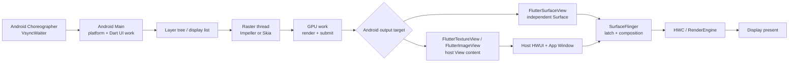
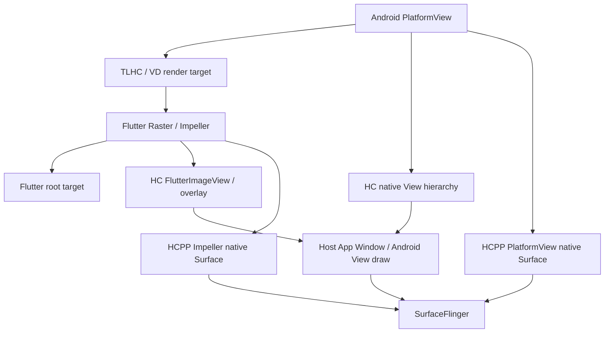

---

title: "Android 17 Flutter 渲染管线"
chapter: "18.12"
section: "18.12"
status: finalized
pipeline_stage: ready-to-publish
applicable_versions: "Flutter 3.32 stable+（Merged Platform Model 主路径） / Flutter 3.27+（Android API 29+ Impeller 默认） / Flutter 3.44+（HCPP experimental opt-in） / Android 10-17"
tags:
- Flutter
- Impeller
- Skia
- FlutterSurfaceView
- FlutterTextureView
- FlutterImageView
- SurfaceProducer
- PlatformView
- HCPP
- FrameTimeline
related_chapters:
- '2.11'
- '18.6'
- '18.7'
- '18.13'
sources:
- type: internal-reference
  path: /Users/gracker/Library/Mobile Documents/iCloud~md~obsidian/Documents/Writer/rendering_pipelines/S10_flutter_type.md
  role: Flutter root、external texture、PlatformView、fence、Perfetto 与版本边界
- type: internal-reference
  path: /Users/gracker/Library/Mobile Documents/iCloud~md~obsidian/Documents/Writer/rendering_pipelines/images/S10_flutter_architecture/source.md
  role: Flutter framework、engine、embedder 与 Android 显示架构
- type: internal-reference
  path: /Users/gracker/Library/Mobile Documents/iCloud~md~obsidian/Documents/Writer/rendering_pipelines/images/S10_flutter_engine_threads_architecture/source.md
  role: platform、Dart UI、Raster、IO 与 GPU 线程关系
- type: internal-reference
  path: /Users/gracker/Library/Mobile Documents/iCloud~md~obsidian/Documents/Writer/rendering_pipelines/images/S10_flutter_surface_render_mode_pipeline/source.md
  role: FlutterSurfaceView 独立 Surface 输出
- type: internal-reference
  path: /Users/gracker/Library/Mobile Documents/iCloud~md~obsidian/Documents/Writer/rendering_pipelines/images/S10_flutter_texture_render_mode_pipeline/source.md
  role: FlutterTextureView、SurfaceTexture 与宿主 HWUI 消费
- type: internal-reference
  path: /Users/gracker/Library/Mobile Documents/iCloud~md~obsidian/Documents/Writer/rendering_pipelines/images/S10_flutter_imageview_pipeline/source.md
  role: FlutterImageView、ImageReader 与宿主 Canvas/HWUI
- type: internal-reference
  path: /Users/gracker/Library/Mobile Documents/iCloud~md~obsidian/Documents/Writer/rendering_pipelines/images/S10_flutter_plugin_surfaceproducer_pipeline/source.md
  role: 插件 external texture 与 SurfaceProducer backing
- type: internal-reference
  path: /Users/gracker/Library/Mobile Documents/iCloud~md~obsidian/Documents/Writer/rendering_pipelines/images/S10_flutter_platformview_texturelayer_pipeline/source.md
  role: TLHC 与 VirtualDisplay 中转路径
- type: internal-reference
  path: /Users/gracker/Library/Mobile Documents/iCloud~md~obsidian/Documents/Writer/rendering_pipelines/images/S10_flutter_platformview_hybrid_composition_pipeline/source.md
  role: 原始 Hybrid Composition 的 ImageReader 与宿主层级
- type: internal-reference
  path: /Users/gracker/Library/Mobile Documents/iCloud~md~obsidian/Documents/Writer/rendering_pipelines/images/S10_flutter_hcpp_overlay_optimization_pipeline/source.md
  role: HCPP SurfaceControl、overlay 与 transaction synchronization
- type: official
  path: https://docs.flutter.dev/resources/architectural-overview
  role: Flutter 3.29 起 Android/iOS UI 与 platform thread 合并口径
- type: official
  path: https://github.com/flutter/flutter/issues/150525
  role: Flutter 3.32 stable 默认合并线程与 opt-out 的维护者说明
- type: official
  path: https://docs.flutter.dev/perf/impeller
  role: Flutter 3.27、Android API 29+ Impeller 默认范围与回退
- type: official
  path: https://docs.flutter.dev/platform-integration/android/platform-views
  role: TLHC、HC、HCPP 版本、条件、限制与回退
- type: official
  path: https://docs.flutter.dev/release/breaking-changes/android-surface-plugins
  role: SurfaceProducer 3.24 稳定边界、生命周期与 crop/rotation 迁移
- type: flutter
  path: https://github.com/flutter/flutter/blob/8a9f61cfd67396fb2f9afc3cd7854035e9cd6fc2/engine/src/flutter/shell/platform/android/vsync_waiter_android.cc
  role: NDK Choreographer 优先、Java VsyncWaiter 回退与 PlatformVsync
- type: flutter
  path: https://github.com/flutter/flutter/blob/8a9f61cfd67396fb2f9afc3cd7854035e9cd6fc2/engine/src/flutter/shell/common/vsync_waiter.cc
  role: VsyncFireCallback、VsyncProcessCallback 与 UI task runner
- type: flutter
  path: https://github.com/flutter/flutter/blob/8a9f61cfd67396fb2f9afc3cd7854035e9cd6fc2/engine/src/flutter/shell/common/rasterizer.cc
  role: Rasterizer::DoDraw 与 Rasterizer::DrawToSurfaces
- type: flutter
  path: https://github.com/flutter/flutter/blob/8a9f61cfd67396fb2f9afc3cd7854035e9cd6fc2/engine/src/flutter/shell/platform/android/io/flutter/embedding/android/FlutterActivity.java
  role: opaque/transparent BackgroundMode 的默认 root RenderMode
- type: flutter
  path: https://github.com/flutter/flutter/blob/8a9f61cfd67396fb2f9afc3cd7854035e9cd6fc2/engine/src/flutter/shell/platform/android/io/flutter/embedding/engine/renderer/FlutterRenderer.java
  role: SurfaceProducer backing、ImageReader fence、surface swap 与 texture 注册
- type: flutter
  path: https://github.com/flutter/flutter/blob/8a9f61cfd67396fb2f9afc3cd7854035e9cd6fc2/engine/src/flutter/shell/platform/android/io/flutter/view/TextureRegistry.java
  role: SurfaceLifecycle、callback 与 handlesCropAndRotation 契约
- type: flutter
  path: https://github.com/flutter/flutter/blob/8a9f61cfd67396fb2f9afc3cd7854035e9cd6fc2/engine/src/flutter/shell/platform/android/io/flutter/plugin/platform/PlatformViewsController.java
  role: TLHC、VD、HC、FlutterImageView 与 overlay
- type: flutter
  path: https://github.com/flutter/flutter/blob/8a9f61cfd67396fb2f9afc3cd7854035e9cd6fc2/engine/src/flutter/shell/platform/android/io/flutter/plugin/platform/PlatformViewsController2.java
  role: HCPP SurfaceControl.Transaction、root control 与 overlay
- type: flutter
  path: https://github.com/flutter/flutter/blob/8a9f61cfd67396fb2f9afc3cd7854035e9cd6fc2/engine/src/flutter/shell/platform/android/android_context_dynamic_impeller.cc
  role: Impeller Vulkan 到 Impeller OpenGLES 的动态回退
- type: flutter
  path: https://github.com/flutter/flutter/blob/8a9f61cfd67396fb2f9afc3cd7854035e9cd6fc2/engine/src/flutter/impeller/renderer/backend/vulkan/pipeline_cache_data_vk.cc
  role: Vulkan pipeline cache 文件名、设备与驱动兼容校验
- type: aosp
  path: https://android.googlesource.com/platform/frameworks/base/+/refs/tags/android-17.0.0_r1/core/java/android/view/TextureView.java
  role: SurfaceTexture frame available、TextureLayer 更新与宿主绘制
- type: aosp
  path: https://android.googlesource.com/platform/frameworks/base/+/refs/tags/android-17.0.0_r1/core/java/android/view/SurfaceView.java
  role: 独立 child Surface、生命周期与 SurfaceControl
- type: aosp
  path: https://android.googlesource.com/platform/frameworks/native/+/refs/tags/android-17.0.0_r1/services/surfaceflinger/SurfaceFlinger.cpp
  role: buffer latch、composition 与 display present
- type: kernel
  path: https://android.googlesource.com/kernel/common/+/refs/tags/android17-6.18-2026-06_r6/drivers/dma-buf/dma-buf.c
  role: 跨设备共享 buffer 基础
- type: kernel
  path: https://android.googlesource.com/kernel/common/+/refs/tags/android17-6.18-2026-06_r6/drivers/dma-buf/dma-fence.c
  role: fence signal、callback 与 wait
- type: kernel
  path: https://android.googlesource.com/kernel/common/+/refs/tags/android17-6.18-2026-06_r6/drivers/dma-buf/sync_file.c
  role: dma-fence 的 sync_file fd 接口
task6_state: reviewed
task9_state: reviewed
task2b_state: fixed
last_verified_against: "Flutter 3.44.7 docs + Flutter commit 8a9f61cfd67396fb2f9afc3cd7854035e9cd6fc2 (VsyncWaiterAndroid, VsyncWaiter, Animator, Rasterizer, Android embedding, SurfaceProducer, Impeller, PlatformViewsController/2) / android-17.0.0_r1 (TextureView.java, SurfaceView.java, SurfaceFlinger.cpp) / android17-6.18-2026-06_r6 (dma-buf.c, dma-fence.c, sync_file.c)"
last_verified: "2026-07-31"
confidence: high
last_idle_audit_at: "2026-07-29T22:35:32+08:00"
last_idle_audit_run_id: "20260729-223532-idle-audit-fc0aee5f"
---

# 18.12 Android 17 Flutter 渲染管线

## 为什么 Flutter 的渲染链需要单独分析

Flutter framework 会在 Dart 侧完成 widget 更新、layout、paint 和 scene 构建，Android View 体系主要负责承载 `FlutterView`、输入、生命周期、PlatformView 与最终输出对象。因而，原生页面常用的 `ViewRootImpl.performTraversals()` → HWUI `DrawFrame` 观察法，无法完整解释 Flutter 页面。

诊断 Flutter 卡顿时至少要区分四段：

1. platform / Dart UI work 是否按时生成 scene；
2. Raster thread 是否按时把 layer tree / display list 转成 GPU 工作；
3. Flutter root、external texture 和 PlatformView 分别写入什么 Android 对象；
4. SurfaceFlinger 是否按时 latch 对应 buffer，并完成本次 display present。

“Dart 帧已经结束”只说明 framework 交出了 scene；“Raster 已完成”也不等于该画面已经显示。Root render mode、PlatformView 策略和宿主窗口的消费节拍会继续改变后半段路径。

## Android 与 Flutter 的双版本锚点

分析采用两套互相独立的版本坐标：

- Android 平台：Android 17 / API 37 / `android-17.0.0_r1`；
- kernel：`android17-6.18-2026-06_r6`；
- Flutter：官方版本号、App 携带的 engine revision、Impeller backend 和插件版本。

Flutter framework、engine 和 Android embedding 不属于 AOSP，也不会随 Android 17 自动更新。同一台 Android 17 设备，可以运行带有不同 Flutter engine 的 App。分析报告只写“Android 17 + Flutter”仍然缺少关键版本信息。

### 三条容易混淆的 Flutter 版本线

| 能力 | 可靠边界 | 分析口径 |
|---|---|---|
| UI 与 platform thread 合并 | Flutter 3.27 release notes 已出现 Android/iOS 支持；当前架构文档写 3.29 起合并；Flutter issue #150525 的维护者更新则写 3.32 stable 起默认合并并可 opt-out | 以 **3.32 stable+** 作为保守的默认合并基线；3.29—3.31 按 engine revision 和启动配置核对 |
| Android 默认启用 Impeller | Flutter 3.27，Android API 29+ | API 29+ 仍要核对 Impeller 是否被关闭，以及运行时选择 Vulkan 还是 GLES |
| HCPP | Flutter 3.44 起提供，当前为实验性 opt-in | 还需 Android API 34+、Impeller、Vulkan 与运行时 SurfaceControl swapchain 可用 |

这里保留 3.32 stable+ 作为正文主线，是因为它与维护者对“stable 默认值”的说明一致。与此同时，官方架构文档仍把 Android/iOS 的合并点写为 3.29。对 3.29—3.31 的 trace，不应仅凭 SDK 版本猜线程映射；应记录 engine revision，并在 Perfetto 中确认 Dart UI work 与平台回调是否位于同一条线程。

## 一帧的公共前半段

下面的图用于说明普通 Flutter 帧从 Android vsync 到显示设备的公共路径。Root render mode 与 PlatformView 会在 Raster 之后改变输出对象，因此图中把这一步单独画出。

图里最重要的分叉位于 `Android output target`。`FlutterSurfaceView` 产生独立 Surface buffer；`FlutterTextureView` 和 `FlutterImageView` 还要经过宿主 View/HWUI 与 App Window。两种路径即使拥有相同的 Dart 和 Raster 耗时，上屏延迟也可能不同。

### Platform / Dart UI work

Vsync callback 驱动 Flutter engine 进入一帧。Dart framework 依次处理 animation、build、layout、paint，再通过 `dart:ui` 提交 scene。`Animator::BeginFrame` 记录 build 起点，`Animator::Render` 接收本帧的 `LayerTree`，`Animator::EndFrame` 将任务放入 raster pipeline。

在 3.32 stable+ 的主线模型中，UI task runner 与 Android platform task runner 映射到宿主 Main thread。MethodChannel 回调、Activity 生命周期、输入事件和 Dart frame work 会竞争同一条线程。长时间的插件回调可以推迟 Dart build；过重的 Dart work 也会拖慢平台消息与输入处理。

Raster thread 仍然独立。它从 pipeline 取出 layer tree，在 `Rasterizer::DrawToSurfaces` 中执行 preroll、paint、render target 获取与提交。IO task runner 负责图片或资源相关的异步工作，但图片解码、纹理上传和 Raster 使用之间仍可能出现等待。

### 两种“线程合并”不要混为一谈

Flutter Android 上存在两个不同语境：

- 新版 engine 的 **UI + platform 合并**：Dart UI work 与 Android 平台工作共享 Main thread，Raster thread 通常保持独立；
- 原始 Hybrid Composition 的 **raster + UI/platform 协调**：官方 PlatformView 文档说明，HC 为同步原生 View 与 Flutter canvas，会让 raster 与 UI 工作在同一线程执行，可能压低 Flutter FPS。

看到“merged thread”时，先确认文档说的是哪一种。把两者画成一个固定线程模型，会误判 PlatformView 页面上的主线程竞争。

## Flutter 怎样接入 Android VSync

固定 Flutter 源码中的 `VsyncWaiterAndroid::AwaitVSync()` 会先判断 NDK `AChoreographer` 是否可用。符号可用时，它在 UI task runner 上注册 NDK frame callback；否则在 platform task runner 上调用 Java `VsyncWaiter.asyncWaitForVsync()`，由 `Choreographer.FrameCallback` 回调 `FlutterJNI.onVsync()`。

两条入口随后汇合到 `VsyncWaiter::FireCallback()`。这段代码会产生 `VsyncFireCallback` flow，并把带有 `VsyncProcessCallback` trace event 的任务投递给 UI task runner，继而进入 `Animator::BeginFrame`。这说明 Flutter 复用 Android 的帧时钟，同时仍受 task runner 排队影响。

可用下面这条调用关系检查 trace，箭头表示逻辑先后，不保证每个 slice 都紧挨出现：

`PlatformVsync` → `VsyncFireCallback` → `VsyncProcessCallback` → `Animator::BeginFrame` → `Animator::Render` → `Rasterizer::DrawToSurfaces`

如果 `PlatformVsync` 已经出现，而 `VsyncProcessCallback` 很晚才运行，应查看 UI task runner 所在线程的 Running/Runnable 状态与前序任务。若 `Animator::BeginFrame` 进入及时，但 `Animator::Render` 很晚，问题更接近 Dart build/layout/paint。若 Raster slice 很长，再转向 layer、shader、纹理上传和 GPU。

## Root RenderMode：surface、texture、image

`io.flutter.embedding.android.RenderMode` 在固定源码中有 `surface`、`texture` 和 `image` 三个值。它描述 Flutter root 内容如何接到 Android View，不描述 PlatformView 的合成策略。

### `RenderMode.surface`

`FlutterSurfaceView` 持有 `SurfaceHolder`。`surfaceCreated()` 之后，embedding 把 `Surface` 交给 `FlutterRenderer.startRenderingToSurface()`；engine 直接面向该 producer target 渲染。Android 17 的 SurfaceView 对应独立 child layer，SurfaceFlinger 可以直接观察它的 buffer 更新。

这条路径少一次宿主 HWUI 的纹理采样，适合不透明的全屏 Flutter 页面。代价来自独立 layer：

- 无法像普通 View 那样自由夹在两个 Android View 之间；
- View 级 rotation、scale、复杂 clip 和 alpha 动画受限；
- Surface 创建、尺寸变化、暂停与销毁必须和 engine target 切换一致；
- z-order 调整会改变 SurfaceFlinger layer 关系。

透明 SurfaceView 是特殊配置。固定源码中的 `FlutterSurfaceView(renderTransparently=true)` 会设置透明 pixel format，并调用 `setZOrderOnTop(true)`。但 `FlutterActivity` 的透明背景默认选择 `RenderMode.texture`，不能把“SurfaceView 支持透明”误写成“透明 FlutterActivity 默认仍走 SurfaceView”。

### `RenderMode.texture`

`FlutterTextureView` 把底层 `SurfaceTexture` 包装成 `Surface`，再交给 `FlutterRenderer`。Flutter Raster/GPU 先生产 SurfaceTexture image，宿主 HWUI 随后把它作为 `TextureLayer` 画入 App Window。

Android 17 `TextureView` 的 `SurfaceTexture.OnFrameAvailableListener` 会标记 layer 需要更新并调用 `invalidate()`。宿主 draw 时，`TextureView.draw()` 通过 `TextureLayer` 应用新 image 与 transform。于是这条路径具有两段节拍：

1. Flutter producer 让 SurfaceTexture 获得新 image；
2. 宿主 Main/RenderThread 在窗口帧中消费它并提交 App Window buffer。

TextureView 便于参与普通 View 的 alpha、rotation、scale、clip 与 z-order。它也增加了宿主 traversal/HWUI 采样和同步成本。Flutter Raster 已提交而页面仍晚一帧时，应继续检查 `TextureView#draw()`、宿主 `DrawFrame` 与 App Window 的 buffer 更新，不能停在 Flutter Raster slice。

### `RenderMode.image`

`FlutterImageView` 用 `ImageReader` 接收 engine 输出，在 `onDraw()` 中把 image 画回 Android Canvas。它主要服务 Hybrid Composition 的 root/overlay 转换和少数 embedding 场景，不是常规页面的默认模式。

API 29+ 的固定源码会取 `Image.getHardwareBuffer()`，再用 `Bitmap.wrapHardwareBuffer()` 包装为 hardware bitmap；这避免了 pre-29 分支中的逐像素 CPU copy，但仍存在 ImageReader acquire、image 生命周期、Canvas/HWUI 采样与宿主窗口提交。将它概括为“零成本”会漏掉这些等待。

### `FlutterActivity` 的默认选择

| `BackgroundMode` | 默认 `RenderMode` | 承载对象 |
|---|---|---|
| `opaque` | `surface` | `FlutterSurfaceView` |
| `transparent` | `texture` | `FlutterTextureView` |

这一映射来自 `FlutterActivity.getRenderMode()`。`FlutterFragment`、add-to-app 或直接构造 `FlutterView` 时，调用方可能显式选择其他模式，诊断时应从对象树确认。

### Root 模式对照

| Root mode | 中间对象 | SurfaceFlinger 侧主要对象 | 常见等待 |
|---|---|---|---|
| `surface` | 独立 Surface buffer | Flutter root child layer | dequeue、GPU completion fence、SF latch |
| `texture` | SurfaceTexture image | Host App Window | image ready、host invalidate/draw、HWUI sample、window queue |
| `image` | ImageReader image | Host App Window | image acquire、HardwareBuffer/Bitmap 包装、Canvas/HWUI、window queue |

## External texture 与 `SurfaceProducer`

相机、视频或 native renderer 可以通过 `TextureRegistry` 向 Flutter scene 提供 external texture。插件 producer 先写一个 Android `Surface`，Flutter Raster 在生成 root scene 时采样该 image，随后仍按 root RenderMode 输出。

这会形成两个生产阶段：

- 插件侧生产 camera、codec 或 native graphics buffer；
- Flutter engine 采样 external texture，再生产 root buffer。

插件帧率与 Flutter 帧率可以不同。相机 buffer ready 不代表 Flutter 已经采样；Flutter 触发新帧也不保证插件刚好提供了新 image。

在固定 Flutter 源码中，`FlutterRenderer.createSurfaceProducer()` 的选择规则很明确：

- 未强制 GL texture、API 29+ 且设备不在已知 HardwareBuffer 缺陷列表时，使用 `ImageReaderSurfaceProducer`；
- 其他情况使用 `SurfaceTextureSurfaceProducer`。

`TextureRegistry.SurfaceProducer` 在 Flutter 3.22 落入源码，官方迁移文档把 3.24 定为插件可采用的最低稳定版本。`onSurfaceAvailable()` 与 `handlesCropAndRotation()` 的新契约在 3.27 提供，`onSurfaceCleanup()` 在 3.29 取代旧的 `onSurfaceDestroyed()`。审计插件时还要核对它声明的 Flutter 最低版本和实际覆盖的回调，不能用当前 API 文档反推旧插件行为。

`createSurfaceProducer()` 默认采用 `SurfaceLifecycle.manual`。只有请求 `resetInBackground` 且选择 ImageReader backing 的调用方，才会注册相应的内存压力清理行为。固定源码中 `SurfaceTextureSurfaceProducer.setCallback()` 是空实现，不能期待它收到与 ImageReader backing 相同的清理和恢复通知。插件还要检查 `handlesCropAndRotation()`：ImageReader backing 返回 `false`，SurfaceTexture backing 返回 `true`。相机画面方向或裁剪错误可能源于插件契约，不能直接归因给 SurfaceFlinger transform。

Perfetto 中看到 external texture 卡顿时，应分别记录 texture id、producer queue、Flutter frame 和 root buffer。中间 texture 往往不会作为独立可见 layer 出现在 SurfaceFlinger 树中。

## Impeller 与 Skia：先辨认 renderer，再讨论成本

Flutter 3.27 起在 Android API 29+ 默认启用 Impeller。固定源码的运行时选择比“Vulkan 不可用就回退 Skia”更细：

1. Impeller 启用且达到最低 API 条件时，`SelectedRenderingAPI()` 返回动态选择；
2. `AndroidContextDynamicImpeller` 尝试建立 Vulkan context；
3. 模拟器、已知问题 SoC、缺失能力或无效 Vulkan context 会让它改用 **Impeller OpenGLES**；
4. 低于最低 API、显式关闭 Impeller 或软件渲染等路径，才会选择 Skia OpenGLES / software。

所以，“没有 Vulkan”不等于“正在用 Skia”。性能报告应记录 renderer 与 backend 两列，例如 `Impeller/Vulkan`、`Impeller/OpenGLES` 或 `Skia/OpenGLES`。

### Impeller 解决了什么

Impeller 的 shader 资产在 engine 构建期生成并打包。固定 Android Vulkan context 直接把编进二进制的 shader mappings 交给 `ContextVK::Create()`，同时把 App cache directory 传给 pipeline cache。Vulkan cache 文件名是 `flutter.impeller.vkcache`，读取时会校验 driver version、vendor/device id、ABI 与 pipeline cache UUID。

这些设计减少了不可预测的运行时 shader 工作，并允许兼容的 Vulkan pipeline cache 跨进程复用。它们不会消除：

- blur、saveLayer、overdraw 与大面积半透明带来的像素成本；
- 大图解码、上传与 external texture 同步；
- 首次创建尚未命中的 pipeline；
- GPU 频率、带宽、thermal throttling 与 driver fence wait。

固定 shader 变体数量、固定毫秒耗时、固定帧率跌幅以及特定 GPU cache 命中率都没有一手基准支持，不能作为通用结论。这里仅讨论源码能够证明的编译、选择与缓存机制。

## PlatformView：TLHC、HC 与 HCPP

Flutter root RenderMode 与 PlatformView composition mode 是两组配置。一个页面可以使用 `FlutterSurfaceView` 作为 root，同时把 WebView 通过 TLHC 转成 texture；也可以在 HC/HCPP 中同时出现 Flutter image/overlay 和原生 View/Surface。

下面的图用于区分三种 PlatformView 的主要数据流。它省略了输入与无障碍桥接，只关注像素怎样进入最终显示。

TLHC 把 PlatformView 结果交给 Flutter 采样；原始 HC 会把原生 View 保留在 Android View hierarchy，并用 `FlutterImageView`/overlay 协调 Flutter 内容；HCPP 才是明确使用 SurfaceControl/native Surface 与 transaction synchronization 的新路径。三者的 layer 数量、线程竞争与 fence 关系不同。

### Texture Layer Hybrid Composition（TLHC）

固定源码中的 `configureForTextureLayerComposition()` 把 PlatformView 放入 `PlatformViewWrapper`，记录其绘制并交给 Flutter texture target。当前实现会按 API、flag 与设备条件选择 `SurfaceProducer`、ImageReader 或 SurfaceTexture backing；无法支持时还可能转到 Virtual Display 或 HC fallback，取决于创建请求。

TLHC 的优点是 Flutter transform、clip 和 opacity 更容易保持一致，Flutter Raster 可以把 PlatformView texture 与其他 Flutter 内容一起合成。代价包括中间 buffer、texture acquire、invalidate、输入映射与无障碍桥接。快速滚动 WebView 可能出现抖动；PlatformView 内含 `SurfaceView` 时，像素重定向与 accessibility 也更复杂。

### 原始 Hybrid Composition（HC）

HC 将原生 View 加入 Android View hierarchy。固定源码的 `PlatformViewsController` 在需要同步时调用 `FlutterView.convertToImageView()`，把 Flutter root 临时切到 `FlutterImageView`；Flutter overlay 也通过 ImageReader-backed View 画回宿主层级。`FlutterMutatorView` 负责对原生 View 应用位置、变换、裁剪与可见性。

这条路径保留了较完整的原生 View 行为，但增加了 Flutter image、overlay、宿主 View 与 PlatformView 的同步。Flutter 官方文档还指出：

- HC 会让 raster 与 UI 工作合并执行，复杂 Flutter 内容会与 OS message、插件回调竞争；
- Android 10 之前每帧存在 graphics memory → main memory → GPU texture 的往返 copy；
- Android 10+ 将这部分 graphics memory copy 降为一次，但 HC 的线程和同步成本仍存在。

因此，“Android 10+ 的普通 HC 就是 SurfaceControl 多 Surface 直出”并不准确。固定源码中原始 HC 的 Java 主路径仍可看到 `convertToImageView()`、ImageReader overlay 和宿主 View hierarchy。

### Hybrid Composition++（HCPP）

HCPP 从 Flutter 3.44 起提供，当前仍是实验性 opt-in。运行或测试可用 `--enable-hcpp`；release 构建应在 `<application>` 下设置 `io.flutter.embedding.android.EnableHcpp=true`。

配置存在并不等于运行时已经进入 HCPP。固定源码会继续检查：

- Android API 34+；
- Impeller 已启用；
- backend 为 `kImpellerVulkan`；
- Vulkan context 允许 SurfaceControl swapchain。

条件满足时，`PlatformViewsController2` 使用 `SurfaceControl.Transaction`、root `AttachedSurfaceControl` 与独立 overlay SurfaceControl；Flutter root 与 PlatformView 可作为 native Surface 交给 SurfaceFlinger，并通过 transaction synchronization 协调。条件不满足时，官方文档说明会回到 App 原先配置的 PlatformView 策略。

HCPP 改善原始 HC 的 copy 与同步成本，但仍可能有多个 Surface/layer，也存在复杂透明 overlay 叠放限制。Android 14、15、16 或 17 不会替旧 Flutter App 自动开启 HCPP。

### PlatformView 选型

| 模式 | 像素路径 | 长处 | 重点代价 |
|---|---|---|---|
| TLHC | Native View → texture → Flutter Raster → root | Flutter transform、clip、opacity 较完整；普通 Flutter 渲染性能较稳定 | 快速滚动可能抖动；中间 texture；SurfaceView/a11y/text magnifier 有限制 |
| HC | Native View 保留在宿主 hierarchy；Flutter root/overlay 可转 ImageReader View | 原生输入、无障碍与 View 行为较完整 | raster/UI 合并、Flutter image/overlay 同步；Android 10 前 copy 很重 |
| HCPP | PlatformView native Surface + Impeller native Surface → SurfaceFlinger | 减少原始 HC 的 copy 和同步负担 | Flutter 3.44+ 实验性；API 34+、Vulkan、Impeller；透明 overlay 限制 |
| VD fallback | Native View → VirtualDisplay → 中转 texture → Flutter | 兼容部分无法走 TLHC 的对象 | Buffer、内存、延迟和输入/a11y 桥接更重 |

### Z-order、手势与无障碍

Flutter widget tree 与 Android View hierarchy 是两套对象树。PlatformView 的视觉位置、输入命中和无障碍节点需要分别协调：

- TLHC 由 Flutter scene 决定视觉叠放，触摸事件经过 Flutter hit test 后映射回 Android View；
- HC 由 `FlutterMutatorView` 和宿主 View hierarchy 参与 z-order，Flutter overlay 还要遮盖 PlatformView 上方的 Flutter 内容；
- HCPP 还要检查 SurfaceControl layer 与 transaction，不能只看 View hierarchy；
- 嵌入 `SurfaceView` 的 PlatformView 拥有自己的 child Surface，普通 View 的 clip、alpha 与 accessibility 结论不能直接套用。

遇到“画面对了但点错位置”，应同时检查 Flutter transform、Android View bounds 与 MotionEvent 坐标映射。遇到“视觉被遮挡”，再对照 Flutter overlay、宿主 View z-order 和 SurfaceFlinger layer tree。

## Android 17 的 buffer、fence 与显示边界

Android 17 的平台侧仍按 producer buffer → acquire fence → SurfaceFlinger latch → HWC/RenderEngine composition → display present 分析。Flutter 改变的是 producer 与 target 的组织方式，不会绕过 BufferQueue、dma-buf 与 fence 约束。

- `RenderMode.surface`：Flutter root 有独立 producer queue、acquire fence 与 SurfaceFlinger layer；
- `RenderMode.texture`：SurfaceTexture 是中间 image，宿主 HWUI 采样后再为 App Window 生成新的 GPU completion fence；
- `RenderMode.image`/HC：ImageReader image 被宿主 Canvas/HWUI 消费，overlay 可能拥有额外 image 与 View；
- external texture：插件 producer fence 要先满足 Flutter Raster 的采样；
- HCPP：Flutter root、PlatformView 与 overlay 可能各自拥有 SurfaceControl layer 和 transaction。

FrameTimeline 也应按输出对象解释。Host App Window、Flutter root Surface 与 HCPP PlatformView 可能使用不同 frame number/token；external texture 的中间帧不必拥有可直接对齐的 App FrameTimeline。稳妥的关联键包括 engine frame number、texture id、buffer id、SurfaceFlinger layer id 与时间窗口。

kernel `android17-6.18-2026-06_r6` 提供 dma-buf 与 dma-fence/sync_file 基础。GPU、camera、codec 和 HWC driver 的具体 tracepoint 由设备内核实现决定。看到 fence wait 时，先确认等待发生在插件 producer、Flutter GPU、宿主 HWUI、SurfaceFlinger 还是 HWC。

## 在 Perfetto 中识别 Flutter 渲染管线

### 采样前记录配置

建议使用 profile 或 release 构建复现，并记录：

- Android build fingerprint 与刷新率；
- Flutter SDK 版本和 engine revision；
- UI/platform 是否合并；
- renderer/backend；
- root RenderMode；
- PlatformView mode、HCPP flag 与插件版本；
- 复现页面是否包含相机、视频、WebView、地图或其他 external texture。

Flutter trace event 会随 build mode、engine revision 与 trace 配置变化。某个关键词没有出现，不能单独证明对应阶段不存在。

### 从对象树决定观察对象

先看 Android View hierarchy 与 SurfaceFlinger layer tree：

- 有独立 Flutter child layer，通常是 `FlutterSurfaceView` 或 HCPP Surface；
- 只看到 Host App Window，而 Flutter 内容位于其中，通常是 TextureView/ImageView/HC 宿主消费路径；
- 有 WebView/Map/SurfaceView child layer，再确认它来自普通 HC、HCPP 或 PlatformView 内部 Surface；
- 相机或 codec 的 producer layer 不一定直接可见，因为它可能只是 Flutter external texture。

### Engine 侧常用事件

| 事件/轨道 | 源码含义 | 诊断用途 |
|---|---|---|
| `PlatformVsync` | NDK/Java vsync 入口记录 frame start/target | 判断帧时钟何时到达 engine |
| `VsyncFireCallback` / `VsyncProcessCallback` | callback flow 与 UI task runner 上的处理任务 | 判断任务排队和线程映射 |
| `Animator::BeginFrame` | Dart frame build 起点 | 对齐 UI phase |
| `Animator::Render` | framework 把本帧 layer tree 交给 engine | 估算 build/layout/paint 区间 |
| `PipelineFull` | raster pipeline 没有空位 | 提示 consumer/raster 跟不上 |
| `Rasterizer::DrawToSurfaces` | Raster 取 scene、绘制并提交 target | 判断 Raster CPU 与提交区间 |
| Impeller/GPU events | render pass、command buffer、queue work | 区分 CPU 录制与 GPU 执行 |

新版 merged model 下，`VsyncProcessCallback` 与 `Animator::BeginFrame` 应位于 UI task runner 对应的宿主 Main thread；旧版或 opt-out/定制 engine 可能仍有独立 UI thread。线程名也可能被 engine 改写，建议用 tid、task runner 映射和相邻事件一起判断。

### 四类常见卡顿的证据顺序

| 现象 | 检查顺序 | 常见方向 |
|---|---|---|
| Dart/UI work 晚 | `PlatformVsync` → `VsyncProcessCallback` → `Animator::BeginFrame` → `Animator::Render` | Main Runnable/Running、plugin callback、build/layout/paint |
| Raster 晚 | `Animator::Render` → `Rasterizer::DrawToSurfaces` → GPU submit | saveLayer、blur、图片上传、pipeline 创建、raster pipeline 满 |
| Flutter 已提交但 root 晚 | root buffer / fence → SF latch → present | GPU fence、dequeue backpressure、SurfaceView lifecycle |
| Texture/Image root 晚 | 中间 image ready → host invalidate/draw → App Window buffer → SF | Host Main、RenderThread、TextureView/ImageReader acquire |
| PlatformView 错位或掉帧 | Flutter frame + host traversal + overlay/PlatformView layer + transaction | HC thread merge、image/overlay 缺帧、HCPP transaction、TLHC texture |

### SurfaceView 与 TextureView 的 trace 差异

`FlutterSurfaceView` 路径中，宿主 RenderThread 没有负责采样 Flutter root。宿主 Main 仍影响 VSync、Dart work、插件与生命周期，但 root buffer 可以直接进入独立 Surface layer。

`FlutterTextureView` 路径中，Flutter producer 只把新 image 放进 SurfaceTexture。Android 17 `TextureView` 的 frame-available 回调会在 View attach handler 上触发更新与 invalidation，宿主 HWUI 随后采样。若 `Rasterizer::DrawToSurfaces` 已完成而 Host App Window 没有及时更新，瓶颈位于宿主消费段。

## 容易出现的误判

| 误判 | 应改成的检查方式 |
|---|---|
| Flutter 固定有独立 UI、platform、Raster 三线程 | 3.32 stable+ 先按 UI+platform 合并分析；3.29—3.31、opt-out 与定制 engine 查实际 task runner |
| `PlatformVsync` 出现就会立即执行 Dart | 继续看 `VsyncFireCallback`、`VsyncProcessCallback` 与 UI task runner 排队 |
| 没有 Vulkan就一定回退 Skia | API 29+ 的当前动态选择可能使用 Impeller OpenGLES |
| Impeller 消除了所有 shader/pipeline 卡顿 | 区分离线 shader、运行时 pipeline、cache 命中与 GPU 像素成本 |
| `RenderMode.texture` 只有一条 BufferQueue | 分开 SurfaceTexture producer 与 Host App Window producer |
| Flutter Raster 结束就是上屏 | 继续追 target buffer、fence、SF latch 与 display present |
| `AndroidView` 固定使用 HC | 核对 TLHC、VD fallback、HC、HCPP 与运行时回退 |
| Android 10+ 的 HC 等同于 HCPP | 原始 HC 仍可使用 FlutterImageView/overlay；HCPP 从 Flutter 3.44 起且需要显式启用 |
| Android 14+ 自动开启 HCPP | 还需 Flutter 3.44+、flag、API 34+、Impeller Vulkan 与 SurfaceControl swapchain |
| external texture 更新等于相机帧已显示 | 继续等待 Flutter Raster 采样、root 提交与 display present |

## Android 12—17 与 Flutter 的版本演进

Android 与 Flutter 的变化应分开记录。Android 决定 View、Surface、HWUI、SurfaceFlinger/HWC 与 kernel 语义；Flutter 决定 engine、thread、renderer、embedding 和 PlatformView 策略。

| 版本 | 相关边界 |
|---|---|
| Android 12 / API 31 | BLAST 与 FrameTimeline 已形成现代分析基线；仍不能用 OS 版本推断 Flutter renderer |
| Android 13 / API 33 | Image fence API 可供较新的 ImageReader consumer 使用；App 携带的 Flutter engine 决定是否采用 |
| Android 14 / API 34 | 提供 HCPP 需要的 transaction synchronization 平台条件；不会自动启用 HCPP |
| Android 15 / API 35 | 16 KB page size 设备要求 Flutter engine 与 native plugin 满足 ELF/APK 对齐；Flutter 3.27 同期默认启用 Impeller 属于 Flutter 发布决策 |
| Android 16 / API 36 | 旧 Flutter App 仍可保留旧线程/renderer；GPU syscall filtering 场景要测试定制 engine 与旧 native plugin |
| Android 17 / API 37 | 平台锚点；按 `android-17.0.0_r1` 的 TextureView、SurfaceView、SurfaceFlinger 与 AIDL Composer 解释显示端 |
| Flutter 3.27 | Android API 29+ 默认启用 Impeller；Android/iOS 合并线程能力进入 release notes |
| Flutter 3.29—3.31 | 官方架构文档把 3.29 写为合并起点；对这段版本核对 engine revision 与 opt-out |
| Flutter 3.32 stable | issue #150525 明确写为 Android/iOS 默认合并且可 opt-out；作为保守分析基线 |
| Flutter 3.44 | HCPP 作为 API 34+、Impeller Vulkan 条件下的实验性 opt-in 能力 |

## 固定源码入口

### Flutter

Flutter 源码固定到 commit `8a9f61cfd67396fb2f9afc3cd7854035e9cd6fc2`。线上问题仍应切换到 App 携带的 engine revision。

- [`VsyncWaiterAndroid`](https://github.com/flutter/flutter/blob/8a9f61cfd67396fb2f9afc3cd7854035e9cd6fc2/engine/src/flutter/shell/platform/android/vsync_waiter_android.cc)、[`VsyncWaiter`](https://github.com/flutter/flutter/blob/8a9f61cfd67396fb2f9afc3cd7854035e9cd6fc2/engine/src/flutter/shell/common/vsync_waiter.cc) 与 [`Animator`](https://github.com/flutter/flutter/blob/8a9f61cfd67396fb2f9afc3cd7854035e9cd6fc2/engine/src/flutter/shell/common/animator.cc)：vsync、UI task runner 与 frame trace；
- [`Rasterizer`](https://github.com/flutter/flutter/blob/8a9f61cfd67396fb2f9afc3cd7854035e9cd6fc2/engine/src/flutter/shell/common/rasterizer.cc)：Raster 与 target 提交；
- [`RenderMode`](https://github.com/flutter/flutter/blob/8a9f61cfd67396fb2f9afc3cd7854035e9cd6fc2/engine/src/flutter/shell/platform/android/io/flutter/embedding/android/RenderMode.java)、[`FlutterSurfaceView`](https://github.com/flutter/flutter/blob/8a9f61cfd67396fb2f9afc3cd7854035e9cd6fc2/engine/src/flutter/shell/platform/android/io/flutter/embedding/android/FlutterSurfaceView.java)、[`FlutterTextureView`](https://github.com/flutter/flutter/blob/8a9f61cfd67396fb2f9afc3cd7854035e9cd6fc2/engine/src/flutter/shell/platform/android/io/flutter/embedding/android/FlutterTextureView.java) 与 [`FlutterImageView`](https://github.com/flutter/flutter/blob/8a9f61cfd67396fb2f9afc3cd7854035e9cd6fc2/engine/src/flutter/shell/platform/android/io/flutter/embedding/android/FlutterImageView.java)：root target；
- [`FlutterRenderer`](https://github.com/flutter/flutter/blob/8a9f61cfd67396fb2f9afc3cd7854035e9cd6fc2/engine/src/flutter/shell/platform/android/io/flutter/embedding/engine/renderer/FlutterRenderer.java)、[`TextureRegistry`](https://github.com/flutter/flutter/blob/8a9f61cfd67396fb2f9afc3cd7854035e9cd6fc2/engine/src/flutter/shell/platform/android/io/flutter/view/TextureRegistry.java) 与 [`SurfaceTextureSurfaceProducer`](https://github.com/flutter/flutter/blob/8a9f61cfd67396fb2f9afc3cd7854035e9cd6fc2/engine/src/flutter/shell/platform/android/io/flutter/embedding/engine/renderer/SurfaceTextureSurfaceProducer.java)：external texture backing 与 lifecycle；
- [`PlatformViewsController`](https://github.com/flutter/flutter/blob/8a9f61cfd67396fb2f9afc3cd7854035e9cd6fc2/engine/src/flutter/shell/platform/android/io/flutter/plugin/platform/PlatformViewsController.java) 与 [`PlatformViewsController2`](https://github.com/flutter/flutter/blob/8a9f61cfd67396fb2f9afc3cd7854035e9cd6fc2/engine/src/flutter/shell/platform/android/io/flutter/plugin/platform/PlatformViewsController2.java)：TLHC、HC、VD fallback 与 HCPP；
- [`AndroidContextDynamicImpeller`](https://github.com/flutter/flutter/blob/8a9f61cfd67396fb2f9afc3cd7854035e9cd6fc2/engine/src/flutter/shell/platform/android/android_context_dynamic_impeller.cc) 与 [`pipeline_cache_data_vk.cc`](https://github.com/flutter/flutter/blob/8a9f61cfd67396fb2f9afc3cd7854035e9cd6fc2/engine/src/flutter/impeller/renderer/backend/vulkan/pipeline_cache_data_vk.cc)：Impeller backend 选择与 Vulkan cache。

版本与行为说明以 [Flutter architecture](https://docs.flutter.dev/resources/architectural-overview)、[issue #150525](https://github.com/flutter/flutter/issues/150525)、[Impeller](https://docs.flutter.dev/perf/impeller) 和 [Android Platform Views/HCPP](https://docs.flutter.dev/platform-integration/android/platform-views) 为准。

### Android 17 与 kernel

- Android 17 [`TextureView.java`](https://android.googlesource.com/platform/frameworks/base/+/android-17.0.0_r1/core/java/android/view/TextureView.java) 与 [`SurfaceView.java`](https://android.googlesource.com/platform/frameworks/base/+/android-17.0.0_r1/core/java/android/view/SurfaceView.java)：宿主 View、SurfaceTexture 更新与独立 Surface；
- Android 17 [`SurfaceFlinger.cpp`](https://android.googlesource.com/platform/frameworks/native/+/android-17.0.0_r1/services/surfaceflinger/SurfaceFlinger.cpp)：latch、composition 与 present 主线；
- kernel [`dma-buf.c`](https://android.googlesource.com/kernel/common/+/refs/tags/android17-6.18-2026-06_r6/drivers/dma-buf/dma-buf.c)、[`dma-fence.c`](https://android.googlesource.com/kernel/common/+/refs/tags/android17-6.18-2026-06_r6/drivers/dma-buf/dma-fence.c) 与 [`sync_file.c`](https://android.googlesource.com/kernel/common/+/refs/tags/android17-6.18-2026-06_r6/drivers/dma-buf/sync_file.c)：共享 buffer、fence signal/wait 与 sync_file fd 接口。

## 与其他章节的关系

- [2.11 Flutter 渲染管线与性能](../../part1-fundamentals/ch02-rendering/11-flutter-rendering.md)：framework/engine 原理与性能视角；
- [18.6 SurfaceView 独立 Surface 路径](06-surfaceview.md) 与 [18.7 TextureView 宿主合成链路](07-textureview.md)：Android 容器的源码细节；
- [18.13 WebView 渲染管线](13-webview-rendering.md)：WebView 作为 PlatformView 时的 Chromium 与 Android 显示路径。

## 小结

Flutter 页面要按三组对象展开：

- root RenderMode 决定 Flutter 主画面是独立 Surface，还是由宿主 View/HWUI 消费；
- external texture 增加插件 producer 与 Flutter Raster 采样；
- PlatformView 策略决定原生 View 被转成 texture、保留在宿主 hierarchy，还是通过 HCPP 作为 native Surface 参与 SurfaceFlinger 合成。

Perfetto 分析时，先固定 Android 与 Flutter 双版本，再确认 View/Surface/layer 对象树；随后对齐 VSync、platform/Dart UI work、Raster、GPU fence、root/host queue、SurfaceFlinger latch 和 display present。这样才能区分 Flutter framework 慢、Raster/GPU 慢、插件 producer 慢、宿主消费慢与系统合成慢。
