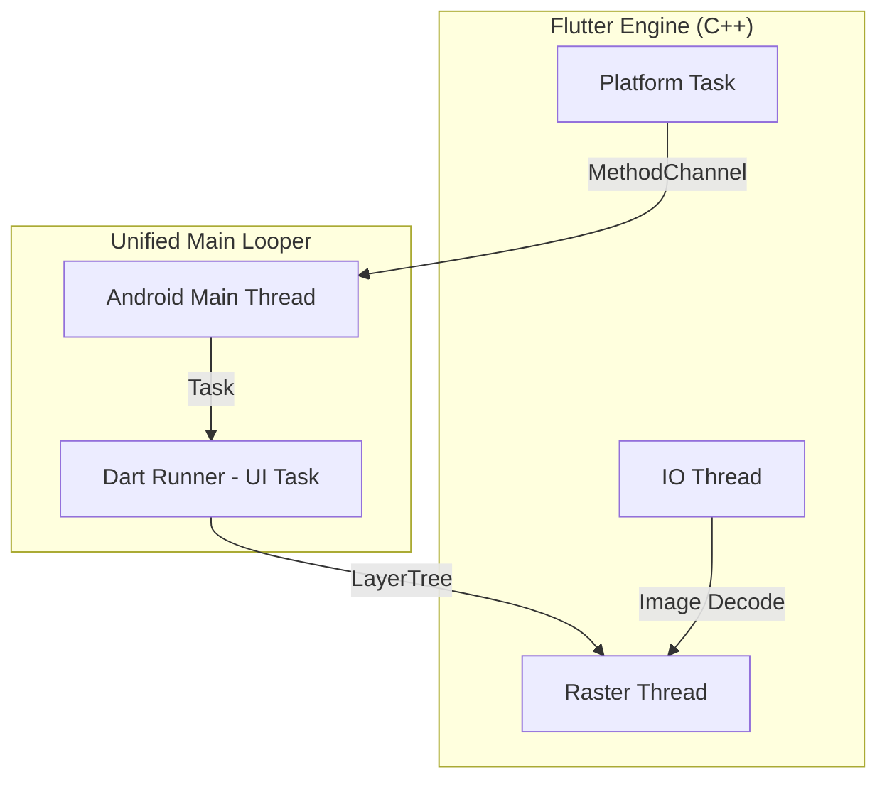
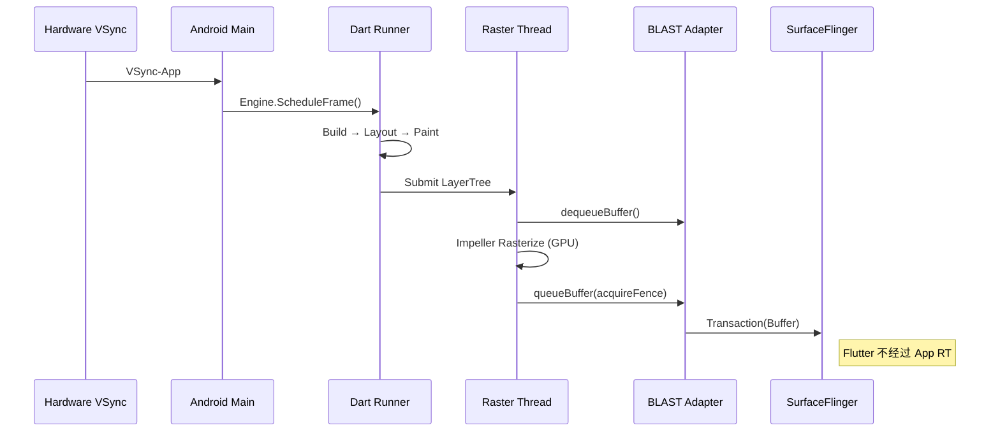
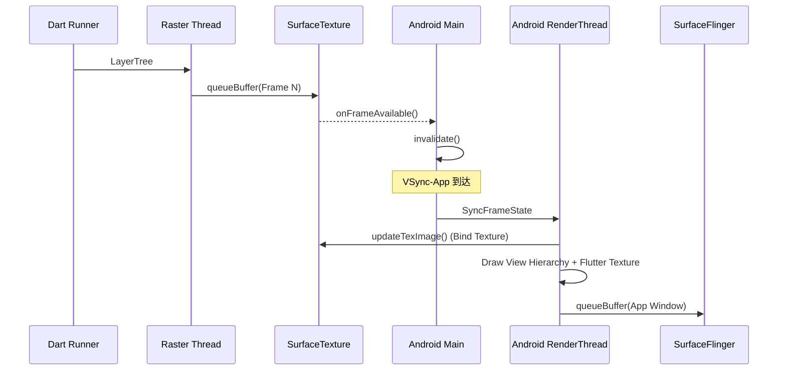

<!-- outline-start -->

**锚点（必须覆盖）：**
- Flutter 线程模型：Merged Platform Model（UI + Platform 合并）
- Dart Runner → Raster Thread → GPU → Display 的渲染管线
- Impeller vs Skia 渲染后端
- SurfaceView render mode vs TextureView render mode
- Platform Views 的 Hybrid Composition 模式
- 在 Perfetto 中识别 Flutter 渲染链路的方法

**扩展（可选深入）：**
- Flutter 3.29+ Merged Model 的线程优化
- Platform View 的 Z-Order 和手势问题
- Flutter 与宿主 App 的 VSync 协调

<!-- outline-end -->

## 为什么 Flutter 的渲染链路值得单独一章

Flutter 在 Android 上的渲染链路与原生 App 有本质区别：**Flutter 不走 Android View 体系的 Measure/Layout/Draw 流程**。它有一套完全独立的渲染管线——Dart 代码生成 LayerTree，C++ Raster Thread 将 LayerTree 光栅化为像素，最终通过独立 Surface 或 SurfaceTexture 提交给 SurfaceFlinger。

理解这条链路，你才能在 Perfetto 中区分"Flutter Dart 代码慢了"、"Raster Thread GPU 光栅化慢了"和"宿主 App 侧的合成慢了"——这三类问题的优化方向完全不同。[已验证: Flutter 官方文档]

## 线程模型：Merged Platform Model

Flutter 的线程架构经历了重大演进。较新的版本（Flutter 3.32+ stable）中，**UI TaskRunner 与 Android Main Looper 合并**已成为 Android 上的主流默认行为。

合并后，Dart 代码和 Android 平台代码（如 Activity 生命周期回调、MethodChannel 调用）运行在同一线程上，减少了跨线程切换开销。但需要注意的是：Raster Thread 始终是独立的——它是 Flutter 唯一与 GPU 交互的线程。

| 线程 | 职责 | Trace 标签 |
|:---|:---|:---|
| **Main / Dart Runner** | Dart UI 代码执行（Build/Layout/Paint） | `Engine::BeginFrame` 等 |
| **Raster Thread** | LayerTree 光栅化、GPU 指令提交 | `Rasterizer::DrawToSurfaces` |
| **IO Thread** | 图片解码、资源加载 | `ImageDecoder` |
| **Platform Thread** | MethodChannel、平台调用 | `MethodChannel` |

## 渲染管线全景

Flutter 的渲染流程分为四个阶段，每个阶段对应不同的线程和组件。

### 阶段一：Dart Runner（UI 构建）

由 VSync-App 信号驱动（通过 Engine 层桥接 Choreographer）：

1. **Build**：执行 `Widget.build()`，构建 Element Tree。
2. **Layout**：`RenderObject.performLayout()`，计算每个渲染对象的大小和位置（对应 Android 的 Measure/Layout，但全在 Dart 里完成）。
3. **Paint**：`RenderObject.paint()`，生成 **LayerTree**（图层树）——一份绘制指令列表，不产生像素。
4. **Submit**：将 LayerTree 打包，发送给 Raster Thread。

### 阶段二：Raster Thread（光栅化）

1. **LayerTree Processing**：接收 Dart 发来的 LayerTree，进行优化和合成排序。
2. **Rasterization**：
   - **Impeller**（现代默认）：使用预编译 Shader、Vulkan/GLES 后端，减少运行时编译卡顿
   - **Skia**（旧版）：运行时编译 GLSL Shader
3. **Present**：通过 `vkQueuePresentKHR`（Vulkan）或 `eglSwapBuffers`（GLES）提交到 Surface。

### 阶段三：系统合成

取决于 render mode：
- **SurfaceView mode**：直接提交到独立 Surface，由 SurfaceFlinger 合成
- **TextureView mode**：提交到 SurfaceTexture，由宿主 RenderThread 再合成

## SurfaceView vs TextureView Render Mode

这是 Flutter 在 Android 上最重要的链路选择，直接决定了性能特征。

### SurfaceView Render Mode（推荐默认）

Flutter 的独立 Surface 直接与 SurfaceFlinger 交互，**不经过宿主 App 的 RenderThread**。

**优势**：宿主主线程或 RenderThread 卡顿不影响 Flutter 渲染。视频、全屏 App、游戏等场景优先选择。

**限制**：Flutter SurfaceView 与宿主原生 View 是两个独立 Layer，无法交错（Z-Order 冲突）；不支持 View 级别的动画变换（透明度、旋转、圆角）。

### TextureView Render Mode（兼容路径）

Flutter 渲染到 SurfaceTexture，再由宿主 App RenderThread 采样合成到主窗口。

**优势**：可以当普通 View 使用，支持动画、透明度、裁剪。

**代价**：多一次宿主侧纹理采样和同步；受宿主主线程/RenderThread 卡顿影响；内存占用更高。

### 选型建议

| 场景 | 推荐 Mode | 理由 |
|:---|:---|:---|
| 全屏 Flutter App | SurfaceView | 性能最优 |
| Flutter 嵌入复杂 View 层级 | TextureView | 需要交错和变换 |
| 需要半透明/圆角 | TextureView | SurfaceView 不支持 |
| 视频/游戏 | SurfaceView | 延迟最低 |

## Platform Views 嵌入

当 Flutter App 需要嵌入原生 Android View（如 Google Maps、WebView）时，存在两套独立的配置：

1. **Flutter 根视图 render mode**：SurfaceView 或 TextureView（决定 Flutter 内容怎么出图）
2. **Platform Views composition mode**：Hybrid Composition 或 Texture Layer Hybrid Composition（决定嵌入的原生 View 怎么和 Flutter 内容组合）

这两套配置相互独立但组合后影响性能：

- **Hybrid Composition**：原生 View 作为独立 Layer，与 Flutter Surface 平行存在。性能较好但可能存在 Z-Order 问题。
- **Texture Layer Hybrid Composition**：原生 View 渲染到纹理，由 Flutter Raster Thread 合成。更灵活但多一次纹理采样。

**建议**：尽量减少 PlatformView 数量，优先使用 Flutter 原生组件替代。

## 在 Perfetto 中识别 Flutter 链路

| 位置 | 可能的 Slice/Track | 说明 |
|:---|:---|:---|
| Main/Dart Runner | `Engine::BeginFrame`, `Build`, `Layout`, `Paint` | Dart UI 阶段 |
| Raster Thread | `Rasterizer::DrawToSurfaces`, `EntityPass::*` | 光栅化阶段 |
| IO Thread | `ImageDecoder` | 图片解码 |
| SurfaceFlinger | Flutter 独立 Layer | SurfaceView mode |

**诊断思路**：
- Dart 阶段慢 → 优化 Widget 树、减少 rebuild
- Raster 阶段慢 → 减少 DrawCall、优化 Shader
- 宿主合成慢 → 检查 TextureView mode 下的 RenderThread 负载

## 与其他章节的关系

- **2.11 Flutter 渲染管线与性能**：Flutter 渲染机制的原理视角
- **18.6 SurfaceView / 18.7 TextureView**：Android 原生组件的链路对比
- **13.8 WebView 渲染性能**：Flutter WebView 的性能特征

## 参考资料

- Flutter 官方文档：Flutter rendering pipeline
- Flutter Impeller 文档
- AOSP `engine/src/flutter/`
