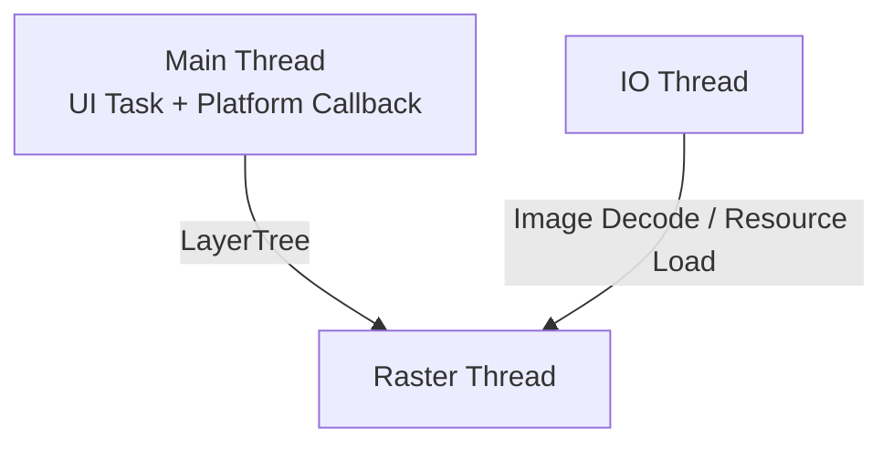
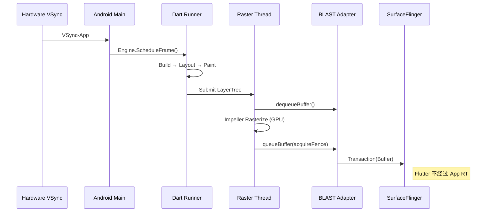
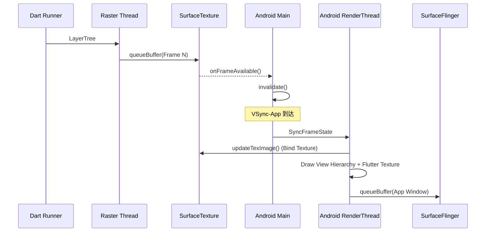

<!-- outline-start -->

**锚点（必须覆盖）：**
- Flutter 线程模型：Flutter 3.29+ 的 Merged Platform Model（UI + Platform 合并）
- Dart Runner → Raster Thread → GPU → Display 的渲染管线
- Impeller vs Skia 渲染后端
- SurfaceView render mode vs TextureView render mode
- Platform Views 的 Hybrid Composition 模式
- 在 Perfetto 中识别 Flutter 渲染链路的方法

**扩展（可选深入）：**
- Flutter 3.29+ Merged Model 的线程优化
- Platform View 的 Z-Order 和手势问题
- Flutter 与宿主 App 的 VSync 协调

<!-- outline-end -->

## 为什么 Flutter 的渲染链路值得单独一章

Flutter 在 Android 上的渲染链路与原生 App 有本质区别：**Flutter 不走 Android View 体系的 Measure/Layout/Draw 流程**。它有一套完全独立的渲染管线，Dart 代码生成 LayerTree，C++ Raster Thread 将 LayerTree 光栅化为像素，最终通过独立 Surface 或 SurfaceTexture 提交给 SurfaceFlinger。

理解这条链路，你才能在 Perfetto 中区分"Flutter Dart 代码慢了"、"Raster Thread GPU 光栅化慢了"和"宿主 App 侧的合成慢了"，这三类问题的优化方向完全不同。[已验证: Flutter 官方文档]

## 版本边界

这一章把三个边界拆开写，避免把线程模型、渲染后端和 Android API 范围压成一个版本号：

- **线程模型**：正文主线按 Flutter 3.29+ 的 merged model 讲，UI task 和平台回调都落在宿主 Main thread
- **渲染后端**：Impeller 自 Flutter 3.27 起在 Android API 29+ 默认启用，低版本或不满足条件时仍可能回退到 Skia
- **Android 侧范围**：Platform Views、SurfaceView、TextureView 的组合能力跨多个 Android 版本存在，具体代价要按嵌入控件和系统版本分别判断

## 线程模型：Merged Platform Model

本文主线按 Flutter 3.29+ 在 Android 上的 merged model 讲。此时 Dart UI task、MethodChannel、插件回调和 Activity 生命周期回调都落在宿主 Main thread 上。Perfetto 里最先要找的是一个合并后的 Main 视图，而不是单独的 `Platform Thread`。

Engine 内部仍有 task runner 的概念，但在 merged model 下，插件和平台代码看到的是宿主主线程。把 `platform task` 直接画成独立线程，会把 Trace 里的瓶颈归因搞反。

| 线程 | 职责 | 常见观察点 |
|:---|:---|:---|
| **Main（UI + Platform）** | Dart Build/Layout/Paint、MethodChannel、插件回调、Activity 生命周期与输入回调 | `Engine::BeginFrame`、MethodChannel 回调、Dart Build/Layout/Paint |
| **Raster Thread** | LayerTree 光栅化、GPU 指令提交 | `Rasterizer::DrawToSurfaces` |
| **IO Thread** | 图片解码、资源加载 | `ImageDecoder` |

如果工程仍停留在旧版 engine 或定制 embedding，上述主线程合并可能没有完全生效。遇到这类 Trace，先按工程实际 Flutter 版本确认线程模型，再做归因。

## 渲染管线全景

Flutter 的渲染流程分为四个阶段，每个阶段对应不同的线程和组件。

### 阶段一：Dart Runner（UI 构建）

由 VSync-App 信号驱动（通过 Engine 层桥接 Choreographer）：

1. **Build**：执行 `Widget.build()`，构建 Element Tree。
2. **Layout**：`RenderObject.performLayout()`，计算每个渲染对象的大小和位置（对应 Android 的 Measure/Layout，但全在 Dart 里完成）。
3. **Paint**：`RenderObject.paint()`，生成 **LayerTree**（图层树）——一份绘制指令列表，不产生像素。
4. **Submit**：将 LayerTree 打包，发送给 Raster Thread。

### 阶段二：Raster Thread（光栅化）

1. **LayerTree Processing**：接收 Dart 发来的 LayerTree，进行优化和合成排序。
2. **Rasterization**：
   - **Impeller**（Flutter 3.27+ 在 Android API 29+ 的默认后端）：使用预编译 Shader，优先走 Vulkan，不满足条件时可回退到 GLES
   - **Skia**（旧版默认或回退路径）：运行时编译 GLSL Shader
3. **Present**：通过 `vkQueuePresentKHR`（Vulkan）或 `eglSwapBuffers`（GLES）提交到 Surface。

### 阶段三：系统合成

取决于 render mode：
- **SurfaceView mode**：直接提交到独立 Surface，由 SurfaceFlinger 合成
- **TextureView mode**：提交到 SurfaceTexture，由宿主 RenderThread 再合成

## SurfaceView vs TextureView Render Mode

这是 Flutter 在 Android 上最重要的链路选择，直接决定了性能特征。

### SurfaceView Render Mode（推荐默认）

Flutter 的独立 Surface 直接与 SurfaceFlinger 交互，**不经过宿主 App 的 RenderThread**。

**优势**：主要绕开宿主 RenderThread 的纹理采样与窗口合成路径。全屏 Flutter 页面、视频、游戏场景更容易拿到更低的合成开销。宿主主线程一旦阻塞，Dart 的 Build/Layout/Paint 和平台回调仍会一起变慢。

**限制**：Flutter SurfaceView 与宿主原生 View 是两个独立 Layer，无法交错（Z-Order 冲突）；不支持 View 级别的动画变换（透明度、旋转、圆角）。

### TextureView Render Mode（兼容路径）

Flutter 渲染到 SurfaceTexture，再由宿主 App RenderThread 采样合成到主窗口。

**优势**：可以当普通 View 使用，支持动画、透明度、裁剪。

**代价**：多一次宿主侧纹理采样和同步；受宿主主线程/RenderThread 卡顿影响；内存占用更高。

### 选型建议

| 场景 | 推荐 Mode | 理由 |
|:---|:---|:---|
| 全屏 Flutter App | SurfaceView | 性能最优 |
| Flutter 嵌入复杂 View 层级 | TextureView | 需要交错和变换 |
| 需要半透明/圆角 | TextureView | SurfaceView 不支持 |
| 视频/游戏 | SurfaceView | 延迟最低 |

## Platform Views 嵌入

当 Flutter 需要嵌入原生 Android View（如 WebView、MapView）时，要分开看两套开关：

1. **Flutter 根视图 render mode**：SurfaceView 或 TextureView，决定 Flutter 内容怎么出图
2. **Platform Views composition mode**：Hybrid Composition 或 Texture Layer Hybrid Composition，决定原生 View 怎么和 Flutter 内容组合

这两套配置会叠加出不同的性能边界，不能混成一句“某种模式更快”。

| Composition mode | 适合场景 | 优点 | 主要代价 |
|:---|:---|:---|:---|
| **Hybrid Composition** | WebView、MapView、输入与无障碍要求高的控件 | 原生 View 更接近 Android 自身行为，输入、焦点和 a11y 路径更稳 | Flutter 自身渲染更容易掉帧，Android 10 之前拷贝成本更高 |
| **Texture Layer Hybrid Composition** | 需要变换、裁剪、透明度、和 Flutter 内容一起动画的控件 | Flutter 侧变换能力更完整，宿主布局融合更灵活 | WebView 快速滚动更容易 janky；若嵌入树里出现 SurfaceView，可能被挪进 virtual display，a11y 也会受影响；文本放大镜依赖 Flutter 以 TextureView 渲染 |

再按控件类型看，差异会更直观：

| 嵌入对象 | Hybrid Composition | Texture Layer Hybrid Composition |
|:---|:---|:---|
| **WebView** | 滚动、输入、a11y 路径更稳，适合正文阅读和表单 | 做透明叠加和动画更方便，但快速滚动更容易抖 |
| **MapView** | 原生手势与无障碍行为更接近 Android 默认实现 | 适合做裁剪、缩放、透明过渡，但高频相机移动时要盯紧纹理采样成本 |
| **SurfaceView 类控件** | 更接近原生独立 Layer 路径 | 不是默认优先项，容易触发 virtual display 退化，a11y 和合成链都会更复杂 |

因此，Platform Views 这部分不能只写“Hybrid Composition 性能较好”或“Texture Layer 更灵活”。真正要看的，是目标控件类型、滚动模式、是否依赖 a11y，以及是否需要跟 Flutter 内容一起做动画。

## 在 Perfetto 中识别 Flutter 链路

| 位置 | 可能的 Slice/Track | 说明 |
|:---|:---|:---|
| Main/Dart Runner | `Engine::BeginFrame`, `Build`, `Layout`, `Paint` | Dart UI 阶段 |
| Raster Thread | `Rasterizer::DrawToSurfaces`, `EntityPass::*` | 光栅化阶段 |
| IO Thread | `ImageDecoder` | 图片解码 |
| SurfaceFlinger | Flutter 独立 Layer | SurfaceView mode |

**Trace 截图参考**：

[待补充：Flutter SurfaceView mode 下 Perfetto 截图 — 标注 Dart Runner、Raster Thread、SurfaceFlinger 的对应轨道]

[待补充：Flutter TextureView mode 下 Perfetto 截图 — 标注 Raster Thread、宿主 RenderThread、SurfaceTexture 的交互时序]

**诊断思路**：
- Dart 阶段慢 → 优化 Widget 树、减少 rebuild
- Raster 阶段慢 → 减少 DrawCall、优化 Shader
- 宿主合成慢 → 检查 TextureView mode 下的 RenderThread 负载

## 与其他章节的关系

- **2.11 Flutter 渲染管线与性能**：Flutter 渲染机制的原理视角
- **18.6 SurfaceView / 18.7 TextureView**：Android 原生组件的链路对比
- **13.8 WebView 渲染性能**：Flutter WebView 的性能特征

## 参考资料

- Flutter 官方文档：Flutter rendering pipeline
- Flutter 官方文档：Hosting native Android views in your Flutter app with Platform Views
- Flutter 官方文档：Impeller rendering engine
- Flutter Android embedding Javadoc：RenderMode
- AOSP `engine/src/flutter/`
