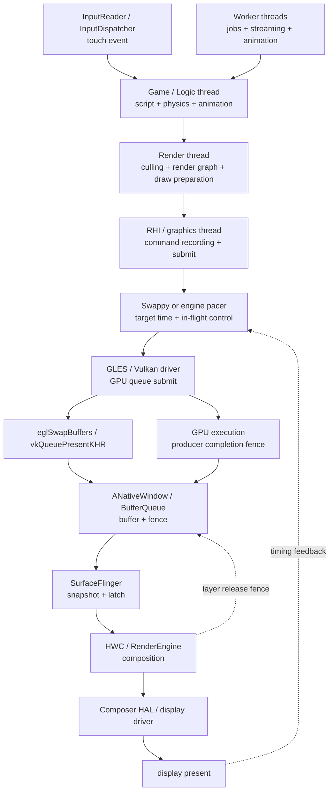

# Android 17 游戏引擎渲染链路

游戏帧由输入采样、模拟、渲染提交、Surface 队列和显示合成共同组成，稳定帧间隔与最低延迟也可能互相牵制。分析时应以职责和依赖识别线程，而不是依赖某个引擎版本的线程名。

## 游戏渲染要从输入追到显示

普通 Android View 页面通常由事件触发：输入、动画或数据变化引起 `invalidate()`，`Choreographer` 再在 VSync 节点驱动 ViewRootImpl 和 HWUI。游戏同样要处理 Activity 生命周期、窗口和输入事件，但画面通常由引擎自己的 game loop（持续执行的游戏主循环）主动生产。

这一区别改变了性能分析的起点。普通页面常从 UI Thread 的 `doFrame()` 向后追踪；游戏则要先确定某次输入被哪一轮 simulation（物理、玩法等世界状态更新）读取，再继续跟踪 Render / RHI、GPU、swapchain、BufferQueue、SurfaceFlinger 和显示 present。

本文的平台源码版本是 Android 17 / API 37 / `android-17.0.0_r1`，内核版本是 `android17-6.18-2026-06_r6`。Unity、Unreal、Cocos、自研引擎、Swappy 和 GPU driver 都有自己的版本变化；采集数据时，应同时记录引擎版本、graphics API、渲染后端、frame pacing 配置、Game Mode 和设备 build fingerprint。

## Game Loop 与事件驱动 UI 有什么不同

下面的伪代码只用于解释职责和节奏，不代表某个引擎的固定实现：

```text
while (running) {
    pollLifecycleAndInput();

    accumulator += elapsedTime();
    while (accumulator >= fixedStep) {
        simulatePhysicsAndGameplay(fixedStep);
        accumulator -= fixedStep;
    }

    buildRenderSnapshot(accumulator / fixedStep);
    recordAndSubmitGpuCommands();
    presentWithFramePacing();
}
```

很多引擎用固定时间步长更新物理，再用可变步长或插值生成 render snapshot（供渲染线程读取的一帧世界状态）。输入可能在 game thread 开头、VSync 附近或更靠近提交时采样。只知道“游戏 60 FPS”，无法推断 simulation 每秒也运行 60 次，更无法推断触控到显示只经历一帧。

| 对比维度 | 普通 View 页面 | 游戏引擎 |
| --- | --- | --- |
| 主要驱动力 | View 失效、输入、动画、数据变化 | 自有 game loop 持续执行 |
| 逻辑更新 | UI Thread 上的回调与状态更新 | Game / Logic thread 的 simulation、脚本、物理、动画 |
| 渲染准备 | HWUI 在 UI Thread / RenderThread 协作 | Render / RHI thread、task workers、引擎 render graph |
| 提交接口 | HWUI 通过 Skia / RenderThread 输出 | GLES `eglSwapBuffers()` 或 Vulkan `vkQueuePresentKHR()` |
| 节奏控制 | Choreographer 与系统帧调度 | Swappy、自研 pacer、引擎 limiter、Frame Rate API |
| 重点延迟 | 输入到 App FrameTimeline | 输入采样到对应游戏帧 present 的完整链路 |

游戏仍然运行在 Android 窗口系统中。自有 game loop 不会绕开 SurfaceFlinger，阻塞式 swap/present 也不能代替完整的线程协作与 GPU 同步设计。

## 一帧的完整路径

下面的图把一次输入对应的 CPU、GPU 和显示阶段放在同一条时间线上：



CPU 的提交调用返回时，GPU 往往仍在异步执行。GPU 写完并让 producer fence signal 后，SurfaceFlinger 或 HWC 才能安全读取游戏 buffer；Layer release fence 决定显示端何时不再使用旧 buffer；present timing / present fence 描述后续显示阶段。三者分别对应生产完成、buffer 可复用和显示提交，统称为“渲染完成”会掩盖真正的瓶颈位置。

### 五段职责

1. **Input 与 Game / Logic**：读取输入，更新脚本、AI、物理、动画和世界状态。
2. **Render preparation**：完成可见性裁剪、LOD（Level of Detail，细节层级）、render graph、draw item 与资源依赖准备。
3. **RHI / graphics submission**：RHI（Rendering Hardware Interface，渲染硬件抽象层）把引擎命令转换成 GLES/Vulkan 调用，录制并提交 GPU command buffer。
4. **GPU 与 swapchain**：GPU 写入可呈现 image，`eglSwapBuffers()` 或 `vkQueuePresentKHR()` 再把该 image 交给 Android native window；swapchain 是一组在渲染与显示之间轮换使用的 image。
5. **Android display**：BufferQueue、SurfaceFlinger、HWC/RenderEngine、Composer HAL 和显示驱动完成 latch、合成与 present。

这些阶段可以跨帧并行。Game thread 在准备 N+1 帧时，Render thread 可能处理 N 帧，GPU 仍在执行 N-1 帧。这样可以提高吞吐量，也可能让输入多等待一到两轮。in-flight frame 指已经进入 CPU/GPU/显示流水线、尚未完成 present 的帧；分析时要同时记录每秒完成帧数和同一输入跨越的在途帧数量。

## 多线程架构：职责比线程名更可靠

引擎会随版本、graphics job、渲染后端和构建选项改变线程数量。应先按职责识别，再用线程名辅助确认：

| 角色 | 常见工作 | 过载或阻塞时的表现 |
| --- | --- | --- |
| Game / Logic thread | input、script、physics、animation、world tick | GPU 队列出现空洞，Render thread 等新命令 |
| Render thread | culling、draw preparation、render graph | Game thread 可能在帧边界等 Render thread |
| RHI / graphics thread | API command、driver 调用、queue submit | CPU submit 晚，GPU 开工也晚 |
| Worker threads | jobs、animation、visibility、streaming | 主线程在 barrier / future（等待并行任务完成的同步点）等待 worker |
| GPU queue | vertex、fragment、compute、copy | producer fence 晚，swapchain image 回收慢 |
| SurfaceFlinger / display | latch、composition、present | buffer 已 ready，仍错过目标 present |

### Unity 的典型结构与证据边界

Unity 的 main thread 运行 `PlayerLoop`，脚本 `Update` / `FixedUpdate` / `LateUpdate` 等阶段位于其下。启用多线程渲染后，render thread 处理图形命令，Job System worker 处理可并行任务。具体线程和 marker 会随 Unity 版本、渲染后端及 Player 设置变化。

Unity Profiler 中常用的 marker 包括：

- `PlayerLoop`：播放器主循环；
- `Gfx.ProcessCommands`：render thread 处理图形命令；
- `Gfx.WaitForCommands`：render thread 等 main thread 产生新命令；
- `Gfx.PresentFrame` / `Gfx.WaitForPresentOnGfxThread`：present、VSync、GPU 或队列等待相关区间；旧版本可能使用较短的 `Gfx.WaitForPresent` 名称；
- Job worker 上的任务与 idle 区间。

这些名称属于 Unity Profiler marker，系统 Perfetto 默认不保证完整显示。Perfetto 通常能看到进程、Linux 线程、调度状态、futex、binder、图形和 GPU/SurfaceFlinger 信息；若要把 Unity 内部阶段与系统帧准确对应，应同时采集 Unity Profiler，或在关键阶段写入 `ATrace` / Perfetto TrackEvent，并携带统一 frame id。

`Gfx.WaitForPresentOnGfxThread` 也不能单独证明 GPU bound。等待可能来自 VSync、frame pacer、swapchain back-pressure（下游未及时释放 image）或 GPU；需要结合 GPU 完成时间和 BufferQueue 深度判断。

### Unreal 的典型结构与证据边界

Unreal 常见 Game Thread、Rendering Thread、可选 RHI Thread 与 Task Graph workers。Epic 的线程渲染文档说明 Rendering Thread 可能落后 Game Thread 一到两帧，Game Thread 会在帧边界限制自己的领先距离。

Perfetto 中通常能按 OS 线程名找到 Game、Render、RHI 和 worker 轨道，但名称会受引擎版本、平台封装和 Linux 线程名长度影响。`GameThread::Tick`、render pass、RHI command 等细节属于 Unreal 的引擎 trace 语义，完整证据通常来自 Unreal Insights 的 `.utrace`。建议同时保留：

- Perfetto：系统调度、频率、GPU、BufferQueue、SurfaceFlinger 和 display；
- Unreal Insights：引擎 task、Game/Render/RHI dependency、asset loading 和自定义事件；
- 统一帧号：把同一 frame id 写入两边的自定义 marker。

### 线程等待怎样解读

等待本身不能直接判为问题。Render thread 等 Game thread，可能说明逻辑慢；Game thread 等 Render thread，可能说明渲染准备积压；Swappy 或 acquire 上的短等待，也可能是在主动限制 in-flight 深度。判断时要查看等待对象、前驱 fence、目标帧率，以及后续阶段是否按预算启动。

## 游戏 Surface、SurfaceView 与 BLAST

大多数 Android 游戏把最终画面输出到独立 Surface。常见入口有：

- `GameActivity`：官方文档说明它渲染到 `SurfaceView`，并把 `ANativeWindow` 生命周期回调给 C/C++；
- Unity / Unreal 的 Android Player Activity：通常持有供引擎渲染的 Surface 或 native window，具体封装随版本变化；
- 自研 Native 游戏：从 `SurfaceView`、`NativeActivity` 或 `GameActivity` 获得 `ANativeWindow`。

“游戏普遍使用 SurfaceView + BLAST”描述的是一种常见承载结构：现代 Android 的独立 `SurfaceView` 生产链通常由 BLASTBufferQueue 配合 SurfaceControl transaction 协调 buffer 与几何更新。它不是所有引擎的 API 保证，也不表示引擎会直接调用 BLAST。

### Android 17 的 SurfaceView 路径

`android-17.0.0_r1` 的 `SurfaceView.java` 直接持有 `BLASTBufferQueue`、`mBlastSurfaceControl` 和 `SurfaceControl.Transaction`。Surface 的创建与 resize、destination frame（目标显示区域）、crop、z-order 和窗口同步都由这套 SurfaceControl/BLAST 路径处理；BLAST 不负责生成游戏像素。

稳态游戏帧仍由引擎通过 `ANativeWindow` 生产。以 Vulkan WSI（Window System Integration，窗口系统集成）为例，Android 17 的 `vulkan/libvulkan/swapchain.cpp` 会：

- 用 native window 查询 `NATIVE_WINDOW_MIN_UNDEQUEUED_BUFFERS` 等能力；
- 按 swapchain 配置设置 buffer format、dimensions、dataspace 和 transform；
- 在 acquire 路径调用 `dequeueBuffer()`；
- 在 present 路径把 GPU release fence 随 `queueBuffer()` 交给 BufferQueue。

acquire 路径还需要把 Android fence 接入 Vulkan 同步对象。`vkAcquireNextImageKHR()` 对应的实现从 `dequeueBuffer()` 取得 `ANativeWindowBuffer` 和 native fence fd（文件描述符），随后调用 driver 的 `AcquireImageANDROID()`，将该 fd 导入应用提供的 Vulkan semaphore / fence。只有 acquire 同步对象满足后，应用才能安全改写这块 image。

present 方向中，`vkQueuePresentKHR()` 或 `SwappyVk_queuePresent()` 最终进入 `PresentOneSwapchain()`。平台先调用 `QueueSignalReleaseImageANDROID()`，把 Vulkan wait semaphore 转换成代表 GPU 完成的 sync fd，再将 buffer 与该 fd 交给 `ANativeWindow::queueBuffer()`。Vulkan swapchain image 与 Android BufferQueue buffer 因此存在明确映射。present 调用进入这条路径时，该帧可能尚未被 SurfaceFlinger latch，距离显示完成还有后续阶段。

### 游戏 Layer 仍要经过 SurfaceFlinger

独立 Surface 可以避开 App 的 HWUI RenderThread，但仍要经过 SurfaceFlinger。SurfaceFlinger 会为游戏建立 Layer snapshot，并与 HWC 协商 `CLIENT` / `DEVICE` composition。

即使游戏 Layer 被 HWC 判为 `DEVICE`，游戏场景本身也已经由 GLES/Vulkan 在 GPU 中渲染完成。`DEVICE` 只表示显示合成阶段无须由 RenderEngine 再采样该 Layer，游戏自身的 GPU 渲染成本仍然存在。

Android 17 的显示尾链可沿下面几组调用核对：

1. `Display::chooseCompositionStrategy()` 调用 `HWComposer::getDeviceCompositionChanges()`，由 Composer HAL validate 当前 Layer 栈，并返回 composition type 或 display request 的变化。
2. `OutputLayer::writeStateToHWC()` 把游戏 Layer 的 buffer、acquire fence、几何和 composition type 写给 HWC。C++ 层入口名是 `HWC2::Layer::setBuffer()`，下层 Composer3 AIDL 命令名是 `AidlComposer::setLayerBuffer()`。
3. 存在 `CLIENT` composition 时，RenderEngine 先生成 client target（GPU 预合成得到的显示输入），SurfaceFlinger 再通过 `HWComposer::setClientTarget()` 把它交给 HWC；`DEVICE` Layer 可由显示硬件读取各自 buffer。
4. `Display::presentFrame()` 调用 `presentAndGetReleaseFences()`，取得 display present fence 和各 Layer 的 release fence。

present 阶段返回的 fence 可能仍未 signal，函数返回时间不能当作 vblank（上一轮扫描结束、下一轮扫描开始前的垂直消隐边界）已经发生。Layer release fence 满足后，对应 producer slot 才能安全复用；present fence 与逐 Layer release fence 描述不同边界，也不能合并成一个“显示完成”时间。

### 生命周期和 resize

GameActivity 的 `onNativeWindowDestroyed` 契约要求：回调返回前，其他渲染线程必须停止访问该 window。旋转、分屏、折叠、自由窗口或 Surface 重建时，应按引擎规范停止提交，等待必要的 GPU 使用结束，销毁或重建 EGLSurface/Vulkan swapchain，再开始使用新 window。

如果旧 swapchain 继续向已经销毁的 window 提交，可能出现 `VK_ERROR_OUT_OF_DATE_KHR`、`VK_ERROR_SURFACE_LOST_KHR`、黑帧或 native crash。这属于 Surface 生命周期处理问题，与 shader 或 Game thread 性能无关。

## Frame pacing：稳定间隔与低延迟要一起看

假设游戏在 60 Hz 屏幕上只能产出约 40 FPS。若提交节奏未经控制，某些帧会显示一个刷新周期，另一些帧会显示两个刷新周期，形成明显的 16.7 ms / 33.3 ms 交替。即使平均 FPS 接近目标，present-to-present（相邻两次显示提交之间）的间隔仍会不均匀，玩家会感到顿挫。

### Queue-stuffing 为什么会增加延迟

游戏持续以最快速度 present 时，display pipeline 中的 buffer 会逐渐占满，这种状态称为 queue-stuffing。队列没有空位后，render thread 会在 acquire、swap 或 present 附近阻塞，看起来像系统自动限速。此时输入可能早在前面的逻辑帧中完成采样，玩家看到结果前还要等待队列里的旧帧，输入延迟随之增加。

“swap 调用阻塞”不能直接证明 GPU 慢，还可能来自以下因素：

- Swappy 或引擎 pacer 主动等待目标时刻；
- swapchain image 仍被显示端使用；
- BufferQueue 已满；
- GPU producer fence 还未完成；
- resize / display mode change；
- Vulkan present mode 与 driver 行为。

### Swappy 做了什么

Swappy 是 AGDK 提供的 Frame Pacing library，用于安排帧提交时机和限制队列深度：

- GLES 使用 `SwappyGL_swap()` 包装 `eglSwapBuffers()`；
- Vulkan 使用 `SwappyVk_queuePresent()`，它会代为调用 `vkQueuePresentKHR()`；
- 库利用 Choreographer、presentation timestamp 和 sync fence 控制 swap interval（提交间隔）与 pipeline mode；
- GLES 侧可使用 `EGL_ANDROID_presentation_time`，Vulkan 侧可使用 `VK_GOOGLE_display_timing` 等能力；
- 目标是避免帧过早 present 和 queue-stuffing，同时兼顾不同刷新率。

Swappy 中的 wait 可能是主动 pacing，而非无效阻塞。分析这段等待时，要检查目标 interval 是否正确、队列里有几帧，以及输入到 present 的延迟是否缩短。若只设法消除 wait slice，队列可能再次进入 queue-stuffing。

### Pipeline 与 non-pipeline

Pipeline mode 允许 CPU 和 GPU 跨 VSync 并行，通常能稳定吞吐，但可能增加一轮 in-flight latency。Non-pipeline mode 适合 CPU 与 GPU 工作总量能在一个 interval 内完成的轻负载场景，可缩短输入到显示的等待。Swappy 的 auto pipeline mode 会根据工作量调整，评价模式选择时还要同时看帧间隔和输入延迟，不能只看平均 FPS。

### Choreographer 不是完整替代品

游戏可以用 Choreographer 对齐显示节拍，但回调偏移会随设备变化，长帧也可能继续造成 queue-stuffing。Swappy 除了使用 Choreographer，还会结合 presentation timestamp 与 fence 控制提交。

Perfetto 默认不保证存在名为 `Swappy` 的 track。若要看到 `preWait`、`postWait`、`preSwapBuffers` 等库内边界，需要通过 Swappy tracer 回调写入 ATrace/TrackEvent。未加自定义埋点的系统 trace 更适合观察 present 调用点、FrameTimeline、BufferQueue、GPU 和 SurfaceFlinger。

## Android 17 的 present timing 与 producer throttling

### `VK_EXT_present_timing`

Android 17 支持 `VK_EXT_present_timing`，自研 Vulkan pacer 可以请求 target present time，并查询多个 present stage：queue operations end 表示相关队列操作结束，request dequeued 表示显示请求从队列取出，first pixel out / visible 则描述显示输出和可见阶段。该扩展依赖 `VK_KHR_present_id2`；应用还须在创建 device 和 swapchain 前枚举 extension、feature 与相关 flag。

Android 17 平台的 `swapchain.cpp` 已解析 `VkPresentTimingsInfoEXT` 和 `VkPresentId2KHR`，并从 native window timestamp 填充 past presentation timing。系统版本达到 Android 17，并不能替代对具体驱动和 swapchain 的能力检查；扩展不可用时，可退回 `VK_GOOGLE_display_timing` 或 Swappy。

### `Surface.setProducerThrottlingEnabled()`

API 37 新增 `Surface.setProducerThrottlingEnabled(boolean)`。默认开启时，如果 Vulkan/EGL producer 正在 queue 新 buffer、consumer 仍在处理上一帧，系统会对 producer 施加 CPU back-pressure（让生产线程等待下游释放容量）。阻塞可能出现在 `eglSwapBuffers()` 或 Vulkan present 附近。

Android 17 的 API 文档建议 Vulkan 应用关闭这类隐式 throttling，并使用正确的显式同步。关闭后，如果生产速度超过 GPU 或显示消费速度，等待通常会转移到 `vkAcquireNextImageKHR()` / dequeue 一侧。接入现成引擎时，不应绕过引擎直接修改 Surface；应先确认引擎版本已适配该 API，并具备完整的 semaphore、fence、in-flight frame 上限和 frame pacer 设计。

### BufferQueue 计数、分辨率切换与显存预算

`android-17.0.0_r1` 的 `BufferQueueCore` 构造函数把 `mMaxAcquiredBufferCount` 和 `mMaxDequeuedBufferCount` 都初始化为 1，并用 `getMaxBufferCountLocked()` 按 acquired + dequeued + async / non-blocking 额外项计算当前队列上限，再受 `mMaxBufferCount` 限制；构造函数据此把起始 free slot 放入 `mFreeSlots`。这个事实说明新建 BufferQueue 的锁内默认约束，但不是“所有游戏 swapchain 最终固定两张图像”的 API 保证。[来源: DeepResearch/2026-07-17-game-engine-resolution-memory-allocation.md; 已验证: android-17.0.0_r1 `frameworks/native/libs/gui/BufferQueueCore.cpp`:120-149, 238-266]

`Surface::setBufferCount(N)` 会先查询 `NATIVE_WINDOW_MIN_UNDEQUEUED_BUFFERS`，再把参数转换成 `setMaxDequeuedBufferCount(N - minUndequeued)`；`BufferQueueProducer::setMaxDequeuedBufferCount()` 会检查当前已 dequeued 的 buffer 数、最小 slot 数和总上限，不满足时返回 `BAD_VALUE`。因此，resize、折叠/分屏切换或 Surface 重建期间，如果旧 image 仍被 producer / GPU / HWC 使用，直接反复改队列深度可能只是在制造新的拒绝路径和额外重建工作。[来源: DeepResearch/2026-07-17-game-engine-resolution-memory-allocation.md; 已验证: android-17.0.0_r1 `frameworks/native/libs/gui/Surface.cpp`:2601-2624, `frameworks/native/libs/gui/BufferQueueProducer.cpp`:183-271]

分辨率和低内存降级应由引擎的 EGLSurface / Vulkan swapchain 重建流程承接：先停止向旧 window 提交，处理旧 image 的 fence，再按 `VkSurfaceCapabilitiesKHR`、EGL / ANativeWindow 协议和引擎自己的 in-flight frame 上限选择 image count。以 1080p RGBA8 为例，单张 color buffer 的裸像素大小是 8,294,400 bytes（约 7.91 MiB），真实占用还会叠加 gralloc 对齐、metadata、depth / MSAA attachment 和驱动实现；是否减少一张 image，要用 Perfetto 的 `dequeueBuffer` / `queueBuffer`、SurfaceFlinger layer、GPU / release fence 与进程内 allocator 统计闭环验证。[来源: DeepResearch/2026-07-17-game-engine-resolution-memory-allocation.md; 已验证: 1920×1080×4 bytes = 8,294,400 bytes = 7.91 MiB; android-17.0.0_r1 `frameworks/native/libs/gui/Surface.cpp`:2601-2624]

### 不要手工套用“二缓冲/三缓冲”结论

`BufferQueueDefs::NUM_BUFFER_SLOTS` 或 `mMaxBufferCount=64` 表示 slot 编号空间或配置上限，不能据此推断当前已经分配 64 块 buffer，也不能推断应用默认只能使用两块。实际在途数量由可 dequeue 数量、consumer 最少保留数量、async/shared mode、EGL swap behavior、Vulkan `minImageCount` 和设备实现共同决定。

普通应用也不应通过隐藏的 `Surface::setBufferCount()` 强制修改活动队列。Vulkan 应按 `VkSurfaceCapabilitiesKHR` 协商 swapchain image count，GLES 则应遵循 EGL/ANativeWindow 协议与引擎管理。低内存、resize 或模式切换时，如果需要减少 image count，应使用引擎的 swapchain 重建流程，并确认旧 image 和 fence 已经退出使用。

## 几组系统调优机制各管什么

Swappy、Frame Rate、ADPF、Game Mode 和 Game State 经常一起出现，但它们表达的信息和控制范围不同：

| 机制 | 表达的内容 | 不负责什么 |
| --- | --- | --- |
| Swappy / engine pacer | 每帧何时提交、swap interval、in-flight 深度 | 不保证 CPU/GPU 资源，也不决定用户画质偏好 |
| Frame Rate API | Surface 希望显示系统采用什么刷新节奏 | 不是强制刷新率，也不安排每一帧的 CPU/GPU 工作 |
| Performance Hint Session | 一组周期性线程的 target / actual work duration（目标与实际工作时长） | 不能锁核、锁频或绕过 thermal |
| Game Mode | 用户选择 PERFORMANCE / BATTERY / STANDARD 等目标 | 不规定各 OEM 必须使用同一套 intervention |
| Game State | 当前是否 loading、是否 gameplay 及业务标签 | 不等同于 Game Mode |

### ADPF Performance Hint Session

`PerformanceHintManager` 从 API 31 开始提供 Hint Session，用周期性工作时长反馈帮助系统安排 CPU 资源。使用时要满足以下契约：

- session 关联同一进程中一组长期存在、工作相关的线程；
- 创建时给出正数 target duration；
- 每个周期调用 `reportActualWorkDuration()`，报告这组线程完成上一轮工作的实际时长；
- 目标 FPS 或工作预算改变时调用 `updateTargetWorkDuration()`；
- API 34 可用 `setThreads()` 替换线程集合；
- API 35 可用 `WorkDuration` 报告 CPU/GPU 分量，并可用 `setPreferPowerEfficiency()` 表示这些线程可偏向能效调度；
- session 不受支持时，`createHintSession()` 可以返回 `null`。

这类 hint 可以帮助系统调整线程放置和 CPU 频率，但不保证使用大核、固定频率或某个 GPU 档位。target、线程集合或 actual duration 填写错误时，系统收到的负载反馈也会失真。

持续性能还要结合 Thermal API。画质调节应分别评估 render scale、阴影、后处理、粒子、LOD 和目标 FPS，并加入滞回区间与最短保持时间。滞回指升档和降档使用不同阈值，可避免热状态在边界附近反复切换，进而触发资源重建和 frame-time 尖峰。

### Frame Rate API

Android 11 / API 30 起，Java 可调用 `Surface.setFrameRate()`，Native 可调用 `ANativeWindow_setFrameRate()`；API 31 增加 change strategy。对游戏内容应使用 `FRAME_RATE_COMPATIBILITY_DEFAULT`，不要使用面向固定帧率视频的 `FIXED_SOURCE`，也不要使用明确不适合游戏的 `AT_LEAST`。

游戏专用的“Optimize refresh rates”页面示例传入 `FIXED_SOURCE`，但 `Surface` API 契约和通用 Frame Rate 指南明确把 `FIXED_SOURCE` 限定给视频，游戏应传 `DEFAULT`。实现时应以公开 API 契约和通用指南为准，不宜直接照抄该示例。

Frame Rate API 提交的是刷新率偏好，系统仍可能因 thermal、battery、其他可见 Surface 或 display mode 能力选择不同刷新率。Android 15 起，游戏默认刷新率策略更偏向 60 Hz；希望使用 90/120 Hz 的游戏应显式申请，并继续通过 Swappy 或自研 pacer 控制提交节奏。

目标帧率改变时需要同时更新：

- display frame-rate vote；
- Swappy swap interval 或引擎 pacer；
- Performance Hint Session target duration；
- render scale / quality budget。

只更新其中一项，常会出现“屏幕 120 Hz、游戏仍按 60 FPS 提交”或“pacer 已降到 45 FPS，ADPF 还按 120 FPS 预算申请资源”的矛盾配置。

### Game Mode 与 Game State

`GameManager.getGameMode()` 从 API 31 提供 `STANDARD`、`PERFORMANCE`、`BATTERY` 和 `UNSUPPORTED`；API 34 增加 `CUSTOM`。官方要求游戏在每次 `onResume()` 重新查询，因为用户可能在暂停期间改变模式。

`PERFORMANCE` 不表示“所有质量选项都设为最高”。为了保持高帧率稳定，游戏可能需要适当降低高成本特效；`BATTERY` 则可以降低帧率、刷新率或分辨率。OEM 还可能为未主动适配的游戏配置 Game Mode intervention（系统侧干预规则）。Android 13+ 的 FPS throttling intervention 只能限制帧率，不能把 60 FPS 提升到 120 FPS。

API 33 的 `GameManager.setGameState(GameState)` 用于报告 loading、`MODE_GAMEPLAY_INTERRUPTIBLE`、`MODE_GAMEPLAY_UNINTERRUPTIBLE`、`MODE_CONTENT` 等状态。`isLoading` 与 mode 是两个独立维度，加载也可能发生在后台。系统如何使用这些信号取决于 OEM 实现。

Power HAL mode 还要与面向用户的 Game Mode 分开。Android 13 的 `GameState.isLoading` 可经系统服务触发 `GAME_LOADING`，Android 14 起前台游戏可触发 `GAME`；Android 17 的 `Mode.aidl` 同时保留这两个枚举。它们只向 Power HAL 描述场景，具体 boost、持续时间、CPU/GPU 策略和 thermal 约束由 OEM 实现。

稳定出现 30、40、45、60 或 90 FPS 上限时，先查询 Game Mode、intervention 和 frame-rate vote，再检查引擎 limiter。不要看到固定上限就直接归因于 GPU。

### CPU/GPU headroom 进入低频控制回路

Android 16 / API 36 起，支持设备可通过 `SystemHealthManager.getCpuHeadroom()` 和 `getGpuHeadroom()` 返回 0～100 的余量估计；暂时不可计算时可能返回 `NaN`，不支持时可能抛出 `UnsupportedOperationException`。查询至少会经过同步 Binder，渲染关键线程不能直接等待。应用应读取平台给出的最小查询间隔，在独立执行器低频采样并缓存结果。

headroom 适合让画质控制器判断一段时间内的资源余量趋势，不适合依据单次采样立即升降档。动态分辨率、阴影、后处理、simulation rate 和目标 FPS 都要设置滞回区间与最短保持时间；thermal headroom 仍需单独采集，因为它描述热趋势，不等于当前 CPU/GPU 可用余量。

### 把用户模式、系统 intervention 与 OEM 面板拆开实验

同一场景至少测试四组条件：游戏自身的 Standard 基线、只切换 Game Mode、只修改 `game_overlay` intervention、最后再打开 OEM 游戏面板。每轮固定温度、亮度、刷新率、电源、场景和输入脚本，并记录游戏内部 target FPS / render scale、实际 present interval、频率、thermal 与 headroom。

`cmd game mode` 只改变用户模式；`device_config` 中的 `game_overlay` 可能改变 downscale 或 FPS throttling，通常还需要重启进程。实验前应保存原值，结束后恢复。若游戏已经声明自行处理某种模式，系统可能跳过相应 intervention；测试构建需要记录这项声明，避免把预期的“不生效”误判为设备缺陷。

## Draw call、Batching 与 GPU 成本

每个 draw call（一次绘制命令）都会产生 CPU 侧命令准备、状态检查和 driver 成本，但数量减少不代表 GPU 一定更快：

- **Mesh batching**：把可合并几何放入较少的提交，减少 draw call，代价是更新、内存和 culling（可见性裁剪）粒度可能变粗；
- **GPU instancing**：用一次或少量 draw 描述多个共享网格与材质的实例；
- **状态排序**：减少 pipeline、descriptor、texture 和 render target 切换；
- **Indirect / GPU-driven draw**：让 GPU 根据缓冲区中的参数发起绘制，把部分可见性判断与提交工作移向 GPU；
- **缓存 render state**：减少 CPU 重建成本，不一定减少 draw call 数。

Unity SRP Batcher 的主要作用是降低兼容材质的 CPU 状态设置成本，不宜概括成“把 Mesh 合成一次 DrawCall”。Unreal Mesh Draw Commands 也包含缓存、排序和可能的 dynamic instancing，与传统静态合批并非同一机制。

“每帧超过 1000 draw call 就有问题”没有跨设备意义。应同时检查：

- Render / RHI thread 花在 draw preparation 和 driver 的时间；
- pipeline / shader 是否在游戏过程中同步创建；
- GPU vertex、fragment、compute、texture、tile memory 和带宽；
- pass 数、阴影级联、透明 overdraw、分辨率和 MSAA；
- 降低 draw call 后 CPU、GPU 与画面质量是否得到预期变化。

CPU draw-call bound 通常表现为 Render/RHI 提交晚、GPU 队列出现空闲区间；fragment 或带宽 bound 则常表现为 CPU 已经较早提交，GPU producer fence 仍然很晚。前者应优先减少 CPU 提交成本，后者要检查像素处理、overdraw 与内存带宽。

## Perfetto：建立逐帧证据

### 采集前记录配置

至少记录这些变量：

- 引擎及版本、GLES/Vulkan、renderer / RHI、Swappy 或自研 pacer；
- SurfaceView / GameActivity / native window 结构；
- display refresh rate、游戏目标 FPS、frame-rate vote；
- Game Mode、intervention、充电状态、亮度和温度；
- render scale、HDR、画质档、最大 in-flight frame 数；
- 场景、相机路径、网络状态和输入脚本。

没有这些信息，同一台设备的两份 trace 也可能无法比较。

### 一次基础系统 trace

下面的命令用于采集图形、调度、频率、窗口和输入相关的基础数据：

```bash
adb shell perfetto \
  -o /data/misc/perfetto-traces/game.perfetto-trace \
  -t 20s -b 256mb \
  gfx view sched freq idle am wm input binder_driver
adb pull /data/misc/perfetto-traces/game.perfetto-trace
```

命令先把 20 秒 trace 写入设备，再通过 `adb pull` 取回本机。GPU stage、counter 和 Vulkan API 细节取决于设备数据源和权限。Perfetto 数据不足时，应使用 AGI、GPU 厂商 profiler、Unity Profiler 或 Unreal Insights 补充；单个含义模糊的 `GPU completion` slice 无法代表全部 GPU 阶段。

### 连续三到五帧要标什么

| 节点 | 要找的证据 | 常见误读 |
| --- | --- | --- |
| Input | event time、dispatch、游戏采样点 | dispatch 到达就代表本帧已经使用该输入 |
| Game | tick start/end、physics、script、worker dependency | 把主线程全部 Running 时间都算作有效游戏工作 |
| Render/RHI | draw preparation、command recording、submit | draw call 多就一定是瓶颈 |
| GPU | queue submit、job、producer fence | `vkQueueSubmit()` 返回就代表 GPU 完成 |
| Swapchain | acquire、swap/present、queueBuffer、in-flight depth | 所有 wait 都来自 GPU 慢 |
| SurfaceFlinger | latch、FrameTimeline、composition type | SF 沿用旧帧就代表 SF 计算慢 |
| Display | requested/actual present、present fence | fence 一定对应精确的首像素可见时刻 |

应给同一输入和同一游戏帧分配稳定 ID，并将 ID 写入 Game、Render、submit 和 present marker。这样才能回答某次触控最终对应哪一帧，避免只凭几条相似的周期曲线猜测关联关系。

### Unity 与 Unreal 的 trace 组合

| 引擎 | Perfetto 默认侧重 | 引擎工具侧重 | 推荐关联方式 |
| --- | --- | --- | --- |
| Unity | OS 线程、调度、GPU/显示、SurfaceFlinger | `PlayerLoop`、script、render marker、Job System | 自定义 frame id + Unity Profiler timestamp |
| Unreal | OS 线程、调度、GPU/显示、SurfaceFlinger | Game/Render/RHI task、asset loading、render events | 自定义 frame id + `.utrace` |

Perfetto 中没有 `PlayerLoop`，不能据此认定 Unity main thread 没有工作；看到名为 `RenderThread` 的线程，也不能自动归为 Unreal。需要同时核对进程包名、线程周期、调用栈、引擎 marker 和 frame id。

## 常见瓶颈怎样区分

### CPU bound

CPU bound 指 Game、Render 或 RHI 等 CPU 阶段超过帧预算，常伴随 GPU 队列出现空闲区间。原因包括 script、physics、animation、draw preparation、同步 shader/pipeline creation、资源上传、JNI、锁和 worker barrier。

降低分辨率对纯 CPU draw-call bound 帮助有限；降低对象数、pass、状态切换或并行任务依赖更有针对性。

### GPU bound

GPU bound 指 CPU 已较早完成提交，但 GPU 持续忙碌且 producer fence 很晚。需要用 GPU stage/counter 区分 vertex、fragment、compute、texture、overdraw、tile memory、带宽、同步 bubble（依赖造成的 GPU 空闲间隙）和频率限制。

动态分辨率主要缓解像素与带宽成本；如果瓶颈是 vertex、compute 或同步，降低 render scale 可能几乎没有改善。

### Queue / pacing bound

Queue / pacing bound 表现为 acquire、swap、present 或 Swappy wait 周期性变长。应继续检查 pending buffer、release fence、目标 interval、pipeline mode 和 producer throttling。主动 pacing wait 可以保持较低队列深度，不能因为它表现为 CPU idle 就一概删除。

### Display bound

Display bound 指游戏 buffer 已 ready，SurfaceFlinger 却错过目标 latch，或显示端 present 变晚。应检查 desired present、FrameTimeline、HWC `CLIENT` composition、display mode change 和 Composer / driver fence。游戏 Layer 自身 GPU 负载很高时，额外的 RenderEngine client composition 还会与游戏竞争 GPU 和带宽。

### 稳态 thermal bound

稳态 thermal bound 常表现为首分钟正常，运行十分钟后 CPU/GPU 频率、内存带宽或可用功耗预算下降，frame time 持续恶化。测试需要覆盖足够长的会话，并同时记录 thermal status / headroom、频率、亮度、充电状态和环境温度。

平均 FPS 会掩盖连续长帧。至少还要统计 frame-time 分布、P90/P99、1% low（由最慢 1% 帧的 frame time 换算出的帧率指标）、present-to-present 间隔和输入到显示延迟。

## Android 12 到 Android 17 的关键演进

| 版本 | 与游戏渲染直接相关的变化 |
| --- | --- |
| Android 12 / API 31 | Game Mode 与 Performance Hint Manager 公布；三参数 `setFrameRate()` 可带 change strategy；FrameTimeline 成为系统分析基线 |
| Android 13 / API 33 | `GameState` / `setGameState()` 与 Power HAL `GAME_LOADING` 公布；FPS throttling intervention 可在平台侧限制游戏帧率 |
| Android 14 / API 34 | `GAME_MODE_CUSTOM`、Hint Session `setThreads()` 与 Power HAL `GAME`；SurfaceView alpha 能力扩展，但 z-order 语义仍需区分 |
| Android 15 / API 35 | `WorkDuration` 和 `setPreferPowerEfficiency()`；游戏需要显式请求高于默认策略的刷新率 |
| Android 16 / API 36 | 支持设备可提供更丰富的 ARR / headroom 能力，游戏仍需按设备检查并做反馈控制 |
| Android 17 / API 37 | `VK_EXT_present_timing` 与 `Surface.setProducerThrottlingEnabled()` 提供更细的 present 反馈和 producer back-pressure 控制 |

平台版本升级不会统一引擎和 GPU driver 的线程模型。分析 Android 17 设备时，仍要记录 Unity / Unreal 版本、Swappy 版本、Vulkan extension 和设备 driver。

## 小游戏、云游戏、AR 与 XR 的边界

这些场景只能在本地 game loop 与显示阶段复用本节方法，端到端责任边界各不相同：小游戏还要区分 JS/runtime、bridge（脚本运行时与原生宿主之间的调用层）及宿主 `SurfaceView`/`TextureView`；云游戏要把云端排队、渲染、编码和网络遥测关联到本地解码与 present；手机 AR 要统一 Camera、IMU/pose、render target 与 present 的时钟；头显 XR 由 OpenXR runtime/compositor 负责 predicted display（预测显示时间）、reprojection（依据最新姿态修正已渲染画面）与最终显示交接，不保证经过普通 App `queueBuffer()`。

本节不展开四套独立教程。TextureView 的消费语义见 [18.3 SurfaceView 与 TextureView 渲染管线](03-surfaceview-textureview-pipelines.md)，云游戏本地视频与 sideband 见 [18.11 视频 Overlay、Media3 与专业编解码管线](11-video-overlay-media3-codec-pipeline.md)，XR runtime/compositor 见 [18.14 Android 17 / Android XR 空间 UI 与环境资产渲染性能](14-android-xr-spatial-ui-rendering.md)。进入对应专题前，应先确认最终 buffer Producer、输出 carrier（承载方式）、时钟域和 present 责任方。

## 内核和驱动侧

Android 通用内核提供 dma-buf、dma-fence 和 sync_file：dma-buf 用于跨设备共享 buffer，dma-fence 表示异步硬件任务的完成依赖，sync_file 则把 fence 封装成可跨进程传递的 fd。GPU scheduler、devfreq、thermal、IOMMU fault、memory reclaim 和 display driver tracepoint 多由设备实现提供。

在 `android17-6.18-2026-06_r6` 中可从以下入口核对通用语义：

- `drivers/dma-buf/dma-buf.c`：buffer attachment 与跨设备共享；
- `drivers/dma-buf/dma-fence.c`、`include/linux/dma-fence.h`：GPU / HWC 等异步任务的 fence signal、callback、wait 与公共同步接口；
- `drivers/dma-buf/sync_file.c`：把 fence 封装成跨进程 fd。

vendor GPU job 变长、GPU 频率低和 producer fence 晚需要在同一帧内关联分析。仅凭 Render / RHI 线程处于睡眠状态，无法判断 GPU scheduler 是否异常。

## 常见误判

### “FPS 高，输入延迟就低”

FPS 衡量吞吐量，不能直接代表单次输入的端到端延迟。队列中可能已有多帧，输入也可能在很早的阶段采样；应对齐 input、frame id、in-flight depth 与 display present。

### “`vkQueueSubmit()` 返回，GPU 已完成”

该调用只把工作提交到 GPU queue，执行是异步的。完成时间要看 GPU job 和 producer fence。

### “`vkQueuePresentKHR()` 慢，说明 Vulkan driver 差”

present 附近可能包含 Swappy 主动等待、BufferQueue back-pressure、GPU fence、resize 或 display mode change。需要沿等待对象和 fence 依赖继续追踪。

### “Unity/Unreal 的 marker 在 Perfetto 里默认都有”

引擎 profiler、Unreal Insights 与 Perfetto 是不同数据源。未显式写入系统 trace 时，Perfetto 可能只显示线程和系统事件。

### “Vulkan 一定比 GLES 快”

Vulkan 把更多调度和同步责任交给引擎，较低层级的控制并不会自动转化成更高性能。结果取决于 render graph、driver、pipeline、资源管理和 workload。

### “ADPF 可以锁大核或锁频”

Hint Session 提供 target / actual workload 信息，CPU 放置、频率等资源决策仍由系统与 thermal 策略完成。

### “Game Mode Performance 会自动提高 FPS”

OEM 策略、画质、thermal、frame-rate vote 与引擎上限都可能限制结果。Performance mode 也可能降低部分画质，以换取更稳定的帧率。

### “BufferQueue 有 64 个 slot，所以游戏要手工改成三缓冲”

64 表示 slot 上限。swapchain image count 应通过 EGL / Vulkan 和 native window 协议协商，不应调用隐藏接口强制修改活动队列。

## 与其他章节的关系

- [2.3 VSync、Choreographer 与 SurfaceFlinger 调度](../../part1-fundamentals/ch02-rendering/03-vsync-choreographer-sf-scheduling.md)：VSync、回调与帧调度。
- [5.4 ADPF 自适应性能框架](../../part1-fundamentals/ch05-cpu-power/04-adpf.md)：Hint Session、Game Mode / State、headroom 与 thermal 反馈。
- [18.3 SurfaceView 与 TextureView 渲染管线](03-surfaceview-textureview-pipelines.md)：独立 Surface、BLAST 与生命周期。
- [18.4 OpenGL ES、EGL 与 ANGLE](04-opengl-egl-angle.md)：EGL window surface 和 GLES 提交。
- [18.5 Vulkan 原生管线与 HWUI 多队列](05-vulkan-hwui-multi-queue.md)：Android Vulkan swapchain 与显式同步。
- [18.11 视频 Overlay、Media3 与专业编解码管线](11-video-overlay-media3-codec-pipeline.md)：云游戏视频 carrier、CLIENT / DEVICE 与 tunneled sideband。
- [2.2 帧率、刷新率与显示模式选择](../../part1-fundamentals/ch02-rendering/02-framerate-refresh-display-mode.md)：frame-rate vote、ARR 和 display mode。
- [18.14 Android 17 / Android XR 空间 UI 与环境资产渲染性能](14-android-xr-spatial-ui-rendering.md)：OpenXR runtime、compositor 与显示边界。
- [18.11 视频 Overlay、Media3 与专业编解码管线](11-video-overlay-media3-codec-pipeline.md)：云游戏本地视频解码和 sideband 证据。

## Android 17 源码核对清单

### 平台

- [`SurfaceView.java`](https://android.googlesource.com/platform/frameworks/base/+/refs/tags/android-17.0.0_r1/core/java/android/view/SurfaceView.java)、[`Surface.java`](https://android.googlesource.com/platform/frameworks/base/+/refs/tags/android-17.0.0_r1/core/java/android/view/Surface.java)：BLAST / SurfaceControl、Frame Rate API 与 API 37 producer throttling。
- [`PerformanceHintManager.java`](https://android.googlesource.com/platform/frameworks/base/+/refs/tags/android-17.0.0_r1/core/java/android/os/PerformanceHintManager.java)、[`GameManager.java`](https://android.googlesource.com/platform/frameworks/base/+/refs/tags/android-17.0.0_r1/core/java/android/app/GameManager.java)、[`GameState.java`](https://android.googlesource.com/platform/frameworks/base/+/refs/tags/android-17.0.0_r1/core/java/android/app/GameState.java)：Hint Session、Game Mode 与 Game State。
- [`TextureView.java`](https://android.googlesource.com/platform/frameworks/base/+/refs/tags/android-17.0.0_r1/core/java/android/view/TextureView.java)、[`TextureLayer.java`](https://android.googlesource.com/platform/frameworks/base/+/refs/tags/android-17.0.0_r1/graphics/java/android/graphics/TextureLayer.java)、[`HardwareRenderer.java`](https://android.googlesource.com/platform/frameworks/base/+/refs/tags/android-17.0.0_r1/graphics/java/android/graphics/HardwareRenderer.java)：小游戏 TextureView 的 frame available、宿主 invalidation 与 pending layer update。
- [`DeferredLayerUpdater.cpp`](https://android.googlesource.com/platform/frameworks/base/+/refs/tags/android-17.0.0_r1/libs/hwui/DeferredLayerUpdater.cpp)、[`DrawFrameTask.cpp`](https://android.googlesource.com/platform/frameworks/base/+/refs/tags/android-17.0.0_r1/libs/hwui/renderthread/DrawFrameTask.cpp)：RenderThread 获取最新 SurfaceTexture buffer。
- [`swapchain.cpp`](https://android.googlesource.com/platform/frameworks/native/+/refs/tags/android-17.0.0_r1/vulkan/libvulkan/swapchain.cpp)、[`BufferQueueCore.cpp`](https://android.googlesource.com/platform/frameworks/native/+/refs/tags/android-17.0.0_r1/libs/gui/BufferQueueCore.cpp)、[`BufferQueueProducer.cpp`](https://android.googlesource.com/platform/frameworks/native/+/refs/tags/android-17.0.0_r1/libs/gui/BufferQueueProducer.cpp)、[`Surface.cpp`](https://android.googlesource.com/platform/frameworks/native/+/refs/tags/android-17.0.0_r1/libs/gui/Surface.cpp)：Vulkan WSI 到 ANativeWindow / BufferQueue、buffer count 校验、present timing 与 producer throttling。
- [`SurfaceFlinger.cpp`](https://android.googlesource.com/platform/frameworks/native/+/refs/tags/android-17.0.0_r1/services/surfaceflinger/SurfaceFlinger.cpp)、[`Display.cpp`](https://android.googlesource.com/platform/frameworks/native/+/refs/tags/android-17.0.0_r1/services/surfaceflinger/CompositionEngine/src/Display.cpp)、[`Output.cpp`](https://android.googlesource.com/platform/frameworks/native/+/refs/tags/android-17.0.0_r1/services/surfaceflinger/CompositionEngine/src/Output.cpp)：Layer snapshot、composition strategy、RenderEngine client target 与 present。
- [`OutputLayer.cpp`](https://android.googlesource.com/platform/frameworks/native/+/refs/tags/android-17.0.0_r1/services/surfaceflinger/CompositionEngine/src/OutputLayer.cpp)、[`HWComposer.cpp`](https://android.googlesource.com/platform/frameworks/native/+/refs/tags/android-17.0.0_r1/services/surfaceflinger/DisplayHardware/HWComposer.cpp)、[`AidlComposerHal.cpp`](https://android.googlesource.com/platform/frameworks/native/+/refs/tags/android-17.0.0_r1/services/surfaceflinger/DisplayHardware/AidlComposerHal.cpp)：Layer buffer、client target、Composer3 validate / present 与 fence。
- Power HAL [`Mode.aidl`](https://android.googlesource.com/platform/hardware/interfaces/+/refs/tags/android-17.0.0_r1/power/aidl/android/hardware/power/Mode.aidl)：`GAME` 与 `GAME_LOADING`。

### 通用内核

- [`dma-buf.c`](https://android.googlesource.com/kernel/common/+/refs/tags/android17-6.18-2026-06_r6/drivers/dma-buf/dma-buf.c)
- [`dma-fence.c`](https://android.googlesource.com/kernel/common/+/refs/tags/android17-6.18-2026-06_r6/drivers/dma-buf/dma-fence.c)
- [`dma-fence.h`](https://android.googlesource.com/kernel/common/+/refs/tags/android17-6.18-2026-06_r6/include/linux/dma-fence.h)
- [`sync_file.c`](https://android.googlesource.com/kernel/common/+/refs/tags/android17-6.18-2026-06_r6/drivers/dma-buf/sync_file.c)

### 官方文档

- [AGDK Frame Pacing / Swappy](https://developer.android.com/games/sdk/frame-pacing)
- [Swappy Vulkan API](https://developer.android.com/games/sdk/reference/frame-pacing/group/swappy-vk)
- [Vulkan frame pacing extensions](https://developer.android.com/games/develop/vulkan/frame-pacing-extensions)
- [Vulkan native engine support](https://developer.android.com/games/develop/vulkan/native-engine-support)
- [GameActivity](https://developer.android.com/games/agdk/game-activity)
- [Frame Rate API](https://developer.android.com/media/optimize/performance/frame-rate)
- [ADPF](https://developer.android.com/games/optimize/adpf)
- [PerformanceHintManager.Session](https://developer.android.com/reference/android/os/PerformanceHintManager.Session)
- [Game Mode API](https://developer.android.com/games/optimize/adpf/gamemode/gamemode-api)
- [Game State API](https://developer.android.com/games/optimize/adpf/gamemode/gamestate-api)
- [Performance boost for games](https://source.android.com/docs/core/perf/boost)
- [Optimize refresh rates](https://developer.android.com/games/optimize/display-refresh-rate-change)
- [Unity Profiler markers](https://docs.unity3d.com/Manual/profiler-markers.html)
- [Unreal threaded rendering](https://dev.epicgames.com/documentation/en-us/unreal-engine/threaded-rendering-in-unreal-engine)
- [Unreal Insights](https://dev.epicgames.com/documentation/en-us/unreal-engine/unreal-insights-in-unreal-engine)
- [OpenXR 1.1 specification](https://registry.khronos.org/OpenXR/specs/1.1-khr/html/xrspec.html)

## 小结

- 游戏由自有 game loop 持续推进，性能分析要从输入采样追到对应帧 present。
- Game、Render、RHI、worker 和 GPU 可以跨帧并行；提高吞吐量的同时，也要限制在途帧带来的输入延迟。
- Unity Profiler、Unreal Insights 和 Perfetto 各自覆盖不同层级，统一 frame id 比猜线程名可靠。
- 游戏常使用独立 SurfaceView / GameActivity 路径；Android 17 的现代 SurfaceView 由 BLAST 和 SurfaceControl 协调，游戏 buffer 仍要经过 SurfaceFlinger。
- Vulkan WSI 把 acquire fence 接入 `AcquireImageANDROID`，并把 GPU release fence 随 `queueBuffer()` 送入 BufferQueue；display present fence 与 Layer release fence 需要分开判读。
- Swappy 控制提交节奏和队列深度，Frame Rate API 表达刷新率偏好，ADPF 报告 workload，Game Mode 表达用户选择。
- 小游戏 TextureView、云游戏视频 carrier、手机 AR 与 OpenXR runtime 各有不同的 producer、时钟域和 present 责任方。
- Android 17 新增 present timing 与 producer throttling 控制，但显式同步、extension 检查和设备验证仍由引擎负责。
- BufferQueue slot 上限不能当作当前 buffer 数量，也不应据此建议应用强制设置二缓冲或三缓冲。
