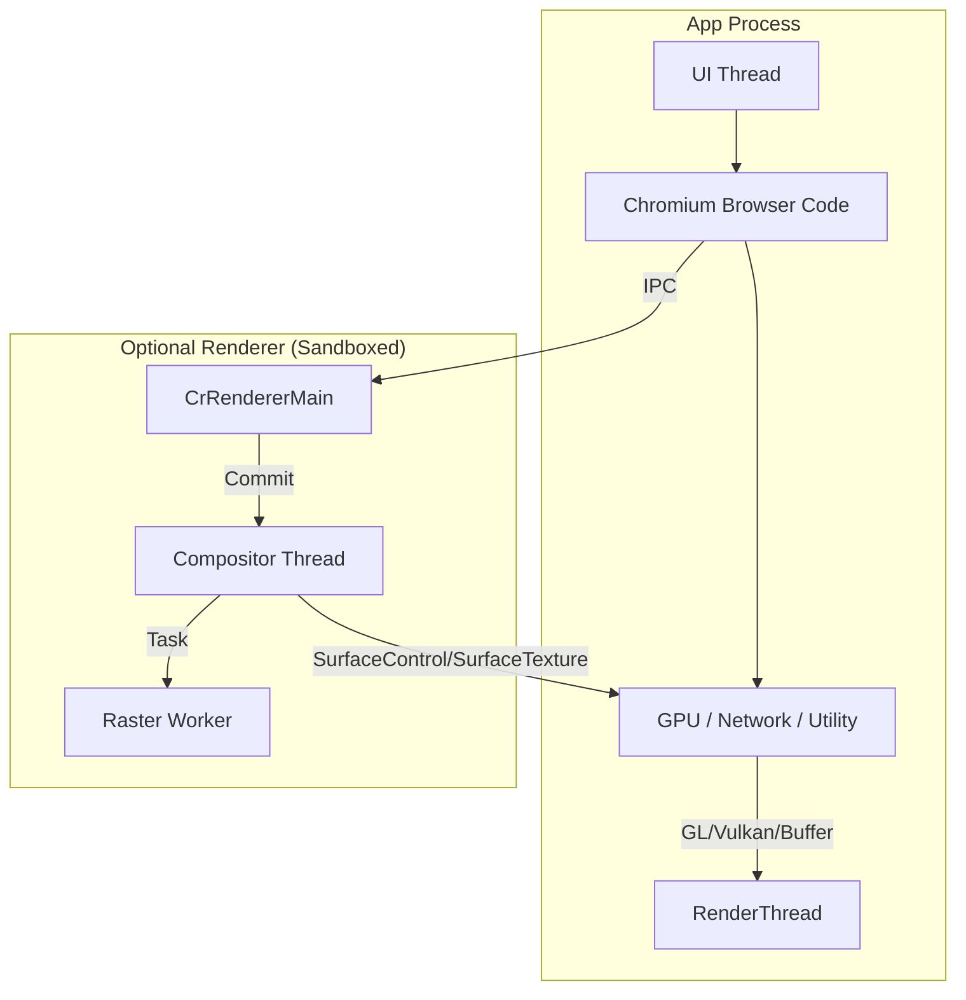
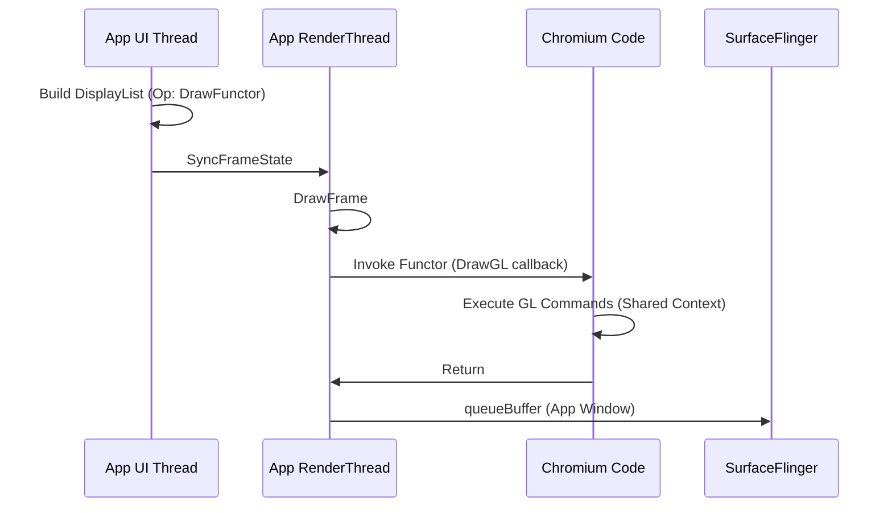
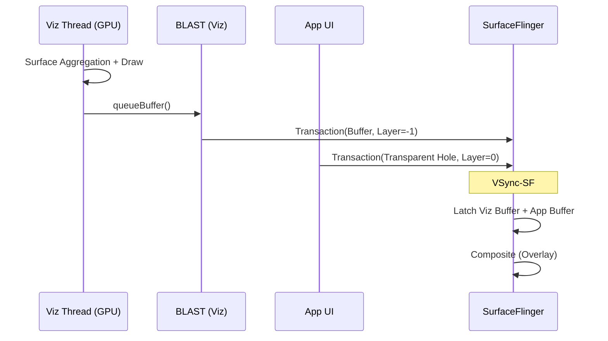

<!-- outline-start -->

**锚点（必须覆盖）：**
- WebView 的进程模型：Browser Code / GPU Services / Renderer 进程
- 四种渲染模式：GL Functor / SurfaceView Wrapper / SurfaceControl / Custom TextureView
- 每种模式的 Producer-Consumer 链路和性能特征
- 四种模式的对比矩阵
- 如何判断当前 WebView 走哪条链路

**扩展（可选深入）：**
- WebViewFactory 初始化与 Chromium 内核加载
- Hardware Draw Functor API（Android 10+）
- 国内 X5/UC 内核的特殊实现

<!-- outline-end -->

## 为什么 WebView 的渲染链路最复杂

WebView 是 Android 上渲染架构最复杂的组件——它内部运行了一个完整的 Chromium 浏览器引擎，拥有自己的多线程渲染管线（Blink 解析、Compositor 合成、Raster Worker 光栅化），但最终必须嵌入到 Android App 的 View 体系中。

这种"两个渲染系统的对接"导致了 WebView 存在**四种不同的渲染模式**，每种模式的 Producer-Consumer 链路、性能特征、适用场景都不同。你在 Perfetto 中看到 WebView 区域卡顿，如果不先判断它走的是哪条链路，优化方向可能是错的。[已验证: AOSP WebView 实现]

## 进程模型概述

在进入具体渲染模式之前，先理解 WebView 的进程架构。WebView 的 browser code、GPU / network 等服务通常在宿主 App 进程内运行；renderer 进程是否独立取决于 multiprocess 配置。

Chromium 侧的核心流程：HTML/CSS 解析 → Layout → Paint → Commit → Composite → Tile Rasterize。最终渲染结果需要以某种方式"交给" Android 侧显示——这就是四种渲染模式的分歧点。

## 模式一：GL Functor（最常见的默认路径）

这是普通 WebView 页面（新闻、H5 活动页）最常见的渲染模式。核心特点是：**WebView 蹭车 App 的 RenderThread**。

### 链路

1. **Chromium 侧**：解析 HTML/CSS，生成 DisplayItemList，Compositor 将图层切分为 Tile，Raster Worker 光栅化。
2. **App UI Thread**：View 树遍历到 WebView 时，往 RecordingCanvas 写一个 `DrawFunctorOp`（占位符）。
3. **App RenderThread**：执行到占位符时，调用 WebView 注册的 C++ 回调（`DrawGL`），用 App 的 EGLContext 执行 Chromium 的 GL 指令。

**性能特征**：如果网页太复杂，GL 指令执行时间过长，会直接拖慢 App 的 `DrawFrame` 总耗时，导致整个 App 掉帧。

## 模式二：SurfaceView Wrapper（全屏视频）

当用户点击网页上的全屏视频按钮时，WebView 通过 `onShowCustomView()` 回调通知宿主 App，宿主创建一个 SurfaceView 来托管视频播放。

### 链路

1. **触发**：`WebChromeClient.onShowCustomView(View view, Callback callback)`。
2. **托管**：宿主 App 将返回的 SurfaceView 添加到布局中。
3. **渲染**：底层的 MediaPlayer/MediaCodec 直接向 SurfaceView 的 BufferQueue 生产帧数据。
4. **合成**：SurfaceFlinger 将视频 Layer 与 App 主窗口叠加。

**性能特征**：等同于原生 SurfaceView 视频播放，性能极高。WebView 在这个模式下只负责信令和容器。

## 模式三：SurfaceControl（现代独立合成）

当设备、WebView provider 和 Chromium feature 都满足条件时，WebView 可能切换到独立合成模式。这是一种条件成立时才可能出现的路径，不应视为所有现代 WebView 的固定默认。

### 链路

1. **初始化**：Chromium 内核请求系统创建 `ASurfaceControl`（Child Layer）。
2. **独立生产**：Viz/Compositor 线程在独立的 GraphicBuffer 上绘制合成结果。
3. **Hole Punching**：App RenderThread 在 WebView 区域绘制透明占位。
4. **BLAST 提交**：Chromium 通过 SurfaceControl Transaction 直接提交给 SurfaceFlinger。

**性能特征**：WebView 内容与宿主 UI 解耦，网页卡顿对宿主的影响较小。但视频/Overlay 路径仍取决于 HWC 能力。

## 模式四：Custom TextureView（国内定制内核）

这是国内互联网 App 非常常见的模式，常见于腾讯 X5 内核、UC 内核等第三方 WebView SDK。

### 链路

1. **SDK 内核**：定制 Chromium 将网页光栅化到 `SurfaceTexture`。
2. **回调**：`onFrameAvailable` 通知 App。
3. **宿主合成**：App RenderThread 通过 `updateTexImage()` 绑定纹理，将网页帧画在主窗口上。

**性能特征**：兼容性极好（支持动画、圆角、复杂层级嵌入），但多一次宿主侧纹理采样，性能开销通常较大。

## 四种模式对比矩阵

| 维度 | GL Functor | SV Wrapper | SurfaceControl | Custom TextureView |
|:---|:---|:---|:---|:---|
| **Producer** | Chromium (in RT) | MediaPlayer | Viz Thread | SDK Kernel |
| **Consumer** | App RT | SurfaceFlinger | SurfaceFlinger | App RT |
| **经过 App RT** | ✅ 同步执行 | ❌ | ❌ | ✅ 纹理采样 |
| **独立性** | 低（共享 Context） | 高 | 高 | 低 |
| **灵活性** | 中 | 低 | 低 | 高 |
| **性能** | 中 | 高 | 高 | 低 |
| **典型场景** | 普通页面 | 全屏视频 | 条件满足时 | 国内 SDK |

## 如何判断当前走哪条链路

1. **Perfetto 检查**：
   - 看到 RenderThread 中有 `DrawFunctor`/`DrawGL` → GL Functor
   - 看到独立的 SurfaceView Layer + MediaCodec → SV Wrapper
   - 看到 `VizCompositorThread` + 独立 Child Layer → SurfaceControl
   - 看到 `SurfaceTexture` + `updateTexImage` → Custom TextureView

2. **dumpsys SurfaceFlinger**：查看 WebView 区域的 Layer 类型——独立 Layer 还是 App 主窗口的一部分。

3. **代码检查**：
   - 使用 `setLayerType(LAYER_TYPE_NONE, null)` → 可能是 GL Functor
   - 使用 `setLayerType(LAYER_TYPE_HARDWARE, null)` → 可能是 SurfaceControl
   - 第三方 SDK → 可能是 Custom TextureView

## 与其他章节的关系

- **7.11 WebView 渲染性能与优化**：WebView 性能优化的实战视角
- **18.6 SurfaceView / 18.7 TextureView**：底层组件的链路详解
- **2.5 MainThread 与 RenderThread 协作**：App 侧渲染管线

## 参考资料

- AOSP `frameworks/base/core/java/android/webkit/WebView.java`
- Chromium Viz Compositor 架构文档
- Android 官方文档：WebView 概览
