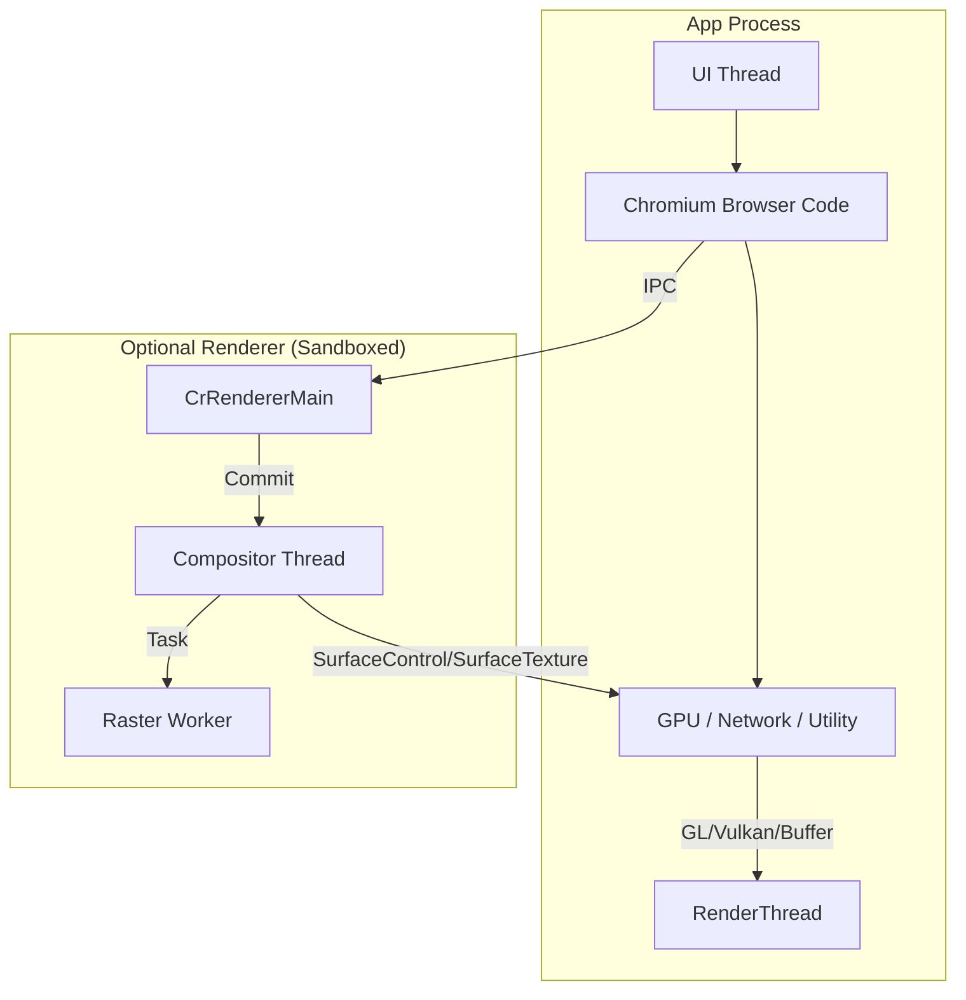
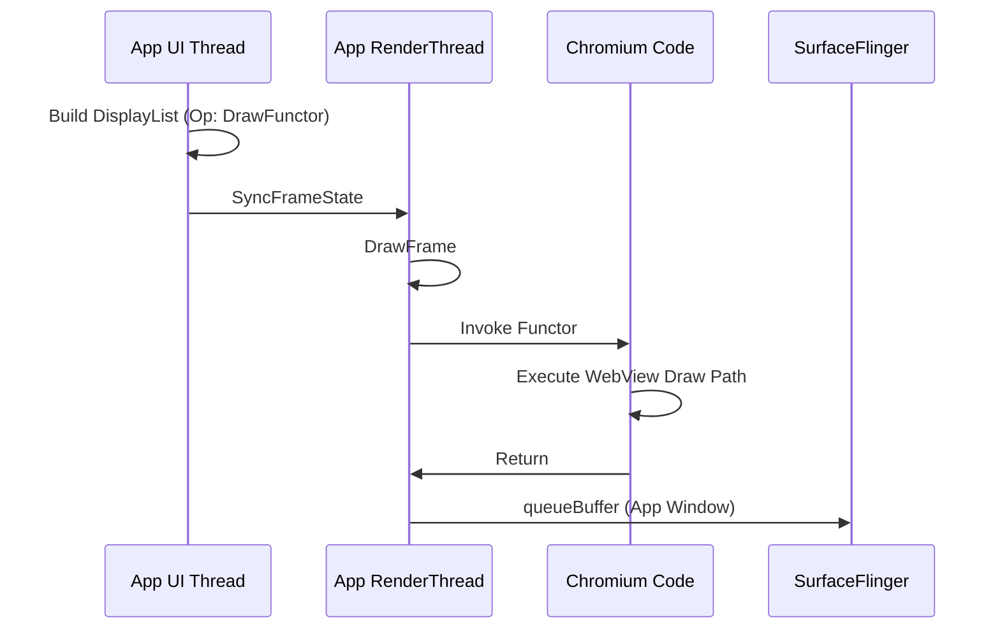

<!-- outline-start -->

**锚点（必须覆盖）：**
- WebView 的进程模型：Browser Code / GPU Services / Renderer 进程
- 四种渲染模式：GL Functor / SurfaceView Wrapper / SurfaceControl / Custom TextureView
- 每种模式的 Producer-Consumer 链路和性能特征
- 四种模式的对比矩阵
- 如何判断当前 WebView 走哪条链路

**扩展（可选深入）：**
- WebViewFactory 初始化与 Chromium 内核加载
- Hardware Draw Functor API（Android 10+）
- 国内 X5/UC 内核的特殊实现

<!-- outline-end -->

## 为什么 WebView 的渲染链路最复杂

WebView 是 Android 上渲染架构最复杂的组件——它内部运行了一个完整的 Chromium 浏览器引擎，拥有自己的多线程渲染管线（Blink 解析、Compositor 合成、Raster Worker 光栅化），但最终必须嵌入到 Android App 的 View 体系中。

这种"两个渲染系统的对接"导致了 WebView 存在**四种不同的渲染模式**，每种模式的 Producer-Consumer 链路、性能特征、适用场景都不同。你在 Perfetto 中看到 WebView 区域卡顿，如果不先判断它走的是哪条链路，优化方向可能是错的。[已验证: AOSP WebView 实现]

## 进程模型概述

在进入具体渲染模式之前，先理解 WebView 的进程架构。WebView 的 browser code、GPU / network 等服务通常在宿主 App 进程内运行；renderer 进程是否独立取决于 multiprocess 配置。



Chromium 侧的核心流程：HTML/CSS 解析 → Layout → Paint → Commit → Composite → Tile Rasterize。最终渲染结果需要以某种方式"交给" Android 侧显示——这就是四种渲染模式的分歧点。

## 模式一：GL Functor（最常见的默认路径）

普通页面更常见的是宿主窗口内合成路径。网页内容仍然压在宿主这帧的 RenderThread 里完成提交，网页重绘一旦变重，App 主窗口的绘制预算会被一起吃掉。

### 链路

1. **Chromium 侧**：解析 HTML/CSS，生成 DisplayItemList，Compositor 将图层切分为 Tile，Raster Worker 光栅化。
2. **App UI Thread**：View 树遍历到 WebView 时，往 RecordingCanvas 写入 functor 占位操作。
3. **App RenderThread**：执行到占位操作时，回调 WebView provider 注册的 functor，把网页内容插入宿主窗口这帧的渲染流程。



### 版本分界

| 版本 | 平台侧常见口径 | 看 trace 时怎么认 |
|:---|:---|:---|
| Android 5-9 | 公开资料里常见 `DrawGL` / GL functor 这组老名字 | WebView 绘制开销落在宿主 RenderThread，同一帧里能看到 functor 回调 |
| Android 10+ | 平台侧改用 Hardware Draw Functor / DrawFn API 口径 | 仍然是宿主 RenderThread 执行 functor，只是平台对接 API 换成了新名字 |

**性能特征**：网页绘制开销会直接计入宿主窗口这帧的 `DrawFrame`。Perfetto 里常见的现象是 App RenderThread 出现长时间的 functor 回调或随后的 GPU 工作。

## 模式二：SurfaceView Wrapper / Custom View 托管（全屏内容）

网页请求全屏内容时，WebView 会通过 `onShowCustomView()` 把一个 custom view 交给宿主接管。这个 view 经常承载全屏视频，但类型不固定，可能是 `SurfaceView`、`TextureView`，也可能是外层包装容器。

### 路径

1. **触发**：`WebChromeClient.onShowCustomView(View view, CustomViewCallback callback)`。
2. **托管**：宿主把回调给出的 `view` 挂进全屏容器，并保存 `callback` 以便退出全屏时回调。
3. **渲染**：真正的 producer-consumer 关系取决于这个 `view` 的实际类型。若内部是 `SurfaceView`，常见路径是 `MediaCodec/MediaPlayer → BufferQueue → SurfaceFlinger`；若内部是 `TextureView`，常见路径会回到宿主窗口合成。
4. **验证**：看运行时 view tree、Perfetto 和 layer dump，再判断这一帧是不是独立 Surface 路径。

**性能特征**：全屏播放通常可以获得比嵌在页面里的视频更独立的合成路径，但结论要跟着运行时 `view` 类型走。

## 模式三：SurfaceControl / 独立 child layer（需实机确认）

当 WebView provider、Chromium feature 和设备图形栈同时满足条件时，网页内容可能脱离宿主主窗口的主 buffer，走独立 child layer 路径。这条路径跨版本差异很大，拿不到 provider 版本、Perfetto 和 `dumpsys SurfaceFlinger` 三组证据时，只能把它当作候选路径。

### 候选路径（需实机确认）

1. **独立 layer**：WebView provider 为网页内容准备独立 layer 或等价的独立提交面。
2. **独立生产**：Viz / Compositor 线程把合成结果写入这条独立路径。
3. **宿主占位**：宿主窗口保留几何信息和占位区域，网页内容不再和宿主 View 树共用同一个主窗口 buffer。
4. **系统合成**：SurfaceFlinger 在同一轮合成里同时 latch 宿主窗口和网页 child layer。

> [!note]
> 启用条件依赖 WebView provider 版本、Chromium feature flag 和设备图形栈。公开的 AOSP `WebView.java` 无法单独证明设备一定会走这条路径。[待验证：SurfaceControl 独立 child layer 路径的启用条件依赖 WebView provider 版本、Chromium feature flag 和设备图形栈，需实机确认]

**性能特征**：网页内容和宿主 UI 的预算可以分开观察，宿主 RenderThread 压力通常更小。能否换来更好的帧稳定性，仍取决于 provider 实现、HWC 能力和页面负载。

## 模式四：Custom TextureView / Texture-like 路径（第三方内核）

部分第三方 WebView SDK 会为了圆角、动画、浮层叠加或视频兼容性，引入 TextureView / SurfaceTexture 类似路径。问题在于这不是所有 X5/UC 版本的固定实现，同一家 SDK 也可能随版本切换。没有 SDK 版本、view tree 和 trace 证据时，只能把它当作候选路径。

### 链路

1. **SDK 内核**：第三方内核把网页内容写到 `SurfaceTexture` 或等价的纹理生产路径。
2. **回调**：`onFrameAvailable` 或 SDK 自己的回调通知宿主有新帧可用。
3. **宿主合成**：宿主 RenderThread 调用 `updateTexImage()` 或等价流程，把网页帧并入主窗口。
4. **验证**：同时记录 SDK 版本、运行时 view tree，以及 Perfetto 里的 `SurfaceTexture` / `updateTexImage` 证据。

**性能特征**：这条路径对动画和复杂层级更友好，但宿主侧多一次纹理采样，开销是否可接受取决于 SDK 实现和页面负载。

## 四种模式对比矩阵

| 维度 | GL Functor | Custom View 托管 | SurfaceControl 候选路径 | Texture-like 路径 |
|:---|:---|:---|:---|:---|
| **Producer** | Chromium Compositor | MediaCodec 或网页交出的 custom view | Viz / Compositor | 第三方 SDK 内核 |
| **Consumer** | 宿主 RenderThread → SurfaceFlinger | 取决于 custom view 类型 | SurfaceFlinger | 宿主 RenderThread |
| **经过宿主 RenderThread** | ✅ 同步执行 | 视 `view` 类型而定 | 通常不经过主窗口这帧 | ✅ 纹理采样 |
| **独立性** | 低 | 中到高 | 高 | 低 |
| **证据要求** | functor slice | `onShowCustomView()` + view tree + layer dump | provider + trace + layer dump | SDK 版本 + view tree + `updateTexImage` |
| **典型场景** | 普通页面 | 全屏视频 / 全屏内容 | 较新的 provider 组合，需实机确认 | 部分第三方 SDK 版本 |

## 如何判断当前走哪条链路

单看一条 heuristic 很容易误判。更稳妥的做法是把 provider、trace 和 layer dump 三组证据拼在一起。

### 1. 先确认 WebView provider 版本

```kotlin
val pkg = WebViewCompat.getCurrentWebViewPackage(context)
Log.d("WebViewProvider", "${pkg?.packageName} ${pkg?.versionName}")
```

- 设备侧再跑一次 `adb shell dumpsys webviewupdate`
- 这一步只能回答“当前进程用了哪一版 WebView provider”，不能单独判断渲染模式

### 2. 再看 Perfetto

| 观察点 | 更像哪种路径 | 说明 |
|:---|:---|:---|
| 宿主 `RenderThread` 同帧出现 `DrawFunctor` / `Invoke Functor` 一类 slice | GL Functor | 网页绘制开销落在宿主窗口这帧里 |
| 全屏播放时出现独立视频 layer，且宿主收到 `onShowCustomView()` | Custom View 托管 | 还要继续看运行时 `view` 类型，不能直接断言是 `SurfaceView` |
| `Viz` / WebView GPU 线程活跃，同时 `SurfaceFlinger` 能看到对应 child layer | SurfaceControl 候选路径 | provider、trace、layer dump 三证合一后再下结论 |
| 宿主 `RenderThread` 出现 `SurfaceTexture` / `updateTexImage` | Texture-like 路径 | 常见于第三方 SDK，把网页帧重新采样进主窗口 |

### 3. 用 `dumpsys SurfaceFlinger` 收口

```bash
adb shell dumpsys SurfaceFlinger --list
adb shell dumpsys SurfaceFlinger | sed -n '/<包名或 layer 关键字>/,/^$/p'
```

- 只有宿主主窗口，没有额外 child layer，更像 GL Functor
- 同一区域出现独立 child layer，再结合 Perfetto 看 producer 线程，才能把结论收敛到独立合成路径
- 全屏场景要把网页容器、视频 layer 和宿主主窗口一起看

### 4. 对全屏视频和第三方内核再补一层验证

- `onShowCustomView()` 交给宿主的是一个 `View`，应记录运行时 `view.javaClass.name`
- 第三方 SDK 场景要同时记录 SDK 版本、view tree、layer dump 和 Perfetto 证据
- `setLayerType(LAYER_TYPE_NONE/HARDWARE)` 只能说明 View layer cache 策略，不能用来判断 WebView 内部到底走 functor、独立 layer，还是第三方 Texture-like 路径

## 与其他章节的关系

- **7.11 WebView 渲染性能与优化**：WebView 性能优化的实战视角
- **18.6 SurfaceView / 18.7 TextureView**：底层组件的链路详解
- **2.5 MainThread 与 RenderThread 协作**：App 侧渲染管线

## 参考资料

- AOSP `frameworks/base/core/java/android/webkit/WebView.java`
- Chromium Viz Compositor 架构文档
- Android 官方文档：WebView 概览
