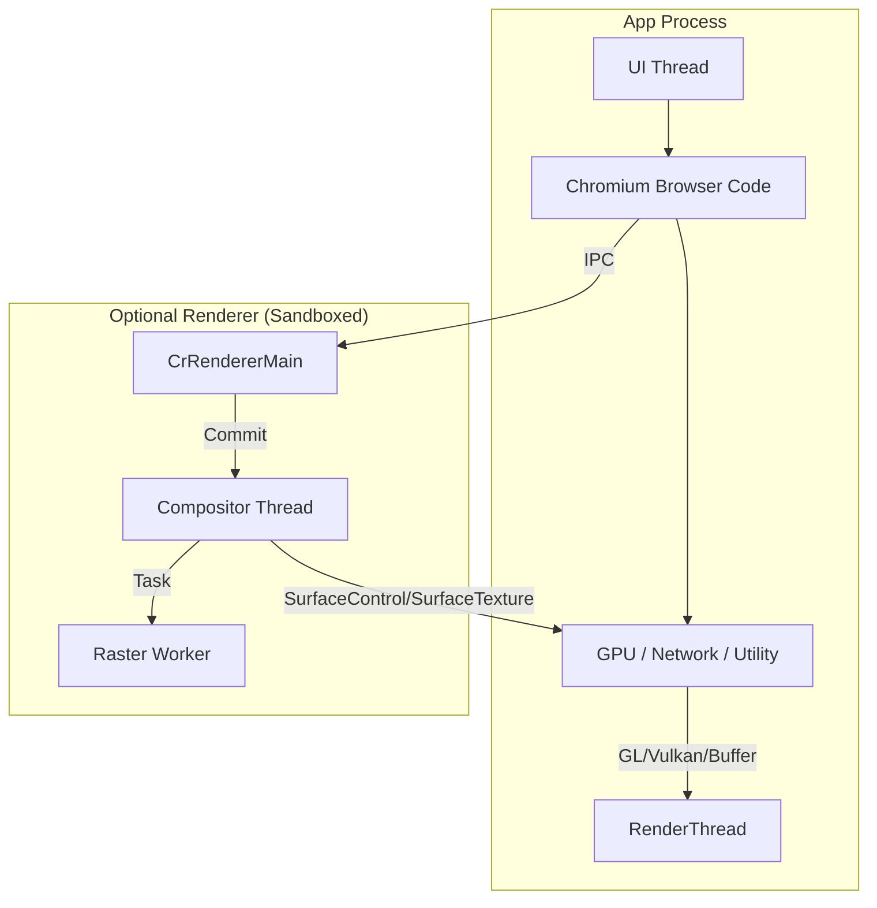
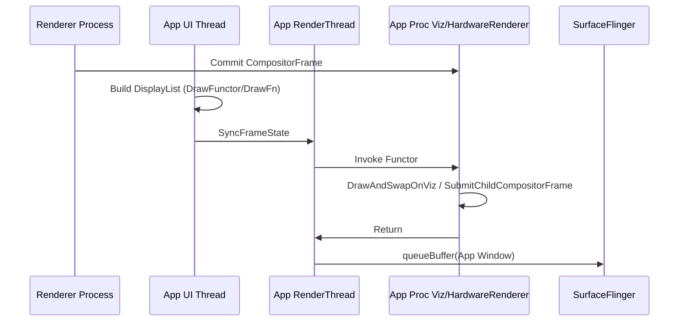

<!-- outline-start -->

**锚点(必须覆盖):**
- WebView 的进程模型:Browser Code / GPU Services / Renderer 进程
- 三层边界:官方 Android System WebView provider 内部路径 / 宿主全屏托管分支 / 第三方 SDK 扩展路径
- 官方 provider 内部两条常见路径:GL Functor / SurfaceControl 独立子 Surface
- 宿主全屏 custom view 与第三方 Texture-like 实现的 producer / consumer 关系
- 常见现场对比表
- 如何判断当前 WebView 走哪条路径

**扩展(可选深入):**
- WebViewFactory 初始化与 Chromium 内核加载
- Hardware Draw Functor API(Android 10+)
- 国内 X5/UC 内核的特殊实现

<!-- outline-end -->

## 为什么 WebView 的渲染管线最复杂

WebView 在 Android 上同时接着两套渲染系统:网页内容由 Chromium 侧完成解析、布局、合成和光栅化,显示结果又要落进 Android 的 View 与 Surface 体系里。

排查 WebView 卡顿时,先把边界分开:官方 Android System WebView provider 内部路径、网页进入 fullscreen mode 后的宿主托管分支、第三方 WebView SDK 扩展路径。GL Functor 和 `SurfaceControl` 子 Surface 属于官方 provider 内部实现;`onShowCustomView()` 说的是宿主接管全屏 view;Texture-like 路径多见于第三方 SDK。三类证据混着看,Perfetto、view tree 和 layer dump 不易对齐。[已验证: AOSP WebView 实现]

## 先把边界分清

| 层级 | 属于谁 | 常见现场 | 起手证据 |
|:---|:---|:---|:---|
| 官方 provider 内部路径 | Android System WebView / Trichrome provider | GL Functor、`SurfaceControl` 子 Surface | `dumpsys webviewupdate`、provider `versionName`、Perfetto、`dumpsys SurfaceFlinger` |
| 宿主全屏托管分支 | `WebChromeClient.onShowCustomView()` 交给宿主的 `View` | fullscreen video、fullscreen content | fullscreen callback、运行时 `view.javaClass.name`、layer dump |
| 第三方 SDK 扩展路径 | X5 / UC 等自带内核 | `TextureView` / `SurfaceTexture` 类似实现 | SDK 版本、view tree、`updateTexImage` / `onFrameAvailable` 证据 |

## 进程模型概述

在进入具体路径之前,先看 WebView 的进程结构。WebView 的 browser code、GPU / network 等服务通常在宿主 App 进程内运行;renderer 进程是否独立取决于 multiprocess 配置。



Chromium 侧的流程是:HTML/CSS 解析 → Layout → Paint → Commit → Composite → Tile Rasterize。显示结果落到哪一条路径,由当前 provider、宿主回调和运行时 view 类型一起决定。

## 平台版本和 provider 版本要一起记录

WebView provider 自 Android 5 起就是可独立更新组件。排查渲染路径时,Android 主版本只给出平台下限,`versionName` 才能说明当前进程实际跑的是哪一版 provider;这个版本号通常直接对应 Chromium milestone。

```kotlin
val pkg = WebViewCompat.getCurrentWebViewPackage(context)
Log.d("WebViewProvider", "${pkg?.packageName} ${pkg?.versionName}")
```

```bash
adb shell dumpsys webviewupdate
```

| 观察维度 | 平台下限 | 需要记录的 provider / Chromium 信息 | 判断口径 |
|:---|:---|:---|:---|
| WebView provider 是否可独立更新 | Android 5+ | `packageName`、`versionName` | 先确认当前是 Android System WebView / Trichrome provider,还是厂商替换实现 |
| 宿主对接 API 名称 | Android 5-9 / Android 10+ | provider 版本仍要单独记录 | Android 10+ 常见 `Hardware Draw Functor` / `DrawFn` 口径,Android 5-9 常见 `DrawGL` / GL functor 口径 |
| `SurfaceControl` 子 Surface 候选 | Android 12+ 平台具备 `SurfaceControl` / DrawFn 基础及平台回调 | 记录 `versionName` 对应的 Chromium milestone,并结合 trace / layer dump 看运行时是否命中 | 能否走独立子 Surface 不能只按 Android major version 判断 |

### WebViewChromiumFactory 初始化分层

1. **Factory 加载**:WebViewFactory 通过 `getFactory()` 检查当前 provider 是否可用
2. **Provider 选择**:WebViewUpdateService 选择当前可用的 Android System WebView / Trichrome provider
3. **Native 库加载**:加载 `libwebviewchromium.so` 及相关 native 库
4. **Browser Context 初始化**:创建 `content::BrowserContext` 实例
5. **Renderer 初始化**:根据 multiprocess 配置决定是否创建独立渲染进程
6. **GL/Vulkan 后端选择**:基于宿主 HWUI 配置选择对应渲染后端

**验证入口**:
```bash
adb shell dumpsys webviewupdate
adb logcat | grep -i "webview.*factory\\|webview.*chromium"
adb shell ls /data/app/*/lib/arm64/libwebviewchromium.so
```

**排查口径**:
- WebView 创建时先完成 provider / factory 可用性检查
- 渲染路径选择要等第一次硬件绘制和 provider 运行时条件一起判断
- GL/Vulkan 后端必须与宿主 HWUI 保持一致

`SurfaceControl` 子 Surface 的判断从 provider 版本开始，再看 Perfetto 与 `dumpsys SurfaceFlinger`。只看系统版本，结论容易偏。

## 官方 Android System WebView provider 内部路径

官方 provider 内部更常见的有两条路径:宿主窗口内合成的 GL Functor,以及条件满足时拆到独立 child layer 的 `SurfaceControl` 路径。

### 路径 A:GL Functor(默认路径)

普通页面更常见的是宿主窗口内合成。网页内容仍压在宿主这帧的 `RenderThread` 里完成提交,网页重绘一旦变重,App 主窗口的绘制预算会一起被吃掉。

#### 提交过程

1. **Renderer 侧产帧**:Renderer 进程里的 Compositor 生成 `CompositorFrame`,等待宿主侧消费。
2. **App UI Thread**:View 树遍历到 WebView 时,往 `RecordingCanvas` 写入 `DrawFunctor` / `DrawFn` 占位操作;`BrowserViewRenderer::OnDrawHardware()` 同时更新父窗口约束,并通过 `SynchronousCompositor::DemandDrawHwAsync()` 拉取当前 child frame。
3. **App RenderThread + 宿主 Viz**:宿主 `RenderThread` 执行 functor 时进入 `HardwareRenderer::Draw()`;Chromium 再把 `OnViz::DrawAndSwapOnViz()` 调度到宿主进程内的 Viz 线程,提交 `ChildCompositorFrame`,把网页内容画进当前父 surface。



#### 平台口径

- Android 5-9 的公开资料里更常见 `DrawGL` / GL functor 这组旧名字。
- Android 10+ 平台侧更常见 `Hardware Draw Functor` / `DrawFn` 口径。
- 两组名字都指向同一类现象:网页绘制开销落在宿主窗口这一帧的 `RenderThread` 里。

**性能特征**:网页绘制开销会直接计入宿主窗口这帧的 `DrawFrame`。Perfetto 里如果宿主 `RenderThread` 出现长时间的 functor 回调,同时 `CrRendererMain`、Viz 或 WebView GPU 线程也在忙,网页内容仍并入宿主窗口这一帧。

#### 现场记录模板

没有 trace artifact、测试页面、采样条件和 provider 版本时,不要写固定帧耗或百分比。WebView 渲染路径的可复查记录至少保留下面几项:

| 字段 | 记录内容 | 用途 |
|:---|:---|:---|
| 设备与系统 | 机型、Android 版本、GPU、刷新率 | 排除设备能力差异 |
| Provider | `packageName`、`versionName`、是否第三方 SDK | 把平台版本和 provider 版本分开 |
| 页面负载 | URL / 本地复现页、视频/Canvas/WebGL/长列表类型 | 解释 renderer 与 GPU 线程负载 |
| Trace 证据 | Perfetto 文件路径、关键线程、关键 slice 名称 | 判断 functor、Viz、SurfaceFlinger 的时间关系 |
| Layer 证据 | `dumpsys SurfaceFlinger --list` 与目标 layer 片段 | 判断是否存在独立 child layer |
| 结论边界 | 命中的路径、未命中的证据、仍待确认项 | 防止把单次设备表现写成通用规律 |

对比 GL Functor、`SurfaceControl` 子 Surface、fullscreen custom view 和第三方 Texture-like 路径时,先用同一页面和同一 WebView provider 复现。若 provider 或页面负载变了,帧耗差异只能作为新样本,不能直接归因到路径切换。

#### Functor 路径里几个容易踩的点

排查这条路时还要把下面几条架构事实记牢:

1. **HWUI 后端 = WebView 后端,必须一致**:宿主 HWUI 走 Vulkan,WebView 必须走 Vulkan;走 GL 同理。它们共享 GPU context,不可能一边 GL 一边 Vulkan。判断 WebView 走哪条后端时不要单独看 WebView 侧开关,先看宿主 HWUI 配置。
2. **`AwDrawFnImpl::DrawGL` / `DrawVk` 双回调**:Android P 之后 HWUI 通过 `AwDrawFnFunctorCallbacks` 结构体(含 `draw_gl` / `draw_vk` 两个字段)回调 Chromium 侧;HWUI 根据当前 pipeline 调用对应一个,最终落到 `AwDrawFnImpl::DrawGL` 或 `AwDrawFnImpl::DrawVk`。Trace 上看到 `DrawGL` slice 还是 `DrawVk` slice,对应当前后端。
3. **`VizCompositorThread` 不做最终 swap**:独立 Chrome 中 Viz 既合成又 swap;stock WebView 中 Viz 仍然做合成、overlay 决策、SkiaRenderer DDL 记录,但**不做最终 buffer swap**--swap 由宿主 `RenderThread` 通过 draw functor 替 Viz 执行。这是 WebView 区别于独立 Chrome 的架构核心。
4. **GPU 资源共享的精确口径**:Chromium 与 HWUI 各自持有 context,通过 GPU resource sharing 共享底层资源--GL 路径下 Chromium 用 virtual EGL context 映射到与 HWUI `RenderThread` 的 real context(同一 shared context group);Vulkan 路径下走基于 `AHardwareBuffer` 的 SharedImage。底层不每帧 CPU 拷贝整块像素,但 context make-current 切换可能在 trace 上有可见开销。
5. **软件渲染 fallback**:宿主未启用硬件加速(`android:hardwareAccelerated="false"`)或 View 设为 `LAYER_TYPE_SOFTWARE` 时,WebView 不走 functor,fallback 到 `AwContents.onDrawSoftware()` → `BrowserViewRenderer.onDrawSoftware()`,直接在 CPU Canvas 上做软件光栅化。trace 上看不到 `DrawFunctor` slice,取而代之的是 CPU 侧绘制耗时。注意软件 fallback 不等于 Chromium 内部纯 CPU--根据版本和功能开关,tile raster 仍可能走 GPU,只是最终合成后把 bitmap 拷回宿主 Canvas。

[已验证: Chromium `android_webview/public/browser/draw_fn.h` `AwDrawFnFunctorCallbacks` + `android_webview/browser/gfx/aw_draw_fn_impl.cc` + `android_webview/browser/aw_contents.cc` `onDrawSoftware`]

### 路径 B:`SurfaceControl` 独立子 Surface(provider 条件满足时)

这条路径仍发生在官方 provider 内部。`HardwareRenderer::DrawAndSwap()` 会先和 `OverlayProcessorWebView` 协商 `SurfaceControl` 可用性;`OverlayProcessorWebView::Manager` 负责创建和维护 `ASurfaceControl`,并在 RenderThread / GPU Main 上更新几何信息和 buffer。源码里至少有四层门槛:HWUI 通过 `SetOverlaysEnabledByHWUI()` 放行,Viz 侧 `GpuServiceImpl` 已就绪,candidate 通过 `OverlayProcessorSurfaceControl::CheckOverlaySupportImpl()` 检查,对应 frame sink 也没有进入 `blocked_frame_sink_ids_`。运行时是否真的命中,仍取决于这些门槛是否同时满足。[更多 Transaction / fence 细节见 §18.10 SurfaceControl API 深入]

#### 现场排查脚本

排查 WebView 渲染路径时,设备能力和 provider 版本不匹配很容易造成误判:即使系统是 Android 12+,当前页面也可能不会走 `SurfaceControl` 路径。下面的脚本只负责收集证据,不直接给出路径结论。

```bash
#!/bin/bash

# 检查 WebView provider 信息
echo "=== WebView Provider Info ==="
adb shell dumpsys webviewupdate | grep -E "(versionName|versionCode|provider)"

# 检查系统版本
echo -e "\n=== Android Version ==="
adb shell getprop ro.build.version.release

# 检查 SurfaceFlinger 层级关系
echo -e "\n=== SurfaceFlinger Layers ==="
adb shell dumpsys SurfaceFlinger | grep -E "(WebView|webview)" | head -10

# 检查硬件加速状态
echo -e "\n=== Hardware Acceleration ==="
adb shell dumpsys gfxinfo com.your.package | head -5
```

#### 提交过程

1. **候选 overlay**:WebView 在宿主窗口绘制时先跑 overlay support 检查。HWUI 没有放行、GpuService 还没准备好,或者 candidate 检查没过时,这一帧就留在宿主窗口内合成。
2. **创建子 Surface**:`OverlayProcessorWebView::Manager` 以宿主父 surface 为挂载点创建子 `ASurfaceControl`,同步几何信息。
3. **独立更新 buffer**:Viz / Renderer 继续生产网页帧,GPU Main 把新 buffer 更新到这个子 Surface;同一个 frame sink 继续命中时,常见的是只更新几何,嵌入 surface 变化时再补 buffer。
4. **系统合成**:SurfaceFlinger 在同一轮合成里同时处理宿主主窗口和 WebView 子 Surface;条件不满足时则回落到宿主窗口内合成。

> [!note]
> 代码层已经存在独立 `SurfaceControl` 路径；需要实机确认的是"当前设备、当前 provider、当前页面这一帧有没有命中它"。排障时要把 provider 版本、Perfetto 与 `dumpsys SurfaceFlinger` 三组证据一起看。
> 
> [!important]
> **平台版本说明**：Android 10/11 具备 DrawFn/GL-Vulkan functor 基础接口，但 HWUI `WebViewFunctorManager` 缺少 SurfaceControl/transaction 回调。Android 12+ 才具备 WebView overlay path 所需的平台侧回调支持。

### Android 12-17 平台与 provider 版本边界

`SurfaceControl` 子 Surface 不能按 Android 15、16、17 直接切成固定等级。Android 平台提供 `SurfaceControl`、DrawFn 和 HWUI 侧回调基础;WebView provider 又作为可独立更新组件交付 Chromium 侧实现。两者同时满足,运行时还要通过 overlay support 检查和页面状态检查。

```bash
adb shell getprop ro.build.version.release
adb shell getprop ro.build.version.sdk
adb shell dumpsys webviewupdate | grep -E "Current WebView package|packageName|versionName|versionCode"
adb shell dumpsys SurfaceFlinger --list | grep -i "webview\\|surfaceview\\|<包名>"
```

判断当前 WebView 是否走 `SurfaceControl` 路径,同时检查:

1. **平台版本**：Android 12+ 是基础要求
2. **Provider 版本**：通过 Chromium milestone 判断具体实现能力
3. **运行时命中**：Perfetto 中查看 Viz 线程是否与独立 child layer 产生交互
4. **Overlay 检查**：确认 `SetOverlaysEnabledByHWUI()` 和 overlay support 检查是否通过

章节不使用应用侧 Display 硬件能力探测伪代码作为公开 API 证据。应用侧能稳定拿到的是 provider 信息、fullscreen 回调、运行时 view class、Perfetto trace 与 SurfaceFlinger layer dump;overlay 检查细节属于 Chromium / HWUI 内部决策,通过源码和 trace 间接验证。

**性能特征**:命中后,网页内容可以从宿主主窗口 buffer 中拆出去,宿主 `RenderThread` 只保留几何同步和必要协调。网页重绘压力会更容易和 App UI 预算分开观察。

## 宿主全屏托管分支:`onShowCustomView()`

只有网页请求全屏模式时,WebView 才会通过 `onShowCustomView()` 把一个 custom view 交给宿主管理。常见触发源是 HTML5 Fullscreen API 或全屏视频控件;单纯把 WebView 的布局拉满屏,不会触发这条分支。这里说的是宿主接管动作,producer / consumer 关系继续由返回 `view` 的实际类型决定。

#### 实际触发与运行时判断

实际排查中常见的误判，是把布局满屏当成 fullscreen custom view。关键观察点如下：

```kotlin
// WebChromeClient 示例 - 正确判断全屏触发条件
class MyWebChromeClient : WebChromeClient() {
    
    override fun onShowCustomView(view: View?, callback: CustomViewCallback?) {
        // 只有网页主动请求全屏时才会调用此回调
        // 不包括单纯把 WebView 宽高设置为 match_parent
        Log.d("Fullscreen", "WebView 请求全屏托管，view type: ${view?.javaClass?.simpleName}")
        
        // 保存回调，用于后续退出全屏
        customViewCallback = callback
        
        // 把 view 添加到全屏容器
        fullScreenContainer.addView(view)
    }
    
    override fun onHideCustomView() {
        // 退出全屏时调用
        fullScreenContainer.removeAllViews()
        customViewCallback?.onCustomViewHidden()
        customViewCallback = null
    }
}
```

**区分主动全屏 vs 布局满屏**：
- **主动全屏**：网页 JavaScript 调用 `element.requestFullscreen()`，触发 `onShowCustomView`
- **布局满屏**：XML 中设置 `layout_width="match_parent"`，页面内容填满 WebView 区域，**不会触发托管分支**

**运行时观察方法**：
- 查看 Perfetto 中的 fullscreen 相关 slice
- 检查 `view.javaClass.name` 是 `SurfaceView`、`TextureView` 还是自定义 View
- 结合 `dumpsys SurfaceFlinger` 查看是否有独立的全屏 layer

### 提交过程

1. **触发前提**:网页进入 fullscreen mode,WebView 调用 `WebChromeClient.onShowCustomView(View view, CustomViewCallback callback)`。AOSP `WebChromeClient` 的注释把它定义为"把当前页面请求的全屏 custom view 交给宿主显示"。
2. **托管**:宿主把回调给出的 `view` 挂进全屏容器,并保存 `callback` 以便退出全屏时回调。
3. **渲染**:返回值如果是 `SurfaceView`,常见路径是 `MediaCodec/MediaPlayer → BufferQueue → SurfaceFlinger`;如果是 `TextureView`,常见路径会回到宿主窗口合成;如果是外层容器,还要继续看内部 child view。
4. **验证**:记录运行时 `view.javaClass.name`,再结合 Perfetto 和 layer dump 判断这一帧的实际路径。

**性能特征**:全屏播放经常能拿到比页面内嵌视频更独立的合成方式,结论仍要跟着运行时 `view` 类型走。`onShowCustomView()` 本身不直接定义 Chromium provider 内部的合成模式。

## 第三方 SDK 扩展路径:Texture-like 实现

部分第三方 WebView SDK 会为了圆角、动画、浮层叠加或视频兼容性,引入 `TextureView` / `SurfaceTexture` 类似路径。同一 SDK 在不同 X5 / UC 版本之间实现有差异,同一家 SDK 也可能随版本切换。把这条路径单独列出来,是为了排障时不要把 SDK 自带实现记到 Android System WebView provider 名下。

### 提交过程

1. **SDK 内核**:第三方内核把网页内容写到 `SurfaceTexture` 或等价的纹理生产路径。
2. **回调**:`onFrameAvailable` 或 SDK 自己的回调通知宿主有新帧可用。
3. **宿主合成**:宿主 `RenderThread` 调用 `updateTexImage()` 或等价流程,把网页帧并入主窗口。
4. **验证**:同时记录 SDK 版本、运行时 view tree,以及 Perfetto 里的 `SurfaceTexture` / `updateTexImage` 证据。

**性能特征**:这条路径对动画和复杂层级更友好,但宿主侧会多一次纹理采样,开销是否可接受取决于 SDK 实现和页面负载。

## 常见现场对比表

| 现场 | 所属层级 | Producer | Consumer | 宿主 `RenderThread` 参与度 | 关键证据 | 典型场景 |
|:---|:---|:---|:---|:---|:---|:---|
| GL Functor | 官方 provider 内部路径 | Chromium Compositor | 宿主 `RenderThread` → SurfaceFlinger | 高 | provider 版本 + functor slice | 普通页面 |
| `SurfaceControl` 子 Surface | 官方 provider 内部路径 | Viz / Compositor | SurfaceFlinger | 命中后较低 | provider 版本 + child layer + trace | 较新的 provider 组合,需实机确认 |
| fullscreen custom view | 宿主全屏托管分支 | 取决于返回 `view` | 取决于返回 `view` | 取决于 `view` 类型 | `onShowCustomView()` + 运行时类名 + layer dump | 全屏视频 / 全屏内容 |
| Texture-like 实现 | 第三方 SDK 扩展路径 | 第三方 SDK 内核 | 宿主 `RenderThread` | 中到高 | SDK 版本 + `updateTexImage` + view tree | 部分第三方 SDK 版本 |

## 如何判断当前走哪条路径

单看一条 heuristic 容易误判。更稳妥的做法,是按顺序核对 provider / SDK 身份、Perfetto 和 `dumpsys SurfaceFlinger` 三组证据。

### 1. 记录 provider 或 SDK 身份

- 官方 provider 场景，记录 `WebViewCompat.getCurrentWebViewPackage()` 与 `adb shell dumpsys webviewupdate` 的结果。
- `versionName` 要原样记到问题单里,后续查 Chromium milestone 和 feature 差异都靠它。
- 第三方 SDK 场景,再补 SDK 版本、初始化日志和运行时 view class。

### 2. 看有没有 fullscreen custom view 交接

- 网页进入 fullscreen mode 时,宿主会收到 `onShowCustomView()`。
- 只把 WebView 拉满屏,不会自动走这条分支。
- 收到回调后,马上记下 `view.javaClass.name`,再决定后面回 §18.6、§18.7 还是继续查独立 layer。

### 3. 再看 Perfetto

| 观察点 | 更接近哪条路径 | 说明 |
|:---|:---|:---|
| 宿主 `RenderThread` 同帧出现 `DrawFunctor` / `Invoke Functor` 一类 slice | GL Functor | 网页绘制开销落在宿主窗口这帧里 |
| `Viz` / WebView GPU 线程活跃,同时 `SurfaceFlinger` 能看到对应 child layer | `SurfaceControl` 子 Surface | provider 版本、trace、layer dump 三证合一后再下结论 |
| 网页进入 fullscreen mode,宿主收到 `onShowCustomView()` | fullscreen custom view | 还要继续看运行时 `view` 类型 |
| 宿主 `RenderThread` 出现 `SurfaceTexture` / `updateTexImage` | 第三方 Texture-like 实现 | 常见于 X5 / UC 一类自带内核 |

### 4. 用 `dumpsys SurfaceFlinger` 核对 layer

```bash
adb shell dumpsys SurfaceFlinger --list
adb shell dumpsys SurfaceFlinger | sed -n '/<包名或 layer 关键字>/,/^$/p'
```

- 只有宿主主窗口,没有额外 child layer,更接近 GL Functor。
- 同一区域出现独立 child layer,再结合 Perfetto 看 producer 线程,才能把结论收敛到 `SurfaceControl` 子 Surface。
- fullscreen 场景要把网页容器、视频 layer 和宿主主窗口一起看。

### 5. 把结论写成可复查记录

一条可复查的 WebView 渲染现场,至少要留下这些信息:

- provider `packageName` + `versionName`,或第三方 SDK 版本
- 是否触发 `onShowCustomView()`
- 运行时 `view.javaClass.name`
- Perfetto 中的关键 slice / 线程
- `dumpsys SurfaceFlinger` 里对应的 layer 名称

证据记全后,再去做优化建议,误判会少很多。

## 与其他章节的关系

- **7.11 WebView 渲染性能与优化**:WebView 性能治理和现场复盘视角
- **18.6 SurfaceView / 18.7 TextureView**:fullscreen custom view 返回具体 `View` 类型后,对应底层管线要回这里看
- **18.10 SurfaceControl API 深入**:`SurfaceControl` 子 Surface 的 Transaction、fence 和 Layer 观察点
- **2.5 MainThread 与 RenderThread 协作**:App 侧渲染管线

## 参考资料

### AOSP 源码路径
- `frameworks/base/core/java/android/webkit/WebView.java` - WebView 主要实现
- `frameworks/base/core/java/android/webkit/WebChromeClient.java` - 全屏回调接口定义
- `frameworks/base/core/java/android/webkit/WebViewFactory.java` - WebView 初始化与 provider 加载
- `frameworks/base/services/core/java/com/android/server/webkit/WebViewUpdateServiceImpl.java` - WebView provider 更新服务(Android 15+)
- `frameworks/native/libs/ui/include/ui/GraphicBuffer.h` - GraphicBuffer 定义
- `frameworks/native/libs/nativewindow/include/android/native_window.h` - ANativeWindowBuffer 定义

### Chromium Android WebView 源码
- `android_webview/browser/gfx/browser_view_renderer.cc` - BrowserViewRenderer 主要实现
- `android_webview/browser/gfx/hardware_renderer.cc` - 硬件渲染实现，包含 functor 调用
- `android_webview/browser/gfx/overlay_processor_webview.cc` - SurfaceControl overlay 处理
- `android_webview/public/browser/draw_fn.h` - DrawFunctor 回调接口定义
- `android_webview/browser/aw_draw_fn_impl.cc` - DrawFunctor 实现细节
- `android_webview/browser/aw_contents.cc` - `onDrawSoftware` 回调实现

### 官方文档
- Android 官方文档: [WebView 概览](https://developer.android.com/guide/webapps/WebView)
- Android 官方文档: [WebView 性能优化](https://developer.android.com/guide/webapps/WebView-performance)
- AndroidX WebKit 文档: [WebViewCompat.getCurrentWebViewPackage()](https://developer.android.com/reference/androidx/webkit/WebViewCompat#getCurrentWebViewPackage(android.content.Context))
- Chromium Android WebView 文档

### 工具与资源
- AOSP WebViewUpdateService: `adb shell dumpsys webviewupdate`
- SurfaceFlinger Layer 观察: `adb shell dumpsys SurfaceFlinger`
- Perfetto GPU 追踪: `adb shell perfetto --trace-config gpu.cfg`
- Android GPU Inspector: `adb shell am start -n com.google.android.gpiinspector/.MainActivity`

### 一手资料
- Chromium milestone 文档（对应 WebView provider 版本）
- AOSP 提交记录中 WebView 相关的更改
- 各 GPU 平台 (Adreno/Mali/Immortalis) 的官方调试指南
