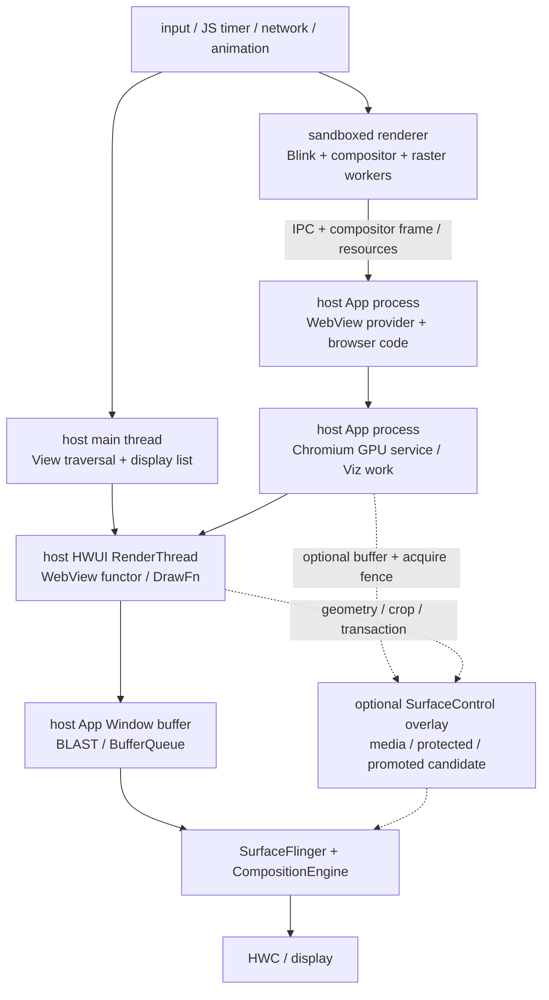
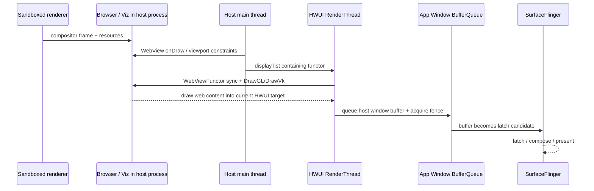

# 18.13 Android 17 WebView 渲染管线

## 这条管线为什么容易看错

WebView 同时跨过 Chromium 与 Android 两套渲染系统。网页侧负责 JavaScript、样式、布局、绘制列表、栅格化和 compositor frame；宿主侧仍要完成 View 遍历、HWUI 绘制、窗口 buffer 提交以及 SurfaceFlinger 合成。只盯着 App 主线程，会漏掉 renderer 和 GPU service；只看到 Chromium compositor，也不能推导出网页拥有独立的 SurfaceFlinger layer。

这里固定三组锚点，其中 Android 平台和 WebView provider 是两条彼此独立的版本线：

- Android 平台固定在 Android 17 / API 37 / `android-17.0.0_r1`，用来解释 framework、HWUI、SurfaceControl 和显示系统的接口；
- kernel 固定在 `android17-6.18-2026-06_r6`，用来解释 dma-buf、dma-fence / sync_file、调度与内存回收；
- WebView provider 是第二条独立版本线。现场必须记录包名、`versionName` 和 `versionCode`，再定位对应 Chromium revision。

同为 Android 17，两台设备可能安装不同 milestone 的 provider，也可能受 feature flag、GPU blocklist 和 OEM 配置影响。平台 tag 只能回答“Android 提供了什么接口”，不能替代设备上的 provider 源码。

## 先分清三个边界

WebView 现场常被混在一起的内容有三类。

| 边界 | 谁负责 | 常见形态 | 不能直接推出什么 |
| --- | --- | --- | --- |
| 官方 Android System WebView provider 内部 | framework WebView、可更新 provider、Chromium renderer / GPU service、HWUI | 普通页面经 functor / DrawFn 合入宿主窗口；合格的内容候选可走 SurfaceControl overlay | 看到 WebView 就等于存在独立 SF layer |
| 宿主全屏托管 | `WebChromeClient.onShowCustomView()` 与宿主全屏容器 | 页面进入 fullscreen mode 后，WebView 把一个 `View` 交给宿主 | 回调给出的 `View` 必然是 `SurfaceView` 或 `TextureView` |
| 第三方 SDK 扩展 | X5、UC、定制 Chromium 或厂商包装层 | 可能使用 Texture-like、独立 Surface、ImageReader 或私有桥接 | 可以直接套用 Android System WebView 的内部类名与 trace slice |

“SurfaceControl 子 Surface”在这里指官方 provider 对 overlay 候选的提升能力。普通网页主体通常仍由 functor 画进宿主 App Window；视频、受保护内容或满足条件的 provider overlay 才可能增加独立 layer。分析时必须保留这一限定。

## 进程模型：三个执行域

现代系统 WebView 可以按三个执行域理解。

1. **宿主 App 进程**：framework `WebView`、provider glue、browser code、UI 协调，以及标准 WebView 架构中的进程内 GPU / network 等服务。
2. **sandboxed renderer 进程**：Blink 执行 JavaScript、style、layout、paint 和 compositor 工作。一个 renderer 是否被多个 WebView 复用，由 provider 的进程策略决定。
3. **Android 显示系统**：宿主 `ViewRootImpl`、HWUI RenderThread、BLAST / BufferQueue、SurfaceFlinger、CompositionEngine 和 HWC。

下面的图用于定位 browser code、GPU services 和 renderer，而不是表示所有箭头都对应一次同步调用。



图中实线是普通页面的主体路径，虚线是可选 overlay。renderer 已经生成 compositor frame，只表示网页侧的结果可供消费；用户看到这一帧，还要等宿主绘制、窗口提交、SF latch 和 display present。

主线程空闲不等于 WebView 空闲。renderer 可能被 JavaScript 或布局占满，raster worker 可能在解码图片，GPU service 可能在等资源或 fence，宿主 RenderThread 也可能没有及时消费新 frame。

## 平台版本与 provider 版本要一起记录

Android 5 起，WebView provider 可以独立于系统镜像更新。Android 7 起，设备还可以在多个合格 provider 中选择。应用内可以通过 AndroidX WebKit 记录当前实现；设备侧再用 `dumpsys webviewupdate` 交叉核对。

这段代码的用途是把 provider 身份写入复现日志。

```kotlin
val provider = WebViewCompat.getCurrentWebViewPackage(applicationContext)
val versionCode = provider?.let { PackageInfoCompat.getLongVersionCode(it) }
Log.i(
    "WebViewProvider",
    "package=${provider?.packageName}, " +
        "version=${provider?.versionName}, code=$versionCode"
)
```

`PackageInfoCompat` 来自 `androidx.core.content.pm`，用于兼容 API 28 以前的 `versionCode` 读取。provider 返回值可能为 `null`，例如设备不支持 WebView、缺少可更新实现或配置异常。做冷启动实验时，还要留意版本查询或其他 `android.webkit` / `androidx.webkit` 调用是否提前触发了 WebView 初始化；基准组应保留一份没有额外探针的 trace。

### Android 17 中 provider 怎样装入宿主进程

Android 17 的调用边界可以概括为：

1. `WebView` 的 provider 代理在首次需要实现时进入 `WebViewFactory.getProvider()`；同一进程会缓存同一个 `WebViewFactoryProvider`。
2. `WebViewFactory` 通过 `WebViewUpdateService.waitForAndGetProvider()` 取得系统选中的包，并校验包名、版本、签名、安装与启用状态。
3. framework 为该包创建包含代码的 context，取得 provider class loader，加载包声明的 native WebView library，再反射创建 provider factory。
4. provider 后续初始化 Chromium browser context、renderer 和图形资源。具体时序属于设备 provider revision，不能由 `WebViewFactory.java` 一份平台源码完整推导。

这条链路解释了为什么 WebView 首次创建可能很重：它可能同时包含包选择、RELRO / native library、Java 类加载、Chromium 初始化、renderer 建立、网络和页面首帧。稳态滚动 trace 不能回答冷启动问题。

AndroidX WebKit 当前提供 `WebViewCompat.startUpWebView()`，可以把允许在后台执行的启动工作提前到可控时机，其余工作仍可能分段回到主线程。调用后若马上访问别的 WebView API，UI 线程仍可能等待初始化完成；预热还会增加进程与内存驻留，应按真实启动路径评估。使用这一 API 时，应以项目所用 AndroidX WebKit 版本的官方说明为准。

## 官方 provider 的标准硬件路径：functor / DrawFn

硬件加速的标准 WebView 仍是宿主 View 树的一员。它参与 measure、layout、clip、alpha、matrix、invalidate 和窗口生命周期，但网页像素不是由宿主逐条执行 `Canvas.drawText()` 或 `drawBitmap()` 得到。provider 会在宿主 display list 中留下 WebView functor，HWUI RenderThread 执行这项绘制时再接入 Chromium 的合成结果。

### 一次硬件绘制怎样发生

Android 17 与当前 Chromium 上游源码给出的主线如下：

1. renderer 完成网页更新，提交 compositor frame 和可转移资源到 browser / Viz 一侧；
2. 宿主 UI thread 遍历到 WebView，provider 的 `AwContents::OnDraw()` 在 Canvas 硬件加速、WebView 已附着且没有强制辅助 bitmap 等条件满足时进入 `BrowserViewRenderer::OnDrawHardware()`；
3. `BrowserViewRenderer` 更新 viewport、clip、transform 等约束，通过 synchronous compositor 请求或选择可用 child frame，并让宿主 display list 记录 functor；
4. HWUI RenderThread 执行 `WebViewFunctor::sync` 与 `drawGl`，或者 `initVk`、`drawVk`、`postDrawVk`；
5. Chromium 的 `AwDrawFnImpl::DrawGL()` / `DrawVk()` 把工作交给 `RenderThreadManager`，`HardwareRenderer` / Viz 消费 child frame，把网页主体画入当前 HWUI 绘制目标；
6. HWUI 与其他宿主 View 一起完成 App Window buffer，随后经 BLAST / BufferQueue 交给 SurfaceFlinger。

下面的时序图强调“Chromium 内部完成合成”和“Android 窗口完成提交”是两个不同边界。



`HardwareRenderer::OnViz::DrawAndSwapOnViz()` 名字里的 “Swap” 是 Chromium 内部显示合成器的语义，不能当成 App Window 已向 SurfaceFlinger `queueBuffer` 的证据。普通主体的 Android 窗口提交仍由宿主 HWUI 链路完成。

### GL 与 Vulkan 的准确口径

Android 17 的 `WebViewFunctor.h` 同时定义 GLES 与 Vulkan 回调。`WebViewFunctor_queryPlatformRenderMode()` 查询宿主 HWUI pipeline；HWUI 按当前 pipeline 校验并调用对应回调。现场可以用以下 slice 区分分支：

- 平台侧：`WebViewFunctor::sync`、`WebViewFunctor::drawGl`、`WebViewFunctor::initVk`、`WebViewFunctor::drawVk`、`WebViewFunctor::postDrawVk`；
- Chromium 侧：`DrawFn_DrawGL`、`DrawFn_InitVk`、`DrawFn_DrawVk`、`DrawFn_PostDrawVk`、`DrawFn_RemoveOverlays`。

不要把这段关系改写成“HWUI 与 Chromium 只有一个 GPU context”。GL 与 Vulkan 的 context、resource import 和同步实现由 provider revision 与后端决定；能确认的是 provider 必须通过平台声明的 functor 模式与当前 HWUI pipeline 协作。

### 这条路径的性能含义

普通网页主体合入 host buffer 后，SurfaceFlinger 通常只看到宿主 App Window layer。DOM layer、CSS transform、canvas 和普通图片已经在 Chromium / HWUI 前半段合成，不会一一变成 SF layer，也无法由 HWC 单独分配 overlay plane。

WebView 的耗时会沿两种方式拖慢宿主帧：

- UI thread 没能及时完成 invalidate、traversal 或 display list 记录；
- RenderThread 执行 functor 时，frame、resource import、GPU service 或 GPU 工作没有按期完成。

因此“宿主主线程很轻”不能排除 WebView 卡顿，“SurfaceFlinger 只有一个 App layer”也不能证明网页侧没有多线程合成。

## 软件绘制 fallback

窗口未启用硬件加速、传入 Canvas 不是 hardware accelerated，或者 provider 当前不能接受硬件 draw 时，WebView 可以进入软件绘制。Chromium 的 `AwContents::OnDraw()` 会选择 `BrowserViewRenderer::OnDrawSoftware()`，后者通过 `CompositeSW()` / `DemandDrawSw()` 取得软件结果并画入宿主 Canvas。

这里要区分两种宿主形态：

- 整个窗口软件绘制时，`ViewRootImpl.drawSoftware()` 通过窗口 Surface 的 Canvas 路径提交 App Window buffer；
- 单个 WebView 使用 software layer 时，软件结果可以先成为 bitmap / layer，再由硬件加速的宿主窗口采样。

两种情况都不意味着网页拥有独立 SF layer。判断 fallback 时应同时看到硬件 DrawFn slice 消失、软件 draw 调用栈或 CPU raster 增长、Canvas acceleration 状态与 provider 日志。仅凭低端设备、白屏或某个 CSS 属性，证据不够。

## 官方 provider 的 SurfaceControl 子 Surface：overlay，不是整页搬家

Android 17 的 HWUI 与 Chromium 都包含 WebView overlay 接口，但它是候选提升机制。常见结果是网页 UI 仍由 functor 画进 host buffer，视频、受保护内容或满足条件的候选另走 SurfaceControl layer。

### 平台侧先决定“能不能提供 overlay 容器”

`WebViewFunctorManager.cpp` 只有在以下条件成立时，才把 `overlaysMode` 设为 Enabled：

- `Properties::enableWebViewOverlays` 已启用；
- 当前 draw 存在 active `CanvasContext`；
- 该 context 有 root `SurfaceControl`；
- 本次 WebView draw 不是绘制进 HWUI layer：GL 分支要求 `!drawInfo.isLayer`，Vulkan 分支要求 `!params.is_layer`。

provider 请求父节点时，HWUI 创建名为 `Webview Overlay SurfaceControl` 的 buffer-state layer，挂在 App Window 的 root SurfaceControl 下，并把它放在当前绘制目标下方作为 underlay。`prepareSurfaceControlForWebview()` 让窗口为这条路径做好准备；`mergeTransaction()` 尝试把 provider 的事务合入 active `CanvasContext`，没有可合并的 context 时才单独 apply。

这一步只提供 overlay 容器与事务接口，不代表任何网页内容已经被提升。

### Chromium 侧再决定“哪个候选能提升”

当前上游 `OverlayProcessorWebView` 还会检查：

- HWUI 是否在本次 draw 允许 overlay；
- 完整 GPU service 是否就绪；
- `OverlayProcessorSurfaceControl::CheckOverlaySupportImpl()` 是否接受候选；
- 对应 frame sink 是否被临时阻止；
- buffer、crop、transform、颜色空间、保护属性和 acquire fence 是否满足实现要求。

通过检查的候选才会获得 AHardwareBuffer 与 SurfaceControl 更新。候选失败时，该部分内容回到网页主体合成；不能把失败解释成 WebView 软件渲染。

### 一帧里可能同时存在两条提交

网页主体和 overlay 的 producer / consumer 关系如下：

| 内容 | Producer | 进入 Android 显示系统的方式 | Consumer |
| --- | --- | --- | --- |
| 普通网页主体 | renderer + Chromium compositor / GPU service | functor 画入 host App Window buffer | SurfaceFlinger 消费宿主窗口 layer |
| 提升的媒体或受保护候选 | decoder / GPU service / provider | AHardwareBuffer + acquire fence 更新到 SurfaceControl child layer | SurfaceFlinger / HWC 消费独立 layer |
| overlay 几何状态 | 宿主 HWUI draw + provider | crop、position、visibility 等 transaction | SurfaceFlinger transaction state |

buffer ready 与几何 transaction ready 是两个条件。媒体 buffer 晚到可能沿用旧内容；宿主滚动或变换事务晚到会造成位置不同步；HWC plane、裁剪、alpha、HDR / SDR 或保护要求变化，还可能让 layer 在 DEVICE 与 CLIENT composition 之间切换。

Android 10—11 的平台 tag 已有现代 WebView functor 接口，但还没有 `WebViewOverlayData` 中的 SurfaceControl / transaction 回调；[`android-12.0.0_r1` 的 `WebViewFunctor.h`](https://android.googlesource.com/platform/frameworks/base/+/android-12.0.0_r1/libs/hwui/private/hwui/WebViewFunctor.h) 已包含 `getSurfaceControl()` 与 `mergeTransaction()`，Android 17 又保留了这组接口并增加 rendering-thread reporting。某台设备是否命中，仍需按 Android tag、provider revision、运行时开关与页面候选共同判断。不要只看 API level 得出“整页独立出图”的结论。

## ImageReader：中间 buffer 不等于最终 layer

标准 Chromium 也可能出现 ImageReader，不能把它自动归到第三方 SDK。固定 revision 的 `ImageReaderGLOwner` 通过 `AImageReader_newWithUsage()` 创建 private-format reader，按 TextureOwner mode 请求 GPU sampling、protected content 或 composer overlay usage；新 image 到达后，它异步 acquire image 与 fence，并可取出 `AHardwareBuffer` 供后续纹理采样或 overlay 使用。

这条证据只能说明中间 image 的 producer/consumer 关系，不能单独确定最终显示对象。ImageReader image 可能被 Chromium/HWUI 再采样进宿主 App Window，也可能服务 SurfaceControl overlay。排障时应同时核对 `ImageReaderGLOwner` mode、usage、acquire fence、buffer owner、后续 DrawFn 和 SurfaceFlinger layer；若 acquire 迟到或 reader 的可用 image 数不足，还要检查 producer backpressure 与旧帧复用。

## 宿主全屏托管：`onShowCustomView()`

网页进入 fullscreen mode 时，WebView 可以调用 `WebChromeClient.onShowCustomView(View, CustomViewCallback)`。Android 17 的 API 注释写得很明确：回调之后，相关 web content 不再画在原 WebView 中，而是画进参数 `view`；宿主应把该 View 放入合适的全屏 Window，并在退出时移除它。单纯把 WebView 布局设为 `match_parent` 不会触发这条分支。

下面的最小实现用于记录交接 View 的运行时类型，并正确维护退出回调。

```kotlin
class FullscreenChromeClient(
    private val container: ViewGroup
) : WebChromeClient() {
    private var fullscreenView: View? = null
    private var exitCallback: WebChromeClient.CustomViewCallback? = null

    override fun onShowCustomView(
        view: View,
        callback: WebChromeClient.CustomViewCallback
    ) {
        if (fullscreenView != null) {
            callback.onCustomViewHidden()
            return
        }

        Log.i("WebViewFullscreen", "view=${view.javaClass.name}")
        fullscreenView = view
        exitCallback = callback
        container.addView(
            view,
            ViewGroup.LayoutParams(
                ViewGroup.LayoutParams.MATCH_PARENT,
                ViewGroup.LayoutParams.MATCH_PARENT
            )
        )
    }

    override fun onHideCustomView() {
        fullscreenView?.let(container::removeView)
        fullscreenView = null
        exitCallback = null
    }

    fun requestExit() {
        exitCallback?.onCustomViewHidden()
    }
}
```

宿主主动退出时调用 `requestExit()` 通知页面；provider 随后通过 `onHideCustomView()` 要求宿主移除 View。工程代码还要处理 Activity 销毁、重复回调、系统栏和方向策略。

`onShowCustomView()` 只定义托管协议，不定义内部渲染类型。参数可能是 `SurfaceView`、`TextureView`、其他 View 或包含多层 child 的容器。记录 `view.javaClass.name` 后还要查看子树、layer owner、BufferQueue 和调用栈：

- 若内部是 `SurfaceView`，常见 producer 是 MediaCodec / MediaPlayer，buffer 直接交给独立 Surface layer；
- 若内部是 `TextureView`，producer 写入 `SurfaceTexture`，宿主 RenderThread 通过纹理采样把结果合入 App Window；
- 若只是容器，继续向下找实际持有 Surface、SurfaceTexture 或播放器的 child。

全屏 custom view 与 provider 内部 overlay 可以出现在同一问题中，但它们属于不同边界。判断 owner 时以回调、View 树和 layer parent 为准。

## 第三方 SDK 的 Texture-like 扩展

X5、UC 或定制 Chromium 可以在包装层中采用 `TextureView` / `SurfaceTexture`、独立 Surface、ImageReader、HardwareBuffer 或私有桥接。不同版本、不同设备渠道甚至不同 feature flag 都可能改变实现，不能把“第三方 WebView”固定写成一种管线。

只有在 trace 或调用栈中确认以下证据后，才把现场归为 Texture-like：

- SDK 自己创建并持有 `SurfaceTexture` 或等价 producer endpoint；
- producer 的 frame-available 回调到达；
- 宿主 RenderThread 执行 `updateTexImage()` 或等价的纹理获取；
- SurfaceFlinger layer tree 仍以宿主 App Window 为主体，没有与该内容对应的独立 Surface layer。

确认 TextureView-like 之后，Android 17 的宿主消费段还要继续追 `SurfaceTexture.OnFrameAvailableListener`、`TextureView.updateLayer()` / `invalidate()`、RenderThread 的 `DeferredLayerUpdater::apply()` 与 `ASurfaceTexture_dequeueBuffer()`。provider 或第三方 GPU 线程完成 `swapBuffers` 只说明 producer 已提交；宿主是否及时申请 vsync、获取新 image 并画入 App Window，要看这条 consumer 链。完整的平台实现见 [18.7 TextureView 宿主合成链路](07-textureview.md)。

这条路径的 producer 是第三方内核或其 GPU 线程，consumer 是宿主 HWUI。它会增加一次纹理采样以及相应同步，但开销大小必须用该 SDK 版本、页面负载和设备 trace 测量，不能预设为更快或更慢。

## 从网页更新到显示的一帧

一帧可以拆成六个诊断阶段。

1. **网页状态更新**：JavaScript、DOM、style、layout、paint invalidation、图片解码或滚动改变内容。
2. **renderer 合成准备**：renderer compositor 生成 frame，raster worker 准备 tile，跨进程提交 frame / resource 信息。
3. **宿主 invalidate 与 traversal**：WebView 请求 redraw，主线程在 `Choreographer#doFrame()` 中遍历并记录 functor。
4. **RenderThread DrawFn**：HWUI 同步 View 状态，调用 functor，Chromium 消费 frame、导入资源并把主体画入 host target。
5. **窗口与可选 overlay 提交**：HWUI 提交 App Window buffer；provider 还可能提交媒体 buffer 和 SurfaceControl transaction。
6. **系统显示**：SF latch layer，CompositionEngine / HWC 选择 CLIENT 或 DEVICE composition，display present feedback 标记显示端边界。

这些阶段会重叠。renderer 可以提前准备 frame，宿主也可以在没有新网页 frame 时重画其他 View；GPU 命令提交与完成又是异步关系。关联时要用 frame token、buffer frame number、flow event、transaction id 和 fence，不要把时间上相邻的 slice 自动视为同一帧。

## renderer 生命周期、启动与内存压力

### renderer 消失后不能复用原 WebView

renderer 可能 crash，也可能在内存压力下被系统回收。`WebViewClient.onRenderProcessGone()` 会对受影响的每个 WebView 分别回调；多个 WebView 可能共享同一个 renderer。应用若返回 `true` 选择继续运行，必须把回调中的 WebView 从 hierarchy 移除、清理引用并 `destroy()`，需要继续展示时创建新实例。原实例不能复用。

`WebView.setRendererPriorityPolicy()` 可以调整 renderer 的进程重要性。降低不可见 WebView 的优先级会增加被回收概率，应用需要先具备可靠的 process-gone 恢复路径。后台返回后白屏或重载，应该先查 renderer death / OOM，再查绘制管线。

### 冷启动和稳态卡顿要分开

首次初始化可能包含 provider 装载、native library、Chromium startup、renderer 创建、网络连接和首帧 raster。稳态滚动则更关注 JavaScript 长任务、layout、raster、resource import、DrawFn、GPU queue 与 host window deadline。两类样本混在一个平均值里，优化方向容易失焦。

### Android 17 / kernel 6.18 下的内存证据

大页面会同时占用 DOM / JS heap、解码图片、Skia 资源、tile cache、GPU texture、AHardwareBuffer / dma-buf 和宿主图形内存。内存压力可能触发 GC、tile 淘汰、重新解码、renderer 回收、page fault、direct reclaim、`kswapd`、zram I/O 或 dma-buf 分配等待。

kernel 锚点 `android17-6.18-2026-06_r6` 下，跨进程图形 buffer 仍以 dma-buf 共享，显式同步通过 dma-fence / sync_file 传递。CPU slice 变长时，要结合线程状态区分 Running、Runnable 和 blocked；若线程在等 fence，CPU wall time 不能当成计算量。

## 如何判断当前 WebView 走哪条路径

可靠结论需要 provider 身份、回调 / View 证据、Perfetto 和 SurfaceFlinger layer tree 相互印证。

### 1. 固定版本与复现场景

这组命令只收集平台、provider、进程和 layer 证据，不自动判定渲染类型。

```bash
adb shell getprop ro.build.fingerprint
adb shell getprop ro.build.version.sdk
adb shell dumpsys webviewupdate
adb shell ps -A -T | grep -E 'webview|sandboxed_process|<宿主包名>'
adb shell dumpsys SurfaceFlinger --list
```

把完整输出与 Perfetto 时间戳放进同一问题单。`grep` 仅用于快速找入口，正式判断要回看完整进程关系和 layer parent，避免同名线程或 layer 误导。

还应记录：

- URL 或本地复现页、登录状态和页面操作；
- hardware acceleration、刷新率、GPU、窗口模式；
- 是否有 video、WebGL、canvas、复杂 filter、protected content；
- 是否触发 `onShowCustomView()`；
- 第三方 SDK 名称、版本与 feature 配置。

### 2. 先看 fullscreen 交接和 View owner

收到 `onShowCustomView()` 就进入宿主全屏分支。记录参数 View 的完整类名与 child tree，再查它创建的 Surface / SurfaceTexture。没有回调时，不要因为画面占满屏幕就标记为 fullscreen custom view。

### 3. 在 Perfetto 中连接五段证据

| 观察点 | 说明 | 下一步 |
| --- | --- | --- |
| renderer main 长时间 Running | JavaScript、style、layout、paint 可能超预算 | 用 DevTools CPU profile / Performance panel 补函数与 DOM 证据 |
| raster worker、image decode 或 GPU service 晚 | tile、解码、资源准备或 GPU queue 可能迟到 | 查 worker queue、Skia / decode、GPU fence 与内存压力 |
| host UI thread 很晚才 traversal | invalidate、主线程调度或其他 View 工作阻塞 | 对齐 `Choreographer#doFrame`、ViewRoot 与 Runnable latency |
| `WebViewFunctor::drawGl/drawVk` 或 `DrawFn_DrawGL/DrawVk` 变长 | functor sync、resource import、Chromium draw 或 GPU 工作影响 host frame | 结合线程状态、flow、GPU queue 与 fence |
| host window `queueBuffer` 正常，SF 很晚才 latch / present | 问题已进入窗口或显示系统 | 查 FrameTimeline、BufferTX、acquire fence、SF/HWC |
| 网页 UI 正常，视频卡顿或位置漂移 | media producer、overlay buffer 或几何 transaction 更可疑 | 单独追视频 child layer、codec fence 与 transaction |

线程名和 slice 名会随 provider 更新变化。它们用于定位，不是跨版本不变的 API；复盘必须保留 provider revision。

### 4. 用 layer tree 验证内容落点

- 只有 host App Window，且 trace 出现 WebView DrawFn，主体更接近标准 functor 路径；
- 出现 `Webview Overlay SurfaceControl` 或其 child，还要检查是否有 buffer、owner、parent 与同步更新，不能据此宣布整页独立出图；
- 出现 video / protected layer，分别追 decoder producer 与宿主几何 transaction；
- fullscreen 场景同时核对 custom view 容器和播放器 layer；
- 出现 `SurfaceTexture` / `updateTexImage`，先查 owner。标准 provider、第三方 SDK 或宿主包装层都可能留下不同证据。

### 5. 把结论写成可复查记录

一条足够复查的结论应包含：

- Android build / API level；
- provider 包名、`versionName`、`versionCode` 或第三方 SDK revision；
- 页面场景与复现时间；
- hardware acceleration 与 GPU backend；
- fullscreen callback 与运行时 View 类型；
- Perfetto artifact、关键进程 / tid、slice、flow 或 frame token；
- SurfaceFlinger layer 名称、parent、buffer 与 composition type；
- 已排除的路径和尚未确认的假设。

没有 artifact、版本和页面负载时，不要写固定帧耗、百分比或“某路径必然更快”。

## 常见现场对比表

| 现场 | 所属边界 | Producer | Consumer / 最终落点 | 宿主 RenderThread | 关键证据 |
| --- | --- | --- | --- | --- | --- |
| 标准 GL / Vulkan functor | 官方 provider 主体路径 | renderer + Chromium compositor / GPU service | HWUI host target → App Window → SF | 执行 DrawFn，参与主体合成 | provider revision + DrawFn slice + 只有 host layer |
| SurfaceControl overlay 候选 | 官方 provider 可选路径 | decoder、GPU service 或 provider | child SurfaceControl → SF / HWC | 主体仍走 DrawFn，并协调 overlay transaction | overlay-enabled draw + child layer / buffer + transaction |
| 软件 fallback | 官方 provider fallback | Chromium software compositor / CPU raster | host Canvas 或 software layer → App Window | 不执行硬件 DrawFn，是否参与取决于宿主形态 | software draw stack + Canvas 状态 + DrawFn 缺失 |
| fullscreen custom view | 宿主全屏托管 | 由回调 View 的内部实现决定 | SurfaceView、TextureView 或其他容器对应的路径 | 由实际 View 类型决定 | `onShowCustomView()` + View tree + layer owner |
| 第三方 Texture-like | 第三方 SDK 扩展 | SDK renderer / GPU 线程 | SurfaceTexture → HWUI host target | 消费纹理并合入宿主窗口 | SDK revision + frame-available + `updateTexImage` |

## 常见误判

| 误判 | 修正方法 |
| --- | --- |
| Android 17 唯一确定 WebView 源码 | 同时记录 provider 包版本并匹配 Chromium revision |
| Chromium 有 compositor，所以网页一定是独立 SF layer | 看 host DrawFn 与 SurfaceFlinger layer tree；普通主体通常合入 App Window |
| `Webview Overlay SurfaceControl` 代表整页 WebView | 检查其 child、buffer owner 与 candidate；它是 overlay 容器 |
| DOM layer 对应 SF layer | DOM / cc layer 通常已在 Chromium 与 HWUI 前半段合成 |
| `DrawAndSwapOnViz` 代表 Android 窗口已 swap | 继续追宿主 HWUI `queueBuffer`、SF latch 与 display present |
| 页面铺满屏幕就是 `onShowCustomView()` | 以回调是否发生为准 |
| 全屏回调 View 必然是 SurfaceView | 记录类名、child tree 和 Surface owner |
| renderer frame ready 表示用户已看到 | 继续追 DrawFn、host buffer、SF 和 display |
| 主线程空闲说明 WebView 没问题 | 同看 renderer、raster、GPU service 与 RenderThread |
| renderer 被回收后可复用原实例 | 移除并 destroy 旧 WebView，再创建新实例 |
| 看到 `updateTexImage()` 就是系统 WebView 主路径 | 先查 SurfaceTexture owner 与第三方 SDK / 宿主包装层 |

## Android 12—17 的版本边界

WebView 版本演进要同时保留平台线和 provider 线。下面只说明排障时应保留的 Android 平台边界；Chromium milestone 与 feature flag 仍按设备 provider 核对。

- **Android 12 / API 31**：BLAST 与 FrameTimeline 成为显示诊断的重要基线。现代 WebView 的主体仍通常经 functor 合入 host window；平台具备 SurfaceControl 集成不代表页面整体自动获得独立 layer。
- **Android 13 / API 33**：WebView 的公开 darkening 控制等能力会影响页面 raster 结果，但不改变 framework / provider / renderer / HWUI 的基本分层。
- **Android 14 / API 34**：标准分层保持稳定。差异常来自 provider milestone、GPU blocklist、Skia / Chromium flag 和 OEM provider。
- **Android 15 / API 35**：16 KB page size 设备要求宿主和 provider native libraries 兼容对应 ELF / APK 对齐。加载或运行失败应先查二进制兼容，不能归因于 functor 帧耗。
- **Android 16 / API 36**：平台图形与安全策略继续演进，定制内核、注入层和非标准 GPU 调试接口需要按设备策略验证；标准 WebView 的可更新 provider 属性不变。
- **Android 17 / API 37**：`android-17.0.0_r1` 的 `WebViewFunctor` 明确定义 GLES / Vulkan draw callback、overlay transaction 与 rendering-thread reporting。平台说明如何承接 provider，不固定设备上的 Chromium milestone。

kernel 统一到 `android17-6.18-2026-06_r6` 后，host window 与媒体 overlay 仍以 dma-buf 共享 buffer、以 dma-fence / sync_file 传递同步状态。GPU、codec 与显示驱动的私有调度要用设备 tracepoint 和 vendor 源码补齐。

## 源码阅读入口

### Android 17 平台

- [`WebView.java`](https://android.googlesource.com/platform/frameworks/base/+/android-17.0.0_r1/core/java/android/webkit/WebView.java)、[`WebViewFactory.java`](https://android.googlesource.com/platform/frameworks/base/+/android-17.0.0_r1/core/java/android/webkit/WebViewFactory.java)：framework 代理、provider 选择与装载；
- [`WebViewUpdateServiceImpl2.java`](https://android.googlesource.com/platform/frameworks/base/+/android-17.0.0_r1/services/core/java/com/android/server/webkit/WebViewUpdateServiceImpl2.java)：系统怎样选择、准备与切换 provider；
- [`WebChromeClient.java`](https://android.googlesource.com/platform/frameworks/base/+/android-17.0.0_r1/core/java/android/webkit/WebChromeClient.java)、[`WebViewClient.java`](https://android.googlesource.com/platform/frameworks/base/+/android-17.0.0_r1/core/java/android/webkit/WebViewClient.java)：全屏托管与 renderer 消失后的宿主责任；
- [`WebViewFunctor.h`](https://android.googlesource.com/platform/frameworks/base/+/android-17.0.0_r1/libs/hwui/private/hwui/WebViewFunctor.h)、[`WebViewFunctorManager.cpp`](https://android.googlesource.com/platform/frameworks/base/+/android-17.0.0_r1/libs/hwui/WebViewFunctorManager.cpp)：GL / Vulkan functor、overlay gate、SurfaceControl 与 transaction；
- [`TextureView.java`](https://android.googlesource.com/platform/frameworks/base/+/android-17.0.0_r1/core/java/android/view/TextureView.java)、[`DeferredLayerUpdater.cpp`](https://android.googlesource.com/platform/frameworks/base/+/android-17.0.0_r1/libs/hwui/DeferredLayerUpdater.cpp)：TextureView-like 分支的 frame available、invalidation 与 image acquire；
- [`SurfaceFlinger.cpp`](https://android.googlesource.com/platform/frameworks/native/+/android-17.0.0_r1/services/surfaceflinger/SurfaceFlinger.cpp)、[`FrameTimeline.cpp`](https://android.googlesource.com/platform/frameworks/native/+/android-17.0.0_r1/services/surfaceflinger/Scheduler/FrameTimeline.cpp)、[`HWComposer.cpp`](https://android.googlesource.com/platform/frameworks/native/+/android-17.0.0_r1/services/surfaceflinger/DisplayHardware/HWComposer.cpp)：host / overlay layer 的 latch、composition 与 present。

### WebView provider

Chromium 是可更新组件。这里以上游 revision `4e18c703f7cd950c890e14105da8eff42192af6a` 解释当前实现；处理设备问题时应切到该 provider 对应的 revision。

- [`draw_fn.h`](https://chromium.googlesource.com/chromium/src/+/4e18c703f7cd950c890e14105da8eff42192af6a/android_webview/public/browser/draw_fn.h)、[`aw_draw_fn_impl.cc`](https://chromium.googlesource.com/chromium/src/+/4e18c703f7cd950c890e14105da8eff42192af6a/android_webview/browser/gfx/aw_draw_fn_impl.cc)：HWUI DrawFn 与 provider callback；
- [`aw_contents.cc`](https://chromium.googlesource.com/chromium/src/+/4e18c703f7cd950c890e14105da8eff42192af6a/android_webview/browser/aw_contents.cc)、[`browser_view_renderer.cc`](https://chromium.googlesource.com/chromium/src/+/4e18c703f7cd950c890e14105da8eff42192af6a/android_webview/browser/gfx/browser_view_renderer.cc)：硬件 / 软件 draw 分流与 synchronous compositor；
- [`hardware_renderer.cc`](https://chromium.googlesource.com/chromium/src/+/4e18c703f7cd950c890e14105da8eff42192af6a/android_webview/browser/gfx/hardware_renderer.cc)：child frame 与 Viz 合成；
- [`overlay_processor_webview.cc`](https://chromium.googlesource.com/chromium/src/+/4e18c703f7cd950c890e14105da8eff42192af6a/android_webview/browser/gfx/overlay_processor_webview.cc)：WebView overlay candidate 与 SurfaceControl 更新。
- [`image_reader_gl_owner.cc`](https://chromium.googlesource.com/chromium/src/+/4e18c703f7cd950c890e14105da8eff42192af6a/gpu/command_buffer/service/image_reader_gl_owner.cc)：ImageReader TextureOwner、AHardwareBuffer、acquire/release fence 与 backpressure。

公开 API 与生命周期要求可交叉核对 [WebView 开发指南](https://developer.android.com/develop/ui/views/layout/webapps/webview)、[WebView 对象管理](https://developer.android.com/develop/ui/views/layout/webapps/managing-webview) 和 [WebView 启动优化](https://developer.android.com/develop/ui/views/layout/webapps/optimize-webview-startup)。

### Kernel 6.18

- [`dma-buf.c`](https://android.googlesource.com/kernel/common/+/refs/tags/android17-6.18-2026-06_r6/drivers/dma-buf/dma-buf.c)：dma-buf 对象、fd 与 attachment 基础；
- [`dma-fence.c`](https://android.googlesource.com/kernel/common/+/refs/tags/android17-6.18-2026-06_r6/drivers/dma-buf/dma-fence.c)：fence signal、callback 与 wait；
- [`sync_file.c`](https://android.googlesource.com/kernel/common/+/refs/tags/android17-6.18-2026-06_r6/drivers/dma-buf/sync_file.c)：以 fd 携带 fence 的 sync_file；
- [Linux 6.18 dma-buf 文档](https://docs.kernel.org/6.18/driver-api/dma-buf.html)：import / export、attachment、CPU access 与同步约束。

## 与其他章节的关系

- **§22.7 WebView 性能优化实战**：从页面、宿主和业务指标处理 WebView 性能；
- **§18.6 SurfaceView、§18.7 TextureView**：全屏 custom view 或第三方 SDK 返回具体 View 类型后，回到对应管线；
- **§18.10 SurfaceControl API 深入**：overlay transaction、layer tree 和 fence；
- **§2.5 MainThread 与 RenderThread 协作**：宿主 View traversal 与 HWUI 提交；
- **§2.6 SurfaceFlinger 合成流程**：host layer 与可选 overlay 的系统显示后半段。

## 小结

标准硬件 WebView 的主体路径是：sandboxed renderer 准备网页内容，宿主进程里的 provider / GPU service 接收 compositor frame，主线程记录 functor，HWUI RenderThread 通过 GL 或 Vulkan DrawFn 把主体合入 App Window，窗口 buffer 再交给 SurfaceFlinger。

SurfaceControl 能力用于被提升的 overlay 候选，常见于媒体或受保护内容；它不能证明整页 WebView 独立出图。`onShowCustomView()` 是宿主全屏托管协议，第三方 Texture-like 则属于 SDK 扩展。三者的 owner、producer 和 consumer 不同。

排障时同时固定 Android build 与 provider revision，再依次核对 renderer、host DrawFn、host window、可选 child layer 和 display present。这样才能区分网页计算晚、资源准备晚、宿主消费晚、overlay 同步晚与系统显示晚。
