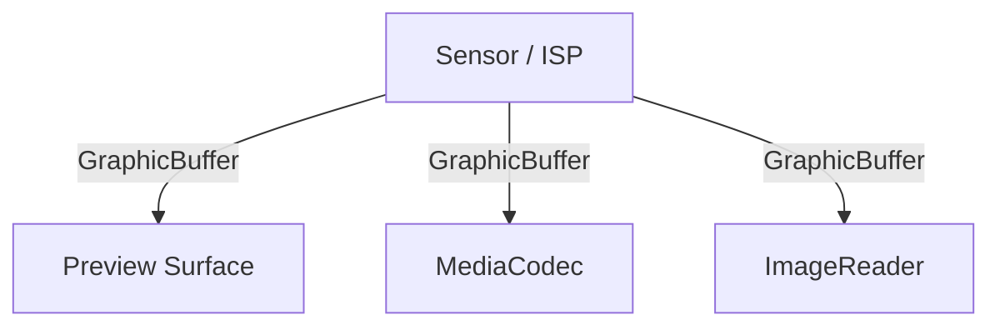
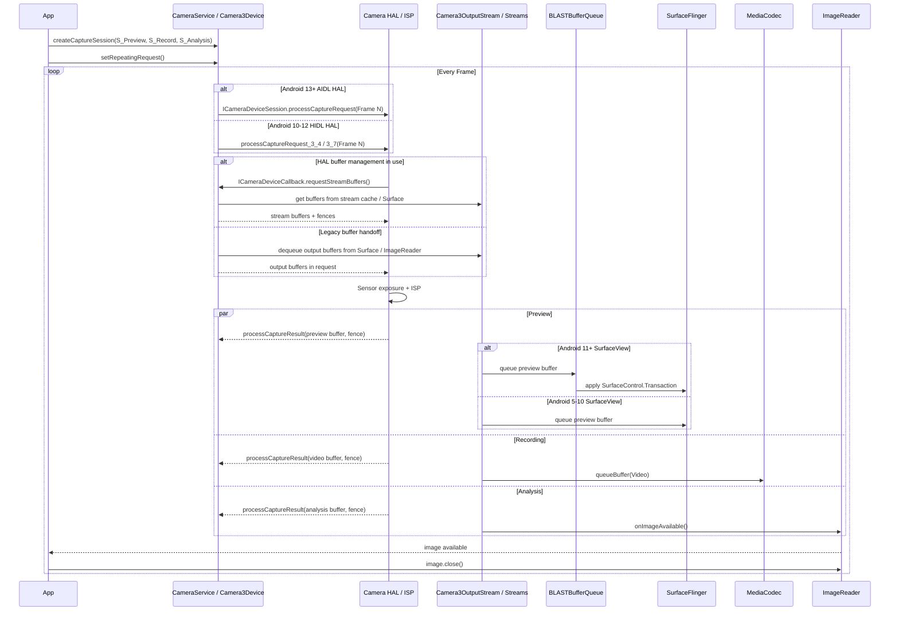

<!-- outline-start -->

**锚点（必须覆盖）：**
- Camera 的多消费者（Multi-Stream）架构
- HAL3 的 Request-Buffer 生命周期
- 三种消费路径：Preview / Recording / Analysis
- ZSL（Zero Shutter Lag）机制
- 常见掉帧场景与诊断

**扩展（可选深入）：**
- CameraCaptureSession 回调的时间戳分析
- DRM / Secure Camera Path
- SurfaceView vs TextureView 预览的性能差异

<!-- outline-end -->

## Camera 渲染管线的独特性

Camera 管线是 Android 里数据吞吐最高、对实时性要求最严的一类。普通 View 渲染是一次输入对应一次输出，Camera 则经常把同一帧同时送给预览、录像和分析三个消费者。Sensor、ISP、Camera HAL、BufferQueue、SurfaceFlinger、MediaCodec、ImageReader，整个链条上的任何一个节点都可能成为瓶颈。

排查 Camera 卡顿时，第一步是把问题归到生产端、Buffer 流转阶段还是消费端。HAL 生产慢、ImageReader 不及时归还 Buffer、Binder IPC 堵塞——这三类在 Perfetto 里的表现形态不同，修复方向也不同。

## 多消费者架构



CameraService 负责资源仲裁和会话管理。App 调用 `CameraManager.openCamera()` 后，请求先到 CameraService，由它检查 camera id、客户端优先级、当前占用状态，再把请求交给 `Camera3Device`。Android 15+ 的主线实现里，这一步对应 `hardware/interfaces/camera/device/aidl/android/hardware/camera/device/ICameraDevice.aidl` 定义的设备接口，`open()` 之后再进入活跃的 `ICameraDeviceSession`；Android 13-14 仍兼容 HIDL 3.x 接口。会话建立阶段，CameraService 还要把各个输出 Surface 的尺寸、像素格式、usage flag 汇总给 HAL，决定这组输出能不能同时成立。

HAL3 / ISP 负责把 Sensor 原始数据变成可以消费的帧。ISP 完成曝光、去噪、白平衡、色彩校正后，HAL 按 `CaptureRequest` 的目标 Surface 把结果写入对应 Buffer。预览、录像、分析可以共享同一次曝光得到的图像，但它们拿到的是不同用途的输出 Buffer，而不是一块 Buffer 在多个线程里反复回拷。

`CaptureRequest` 是 Camera2 的调度单元。一次 request 同时描述这一帧的控制参数和输出目标，例如曝光时间、对焦模式、输出到哪几个 Surface。Camera HAL 处理完之后，再通过 `CaptureResult` 和 `CaptureCallback` 把帧号、时间戳和元数据交回上层。看懂 request/result 这对对象，才能把 App 提交节奏、HAL 生产节奏、消费者回收节奏串到一起。

## 完整渲染管线

### 阶段一：配置流（Configure）

App 先声明这一轮会话需要哪些输出 Surface：

```java
cameraDevice.createCaptureSession(
    Arrays.asList(previewSurface, videoSurface, analysisSurface),
    callback,
    handler
);
```

这一调用对应的是一次流配置。Framework 会把 Preview、Recording、Analysis 三路 Surface 的尺寸、格式、usage flag 交给 `Camera3Device::configureStreamsLocked()`，HAL 决定是否支持这组组合。配置失败时，后续 request 再正确也不会稳定出帧。

Android 12+ 的 Extensions 是这一步的一个变体。App 通过 `CameraDevice.createExtensionSession()` 或 CameraX Extensions 建立 `CameraExtensionSession` 时，session 配置仍然要校验输出 Surface 组合，但 OEM extension 库会在 Preview 或 Still Capture 路径里插入额外的多帧后处理节点。夜景、HDR、虚化模式下，排查范围要同时覆盖 extension service、额外的中间 Buffer 和后处理线程。

### Stream Use Case：HAL 层面的业务意图路由（Android 13+）

`OutputConfiguration.setStreamUseCase()` 是 Android 13 (API 33) 引入的性能调优入口。通过它，App 可以告诉 Camera HAL 单个输出流的业务意图（预览/录像/拍照/视频通话），HAL 据此选择 sensor mode、ISP pipeline 参数和调优策略。这与 Capture Intent 控制全局 3A 不同——Stream Use Case 控制的是单个 OutputConfiguration 的硬件 pipeline 参数。

**常量定义**（`frameworks/base/core/java/android/hardware/camera2/CameraMetadata.java`，android14-release）：

| 常量 | 值 | 语义 |
|:---|:---|:---|
| `SCALER_AVAILABLE_STREAM_USE_CASES_DEFAULT` | 0x0 | 默认，HAL 根据 surface 类型推断 |
| `SCALER_AVAILABLE_STREAM_USE_CASES_PREVIEW` | 0x1 | 实时取景/应用内图像分析，优先高帧率 |
| `SCALER_AVAILABLE_STREAM_USE_CASES_STILL_CAPTURE` | 0x2 | 高质量静态拍照，不保证实时帧率 |
| `SCALER_AVAILABLE_STREAM_USE_CASES_VIDEO_RECORD` | 0x3 | 视频录制，启用 EISR 时保证视频防抖 |
| `SCALER_AVAILABLE_STREAM_USE_CASES_PREVIEW_VIDEO_STILL` | 0x4 | 单流同时服务预览+录像+拍照，社交媒体推荐 |
| `SCALER_AVAILABLE_STREAM_USE_CASES_VIDEO_CALL` | 0x5 | 长时间视频通话，功耗优先，允许低分辨率 sensor mode |
| `SCALER_AVAILABLE_STREAM_USE_CASES_CROPPED_RAW` | 0x6 | 裁剪 RAW 输出，Android 14 (API 34)+ 可用 |
| `SCALER_AVAILABLE_STREAM_USE_CASES_VENDOR_START` | 0x10000 | vendor 自定义 use case 起始值 |

**关键源码**（`frameworks/base/core/java/android/hardware/camera2/params/OutputConfiguration.java`）：

```java
// android14-release, setStreamUseCase() 方法
// maxUseCaseValue 是平台公开枚举上限
// Android 13 max 到 VIDEO_CALL (0x5)，Android 14+ 到 CROPPED_RAW (0x6)
public void setStreamUseCase(@StreamUseCase long streamUseCase) {
    // 公开范围校验：超过 maxUseCaseValue 且小于 VENDOR_START 则抛异常
    if (streamUseCase > maxUseCaseValue
            && streamUseCase < CameraMetadata.SCALER_AVAILABLE_STREAM_USE_CASES_VENDOR_START) {
        throw new IllegalArgumentException("Invalid stream use case " + streamUseCase);
    }
    mStreamUseCase = streamUseCase;
}
```

**调用约束**：必须在 `createCaptureSession()` 之前调用；Session 创建后调用无效；未调用时默认返回 `DEFAULT (0x0)`。非法的公开枚举值（大于当前平台公开上限且小于 `VENDOR_START`）会直接抛 `IllegalArgumentException`，不会被静默忽略；设备是否实际支持某个公开 use case，要通过 `CameraCharacteristics.SCALER_AVAILABLE_STREAM_USE_CASES` 和 mandatory combination 再核对。`VENDOR_START = 0x10000`，vendor 可在此之上定义设备专有 use case。

**Guaranteed Stream Combination**（`SCALER_MANDATORY_USE_CASE_STREAM_COMBINATIONS`，`MandatoryStreamCombination.java` 中的 `sStreamUseCaseCombinations`）：

具有 `REQUEST_AVAILABLE_CAPABILITIES_STREAM_USE_CASE` 能力的设备，必须为每个 stream 绑定对应的 use case（PREVIEW / RECORD / STILL_CAPTURE / PREVIEW_VIDEO_STILL / VIDEO_CALL / CROPPED_RAW），且保证以下类型的组合。与 `SCALER_MANDATORY_CONCURRENT_STREAM_COMBINATIONS`（并发 camera mandatory）不同，stream-use-case 组合的每条流都带有明确的 use case 标记：

| 组合类型 | 典型流的 use case 绑定 | 说明 |
|:---|:---|:---|
| 单流预览 | PRIV (PREVIEW) | 最简组合，只开预览 |
| 单流拍照 | JPEG (STILL_CAPTURE) | 无取景框直拍 |
| 双流：预览 + 拍照 | PRIV @ s1440p (PREVIEW) + JPEG @ s1440p (STILL_CAPTURE) | 标准拍照场景 |
| 双流：预览 + 录像 | PRIV @ s1440p (PREVIEW) + PRIV @ s1440p (RECORD) | 标准录像场景 |
| 三流：预览 + 录像 + 拍照 | PRIV @ s720p (PREVIEW_VIDEO_STILL) + PRIV @ s1440p (RECORD) | 单流服务多种用途 |

上表列出的是组合类型示意。完整 guaranteed combination 数量远多于 5 行，具体取决于设备的 `SCALER_AVAILABLE_STREAM_USE_CASES` 支持范围。排查时，先确认设备声明了 `REQUEST_AVAILABLE_CAPABILITIES_STREAM_USE_CASE` capability，再通过 `CameraCharacteristics.SCALER_AVAILABLE_MANDATORY_USE_CASE_STREAM_COMBINATIONS` 查询设备实际支持的组合。

**CameraX Interop 接入**（`androidx.camera:camera-core`，CameraX 1.2+）：

```kotlin
val previewBuilder = Preview.Builder()
val extender = Camera2Interop.Extender(previewBuilder)
extender.setStreamUseCase(
    CameraMetadata.SCALER_AVAILABLE_STREAM_USE_CASES_PREVIEW.toLong()
)
val preview = previewBuilder.build()
```

CameraX 默认的 UseCase 映射：Preview→PREVIEW、ImageCapture→STILL_CAPTURE、VideoCapture→VIDEO_RECORD。通过 Interop 覆盖后，CameraX 会在构建 `OutputConfiguration` 时将 `setStreamUseCase()` 传递下去，覆盖 CameraX 默认推断逻辑。

**与 ZSL 的关系**：ZSL 控制帧选择策略（从 ring buffer 选时间戳最接近快门的帧），Stream Use Case 控制 pipeline 参数（sensor mode、ISP 配置）。两者正交：ZSL 依赖 HAL reprocessing 能力（`PRIVATE_REPROCESSING`）；Stream Use Case 依赖设备 `REQUEST_AVAILABLE_CAPABILITIES_STREAM_USE_CASE` 能力。

**性能影响**：切换 Stream Use Case 时 HAL 通常需要重新配置 sensor mode（2-5 帧延迟）。PREVIEW_VIDEO_STILL 设计用于解决"三流并发"时的 pipeline 冲突。VIDEO_CALL use case 提示 HAL 使用更低功耗的 sensor mode（可变帧率+低光友好曝光）。

**Perfetto 观测**：`adb shell perfetto -o /data/misc/perfetto-traces/cam_trace.perfetto-trace -t 20s sched camera ...`

关键 Slice：`camera3_process_capture_request`（HAL 层）、`BufferQueue::dequeueBuffer/queueBuffer`（Buffer 状态）、`requestStreamBuffers`（Android 13+ AIDL）。

### 阶段二：生产（Request & Produce）

稳态预览阶段，App 通常通过 `setRepeatingRequest()` 持续下发同一组 request。Android 13+ 的主线实现里，CameraService 通过 AIDL `ICameraDeviceSession.processCaptureRequest()` 把 request 送到 vendor HAL；Android 10-12 机型仍常见 `processCaptureRequest_3_4()` 或 `processCaptureRequest_3_7()` 这类 HIDL 方法。HAL 收到 request 后驱动 Sensor 曝光，ISP 完成图像处理，再把结果写入对应输出 Buffer。对预览和录像场景，主路径通常保持在 GraphicBuffer 内流转，CPU 不直接搬运像素数据。

### 阶段三：消费（Preview / Recording / Analysis）

**Preview** 路径面向低延迟显示。对 Android 5-10 的 `SurfaceView` 预览，可以按 `HAL → Camera framework stream → BufferQueue → SurfaceFlinger → HWC → Display` 理解。HAL 拿到的是 Framework 侧已经准备好的输出 buffer handle，`dequeueBuffer` 操作发生在 `Camera3OutputStream` 管理的 stream / Surface 一侧。

Android 11+ 的 `SurfaceView` 预览仍然沿用 Camera framework stream + BufferQueue 这条像素路径，但 consumer 侧进入 `BLASTBufferQueue + SurfaceControl.Transaction` 的现代通路。预览帧到达后，Buffer latch 和几何更新由 transaction 协调，再交给 SurfaceFlinger。涉及 resize、裁剪和窗口同步时，排查口径应与 §18.6 保持一致。

`TextureView` 预览需要先进入 `SurfaceTexture`，再由 App 进程参与一次纹理采样和合成，通常比 `SurfaceView` 多一段 GPU 工作量。

**Recording** 路径面向稳定吞吐。MediaCodec Input Surface 直接消费 GraphicBuffer，编码器拿到帧后继续压缩为 H.264/H.265。录像掉帧常见于编码器处理不过来，或者预览、录像、分析三路同时开时 Buffer 池深度不够。

**Analysis** 路径面向 CPU 或 NPU 处理。`ImageReader` 会在 `onImageAvailable()` 回调里把帧交给 App。如果 App 在回调里做同步推理、YUV 转 RGB、`ByteBuffer` 回拷，又没有尽快 `image.close()`，上游很快就会出现 Buffer 饥饿。



## ZSL（Zero Shutter Lag）

ZSL 依赖一条明确的 HAL 能力前置链，缺一个环节就整条链路不可用：

1. **设备侧能力声明**：Camera HAL 必须在 `CameraCharacteristics` 中声明重处理能力。`REQUEST_AVAILABLE_CAPABILITIES_PRIVATE_REPROCESSING` 对应设备侧的 ZSL reprocessing use case，`REQUEST_AVAILABLE_CAPABILITIES_YUV_REPROCESSING` 对应 `YUV_420_888` 重处理。
2. **App 侧能力检测**：调用 `CameraCharacteristics.get(CameraCharacteristics.REQUEST_AVAILABLE_CAPABILITIES)` 验证 capability 存在，再通过 `isReprocessingSupported()` 或类似方法确认。
3. **Reprocessable Session 建立**：`CameraDevice.createReprocessableCaptureSession()` 要求设备已声明 reprocessing capability。不声明则返回 `UnsupportedOperationException` 或 session 创建失败。
4. **ZSL 实际生效**：满足以上前提后，`CONTROL_ENABLE_ZSL` 或 CameraX ZSL 才能把历史帧送回 reprocess pipeline。

这条链在排查 ZSL 不生效时是查证骨架：先看设备 capability，再看 session 是否 reprocessable，最后看上层开关。不能跳过 capability 检测直接怀疑上层配置。

`CONTROL_ENABLE_ZSL` 处理的是 device-operated ZSL。对 `STILL_CAPTURE` request 打开这个开关后，设备可以复用过去已经采到的帧来生成拍照结果。文档使用 may，不保证每次都会回用历史帧。是否真的回用历史帧，取决于 HAL 能力、当前模板、闪光灯和会话配置。

CameraX 的 ZSL 是另一层实现。`ImageCapture` 的零快门延迟模式会维护一个 app-managed ring buffer，从最近几帧里挑时间戳最接近快门的一帧，再走重处理或库层封装的输出路径。这个 ring buffer 负责保留候选帧，在设备侧仍然依赖 `createReprocessableCaptureSession()` 对应的 reprocess pipeline，把候选帧重新组织成 HAL 可消费的 reprocess request。它要求设备支持 PRIVATE reprocessing，启用前要通过 `isZslSupported()` 判断；不满足条件时会回退到 `CAPTURE_MODE_MINIMIZE_LATENCY`。flash 为 `ON` 或 `AUTO`、VideoCapture、Extensions 场景都不走这条路径。

## Request-Buffer 生命周期

同一个标题在 Android 5-9、Android 10-12 和 Android 13+ 指的是三段连续演进，分开看更清楚。

### Android 5-9：Framework 先拿 buffer，再把 request 交给 HAL

1. `Camera3OutputStream` 或目标 `Surface` 先在 Framework 侧拿到空闲 buffer。
2. CameraService 通过 `processCaptureRequest` 把 buffer handle、fence 和 request metadata 一起交给 HAL。
3. HAL / ISP 写入像素数据，再通过 `processCaptureResult` 把填好的 buffer 交回 Framework。
4. Framework 把 buffer queue 给 `SurfaceView`、MediaCodec 或 `ImageReader`，consumer 用完后再通过 release fence 归还到池里。

这一版里，`dequeueBuffer` 的等待时间落在 Framework stream / Surface 一侧。HAL 看到的是已经分配好的 buffer handle，不直接操作应用侧 `BufferQueue` API。

### Android 10-12：HAL3.5 buffer management 先在 HIDL 里把“提交 request”和“借 buffer”拆开

1. Framework 仍然通过 `processCaptureRequest_3_4()` 或 `processCaptureRequest_3_7()` 提交 request。
2. 如果设备声明 HAL buffer management，HAL 可以在需要输出 buffer 时通过 `ICameraDeviceCallback.requestStreamBuffers()` 向 CameraService 申请。
3. CameraService 从 Framework 侧的 stream buffer cache / Surface 池取出可用 buffer，再把 handle 和 fence 返回给 HAL。
4. HAL 完成写入后，常规结果仍通过 `processCaptureResult` 返回，多借出的 buffer 则通过 `returnStreamBuffers()` 归还给 CameraService。
5. Preview / Recording / Analysis consumer 释放 buffer 之后，Framework 再把它放回可复用池。

### Android 13+：AIDL Camera HAL 把同一套 buffer management 迁到新版接口

1. CameraService 通过 `hardware/interfaces/camera/device/aidl/android/hardware/camera/device/ICameraDeviceSession.aidl` 定义的 `processCaptureRequest()` 向活跃 session 提交 request。
2. HAL 需要补借输出 buffer 时，通过 AIDL callback `requestStreamBuffers()` 向 Framework 申请。
3. CameraService 仍然从 `Camera3OutputStream` 管理的 stream cache / Surface 池取出 buffer，再把 handle 和 fence 交给 HAL。
4. HAL 完成写入后，通过 `processCaptureResult()` 归还正常输出；超出本次 request 实际消耗的 buffer 通过 `returnStreamBuffers()` 返还给 Framework。
5. consumer 释放 buffer 之后，Framework 把它重新放回可复用池。

Android 13+ 也改变了 Camera 新能力的投放口径。HIDL HAL3.x 基本进入维护路径，新能力优先落在 AIDL camera device/session 接口；例如 10-bit HDR、动态范围配置、部分 extension 或 stream use case 组合，在新设备上通常要求 AIDL HAL 才能完整暴露。排查 Android 14-16 设备时，如果只按 HIDL 方法名找 Trace，容易漏掉新版 Binder slice。

三版的观察重点一致：Framework 侧的 `dequeueBuffer` / stream cache 压力、HAL 持有 buffer 的时长、consumer 侧的归还速度。差别在于 Android 13+ 要优先按 AIDL 接口和 slice 名称定位，Android 10-12 再去对照 HIDL 3.x 的方法名。

`CaptureCallback` 提供了把 request 节奏和结果节奏关联起来的时间戳：

| 回调 | 触发时机 | 分析用途 |
|:---|:---|:---|
| `onCaptureStarted` | Sensor 开始曝光 | 判断 request 提交到真实曝光之间的延迟 |
| `onCaptureCompleted` | 结果 metadata 就绪 | 观察 ISP + HAL 处理总耗时 |
| `onCaptureFailed` | HAL 返回失败 | 定位丢帧或不支持的输出组合 |
| `onCaptureBufferLost` | 输出 Buffer 丢失 | 判断 Buffer 管理和消费者回收是否异常 |

## 在 Perfetto 中识别 Camera 管线

排查 Camera 问题时，先看配置阶段，再看稳态帧节奏，再看 Buffer 和 IPC 压力。抓 Trace 时至少带上 `camera`、`gfx`、`view`、`binder_driver`、`dmabuf` 或等价厂商数据源。暂时没有截图时，也可以先按左侧 Track 树和 Slice 关键字定位。

- `cameraserver`：先找 `connectDevice`、`beginConfigure`、`endConfigure`、`submitRequestList`
- vendor camera / provider 进程：搜索 `processCaptureRequest`、`requestStreamBuffers`、`processCaptureResult`、`notify`
- `SurfaceFlinger`：找 `BufferTX - SurfaceView`、对应 Preview layer 的 latch / transaction slice
- App 进程：找 `onImageAvailable()`、分析线程上的 YUV 转换、推理或 `image.close()` 归还点
- `dma_buf` 或 `dmabuf_heap` counters：看 buffer 常驻量、突增点和回落速度

Android 13+ 设备更常见带 `AIDL` 前缀或 `ICameraDeviceSession` 关键字的 Binder slice。Android 10-12 机型更常见 `HIDL::...processCaptureRequest_3_4`、`processCaptureRequest_3_7` 这类旧名字。很多 OEM 会裁短前缀，直接搜 `processCaptureRequest`、`requestStreamBuffers`、`processCaptureResult` 更稳。

第一组观察点是会话建立阶段。`cameraserver` 进程里的 `connectDevice`、`beginConfigure`、`endConfigure`、`submitRequestList` 可以判断启动慢是卡在打开设备、流配置，还是首个 request 提交。

第二组观察点是稳态预览。`cameraserver` 或 vendor camera 线程上的 `queueBuffer` 时间戳，配合 SurfaceFlinger 的 `BufferTX - SurfaceView`，可以判断帧有没有按目标节奏到屏幕。目标是“相邻帧间隔接近目标帧率的预算，并且抖动小”。如果 Camera 侧节奏稳定、SurfaceFlinger 侧不稳定，问题更像显示端或合成端。

第三组观察点是 Buffer 压力和 IPC 压力。`ImageReader` 回调间隔、`dequeueBuffer` 等待、`binder transaction` 耗时、`dma_buf` 占用变化放在一起看，能区分“上游没产出来”和“下游拿了不还”。Analysis 场景里，`onImageAvailable()` 持续堆积但 `image.close()` 归还慢，基本就是 Buffer 池被分析线程吃满了。

| 观察点 | 正常表现 | 异常表现 | 常见根因 |
|:---|:---|:---|:---|
| `connectDevice` / `beginConfigure` / `endConfigure` | 单次峰值，完成后进入稳态 | 配置阶段耗时长或反复重配 | 输出组合过重、尺寸切换频繁 |
| `queueBuffer` + `BufferTX - SurfaceView` | 帧间隔接近目标预算，抖动小 | 间隔突然拉长或成批缺帧 | HAL 生产慢、SF 合成滞后 |
| `onImageAvailable()` / `image.close()` | 回调与归还速率接近 | 回调堆积、归还延后 | Analysis 线程阻塞、YUV 回拷过多 |
| `binder transaction` / `dma_buf` | IPC 耗时短，Buffer 占用平稳 | IPC 尖峰、Buffer 常驻升高 | 参数频繁下发、Buffer 池深度不足 |

没有看到 camera slice 时，不要马上排除 Camera。很多 OEM 只保留 vendor camera 线程名、Buffer 计数器和 SurfaceFlinger 侧的 Buffer 轨迹，问题仍然可以从这些侧面信号还原出来。

## 常见性能问题

### Buffer 饥饿

根因通常是 Analysis 或 Recording 消费太慢，导致 HAL 迟迟拿不到空闲 Buffer。Perfetto 里常见的组合是 `onImageAvailable()` 回调排队、`image.close()` 归还间隔拉长、`dequeueBuffer` 等待时间上升。修复动作优先放在消费者一侧，缩短同步推理时间，减少 YUV 到 RGB 的 CPU 回拷，必要时增大 `ImageReader` 队列深度或把分析任务转到独立线程池。

### ISP Pipeline Stall

HDR、多帧降噪、夜景和高分辨率视频会直接抬高 ISP 处理时长。Perfetto 里常见现象是 `onCaptureStarted` 到 `onCaptureCompleted` 的跨度变长，`queueBuffer` 帧间隔开始抖动，录像场景下编码器也会跟着掉速。修复动作一般是降低输出分辨率、减少并发流数量、切换到更轻的拍摄模板，或者把高质量拍照和实时预览拆成两套 request 策略。

### Binder IPC 拥塞

频繁切换参数、重复下发 AF/AE/AWB 控制、预览过程中不断重配 Session，都会把 App 和 CameraService 之间的 Binder 开销放大。Perfetto 里会看到 `binder transaction` 尖峰，`submitRequestList` 不再平滑，首帧或拍照响应出现毛刺。修复动作是合并参数更新，避免每帧都改静态参数，把必须的动态控制集中到少量 request 上完成。

### CPU 回拷与内存抖动

Analysis 回调里频繁 `new byte[]`、做 YUV 平面拼接、把每帧都转成 Bitmap，会把 Camera 管线拖回 CPU 和 GC 世界。Perfetto 里常见现象是主线程或分析线程出现长片段 Java/Native 计算，`dma_buf` 之外的 App RSS 也会上涨。修复动作是直接消费 `Image.Plane` 的 `ByteBuffer`，能走 GPU 或 NDK 的路径就不要先回拷到 Java Heap，再把生命周期控制在单帧范围内。

## Camera HAL3 Buffer 所有权与 CameraX ZSL Ring Buffer


以下源码级实现要点来自 `frameworks/av/services/camera/libcameraservice/` 与 AndroidX camera-camera2 / camera-core，

### 1. `CameraDeviceClient` 的 input stream 单例约束

每个 `CameraDeviceClient` 只能持有一个 input stream（ZSL 候选帧入口）。`frameworks/av/services/camera/libcameraservice/api2/CameraDeviceClient.h`：

```cpp
struct InputStreamConfiguration {
    bool configured;
    int32_t width;
    int32_t height;
    int32_t format;
    int32_t id;
} mInputStream;  // 单例
```

`CameraDeviceClient.cpp::createInputStream()` 守住这一约束（与 §18.14 现有"Request-Buffer 生命周期"段衔接）：

```cpp
if (mInputStream.configured) {
    return STATUS_ERROR(CameraService::ERROR_ALREADY_EXISTS,
        "Already has an input stream configured (ID %d)", mInputStream.id);
}
int streamId = -1;
status_t err = mDevice->createInputStream(width, height, format, isMultiResolution, &streamId);
if (err == OK) {
    mInputStream.configured = true;
    mInputStream.width  = width;
    mInputStream.height = height;
    mInputStream.format = format;
    mInputStream.id     = streamId;
    *newStreamId = streamId;
}
```

`getInputBufferProducer()` 走 `WB_CAMERA3_AND_PROCESSORS_WITH_DEPENDENCIES` 编译开关：true 时上层拿 `Surface`，否则拿裸 `IGraphicBufferProducer` binder handle。底层不复制 buffer 数据，HAL 借出的是 buffer handle + fence。

### 2. `Camera3Stream` 的 buffer 所有权转移 + 信号量

`frameworks/av/services/camera/libcameraservice/device3/Camera3Stream.cpp` 提供了四组配对函数：

| API | 角色 | 同步原语 |
|:---|:---|:---|
| `getBuffer` / `returnBuffer` | output stream 申请/归还 | `mOutputBufferReturnedSignal` (Condition) |
| `getInputBuffer` / `returnInputBuffer` | input stream (ZSL 入口) 申请/归还 | `mInputBufferReturnedSignal` (Condition) |
| `isOutstandingBuffer` | 重复归还拦截 | `mOutstandingBuffers` 列表（`mOutstandingBuffersLock` 保护） |

关键约束（HAL3.5+ 行为，Android 13/14/15/16/17 沿用）：

- `camera_stream::max_buffers == 2`：HAL 同时持有 input buffer 上限；`getInputBuffer` 在到达上限时会阻塞 `kWaitForBufferDuration`（默认 300ms），等待 `returnInputBuffer` 通过 `mInputBufferReturnedSignal.signal()` 唤醒。
- `returnBuffer` 内部做 timestamp 单调性检查：乱序 timestamp 会把 buffer 标记为 `CAMERA_BUFFER_STATUS_ERROR`（除非 HAL 已经显式 ERROR 标记）。
- 重复归还会被 `isOutstandingBuffer` 拦截并 `ALOGE` 报错，可作为 perfetto trace 的对照锚点。

### 3. `Camera3Device::mInFlightMap` 在途请求簿记

`frameworks/av/services/camera/libcameraservice/device3/Camera3Device.cpp::registerInFlight()`：

```cpp
status_t Camera3Device::registerInFlight(uint32_t frameNumber,
        int32_t numBuffers, CaptureResultExtras resultExtras, bool hasInput,
        ..., bool isZslCapture, ...) {
    std::lock_guard<std::mutex> l(mInFlightLock);
    ssize_t res = mInFlightMap.add(frameNumber,
        InFlightRequest(numBuffers, resultExtras, hasInput, ..., isZslCapture, ...));
    if (res < 0) return res;
    if (mInFlightMap.size() == 1) {
        mStatusTracker->markComponentActive(mInFlightStatusId);
    }
    mExpectedInflightDuration += maxExpectedDuration;
    return OK;
}
```

`InFlightRequest` 持有 `hasInput` / `isZslCapture` / `outputSurfaces` 等字段，frameNumber 是主键。`onInflightEntryRemovedLocked` 在 `mInFlightMap.size() == 0` 时翻转 idle；`checkInflightMapLengthLocked` 在 `mExpectedInflightDuration > kMinWarnInflightDuration` 时触发 `CLOGW("In-flight list too large: %zu, total inflight duration %" PRIu64)` 告警。ZSL request 因 `isZslCapture=true` 与较大的 `maxExpectedDuration`（reprocess pipeline 时长）对 inflight 计数更敏感。

### 4. CameraX ZSL Ring Buffer（应用层候选帧保留）

`androidx.camera.core/camera-core/src/main/java/androidx/camera/core/internal/utils/ZslRingBuffer.java`（CameraX 1.2+）：

```java
public final class ZslRingBuffer extends ArrayRingBuffer<ImageProxy> {
    @Override
    public void enqueue(@NonNull ImageProxy imageProxy) {
        if (isValidZslFrame(imageProxy.getImageInfo())) {
            super.enqueue(imageProxy);
        } else {
            mOnRemoveCallback.onRemove(imageProxy);  // 3A 未收敛直接丢弃
        }
    }
    private boolean isValidZslFrame(@NonNull ImageInfo imageInfo) {
        // AF=LOCKED_FOCUSED/PASSIVE_FOCUSED && AE=CONVERGED && AWB=CONVERGED
        if (cameraCaptureResult.getAfState() != AfState.LOCKED_FOCUSED
            && cameraCaptureResult.getAfState() != AfState.PASSIVE_FOCUSED) return false;
        if (cameraCaptureResult.getAeState() != AeState.CONVERGED) return false;
        if (cameraCaptureResult.getAwbState() != AwbState.CONVERGED) return false;
        return true;
    }
}
```

底层 `ArrayRingBuffer`（同目录，CameraX 1.2+）：

```java
public class ArrayRingBuffer<T> implements RingBuffer<T> {
    private final int mRingBufferCapacity;
    @GuardedBy("mLock")
    private final ArrayDeque<T> mBuffer;  // FIFO: addFirst 入，removeLast 出
    @Override
    public void enqueue(@NonNull T element) {
        T removedItem = null;
        synchronized (mLock) {
            if (mBuffer.size() >= mRingBufferCapacity) {
                removedItem = this.dequeue();  // 容量满时丢弃最旧帧
            }
            mBuffer.addFirst(element);
        }
        if (mOnRemoveCallback != null && removedItem != null) {
            mOnRemoveCallback.onRemove(removedItem);
        }
    }
}
```

要点：FIFO drop-oldest 策略；3A 收敛判据缺一即丢弃；`OnRemoveCallback` 触发 `ImageProxy.close()`，把 GraphicBuffer 引用释放回 Surface / ImageReader pool。

### 5. CameraX ZSL 与 Stream Use Case 的互斥

`androidx.camera.camera2/camera-camera2/src/main/java/androidx/camera/camera2/adapter/SupportedSurfaceCombination.kt`：

```kotlin
val containsZsl: Boolean =
    StreamUseCaseUtil.containsZslUseCase(attachedSurfaces, newUseCaseConfigs)
var orderedSurfaceConfigListForStreamUseCase: List<SurfaceConfig>? = null
// Only checks the stream use case combination support when ZSL is not required.
if (isStreamUseCaseSupported && !containsZsl) {
    orderedSurfaceConfigListForStreamUseCase =
        getOrderedSurfaceConfigListForStreamUseCase(...)
}
```

`ZslControlImpl.addZslConfig()`（`androidx.camera.camera2/camera-camera2/src/main/java/androidx/camera/camera2/adapter/ZslControl.kt`）关键参数：

- `FORMAT = ImageFormat.YUV_420_888`（强制 YUV，不接受 JPEG）
- `MAX_IMAGES` 与 `ZSL_RING_BUFFER_CAPACITY` 共同决定 `MetadataImageReader` 容量与 ring buffer 容量
- input size 取 `getInputSizes(YUV_420_888)` 中 `area` 最大的那一个（接近 sensor 全分辨率，1080p sensor 单帧约 3.2 MB YUV420 1.5 byte/pixel）
- 启用门槛：`cameraMetadata.supportsPrivateReprocessing`（即 `REQUEST_AVAILABLE_CAPABILITIES_PRIVATE_REPROCESSING`）
- 任一 disable 条件命中（use case config / Quirk / flash=ON|AUTO / VideoCapture / Extensions）回退到 `TEMPLATE_PREVIEW`，不建立 input stream

ZSL 与 Stream Use Case **路径不交叉**：`SupportedSurfaceCombination` 在 `containsZsl=true` 时直接跳过 `getOrderedSurfaceConfigListForStreamUseCase`，避免双重协商争抢 sensor pipeline。

### 6. 性能调优含义速查

- **Input stream 内存峰值**：`max_buffers=2` × input size area，约 6.4 MB（1080p sensor），叠加 `mInFlightMap` 中 ZSL request 占用的 output buffer 形成双重内存峰值。
- **Ring buffer 容量与 3A 收敛**：默认典型 3-4 帧；3A 长时间不收敛时新帧持续覆盖旧帧，`OnRemoveCallback` 频繁 `close()` 触发 BufferQueue release，可能放大 BufferQueue 抖动。
- **mInFlightMap 积压**：`checkInflightMapLengthLocked` 触发 `CLOGW` 是 perfetto `camera3` track 上 frameNumber 间隔拉大的同步信号；ZSL + 长曝光是常见诱因。

## 版本演进

| 阶段 | 主要变化 | 对性能分析的影响 |
|:---|:---|:---|
| Camera1 / HAL1（Android 4.x 及更早） | 参数是全局状态，预览和拍照路径耦合更紧 | 预览切拍照的重配置成本高，CPU 回调更常见 |
| Camera2 / HAL3（Android 5.0+） | 引入 `CaptureRequest`、多输出 Surface、reprocess session | 预览、录像、分析三路可以并行，问题开始集中到 request 节奏和 buffer 所有权 |
| Reprocessable session / ZSL 能力声明（Android 6.0+） | `createReprocessableCaptureSession()`、`PRIVATE_REPROCESSING`、`YUV_REPROCESSING` 进入公开 API | ZSL 需要按 capability 判断，不能把重处理流程当成所有设备的默认行为 |
| Logical multi-camera（Android 9） | 同一逻辑 camera id 下组合多个物理 Camera | 变焦、广角切换的切流成本下降，输出组合复杂度上升 |
| HAL 3.5 buffer management（Android 10-12） | HIDL 3.4 / 3.5 / 3.7 把 `requestStreamBuffers()` / `returnStreamBuffers()` 引入 Camera buffer management API | 多流并发时可以区分 Framework 池深度不足、HAL 持有过久、consumer 归还过慢 |
| SurfaceView 进入 BLAST 路径（Android 11+） | preview 的 consumer 侧开始通过 `BLASTBufferQueue + SurfaceControl.Transaction` 协调 buffer 和几何更新 | 排查 Camera preview resize、窗口切换和几何不同步时，需要回连 §18.6 的 SurfaceView 现代路径 |
| AIDL Camera HAL（Android 13+） | 设备接口迁到 `ICameraDevice.aidl` / `ICameraDeviceSession.aidl`，`processCaptureRequest()`、`requestStreamBuffers()` 延续同一套 buffer management 语义 | Android 14-16 排查底层接口时，应优先按 AIDL slice 和 `aidl/` 源码路径定位 |
| CameraX ZSL（Jetpack 1.2+） | `ImageCapture` 在库层维护 ring buffer，并把候选帧桥接回 reprocess pipeline | App 侧看到的 ZSL 体验来自库层封装，但底层仍要满足 HAL reprocess 能力 |

CameraX 不是新的底层渲染路径。它把 Camera2 常见的会话管理错误和生命周期错误收敛掉了，能减少“配置没错但输出组合很差”的问题。像素生产、Buffer 流转、Surface 合成仍然落在 Camera2 / HAL3 这条管线上。

## 与其他章节的关系

- **2.15 DMA-BUF、Gralloc 与跨进程图形内存共享**：Camera 零拷贝输出的底层内存模型。
- **14.9 Android Camera 性能与 Perfetto 分析**：Camera Trace 抓取、SQL 和自动化分析方法。
- **18.6 SurfaceView**：Preview 走直出模式时的低延迟显示路径。

## 参考资料

- Android Developers, Camera2 概览: https://developer.android.com/media/camera/camera2
- Android Developers, CameraX 概览: https://developer.android.com/media/camera/camerax
- Android Developers, CameraX Zero-Shutter Lag: https://developer.android.com/media/camera/camerax/take-photo/zsl
- Android Developers, Camera2 Extensions API: https://developer.android.com/media/camera/camera2/extensions-api
- Android Developers, `CameraExtensionSession`: https://developer.android.com/reference/android/hardware/camera2/CameraExtensionSession
- Android Developers, `CaptureRequest.CONTROL_ENABLE_ZSL`: https://developer.android.com/reference/android/hardware/camera2/CaptureRequest#CONTROL_ENABLE_ZSL
- Android Developers, `CameraCharacteristics.REQUEST_AVAILABLE_CAPABILITIES_PRIVATE_REPROCESSING` / `YUV_REPROCESSING`: https://developer.android.com/reference/android/hardware/camera2/CameraCharacteristics
- Android Developers, `CameraDevice.createReprocessableCaptureSession()`: https://developer.android.com/reference/android/hardware/camera2/CameraDevice
- Android Developers, `SurfaceView` API 文档（Android N 同步定位、Android 14 arbitrary alpha 说明）: https://developer.android.com/reference/android/view/SurfaceView
- AOSP `android-16.0.0_r1` `frameworks/av/services/camera/libcameraservice/CameraService.cpp`：`CameraService::connect()`、`CameraService::connectHelper()`
- AOSP `android-16.0.0_r1` `frameworks/av/services/camera/libcameraservice/device3/Camera3Device.cpp`：`Camera3Device::configureStreamsLocked()`、`Camera3Device::RequestThread::threadLoop()`
- AOSP `android-16.0.0_r1` `frameworks/av/services/camera/libcameraservice/device3/Camera3OutputStream.cpp`：`getBufferLocked()`、`returnBufferLocked()`
- AOSP `android-16.0.0_r1` `hardware/interfaces/camera/device/aidl/android/hardware/camera/device/ICameraDevice.aidl`：`open()`
- AOSP `android-16.0.0_r1` `hardware/interfaces/camera/device/aidl/android/hardware/camera/device/ICameraDeviceSession.aidl`：`configureStreams()`、`processCaptureRequest()`
- AOSP `android-16.0.0_r1` `hardware/interfaces/camera/device/aidl/android/hardware/camera/device/ICameraDeviceCallback.aidl`：`requestStreamBuffers()`、`returnStreamBuffers()`
- AOSP `android-16.0.0_r1` `frameworks/native/libs/gui/BLASTBufferQueue.cpp`：`syncNextTransaction()`、`mergeWithNextTransaction()`
- AOSP `android-16.0.0_r1` `frameworks/base/core/java/android/view/SurfaceView.java`：`applyTransactionOnVriDraw()`、`syncNextFrame()`
