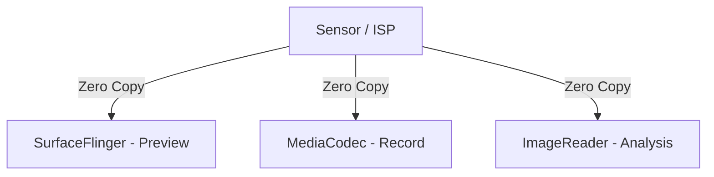
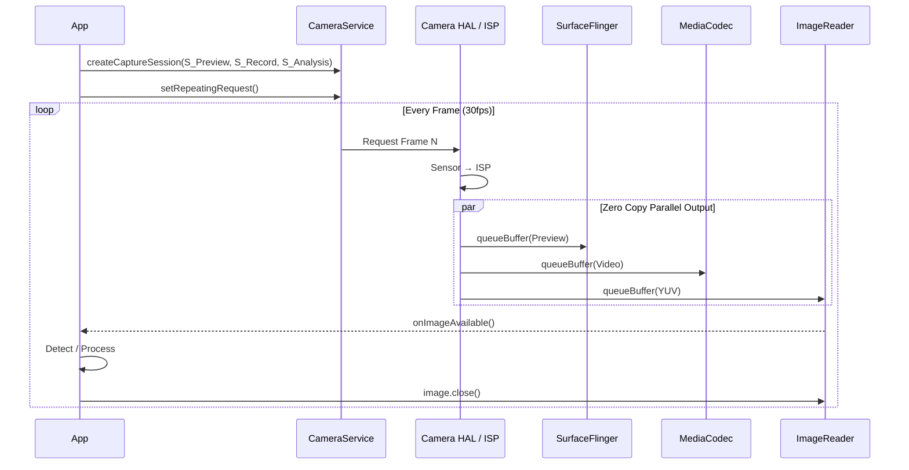

<!-- outline-start -->

**锚点（必须覆盖）：**
- Camera 的多消费者（Multi-Stream）架构
- HAL3 的 Request-Buffer 生命周期
- 三种消费路径：Preview / Recording / Analysis
- ZSL（Zero Shutter Lag）机制
- 常见掉帧场景与诊断

**扩展（可选深入）：**
- CameraCaptureSession 回调的时间戳分析
- DRM / Secure Camera Path
- SurfaceView vs TextureView 预览的性能差异

<!-- outline-end -->

## 为什么 Camera 的渲染链路与众不同

Camera 是 Android 系统中数据量最大、实时性要求最高的子系统之一。与普通 View 渲染"一产一销"的模型不同，Camera 天生就是**多消费者**的——同一个 Sensor 帧可能同时需要送到屏幕预览、视频编码器和 AI 分析模块，而且通常要求**零拷贝**。[已验证: Camera2 API 文档]

理解 Camera 管线的意义在于：当你在 Perfetto 中看到 Camera 相关的等待或掉帧，需要区分是"HAL 生产慢了"、"某个 Consumer 消费太慢导致 Buffer 饿死"还是"Binder IPC 拥塞"——这三类问题的优化方向完全不同。

## 多消费者架构

Camera HAL（Hardware Abstraction Layer）的核心设计是一个 Producer 对多个 Consumer：



关键组件：
- **CameraService**：系统服务，管理 Camera 硬件资源
- **HAL3 / ISP**：硬件图像信号处理器，产生 YUV/RAW 数据
- **CaptureRequest**：App 下发的请求，包含 ISO、曝光等参数

## 完整渲染链路

### 阶段一：配置流（Configure）

App 在使用 Camera 前必须告诉系统"我要几路数据，每路多大"：

```java
cameraDevice.createCaptureSession(
    Arrays.asList(previewSurface, videoSurface, analysisSurface),
    callback, handler
);
```

CameraService 将这些 Surface 的 Usage/Format 告诉 HAL，HAL 根据硬件能力决定是否支持该组合。

### 阶段二：生产（Request & Produce）

1. **setRepeatingRequest**：App 下发循环请求（通常用于预览）。
2. **ISP Processing**：Sensor 曝光 → ISP 去噪/白平衡/色彩校正 → 输出 YUV。
3. **Buffer Fill**：HAL 直接向各个 Surface 的 BufferQueue 填充数据，**零拷贝**。

### 阶段三：消费（三种路径）

#### Preview（预览）

| 方式 | 链路 | 延迟 |
|:---|:---|:---|
| SurfaceView | HAL → BufferQueue → SF → HWC → Display | **最低** |
| TextureView | HAL → SurfaceTexture → App RT → SF → Display | 较高（多 GPU 采样） |

#### Recording（录像）

MediaCodec Input Surface：HAL 直接向 Encoder 的 Input Surface 写入 GraphicBuffer，全程硬件加速零拷贝，不经过 CPU。

#### Analysis（AI/CV）

ImageReader：HAL 填充 Buffer → App `onImageAvailable` → App 通过 `image.getPlanes()` 获取 YUV 数据。

**性能坑点**：如果 App 在 `onImageAvailable` 中处理太慢（不及时 `image.close()`），HAL 没有空闲 Buffer 可用，导致**掉帧**。



## ZSL（Zero Shutter Lag）

ZSL 是解决"按下快门到真正拍照"延迟的核心机制：

1. **后台持续捕获**：Camera HAL 以全分辨率捕获 reprocessable YUV/RAW 帧，存入环形缓冲区（Ring Buffer）。
2. **用户按快门**：系统从缓冲区"捞"出最近一帧。
3. **Reprocessing**：通过 Reprocessing Pipeline（ISP 再处理：降噪、HDR 合成）生成最终 JPEG/HEIC 输出。

注意：ZSL 缓冲区存储的是未压缩的 YUV 或 RAW 数据（而非 JPEG），以保留最大后处理空间。[已验证: Camera2 API 文档]

## Request-Buffer 生命周期

| 阶段 | 触发者 | Buffer 状态 |
|:---|:---|:---|
| Dequeue | HAL (ISP) | HAL 拥有，正在填充 |
| Fill | ISP Pipeline | 数据写入中 |
| Queue | HAL | 提交给 Consumer |
| Acquire | Consumer | Consumer 拥有，正在使用 |
| Release | Consumer | 归还给 BufferQueue |

**CaptureCallback 回调**提供精细的时间戳：

| 回调 | 触发时机 | 性能分析用途 |
|:---|:---|:---|
| `onCaptureStarted` | Sensor 曝光开始 | 测量 Request 下发延迟 |
| `onCaptureCompleted` | 全部 Metadata 就绪 | 测量 Pipeline 总耗时 |
| `onCaptureFailed` | HAL 报错 | 掉帧根因定位 |
| `onCaptureBufferLost` | Buffer 丢失 | BufferQueue 压力分析 |

## 常见性能问题

1. **Buffer Starvation**：Consumer（ImageReader）处理太慢，HAL 无法获取空闲 Buffer。Trace 中可能看到 Camera / BufferQueue 相关等待。
2. **Pipeline Stall**：ISP 处理特效（HDR、夜景）耗时过长，超过帧间隔。`onCaptureCompleted` 到 `onCaptureStarted` 间隔不稳定。
3. **Binder Congestion**：CameraService 与 App 之间的 IPC 拥塞。`binder transaction` 耗时异常。
4. **内存抖动**：在 `onImageAvailable` 中频繁 `new byte[]` 拷贝数据。应直接处理 ByteBuffer 或使用 NDK/GPU 路径。

## 在 Perfetto 中识别 Camera 链路

| Track | 说明 |
|:---|:---|
| CameraProvider / CameraService | HAL 与 Service 的交互 |
| vendor camera threads | OEM 厂商的 Camera 线程 |
| dma_buf | GraphicBuffer 内存分配追踪 |

**注意**：Camera 在 Perfetto 中的可观测性高度依赖设备和数据源配置。缺少 Camera slice 不代表没有 Camera 压力。

## 与其他章节的关系

- **2.15 DMA-BUF、Gralloc 与跨进程图形内存共享**：Camera 零拷贝的底层基础
- **14.9 Camera 性能与 Perfetto 分析**：Camera 性能分析工具视角
- **18.6 SurfaceView**：Camera 预览的首选方案

## 参考资料

- Android 官方文档：Camera2 API
- AOSP `frameworks/av/services/camera/`
- AOSP `frameworks/base/core/java/android/hardware/camera2/`
