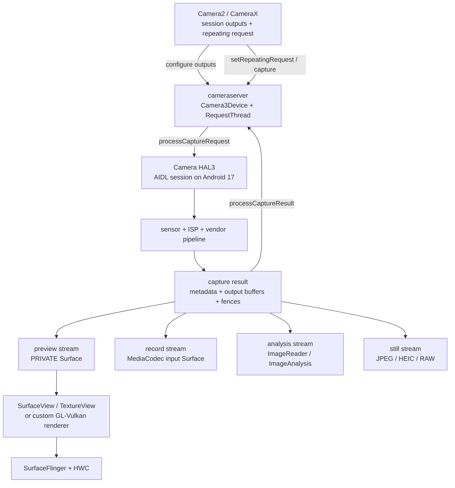

# 18.14 Android 17 Camera 渲染管线

## Camera 管线和普通 UI 有什么不同

Camera 页面上的像素不是宿主 View 画出来的。sensor 曝光后，ISP 与 vendor pipeline 处理图像，Camera HAL 把结果写入多个输出 buffer；宿主 App 负责配置 Surface、下发控制、消费分析结果，并把预览承载进窗口系统。

同一组 capture request 可以持续产生 preview、record、analysis 和 still capture 输出。每一路都有自己的格式、尺寸、buffer pool、consumer 与归还节奏。预览正常不代表分析或录像正常；某个 consumer 长时间占用 buffer，也可能通过共享 ISP stage、HAL pipeline 或有限内存反压其他输出。

分析使用三组锚点：

- 平台源码：Android 17 / API 37 / `android-17.0.0_r1`；
- kernel：`android17-6.18-2026-06_r6`；
- 设备实现：Camera provider / AIDL 或 HIDL HAL、ISP firmware、sensor driver、vendor tag 和 CameraX 版本。

AOSP 只能证明 framework、cameraserver、HAL 接口和显示系统的边界。曝光策略、ISP 算法、buffer 缓存和 vendor tracepoint 仍要回到目标设备验证。

## HAL3 的 request-result 与多消费者

Camera2 把相机建模为可同时容纳多笔在途请求的流水线。`CaptureRequest` 包含本帧的控制参数和目标 Surface；`CaptureResult` 返回 metadata，输出 `StreamBuffer` 返回图像内容与同步信息。请求按 frame number 排序进入 HAL，但同一 frame 的 partial metadata、final metadata 和不同输出 buffer 可以分批返回。

下面的图把 preview、record、analysis 和 still capture 放在同一组 HAL3 输出里。



图中的多路输出通常对应不同 stream buffer，不是同一块 GraphicBuffer 在三个线程之间来回复制。HAL 可以让同一次曝光和 ISP 中间结果服务多路输出，但每个 consumer 仍要独立归还自己的 buffer。

### 配置阶段决定这组输出能不能成立

App 创建 `CameraCaptureSession` 时提供一组 `OutputConfiguration`。framework 将格式、尺寸、dataspace、usage、dynamic range、stream use case、timestamp base 等信息传给 `Camera3Device::configureStreamsLocked()`，再进入 Android 17 AIDL `ICameraDeviceSession.configureStreams()` 或 `configureStreamsV2()`。

HAL 返回每个 stream 的 producer usage、override format 与 `maxBuffers`。这里有三条边界：

1. Camera2 为不同 hardware level 和 capability 定义了 mandatory stream combinations；
2. “单个格式支持某尺寸”不等于“这组尺寸和格式可以同时开启”；
3. 即便组合受支持，实际 fps 还会受 `getOutputMinFrameDuration()`、stall duration、sensor mode、热限制与 vendor pipeline 影响。

创建失败、首帧慢或运行中反复黑屏时，先确认 session 是否反复重配。只检查 `CaptureRequest` 参数，容易漏掉更早的 stream negotiation 问题。

### API 37 可以替换既有输出 Surface，不能增删 stream

Android 17 / API 37 新增 `CameraCaptureSession.updateOutputConfigurations(List)`，可把 deferred output 换成有效 Surface，也可在不关闭整个 session 的前提下替换既有输出 Surface。它适合照片与录像等 use case 之间的 Surface 切换，但接口约束比“动态重配 session”窄：

- 新列表的 `OutputConfiguration` 数量必须与 session 当前 output 数量相同；
- 每个配置必须能按 size、format 等属性对应到创建 session 时的既有配置；
- 允许替换关联 Surface 或切回 deferred 状态，不允许通过该调用新增或删除 `OutputConfiguration`；
- 调用会停止仍以旧 Surface 为目标的 active request，应用随后要提交指向新 Surface 的 request；
- framework 会继续跟踪旧 Surface，等在途 buffer 全部返回后再断开旧连接。

`CameraCaptureSessionImpl` 把调用交给 `CameraDeviceImpl.updateOutputConfigurations()`。后者先把新配置映射回现有 stream id，再通过 camera service 更新；被替换的旧 Surface 以弱引用保存在 `mReplacedOutputs`，用于处理尚未归还的 buffer。这个 API 减少了整组 session 关闭与重建，但没有放宽格式、尺寸和 output 数量约束，也不能替代 HAL 对配置的校验。

### Stream Use Case 是逐流提示，不是性能承诺

Android 13 / API 33 引入 `OutputConfiguration.setStreamUseCase()`。它让 App 为单个 output 声明 preview、still capture、video record、preview-video-still、video call 或 cropped RAW 等用途，HAL 可以据此选择 sensor mode、tuning 和 image-processing pipeline。

它与 `CONTROL_CAPTURE_INTENT` 的分工不同：

- stream use case 描述单个 output 的长期用途，必须在 session 创建前设置；
- capture intent 描述当前 request 的拍摄意图，主要帮助设备选择整笔请求的 3A 与处理策略；
- 设备必须声明 `REQUEST_AVAILABLE_CAPABILITIES_STREAM_USE_CASE`，并公布可用 use case 与 mandatory combinations；
- 非 mandatory 组合中的 use case 可能因硬件约束被忽略，不能据此保证帧率或延迟。

不要为 Stream Use Case 写固定的延迟收益或切换帧数。流配置是否触发 sensor mode 切换、切换需要多久，属于具体 HAL 与场景。

## Android 17 的 Request-Buffer 生命周期

理解 Camera 掉帧要把 request 和 buffer 分开。Camera pipeline 需要多笔 request 在途，但不一定要从 request 入队开始就为每笔 request 持有所有 output buffer。Android 10 引入的 HAL3 buffer management，正是为了把“请求进入 pipeline”和“HAL 借到输出 buffer”解耦。

### Framework-managed buffer：先借 buffer，再提交 request

未启用 HAL buffer management 时，主线如下：

1. `Camera3OutputStream::getBufferLockedCommon()` 从目标 `ANativeWindow` / Surface `dequeueBuffer()`；
2. framework 把 buffer handle 与 acquire fence 放进 capture request，交给 HAL；
3. HAL 等 acquire fence，写入图像，再通过 `processCaptureResult()` 返回 buffer status 与 release fence；
4. `Camera3OutputStream::returnBufferLocked()` 保留 HAL release fence，将 buffer queue 给 Surface、codec 或 ImageReader consumer；
5. consumer 读完并释放后，buffer 才能再次进入可用池。

HAL 拿到的是 buffer handle 和 fence，不是对应用侧 `BufferQueue` API 的直接控制。

### HAL buffer management：request 先走，buffer 按需借

Android 17 的 AIDL 接口继续支持 HAL buffer management：

1. framework 可以先用 `ICameraDeviceSession.processCaptureRequest()` 提交 request；
2. HAL 在接近写入阶段时，通过 `ICameraDeviceCallback.requestStreamBuffers()` 向 cameraserver 申请一个或多个 stream 的 buffer；
3. cameraserver 从 `Camera3OutputStream` 的 consumer / cache 取得 buffer，把 handle 与 fence 返回 HAL；
4. 正常输出仍通过 `processCaptureResult()` 归还；
5. HAL 预取但没有绑定到已提交 request 的多余 buffer，通过 `returnStreamBuffers()` 返还；
6. session 重配前，framework 可以用 `signalStreamFlush()` 要求 HAL 及时归还指定 stream 的 buffer。

Android 17 还包含 session-configurable buffer management：`configureStreamsV2()` 的返回值会说明本次 session 是否使用 HAL buffer manager。诊断不能只看设备级 capability，还要看该 session 的配置结果。

### `maxBuffers` 是 HAL 返回值，不是常量

`camera_stream::max_buffers` 在 `Camera3Stream` 构造时为 0，HAL 在 configure 阶段按 stream 返回上限。`Camera3Stream::getBuffer()` 会在 outstanding output buffer 达到 `max_buffers`，或 outstanding 与 cached buffer 达到相应总上限时等待 buffer 归还；`returnBuffer()` 无论 queue 是否成功都会唤醒等待方。

input stream 也按 HAL 返回的 `max_buffers` 控制 handout 数量。不能把某台设备或某个 CameraX 版本里的观察值写成 HAL3 通用规则，也不能用固定 buffer 数直接估算所有设备的 ZSL 内存。

`Camera3Device::mInFlightMap` 以 frame number 记录 metadata 是否到达、还有多少 buffer 未归还、是否含 input、是否为 ZSL still 等状态。列表变长是结果或 buffer 没有及时闭合的信号，但根因可能在 sensor / ISP、HAL、consumer 或 fence，需要继续向两端追。

### 三类 fence 要分别看

| 同步对象 | 表示什么 | 常见等待方 |
| --- | --- | --- |
| framework 交给 HAL 的 acquire fence | output buffer 何时可以被 HAL 写入 | HAL / ISP / vendor GPU |
| HAL 随 result 返回的 release fence | 图像写入何时完成，consumer 何时可以读取 | BufferQueue、ImageReader、MediaCodec、App GPU |
| SF / HWC 对预览 layer 的 release fence | 显示 consumer 何时不再读取该预览 buffer | BufferQueue / 后续 producer |

display present fence 描述一轮显示帧的 present 边界，不能替代 camera capture completion。analysis、record 和 still buffer 可能从不上屏，也就没有可对应的 display present fence。

## 三种主要消费路径

### Preview：SurfaceView、TextureView 与自研 renderer

预览 carrier 决定相机 buffer 怎样进入最终 App 画面。

| Carrier | Camera buffer 的 consumer | 最终 SF layer | 主要代价与证据 |
| --- | --- | --- | --- |
| `SurfaceView` | Surface / BufferQueue → SurfaceFlinger | preview child layer 与 host App Window 分开 | 少一次宿主纹理采样；查 preview layer buffer、geometry transaction 和 HWC composition type |
| `TextureView` | `SurfaceTexture` → 宿主 HWUI RenderThread | 通常只有 host App Window | 易做 matrix、clip、alpha；多一次宿主纹理获取、采样与窗口提交 |
| 自研 GL / Vulkan | OES texture、AHardwareBuffer 或 ImageReader → App GPU | 取决于 renderer 的 output Surface | HAL 是第一生产者，App renderer 同时是中间 consumer 与第二生产者 |

`SurfaceView` 预览在现代 Android 上经 SurfaceControl / BLAST 与宿主窗口协调几何，但相机像素仍由独立 BufferQueue 提交。preview layer 是否走 HWC DEVICE composition 取决于整组 layer 的格式、缩放、alpha、crop、色彩空间和 plane 资源，不能把 SurfaceView 等同于硬件 overlay。

`TextureView` 有两条 BufferQueue：camera → SurfaceTexture，以及 HWUI → App Window。camera buffer 已到达，只说明纹理可供宿主获取；画面还要等宿主 `Choreographer`、traversal、RenderThread 和 host window queue。

Android 17 的 `TextureView` 收到 `SurfaceTexture.OnFrameAvailableListener` 回调后执行 `updateLayer()` 与 `invalidate()`；RenderThread 侧 `DeferredLayerUpdater::apply()` 再通过 `ASurfaceTexture_dequeueBuffer()` 取得最新 `AHardwareBuffer` 并更新 HWUI layer。这个调用链能解释一类常见现场：camera release fence 已完成，宿主窗口仍因没有及时 draw 或提交而沿用上一帧。

自研滤镜、畸变矫正、分割或 AR 管线还多一个 App GPU pass。排查时分别测量 camera release fence、App GPU completion 与 output Surface present，避免把第二段迟到归给 ISP。

### Recording：MediaCodec 是独立 consumer

录像 stream 通常把 `MediaCodec` 或 `MediaRecorder` input Surface 作为 consumer。HAL 交付原始图像 buffer 后，encoder 还要等待输入、执行颜色处理与编码、输出码流。预览平滑而录像丢帧时，应检查 encoder input queue、codec callback、码率 / 分辨率、thermal throttling 与 storage writer，不能只看 SurfaceFlinger。

录制与预览可以来自同一组 repeating request，但二者持有不同 stream buffer。encoder 不及时消费会耗尽 recording stream 的可用 buffer；某些 HAL 能隔离该 stream，另一些 pipeline 会因为共享 ISP stage 或资源预算影响后续 request，结论要按设备 trace 判断。

### Analysis：归还速度就是吞吐上限

`ImageReader` / CameraX `ImageAnalysis` 把 YUV、PRIVATE 或其他格式交给 App。同步推理、YUV→RGB、逐帧数组分配、保存 bitmap 或忘记关闭 Image，都可能占满 `maxImages` 并反压上游。

只关心最新结果时，下面的处理骨架展示了怎样缩短持有时间。

```kotlin
imageReader.setOnImageAvailableListener({ reader ->
    val image = reader.acquireLatestImage() ?: return@setOnImageAvailableListener
    try {
        analyzer.consume(image)
    } finally {
        image.close()
    }
}, analysisHandler)
```

示例中的 `analyzer.consume()` 必须是耗时有界的同步调用。若把 Image 交给异步任务，该任务就成为 owner，必须在任务结束时 `close()`；提前关闭会让 plane 失效，无界排队又会把压力转移到线程池。`acquireLatestImage()` 适合扫码、姿态或预览辅助分析；要求逐帧不丢且保持顺序时使用 `acquireNextImage()`，并保证 consumer 能跟上。增大 `maxImages` 只能增加缓冲余量和内存占用，不能修复长期吞吐不足。CameraX 的 `ImageProxy` 同样必须 `close()`。

## ZSL：把两种机制分开

“Zero Shutter Lag”在 Camera2 与 CameraX 里至少有两种控制边界。把它们合成一条固定前置链，会误判设备能力。

### Device-operated ZSL：`CONTROL_ENABLE_ZSL`

`CaptureRequest.CONTROL_ENABLE_ZSL` 是可选的 request key。对 `CONTROL_CAPTURE_INTENT_STILL_CAPTURE` 的请求设为 `true` 后，camera device **可以**使用过去采集的图像生成结果，但 API 不保证每次命中历史帧。

这条机制由设备内部管理候选帧，不要求 App 自己创建 reprocessable session。它还会带来一个诊断特征：ZSL still 的图像内容与 result metadata 可能早于前面普通 request，shutter / result 顺序也有专门规则。对齐时以该 result 的 `SENSOR_TIMESTAMP` 和 frame number 为准，不要只按 callback 到达顺序排列。

### Application-operated ZSL：ring buffer + reprocess

应用自管 ZSL 会在预览期间保留高分辨率候选帧，用户按下快门时选择接近触发时刻的帧，再送回 reprocess pipeline。该模式需要：

- 设备声明 `PRIVATE_REPROCESSING` 或 `YUV_REPROCESSING`，具体取决于 input format；
- 创建带 `InputConfiguration` 的 reprocessable capture session；
- 用 `createReprocessCaptureRequest()` 构造重处理请求；
- 控制 input 与 output buffer 的持有、fence 和归还。

CameraX 的 `CAPTURE_MODE_ZERO_SHUTTER_LAG` 封装了这条思路。当前官方文档描述它维护最近若干候选帧，并要求 Android 6.0+ 与 PRIVATE reprocessing；不满足时回退到 `CAPTURE_MODE_MINIMIZE_LATENCY`。flash 为 ON / AUTO、VideoCapture 或 Extensions 组合不支持该模式。排障报告要记录 CameraX 版本，因为 ring buffer 容量、3A 过滤与 surface negotiation 属于库实现，不应固化成平台常量。

### 怎样判断 ZSL 卡在哪里

| 现象 | 优先检查 |
| --- | --- |
| `CONTROL_ENABLE_ZSL=true` 但照片仍来自当前帧 | 这是允许行为；核对 key 是否可用、capture intent、flash、HAL 策略与 result sensor timestamp |
| CameraX `isZslSupported()` 为 false | API level、PRIVATE reprocessing、flash、VideoCapture、Extensions、quirk 与库版本 |
| 快门快，但后台很久才出 JPEG | reprocess / ISP、offline processing、JPEG consumer 与 storage |
| 开启 ZSL 后内存与 buffer wait 上升 | input stream、ring buffer、in-flight request、output stream 与 Image close |
| ZSL still callback 看似“乱序” | 按 frame number 与 source sensor timestamp 重排，不按 callback wall time 猜测 |

## 时间戳：不要把每一路都当作 sensor time

Android 13 起，`OutputConfiguration` 可以选择 timestamp base。Android 17 默认行为会按输出目标调整：

- `SurfaceView` 在固定帧率下默认使用 `TIMESTAMP_BASE_CHOREOGRAPHER_SYNCED`，以显示节奏平滑预览；这个时间不能直接和 sensor timestamp 对齐；
- `SurfaceTexture` 的交付节奏可按 readout interval 调整，但 image timestamp 仍保留 sensor time base；
- MediaRecorder、MediaCodec 或带 video-encode usage 的 ImageReader 默认使用 MONOTONIC，便于音视频同步；
- 其他输出通常使用 SENSOR time base。

`onCaptureStarted()` 给出曝光开始时间，支持 readout timestamp 的设备还可以使用 `onReadoutStarted()`。`onCaptureCompleted()` 表示 final result metadata 已回到 framework，不表示每个 consumer 已处理完，更不表示预览已 present。

复原单帧时至少保留 frame number、request id、sensor / readout timestamp、output stream、buffer id、HAL result time、consumer acquire / release 和显示 frame token。若 timestamp base 不同，先转换或改用共同的 frame number / flow，不要直接相减。

## Secure Camera Path

`REQUEST_AVAILABLE_CAPABILITIES_SECURE_IMAGE_DATA` 表示 camera device 能把图像写进 Android userspace 与 Android kernel 都不可访问、仅受信任执行环境可访问的内存。这和普通 App 在窗口上设置 `FLAG_SECURE` 不是一回事，也不能按普通 DRM video Surface 的经验套用。

设备可以通过 `SCALER_DEFAULT_SECURE_IMAGE_SIZE` 公布 secure camera mode 保证支持的 PRIVATE / YUV 尺寸；其他格式或尺寸应调用 `isSessionConfigurationSupported()` 验证。进入 secure path 后：

- 标准 CPU `ImageReader` / `Image.Plane` 读取通常不属于允许的 consumer 路径；
- buffer 内容不应出现在截图、dump 或普通内存分析里；
- Perfetto 仍可观察 request、HAL callback、调度、fence 和显示 transaction，但看不到受保护像素；
- 具体 permission、TEE consumer、protected usage 与显示限制由产品和 vendor 实现决定。

排障文档应明确标记 secure session，避免把“无法 mmap / 无法截图”记录成普通 buffer 损坏。

## Perfetto：从 request 追到 present

### 采集前固定现场

每份 trace 至少记录：

- Android build、camera id、logical / physical camera 关系、`INFO_DEVICE_TYPE`；
- Camera provider 与 HAL transport（AIDL / HIDL）、vendor build；
- 所有 output 的 format、size、fps range、dynamic range、stream use case、timestamp base；
- CameraX 版本、PreviewView implementation mode 与最终 carrier；
- 是否启用 ZSL、Extensions、Low Light Boost、HDR、stabilization、secure path；
- thermal state、GPU / ISP / memory frequency 与复现时间。

`dumpsys media.camera` 可以查看客户端、stream 与 in-flight 概况，SurfaceFlinger layer tree 用于确认预览 carrier。厂商 HAL dump、camera event log 和 vendor trace 要与 Perfetto 使用同一时间基准。

### 按五段证据定位

| 阶段 | 观察点 | 典型异常 |
| --- | --- | --- |
| App / CameraX | session configure、repeating / single capture、callback executor | 反复重配、请求间隔异常、callback 被业务阻塞 |
| cameraserver | `Camera3Device` RequestThread、in-flight map、stream dequeue | request 排队、buffer limit wait、stream abandon |
| HAL / sensor / ISP | `processCaptureRequest`、SOF、vendor job、`processCaptureResult` | 曝光变化、ISP stall、算法或 HAL queue 堵塞 |
| consumer | Surface、codec、ImageReader、App GPU acquire / release | Image 未关、encoder 慢、纹理或 GPU pass 晚 |
| display | preview buffer、SF latch、composition type、present | acquire fence、geometry transaction、HWC / display 晚 |

线程名和 slice 前缀受 HAL transport 与厂商实现影响。Android 17 的 AIDL 设备优先搜索 `ICameraDeviceSession`、`processCaptureRequest`、`requestStreamBuffers`、`processCaptureResult`；升级设备仍可能使用兼容的 HIDL HAL。没有 camera atrace slice 时，还可以从 binder flow、BufferQueue、dma-buf、fence、thread state 和 SF layer 还原。

### 单帧复原顺序

把同一 frame 按以下顺序排列：

1. App 提交 request；
2. Camera3 RequestThread 交给 HAL；
3. sensor exposure / readout；
4. partial / final metadata 和各 output buffer 返回；
5. preview、record、analysis、still consumer 分别 acquire 与 release；
6. preview carrier queue；
7. SF latch、composition 与 display present。

不同 output 要分别记录。analysis callback 不能替代 preview buffer ready，capture callback 也不能替代 JPEG / RAW Image 可读。

### CPU 工作、调度等待和 fence 等待

slice 很长时同时看线程状态：

- Running：继续看 ISP control、YUV 转换、推理、codec 或 App GPU submission 的 CPU 栈；
- Runnable：调度延迟，结合 CPU contention、优先级与 thermal；
- Sleeping / blocked：检查 Binder、condition variable、buffer limit、fence 与 I/O；
- GPU / ISP queue 已提交但没完成：回到设备频率、带宽、driver job 和 fence。

只量 callback 的 wall time，会把队列等待、CPU 计算和硬件执行混在一起。

## 常见掉帧场景与修复方向

### Session 反复重配

尺寸、dynamic range、physical camera、Extensions 或 output 集合变化会触发昂贵的 configure。短时间内频繁 unbind / bind CameraX use case，或在预览期间重建 session，会表现为 request 中断、buffer drain 和首帧重复。

把静态 output 组合稳定下来；动态 3A / zoom / exposure 尽量通过 request 更新。必须重配时，把停流、configure 与首个 result 分段计时。

API 37 上，若切换只涉及同构 `OutputConfiguration` 的 Surface，可评估 `updateOutputConfigurations()`。output 数量、format 或 size 发生变化时仍要重新创建 session；旧 Surface 上的 active request 也要按接口契约停止并改投新目标。

### Analysis consumer 反压

症状是 analysis 延迟持续增加、`maxImages` 被占满、stream buffer request 变慢或超时。把推理移出回调线程、按需求使用 latest-only 策略、减少 YUV 回拷，并保证所有异常路径关闭 Image。盲目增大队列只会推迟拥塞并抬高内存。

### Recording consumer 反压

症状是 preview 仍稳定，record output 的 buffer 闭合变慢或 encoder input 堆积。检查 codec surface、编码 profile、码率、分辨率、thermal 和 muxer / storage；不要把所有录像掉帧归给 Camera HAL。

### Sensor / ISP pipeline stall

长曝光、HDR、多帧降噪、night extension、高分辨率 remosaic 或多个重输出会增加 sensor / ISP 时间。用 exposure、frame duration、SOF / readout、HAL result 和 vendor job 证据区分“场景本来需要长曝光”和“实现异常 stall”。

### Preview carrier 晚

SurfaceView preview buffer 已 ready 但没有 present，继续查 release fence、SF latch、geometry transaction 与 HWC。TextureView camera buffer 已 ready 但画面晚，继续查宿主 Choreographer、RenderThread、texture acquire、GPU 和 App Window。

### 内存、带宽与热限制

多流会增加 GraphicBuffer / dma-buf、ISP 与内存带宽，10-bit、RAW14、高 fps 和大尺寸输出尤为明显。结合 dma-buf 总量、page allocation、IOMMU map、PSI memory、direct reclaim、GPU / ISP / memory frequency 和 thermal throttling 判断。固定几个 buffer 数乘分辨率，无法覆盖 row stride、format、HAL cache、中间 buffer 和 vendor algorithm。

## Android 12—17 的版本演进

下面保留平台能力变化；每项能力都要以 `CameraCharacteristics`、session support query 和设备 HAL 为准。

- **Android 12 / API 31**：Camera2 vendor extensions 进入公开平台，Bokeh、HDR、Night 等模式可以通过 `CameraExtensionSession` 查询；maximum-resolution stream configuration 为超高分辨率 sensor 提供公开边界。
- **Android 13 / API 33**：Camera HAL 新能力转向 AIDL；Camera2 加入 10-bit HDR video、DynamicRangeProfiles、stream use case 与 output timestamp base。HIDL 仍可用于兼容升级设备。
- **Android 14 / API 34**：Ultra HDR still image 与 gainmap 进入公开链路，cropped RAW stream use case 用于 in-sensor zoom；它们不表示普通 preview 自动切到 HDR 或 RAW。
- **Android 15 / API 35**：Low Light Boost 为支持设备提供连续预览 / video 的低光 AE mode，与多帧 Night still capture 不同。曝光和算法负载变化会改变可达帧率。
- **Android 16 / API 36**：color temperature / tint、hybrid auto-exposure、night mode indicator、motion photo capture intent 等能力扩展 request 与 metadata，但没有替代 Surface / HAL buffer / consumer 回收主线。
- **Android 17 / API 37**：`CameraCaptureSession.updateOutputConfigurations()` 支持在不关闭整个 session 的情况下替换既有同构 output 的 Surface；`ImageFormat.RAW14` 支持紧凑的 14-bit RAW，vendor-defined camera extensions 与 `INFO_DEVICE_TYPE` 扩展能力发现。动态更新不能增删 output，RAW14 也只影响兼容并显式配置的 RAW stream。

Android 17 平台继续使用 HAL3 request-result 与多 output Surface 模型。新 metadata 或 extension 会改变配置与处理负载，不会消除 buffer ownership、fence 与 consumer backpressure。

## Android 17 / kernel 6.18 源码入口

### Framework 与 cameraserver

- [`CameraCaptureSession.java`](https://android.googlesource.com/platform/frameworks/base/+/refs/tags/android-17.0.0_r1/core/java/android/hardware/camera2/CameraCaptureSession.java)、[`CameraCaptureSessionImpl.java`](https://android.googlesource.com/platform/frameworks/base/+/refs/tags/android-17.0.0_r1/core/java/android/hardware/camera2/impl/CameraCaptureSessionImpl.java)、[`CameraDeviceImpl.java`](https://android.googlesource.com/platform/frameworks/base/+/refs/tags/android-17.0.0_r1/core/java/android/hardware/camera2/impl/CameraDeviceImpl.java)：session、request、动态输出更新与 callback；
- [`OutputConfiguration.java`](https://android.googlesource.com/platform/frameworks/base/+/refs/tags/android-17.0.0_r1/core/java/android/hardware/camera2/params/OutputConfiguration.java)：stream use case、timestamp base、dynamic range 与 output 属性；
- [`CaptureRequest.java`](https://android.googlesource.com/platform/frameworks/base/+/refs/tags/android-17.0.0_r1/core/java/android/hardware/camera2/CaptureRequest.java)、[`CameraCharacteristics.java`](https://android.googlesource.com/platform/frameworks/base/+/refs/tags/android-17.0.0_r1/core/java/android/hardware/camera2/CameraCharacteristics.java)：ZSL、reprocessing、secure image、stream capability 与 device type；
- [`ImageFormat.java`](https://android.googlesource.com/platform/frameworks/base/+/refs/tags/android-17.0.0_r1/graphics/java/android/graphics/ImageFormat.java)：RAW14 与其他公开 image format；
- [`Camera3Device.cpp`](https://android.googlesource.com/platform/frameworks/av/+/refs/tags/android-17.0.0_r1/services/camera/libcameraservice/device3/Camera3Device.cpp)、[`Camera3Stream.cpp`](https://android.googlesource.com/platform/frameworks/av/+/refs/tags/android-17.0.0_r1/services/camera/libcameraservice/device3/Camera3Stream.cpp)、[`Camera3OutputStream.cpp`](https://android.googlesource.com/platform/frameworks/av/+/refs/tags/android-17.0.0_r1/services/camera/libcameraservice/device3/Camera3OutputStream.cpp)：configure、RequestThread、in-flight map、buffer limit、dequeue / queue 与 fence。

### Camera HAL AIDL

- [`ICameraDeviceSession.aidl`](https://android.googlesource.com/platform/hardware/interfaces/+/refs/tags/android-17.0.0_r1/camera/device/aidl/android/hardware/camera/device/ICameraDeviceSession.aidl)：configure、process request、flush 与 offline session；
- [`ICameraDeviceCallback.aidl`](https://android.googlesource.com/platform/hardware/interfaces/+/refs/tags/android-17.0.0_r1/camera/device/aidl/android/hardware/camera/device/ICameraDeviceCallback.aidl)、[`HalStream.aidl`](https://android.googlesource.com/platform/hardware/interfaces/+/refs/tags/android-17.0.0_r1/camera/device/aidl/android/hardware/camera/device/HalStream.aidl)：capture result、request / return stream buffers 与逐流 `maxBuffers`；
- [Camera HAL3 request / result](https://source.android.com/docs/core/camera/camera3_requests_hal)、[Camera HAL3 buffer management](https://source.android.com/docs/core/camera/buffer-management-api)：接口语义与版本演进。

### Consumer、显示与 kernel

- [Android 17 Camera 更新](https://developer.android.com/about/versions/17/release-notes)、[`CameraCaptureSession`](https://developer.android.com/reference/android/hardware/camera2/CameraCaptureSession)、[Camera2 多流](https://developer.android.com/media/camera/camera2/multiple-camera-streams-simultaneously)：API 37 动态输出更新与多流公开契约；
- [CameraX Preview](https://developer.android.com/media/camera/camerax/preview)、[CameraX Image Analysis](https://developer.android.com/media/camera/camerax/analyze)、[CameraX ZSL](https://developer.android.com/media/camera/camerax/take-photo/zsl)：公开 consumer 与库层约束；
- [`TextureView.java`](https://android.googlesource.com/platform/frameworks/base/+/refs/tags/android-17.0.0_r1/core/java/android/view/TextureView.java)、[`DeferredLayerUpdater.cpp`](https://android.googlesource.com/platform/frameworks/base/+/refs/tags/android-17.0.0_r1/libs/hwui/DeferredLayerUpdater.cpp)：TextureView frame available、宿主 invalidation 与最新 buffer 获取；
- [`SurfaceFlinger.cpp`](https://android.googlesource.com/platform/frameworks/native/+/refs/tags/android-17.0.0_r1/services/surfaceflinger/SurfaceFlinger.cpp)、[`HWComposer.cpp`](https://android.googlesource.com/platform/frameworks/native/+/refs/tags/android-17.0.0_r1/services/surfaceflinger/DisplayHardware/HWComposer.cpp)：预览 layer 的 latch、composition 与 present；
- kernel `android17-6.18-2026-06_r6` 的 [`dma-buf.c`](https://android.googlesource.com/kernel/common/+/refs/tags/android17-6.18-2026-06_r6/drivers/dma-buf/dma-buf.c)、[`dma-fence.c`](https://android.googlesource.com/kernel/common/+/refs/tags/android17-6.18-2026-06_r6/drivers/dma-buf/dma-fence.c)、[`sync_file.c`](https://android.googlesource.com/kernel/common/+/refs/tags/android17-6.18-2026-06_r6/drivers/dma-buf/sync_file.c)：buffer 共享、fence signal / wait 与 fence fd。

## 常见误判

| 误判 | 修正方法 |
| --- | --- |
| 同一 request 的多路输出共用同一块 buffer | 按 stream、buffer id、format 与 consumer 分别追踪 |
| `maxBuffers` 在 HAL3 中固定为 2 | 它由 HAL 在 configure 阶段逐流返回 |
| result metadata 到达表示所有 buffer 都 ready | partial / final metadata 与不同 stream buffer 可以分开返回 |
| `onCaptureCompleted()` 表示预览已经显示 | 继续追 preview queue、SF latch 与 display present |
| `CONTROL_ENABLE_ZSL` 必须配 reprocessable session | 它是 device-operated 提示；应用自管 ZSL 才需要 input stream 与 reprocess |
| ZSL callback 到达顺序就是照片的采集顺序 | 用 frame number 与 source sensor timestamp |
| `Image.close()` 只影响 Java 内存 | 它决定 analysis buffer 能否归池，可能反压 session |
| SurfaceView 一定使用 HWC overlay | 查看实际 composition type 与整组 layer 条件 |
| TextureView buffer 到达就已上屏 | 还要等宿主 traversal、RT、App Window 与 SF |
| 增大 `maxImages` 可以修复慢分析 | 它只增加缓冲与内存，长期吞吐仍由 consumer 决定 |
| API 37 动态更新可以任意增删 output | 只能替换既有同构配置的 Surface，output 数量不变 |
| RAW14 会改变 Android 17 的所有预览 | 只影响设备支持并显式配置的 RAW14 stream |

## 与其他章节的关系

- **§2.15 DMA-BUF、Gralloc 与跨进程图形内存共享**：Camera buffer handle 与 fence 的内存模型；
- **§14.20 Android Camera 性能与 Perfetto 分析**：Camera trace 配置、SQL 与案例；
- **§18.6 SurfaceView、§18.7 TextureView**：预览 carrier 的窗口与显示路径；
- **§18.10 SurfaceControl API 深入**：SurfaceView preview layer 的 transaction 与 fence；
- **§18.15 Video Overlay / HWC**：录像与预览 layer 进入 HWC 后的 composition 决策。

## 小结

Camera 的诊断从 session outputs 与 HAL3 request-result 开始。preview、record、analysis 和 still capture 拥有不同 buffer 与 consumer；每一路都要追到归还，才能判断谁在反压 session。

标准 SurfaceView 预览形成独立 layer，TextureView 预览还要经过宿主 HWUI，自研 GL / Vulkan 预览则增加第二生产者。ZSL 要区分 device-operated 与 application-operated，`maxBuffers` 要读取 HAL 配置，timestamp 要先确认 time base。

把 request、frame number、sensor / readout timestamp、HAL result、consumer release、preview queue、SF latch 与 display present 对齐后，sensor / ISP 慢、buffer 不足、analysis / encoder 反压、宿主消费晚与显示端迟到才会显出各自边界。
