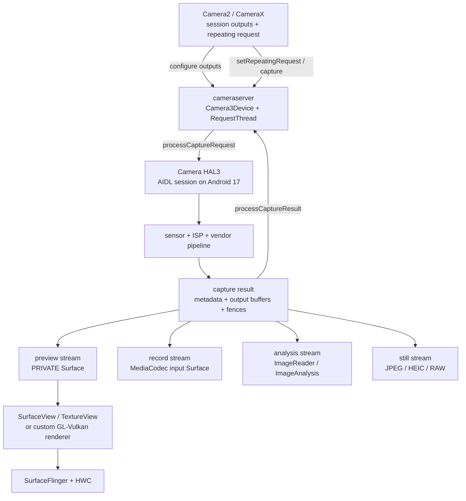

# 18.14 Android 17 Camera 渲染管线

## Camera 管线和普通 UI 有什么不同

Camera 预览中的像素通常不经过宿主 View 的绘制逻辑。sensor 完成曝光后，ISP（Image Signal Processor，图像信号处理器）与 vendor pipeline（厂商算法处理链）处理图像，Camera HAL 再把结果写入多个输出 buffer。宿主 App 负责配置 Surface、下发拍摄控制、消费分析结果，并选择预览进入窗口系统的承载方式。

同一组 capture request 可以持续产生 preview、record、analysis 和 still capture 输出。每一路都有自己的格式、尺寸、buffer pool（可循环复用的一组 buffer）、consumer（读取并最终归还 buffer 的一方）与归还节奏。预览正常不能证明分析或录像也正常；某个 consumer 长时间占用 buffer，还可能通过共享的 ISP stage、HAL pipeline 或内存预算影响其他输出。这种下游消费变慢并阻塞上游继续生产的现象称为 backpressure（反压）。

本文按三类证据分析：

- 平台源码：Android 17 / API 37 / `android-17.0.0_r1`；
- kernel：`android17-6.18-2026-06_r6`；
- 设备实现：Camera provider / AIDL 或 HIDL HAL、ISP firmware、sensor driver、vendor tag 和 CameraX 版本。

AOSP 能说明 framework、cameraserver、HAL 接口和显示系统的公共边界。曝光策略、ISP 算法、buffer 缓存和 vendor tracepoint（厂商自定义跟踪点）仍取决于设备实现，需要在目标设备上验证。

## HAL3 的 request-result 与多消费者

Camera2 把相机建模为可同时处理多笔在途请求的流水线。`CaptureRequest` 包含一帧的控制参数和目标 Surface；`CaptureResult` 返回曝光、对焦等 metadata，HAL 的 `StreamBuffer` 结构则携带图像 buffer 及同步信息。请求按 frame number 排序进入 HAL，同一 frame 的 partial metadata（分批给出的阶段性结果）、final metadata 和各路输出 buffer 却可以在不同时间返回。因此，收到某一份 metadata 不能证明该帧的所有图像输出都已就绪。

下面的图把 preview、record、analysis 和 still capture 放在同一组 HAL3 输出里。



图中的多路输出通常各自使用一组 stream buffer，并不依赖同一块 GraphicBuffer 在多个 consumer 之间顺序传递。HAL 可以让同一次曝光和 ISP 中间结果服务多路输出，每个 consumer 仍须独立归还所属 stream 的 buffer。

### 配置阶段决定这组输出能不能成立

App 创建 `CameraCaptureSession` 时提供一组 `OutputConfiguration`。framework 将格式、尺寸、dataspace、usage、dynamic range、stream use case、timestamp base 等输出属性传给 `Camera3Device::configureStreamsLocked()`，再进入 Android 17 AIDL `ICameraDeviceSession.configureStreams()` 或 `configureStreamsV2()`。这里的 stream 是一个具有固定输出属性和 consumer 的逻辑输出通道。

HAL 返回每个 stream 的 producer usage、override format 与 `maxBuffers`。判断配置是否成立时要区分三层约束：

1. Camera2 为不同 hardware level 和 capability 定义了 mandatory stream combinations，即符合条件的设备必须支持的输出组合；
2. “单个格式支持某尺寸”不等于“这组尺寸和格式可以同时开启”；
3. 即便组合受支持，实际 fps 仍会受 `getOutputMinFrameDuration()`、stall duration、sensor mode、热限制与 vendor pipeline 影响。前者给出连续输出两帧的最短间隔，stall duration 表示某类输出可能额外占用管线、延迟后续请求的时间。

创建失败、首帧慢或运行中反复黑屏时，先确认 session 是否反复重配。若只检查 `CaptureRequest` 参数，很容易漏掉更早发生的 stream negotiation（输出组合协商）问题。

### API 37 可以替换既有输出 Surface，不能增删 stream

Android 17 / API 37 新增 `CameraCaptureSession.updateOutputConfigurations(List)`，可为 deferred output 补上有效 Surface，也可在不关闭整个 session 的前提下替换既有输出 Surface。deferred output 指创建 session 时已经确定尺寸等属性、但尚未绑定实际 Surface 的输出。它适合在照片、录像等 use case 之间切换 Surface，但可变范围比重新配置整个 session 小：

- 新列表的 `OutputConfiguration` 数量必须与 session 当前 output 数量相同；
- 每个配置必须能按 size、format 等属性对应到创建 session 时的既有配置；
- 允许替换关联 Surface 或切回 deferred 状态，不允许通过该调用新增或删除 `OutputConfiguration`；
- 调用会停止仍以旧 Surface 为目标的 active request，应用随后需要提交指向新 Surface 的 request；
- framework 会继续跟踪旧 Surface，待在途 buffer 全部返回后才断开旧连接。

`CameraCaptureSessionImpl` 把调用交给 `CameraDeviceImpl.updateOutputConfigurations()`。后者先将新配置映射回现有 stream id，再通过 camera service 更新；被替换的旧 Surface 以弱引用保存在 `mReplacedOutputs`，让 framework 在不延长 Surface 生命周期的情况下识别尚未归还的旧 buffer。这个 API 可以省去整组 session 的关闭与重建，但不会放宽格式、尺寸和 output 数量约束，也不能绕过 HAL 的配置校验。

### Stream Use Case 是逐流提示，不是性能承诺

Android 13 / API 33 引入 `OutputConfiguration.setStreamUseCase()`。它让 App 为单个 output 声明 preview、still capture、video record、preview-video-still、video call 或 cropped RAW 等长期用途，HAL 可以据此选择 sensor mode、厂商 tuning 配置和 image-processing pipeline。它是一项配置提示，不是帧率或延迟保证。

它与 `CONTROL_CAPTURE_INTENT` 的分工不同：

- stream use case 描述单个 output 的长期用途，必须在 session 创建前设置；
- capture intent 描述当前 request 的拍摄意图，主要帮助设备选择整笔请求的 3A 与处理策略；3A 指自动对焦（AF）、自动曝光（AE）和自动白平衡（AWB）；
- 设备必须声明 `REQUEST_AVAILABLE_CAPABILITIES_STREAM_USE_CASE`，并公布可用 use case 与 mandatory combinations；
- 非 mandatory 组合中的 use case 可能因硬件约束被忽略，不能据此保证帧率或延迟。

不要为 Stream Use Case 假定固定的延迟收益或切换帧数。流配置是否触发 sensor mode 切换、切换需要多久，取决于具体 HAL 与拍摄场景。

## Android 17 的 Request-Buffer 生命周期

理解 Camera 掉帧时，要先把 request 的执行进度与 buffer 的占用状态分开。Camera pipeline 需要多笔 request 同时在途，但不必从 request 入队开始就为每笔请求持有全部 output buffer。Android 10 引入 HAL3 buffer management，使“请求进入 pipeline”和“HAL 取得输出 buffer”可以在不同时间发生。

### Framework-managed buffer：先借 buffer，再提交 request

未启用 HAL buffer management 时，主线如下：

1. `Camera3OutputStream::getBufferLockedCommon()` 通过目标 `ANativeWindow` / Surface 的 `dequeueBuffer()` 从 BufferQueue 取出一个可写 buffer；
2. framework 把 buffer handle 与 acquire fence 放进 capture request，再交给 HAL；
3. HAL 等待 acquire fence，写入图像，然后通过 `processCaptureResult()` 返回 buffer status 与 release fence；
4. `Camera3OutputStream::returnBufferLocked()` 保留 HAL release fence，并将 buffer 提交给 Surface、codec 或 ImageReader consumer；
5. consumer 读完并释放后，buffer 才能再次进入可用池。

HAL 拿到的是 buffer handle 和 fence，无须直接操作应用侧的 `BufferQueue` API。buffer handle 标识共享图形内存，fence 则约束这块内存在生产者与消费者之间何时可以安全读写。

### HAL buffer management：request 先走，buffer 按需借

Android 17 的 AIDL 接口继续支持 HAL buffer management。启用后，HAL 可以把取 buffer 的时间推迟到真正接近写入的阶段，减少过早占用：

1. framework 可以先用 `ICameraDeviceSession.processCaptureRequest()` 提交 request；
2. HAL 在接近写入阶段时，通过 `ICameraDeviceCallback.requestStreamBuffers()` 向 cameraserver 申请一个或多个 stream 的 buffer；
3. cameraserver 通过 `Camera3OutputStream` 向关联 Surface dequeue buffer，并可复用 cache 中已有的 handle 记录，再把 handle 与 fence 返回 HAL；
4. 正常输出仍通过 `processCaptureResult()` 归还；
5. HAL 预取但没有绑定到已提交 request 的多余 buffer，通过 `returnStreamBuffers()` 返还；
6. session 重配前，framework 可以用 `signalStreamFlush()` 要求 HAL 及时归还指定 stream 的 buffer。

Android 17 还包含 session-configurable buffer management：`configureStreamsV2()` 的返回值会说明本次 session 是否使用 HAL buffer manager。诊断时既要查看设备级 capability，也要核对当前 session 的配置结果；设备支持该能力，不代表每个 session 都会启用。

### `maxBuffers` 是 HAL 返回值，不是常量

`camera_stream::max_buffers` 在 `Camera3Stream` 构造时为 0，HAL 在 configure 阶段按 stream 返回上限。outstanding buffer 指已经交给 HAL、尚未归还的 buffer，cached buffer 则已进入缓存账本，可让后续请求复用既有 handle 信息。`Camera3Stream::getBuffer()` 会在 outstanding output buffer 达到 `max_buffers`，或 outstanding 与 cached buffer 达到相应总上限时等待归还；`returnBuffer()` 无论 queue 是否成功都会唤醒等待方。

input stream 也按 HAL 返回的 `max_buffers` 控制 handout（已交出但尚未收回）的数量。这里的 `maxBuffers` 属于 HAL stream 配置；`ImageReader.maxImages` 则限制应用可同时取得且尚未关闭的 `Image` 数量。二者会相互影响，却不是同一个参数。不能把某台设备或某个 CameraX 版本里的观察值写成 HAL3 通用规则，也不能用固定 buffer 数直接估算所有设备的 ZSL 内存。

`Camera3Device::mInFlightMap` 以 frame number 记录 metadata 是否到达、还有多少 buffer 未归还、是否含 input、是否为 ZSL still 等状态。列表持续变长，说明 result 或 buffer 没有及时完成；根因可能位于 sensor / ISP、HAL、consumer 或 fence，仍需沿生产端和消费端继续追踪。

### 三类 fence 要分别看

| 同步对象 | 表示什么 | 常见等待方 |
| --- | --- | --- |
| framework 交给 HAL 的 acquire fence | output buffer 何时可以被 HAL 写入 | HAL / ISP / vendor GPU |
| HAL 随 result 返回的 release fence | 图像写入何时完成，consumer 何时可以读取 | BufferQueue、ImageReader、MediaCodec、App GPU |
| SF / HWC 对预览 layer 的 release fence | 显示 consumer 何时不再读取该预览 buffer | BufferQueue / 后续 producer |

acquire 与 release 的命名取决于 buffer 正在跨越哪一次所有权交接，不能只凭 fence 名称判断它属于 Camera 端还是显示端。display present fence 描述一轮显示帧的 present 边界，不能替代 camera capture completion。analysis、record 和 still buffer 可能完全不进入显示链路，也就没有对应的 display present fence。

## 三种主要消费路径

### Preview：SurfaceView、TextureView 与自研 renderer

预览 carrier（承载方式）决定相机 buffer 怎样进入最终 App 画面。

| Carrier | Camera buffer 的 consumer | 最终 SF layer | 主要代价与证据 |
| --- | --- | --- | --- |
| `SurfaceView` | Surface / BufferQueue → SurfaceFlinger | preview child layer 与 host App Window 分开 | 少一次宿主纹理采样；查 preview layer buffer、geometry transaction 和 HWC composition type |
| `TextureView` | `SurfaceTexture` → 宿主 HWUI RenderThread | 通常只有 host App Window | 易做 matrix、clip、alpha；增加一次宿主纹理获取、采样与窗口提交 |
| 自研 GL / Vulkan | OES texture、AHardwareBuffer 或 ImageReader → App GPU | 取决于 renderer 的 output Surface | HAL 是第一生产者，App renderer 同时是中间 consumer 与第二生产者 |

`SurfaceView` 预览在现代 Android 上通过 SurfaceControl / BLAST 与宿主窗口协调位置和裁剪，但相机像素仍由独立 BufferQueue 提交。BLAST 是 Surface buffer 与 transaction 协调机制。preview layer 能否采用 HWC DEVICE composition，取决于整组 layer 的格式、缩放、alpha、crop、色彩空间和硬件 plane 资源；使用 SurfaceView 并不等于必然获得硬件 overlay。

`TextureView` 涉及两条 BufferQueue：camera → SurfaceTexture 负责交付相机纹理，HWUI → App Window 负责提交合成后的应用窗口。camera buffer 到达只说明纹理可供宿主获取；画面还要经过宿主 `Choreographer`、traversal（View 树遍历）、RenderThread 和 host window queue。

Android 17 的 `TextureView` 收到 `SurfaceTexture.OnFrameAvailableListener` 回调后执行 `updateLayer()` 与 `invalidate()`；RenderThread 侧的 `DeferredLayerUpdater::apply()` 再通过 `ASurfaceTexture_dequeueBuffer()` 取得最新 `AHardwareBuffer`，并更新 HWUI layer。这条调用链可以解释一种常见现象：camera release fence 已完成，宿主窗口却因未及时 draw 或提交而继续显示上一帧。

自研滤镜、畸变矫正、分割或 AR 管线还会增加一个 App GPU pass，即由应用执行的额外渲染阶段。排查时分别测量 camera release fence、App GPU completion 与 output Surface present，避免把应用渲染阶段的延迟误判为 ISP 延迟。

### Recording：MediaCodec 是独立 consumer

录像 stream 通常把 `MediaCodec` 或 `MediaRecorder` input Surface 作为 consumer。HAL 交付原始图像 buffer 后，encoder 还要接收输入、执行颜色处理与编码，并输出码流。预览平滑而录像丢帧时，应检查 encoder input queue、codec callback、码率 / 分辨率、thermal throttling（温控降频）与 storage writer，不能只看 SurfaceFlinger。

录制与预览可以来自同一组 repeating request，但二者持有不同 stream buffer。encoder 不及时消费会耗尽 recording stream 的可用 buffer；某些 HAL 能隔离该 stream，另一些 pipeline 会因为共享 ISP stage 或资源预算影响后续 request，结论要按设备 trace 判断。

### Analysis：归还速度就是吞吐上限

`ImageReader` / CameraX `ImageAnalysis` 把 YUV、PRIVATE 或其他格式交给 App。同步推理、YUV→RGB、逐帧数组分配、保存 bitmap 或忘记关闭 Image，都可能占满 `maxImages`。这个值表示 App 最多能同时持有多少个尚未 `close()` 的 Image；达到上限后，上游无法继续交付新图像。

只关心最新结果时，下面的处理骨架展示了怎样缩短持有时间。

```kotlin
imageReader.setOnImageAvailableListener({ reader ->
    val image = reader.acquireLatestImage() ?: return@setOnImageAvailableListener
    try {
        analyzer.consume(image)
    } finally {
        image.close()
    }
}, analysisHandler)
```

示例中的 `analyzer.consume()` 必须是耗时有界的同步调用。若把 Image 交给异步任务，该任务就成为 owner，必须在任务结束时 `close()`；提前关闭会使 `Image.Plane` 失效，无界排队则会把压力转移到线程池。`acquireLatestImage()` 适合扫码、姿态或预览辅助分析；要求逐帧不丢且保持顺序时，应使用 `acquireNextImage()`，并保证 consumer 的持续处理速度不低于输入速度。增大 `maxImages` 只能增加缓冲余量和内存占用，不能修复长期吞吐不足。CameraX 的 `ImageProxy` 同样必须 `close()`，该调用会把底层 buffer 归还给相机管线。

## ZSL：把两种机制分开

“Zero Shutter Lag”（ZSL，零快门延迟）强调尽量用按下快门前后已经采集的候选帧缩短等待，名称本身不承诺端到端耗时一定为零。Camera2 与 CameraX 至少涉及两种控制边界，若把它们视为一条固定处理链，很容易误判设备能力。

### Device-operated ZSL：`CONTROL_ENABLE_ZSL`

`CaptureRequest.CONTROL_ENABLE_ZSL` 是可选的 request key，应用应先检查设备是否公布该 key。对 `CONTROL_CAPTURE_INTENT_STILL_CAPTURE` 的请求设为 `true` 后，camera device **可以**使用内部保留的历史图像生成结果，但 API 不保证每次都选中历史帧。

这条机制由设备内部管理候选帧，不要求 App 创建 reprocessable session。它还会带来一个诊断特征：ZSL still 的图像内容与 result metadata 可能对应更早的 sensor 时刻，shutter / result 顺序也遵循专门规则。对齐时应同时使用该 result 的 `SENSOR_TIMESTAMP` 和 frame number，不能只按 callback 到达顺序排列。

### Application-operated ZSL：ring buffer + reprocess

应用自管 ZSL 会在预览期间把高分辨率候选帧保存在 ring buffer（循环缓冲区）中，用户按下快门时选择接近触发时刻的帧，再送回 reprocess pipeline 重新处理。该模式需要：

- 设备声明 `PRIVATE_REPROCESSING` 或 `YUV_REPROCESSING`，具体取决于 input format；
- 创建带 `InputConfiguration` 的 reprocessable capture session，使 session 能接收一帧已有图像作为 input；
- 用 `createReprocessCaptureRequest()` 构造重处理请求；
- 控制 input 与 output buffer 的持有、fence 和归还，避免候选帧长期占用管线容量。

CameraX 的 `CAPTURE_MODE_ZERO_SHUTTER_LAG` 封装了这条应用侧思路。当前官方文档说明它会维护最近若干候选帧，并要求 Android 6.0+ 与 PRIVATE reprocessing；条件不满足时回退到 `CAPTURE_MODE_MINIMIZE_LATENCY`。flash 为 ON / AUTO，或组合了 VideoCapture、Extensions 时，该模式不受支持。排障报告需要记录 CameraX 版本，因为 ring buffer 容量、3A 过滤与 surface negotiation（各 use case 的 Surface 组合协商）属于库实现，不宜写成平台常量。

### 怎样判断 ZSL 卡在哪里

| 现象 | 优先检查 |
| --- | --- |
| `CONTROL_ENABLE_ZSL=true` 但照片仍来自当前帧 | 这是允许行为；核对 key 是否可用、capture intent、flash、HAL 策略与 result sensor timestamp |
| CameraX `isZslSupported()` 为 false | API level、PRIVATE reprocessing、flash、VideoCapture、Extensions、quirk 与库版本 |
| 快门快，但后台很久才出 JPEG | reprocess / ISP、offline processing、JPEG consumer 与 storage |
| 开启 ZSL 后内存与 buffer wait 上升 | input stream、ring buffer、in-flight request、output stream 与 Image close |
| ZSL still callback 看似“乱序” | 按 frame number 与 source sensor timestamp 重排，不按 callback 到达时刻猜测 |

## 时间戳：不要把每一路都当作 sensor time

timestamp base 表示时间戳采用哪一套参考时钟；参考时钟不同，两个数值就不能直接相减。Android 13 起，`OutputConfiguration` 可以选择 timestamp base。Android 17 的默认值会按输出目标调整：

- `SurfaceView` 在固定帧率下默认使用 `TIMESTAMP_BASE_CHOREOGRAPHER_SYNCED`，让时间戳贴近显示调度节奏；这个时间不能直接与 sensor timestamp 对齐；
- `SurfaceTexture` 的交付节奏可按 readout interval（传感器读出间隔）调整，但 image timestamp 仍保留 sensor time base；
- MediaRecorder、MediaCodec 或带 video-encode usage 的 ImageReader 默认使用 MONOTONIC，即系统启动后的单调时钟，便于音视频同步；
- 其他输出通常使用 SENSOR time base。

`onCaptureStarted()` 给出曝光开始时间，支持 readout timestamp 的设备还可以使用 `onReadoutStarted()` 观察传感器开始读出的时刻。`onCaptureCompleted()` 只表示 final result metadata 已回到 framework；各 consumer 可能仍在等待或处理 buffer，预览也可能尚未 present。

复原单帧时至少保留 frame number、request id、sensor / readout timestamp、output stream、buffer id、HAL result time、consumer acquire / release 和显示 frame token。若 timestamp base 不同，应先完成时钟域转换，或改用共同的 frame number 与 trace flow 关联事件，不能直接比较原始数值。

## Secure Camera Path

`REQUEST_AVAILABLE_CAPABILITIES_SECURE_IMAGE_DATA` 表示 camera device 能把图像写入 Android userspace 和普通 Android kernel 均不可访问、仅受 TEE（Trusted Execution Environment，可信执行环境）等受信任组件使用的受保护内存。普通 App 在窗口上设置 `FLAG_SECURE` 主要限制截图和非安全显示，它不等同于 secure camera memory，也不能直接套用普通 DRM video Surface 的处理方式。

设备可以通过 `SCALER_DEFAULT_SECURE_IMAGE_SIZE` 公布 secure camera mode 保证支持的 PRIVATE / YUV 尺寸；其他格式或尺寸应调用 `isSessionConfigurationSupported()` 验证。进入 secure path 后，像素访问范围会受到额外限制：

- 标准 CPU `ImageReader` / `Image.Plane` 读取通常不属于允许的 consumer 路径；
- buffer 内容不应出现在截图、dump 或普通内存分析里；
- Perfetto 仍可观察 request、HAL callback、调度、fence 和显示 transaction，但看不到受保护像素；
- 具体 permission、TEE consumer、protected usage 与显示限制由产品和 vendor 实现决定。

排障文档应明确标记 secure session，避免把“无法 mmap（映射到进程地址空间）/ 无法截图”误记为普通 buffer 损坏。

## Perfetto：从 request 追到 present

### 采集前固定现场

每份 trace 至少记录以下环境与配置，保证不同采集结果可以比较：

- Android build、camera id、logical / physical camera 关系，以及用于描述内置、外接等设备类别的 `INFO_DEVICE_TYPE`；
- Camera provider 与 HAL transport（AIDL / HIDL）、vendor build；
- 所有 output 的 format、size、fps range、dynamic range、stream use case、timestamp base；
- CameraX 版本、PreviewView implementation mode 与最终 carrier；
- 是否启用 ZSL、Extensions、Low Light Boost、HDR、stabilization、secure path；
- thermal state、GPU / ISP / memory frequency 与复现时间。

`dumpsys media.camera` 可以查看客户端、stream 与 in-flight 概况，SurfaceFlinger layer tree 用于确认实际预览 carrier。厂商 HAL dump、camera event log 和 vendor trace 需要与 Perfetto 使用同一时间基准，否则无法可靠关联事件先后。

### 按五段证据定位

| 阶段 | 观察点 | 典型异常 |
| --- | --- | --- |
| App / CameraX | session configure、repeating / single capture、callback executor | 反复重配、请求间隔异常、callback 被业务阻塞 |
| cameraserver | `Camera3Device` RequestThread、in-flight map、stream dequeue | request 排队、buffer limit wait、stream abandon |
| HAL / sensor / ISP | `processCaptureRequest`、SOF、vendor job、`processCaptureResult` | 曝光变化、ISP stall、算法或 HAL queue 堵塞 |
| consumer | Surface、codec、ImageReader、App GPU acquire / release | Image 未关、encoder 慢、纹理或 GPU pass 晚 |
| display | preview buffer、SF latch、composition type、present | acquire fence、geometry transaction、HWC / display 晚 |

Perfetto slice 是带起止时间的区间事件，可用来观察一次调用或任务占用了多久。线程名和 slice 前缀受 HAL transport 与厂商实现影响。Android 17 的 AIDL 设备可优先搜索 `ICameraDeviceSession`、`processCaptureRequest`、`requestStreamBuffers`、`processCaptureResult`；升级设备仍可能使用兼容的 HIDL HAL。没有 camera atrace slice 时，还可以通过 binder flow（跨进程调用关联）、BufferQueue、dma-buf、fence、thread state 和 SF layer 还原路径。

### 单帧复原顺序

把同一 frame 按以下顺序排列：

1. App 提交 request；
2. Camera3 RequestThread 交给 HAL；
3. sensor exposure / readout；
4. partial / final metadata 和各 output buffer 返回；
5. preview、record、analysis、still consumer 分别 acquire 与 release；
6. preview carrier queue；
7. SF latch、composition 与 display present。

不同 output 需要分别记录。analysis callback 只能证明分析路径走到相应回调，不能代替 preview buffer ready；capture callback 也不能证明 JPEG / RAW Image 已经可读。

### CPU 工作、调度等待和 fence 等待

slice 很长时，要结合线程状态区分实际执行与等待：

- Running：线程正在 CPU 上执行，继续看 ISP control、YUV 转换、推理、codec 或 App GPU submission 的 CPU 栈；
- Runnable：线程具备运行条件但尚未获得 CPU，结合 CPU contention、优先级与 thermal 判断调度延迟；
- Sleeping / blocked：线程正在等待，检查 Binder、condition variable、buffer limit、fence 与 I/O；
- GPU / ISP queue 已提交但没完成：回到设备频率、带宽、driver job 和 fence。

如果只量 callback 的 wall time（从入口到出口的总耗时），队列等待、CPU 计算和硬件执行会混在同一个数值里。

## 常见掉帧场景与修复方向

### Session 反复重配

尺寸、dynamic range、physical camera、Extensions 或 output 集合发生变化，都可能触发耗时较长的 configure。短时间内频繁 unbind / bind CameraX use case，或在预览期间重建 session，通常会伴随 request 中断、buffer drain（等待在途 buffer 归还）和重新等待首帧。

应尽量保持 output 组合稳定，动态 3A、zoom 和 exposure 优先通过 request 更新。必须重配时，分别测量停流、configure 和首个 result 的耗时，避免只记录一段总时间。

API 37 上，如果切换只涉及属性可对应的 `OutputConfiguration` Surface，可评估 `updateOutputConfigurations()`。这里的“可对应”包括 size、format 等配置与原 output 一致。output 数量、format 或 size 发生变化时仍要重新创建 session；以旧 Surface 为目标的 active request 也要按接口契约停止，再提交到新目标。

### Analysis consumer 反压

症状包括 analysis 延迟持续增加、`maxImages` 被占满，以及 stream buffer request 变慢或超时。可以把推理移出回调线程、按需求使用 latest-only（只保留最新帧）策略、减少 YUV 内存拷贝，并保证所有正常和异常路径都会关闭 Image。异步处理仍须明确 Image 的 owner 与关闭时机；单纯增大队列只会延后拥塞并增加内存占用。

### Recording consumer 反压

症状是 preview 仍然稳定，但 record output 的 buffer 归还变慢或 encoder input 持续堆积。应检查 codec surface、编码 profile、码率、分辨率、thermal，以及 muxer / storage 写入；不能把所有录像掉帧都归因于 Camera HAL。

### Sensor / ISP pipeline stall

长曝光、HDR、多帧降噪、night extension、高分辨率 remosaic（把 Quad Bayer 等排列重建为高分辨率 Bayer 数据）或多路高负载输出，都会增加 sensor / ISP 时间。应结合 exposure、frame duration、SOF（Start of Frame，帧开始）/ readout、HAL result 和 vendor job，区分拍摄场景所需的处理时间与实现异常造成的 stall。

### Preview carrier 晚

SurfaceView preview buffer 已 ready 但迟迟没有 present 时，继续检查 release fence、SF latch、geometry transaction 与 HWC。TextureView camera buffer 已 ready 但画面仍晚时，继续检查宿主 Choreographer、RenderThread、texture acquire、GPU 和 App Window；两者的后半段路径不同。

### 内存、带宽与热限制

多流会增加 GraphicBuffer / dma-buf 占用以及 ISP、内存带宽压力，10-bit、RAW14、高 fps 和大尺寸输出尤其明显。诊断时结合 dma-buf 总量、page allocation、IOMMU map、PSI memory（内存压力指标）、direct reclaim（同步内存回收）、GPU / ISP / memory frequency 和 thermal throttling。只用固定 buffer 数乘以分辨率无法得到真实占用，因为 row stride（每行实际字节跨度）、format、HAL cache、中间 buffer 和 vendor algorithm 都会引入额外空间。

## Android 12—17 的版本演进

下面保留平台能力变化；每项能力都要以 `CameraCharacteristics`、session support query 和设备 HAL 为准。

- **Android 12 / API 31**：Camera2 vendor extensions 进入公开平台，Bokeh、HDR、Night 等模式可以通过 `CameraExtensionSession` 查询；maximum-resolution stream configuration 给出了超高分辨率 sensor 的公开配置范围。
- **Android 13 / API 33**：Camera HAL 的新能力转向 AIDL；Camera2 加入 10-bit HDR video、DynamicRangeProfiles、stream use case 与 output timestamp base。升级设备仍可继续使用兼容的 HIDL HAL。
- **Android 14 / API 34**：Ultra HDR still image 与记录亮度增益信息的 gainmap 进入公开链路，cropped RAW stream use case 可用于 in-sensor zoom。它们不会让普通 preview 自动切换到 HDR 或 RAW。
- **Android 15 / API 35**：Low Light Boost 为支持设备提供连续 preview / video 的低光 AE mode，它与合成多帧的 Night still capture 是两种能力。曝光时间和算法负载变化都会影响可达帧率。
- **Android 16 / API 36**：color temperature / tint、hybrid auto-exposure、night mode indicator、motion photo capture intent 等能力扩展了 request 与 metadata，但 Surface、HAL buffer 和 consumer 归还仍是数据流主线。
- **Android 17 / API 37**：`CameraCaptureSession.updateOutputConfigurations()` 支持在不关闭整个 session 的情况下替换既有、属性可对应的 output Surface；`ImageFormat.RAW14` 支持紧凑的 14-bit RAW，vendor-defined camera extensions 与 `INFO_DEVICE_TYPE` 扩展了能力发现。动态更新不能增删 output，RAW14 也只影响设备支持并由 App 显式配置的 RAW stream。

Android 17 平台继续使用 HAL3 request-result 与多 output Surface 模型。新增 metadata 或 extension 会改变配置和处理负载，但每路输出仍须遵守 buffer ownership、fence 与 consumer backpressure 约束。

## Android 17 / kernel 6.18 源码入口

### Framework 与 cameraserver

- [`CameraCaptureSession.java`](https://android.googlesource.com/platform/frameworks/base/+/refs/tags/android-17.0.0_r1/core/java/android/hardware/camera2/CameraCaptureSession.java)、[`CameraCaptureSessionImpl.java`](https://android.googlesource.com/platform/frameworks/base/+/refs/tags/android-17.0.0_r1/core/java/android/hardware/camera2/impl/CameraCaptureSessionImpl.java)、[`CameraDeviceImpl.java`](https://android.googlesource.com/platform/frameworks/base/+/refs/tags/android-17.0.0_r1/core/java/android/hardware/camera2/impl/CameraDeviceImpl.java)：session、request、动态输出更新与 callback；
- [`OutputConfiguration.java`](https://android.googlesource.com/platform/frameworks/base/+/refs/tags/android-17.0.0_r1/core/java/android/hardware/camera2/params/OutputConfiguration.java)：stream use case、timestamp base、dynamic range 与 output 属性；
- [`CaptureRequest.java`](https://android.googlesource.com/platform/frameworks/base/+/refs/tags/android-17.0.0_r1/core/java/android/hardware/camera2/CaptureRequest.java)、[`CameraCharacteristics.java`](https://android.googlesource.com/platform/frameworks/base/+/refs/tags/android-17.0.0_r1/core/java/android/hardware/camera2/CameraCharacteristics.java)：ZSL、reprocessing、secure image、stream capability 与 device type；
- [`ImageFormat.java`](https://android.googlesource.com/platform/frameworks/base/+/refs/tags/android-17.0.0_r1/graphics/java/android/graphics/ImageFormat.java)：RAW14 与其他公开 image format；
- [`Camera3Device.cpp`](https://android.googlesource.com/platform/frameworks/av/+/refs/tags/android-17.0.0_r1/services/camera/libcameraservice/device3/Camera3Device.cpp)、[`Camera3Stream.cpp`](https://android.googlesource.com/platform/frameworks/av/+/refs/tags/android-17.0.0_r1/services/camera/libcameraservice/device3/Camera3Stream.cpp)、[`Camera3OutputStream.cpp`](https://android.googlesource.com/platform/frameworks/av/+/refs/tags/android-17.0.0_r1/services/camera/libcameraservice/device3/Camera3OutputStream.cpp)：configure、RequestThread、in-flight map、buffer limit、dequeue / queue 与 fence。

### Camera HAL AIDL

- [`ICameraDeviceSession.aidl`](https://android.googlesource.com/platform/hardware/interfaces/+/refs/tags/android-17.0.0_r1/camera/device/aidl/android/hardware/camera/device/ICameraDeviceSession.aidl)：configure、process request、flush 与 offline session；
- [`ICameraDeviceCallback.aidl`](https://android.googlesource.com/platform/hardware/interfaces/+/refs/tags/android-17.0.0_r1/camera/device/aidl/android/hardware/camera/device/ICameraDeviceCallback.aidl)、[`HalStream.aidl`](https://android.googlesource.com/platform/hardware/interfaces/+/refs/tags/android-17.0.0_r1/camera/device/aidl/android/hardware/camera/device/HalStream.aidl)：capture result、request / return stream buffers 与逐流 `maxBuffers`；
- [Camera HAL3 request / result](https://source.android.com/docs/core/camera/camera3_requests_hal)、[Camera HAL3 buffer management](https://source.android.com/docs/core/camera/buffer-management-api)：接口语义与版本演进。

### Consumer、显示与 kernel

- [Android 17 Camera 更新](https://developer.android.com/about/versions/17/release-notes)、[`CameraCaptureSession`](https://developer.android.com/reference/android/hardware/camera2/CameraCaptureSession)、[Camera2 多流](https://developer.android.com/media/camera/camera2/multiple-camera-streams-simultaneously)：API 37 动态输出更新与多流公开契约；
- [CameraX Preview](https://developer.android.com/media/camera/camerax/preview)、[CameraX Image Analysis](https://developer.android.com/media/camera/camerax/analyze)、[CameraX ZSL](https://developer.android.com/media/camera/camerax/take-photo/zsl)：公开 consumer 与库层约束；
- [`TextureView.java`](https://android.googlesource.com/platform/frameworks/base/+/refs/tags/android-17.0.0_r1/core/java/android/view/TextureView.java)、[`DeferredLayerUpdater.cpp`](https://android.googlesource.com/platform/frameworks/base/+/refs/tags/android-17.0.0_r1/libs/hwui/DeferredLayerUpdater.cpp)：TextureView frame available、宿主 invalidation 与最新 buffer 获取；
- [`SurfaceFlinger.cpp`](https://android.googlesource.com/platform/frameworks/native/+/refs/tags/android-17.0.0_r1/services/surfaceflinger/SurfaceFlinger.cpp)、[`HWComposer.cpp`](https://android.googlesource.com/platform/frameworks/native/+/refs/tags/android-17.0.0_r1/services/surfaceflinger/DisplayHardware/HWComposer.cpp)：预览 layer 的 latch、composition 与 present；
- kernel `android17-6.18-2026-06_r6` 的 [`dma-buf.c`](https://android.googlesource.com/kernel/common/+/refs/tags/android17-6.18-2026-06_r6/drivers/dma-buf/dma-buf.c)、[`dma-fence.c`](https://android.googlesource.com/kernel/common/+/refs/tags/android17-6.18-2026-06_r6/drivers/dma-buf/dma-fence.c)、[`sync_file.c`](https://android.googlesource.com/kernel/common/+/refs/tags/android17-6.18-2026-06_r6/drivers/dma-buf/sync_file.c)：buffer 共享、fence signal / wait 与 fence fd。

## 常见误判

| 误判 | 修正方法 |
| --- | --- |
| 同一 request 的多路输出共用同一块 buffer | 按 stream、buffer id、format 与 consumer 分别追踪 |
| `maxBuffers` 在 HAL3 中固定为 2 | 它由 HAL 在 configure 阶段逐流返回 |
| result metadata 到达表示所有 buffer 都 ready | partial / final metadata 与不同 stream buffer 可以分开返回 |
| `onCaptureCompleted()` 表示预览已经显示 | 继续追 preview queue、SF latch 与 display present |
| `CONTROL_ENABLE_ZSL` 必须配 reprocessable session | 它是 device-operated 提示；应用自管 ZSL 才需要 input stream 与 reprocess |
| ZSL callback 到达顺序就是照片的采集顺序 | 用 frame number 与 source sensor timestamp |
| `Image.close()` 只影响 Java 内存 | 它决定 analysis buffer 能否归池，可能反压 session |
| SurfaceView 一定使用 HWC overlay | 查看实际 composition type 与整组 layer 条件 |
| TextureView buffer 到达就已上屏 | 还要等宿主 traversal、RT、App Window 与 SF |
| 增大 `maxImages` 可以修复慢分析 | 它只增加缓冲与内存，长期吞吐仍由 consumer 决定 |
| API 37 动态更新可以任意增删 output | 只能替换既有同构配置的 Surface，output 数量不变 |
| RAW14 会改变 Android 17 的所有预览 | 只影响设备支持并显式配置的 RAW14 stream |

## 与其他章节的关系

- **§2.15 DMA-BUF、Gralloc 与跨进程图形内存共享**：Camera buffer handle 与 fence 的内存模型；
- **§14.20 Android Camera 性能与 Perfetto 分析**：Camera trace 配置、SQL 与案例；
- **§18.6 SurfaceView、§18.7 TextureView**：预览 carrier 的窗口与显示路径；
- **§18.10 SurfaceControl API 深入**：SurfaceView preview layer 的 transaction 与 fence；
- **§18.15 Video Overlay / HWC**：录像与预览 layer 进入 HWC 后的 composition 决策。

## 小结

Camera 诊断应从 session outputs 与 HAL3 request-result 开始。preview、record、analysis 和 still capture 各自拥有 buffer 与 consumer；每一路都要追到 buffer 归还，才能确定哪一端正在限制 session 吞吐。

标准 SurfaceView 预览形成独立 layer，TextureView 预览还要经过宿主 HWUI，自研 GL / Vulkan 预览则增加一段由 App 消费再生产的 GPU 路径。ZSL 要区分 device-operated 与 application-operated；`maxBuffers` 要读取 HAL 配置，timestamp 也要先确认 time base。

将 request、frame number、sensor / readout timestamp、HAL result、consumer release、preview queue、SF latch 与 display present 对齐后，才能分别判断 sensor / ISP 处理慢、buffer 不足、analysis / encoder 反压、宿主消费晚和显示端迟到。
