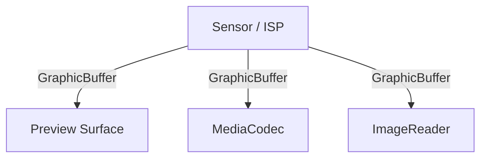
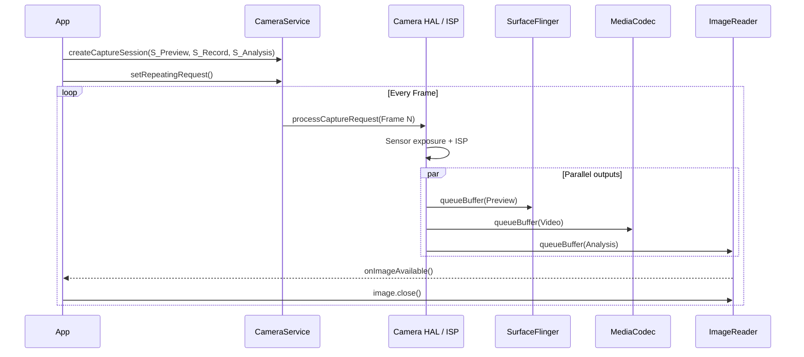

<!-- outline-start -->

**锚点（必须覆盖）：**
- Camera 的多消费者（Multi-Stream）架构
- HAL3 的 Request-Buffer 生命周期
- 三种消费路径：Preview / Recording / Analysis
- ZSL（Zero Shutter Lag）机制
- 常见掉帧场景与诊断

**扩展（可选深入）：**
- CameraCaptureSession 回调的时间戳分析
- DRM / Secure Camera Path
- SurfaceView vs TextureView 预览的性能差异

<!-- outline-end -->

## 为什么 Camera 的渲染管线与众不同

Camera 是 Android 系统里数据吞吐最高、实时性要求最严的一类管线。普通 View 渲染通常是一次输入对应一次输出，Camera 则经常把同一帧同时送给预览、录像和分析三个消费者。Sensor、ISP、Camera HAL、BufferQueue、SurfaceFlinger、MediaCodec、ImageReader 都可能成为瓶颈点。

排查 Camera 卡顿时，先分清楚问题发生在生产端、Buffer 流转阶段，还是消费端。HAL 生产慢、ImageReader 不及时归还 Buffer、Binder IPC 堵塞，三类问题在 Perfetto 里的形态不同，修复动作也不同。

## 多消费者架构



CameraService 负责资源仲裁和会话管理。App 调用 `CameraManager.openCamera()` 后，请求先到 CameraService，由它检查 camera id、客户端优先级、当前占用状态，再把请求交给 `Camera3Device`。会话建立阶段，CameraService 还要把各个输出 Surface 的尺寸、像素格式、usage flag 汇总给 HAL，决定这组输出能不能同时成立。

HAL3 / ISP 负责把 Sensor 原始数据变成可以消费的帧。ISP 完成曝光、去噪、白平衡、色彩校正后，HAL 按 `CaptureRequest` 的目标 Surface 把结果写入对应 Buffer。预览、录像、分析可以共享同一次曝光得到的图像，但它们拿到的是不同用途的输出 Buffer，而不是一块 Buffer 在多个线程里反复回拷。

`CaptureRequest` 是 Camera2 的调度单元。一次 request 同时描述这一帧的控制参数和输出目标，例如曝光时间、对焦模式、输出到哪几个 Surface。Camera HAL 处理完之后，再通过 `CaptureResult` 和 `CaptureCallback` 把帧号、时间戳和元数据交回上层。看懂 request/result 这对对象，才能把 App 提交节奏、HAL 生产节奏、消费者回收节奏串到一起。

## 完整渲染管线

### 阶段一：配置流（Configure）

App 先声明这一轮会话需要哪些输出 Surface：

```java
cameraDevice.createCaptureSession(
    Arrays.asList(previewSurface, videoSurface, analysisSurface),
    callback,
    handler
);
```

这一调用对应的不是“马上开始出帧”，而是一次流配置。Framework 会把 Preview、Recording、Analysis 三路 Surface 的尺寸、格式、usage flag 交给 `Camera3Device::configureStreamsLocked()`，HAL 决定是否支持这组组合。如果这一步失败，后续 request 再正确也不会稳定出帧。

### 阶段二：生产（Request & Produce）

稳态预览阶段，App 通常通过 `setRepeatingRequest()` 持续下发同一组 request。HAL 收到 request 后驱动 Sensor 曝光，ISP 完成图像处理，再把结果写入对应输出 Buffer。对预览和录像场景，主路径通常保持在 GraphicBuffer 内流转，CPU 不直接搬运像素数据。

### 阶段三：消费（Preview / Recording / Analysis）

**Preview** 路径面向低延迟显示。`SurfaceView` 预览一般是 HAL → BufferQueue → SurfaceFlinger → HWC → Display，少一次 GPU 采样，延迟最低。`TextureView` 预览需要先进入 `SurfaceTexture`，再由 App 进程参与一次纹理采样和合成，通常比 `SurfaceView` 多一段 GPU 工作量。

**Recording** 路径面向稳定吞吐。MediaCodec Input Surface 直接消费 GraphicBuffer，编码器拿到帧后继续压缩为 H.264/H.265。录像掉帧常见于编码器处理不过来，或者预览、录像、分析三路同时开时 Buffer 池深度不够。

**Analysis** 路径面向 CPU 或 NPU 处理。`ImageReader` 会在 `onImageAvailable()` 回调里把帧交给 App。如果 App 在回调里做同步推理、YUV 转 RGB、`ByteBuffer` 回拷，又没有尽快 `image.close()`，上游很快就会出现 Buffer 饥饿。



## ZSL（Zero Shutter Lag）

ZSL 的做法不是“按下快门后立刻现拍一张”，而是后台持续缓存最近几帧高质量 YUV 或 RAW 数据。用户按下快门时，Framework 从环形缓冲区里挑出时间戳最接近的一帧，再交给 reprocess 管线做降噪、HDR 合成和 JPEG/HEIC 编码。

这种设计把“抓帧”和“后处理”拆开了。抓帧发生在快门之前，后处理发生在快门之后，所以拍照响应看起来更快。ZSL 也会抬高内存占用和 ISP 压力，高分辨率、多帧降噪场景尤其明显。

## Request-Buffer 生命周期

| 阶段 | 触发者 | Buffer 状态 | 观察点 |
|:---|:---|:---|:---|
| Dequeue | HAL / Framework | 从 BufferQueue 取空闲 Buffer | `dequeueBuffer` 等待时间 |
| Fill | ISP / HAL | 像素数据写入中 | HAL vendor thread 活跃度 |
| Queue | HAL | Buffer 提交给 Consumer | `queueBuffer` 时间戳 |
| Acquire | Consumer | Preview / Codec / ImageReader 持有 Buffer | `BufferTX - SurfaceView`、编码线程、`onImageAvailable()` |
| Release | Consumer | Buffer 归还池中 | `image.close()`、编码完成、SF 释放 |

`CaptureCallback` 提供了把 request 节奏和结果节奏关联起来的时间戳：

| 回调 | 触发时机 | 分析用途 |
|:---|:---|:---|
| `onCaptureStarted` | Sensor 开始曝光 | 判断 request 提交到真实曝光之间的延迟 |
| `onCaptureCompleted` | 结果 metadata 就绪 | 观察 ISP + HAL 处理总耗时 |
| `onCaptureFailed` | HAL 返回失败 | 定位丢帧或不支持的输出组合 |
| `onCaptureBufferLost` | 输出 Buffer 丢失 | 判断 Buffer 管理和消费者回收是否异常 |

## 在 Perfetto 中识别 Camera 管线

排查 Camera 问题时，先看配置阶段，再看稳态帧节奏，再看 Buffer 和 IPC 压力。抓 Trace 时至少带上 `camera`、`gfx`、`view`、`binder_driver`、`dmabuf` 或等价厂商数据源。[待补充：Trace 截图]

[图：Perfetto 中 cameraserver、SurfaceFlinger、vendor camera threads、dma_buf counters 的对照截图]

第一组观察点是会话建立阶段。`cameraserver` 进程里的 `connectDevice`、`beginConfigure`、`endConfigure`、`submitRequestList` 可以判断启动慢是卡在打开设备、流配置，还是首个 request 提交。

第二组观察点是稳态预览。`cameraserver` 或 vendor camera 线程上的 `queueBuffer` 时间戳，配合 SurfaceFlinger 的 `BufferTX - SurfaceView`，可以判断帧有没有按目标节奏到屏幕。目标是“相邻帧间隔接近目标帧率的预算，并且抖动小”。如果 Camera 侧节奏稳定、SurfaceFlinger 侧不稳定，问题更像显示端或合成端。

第三组观察点是 Buffer 压力和 IPC 压力。`ImageReader` 回调间隔、`dequeueBuffer` 等待、`binder transaction` 耗时、`dma_buf` 占用变化放在一起看，能区分“上游没产出来”和“下游拿了不还”。Analysis 场景里，`onImageAvailable()` 持续堆积但 `image.close()` 归还慢，基本就是 Buffer 池被分析线程吃满了。

| 观察点 | 正常表现 | 异常表现 | 常见根因 |
|:---|:---|:---|:---|
| `connectDevice` / `beginConfigure` / `endConfigure` | 单次峰值，完成后进入稳态 | 配置阶段耗时长或反复重配 | 输出组合过重、尺寸切换频繁 |
| `queueBuffer` + `BufferTX - SurfaceView` | 帧间隔接近目标预算，抖动小 | 间隔突然拉长或成批缺帧 | HAL 生产慢、SF 合成滞后 |
| `onImageAvailable()` / `image.close()` | 回调与归还速率接近 | 回调堆积、归还延后 | Analysis 线程阻塞、YUV 回拷过多 |
| `binder transaction` / `dma_buf` | IPC 耗时短，Buffer 占用平稳 | IPC 尖峰、Buffer 常驻升高 | 参数频繁下发、Buffer 池深度不足 |

没有看到 camera slice 时，不要马上排除 Camera。很多 OEM 只保留 vendor camera 线程名、Buffer 计数器和 SurfaceFlinger 侧的 Buffer 轨迹，问题仍然可以从这些侧面信号还原出来。

## 常见性能问题

### Buffer 饥饿

根因通常是 Analysis 或 Recording 消费太慢，导致 HAL 迟迟拿不到空闲 Buffer。Perfetto 里常见的组合是 `onImageAvailable()` 回调排队、`image.close()` 归还间隔拉长、`dequeueBuffer` 等待时间上升。修复动作优先放在消费者一侧，缩短同步推理时间，减少 YUV 到 RGB 的 CPU 回拷，必要时增大 `ImageReader` 队列深度或把分析任务转到独立线程池。

### ISP Pipeline Stall

HDR、多帧降噪、夜景和高分辨率视频会直接抬高 ISP 处理时长。Perfetto 里常见现象是 `onCaptureStarted` 到 `onCaptureCompleted` 的跨度变长，`queueBuffer` 帧间隔开始抖动，录像场景下编码器也会跟着掉速。修复动作一般是降低输出分辨率、减少并发流数量、切换到更轻的拍摄模板，或者把高质量拍照和实时预览拆成两套 request 策略。

### Binder IPC 拥塞

频繁切换参数、重复下发 AF/AE/AWB 控制、预览过程中不断重配 Session，都会把 App 和 CameraService 之间的 Binder 开销放大。Perfetto 里会看到 `binder transaction` 尖峰，`submitRequestList` 不再平滑，首帧或拍照响应出现毛刺。修复动作是合并参数更新，避免每帧都改静态参数，把必须的动态控制集中到少量 request 上完成。

### CPU 回拷与内存抖动

Analysis 回调里频繁 `new byte[]`、做 YUV 平面拼接、把每帧都转成 Bitmap，会把 Camera 管线拖回 CPU 和 GC 世界。Perfetto 里常见现象是主线程或分析线程出现长片段 Java/Native 计算，`dma_buf` 之外的 App RSS 也会上涨。修复动作是直接消费 `Image.Plane` 的 `ByteBuffer`，能走 GPU 或 NDK 的路径就不要先回拷到 Java Heap，再把生命周期控制在单帧范围内。

## 版本演进

| 阶段 | 主要变化 | 对性能分析的影响 |
|:---|:---|:---|
| Camera1 / HAL1（Android 4.x 及更早） | 参数是全局状态，预览和拍照路径耦合更紧 | 预览切拍照的重配置成本高，CPU 回调更常见 |
| Camera2 / HAL3（Android 5.0+） | 引入 `CaptureRequest`、多输出 Surface、reprocess / ZSL | 预览、录像、分析三路可以并行，性能问题开始集中到 Buffer 管理和 request 节奏 |
| Logical multi-camera（Android 9） | 同一逻辑 camera id 下组合多个物理 Camera | 变焦、广角切换的切流成本下降，输出组合复杂度上升 |
| HAL 3.5 buffer management（Android 10+） | `requestStreamBuffers()` / `returnStreamBuffers()` 让 Framework 和 HAL 更细粒度地管理输出 Buffer | 多流并发时更容易定位是 HAL 持有 Buffer 过久，还是 Framework 池深度不足 |
| CameraX（Jetpack，API 21+） | 用 `Preview`、`ImageCapture`、`ImageAnalysis`、`VideoCapture` 封装 Camera2 | 底层数据路径仍是 Camera2 + HAL3，收益主要来自生命周期管理、输出组合协商和默认配置更稳 |

CameraX 不是新的底层渲染路径。它把 Camera2 常见的会话管理错误和生命周期错误收敛掉了，能减少“配置没错但输出组合很差”的问题。真正的像素生产、Buffer 流转、Surface 合成仍然落在 Camera2 / HAL3 这条管线上。

## 与其他章节的关系

- **2.15 DMA-BUF、Gralloc 与跨进程图形内存共享**：Camera 零拷贝输出的底层内存模型。
- **14.9 Android Camera 性能与 Perfetto 分析**：Camera Trace 抓取、SQL 和自动化分析方法。
- **18.6 SurfaceView**：Preview 走直出模式时的低延迟显示路径。

## 参考资料

- Android Developers, Camera2 概览: https://developer.android.com/media/camera/camera2
- Android Developers, CameraX 概览: https://developer.android.com/media/camera/camerax
- AOSP `android-16.0.0_r1` `frameworks/av/services/camera/libcameraservice/CameraService.cpp`：`CameraService::connect()`、`CameraService::connectHelper()`
- AOSP `android-16.0.0_r1` `frameworks/av/services/camera/libcameraservice/device3/Camera3Device.cpp`：`Camera3Device::configureStreamsLocked()`、`Camera3Device::RequestThread::threadLoop()`
- AOSP `android-16.0.0_r1` `hardware/interfaces/camera/device/3.5/ICameraDeviceSession.hal`：`processCaptureRequest()`、`requestStreamBuffers()`、`returnStreamBuffers()`
- AOSP `android-16.0.0_r1` `frameworks/base/core/java/android/hardware/camera2/CameraDevice.java`：`createCaptureSession()`；`CameraCaptureSession.java`：`setRepeatingRequest()`
