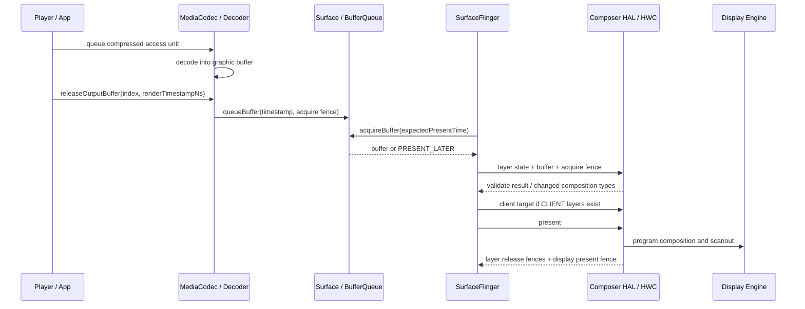

# 18.15 Android 17 视频叠加与 HWC

## SurfaceView 只提供 Overlay 候选条件

这里的 Overlay 指显示硬件直接参与某个 Layer 的合成，视频像素无须先由 RenderEngine/GPU 采样进 client target。“使用 `SurfaceView`，视频就会走 Overlay 并绕过 GPU”的说法漏掉了逐帧协商这一条件。`SurfaceView` 会为视频保留独立的 SurfaceFlinger Layer（合成单元），让 HWC（Hardware Composer，硬件合成器 HAL）有机会把它判为 `DEVICE`。最终是否采用显示硬件合成，要等 SurfaceFlinger 把当前帧的完整 Layer 栈交给 HWC 后才能确定。视频格式、缩放、旋转、HDR、受保护属性、叠加 UI、可用 plane 数量和显示带宽都会影响这一帧的选择；plane 是显示硬件可独立读取、缩放或混合一路图像的资源。

因此要分开回答四个问题：

| 问题 | 谁决定 | 能从哪里确认 |
| --- | --- | --- |
| 解码器把帧输出到哪里 | MediaCodec / Codec2 / 厂商解码器 | codec 配置、media trace |
| 视频是否保留为独立 Layer | `SurfaceView`、`TextureView` 或自定义渲染结构 | SurfaceFlinger layer trace |
| 该 Layer 由 GPU 还是显示硬件合成 | SurfaceFlinger 与 Composer HAL 逐帧协商 | HWC composition type |
| 帧何时可读、何时送显、何时可复用 | BufferQueue、fence、HWC 和显示驱动 | Perfetto、fence、驱动 trace |

本文的平台源码版本是 Android 17 / API 37 / `android-17.0.0_r1`，内核版本是 `android17-6.18-2026-06_r6`。Codec、DRM、Composer HAL 和显示驱动通常包含设备定制；分析具体设备时，还要记录系统 build fingerprint、codec 名称、DRM 安全级别和 Composer HAL 版本。

## 普通 Surface 视频的一帧怎样到达屏幕

下面这张图展示非 tunneled 播放的时序。该路径由 App 按帧释放 codec 输出，再通过普通 BufferQueue 交给 SurfaceFlinger：



图中的 access unit 是一份送入 decoder 的压缩数据单元，scanout 则是显示引擎按扫描时序读取最终画面的过程。调用 `releaseOutputBuffer(index, renderTimestampNs)` 时，App 放弃对该输出 buffer 的控制，并要求 codec 按给定时间将它渲染到 Surface；调用返回不代表这一帧已经显示。Android 17 的 `MediaCodec.java` 仍将这个重载的时间戳定义为纳秒，后续能否按时 latch、合成和 scanout，还要继续检查 BufferQueue、SurfaceFlinger 与 HWC。

### 时间戳决定“希望何时显示”

Android 17 的 `BufferQueueProducer.cpp` 会在 `queueBuffer()` 路径把 requested present timestamp（生产者期望的显示时间）写入 `BufferItem::mTimestamp`。消费端 `BufferQueueConsumer::acquireBuffer(expectedPresent, ...)` 会将它与当前目标 present time 比较：

- 队首帧距离目标显示时间还太早时，返回 `PRESENT_LATER`，SurfaceFlinger 暂不 acquire；
- 队列中存在更合时的后续帧时，旧帧可能被丢弃；
- 时间戳明显不合理或距离目标时间过远时，代码会进入保护分支，避免错误时间戳长期卡住队列。

requested present timestamp 只表达期望时间，不是显示完成凭据。codec 产出 buffer、SurfaceFlinger latch 该 buffer、显示硬件完成 present 分属不同阶段；定位视频卡顿时，只看到 `releaseOutputBuffer()` 正常返回远远不够。

### 三类 fence 不要混为一谈

| fence | 保护的依赖 | 信号后的含义 |
| --- | --- | --- |
| Layer acquire fence | 生产者写 buffer → HWC 或 GPU 读取 | 消费者可以安全读取该 Layer buffer |
| Layer release fence | HWC 读取 Layer → buffer 回到生产者 | 本次显示使用已结束，该 buffer 才可安全复用 |
| Display present fence | 本次显示提交 → 显示硬件完成相应工作 | 表示整帧 present 的完成边界；是否可当作精确上屏时刻还受 `PRESENT_FENCE_IS_NOT_RELIABLE` 能力影响 |

acquire 与 release 的名称描述某次 buffer 所有权交接的两端；离开具体交接关系，单看名称无法确定等待发生在 codec、GPU 还是显示端。Android 的 fence 最终由内核 `dma_fence` 表示，跨进程 fd 封装由 `sync_file` 提供。`PRESENT_FENCE_IS_NOT_RELIABLE` 则表示设备声明 present fence 不适合用作精确显示时刻。排查时无须记忆 fd 编号，应沿生产者、SurfaceFlinger、Composer HAL、显示驱动逐段确认等待关系，否则很容易把解码慢、排队晚、fence 晚和显示提交晚都归为“视频掉帧”。

## SurfaceView、TextureView 与自定义 GPU 路径

### SurfaceView：保留独立的合成单元

`SurfaceView` 的 buffer 进入独立的 SurfaceFlinger Layer。即使 App Window 没有重绘，视频 Layer 也可以按自己的帧率更新。这个结构让 HWC 能单独检查视频 Layer 的 YUV 格式、dataspace（色彩与传递特征描述）、crop、transform、alpha、保护属性和目标区域。

如果 HWC 接受它为 `DEVICE`，RenderEngine 就无须采样这个视频 Layer。屏幕上仍可能同时存在 GPU 生成的 client target，即 RenderEngine 将一个或多个 `CLIENT` Layer 预先合成得到的整块图像，例如 App UI 或复杂特效。因此，`DEVICE` 只说明视频 Layer 由设备侧合成，不能据此认定整帧没有 GPU 工作。

### TextureView：视频先成为 App 渲染输入

`TextureView` 通过 `SurfaceTexture` 把视频帧作为纹理交给 App，HWUI 或自定义 GL 渲染再将它画入 App Window buffer。到达 SurfaceFlinger 时，视频像素通常已经与 App UI 合并在同一个 Layer 中，HWC 无法再把其中的“视频部分”单独分配给硬件 plane。

这条路径适合任意几何变换、透明度、圆角、模糊以及与 UI 紧密混合的场景，代价是每帧增加 GPU 采样和 App Window 写回。是否值得采用，需要比较同一设备、亮度、分辨率和刷新率下的测量结果。

Android 17 的宿主链从 `SurfaceTexture.OnFrameAvailableListener` 进入 `TextureView.updateLayer()` / `invalidate()`；绘制同步后，RenderThread 侧的 `DeferredLayerUpdater::apply()` 调用 `ASurfaceTexture_dequeueBuffer()`，获取最新 `AHardwareBuffer` 并更新 HWUI layer。Codec buffer 已经可读，只能说明 TextureView 有新纹理可取；宿主 traversal（View 树遍历）、RenderThread 或 App Window 提交迟到，最终画面仍会沿用旧帧。

### 自定义 GL / Vulkan：看输出 Surface，不看 API 名字

自定义渲染有两种常见结构：

- codec 输出到 `SurfaceTexture`，GL/Vulkan 采样后画进 App Window：视频属于 GPU 路径；
- App 把内容画到独立 `SurfaceView` 或其他独立 Surface：该输出仍可作为独立 Layer 参与 HWC 协商。

“使用 Vulkan”或“使用 OpenGL ES”本身不能推出 `CLIENT` 或 `DEVICE`。判断依据是最终内容提交到哪个 Surface，以及该 Surface 在 SurfaceFlinger 中形成了怎样的 Layer。

## HWC 负责什么

HWC 位于 SurfaceFlinger 与设备显示实现之间。它根据当前帧的 Layer 栈和硬件能力提出合成方案，并在存在 GPU 合成内容时接收 SurfaceFlinger 的 client target。AIDL Composer3 的 `Composition.aidl` 定义了三种与视频密切相关的 composition type：

| Composition | Android 17 的接口语义 | 对视频排查的含义 |
| --- | --- | --- |
| `CLIENT` | SurfaceFlinger 的 RenderEngine 把该 Layer 画入 client target，再通过 `setClientTarget()` 交给设备 | 该视频 Layer 参与 RenderEngine/GPU 合成 |
| `DEVICE` | 设备用 hardware overlay 或类似方式处理该 Layer | 该视频 Layer 不由 RenderEngine 采样；具体硬件结构仍由设备决定 |
| `SIDEBAND` | 设备负责 Layer 合成、buffer 更新和内容同步，要求 `SIDEBAND_STREAM` 能力 | 常见于 tunneled playback，通过 sideband handle 关联设备侧流，不走普通逐帧 BufferQueue 更新 |

`DEVICE` 只界定该 Layer 的合成职责，不承诺“一层对应一个物理 plane”，也不承诺固定功耗收益。Composer HAL 不向 framework 暴露具体硬件映射；plane 分配、DPU（Display Processing Unit，显示处理单元）block、色彩单元和带宽策略都属于设备实现。

### Mixed composition 是常态

一帧可以同时包含：

- 视频 Layer：`DEVICE`；
- App UI、模糊背景或复杂圆角：一个或多个 `CLIENT`；
- GPU 合成这些 `CLIENT` Layer 得到的 client target：再交回 HWC；
- HWC 把 client target 与 `DEVICE` Layer 一起提交给显示硬件。

因此，Perfetto 中出现 GPU 工作不足以证明视频 Overlay 失败。还要确认 GPU 正在处理哪些 Layer，并查看视频 Layer 自己的 `hwc_composition_type`。

## SurfaceFlinger 怎样做每帧协商

validate 是 SurfaceFlinger 与 HWC 对本帧合成分工的确认过程。非 skip-validate 路径可以分为以下几步：

1. SurfaceFlinger 收集本帧可见 Layer，准备 buffer、几何、dataspace、transform、blend mode、可见区域和 acquire fence。
2. CompositionEngine 把 Layer 状态写给 Composer HAL，并请求 validate，询问当前方案是否能由设备执行。
3. HWC 通过 changed composition types 返回需要调整的 Layer 类型。SurfaceFlinger 接受变更后，才能确定哪些 Layer 要改为 `CLIENT`。
4. 如果存在 `CLIENT` Layer，RenderEngine 生成 client target，SurfaceFlinger 用 `setClientTarget()` 把它交给 HWC。
5. HWC 接收 `DEVICE` Layer、client target 和相关 fence，完成 present，并返回 release fence 与 present fence。

Overlay 因此属于逐帧决策。即使上一帧的视频 Layer 是 `DEVICE`，新出现的字幕、画中画、颜色变换、旋转或 plane 竞争，也可能让下一帧改为 `CLIENT`。

### Android 17 的 `presentOrValidate()` 快路径

在 Android 17 的 `HWComposer::getDeviceCompositionChanges()` 中，设备声明 capability 并不会让 `canSkipValidate` 自动成立。framework 还会检查两个前置条件：

- 本帧当前不能已经需要 client composition；
- 若存在 `earliestPresentTime`，当前 steady clock（单调递增的稳定时钟）必须到达该时间；如果 Composer 支持 expected present time，framework 可以把期望时间交给 Composer，因而不必在这里等待。

条件满足后，SurfaceFlinger 调用 `presentOrValidate()`。返回 `PresentSucceeded` 表示这次调用已经完成 present 阶段，framework 会直接保存 release fence 和 present fence，随后不能再按固定流程额外调用一次 `presentDisplay()`。若返回 validate 结果，framework 仍要处理 changed types，并在需要时执行 client composition。

Composer3 AIDL 已将 `Capability.SKIP_VALIDATE` 标记为 deprecated，并注明该行为默认可用。这里的“默认可用”只说明接口不再依赖显式 capability 位，不能解释某台设备的快路径命中率；实际命中仍取决于帧状态、时序与 HAL 返回结果。

## Overlay 为什么会回退

HWC 的可用能力由 SoC 显示模块、Composer HAL、显示模式和当前 Layer 栈共同决定。下表列出的是排查维度，不应写成跨设备规则：

| 维度 | 典型约束 | 建议观察 |
| --- | --- | --- |
| Plane 资源 | 可用 plane 数量，以及每个 plane 支持的格式与 z-order（前后层级）有限 | 新增浮层前后 composition type 是否改变 |
| buffer 格式 | YUV/RGBA、位深、压缩 modifier、stride 可能超出显示硬件能力；modifier 描述特定的压缩或内存布局 | pixel format、dataspace、gralloc usage |
| 几何变换 | 过大的缩放比例、旋转、复杂 crop 可能不受支持 | source crop、display frame、transform |
| 混合效果 | per-pixel alpha、圆角、阴影、模糊和复杂遮挡会增加限制 | blend mode、alpha、corner radius、background blur |
| HDR 与颜色处理 | tone mapping（色调映射）、HDR/SDR 混合、颜色变换可能占用专用 block | dataspace、HDR metadata、color transform |
| 受保护路径 | 安全 plane、protected client target 或目标 display 的安全能力不匹配 | protected usage、secure Layer、DRM/HDCP 状态 |
| 多显示器 | 内屏、外接屏和虚拟显示的合成能力不同 | display id、输出模式、镜像或录屏状态 |
| 带宽与刷新率 | 高分辨率、高刷新率、多路视频会增加读带宽 | display mode、视频尺寸、同时更新的 Layer |

不要用“设置了 alpha 就一定回退”这类说法编写业务判断。更可靠的做法是设计 A/B 场景，每次只改变一个变量，并连续采集 SurfaceFlinger layer trace、GPU counters、显示频率和功耗。

### GPU、DEVICE 与 SIDEBAND 的通路对比

| 路径 | 逐帧像素经过 App / SF 的方式 | 视频 Layer 是否由 RenderEngine 采样 | 适用能力 | 代价与边界 |
| --- | --- | --- | --- | --- |
| `TextureView` / GPU | 视频成为 App 纹理，写入 App Window buffer | 是 | 复杂变换和特效 | 多一次采样与写回；视频不再是独立 HWC Layer |
| `SurfaceView` + `DEVICE` | 普通 BufferQueue，SurfaceFlinger 逐帧 latch | 否 | 设备接受该 Layer 的硬件合成 | 仍有 SF/HWC/fence 工作，也可能存在其他 GPU client composition |
| Tunneled + `SIDEBAND` | sideband handle；视频更新与同步由设备机制处理 | 否 | codec、Audio HAL、Composer HAL 与显示链共同支持 | 可用性和格式受设备约束，GPU 特效能力受限 |

在同一台设备上，`DEVICE` 或 `SIDEBAND` 往往能减少视频相关的 GPU 采样和内存写回，但系统总功耗还包含解码、DDR、DPU、面板和背光。结论应来自受控测量，不能预设固定百分比，也不能把某个 SoC 的结果直接推广到其他机型。

## Tunneled playback 与 SIDEBAND

Tunneled playback 把逐帧选择和 A/V 同步交给 codec、音频或 tuner 时钟以及设备显示链。sideband handle 是 framework 传给 HWC 的不透明流句柄，由设备侧机制更新内容并维持同步；因此，sideband layer 不一定出现普通 Surface 视频那样密集的 `queueBuffer` 和 latch 事件。本节只界定它与 HWC composition type 的关系：确认 codec capability、sideband 状态、`SIDEBAND` composition 和设备时钟后，才能把缺少逐帧图形事件判断为正常路径。Codec2 配置、Media3 ABR、音视频同步和完整排障统一见 [18.21 多媒体播放管线](21-media-codec2-tunneled-media3-abr.md)。

## DRM、Secure Video 与 Overlay

本节的 DRM 指 Digital Rights Management（数字版权管理）。`FEATURE_SecurePlayback`、`DEVICE` 和 `FEATURE_TunneledPlayback` 属于不同层面的能力，不能互相替代：

- `FEATURE_SecurePlayback` 表示 codec 支持 secure playback，可参与受保护的解码路径；
- protected buffer / secure Layer 要求像素从解密、解码、分配、合成到输出端都留在允许的安全路径；
- `DEVICE` 表示 HWC 负责合成该 Layer；
- `FEATURE_TunneledPlayback` 表示 codec 支持 tunneled playback；
- `SIDEBAND` 是 tunneled 视频常用的 HWC composition type。

受保护视频通常优先使用安全硬件合成，但“受保护”不能推出“必定 DEVICE”或“必定 SIDEBAND”。Android 17 的 CompositionEngine 会查询 RenderEngine 是否支持 protected content，framework 也保留 protected client composition 路径。设备能否使用这条路径，取决于 protected EGL/GPU、gralloc、codec、Composer HAL、显示输出和 DRM 策略能否共同满足要求。

Android 17 公开的 `HardwareBuffer.USAGE_PROTECTED_CONTENT` 与 graphics common AIDL `BufferUsage.PROTECTED` 只表达 buffer 的保护用途。单凭 usage 标志无法证明 secure decoder、allocator、RenderEngine/HWC、显示输出与 HDCP 已形成完整安全链，仍要逐段核对能力和运行结果。HDCP 是外接数字显示链路上的内容保护协议。

安全路径不满足时，系统可能拒绝播放、显示黑屏、降低输出能力或禁止镜像。这些行为可能是在执行内容保护策略，不能为了恢复画面而改用可被非安全组件读取的 buffer。排查时还要查看外接显示的 HDCP 状态、secure Layer 标记和 DRM session 日志。

## 帧率匹配与 Overlay 是两条问题线

视频 Layer 已经是 `DEVICE`，仍可能出现 judder（因帧间节奏不均产生的周期性顿挫）；视频 Layer 是 `CLIENT`，也不一定掉帧。诊断时需要分开观察两条问题线：

- **合成路径**：`CLIENT`、`DEVICE` 还是 `SIDEBAND`；
- **节奏与时序**：codec 输出 PTS（Presentation Timestamp，期望呈现时间）、`releaseOutputBuffer()` 时间、BufferQueue desired present、SurfaceFlinger latch、显示刷新率和 present fence。

`Surface.setFrameRate()` 向系统声明内容帧率，供 Scheduler 选择显示模式和节奏，但不保证显示器一定切换。视频应报告内容的准确帧率，固定帧率视频可使用 `FRAME_RATE_COMPATIBILITY_FIXED_SOURCE`；暂停或结束后 Surface 仍然可见时，可传入 0 清除提示。24 fps 内容在 120 Hz 屏幕上每帧重复 5 次属于稳定 cadence（帧重复节奏），不能仅凭“屏幕提交了 120 次”认定解码器重复输出。

帧率 vote 是 Layer 向 SurfaceFlinger Scheduler 提交的帧率偏好，用于显示模式和节奏选择；它不会直接指定视频 Layer 的 `CLIENT`、`DEVICE` 或 `SIDEBAND`。刷新率与 composition type 可能在同一时段变化，仍须分别查看 Layer 状态和调度证据，才能判断因果关系。

当问题表现为周期性顿挫时，可以按时间线依次检查：

1. 输入 PTS 是否单调，是否有变帧率或不连续点；
2. codec 输出与 release 是否已经晚于目标呈现时刻；
3. BufferQueue 是否出现 `PRESENT_LATER`、丢旧帧或队列堆积；
4. SurfaceFlinger 是否在目标 VSync 前 latch；
5. HWC acquire fence、present fence 或显示驱动提交是否变晚；
6. 显示刷新率是否与内容帧率形成稳定倍频。

## 用 dumpsys 与 Perfetto 识别合成路径

### dumpsys：适合看某一时刻的快照

下面的命令用于保存 SurfaceFlinger 快照，并从中初步查找目标视频 Layer；采集前先让视频进入稳定播放状态：

```bash
adb shell dumpsys SurfaceFlinger > sf-video.txt
grep -niE 'SurfaceView|video|composition( type)?|sideband|protected' sf-video.txt
```

命令会生成完整的 `sf-video.txt`，第二行筛出的内容只用于定位，不能替代上下文。不同 Android 版本和厂商 build 的文本布局会变化。Android 17 AOSP 的 CompositionEngine dump 会输出类似 `composition` / `composition type` 的字段；不要依赖固定的 `grep -A5` 行数。应先按 Layer 名找到目标 Layer，再在对应 display 的 output-layer 状态中核对 `DEVICE`、`CLIENT` 或 `SIDEBAND`。

`dumpsys` 只能代表采集瞬间。播放控制条刚消失、字幕刚更新或显示模式正在切换时，结果可能与稳态不同，至少要采集两组状态：

- 无浮层的稳态播放；
- 控制条、字幕、圆角或 PiP 出现时。

### Perfetto：适合看 composition type 是否随时间变化

下面的命令用于采集 15 秒系统 trace，包含 SurfaceFlinger、图形、调度和频率信息：

```bash
adb shell perfetto \
  -o /data/misc/perfetto-traces/video-hwc.perfetto-trace \
  -t 15s -b 128mb \
  gfx view sched freq idle binder_driver
adb pull /data/misc/perfetto-traces/video-hwc.perfetto-trace
```

命令先把 trace 写入设备，再通过 `adb pull` 取回本机。导入 Perfetto 后，沿目标视频 Layer 检查：

- Layer 快照中的 `hwc_composition_type`；Android 17 的 `Layer.cpp` 会把它写入 Perfetto proto；
- 视频 Layer 的 buffer 更新、期望显示时间与 latch；
- SurfaceFlinger 的 commit/composite/present 活动；
- RenderEngine/GPU 工作是否只在浮层出现时增加；
- acquire、release、present fence 的等待是否与卡顿重合；
- CPU/GPU/DDR 或显示频率变化发生在合成切换之前还是之后，据此区分原因与结果。

判断 Overlay 的最低直接证据是目标视频 Layer 在问题区间的 composition type 为 `DEVICE`。GPU track 较空只能作为旁证，因为 GPU 还可能执行 App 渲染、其他 client composition 或无关任务；反过来，GPU 忙也不能单独证明目标视频 Layer 是 `CLIENT`。

### 一套可复现的 A/B 实验

| 实验 | 只改变什么 | 需要保持不变 | 预期能回答的问题 |
| --- | --- | --- | --- |
| A | `SurfaceView` ↔ `TextureView` | 文件、codec、亮度、刷新率、分辨率 | 独立 Layer 与 App 纹理路径的差异 |
| B | 显示/隐藏播放控制条 | 视频与显示模式 | UI 叠加是否改变 composition type |
| C | 开关圆角、alpha、旋转 | 其他 Layer 不变 | 哪种几何或混合状态触发回退 |
| D | SDR ↔ HDR 样本 | 编码复杂度尽量接近 | HDR、dataspace 或 tone mapping 是否改变路径 |

每轮同时记录 SurfaceFlinger、Perfetto、codec 名称、温度、亮度和显示模式。缺少这些控制变量时，面板亮度、热状态或刷新率切换很容易被误认为 Overlay 带来的功耗变化。

## 内核和驱动侧看什么

Android 通用内核不负责选择 `CLIENT` 或 `DEVICE`，这个决定由 SurfaceFlinger 与 Composer HAL 协商。内核提供 buffer 共享、同步和显示驱动执行机制。这里的 DRM/KMS 指内核图形子系统 Direct Rendering Manager / Kernel Mode Setting，与前文数字版权管理语境中的 DRM 含义不同：

- `dma-buf` 让 codec、GPU、DPU 等设备共享同一块图形内存；
- `dma_fence` 表示异步硬件任务之间的完成依赖；
- `sync_file` 把 fence 封装成可跨进程传递的 fd（文件描述符）；
- DRM/KMS 或厂商显示驱动把 Layer 规划转换为 plane、color pipeline 和 atomic commit。

在 `android17-6.18-2026-06_r6` 中，可从 `drivers/dma-buf/dma-buf.c`、`include/linux/dma-fence.h` 与 `drivers/dma-buf/sync_file.c` 核对这些通用机制。具体 plane 分配和显示 trace 节点由设备驱动决定；某台 Qualcomm、MediaTek、Mali 或 Exynos 设备的 debugfs 名称不能当作 Android 通用接口。

内核侧出现长时间 fence wait 时，应向上对齐同一帧并区分等待来源：

- 是 codec 写完得晚，导致 Layer acquire fence 晚；
- 是 GPU client target 晚；
- 是 HWC/显示驱动释放 Layer 晚；
- present fence 是否因可靠性能力声明而不适合作为精确上屏时间。

## HWC2.x 到 Composer3：接口变化不等于硬件升级

| 平台阶段 | Composer HAL 形态 | 分析影响 |
| --- | --- | --- |
| Android 8–12 | HIDL `android.hardware.graphics.composer@2.1` 到 `2.4` | SurfaceFlinger 与 HWC 继续按 validate / present 模型协商 |
| Android 11+ | Codec2 支持 tunneled playback 的标准配置路径 | C2 组件可返回 tunnel handle，设备仍需完整支持 |
| Android 13–17 | AIDL `android.hardware.graphics.composer3` 可供厂商实现，HIDL 版本被弃用 | 命令传输与接口演进，`CLIENT` / `DEVICE` / `SIDEBAND` 的职责仍需按源码判断 |
| Android 17 | 锚定 `android-17.0.0_r1` | `SKIP_VALIDATE` 注解为默认启用；框架仍受 `canSkipValidate` 和 `presentOrValidate()` 结果约束 |

AIDL Composer3 改变的是 framework 与 Composer HAL 之间的接口形式，不会自动增加 plane 数量，也不会让旧硬件获得新的缩放、HDR 或 protected 能力。分析具体机型时，需要分别记录 Android API 版本、Composer HAL 接口版本和 DPU 硬件代际。

## 常见误判

### “SurfaceView 已创建，所以 Overlay 一定成功”

`SurfaceView` 只为视频保留独立 Layer 和参与 HWC 协商的机会。是否成功使用 Overlay，要以目标帧的 HWC composition type 为准。

### “看到 GPU 工作，所以视频走了 CLIENT”

GPU 可能正在绘制 App UI、其他 Layer 的 client target 或应用自己的内容。应核对视频 Layer 本身的 `hwc_composition_type`。

### “releaseOutputBuffer 返回后，帧已经上屏”

它只完成 App 对 codec 输出 buffer 的释放，并为 Surface 渲染提交时间。后面还有 queue、latch、validate、fence 和 present。

### “受保护视频一定是 Overlay”

受保护描述安全约束，Overlay 描述合成职责。设备还可能支持 protected client composition，或在安全链不成立时拒绝输出。

### “SIDEBAND 就是普通 DEVICE Overlay 的新名字”

`DEVICE` 仍采用普通的逐帧 Layer buffer 更新；`SIDEBAND` 的 buffer 更新和内容同步由设备侧机制负责，两者的 trace 特征不同。

### “Skip Validate 会跳过 SurfaceFlinger”

它只优化 HWC validate/present 协商。SurfaceFlinger 仍负责 Layer 状态、帧调度和 fence；`presentOrValidate()` 也可能返回 validate 结果，要求 framework 继续完成常规协商。

## 与其他章节的关系

- [2.6 SurfaceFlinger 与合成](../../part1-fundamentals/ch02-rendering/06-surfaceflinger.md)：Layer、CompositionEngine 与显示提交的系统路径。
- [2.10 GPU 渲染深入](../../part1-fundamentals/ch02-rendering/10-gpu-rendering.md)：RenderEngine/client composition 的 GPU 侧成本。
- [18.6 SurfaceView](06-surfaceview.md)：独立 Surface、窗口层级和生命周期。
- [18.7 TextureView](07-textureview.md)：`SurfaceTexture` 采样与 App Window 合成。
- [18.21 多媒体播放管线](21-media-codec2-tunneled-media3-abr.md)：解封装、Codec2、tunneled playback 和播放策略。

## 源码核对清单

### Android 17 / API 37

- [`MediaCodec.java`](https://android.googlesource.com/platform/frameworks/base/+/refs/tags/android-17.0.0_r1/media/java/android/media/MediaCodec.java)、[`MediaCodecInfo.java`](https://android.googlesource.com/platform/frameworks/base/+/refs/tags/android-17.0.0_r1/media/java/android/media/MediaCodecInfo.java)、[`MediaFormat.java`](https://android.googlesource.com/platform/frameworks/base/+/refs/tags/android-17.0.0_r1/media/java/android/media/MediaFormat.java)：Surface 渲染、secure/tunneled capability 与同步 key。
- [`CCodec.cpp`](https://android.googlesource.com/platform/frameworks/av/+/refs/tags/android-17.0.0_r1/media/codec2/sfplugin/CCodec.cpp)、[`CCodecBufferChannel.cpp`](https://android.googlesource.com/platform/frameworks/av/+/refs/tags/android-17.0.0_r1/media/codec2/sfplugin/CCodecBufferChannel.cpp)、[`ACodec.cpp`](https://android.googlesource.com/platform/frameworks/av/+/refs/tags/android-17.0.0_r1/media/libstagefright/ACodec.cpp)：Codec2 / OMX 的 Surface output、protected buffer、tunneled mode 与 sideband handle。
- [`BufferQueueProducer.cpp`](https://android.googlesource.com/platform/frameworks/native/+/refs/tags/android-17.0.0_r1/libs/gui/BufferQueueProducer.cpp)、[`BufferQueueConsumer.cpp`](https://android.googlesource.com/platform/frameworks/native/+/refs/tags/android-17.0.0_r1/libs/gui/BufferQueueConsumer.cpp)：requested present、`expectedPresent`、丢旧帧与 `PRESENT_LATER`。
- [`TextureView.java`](https://android.googlesource.com/platform/frameworks/base/+/refs/tags/android-17.0.0_r1/core/java/android/view/TextureView.java)、[`DeferredLayerUpdater.cpp`](https://android.googlesource.com/platform/frameworks/base/+/refs/tags/android-17.0.0_r1/libs/hwui/DeferredLayerUpdater.cpp)：TextureView frame available、宿主 invalidation 与最新 buffer 获取。
- [`HWComposer.cpp`](https://android.googlesource.com/platform/frameworks/native/+/refs/tags/android-17.0.0_r1/services/surfaceflinger/DisplayHardware/HWComposer.cpp)、[`Display.cpp`](https://android.googlesource.com/platform/frameworks/native/+/refs/tags/android-17.0.0_r1/services/surfaceflinger/CompositionEngine/src/Display.cpp)、[`Output.cpp`](https://android.googlesource.com/platform/frameworks/native/+/refs/tags/android-17.0.0_r1/services/surfaceflinger/CompositionEngine/src/Output.cpp)：`canSkipValidate`、composition strategy、client target、protected composition 与 present。
- [`Layer.cpp`](https://android.googlesource.com/platform/frameworks/native/+/refs/tags/android-17.0.0_r1/services/surfaceflinger/Layer.cpp)：把 HWC composition type 写入 Layer trace proto。
- [`Composition.aidl`](https://android.googlesource.com/platform/hardware/interfaces/+/refs/tags/android-17.0.0_r1/graphics/composer/aidl/android/hardware/graphics/composer3/Composition.aidl)、[`Capability.aidl`](https://android.googlesource.com/platform/hardware/interfaces/+/refs/tags/android-17.0.0_r1/graphics/composer/aidl/android/hardware/graphics/composer3/Capability.aidl)：`CLIENT`、`DEVICE`、`SIDEBAND`、present fence 可靠性与 skip validate。
- [`HardwareBuffer.java`](https://android.googlesource.com/platform/frameworks/base/+/refs/tags/android-17.0.0_r1/core/java/android/hardware/HardwareBuffer.java)、[`BufferUsage.aidl`](https://android.googlesource.com/platform/hardware/interfaces/+/refs/tags/android-17.0.0_r1/graphics/common/aidl/android/hardware/graphics/common/BufferUsage.aidl)：protected buffer usage。

### Android 17 通用内核

- [`dma-buf.c`](https://android.googlesource.com/kernel/common/+/refs/tags/android17-6.18-2026-06_r6/drivers/dma-buf/dma-buf.c)：跨设备 buffer 共享和 attachment。
- [`dma-fence.c`](https://android.googlesource.com/kernel/common/+/refs/tags/android17-6.18-2026-06_r6/drivers/dma-buf/dma-fence.c)、[`dma-fence.h`](https://android.googlesource.com/kernel/common/+/refs/tags/android17-6.18-2026-06_r6/include/linux/dma-fence.h)：fence signal、wait 与公共同步接口。
- [`sync_file.c`](https://android.googlesource.com/kernel/common/+/refs/tags/android17-6.18-2026-06_r6/drivers/dma-buf/sync_file.c)：fence fd 封装。

### 官方说明

- [Hardware Composer HAL](https://source.android.com/docs/core/graphics/hwc)
- [Implement Hardware Composer HAL](https://source.android.com/docs/core/graphics/implement-hwc)
- [AIDL for Hardware Composer HAL](https://source.android.com/docs/core/graphics/aidl-hwc)
- [Multimedia tunneling](https://source.android.com/docs/devices/tv/multimedia-tunneling)
- [MediaCodecInfo.CodecCapabilities](https://developer.android.com/reference/android/media/MediaCodecInfo.CodecCapabilities)
- [Video frame rate](https://developer.android.com/media/optimize/performance/frame-rate)
- [Android 17 release notes](https://developer.android.com/about/versions/17/release-notes)

## 小结

- `SurfaceView` 为视频保留独立 Layer，但 Overlay 是否成立取决于每帧 HWC 决策。
- `CLIENT` Layer 由 RenderEngine 画入 client target；`DEVICE` Layer 由设备侧合成；`SIDEBAND` 还把逐帧 buffer 更新和同步交给设备侧机制。
- `releaseOutputBuffer()`、SurfaceFlinger latch 和 HWC present 分属不同阶段，时间戳与三类 fence 也要分开分析。
- protected、tunneled 与 Overlay 彼此相关，但含义和能力边界各不相同。
- `dumpsys` 适合观察快照，Perfetto 适合观察 composition type 与时序随时间变化；两类证据都要关联到目标视频 Layer。
- HWC2/HWC3 的接口代际不能替代设备能力验证，功耗结论也必须来自受控 A/B 测量。
