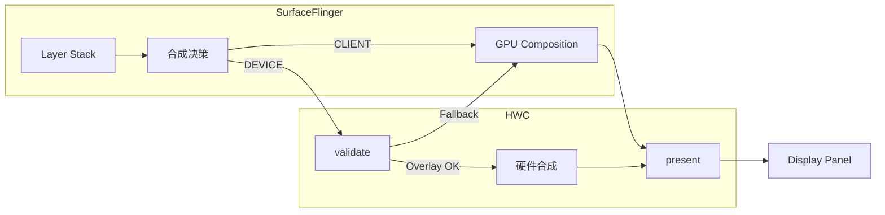
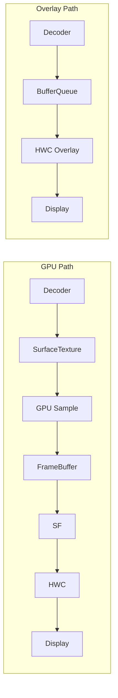

<!-- outline-start -->

**锚点（必须覆盖）：**
- HWC（Hardware Composer）的核心职责：决定哪些 Layer 走硬件合成，哪些走 GPU
- GPU Path vs Overlay Path 的链路对比
- SurfaceFlinger 的合成决策流程
- DRM / Secure Video Path 与 Overlay 的关系
- 在 dumpsys SurfaceFlinger 和 Perfetto 中识别 Overlay 模式

**扩展（可选深入）：**
- HWC 2.x / 3.x 的版本差异
- Tunnel Mode（Android TV / 高端手机）
- HWC 回退到 GPU 合成的常见触发条件

<!-- outline-end -->

## 为什么需要理解 HWC

当你用 TextureView 播放视频时，每一帧视频都要经过 GPU 采样再画到 App 的 Framebuffer 上——这意味着即使 App 没有其他 UI 更新，GPU 也得每帧工作。而如果用 SurfaceView + HWC Overlay，视频帧可以**完全绕过 GPU**，直接由显示硬件（DPU，Display Processing Unit）叠加到屏幕上。

这个差异直接体现在功耗上：GPU Path 多消耗 2-3x 的内存带宽，Overlay Path 几乎不消耗 GPU 资源。在视频播放、导航地图等长时间运行的场景下，Overlay vs GPU 合成的功耗差异可能达到 10-20%。[已验证: AOSP SurfaceFlinger / HWC 实现]

## HWC 的核心职责

HWC（Hardware Composer）是 Android 图形栈中 SurfaceFlinger 与显示硬件之间的桥梁。它的核心职责只有一件事：**告诉 SurfaceFlinger 哪些 Layer 可以走硬件合成，哪些必须走 GPU 合成**。



每次合成前，SurfaceFlinger 调用 `HWC::validate()`，把所有 Layer 的信息（位置、大小、格式、Transform）交给 HWC。HWC 检查自己的硬件能力（有多少个硬件 Plane、支持哪些格式和 Transform），然后返回每个 Layer 的合成类型：

- **HWC2::Composition::DEVICE**（Overlay）：HWC 硬件直接合成此 Layer
- **HWC2::Composition::CLIENT**（GPU）：SurfaceFlinger 需要用 GPU 合成此 Layer
- **HWC2::Composition::SIDEBAND**（Tunnel）：直接绕过 BufferQueue，数据路径完全由硬件处理

## GPU Path vs Overlay Path

### GPU Path（TextureView 路线）

```
Decoder → SurfaceTexture → GPU Shader (Sample) → FrameBuffer → SurfaceFlinger → HWC → Display
```

- GPU 需要逐像素采样视频纹理，写入 App Framebuffer
- 占用 GPU 带宽和计算资源
- 每帧都消耗内存带宽（即使是静态画面）
- **功耗高**

### Overlay Path（SurfaceView + HWC 路线）

```
Decoder → SurfaceView BufferQueue → HWC Overlay Plane → Display
```

- 视频帧直接从 BufferQueue 送入 HWC 的硬件 Plane
- GPU 完全不参与
- 只消耗 DPU 的一点点带宽
- **功耗低**



## SurfaceFlinger 的合成决策流程

SurfaceFlinger 收到所有 App 的 Transaction 后，进入合成阶段：

1. **收集所有可见 Layer**：遍历所有 Layer，裁剪不可见区域。
2. **调用 HWC::validate()**：将 Layer 信息交给 HWC。
3. **HWC 返回合成类型**：每个 Layer 标记为 DEVICE（硬件）或 CLIENT（GPU）。
4. **GPU 合成 CLIENT Layer**：如果存在 CLIENT Layer，SF 用 GPU 将它们合成到一个临时 Buffer。
5. **HWC::present()**：将所有 DEVICE Layer + GPU 合成结果交给 HWC 输出到屏幕。

### Overlay 回退的常见触发条件

HWC Overlay 不是总能成功的。以下情况会导致回退到 GPU 合成：

| 触发条件 | 说明 |
|:---|:---|
| **硬件 Plane 用完** | HWC 硬件 Plane 数量有限（通常 3-6 个），用完后只能 GPU |
| **格式不支持** | 某些 HWC 不支持 RGBA_8888 Overlay，只支持 YUV |
| **Transform 不支持** | 旋转 90°、缩放比例超出范围等 |
| **透明度混合** | `setAlpha(0.5)` 或复杂混合模式 |
| **圆角/裁剪** | 很多旧 HWC 不支持 Overlay 图层的圆角裁剪 |
| **Secure Buffer** | DRM 内容的 secure 路径限制 |

**关键性能影响**：一旦某个本应 Overlay 的 Layer 回退到 GPU 合成，不仅该 Layer 的功耗增加，还可能影响其他 Layer 的合成策略（因为 GPU 合成结果本身也需要一个 HWC Plane）。

## DRM 与 Secure Video Path

对于 Netflix、Disney+ 等受保护的高清内容（Widevine L1），视频数据经过 TrustZone 解密后落在 Secure Buffer 中。CPU 和 GPU 均无法读取 Secure Buffer（防止录屏和内存 dump），因此：

- **Overlay 是最安全的路径**：HWC/DPU 的硬件通路是唯一能显示 Secure Buffer 的路径
- **GPU Path 可能无法播放**：GPU 无法采样 Secure Buffer
- 但 Android 7.0 起支持 secure texture video playback，是否要求 Overlay 取决于内容级别和设备能力，不能一概而论

## Tunnel Mode（极致优化）

在 Android TV 和高端手机上，还存在 **Tunnel Mode（隧道模式）**：

1. **Sideband Stream**：解码器输出的 Buffer 句柄直接传给 HWC/Display，**绕过 BufferQueue 的数据路径**（SurfaceFlinger 仍参与 Layer 管理但不经手 Buffer 数据）。
2. **Audio Sync**：HWC 直接根据 Audio DSP 时钟驱动视频帧显示，实现硬件级音画同步。
3. **功耗最优**：几乎零 CPU/GPU 参与，功耗最低。

## 在 Perfetto 和 dumpsys 中识别 Overlay

### dumpsys SurfaceFlinger

```bash
adb shell dumpsys SurfaceFlinger | grep -A5 "SurfaceView"
```

关键查看项：
- **Composition Type**：`DEVICE` = Overlay 成功，`CLIENT` = 回退到 GPU
- **Type**：Layer 的 Buffer 格式

### Perfetto

| Track | 说明 |
|:---|:---|
| HWC | HWC 合成耗时 |
| SurfaceFlinger | `validate` / `present` 调用 |
| GPU | GPU 合成任务（如果存在 CLIENT Layer） |

如果 HWC Track 显示合成耗时很短且 GPU Track 没有额外合成任务，说明 Overlay 成功。如果 GPU 有合成任务且 HWC validate 后有 CLIENT Layer，说明发生了回退。

## 常见性能问题

1. **Overlay 失效导致功耗飙升**：给 SurfaceView 设置了 `setAlpha(0.5)` 或圆角，触发 GPU 回退。
2. **Z-Order 冲突**：Overlay 图层需要特定的 Z 轴位置，复杂 UI 遮挡可能破坏 Overlay 策略。
3. **Tunnel Mode 不支持所有格式**：部分 HWC 的 Tunnel Mode 对 HDR、特定分辨率有限制。

## 与其他章节的关系

- **2.6 SurfaceFlinger 与合成**：SurfaceFlinger 合成流程详解
- **2.10 GPU 渲染深入**：GPU 合成的技术细节
- **18.6 SurfaceView**：Overlay 的主要载体

## 参考资料

- AOSP `frameworks/native/services/surfaceflinger/`
- AOSP `hardware/interfaces/graphics/composer/`
- Android 官方文档：Hardware Composer
