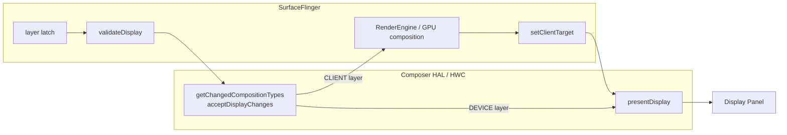
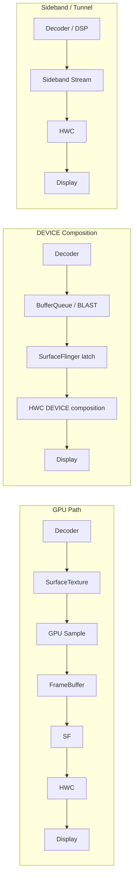

<!-- outline-start -->

**锚点（必须覆盖）：**
- HWC（Hardware Composer）的核心职责：决定哪些 Layer 走硬件合成，哪些走 GPU
- GPU Path vs Overlay Path 的链路对比
- SurfaceFlinger 的合成决策流程
- DRM / Secure Video Path 与 Overlay 的关系
- 在 dumpsys SurfaceFlinger 和 Perfetto 中识别 Overlay 模式

**扩展（可选深入）：**
- HWC 2.x / 3.x 的版本差异
- Tunnel Mode（Android TV / 高端手机）
- HWC 回退到 GPU 合成的常见触发条件

<!-- outline-end -->

## 为什么需要理解 HWC

当你用 TextureView 播放视频时，每一帧视频都要经过 GPU 采样再画到 App 的 Framebuffer 上——即使 App 没有其他 UI 更新，GPU 也得每帧工作。而如果用 SurfaceView + HWC Overlay，视频帧可以**完全绕过 GPU**，直接由显示硬件（DPU，Display Processing Unit）叠加到屏幕上。

这个差异直接体现在功耗上：GPU Path 多消耗 2-3x 的内存带宽，Overlay Path 几乎不消耗 GPU 资源。在视频播放、导航地图等长时间运行的场景下，Overlay vs GPU 合成的功耗差异可能达到 10-20%。[已验证: AOSP SurfaceFlinger / HWC 实现]

## HWC 的核心职责

HWC（Hardware Composer）是 SurfaceFlinger 与显示硬件之间的合成协商层。它回答的是两件事：这一帧哪些 Layer 可以由显示硬件直接处理，哪些 Layer 必须先交给 GPU；如果存在 `CLIENT` Layer，GPU 合成出来的 client target 应该怎样再交回显示硬件完成送显。



一帧的常见协商顺序是：

1. SurfaceFlinger 先完成 layer latch，得到本帧参与合成的 Layer 集合。
2. 通过 Composer HAL 调用 `validateDisplay()`，让 HWC 判断每个 Layer 是 `DEVICE`、`CLIENT` 还是 `SIDEBAND`。
3. 如果 HWC 改写了 Layer 的合成类型，SurfaceFlinger 再通过 `getChangedCompositionTypes()` / `acceptDisplayChanges()` 接受这轮协商结果。
4. 只要存在 `CLIENT` Layer，SurfaceFlinger 就先用 RenderEngine/GPU 合成这些 Layer，再通过 `setClientTarget()` 把 client target 交回 HWC。
5. 随后调用 `presentDisplay()`，把 `DEVICE` Layer 和 client target 一起提交给显示硬件。

文中常写的 `HWC::validate()` / `HWC::present()` 是 SurfaceFlinger 包装层里的名字。HAL 暴露的是 `validateDisplay()`、`getChangedCompositionTypes()`、`acceptDisplayChanges()`、`setClientTarget()`、`presentDisplay()`。HWC3 把接口迁到 AIDL，但这套协商流程没有变成“纯 HWC 直出”，SurfaceFlinger 仍然负责 layer latch、client composition 和 fence 协调。

HWC3 / AIDL 还引入能力声明来减少重复协商。设备声明 `Capability::SKIP_VALIDATE` 后，如果 layer 栈、buffer 属性和显示配置没有变化，SurfaceFlinger 可以跳过本帧 `validateDisplay()`，直接走 `presentDisplay()`。这只省掉“向 HWC 再确认一次”的开销，不代表 HWC 绕过 SurfaceFlinger；一旦 composition type、damage、color mode 或 fence 条件变化，下一帧仍要重新 validate。

- **HWC2::Composition::DEVICE**：该 Layer 由显示硬件直接处理，常见于视频 YUV Layer。
- **HWC2::Composition::CLIENT**：该 Layer 先由 SurfaceFlinger / GPU 合成，再作为 client target 交回 HWC。
- **HWC2::Composition::SIDEBAND**：数据不走普通 BufferQueue buffer，更接近 sideband / tunneled playback 这类可选能力。

## GPU Path vs Overlay Path

### GPU Path（TextureView 路线）

```
Decoder → SurfaceTexture → GPU Shader (Sample) → FrameBuffer → SurfaceFlinger → HWC → Display
```

- GPU 需要逐像素采样视频纹理，写入 App Framebuffer
- 占用 GPU 带宽和计算资源
- 每帧都消耗内存带宽（即使是静态画面）
- **功耗高**

### Overlay Path（SurfaceView + DEVICE composition）

```
Decoder → BufferQueue / BLASTBufferQueue → SurfaceFlinger layer latch → HWC DEVICE composition → Display
```

- Decoder 仍然把帧写入 Surface 对应的队列，常见实现是 BufferQueue 或 BLASTBufferQueue
- SurfaceFlinger 仍然要 latch 这层 buffer，并把它带进本帧的合成规划
- 如果 HWC 把该 Layer 判成 `DEVICE`，视频像素不会再经过 GPU 采样，但 SurfaceFlinger 和 HWC 仍然要一起完成时序、fence 和送显协调
- **功耗低**

### Sideband / tunneled playback（可选能力）

```
Decoder / Video Pipeline → Sideband Stream / Tunnel → HWC / Display
```

- 这不是普通 SurfaceView 视频播放的默认数据路径
- SurfaceFlinger 仍然参与 Layer 管理和时序协调，但不经手普通 BufferQueue 中的像素 buffer
- 更常见于 Android TV 或特定 SoC 的低功耗视频播放场景

#### 启用方式与 trace 特征

App 侧的启用入口是 `MediaCodec` 的 Tunneled Playback 能力（Android 5.0 / API 21+）：

- 通过 `MediaFormat.KEY_AUDIO_SESSION_ID` + `MediaCodecInfo.CodecCapabilities.FEATURE_TunneledPlayback` 启用；
- 启用后**解码帧不经过 App BufferQueue**——解码器输出作为 sideband stream，由 SurfaceFlinger 交给 HWC 的 sideband layer（`HWC2::Composition::SIDEBAND`）；
- A/V 同步与显示时序由 HAL + HWC 在硬件通路里完成，App 和 SurfaceFlinger 不再做 per-frame 工作。

**Trace 上的典型特征**：App 侧看起来"什么都没做"却画面流畅。看不到 `dequeueBuffer` / `queueBuffer` 的高频跳动，也看不到 `latchBuffer` 对该 layer 的逐帧动作——这是 Tunneled 路径的正常现象，不是 trace 不完整。问题要到 HAL / HWC 层面才能定位。

**强依赖条件**：是否能走 Tunneled，取决于 codec / Audio HAL / HWC 是否同时支持。普通手机上常见的视频播放仍以非 Tunneled 路径（DEVICE composition overlay）为主；Tunneled 主要见于 Android TV、机顶盒、部分高端 SoC 的低功耗视频播放场景。

[已验证: Android Developers `MediaCodecInfo.CodecCapabilities.FEATURE_TunneledPlayback` + `MediaFormat.KEY_AUDIO_SESSION_ID` API 21+]



## SurfaceFlinger 的合成决策流程

SurfaceFlinger 收到本帧 Transaction 后，合成流程一般是：

1. **layer latch**：收集本帧可见 Layer，更新几何信息、裁剪区域和 acquire fence。
2. **`validateDisplay()`**：把 Layer 栈交给 HWC，让它返回本轮 `DEVICE` / `CLIENT` / `SIDEBAND` 决策。
3. **`getChangedCompositionTypes()` / `acceptDisplayChanges()`**：如果 HWC 改写了某些 Layer 的合成类型，SurfaceFlinger 先接受这轮变更。
4. **GPU 合成 client target**：只对 `CLIENT` Layer 做 GPU 合成。这个结果是 client target buffer，不直接上屏。
5. **`setClientTarget()`**：把 client target 交回 HWC，让 HWC 把它和仍保留为 `DEVICE` 的 Layer 一起完成最终合成。
6. **`presentDisplay()`**：提交本帧到 display。

Mixed composition 的重点就在这里：`CLIENT` 和 `DEVICE` 可以同时存在。GPU 不会接管整帧，只负责 HWC 接不住的那部分 Layer。

### Overlay 回退的常见原因（能力依赖平台）

HWC 是否接受某个 Layer，取决于 SoC、DPU plane 数量、HWC HAL 代际和厂商实现。下面这些条件经常触发回退，但它们都不是绝对规则。

| 常见原因 | 为什么容易回退 |
|:---|:---|
| **硬件 Plane 用完** | 视频层、System UI、client target 可能同时抢同一批 plane，plane 数量不足时只能把一部分 Layer 改成 `CLIENT` |
| **格式与颜色能力不匹配** | YUV 往往最容易走 `DEVICE`，RGBA、10-bit HDR、特定色域组合则更依赖平台能力 |
| **Crop / scale / rotation 超出范围** | 大比例缩放、90°/270° 旋转、复杂裁剪都可能超出 DPU 的限制 |
| **Alpha / 圆角 / 模糊 / 复杂混合** | 这类效果需要额外的 blending 或 post-process，很多平台会直接回退到 GPU |
| **受保护内容与当前安全路径不匹配** | 设备如果没有可用的 secure plane 或 protected GPU path，就只能换到别的受支持路径 |
| **多层 UI 叠加在视频上方** | 浮层、字幕、动画控件会改变 HWC 的 composition budget，视频层原本能走 `DEVICE`，叠加后可能改判为 `CLIENT` |

**性能影响**：一个视频 Layer 从 `DEVICE` 回退到 `CLIENT` 后，GPU 带宽和 client target 开销会上来，还可能挤掉别的 plane，让更多 Layer 一起回退。

### 常见能力对照表

| 能力维度 | HWC2.x / 常见旧平台 | HWC3 / 较新平台常见情况 | 结论 |
|:---|:---|:---|:---|
| **YUV 视频 Layer** | 常见支持 1-2 路 `DEVICE` composition | 仍然是最容易走 `DEVICE` 的类型 | 视频 YUV Layer 通常是 Overlay 首选 |
| **RGBA / UI Layer** | 简单不透明场景有时能上 plane，复杂 blending 经常回退 | 部分平台支持更多 RGBA plane，但接口升级不保证能力升级 | 不能把“RGBA 一定 GPU”写成通用规则 |
| **Plane alpha / rounded corner** | per-layer alpha、圆角、阴影常受限 | 一些新平台支持更强，但仍经常回退 | 半透明和圆角是高频触发点 |
| **Crop / scale / rotation** | 支持范围因 DPU 而异，90°/270° 更敏感 | 约束仍在，只是范围通常更宽 | 大变换先怀疑 plane 能力不足 |
| **HDR / protected content** | 依赖 secure plane、vendor 扩展或受保护 GPU 路径 | 新平台更常见 protected texture / secure GPU path | protected 不等于 tunneled，Overlay 也不是唯一答案 |

## 受保护内容、Overlay 与 Tunnel 的关系

这三个概念经常一起出现，但它们不是同一层东西。

### 1. 标准 Overlay / DEVICE composition

这是普通 SurfaceView 视频播放最常见的低功耗路径。视频 buffer 仍然经由 BufferQueue / SurfaceFlinger 进入本帧合成，只是 HWC 最终把该 Layer 标成 `DEVICE`，像素不再经过 GPU 采样。

### 2. Protected texture / secure GPU path

受保护内容不等于“GPU 一定不能碰”。从 Android 7.0 开始，设备如果支持 `EGL_EXT_protected_content`、`GL_EXT_protected_textures` 等扩展，就可以建立 protected GL/EGL path，用于 secure texture video playback。能不能走这条路径，取决于 codec、gralloc、GPU 驱动和内容安全级别；很多设备仍然把 Overlay 当作更稳妥的首选。

### 3. Tunneled playback / sideband

Tunnel / sideband 是更窄的可选能力，常见于 Android TV 或特定高端 SoC。它的目标是把解码、音画同步和显示尽量留在硬件通路里，进一步减少 CPU/GPU 参与。它不是所有受保护视频都会自动进入的默认模式，也不是普通 App 可以假定一定存在的能力。

## 在 Perfetto 和 dumpsys 中识别 Overlay

### dumpsys SurfaceFlinger

```bash
adb shell dumpsys SurfaceFlinger | grep -A5 "SurfaceView"
```

关键查看项：
- **Composition Type**：`DEVICE` = Overlay 成功，`CLIENT` = 回退到 GPU
- **Type**：Layer 的 Buffer 格式

### Perfetto

| Track | 说明 |
|:---|:---|
| HWC | HWC 合成耗时 |
| SurfaceFlinger | `validateDisplay` / `setClientTarget` / `presentDisplay` 对应的包装调用 |
| GPU | GPU 合成任务（如果存在 CLIENT Layer） |

如果 HWC Track 显示合成耗时很短且 GPU Track 没有额外合成任务，说明 Overlay 成功。如果 GPU 有合成任务且 HWC validate 后有 CLIENT Layer，说明发生了回退。

## 常见性能问题

1. **Overlay 失效导致功耗飙升**：给 SurfaceView 设置了 `setAlpha(0.5)` 或圆角，触发 GPU 回退。
2. **Z-Order 冲突**：Overlay 图层需要特定的 Z 轴位置，复杂 UI 遮挡可能破坏 Overlay 策略。
3. **Tunnel Mode 不支持所有格式**：部分 HWC 的 Tunnel Mode 对 HDR、特定分辨率有限制。

## 与其他章节的关系

- **2.6 SurfaceFlinger 与合成**：SurfaceFlinger 合成流程详解
- **2.10 GPU 渲染深入**：GPU 合成的技术细节
- **18.6 SurfaceView**：Overlay 的主要载体

## 参考资料

- AOSP `frameworks/native/services/surfaceflinger/DisplayHardware/HWComposer.cpp` — `canSkipValidate` / `presentOrValidate()` 条件与回退逻辑
- AOSP `frameworks/native/services/surfaceflinger/DisplayHardware/HWC2.h`
- AOSP `frameworks/native/services/surfaceflinger/DisplayHardware/ComposerHal.cpp`
- AOSP `hardware/libhardware/include/hardware/hwcomposer2.h`（android-8.0.0_r1 / android-14.0.0_r1）— `HWC2_CAPABILITY_SKIP_VALIDATE`
- AOSP `hardware/interfaces/graphics/composer/2.4/`
- AOSP `hardware/interfaces/graphics/composer/aidl/` — `Capability.aidl` SKIP_VALIDATE @deprecated
- AOSP `frameworks/native/services/surfaceflinger/`
- Android 官方文档：Hardware Composer
- Android 官方文档：`SurfaceView`（Android N 起位置同步更新，叠加 View 的行为边界）
