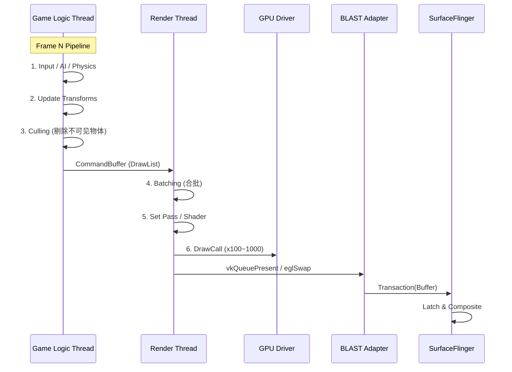
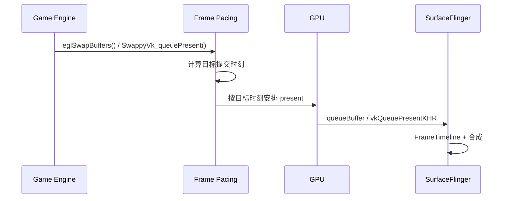

<!-- outline-start -->

**锚点（必须覆盖）：**
- 游戏引擎的 Game Loop 模型（与 App 事件驱动的区别）
- 多线程架构：Logic Thread / Render Thread / Worker Threads
- Unity 和 Unreal 的典型线程模型与 Trace 特征
- Swappy Frame Pacing 的原理与作用
- 游戏引擎普遍使用 SurfaceView + BLAST
- ADPF / Frame Rate / Game Mode 三组系统调优 API

**扩展（可选深入）：**
- DrawCall 合批（Batching）与 GPU 性能
- 常见游戏性能问题的诊断思路

<!-- outline-end -->

## 为什么游戏引擎的渲染链路不同于普通 App

普通 App 的渲染是事件驱动的——用户操作触发 `invalidate()`，Choreographer 在 VSync 时回调 `doFrame()`，UI 线程执行 Measure/Layout/Draw。但游戏引擎不是这样工作的：它有一个**自主运行的 Game Loop**，不管有没有用户输入，都会按照固定节奏持续更新和渲染。

游戏引擎渲染链路面临一个普通 App 不存在的问题：**如何让游戏逻辑帧率与屏幕刷新率同步**。跑 40fps 的游戏在 60Hz 屏幕上如果不做帧节奏控制，会导致部分帧显示 16ms、部分显示 33ms，视觉抖动非常明显。[已验证: Android Game SDK 文档]

## Game Loop 模型

游戏引擎通常采用双线程或三线程架构：



关键阶段：

1. **Logic Thread**：运行 C#/Lua/C++ 脚本，处理物理模拟、AI、输入、动画。产物是 DrawCall List（渲染指令列表）。
2. **Render Thread**：接收 DrawList，执行 Batching（合批减少 DrawCall），设置 Shader/Texture，提交 GPU 指令。
3. **GPU**：执行渲染指令，将结果写入 Back Buffer。
4. **Present**：通过 `eglSwapBuffers`（GLES）或 `vkQueuePresentKHR`（Vulkan）提交给 SurfaceFlinger。

## Unity 与 Unreal 的线程模型

### Unity

| 线程 | 职责 | Trace 标签 |
|:---|:---|:---|
| **UnityMain / Main** | C# 脚本，Update/LateUpdate，物理模拟 | `PlayerLoop`, `Physics.FixedUpdate` |
| **UnityGfx / Gfx** | 渲染命令提交，Batching，GPU 调度 | `Gfx.WaitForPresent`, `RenderThread` |
| **UnityJobWorker** | 多线程任务，Burst 编译任务 | `JobSystem`, `ParallelFor` |

### Unreal

| 线程 | 职责 | Trace 标签 |
|:---|:---|:---|
| **GameThread** | C++ 游戏逻辑 | `GameThread::Tick` |
| **RenderThread** | 渲染指令生成和提交 | `FRenderingThread` |
| **RHIThread** | 底层图形 API 调用（GLES/Vulkan） | `FRHICommandList::Execute` |

Unity 和 Unreal 都采用了**逻辑线程与渲染线程分离**的架构。逻辑线程产出 DrawList 后交给渲染线程，两者可以流水线化并行——逻辑线程在计算第 N+1 帧的同时，渲染线程在渲染第 N 帧。

## SurfaceView + BLAST

游戏引擎通常把画面输出到 `SurfaceView`，或 `GameActivity` 暴露的 `ANativeWindow`。共同点很稳定：游戏 Surface 独立于 App View 树，提交路径绕开 App RenderThread，SurfaceFlinger 直接消费游戏帧。

- **Android 5-10**：常见路径是 `eglSwapBuffers` / `vkQueuePresentKHR` → `BufferQueue` → `SurfaceFlinger` → `HWC`。窗口尺寸和位置变化仍按旧版 SurfaceView 机制处理，排查 resize 闪烁、几何不同步时要按 [18.6 SurfaceView 章节](06-surfaceview.md) 里的 pre-BLAST 路径去看。
- **Android 11+**：SurfaceView 更常和 `BLASTBufferQueue`、`SurfaceControl.Transaction` 一起出现。折叠、分屏、自由窗口、分辨率切换这类几何变化会经过事务同步，Buffer 与几何信息更容易在同一批次提交。对应细节见 [18.6 SurfaceView 章节](06-surfaceview.md) 的现代 SurfaceView 路径。

Android 14 之后，`SurfaceView` 支持 arbitrary alpha，但两种 Z 顺序的含义不同：默认 Z-Below 模式下，alpha 作用在宿主窗口为 `SurfaceView` 留出的 hole punch 区域；调用 `setZOrderOnTop(true)` 后，alpha 才直接作用在 Surface 内容本身。排查半透明游戏画面时，要先确认 SurfaceView 的 Z 顺序，否则会把合成器行为误判成引擎输出问题。

稳态渲染阶段，两条路径的判断方法一致：游戏线程负责生产帧，SurfaceFlinger 负责消费，App 主线程的 `doFrame()` 不是主提交流程里的提交点。

## Swappy Frame Pacing

**Swappy** 是 Google 官方的帧节奏库（属于 Android Game SDK），解决游戏引擎帧节奏控制的核心问题：

### 问题

游戏跑 40fps，屏幕 60Hz。如果不做控制：
- 帧 1：显示 16ms
- 帧 2：显示 33ms（等了一个 VSync）
- 帧 3：显示 16ms
- 视觉上严重抖动

### 解决方案

Frame Pacing library 在 present 路径里结合 Choreographer 节拍、presentation timestamp 和 sync fence 调整提交时机，目标是减少 queue stuffing，让每帧停留时间更接近目标刷新周期。[已验证: Android Game SDK Frame Pacing 文档说明使用 Choreographer、presentation timestamps、sync fences]



### Vulkan 接入顺序

Vulkan 接入不能只写 `init` 和 `queuePresent` 两个调用，顺序要和设备创建过程保持一致：

1. 在创建 `VkDevice` 之前，先枚举设备扩展并调用 `SwappyVk_determineDeviceExtensions()`，把 Swappy 需要的扩展一并放进 `VkDeviceCreateInfo`。
2. 创建 `VkQueue` 后，调用 `SwappyVk_setQueueFamilyIndex(device, queue, queueFamilyIndex)`，把 present queue 对应的 queue family index 告诉 Swappy。
3. 创建 `VkSwapchainKHR` 后，调用 `SwappyVk_initAndGetRefreshCycleDuration(...)` 初始化 swapchain 级实例，再用 `SwappyVk_setSwapIntervalNS(device, swapchain, swap_ns)` 设置目标帧间隔。
4. 提交帧时，应用调用 `SwappyVk_queuePresent(queue, &presentInfo)`，由 Swappy 代为调用 `vkQueuePresentKHR()`，并在需要时向 `VkPresentInfoKHR::pNext` 插入额外结构或补充命令。
5. 销毁阶段按 swapchain / device 粒度调用 `SwappyVk_destroySwapchain()`、`SwappyVk_destroyDevice()` 释放资源。

```c
// Vulkan 最小接入顺序
SwappyVk_determineDeviceExtensions(physicalDevice,
    availableExtensionCount,
    availableExtensions,
    &requiredExtensionCount,
    requiredExtensions);

// vkCreateDevice(... requiredExtensions ...)
SwappyVk_setQueueFamilyIndex(device, presentQueue, presentQueueFamilyIndex);
SwappyVk_initAndGetRefreshCycleDuration(env, activity,
    physicalDevice, device, swapchain, &refreshDuration);
SwappyVk_setSwapIntervalNS(device, swapchain, 16666666);  // 60fps
SwappyVk_queuePresent(presentQueue, &presentInfo);        // 不再直接调用 vkQueuePresentKHR()
```

### OpenGL ES 接入顺序

OpenGL ES 仍然围绕 `eglSwapBuffers()` 接入。判断这条路径时，看 `eglSwapBuffers()` 所在渲染线程、FrameTimeline，以及 SurfaceFlinger / GPU 轨道，不要把 Vulkan 的 `SwappyVk_*` 调用模式套到 GLES 路径上。

### 在 Perfetto 中看 Swappy

Swappy 没有一个默认必然出现的 `Swappy` Track。排查时把信号分成三类更稳妥：

| 观测层级 | 默认是否可见 | 该看什么 |
|:---|:---|:---|
| 默认可见 | 通常可见 | 引擎线程上的 present 调用点，`eglSwapBuffers()`、`vkQueuePresentKHR()` 或引擎自己的 present 包装，Android 12+ 的 FrameTimeline `Expected` / `Actual`，以及 SurfaceFlinger 与 GPU 轨道 |
| 自定义埋点 | 取决于应用 | 应用调用 `SwappyVk_injectTracer()` 或同类接口后，如果在 `preWait` / `postWait` / `preSwapBuffers` / `postSwapBuffers` 回调里主动写 `ATrace` / TrackEvent，Perfetto 才会出现对应 Slice |
| 额外 graphics tracing / AGI | 需单独开启 | GPU driver queue、Vulkan present timing、更细的图形栈事件 |

### 最小 trace case

| 场景 | 期望表现 | 先查哪里 |
|:---|:---|:---|
| 60Hz 面板，同一段场景，未接 Swappy | 默认只看 present 调用点和 FrameTimeline。负载上来时，`Actual Timeline` 常会出现 16.6ms / 33.3ms 混合，重复帧偏多 | CPU 帧时间、GPU 帧时间、是否出现 queue stuffing |
| 60Hz 面板，同一段场景，接入 Swappy，目标 60fps | `Expected` 与 `Actual` 更接近 16.6ms 节奏，重复帧减少。若应用埋了 tracer，`preWait` / `postWait` 会围绕帧提交点出现 | swap interval 设置、前一帧 release 时机、是否有长 GPU slice |
| 120Hz 面板，游戏锁 60fps，Swappy `swap_ns=16666666` | FrameTimeline 表现为每两次显示刷新消费一帧，`Actual` 仍接近 16.6ms，不会去追 8.3ms | swap interval 是否写错，display mode / ARR / VRR 投票是否把游戏推到 120fps |

`Choreographer#doFrame` 只能当辅助线索。Frame Pacing library 内部会用 Choreographer 做同步，但 trace 里是否出现 `doFrame()`，取决于引擎接入方式、线程模型和采集配置。只靠 `doFrame()` 判断是否接入 Swappy，很容易误判。

**常见 Trace 表现**：

| 现象 | 可能含义 |
|:---|:---|
| `Expected Timeline` 与 `Actual Timeline` 持续错位 | 帧提交晚于目标时刻，先检查 swap interval、CPU 帧时间和 GPU 帧时间 |
| 自定义 `preWait` / `postWait` Slice 很长 | 应用已埋入 Swappy tracer，长等待多半指向 GPU 负载高或前一帧释放太晚 |
| 只有 `vkQueuePresentKHR` / `eglSwapBuffers`，没有单独 `Swappy` Track | 这很常见，不能据此判断 Swappy 未接入 |
| 需要看到 GPU queue 与 present timing 细节 | 额外打开 graphics tracing 或用 AGI 复查 |

[已验证: Android Game SDK Frame Pacing 文档, SwappyVk API Reference 中 `SwappyVk_determineDeviceExtensions` / `SwappyVk_setQueueFamilyIndex` / `SwappyVk_queuePresent` / `SwappyVk_injectTracer` / `SwappyVk_setSwapIntervalNS`, Perfetto FrameTimeline]

## ADPF / Frame Rate / Game Mode：游戏侧的系统调优 API

Swappy 解决的是帧节奏，不解决"系统该给我多少 CPU/GPU 资源"。这块由 ADPF（Android Dynamic Performance Framework）和两组配套 API 承担。它们不是同一个调用，但分析游戏 trace 时经常一起看。

### ADPF：Performance Hint + Thermal + Game Mode/State 的集合

ADPF **不是单一 API**，而是几组 API 的集合。常用的有：

- **Performance Hint API**（`PerformanceHintManager`，Android 12+ / API 31）：App 通过 `createHintSession(threadIds, targetDurationNanos)` 告诉系统哪些是关键线程和期望帧时；每帧调 `reportActualWorkDuration(actualDurationNanos)` 反馈实际耗时，也可以用 `updateTargetWorkDuration(targetDurationNanos)` 更新目标耗时。Android 14 / API 34 增加 `setThreads(int[])`，Android 15 / API 35 增加 `setPreferPowerEfficiency(boolean)`；公开 API 中没有名为 “CPU load up/down hint” 的入口。
- **Thermal API**（`PowerManager#getCurrentThermalStatus`，`addThermalStatusListener`）：让 App 感知设备热状态，主动降低画质或帧率以避免 throttling。
- **Game Mode / Game State API**：见下文。

主流引擎都有官方 ADPF 集成（Unity 2023.2+、UE 5.3+），开启后 Perfetto 上能看到 `PerformanceHintManager` 相关系统调用。判断 App 是否接入 ADPF，比起单看 trace 标签，更可靠的是看引擎版本和构建配置。

[已验证: Android Developers `PerformanceHintManager.Session` API Reference；`frameworks/base/core/java/android/os/PerformanceHintManager.java` 为源码锚点，android-17.0.0_r1 Gitiles tag 本轮未公开可取。]

### Frame Rate API（Android 11+）

App 显式告知系统期望帧率：

- **Java 侧**：Android 11 / API 30 是 `Surface.setFrameRate(float, int)`；Android 12 / API 31 起可用 `Surface.setFrameRate(float, int, int)` 指定 change strategy。Android 16 / API 36 增加 `FRAME_RATE_COMPATIBILITY_AT_LEAST`，但游戏内容仍优先使用 `FRAME_RATE_COMPATIBILITY_DEFAULT`。
- **Native 侧**：`ANativeWindow_setFrameRate()` 从 API 30 可用，`ANativeWindow_setFrameRateWithChangeStrategy()` 从 API 31 可用；`ANATIVEWINDOW_FRAME_RATE_COMPATIBILITY_AT_LEAST` 不适合游戏或视频内容。
- **Android 17 / API 37**：`Surface.setProducerThrottlingEnabled(boolean)` 允许控制 Vulkan / EGL producer 在 `eglSwapBuffers()` / `vkPresentKHR()` 附近的 CPU throttling。默认行为仍可能让 producer 在 consumer 处理上一帧时阻塞；游戏引擎只有在自己做好同步时才应该关闭它。

App 把期望帧率告知系统后，display stack 可以据此切换 VRR 档位、调度合成节奏。Perfetto 上能看到 refresh rate 切换和 `setFrameRate` 注册相关的 slice。这与 Swappy 的 swap interval 是两件事——前者表达**意图**（让系统知道我要多快），后者控制**提交时机**。

更细的 VRR 投票机制详见 [18.19 可变刷新率渲染管线](19-variable-refresh-rate.md)。

### Game Mode API（Android 12+）

`GameManager#getGameMode()` 返回当前 GameMode intervention 状态：

| GameMode | 版本边界 | 含义 |
|:---|:---|:---|
| `GAME_MODE_UNSUPPORTED` | API 31+ | 当前应用不是 game，或平台不支持该应用的 Game Mode |
| `GAME_MODE_STANDARD` | API 31+ | 默认 |
| `GAME_MODE_PERFORMANCE` | API 31+ | 用户偏好性能（最高帧率 / 画质） |
| `GAME_MODE_BATTERY` | API 31+ | 用户偏好省电（降帧 / 降分辨率） |
| `GAME_MODE_CUSTOM` | API 34+ | OEM 自定义干预；targetSdk <= 33 时会兼容返回 `GAME_MODE_STANDARD` |

系统或 OEM 会据此对特定包做帧率、分辨率、HDR 等调优。**写 trace 分析报告时要先确认当前包是不是被 Game Mode 干预过**——同一台设备不同 GameMode 下的同一段游戏 trace，行为可能差异很大。看到帧率被压制 / 分辨率被改写而 App 自己什么都没设时，先查 GameMode。

[已验证: Android Developers `GameManager` API Reference；`frameworks/base/core/java/android/app/GameManager.java` 为源码锚点，android-17.0.0_r1 Gitiles tag 本轮未公开可取。]

## DrawCall 合批（Batching）

DrawCall 是 GPU 渲染的基本单元。每次 `glDrawElements` 或 `vkCmdDraw` 都有 CPU 开销（状态切换、驱动验证）。游戏场景中可能有上千个物体，如果不做合批，DrawCall 数量会爆炸。

**Batching 策略**：将材质（Shader + Texture）相同的物体合并成一个大 Mesh，用一次 DrawCall 画完。Unity 的 SRP Batcher 和 Unreal 的 Mesh Draw Command 合并都是这个思路。

在 Perfetto 中，如果 RenderThread 的 `DrawCall` 数量过多（>1000/帧），可能需要优化 Batching 策略。

## 在 Perfetto 中识别游戏引擎链路

| Trace 特征 | 可能的引擎 |
|:---|:---|
| `PlayerLoop`, `Physics.FixedUpdate` | Unity |
| `GameThread::Tick`, `FRenderingThread` | Unreal |
| `Expected Timeline` / `Actual Timeline` 与游戏 Surface 同步波动 | 默认可见的帧节奏信号 |
| 自定义 `preWait` / `postWait` Slice | 已接入 Swappy tracer 且应用主动埋点 |
| `vkQueueSubmit` / `eglSwapBuffers` | Vulkan / GLES 后端 |
| 密集的 `DrawCall` Slice | 游戏引擎渲染 |

**常见性能问题诊断**：

| 现象 | 可能原因 | 查看 |
|:---|:---|:---|
| 逻辑帧率低 | 物理模拟/AI 太重 | Logic Thread Track |
| 渲染帧率低 | GPU 过载或 DrawCall 过多 | RenderThread + GPU Track |
| 帧率波动 | 未接入 Swappy，帧节奏不稳 | VSync 同步情况 |
| 帧延迟高 | 呈现模式不优或 BufferQueue 阻塞 | `dequeueBuffer` 耗时 |

## 与其他章节的关系

- **8.9 游戏性能与 Game Mode API**：游戏性能优化实战
- **18.8 OpenGL ES / 18.9 Vulkan**：底层图形 API 管线
- **2.17 Frame Pacing Library**：帧节奏控制原理

## 参考资料

- Android Game SDK：Frame Pacing 官方文档（Swappy 库介绍与集成指南）  
  https://developer.android.com/games/sdk/frame-pacing
- SwappyVk API Reference（`SwappyVk_setSwapIntervalNS` / `SwappyVk_initAndGetRefreshCycleDuration` / `SwappyTracer` 等）  
  https://developer.android.com/games/sdk/reference/frame-pacing/group/swappy-vk
- Surface / Frame Rate API Reference（API 30/31/36/37 帧率与 producer throttling 边界）：https://developer.android.com/reference/android/view/Surface
- Native Window NDK Reference（`ANativeWindow_setFrameRate*` 与 compatibility 边界）：https://developer.android.com/ndk/reference/group/a-native-window
- PerformanceHintManager.Session API Reference（API 31/34/35 方法边界）：https://developer.android.com/reference/android/os/PerformanceHintManager.Session
- GameManager API Reference（API 31/34 GameMode 边界）：https://developer.android.com/reference/android/app/GameManager
- SurfaceView API Reference（Android N 起位置同步，Android 14 起 arbitrary alpha）：https://developer.android.com/reference/android/view/SurfaceView
- Unity 文档：Android Player Settings — Optimized Frame Pacing 选项说明  
  https://docs.unity3d.com/Manual/class-PlayerSettingsAndroid.html
- Unreal Engine 文档：Frame Pacing for Mobile Devices（Swappy 集成与 CVars 配置）  
  https://dev.epicgames.com/documentation/en-us/unreal-engine/frame-pacing-for-mobile-devices-in-unreal-engine
- **TextureView 游戏引擎集成机制（Unity/Unreal）**（2026-06-04 DeepResearch）
  - 游戏引擎主渲染不走 TextureView（走 SurfaceView 或 Native Surface），TextureView 仅用于游戏内视频纹理、AR 相机预览等 UI 叠加场景。Unity 使用 IAndroidPlayerSurface 通过 ANativeWindow 直接绑定 GL context；Unreal Engine 通过 AndroidCanvas/OpenGL ES 直接绑定 Surface。TextureView 在游戏引擎场景的核心价值是 VideoTexture 和 AR 相机预览，非主渲染路径。
