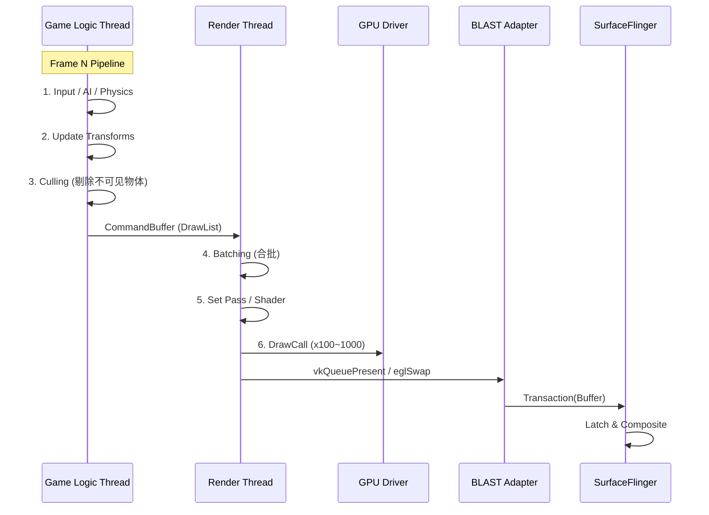
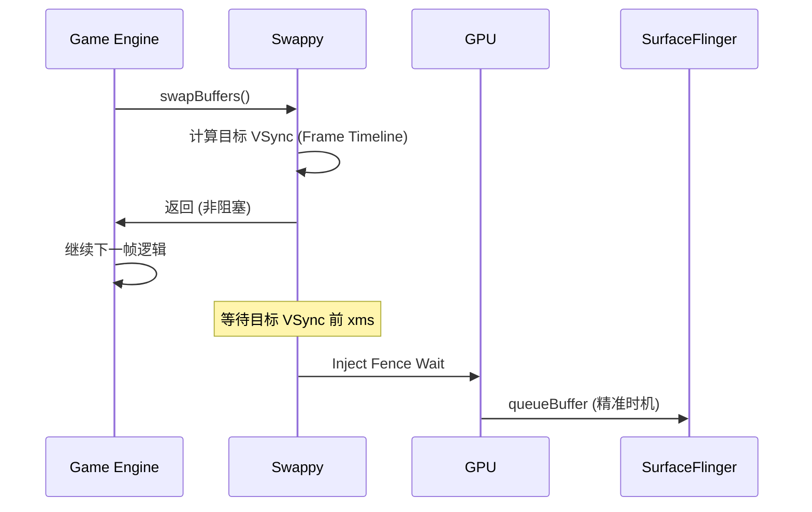

<!-- outline-start -->

**锚点（必须覆盖）：**
- 游戏引擎的 Game Loop 模型（与 App 事件驱动的区别）
- 多线程架构：Logic Thread / Render Thread / Worker Threads
- Unity 和 Unreal 的典型线程模型与 Trace 特征
- Swappy Frame Pacing 的原理与作用
- 游戏引擎几乎总是使用 SurfaceView + BLAST

**扩展（可选深入）：**
- DrawCall 合批（Batching）与 GPU 性能
- Game Mode / State API 对渲染链路的影响
- 常见游戏性能问题的诊断思路

<!-- outline-end -->

## 为什么游戏引擎的渲染链路不同于普通 App

普通 App 的渲染是事件驱动的——用户操作触发 `invalidate()`，Choreographer 在 VSync 时回调 `doFrame()`，UI 线程执行 Measure/Layout/Draw。但游戏引擎不是这样工作的：它有一个**自主运行的 Game Loop**，不管有没有用户输入，都会按照固定节奏持续更新和渲染。

这意味着游戏引擎的渲染链路需要解决一个普通 App 不存在的问题：**如何让游戏逻辑帧率与屏幕刷新率对齐**。跑 40fps 的游戏在 60Hz 屏幕上如果不做帧节奏控制，会导致部分帧显示 16ms、部分显示 33ms，视觉抖动非常明显。[已验证: Android Game SDK 文档]

## Game Loop 模型

游戏引擎通常采用双线程或三线程架构：



关键阶段：

1. **Logic Thread**：运行 C#/Lua/C++ 脚本，处理物理模拟、AI、输入、动画。产物是 DrawCall List（渲染指令列表）。
2. **Render Thread**：接收 DrawList，执行 Batching（合批减少 DrawCall），设置 Shader/Texture，提交 GPU 指令。
3. **GPU**：执行渲染指令，将结果写入 Back Buffer。
4. **Present**：通过 `eglSwapBuffers`（GLES）或 `vkQueuePresentKHR`（Vulkan）提交给 SurfaceFlinger。

## Unity 与 Unreal 的线程模型

### Unity

| 线程 | 职责 | Trace 标签 |
|:---|:---|:---|
| **UnityMain / Main** | C# 脚本，Update/LateUpdate，物理模拟 | `PlayerLoop`, `Physics.FixedUpdate` |
| **UnityGfx / Gfx** | 渲染命令提交，Batching，GPU 调度 | `Gfx.WaitForPresent`, `RenderThread` |
| **UnityJobWorker** | 多线程任务，Burst 编译任务 | `JobSystem`, `ParallelFor` |

### Unreal

| 线程 | 职责 | Trace 标签 |
|:---|:---|:---|
| **GameThread** | C++ 游戏逻辑 | `GameThread::Tick` |
| **RenderThread** | 渲染指令生成和提交 | `FRenderingThread` |
| **RHIThread** | 底层图形 API 调用（GLES/Vulkan） | `FRHICommandList::Execute` |

Unity 和 Unreal 都采用了**逻辑线程与渲染线程分离**的架构。逻辑线程产出 DrawList 后交给渲染线程，两者可以流水线化并行——逻辑线程在计算第 N+1 帧的同时，渲染线程在渲染第 N 帧。

## SurfaceView + BLAST

游戏引擎几乎总是使用 **SurfaceView**（或 `GameActivity` 提供的 Surface），因此完全受益于 BLAST 架构：

1. **独立 Surface**：游戏画面不经过 App RenderThread，直接由 SF 合成。
2. **Resize 同步**：折叠屏展开等窗口尺寸变化，通过 BLAST Transaction 原子同步。
3. **HWC Overlay**：游戏 Surface 可能走 Overlay 路径，减少 GPU 合成开销。

## Swappy Frame Pacing

**Swappy** 是 Google 官方的帧节奏库（属于 Android Game SDK），解决游戏引擎的核心痛点：

### 问题

游戏跑 40fps，屏幕 60Hz。如果不做控制：
- 帧 1：显示 16ms
- 帧 2：显示 33ms（等了一个 VSync）
- 帧 3：显示 16ms
- 视觉上严重抖动

### 解决方案

Swappy 在 Present 阶段注入 Fence Wait，确保每帧精准对齐到 VSync 边界：



```c
// Swappy 核心用法 (Vulkan)
SwappyVk_initAndGetRefreshCycleDuration(env, activity, 
    physicalDevice, device, swapchain, &refreshDuration);
SwappyVk_queuePresent(queue, presentInfo);
SwappyVk_setSwapIntervalNS(device, swapchain, 16666666); // 60fps
```

在 Perfetto 中，如果应用接入了 Swappy，可以看到 Swappy 相关的 Track/Slice 和与 Choreographer 的反馈回路。

## DrawCall 合批（Batching）

DrawCall 是 GPU 渲染的基本单元。每次 `glDrawElements` 或 `vkCmdDraw` 都有 CPU 开销（状态切换、驱动验证）。游戏场景中可能有上千个物体，如果不做合批，DrawCall 数量会爆炸。

**Batching 策略**：将材质（Shader + Texture）相同的物体合并成一个大 Mesh，用一次 DrawCall 画完。Unity 的 SRP Batcher 和 Unreal 的 Mesh Draw Command 合并都是这个思路。

在 Perfetto 中，如果 RenderThread 的 `DrawCall` 数量过多（>1000/帧），可能需要优化 Batching 策略。

## 在 Perfetto 中识别游戏引擎链路

| Trace 特征 | 可能的引擎 |
|:---|:---|
| `PlayerLoop`, `Physics.FixedUpdate` | Unity |
| `GameThread::Tick`, `FRenderingThread` | Unreal |
| `Swappy` Track | 接入了 Android Game SDK |
| `vkQueueSubmit` / `eglSwapBuffers` | Vulkan / GLES 后端 |
| 密集的 `DrawCall` Slice | 游戏引擎渲染 |

**常见性能问题诊断**：

| 现象 | 可能原因 | 查看 |
|:---|:---|:---|
| 逻辑帧率低 | 物理模拟/AI 太重 | Logic Thread Track |
| 渲染帧率低 | GPU 过载或 DrawCall 过多 | RenderThread + GPU Track |
| 帧率波动 | 未接入 Swappy，帧节奏不稳 | VSync 对齐情况 |
| 帧延迟高 | 呈现模式不优或 BufferQueue 阻塞 | `dequeueBuffer` 耗时 |

## 与其他章节的关系

- **8.9 游戏性能与 Game Mode API**：游戏性能优化实战
- **18.8 OpenGL ES / 18.9 Vulkan**：底层图形 API 链路
- **2.17 Frame Pacing Library**：帧节奏控制原理

## 参考资料

- Android Game SDK：Frame Pacing
- AOSP `frameworks/native/libs/gui/`
- Unity Performance Optimization 文档
- Unreal Engine Rendering Architecture 文档
