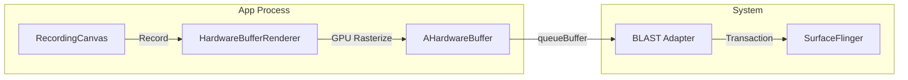
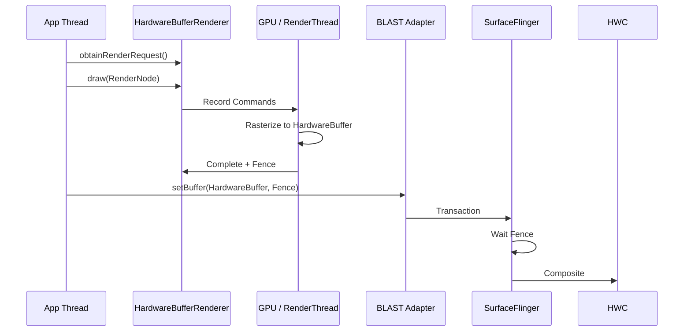

<!-- outline-start -->

**锚点（必须覆盖）：**
- HardwareBufferRenderer 解决的核心问题：lockCanvas() 的性能瓶颈
- GPU 硬件加速离屏渲染 vs CPU 软件渲染
- API 使用流程：RenderRequest → GPU Rasterize → Fence → SurfaceControl
- 性能对比：lockCanvas() vs HardwareBufferRenderer
- 适用场景：HDR、跨进程 Buffer 共享、高帧率渲染

**扩展（可选深入）：**
- Java API vs NDK API 的差异
- 与 RenderNode 的关系
- 在旧版本上的降级策略

<!-- outline-end -->

## 为什么需要 HardwareBufferRenderer

传统 Android 软件渲染使用 `Surface.lockCanvas()`：App 在 CPU 上用 Skia 逐像素绘制，再将结果拷贝到 GraphicBuffer。这个过程有两个根本性瓶颈：

1. **CPU 渲染太慢**：复杂场景（PDF 渲染、矢量图）在 CPU 上光栅化可能需要 15-20ms，直接吃掉一帧预算
2. **内存拷贝**：CPU 渲染结果需要拷贝到 GraphicBuffer 才能提交给 SF，额外消耗内存带宽

**HardwareBufferRenderer**（Android 14 / API 34 引入）是 `lockCanvas()` 的现代替代方案：它利用 RenderNode 和 GPU 进行硬件加速光栅化，GPU 直接渲染到 HardwareBuffer，**跳过 CPU 拷贝**。[已验证: Android 14 API 文档]

## 核心架构



核心流程：
1. **Record**：App 通过 RecordingCanvas 记录绘制指令（和标准 Android View 的 Draw 阶段类似）
2. **GPU Rasterize**：HardwareBufferRenderer 将指令提交给 GPU，直接光栅化到 AHardwareBuffer
3. **Fence**：GPU 完成后返回 SyncFence
4. **Submit**：App 将 HardwareBuffer + Fence 通过 SurfaceControl Transaction 提交给 SF

## API 使用

### Java API

```java
// 1. 创建
HardwareBufferRenderer renderer = new HardwareBufferRenderer(
    HardwareBuffer.create(width, height, HardwareBuffer.RGBA_8888, 1,
        HardwareBuffer.USAGE_GPU_SAMPLED_IMAGE | HardwareBuffer.USAGE_CPU_WRITE)
);

// 2. 获取 RenderRequest
RenderRequest request = renderer.obtainRenderRequest();
request.setContentRoot(rootRenderNode);
request.setColorSpace(ColorSpace.get(ColorSpace.Named.DISPLAY_P3));

// 3. 执行渲染
request.draw(executor, result -> {
    SyncFence fence = result.getFence();
    
    // 4. 提交给 SurfaceControl
    SurfaceControl.Transaction t = new SurfaceControl.Transaction();
    t.setBuffer(surfaceControl, hardwareBuffer, fence);
    t.apply();
});
```

### NDK API

```c
AHardwareBufferRenderer* renderer;
AHardwareBufferRenderer_create(hardwareBuffer, &renderer);

ACanvas* canvas;
AHardwareBufferRenderer_getCanvas(renderer, &canvas);
ACanvas_drawRect(canvas, rect, paint);

int fenceFd;
AHardwareBufferRenderer_submit(renderer, &fenceFd);

ASurfaceTransaction_setBuffer(transaction, sc, hardwareBuffer, fenceFd);
```

## 性能对比

| 场景 | lockCanvas() | HardwareBufferRenderer |
|:---|:---|:---|
| 1080p 全屏绘制 | ~15ms (CPU) | ~8ms (GPU) |
| 内存带宽 | 2x (渲染 + 拷贝) | 1x (GPU 直写) |
| HDR 内容 | ❌ 不支持 | ✅ RGBA_F16 原生支持 |
| 多线程 | 需要锁同步 | 完全线程安全 |
| Fence 控制 | 隐式 | 显式 |

## 渲染时序



## 适用场景

1. **自定义绘图引擎**：PDF 渲染器、矢量图编辑器——复杂路径光栅化从 CPU 转移到 GPU
2. **HDR 图像处理**：需要 RGBA_F16 格式的场景，lockCanvas() 不支持
3. **跨进程 Buffer 共享**：HardwareBuffer 可以通过 Binder 传递，实现零拷贝跨进程渲染
4. **高帧率离屏渲染**：配合 Choreographer 实现 120fps 的离屏渲染任务

## 降级策略

在 Android 14 以下的设备上，回退到 `lockCanvas()` + BLAST：

```java
if (Build.VERSION.SDK_INT >= Build.VERSION_CODES.UPSIDE_DOWN_CAKE) {
    // HardwareBufferRenderer
} else {
    // lockCanvas() fallback
}
```

## 在 Perfetto 中识别

| 位置 | 说明 |
|:---|:---|
| GPU Track | 看到 GPU 光栅化到特定 Buffer（非主窗口 Buffer） |
| SurfaceFlinger | 通过 SurfaceControl Transaction 提交的额外 Layer |

## 与其他章节的关系

- **18.2 Android View 标准链路**：标准链路也使用 RenderNode + GPU 渲染，但通过 RenderThread
- **2.10 GPU 渲染深入**：GPU 光栅化的底层机制

## 参考资料

- Android 14 API 文档：HardwareBufferRenderer
- AOSP `frameworks/base/graphics/java/android/graphics/HardwareBufferRenderer.java`
