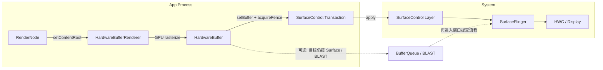
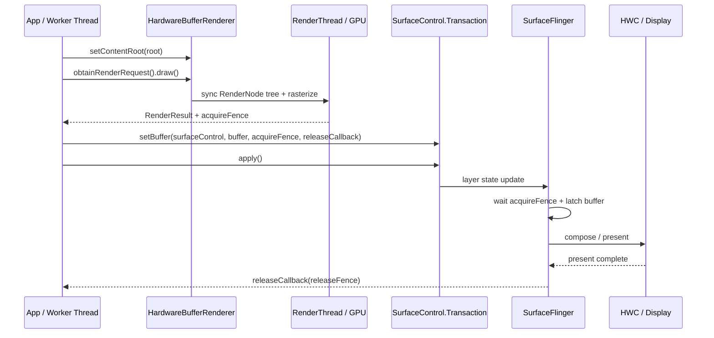

<!-- outline-start -->

**锚点（必须覆盖）：**
- HardwareBufferRenderer 解决的核心问题：lockCanvas() 的性能瓶颈
- GPU 硬件加速离屏渲染 vs CPU 软件渲染
- API 使用流程：RenderRequest → GPU Rasterize → Fence → SurfaceControl
- 性能对比：lockCanvas() vs HardwareBufferRenderer
- 适用场景：HDR、跨进程 Buffer 共享、高帧率渲染

**扩展（可选深入）：**
- Java API vs NDK API 的差异
- 与 RenderNode 的关系
- 在旧版本上的降级策略

<!-- outline-end -->

## 为什么需要 HardwareBufferRenderer

传统软件绘制走的是 `Surface.lockCanvas()` 这套方式。`lockCanvas()` 会先从 BufferQueue 取回一个 `GraphicBuffer`，把这块像素内存映射给 CPU，然后由 Skia 在 CPU 上逐像素写入；`unlockCanvasAndPost()` 再把写好的 buffer 交回系统。[已验证: §18.3 `Surface.cpp::lock()` / `unlockAndPost()`]

这条方式的成本主要有两类：

1. **CPU 光栅化开销高**：复杂矢量图、PDF 页面、大尺寸 Bitmap 缩放都会直接挤占 UI Thread 或调用方工作线程的时间。
2. **buffer 复用节奏由调用方自己管理**：software Canvas 依赖 dirty region、copyback、BufferQueue 槽位和 fence 同步；脏区失效或复用节奏过紧时，等待和内存搬运成本都会被放大。

**HardwareBufferRenderer**（Android 14 / API 34 引入）把同一类“离屏产出一块 buffer”的需求改成了 GPU 光栅化。调用方先用 `RenderNode` 记录绘制内容，再让 `HardwareBufferRenderer` 把结果画进 `HardwareBuffer`。如果后面直接接 `SurfaceControl.Transaction.setBuffer()`，buffer 可以直接交给 system compositor；如果目标对象后面接的仍是 `Surface`、BLASTBufferQueue 或其他 consumer，再按对应提交方式接回去。[已验证: `HardwareBufferRenderer.java` 类注释]

## 核心架构

`HardwareBufferRenderer` 面向的是 “RenderNode → HardwareBuffer → SurfaceControl.Transaction.setBuffer()” 这条 direct buffer 提交模型。`queueBuffer()` / BLAST 只会在目标对象本身还挂在标准窗口生产者-消费者体系后面时出现。



这里分成三件事看最稳妥：

1. **HBR 只负责离屏 GPU 光栅化**：它把 `RenderNode` 树画进 `HardwareBuffer`，不会自动把 buffer 送到某个 `Surface`。
2. **提交动作由调用方决定**：最直接的做法是 `SurfaceControl.Transaction.setBuffer()`；只有目标对象后面仍挂着 `Surface`、`SurfaceView`、BLASTBufferQueue 这类生产者时，才会再看到 `queueBuffer()`。
3. **buffer 不会被自动清空**：`HardwareBufferRenderer` 每次 draw 前都不会替你 clear 旧内容。单 buffer 复用时，要么每帧完整覆盖，要么自己显式清屏。[已验证: `HardwareBufferRenderer.java` 注释]

## API 使用

### Java API

Java 侧的调用顺序是：创建 `HardwareBuffer` → 记录 `RenderNode` 内容 → `setContentRoot()` → `obtainRenderRequest().draw()` → 把 `RenderResult` 交给 `SurfaceControl.Transaction`。

```java
HardwareBuffer buffer = HardwareBuffer.create(
        width,
        height,
        HardwareBuffer.RGBA_8888,
        1,
        HardwareBuffer.USAGE_GPU_COLOR_OUTPUT
                | HardwareBuffer.USAGE_GPU_SAMPLED_IMAGE
                | HardwareBuffer.USAGE_COMPOSER_OVERLAY);

RenderNode root = new RenderNode("HbrRoot");
RecordingCanvas canvas = root.beginRecording(width, height);
// 在这里记录 drawBitmap / drawText / drawPath 等操作
root.endRecording();

HardwareBufferRenderer renderer = new HardwareBufferRenderer(buffer);
renderer.setContentRoot(root);

HardwareBufferRenderer.RenderRequest request = renderer.obtainRenderRequest();
request.setColorSpace(ColorSpace.get(ColorSpace.Named.DISPLAY_P3));
request.draw(executor, result -> {
    if (result.getStatus() != HardwareBufferRenderer.RenderResult.SUCCESS) {
        return;
    }

    SurfaceControl.Transaction t = new SurfaceControl.Transaction();
    t.setDataSpace(surfaceControl, DataSpace.DATASPACE_DISPLAY_P3);
    t.setBuffer(surfaceControl, buffer, result.getFence(), releaseFence -> {
        // releaseFence signal 后，再把 buffer 放回池里
    });
    t.apply();
});
```

这段 Java API 有四个容易写错的点：

1. `setContentRoot()` 属于 `HardwareBufferRenderer`，不在 `RenderRequest` 上。
2. `HardwareBuffer.create()` 里给 GPU render target 至少要带 `USAGE_GPU_COLOR_OUTPUT`；direct `SurfaceControl.setBuffer()` 场景还要补 `USAGE_GPU_SAMPLED_IMAGE | USAGE_COMPOSER_OVERLAY`。[已验证: `HardwareBuffer.java` / `SurfaceControl.java`]
3. `RenderResult.getFence()` 解决的是“consumer 什么时候能读这块 buffer”。SurfaceFlinger 在 latch 前要等它 signal。
4. `setBuffer(..., fence, releaseCallback)` 里的 callback 才对应“这块 buffer 什么时候能再次写”。如果不跟踪 release，同一块 buffer 连续覆写会把上一帧还在显示的内容踩掉。[已验证: `SurfaceControl.Transaction#setBuffer(..., Consumer<SyncFence>)`]

### NDK API

公开 NDK 没有 `AHardwareBufferRenderer_*` 这层封装。native 方案要自己把 `AHardwareBuffer` 接到 EGL / OpenGL ES、Vulkan 或其他图形 API，再用 `ASurfaceTransaction` 提交：

```c
// API 26+: 分配可给 GPU 写入、可给 SurfaceControl 消费的 buffer
AHardwareBuffer_Desc desc = {
    .width = width,
    .height = height,
    .layers = 1,
    .format = AHARDWAREBUFFER_FORMAT_R8G8B8A8_UNORM,
    .usage = AHARDWAREBUFFER_USAGE_GPU_COLOR_OUTPUT |
             AHARDWAREBUFFER_USAGE_GPU_SAMPLED_IMAGE |
             AHARDWAREBUFFER_USAGE_COMPOSER_OVERLAY,
};
AHardwareBuffer* buffer = NULL;
AHardwareBuffer_allocate(&desc, &buffer);

// 把 buffer 导入 EGL / OpenGL ES 或 Vulkan 作为 render target
// 渲染完成后导出 acquire fence fd，再交给 ASurfaceTransaction
int acquireFenceFd = -1;  // 由图形 API 的同步对象导出

ASurfaceTransaction* tx = ASurfaceTransaction_create();
ASurfaceTransaction_setBuffer(tx, surfaceControl, buffer, acquireFenceFd);
// API 36+ 可以改成 ASurfaceTransaction_setBufferWithRelease(...)
ASurfaceTransaction_apply(tx);
```

NDK 侧的最小版本要分开记：

- `AHardwareBuffer` 分配与导入从 API 26 开始。
- `ASurfaceTransaction_setBuffer()` 从 API 29 开始。
- `ASurfaceTransaction_setBufferWithRelease()` 与 `ASurfaceTransaction_OnBufferRelease` 从 API 36 开始。[已验证: `android/surface_control.h`]

Android 10-15 只有 `ASurfaceTransaction_setBuffer()`。这几个版本里，`OnComplete` 只能说明事务完成，不能直接拿来当 buffer 已释放的信号；调用方仍要自己维护 in-flight buffer 计数和回收策略。

## 性能对比

| 维度 | `lockCanvas()` | `HardwareBufferRenderer` |
|:---|:---|:---|
| 光栅化位置 | CPU 直接写入 dequeued `GraphicBuffer` | GPU 直接写入 `HardwareBuffer` |
| buffer 提交 | `unlockCanvasAndPost()` → BufferQueue / BLAST | `SurfaceControl.Transaction.setBuffer()`；必要时再接回 `Surface` / BLAST |
| wide color / HDR | software Canvas 不提供 FP16 GPU render target | 可输出 `RGBA_FP16` / wide color buffer；HDR 还要配合 dataspace、display capability 和 compositor 支持 |
| 线程模型 | 调用线程串行写像素 | `RenderRequest` 非线程安全；buffer / fence 复用要由调用方同步 |
| 同步信号 | acquire / release fence 多由 `Surface` / BufferQueue 维护 | `RenderResult.getFence()` 管 consumer 读取时机，release callback / release fence 管 buffer 再利用 |

## 渲染时序

direct `SurfaceControl.setBuffer()` 模式里，有两条 fence 要分开看：

- `RenderResult.getFence()`：GPU 写完这块 `HardwareBuffer` 后 signal。consumer 读取 buffer 前要等它。
- `setBuffer(..., releaseCallback)` / `ASurfaceTransaction_OnBufferRelease`：SurfaceFlinger / HWC 不再使用这块 buffer 时回给调用方的复用信号。



如果这个 `SurfaceControl` 后面还挂着 `SurfaceView`、BLASTBufferQueue 或其他标准窗口 consumer，显示阶段不会变；变化点只在 producer 这一侧。HBR 默认 producer 通过 transaction 提交 buffer，`queueBuffer()` 只在你主动把它接回标准窗口模型时出现。

## Buffer 复用与 release fence

`HardwareBufferRenderer` 最容易被写漏的一段，是“GPU 画完”和“系统用完”不是同一个时刻。`RenderResult.getFence()` 只解决前者，release fence / release callback 才决定后者。

常见复用方式有三种：

1. **单 buffer**：只有 release fence signal 后，才能再次覆写同一块 buffer。
2. **双 buffer**：当前帧在显示时，下一帧写另一块 buffer。大多数持续动画场景都会从这里起步。
3. **buffer pool**：高帧率或跨线程 producer 会维护 3 块以上 buffer，并把 release callback 接到池回收逻辑。

`HardwareBufferRenderer` 不会自动 clear 旧内容，所以“上一帧还在显示，本帧又开始写同一块 buffer”会直接产出错帧。连续渲染场景不要把 acquire fence 当成 release fence 用。

## 适用场景

1. **自定义离屏 GPU 绘制**：PDF 页面、矢量图编辑器、自绘 UI 卡片，需要把 CPU 光栅化换成 GPU。
2. **direct SurfaceControl layer 输出**：系统浮层、桌面组件、跨进程内容卡片，需要自己控制 `SurfaceControl`、buffer 和 fence。
3. **跨进程 buffer 共享**：`HardwareBuffer` 可通过 Binder 传递，producer 与 consumer 不必围着同一个 `Surface` 工作。
4. **wide color / HDR 输出**：需要 FP16 buffer、明确 dataspace、自己掌控 color pipeline 的场景。

### wide color 与 HDR 要分开看

`HardwareBuffer.RGBA_FP16` 只说明 buffer 精度到了 FP16。真正显示成 HDR，还要同时满足几件事：

1. Layer dataspace 要和内容匹配，通常要通过 `SurfaceControl.Transaction.setDataSpace()` 声明。
2. SurfaceFlinger、HWC 和 display 必须支持对应的 color mode / composition 能力。
3. 设备不支持时，系统可能回退成 SDR 合成、tone mapping，或者只把它当成普通 wide color buffer 处理。

`DISPLAY_P3` 只能说明 wide color gamut，不能替代 HDR capability。Android 15 / API 35 之后还有 `setDesiredHdrHeadroom()` 这类 layer 亮度 hint，可继续细化 HDR 合成目标，但前提仍是下游显示系统支持。[已验证: `HardwareBuffer.java` / `SurfaceControl.java`]

## 降级策略

Android 14 以下没有 `HardwareBufferRenderer`。常见回退方案有两类：

```java
if (Build.VERSION.SDK_INT >= Build.VERSION_CODES.UPSIDE_DOWN_CAKE) {
    // HardwareBufferRenderer + SurfaceControl.setBuffer()
} else {
    // Surface.lockCanvas() / EGL / Vulkan 等既有离屏方案
}
```

如果业务只是想得到一块离屏结果，旧版本可以继续用 `lockCanvas()` 或自建 EGL / Vulkan render target；如果业务依赖 direct `SurfaceControl` buffer 提交，还要把 `SurfaceControl.Transaction`、fence 和 buffer 池的最小 API level 一起算进去。

## 在 Perfetto 中识别

[待补充：需补充实际 Perfetto Trace 截图描述和具体的 Track 名称]

| 位置 | 说明 |
|:---|:---|
| GPU Track | 看到 GPU 光栅化到特定 Buffer（非主窗口 Buffer） |
| SurfaceFlinger | 通过 SurfaceControl Transaction 提交的额外 Layer |

## 与其他章节的关系

HardwareBufferRenderer 的底层机制与标准 Android View 渲染链路（18.2）共享 RenderNode + GPU 光栅化的基础设施，区别在于标准链路通过 RenderThread 自动管理，而 HardwareBufferRenderer 需要调用方手动控制 HardwareBuffer 的生命周期和提交时机。GPU 光栅化的底层工作原理详见 2.10 GPU 渲染深入。

## 参考资料

- Android API reference: `HardwareBufferRenderer#setContentRoot(RenderNode)` / `obtainRenderRequest()` / `RenderRequest.draw(Executor, Consumer)`
  https://developer.android.com/reference/android/graphics/HardwareBufferRenderer
- Android API reference: `HardwareBuffer` usage flags 与 `RGBA_FP16`
  https://developer.android.com/reference/android/hardware/HardwareBuffer
- Android API reference: `SurfaceControl.Transaction#setBuffer(...)` / `setDataSpace(...)` / `setDesiredHdrHeadroom(...)`
  https://developer.android.com/reference/android/view/SurfaceControl.Transaction
- AOSP: `frameworks/base/graphics/java/android/graphics/HardwareBufferRenderer.java`
- AOSP: `frameworks/base/core/java/android/hardware/HardwareBuffer.java`
- AOSP: `frameworks/base/core/java/android/view/SurfaceControl.java`
- NDK: `frameworks/native/include/android/surface_control.h` 中 `ASurfaceTransaction_setBuffer()` / `ASurfaceTransaction_setBufferWithRelease()` / `ASurfaceTransaction_OnBufferRelease`
