# 18.17 Android 17 HardwareBufferRenderer

## HBR 的问题边界

`Surface.lockCanvas()` 让 CPU 直接绘制到 `Surface`。调用方从 `BufferQueue` 取得可写 buffer，Skia software backend 在 CPU 上完成光栅化（把矢量绘制命令转成像素），`unlockCanvasAndPost()` 再将 buffer 提交回队列。复杂 Path、大尺寸缩放、滤镜或高分辨率离屏内容会消耗较多 CPU 时间，`HardwareBufferRenderer`（HBR）可以处理其中一类需求。

HBR 不能简单理解成 `lockCanvas()` 的硬件加速开关。Android 还提供 `Surface.lockHardwareCanvas()`，它已经使用 HWUI/GPU，输出目标仍是 `Surface`。三者的边界如下：

| API | 光栅化执行者 | 输出目标 | 提交与 buffer 复用 |
| --- | --- | --- | --- |
| `Surface.lockCanvas()` | CPU / Skia software | `Surface` 背后的 buffer | 由 `unlockCanvasAndPost()` 和 BufferQueue 协作 |
| `Surface.lockHardwareCanvas()` | HWUI / GPU | `Surface` 背后的 buffer | 仍沿用 Surface / BufferQueue；每帧必须完整覆盖目标 |
| `HardwareBufferRenderer` | HWUI RenderThread / GPU | 调用方提供的 `HardwareBuffer` | 调用方选择 consumer，并管理 presentation fence、release fence 和 buffer 池 |

HBR 的区别在于，它把一棵 `RenderNode` 场景树光栅化到**调用方拥有的 `HardwareBuffer`**。调用方自行决定这个 buffer 交给 `SurfaceControl`、其他进程、GPU 或媒体 consumer，并负责同步与复用。如果已经有一个正常消费的 `Surface`，需求只是 GPU Canvas，`lockHardwareCanvas()` 或面向 Surface 的 `HardwareRenderer` 通常更合适。

Android 17 的 `Surface.java` 明确规定，`lockHardwareCanvas()` 不保留前一帧内容，调用方每次都要完整覆盖。HBR 在 draw 前**不会自动清空**目标，未被本次绘制覆盖的像素会继续保留；这是局部更新能力，也可能成为残留旧像素的来源。[AOSP: `Surface.lockHardwareCanvas()`](https://android.googlesource.com/platform/frameworks/base/+/refs/tags/android-17.0.0_r1/core/java/android/view/Surface.java) [AOSP: `HardwareBufferRenderer`](https://android.googlesource.com/platform/frameworks/base/+/refs/tags/android-17.0.0_r1/graphics/java/android/graphics/HardwareBufferRenderer.java)

## Android 17 中的实现边界

HBR 是 Android 14 / API 34 加入的 Java API。它复用 HWUI 的基础设施，没有为离屏内容另建一套渲染系统。Android 17 源码给出了以下生命周期约束：

- 所有 `HardwareBufferRenderer` 与 `HardwareRenderer` 共享应用进程中的 RenderThread、GPU context 和 GPU 资源。HBR 的工作量可能与普通 View 硬件渲染争用 RenderThread 和 GPU。
- 进程首次创建 HBR 时可能需要初始化 GPU context，冷启动成本不能混入稳态单帧数据；后续实例通常只承担较小的增量成本。
- 预期用法是每个活动中的 `HardwareBuffer` 对应一个 HBR 实例。连续渲染若有三块 in-flight buffer，通常也维护三个 renderer/slot。HBR 没有把同一 renderer 临时改绑到另一块 buffer 的 API。
- `close()` 只释放 renderer 资源，不会替调用方关闭构造时传入的 `HardwareBuffer`；两个对象各有自己的所有权。
- `setContentRoot()` 会让内部根节点记录一次 `drawRenderNode(content)`。RenderNode 的 display list 保存已经录制的绘制命令；之后修改这棵树的显示列表或属性，不必重复调用 `setContentRoot()`，下一次 render request 会同步最新状态。
- `obtainRenderRequest()` 返回内部复用的请求对象。每次调用都会把 color space 重置为 sRGB、transform 重置为 identity；该对象不是线程安全的，调用 `draw()` 后也不能继续修改或长期持有。

这些行为都能直接在 Android 17 的 [`HardwareBufferRenderer.java`](https://android.googlesource.com/platform/frameworks/base/+/refs/tags/android-17.0.0_r1/graphics/java/android/graphics/HardwareBufferRenderer.java) 中核对。

`draw()` 之后的 native 调用链可以在 `android-17.0.0_r1` 中逐段对应：

1. `RenderRequest.draw()` 调用 `nRender()`。
2. `android_graphics_HardwareBufferRenderer.cpp` 把尺寸、旋转变换、color space 和 callback 写入 `HardwareBufferRenderParams`，再调用 `RenderProxy::syncAndDrawFrame()`。
3. `DrawFrameTask` 同步 RenderNode 树，并让 HWUI pipeline 写入构造时绑定的 `AHardwareBuffer`。
4. pipeline `flush()` 导出 producer fence，JNI 再把对应 fd 包装成 `RenderResult.getFence()` 返回。

HBR 的 JNI 在构造 `UiFrameInfo` 时使用 `INVALID_VSYNC_ID`，因此一次 HBR draw 本身没有关联到有效的 App FrameTimeline VSync。若结果需要按 VSync 上屏，调用方仍要通过 Choreographer 选择目标帧，并在 `SurfaceControl.Transaction` 上设置对应 FrameTimeline。

## 从 RenderNode 到屏幕的完整路径

HBR 只负责下图中间的 GPU 光栅化，buffer 分配、consumer 选择、显示提交和安全复用都由调用方管理：

```mermaid
flowchart LR
    A["记录或更新 RenderNode"] --> B["obtainRenderRequest()"]
    B --> C["draw(executor, callback)"]
    C --> D["RenderThread 同步场景树"]
    D --> E["GPU 写 HardwareBuffer"]
    E --> F["RenderResult: status + presentation fence"]
    F --> G["SurfaceControl.Transaction.setBuffer()"]
    G --> H["SurfaceFlinger 等 fence 后 latch"]
    H --> I["HWC 或 GPU 合成并显示"]
    I --> J["后续 transaction 替换/移除 buffer"]
    J --> K["release callback / release fence"]
    K --> B
```



这里有两个名称相近、方向相反的同步点，分别保护“producer 写完后 consumer 才能读”和“consumer 读完后 producer 才能重写”：

1. **Presentation fence**：由 `RenderResult.getFence()` 返回，表示 producer 的 GPU 写入何时完成。consumer 在读取 buffer 前必须等待它。直接上屏时可将它传给 `Transaction.setBuffer()`，由 SurfaceFlinger 等待，应用无须先阻塞 CPU。
2. **Release fence**：由 `setBuffer(..., releaseCallback)` 的 callback 参数提供，表示 SurfaceFlinger/HWC 何时不再读取这块 buffer。只有该 fence signal 后，producer 才能再次写入。

`draw()` 的 callback 能拿到 `RenderResult`，不代表其中的 `SyncFence` 已经 signal。Android 17 的 API 注释要求先检查 `status == SUCCESS`，consumer 再等待或接收该 fence。若把 callback 到达时间当成 GPU 完成时间，consumer 可能与 GPU 并发访问同一块 buffer。

release callback 也不会在本次 transaction 调用 `apply()` 后立刻触发。Java API 的定义是：**后续 transaction** 替换或移除该 buffer 后，系统通过 callback 交回 release fence；应用要等 fence signal 才能复用。如果一块 buffer 一直作为 layer 当前内容留在屏上，它就仍处于占用状态。

## Java API：一个可核查的提交骨架

下面的代码展示单个 buffer slot 的关键顺序。`surfaceControl`、线程池与 slot 状态机由上层持有；持续渲染时不能只创建一个 slot 然后无条件循环覆写。

```java
long usage = HardwareBuffer.USAGE_GPU_COLOR_OUTPUT
        | HardwareBuffer.USAGE_GPU_SAMPLED_IMAGE
        | HardwareBuffer.USAGE_COMPOSER_OVERLAY;

if (!HardwareBuffer.isSupported(
        width, height, HardwareBuffer.RGBA_8888, 1, usage)) {
    throw new IllegalArgumentException("Unsupported HardwareBuffer configuration");
}

HardwareBuffer buffer = HardwareBuffer.create(
        width, height, HardwareBuffer.RGBA_8888, 1, usage);
HardwareBufferRenderer renderer = new HardwareBufferRenderer(buffer);

RenderNode root = new RenderNode("HbrContent");
RecordingCanvas canvas = root.beginRecording(width, height);
canvas.drawColor(Color.TRANSPARENT, PorterDuff.Mode.CLEAR);
// 记录本帧需要的 drawBitmap / drawText / drawPath ...
root.endRecording();
renderer.setContentRoot(root);

HardwareBufferRenderer.RenderRequest request = renderer.obtainRenderRequest();
request.setColorSpace(ColorSpace.get(ColorSpace.Named.SRGB));
request.draw(callbackExecutor, result -> {
    SyncFence presentationFence = result.getFence();
    if (result.getStatus()
            != HardwareBufferRenderer.RenderResult.SUCCESS) {
        releaseExecutor.execute(() -> {
            try (presentationFence) {
                if (presentationFence.isValid()) {
                    presentationFence.awaitForever();
                }
            }
            markSlotIdleAfterRenderFailure();
        });
        return;
    }

    try (SurfaceControl.Transaction transaction =
                 new SurfaceControl.Transaction()) {
        transaction
                .setDataSpace(surfaceControl, DataSpace.DATASPACE_SRGB)
                .setBuffer(
                        surfaceControl,
                        buffer,
                        presentationFence,
                        releaseFence -> releaseExecutor.execute(() -> {
                            try (releaseFence) {
                                if (releaseFence.isValid()) {
                                    releaseFence.awaitForever();
                                }
                            }
                            markSlotIdle();
                        }))
                .show(surfaceControl)
                .apply();
    } finally {
        // native transaction 已持有提交所需的 fence 引用。
        presentationFence.close();
    }
});
```

示例显式调用 clear，因为 HBR 不会替调用方清除旧像素。失败分支也会先处理返回的 fence，再把 slot 放回空闲队列，避免 GPU 仍在写入时复用目标。若业务能保证每次记录都覆盖整个 buffer，可以省略 clear；局部更新则要自行维护未覆盖区域的正确内容。

成功分支把 presentation fence 交给 `setBuffer()` 后便关闭 Java wrapper。Android 17 的 `android_view_SurfaceControl.cpp` 会让 transaction 通过 `sp<Fence>` 持有 native fence 引用，因此关闭原 wrapper 不会使 transaction 失去该 fence；若继续保留 wrapper，则会额外占用一个 fd / native 资源。

三个 usage flag 声明不同的访问方式，allocator 会据此判断格式和内存配置是否可用：

- `USAGE_GPU_COLOR_OUTPUT`：GPU 会把该 buffer 作为 render target 写入。
- `USAGE_GPU_SAMPLED_IMAGE`：SurfaceFlinger 可能通过 GPU 采样该 buffer 完成合成。
- `USAGE_COMPOSER_OVERLAY`：直接调用 `SurfaceControl.Transaction.setBuffer()` 时需要，HWC 也可能把该 buffer 作为 overlay layer 输入。

Android 17 的 Java `setBuffer()` 文档同时要求 `GPU_SAMPLED_IMAGE` 和 `COMPOSER_OVERLAY`。gralloc（图形 buffer 分配器）会约束 format 与 usage 的组合；分配前应调用 `HardwareBuffer.isSupported()`，不能假设所有设备都支持任意尺寸、FP16 与用途组合。[AOSP: `HardwareBuffer`](https://android.googlesource.com/platform/frameworks/base/+/refs/tags/android-17.0.0_r1/core/java/android/hardware/HardwareBuffer.java) [AOSP: `SurfaceControl.Transaction.setBuffer()`](https://android.googlesource.com/platform/frameworks/base/+/refs/tags/android-17.0.0_r1/core/java/android/view/SurfaceControl.java)

### RenderNode 更新与阴影

内容变化时，可以重新 recording 同一个 `RenderNode` 的 display list，也可以只修改 translation、alpha 等 RenderNode 属性，再发起新的 request。只有替换内容根节点时，才需要再次调用 `setContentRoot()`。

若场景使用 elevation 阴影，还要调用 `setLightSourceGeometry()` 与 `setLightSourceAlpha()`。光源坐标应保持在 display space（最终显示坐标系）中；窗口移动后若未更新光源位置，阴影方向会随窗口坐标发生偏移。

### Transform 只支持直角旋转

Android 17 的 HBR 源码只接受 identity、90°、180°、270° 四种 `BUFFER_TRANSFORM_*` 值。90°/270° 时，内部会交换 render width 与 height。该 transform 用于在输出阶段预旋转 buffer，不能替代 RenderNode 上的任意缩放、镜像或透视变换。

公开 `RenderRequest` 文档因为参数标注为通用 `SurfaceControl.BufferTransform`，枚举列表还包含水平/垂直镜像；Android 17 的 `HardwareBufferRenderer.java` 会对镜像值抛出 `IllegalArgumentException`。应用面向 API 37 时应按这四个实际接受值设计，不能只按文档的通用枚举列表放行。

## Buffer 池：复用规则比“几缓冲”更重要

持续渲染时，“HBR 已经画完”只意味着 producer 阶段接近完成，buffer 还可能正在等待显示或被显示端读取。一个 slot（buffer 池中的一项）至少要经历下面的状态：

```text
IDLE
  -> HBR_DRAW_SUBMITTED
  -> PRESENTATION_FENCE_PENDING
  -> SUBMITTED_TO_SURFACE_CONTROL
  -> DISPLAY_IN_USE
  -> RELEASE_FENCE_PENDING
  -> IDLE
```

池中使用两块还是三块 buffer，要根据目标帧率、GPU 时间、合成延迟和允许的排队深度决定，不能预设“高帧率必须三缓冲”。池太小时，producer 会频繁等待 release；池太大则会增加内存占用与排队延迟。

每个 slot 建议一起保存：

- `HardwareBuffer`
- 绑定该 buffer 的 `HardwareBufferRenderer`
- 当前 generation/frame id，用于识别回调属于哪一轮内容
- busy/idle 状态
- 尚未完成的 release fence 或 callback

release callback 可以在任意线程到达。不要在回调线程中长时间等待 fence；应把等待交给专用 executor，再以线程安全的方式将 slot 放回空闲队列。renderer、buffer 和 `SurfaceControl` 也要在所有 in-flight callback 结束后关闭。由于 `renderer.close()` 不会关闭 buffer，二者必须分别释放。

## 与 NDK 的关系

公开 NDK 没有与 Java HBR 对应的 `AHardwareBufferRenderer_*` API。Native 代码可以把 `AHardwareBuffer` 导入 EGL/OpenGL ES 或 Vulkan，自行实现 GPU producer，再把结果交给 `ASurfaceTransaction`：

```text
AHardwareBuffer_allocate
    -> 导入 EGLImage 或 Vulkan external memory
    -> GPU 渲染
    -> 导出 acquire/presentation fence fd
    -> ASurfaceTransaction_setBuffer*
    -> release callback/fence 后复用
```

这条路径仍要显式处理 acquire/presentation fence、release fence 和 transaction 所有权。Android 17 头文件给出的版本边界如下：

| API 范围 | 提交 API | 安全复用当前 buffer 的依据 |
| --- | --- | --- |
| API 26–28 | 有 `AHardwareBuffer`，没有公开的 `ASurfaceTransaction` buffer 提交 | 走 `ANativeWindow`/EGL/Vulkan 等对应 consumer 的同步规则 |
| API 29–35 | `ASurfaceTransaction_setBuffer()` | 在后续 transaction 的 `OnComplete` 中读取 **previous buffer** 的 release fence |
| API 36–37 | 优先 `ASurfaceTransaction_setBufferWithRelease()` | 与当前提交 buffer 一一对应的 `ASurfaceTransaction_OnBufferRelease` |

API 29–35 的 `ASurfaceTransactionStats_getPreviousReleaseFenceFd()` 返回被本次 transaction 替换或移除的上一块 buffer 的 fence。它不能用于回收本次刚提交的 buffer；要等未来某次 transaction 替换当前 buffer，才能取得当前 buffer 对应的 previous release fence。

API 36–37 的 release callback 会直接关联当前提交的 buffer。若 callback 给出非负 fd，接收方取得该 fd 的所有权，必须等待并关闭；`-1` 表示无需等待。传给 `setBuffer*()` 的 acquire fence fd 则由 framework 接管并关闭。`ASurfaceTransaction_create()` 返回的 transaction 仍归调用方所有，`apply()` 后要调用 `ASurfaceTransaction_delete()`。[AOSP: `surface_control.h`](https://android.googlesource.com/platform/frameworks/native/+/refs/tags/android-17.0.0_r1/include/android/surface_control.h)

## 内核边界：共享对象与同步原语

Java `HardwareBuffer` 在 native 侧映射到 `AHardwareBuffer` / `GraphicBuffer`，allocator 可通过 dma-buf 让 GPU、DPU 等设备共享同一块图形内存。`SyncFence` 和 NDK fence fd 通过 sync_file 跨进程传递，底层由 dma-fence 表达异步硬件任务的完成依赖。

在 `android17-6.18-2026-06_r6` 中，通用语义可从四个入口核对：

- `drivers/dma-buf/dma-buf.c`：buffer attachment（设备附着关系）、map 与跨设备共享；
- `drivers/dma-buf/dma-fence.c`：signal、callback 和 wait；
- `include/linux/dma-fence.h`：dma-fence 接口、上下文与序列号；
- `drivers/dma-buf/sync_file.c`：把一个或一组 dma-fence 封装成 sync_file fd。

内核层不了解 RenderNode、HBR request 或 SurfaceControl Layer 的业务含义。内核证据可以说明共享对象和同步依赖是否成立，却不能单独证明 HWUI 已按预期绘制、Layer 被 HWC 选为 `DEVICE`，也不能把 release fence signal 当成像素已经对用户可见。

## 性能：要和正确的基线比较

HBR 的收益取决于原有瓶颈。下表只用于选择候选方案，不能替代同设备、同内容的测量：

| 维度 | `lockCanvas()` | `lockHardwareCanvas()` | `HardwareBufferRenderer` |
| --- | --- | --- | --- |
| 光栅化 | CPU | GPU / HWUI | GPU / HWUI |
| 目标 | `Surface` | `Surface` | 调用方的 `HardwareBuffer` |
| 局部内容保留 | software Surface 支持 dirty region 语义 | 每帧完整覆盖 | 旧内容保留，是否 clear 由调用方决定 |
| 帧提交 | `unlockCanvasAndPost()` | `unlockCanvasAndPost()` | consumer 自定；直接显示常用 `SurfaceControl.Transaction` |
| 同步管理 | 多数由 Surface / BufferQueue 处理 | 多数由 Surface / BufferQueue 处理 | presentation 与 release 两端都要接好 |
| 主要风险 | CPU 光栅化占用、锁 buffer 等待 | RenderThread/GPU 争用、consumer 不及时 | 冷启动、共享 RenderThread/GPU、transaction 与 buffer 池错误 |

下面几类内容更值得实测 HBR：

- 大尺寸 Path、矢量场景、图片变换或复杂 RenderNode 场景，CPU software raster 已经是主要耗时。
- 结果本来就要作为独立 `HardwareBuffer` 继续消费，避免为了得到独立 buffer 再设计一套读回路径。
- 业务已有合法、稳定的 `SurfaceControl` layer，需要显式控制 buffer 与原子 transaction。

简单图形、低分辨率静态内容或 GPU 已饱和的场景，HBR 可能没有收益。HBR 使用与普通 UI 共享的 RenderThread/GPU，离屏任务过重时，View 动画和窗口帧也可能受影响。direct `setBuffer()` 只让 buffer 成为独立 Layer 输入，HWC 仍会根据格式、变换、遮挡、带宽和硬件能力选择 `DEVICE` 或 `CLIENT` composition，并不保证分配 overlay plane。

基准测试至少要固定设备与 GPU、Android build、buffer format/size/usage、场景内容、清屏策略、目标帧率、buffer 池大小，以及冷启动或稳态条件。测量时分别记录 CPU recording、RenderThread、GPU、transaction 到 latch 和 release 等待；单个总耗时无法说明回归来自哪个阶段。

## 适用场景与约束

### CPU 软件光栅化吃紧的离屏内容

PDF 页、复杂图形卡片、自定义贴纸或缩略图生成，如果 CPU raster 已在 trace 中成为主要成本，可以评估 HBR。还要确认后续 consumer 能直接使用 `HardwareBuffer`；若最终仍要把结果读回 CPU，GPU readback（把 GPU 结果复制回 CPU 可访问内存）可能抵消收益。

### 跨进程 buffer 共享

`HardwareBuffer` 实现了 `Parcelable`。Binder 传递的是 native buffer handle/reference，不会把整幅像素复制进 Parcel。跨进程协议仍要同时定义：

- width、height、format、usage、color space/dataspace；
- producer 完成写入的 fence；
- consumer 用完后的 release 反馈；
- buffer id/generation，用于防止迟到的旧回调释放已经重新分配的 slot；
- 进程死亡和 binder 断连时的引用清理。

如果只传 `HardwareBuffer`、没有同时传递同步关系，consumer 可能读到尚未完成的 GPU 输出，producer 也可能在 consumer 使用期间覆写同一块内存。

### Wide color 与 HDR

`RGBA_FP16` 只表示每个 RGBA 分量使用 16-bit 浮点存储，并不会自动把内容变成 HDR。完整颜色契约至少包括：

1. 用 `RenderRequest.setColorSpace()` 告诉 HBR 如何解释和生成像素；未设置时每次 request 都回到 sRGB。
2. 用 `Transaction.setDataSpace()` 告诉 SurfaceFlinger layer 中像素的编码含义。
3. 确认 buffer format/usage 组合由设备支持。
4. 确认显示、SurfaceFlinger 与 HWC 支持目标色域和传递函数，并准备 tone mapping（色调映射）或 SDR 回退。
5. HDR 内容可在 API 35–37 使用 `setDesiredHdrHeadroom()` 表达期望的 HDR/SDR 亮度比；它是合成 hint，不构成显示能力保证。

`DISPLAY_P3` 描述 wide color gamut（广色域），不等于 HDR。FP16 是存储格式，P3 是色域，HLG/PQ 是 HDR 传递函数，HDR headroom 是亮度比提示；若把它们混成一个开关，可能出现 buffer 精度足够、显示端解释却不正确的问题。[Android API: `setDesiredHdrHeadroom()`](https://developer.android.com/reference/android/view/SurfaceControl.Transaction#setDesiredHdrHeadroom(android.view.SurfaceControl,float))

### 高帧率直接 layer 提交

HBR 允许应用按自己的节奏生成 buffer，但不会自动接入 `Choreographer`、FrameTimeline 或 display refresh rate 策略。高帧率场景还要自行处理：

- 基于 VSync 的生产节奏；
- `Transaction.setFrameTimeline()` 或系统提供的 frame timeline token；
- layer frame-rate vote 与显示模式切换；
- buffer 池背压，防止 producer 无限领先；
- GPU 预算与 UI 渲染争用。

选择 HBR 本身不会提高刷新率，也不会自动缩短 display pipeline。

## Perfetto：按阶段找证据

HBR 没有承诺跨版本、跨厂商一致的 trace slice 名。排查前可以在 `draw()`、transaction `apply()` 和 release callback 三处加入应用自己的 trace section，再按 frame id 与时间关联以下阶段：

1. **调用线程**：RenderNode recording 与 `RenderRequest.draw()` 发起时间。
2. **应用 RenderThread**：场景树同步和 HWUI 工作；它与普通 View 渲染共享。
3. **GPU queue**：对应离屏 raster 的 GPU 工作，以及 presentation fence signal 时间。
4. **SurfaceFlinger layer / transaction**：目标 layer 何时收到 buffer、是否在等 presentation fence、何时 latch。
5. **HWC / present fence**：合成与显示提交的完成边界。
6. **release callback**：release fence 何时交回、slot 何时能再次进入 producer。

| 现象 | 更可能的证据 |
| --- | --- |
| `draw()` 发起很晚 | recording、业务调度或空闲 slot 获取慢 |
| callback 很快，layer 却很晚 latch | presentation fence 长时间未 signal，或 transaction 提交较晚 |
| GPU 忙而 CPU 很轻 | 离屏 raster 或系统其他 GPU 工作成为瓶颈 |
| producer 周期性停顿 | buffer 池耗尽，等待 release |
| HBR 任务与 UI 帧同时恶化 | 共享 RenderThread/GPU 出现争用 |

看到 BufferQueue/BLAST 轨道时，不能自动认定 HBR 自己 queue 了 buffer。HBR API 只负责写目标 `HardwareBuffer`；BufferQueue 事件来自应用另外选择的 Surface consumer 路径。

## 常见错误

### 把 draw callback 当成 GPU fence 已 signal

callback 只交付 `RenderResult`，consumer 仍要处理 `getFence()`。若另一个 GPU/CPU consumer 未接收或等待该 fence 就读取 buffer，会与 HBR 的 GPU 写入发生未同步的并发访问。

### 用 presentation fence 判断 buffer 可写

presentation fence 约束 consumer 何时可读，release fence 约束 producer 何时可再次写。两者方向相反，不能互换。

### 一块 buffer 连续提交

同一块 buffer 还在 layer 上显示时又发起 HBR draw，会让 producer 与 consumer 同时访问它。单 buffer 必须等 release fence signal 后才能再次写入；连续动画应维护带 backpressure（无空闲 slot 时停止生产）的 buffer 池。

### 忘记 clear，或把旧内容当成完整帧缓存

HBR 会保留未覆盖像素。这允许调用方自行实现局部更新，也可能留下意外的旧内容；透明背景尤其需要明确清屏策略。

### 一个 renderer 轮流“绑定”多块 buffer

HBR 在构造时固定输出 buffer，没有更换 target 的 API。buffer 池应让每个 slot 持有对应 renderer；如果 buffer 已经不再活动，应先安全关闭旧 renderer，再按需重建。

### 只关闭 renderer

`HardwareBufferRenderer.close()` 不会关闭 `HardwareBuffer`。同样，在 renderer 或 in-flight transaction 仍可能访问时提前关闭 buffer 也不安全。需要分别定义两个对象的关闭方和关闭时机。

### 把 `SurfaceControl.setBuffer()` 当成任意应用窗口入口

调用方必须拥有一个生命周期有效、已经正确挂入 layer tree 的 `SurfaceControl`。普通 View 业务不应仅为了使用 HBR 就绕过既有窗口渲染；很多场景使用 `SurfaceView`、`AttachedSurfaceControl`、`HardwareRenderer` 或 AndroidX Graphics 更合适。

## Android 13 到 Android 17 的接口边界

| 版本 | 与 HBR 直接相关的公开能力 |
| --- | --- |
| Android 13 / API 33 | Java `SyncFence`；`SurfaceControl.Transaction.setBuffer(HardwareBuffer, SyncFence, releaseCallback)` 提供 direct Layer 的 producer / consumer 同步 |
| Android 14 / API 34 | `HardwareBufferRenderer`、`RenderRequest` 与 `RenderResult` 公开，支持 RenderNode 到调用方 HardwareBuffer |
| Android 15 / API 35 | `Transaction.setFrameTimeline()`、`setDesiredPresentTimeNanos()` 与 `setDesiredHdrHeadroom()` 公开 |
| Android 16 / API 36 | NDK `ASurfaceTransaction_setBufferWithRelease()` 和逐 buffer release callback 公开 |
| Android 17 / API 37 | HBR 没有新增公开方法；按 `android-17.0.0_r1` 核对 request reset、四种直角旋转、JNI fence 和 SurfaceControl 提交语义 |

这张表不能用于反推旧版本存在 HBR。API 33 已具备 HardwareBuffer direct Layer 和 fence 基础能力，Java `HardwareBufferRenderer` 类仍要到 API 34 才能使用。

## Android 14 以下的降级

版本判断只能回答类是否存在，降级方案还要根据业务所需的输出目标和 consumer 选择：

```java
if (Build.VERSION.SDK_INT >= Build.VERSION_CODES.UPSIDE_DOWN_CAKE) {
    // API 34+: RenderNode -> HardwareBufferRenderer -> consumer
} else {
    // 已有 Surface：lockHardwareCanvas() 或 HardwareRenderer
    // 独立 GPU buffer：EGL/Vulkan + HardwareBuffer/平台兼容层
    // CPU 可接受：lockCanvas() 或软件 Bitmap
}
```

若目标只是绘制到 `Surface`，应优先保留 Surface 模型；若协议必须输出独立共享 buffer，再评估 EGL/Vulkan 或 AndroidX Graphics 的兼容封装。降级路径也要保持 color space、同步和资源所有权语义，不能只替换类名。

## 复核清单

- [ ] 已确认需要的是“RenderNode → 独立 HardwareBuffer”，不只是 GPU Canvas
- [ ] 用 `HardwareBuffer.isSupported()` 验证 format、尺寸和 usage
- [ ] 每个活动 buffer 有对应 renderer/slot
- [ ] 每次 request 都显式设置需要的 color space/transform
- [ ] 检查 `RenderResult.getStatus()`
- [ ] presentation fence 已传给 consumer 或被正确等待
- [ ] release callback/fence 后才把 slot 标为空闲
- [ ] 已定义全量覆盖或显式 clear 策略
- [ ] renderer、buffer、transaction、fence 都有清晰的关闭方
- [ ] 高帧率 producer 有 VSync pacing 和 buffer 池背压
- [ ] HDR 同时校验 format、color space、dataspace、headroom 与显示能力
- [ ] Perfetto 中把 app、RenderThread、GPU、SurfaceFlinger 和 release 串成同一帧

## 小结

- HBR 把 RenderNode 场景树写入调用方拥有的 `HardwareBuffer`；若目标是现成 `Surface`，应同时比较 `lockHardwareCanvas()` 和 `HardwareRenderer`。
- Android 17 的 HBR 仍共享应用 RenderThread 和 GPU context，离屏任务会与普通 UI 渲染争用资源。
- `RenderResult` 的 presentation fence 约束 consumer 读取，SurfaceControl release fence 约束 producer 复用，两类 fence 的方向不能互换。
- 持续渲染需要按 slot 配置 buffer、renderer、generation 和 release 状态，池大小由 GPU 与显示延迟实测决定。
- Java HBR 从 API 34 开始提供；NDK 需要使用 AHardwareBuffer 加 EGL / Vulkan，并按 API 29–35 与 API 36–37 的不同 release 契约实现。
- HDR 需要同时匹配 format、color space、dataspace、headroom 与显示能力，只有 `RGBA_FP16` 不能证明内容是 HDR。
- Android 17 源码只接受 identity 与三种直角旋转；公开文档列出的镜像 transform 不能直接用于 HBR request。

## 参考资料

- [Android API：HardwareBufferRenderer（API 34）](https://developer.android.com/reference/android/graphics/HardwareBufferRenderer)
- [Android API：HardwareBufferRenderer.RenderRequest](https://developer.android.com/reference/android/graphics/HardwareBufferRenderer.RenderRequest)
- [Android API：HardwareBuffer](https://developer.android.com/reference/android/hardware/HardwareBuffer)
- [Android API：SyncFence](https://developer.android.com/reference/android/hardware/SyncFence)
- [Android API：SurfaceControl.Transaction](https://developer.android.com/reference/android/view/SurfaceControl.Transaction)
- [AndroidX Graphics：CanvasBufferedRenderer](https://developer.android.com/reference/androidx/graphics/CanvasBufferedRenderer)
- [Android 17 AOSP：HardwareBufferRenderer.java](https://android.googlesource.com/platform/frameworks/base/+/refs/tags/android-17.0.0_r1/graphics/java/android/graphics/HardwareBufferRenderer.java) 与 [JNI](https://android.googlesource.com/platform/frameworks/base/+/refs/tags/android-17.0.0_r1/libs/hwui/jni/android_graphics_HardwareBufferRenderer.cpp)
- [Android 17 AOSP：DrawFrameTask.cpp](https://android.googlesource.com/platform/frameworks/base/+/refs/tags/android-17.0.0_r1/libs/hwui/renderthread/DrawFrameTask.cpp)
- [Android 17 AOSP：HardwareBuffer.java](https://android.googlesource.com/platform/frameworks/base/+/refs/tags/android-17.0.0_r1/core/java/android/hardware/HardwareBuffer.java)
- [Android 17 AOSP：Surface.java](https://android.googlesource.com/platform/frameworks/base/+/refs/tags/android-17.0.0_r1/core/java/android/view/Surface.java)
- [Android 17 AOSP：SurfaceControl.java](https://android.googlesource.com/platform/frameworks/base/+/refs/tags/android-17.0.0_r1/core/java/android/view/SurfaceControl.java) 与 [JNI](https://android.googlesource.com/platform/frameworks/base/+/refs/tags/android-17.0.0_r1/core/jni/android_view_SurfaceControl.cpp)
- [Android 17 AOSP：NDK surface_control.h](https://android.googlesource.com/platform/frameworks/native/+/refs/tags/android-17.0.0_r1/include/android/surface_control.h)
- [Kernel android17-6.18：dma-buf.c](https://android.googlesource.com/kernel/common/+/refs/tags/android17-6.18-2026-06_r6/drivers/dma-buf/dma-buf.c)、[dma-fence.c](https://android.googlesource.com/kernel/common/+/refs/tags/android17-6.18-2026-06_r6/drivers/dma-buf/dma-fence.c)、[dma-fence.h](https://android.googlesource.com/kernel/common/+/refs/tags/android17-6.18-2026-06_r6/include/linux/dma-fence.h)、[sync_file.c](https://android.googlesource.com/kernel/common/+/refs/tags/android17-6.18-2026-06_r6/drivers/dma-buf/sync_file.c)
