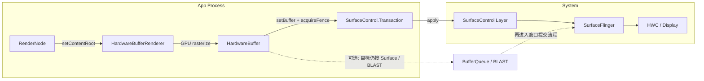
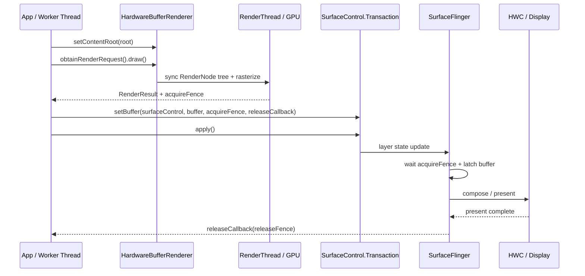

# Hardware Buffer Renderer

<!-- outline-start -->

**锚点（必须覆盖）：**
- 🔹 HardwareBufferRenderer 解决的核心问题：lockCanvas() 的性能瓶颈
- 🔹 GPU 硬件加速离屏渲染 vs CPU 软件渲染
- 🔹 API 使用流程：RenderRequest → GPU Rasterize → Fence → SurfaceControl
- 🔹 性能对比：lockCanvas() vs HardwareBufferRenderer
- 🔹 适用场景：HDR、跨进程 Buffer 共享、高帧率渲染

**扩展（可选深入）：**
- 🔸 Java API vs NDK API 的差异
- 🔸 与 RenderNode 的关系
- 🔸 在旧版本上的降级策略

<!-- outline-end -->

## 为什么需要 HardwareBufferRenderer

传统软件绘制走的是 `Surface.lockCanvas()` 这套方式。`lockCanvas()` 会先从 BufferQueue 取回一个 `GraphicBuffer`，把这块像素内存映射给 CPU，然后由 Skia 在 CPU 上逐像素写入；`unlockCanvasAndPost()` 再把写好的 buffer 交回系统。[已验证: §18.3 `Surface.cpp::lock()` / `unlockAndPost()`]

这条方式的成本主要有两类：

1. **CPU 光栅化开销高**：复杂矢量图、PDF 页面、大尺寸 Bitmap 缩放都会直接挤占 UI Thread 或调用方工作线程的时间。
2. **buffer 复用节奏由调用方自己管理**：software Canvas 依赖 dirty region、copyback、BufferQueue 槽位和 fence 同步；脏区失效或复用节奏过紧时，等待和内存搬运成本都会被放大。

**HardwareBufferRenderer**（Android 14 / API 34 引入）把同一类“离屏产出一块 buffer”的需求改成了 GPU 光栅化。调用方先用 `RenderNode` 记录绘制内容，再让 `HardwareBufferRenderer` 把结果画进 `HardwareBuffer`。如果后面直接接 `SurfaceControl.Transaction.setBuffer()`，buffer 可以直接交给 system compositor；如果目标对象后面接的仍是 `Surface`、BLASTBufferQueue 或其他 consumer，再按对应提交方式接回去。[已验证: `HardwareBufferRenderer.java` 类注释]

## 核心架构

把 `HardwareBufferRenderer` 放到整体渲染流程里看，定位会更稳。标准 View 硬件渲染由 `ViewRootImpl` 按 VSync 驱动，`RenderNode` 录制、`RenderThread` 调度、窗口 buffer 提交都在框架管理范围内。`HardwareBufferRenderer` 只接管离屏光栅化这一段，调用方要先准备 `HardwareBuffer`，录好 `RenderNode`，再触发一次 GPU 绘制。



这套模型把两件事改清楚了。光栅化从 CPU 写像素换成 GPU 写 `HardwareBuffer`，buffer 的归属也回到了调用方手里。software Canvas 拿到的是已经挂在 `Surface` / BufferQueue 后面的生产者入口，`unlockCanvasAndPost()` 之后的提交、同步、复用沿着窗口体系继续往下走。HBR 拿到的是一块独立 `HardwareBuffer`，提交目标和回收时机都要自己安排。要直接上屏，就走 `SurfaceControl.Transaction.setBuffer()`；要接回窗口体系，才会再碰到 `queueBuffer()` 或 BLAST。

排查时把职责拆开，判断会更清楚：

1. **HBR 负责把 `RenderNode` 树画进 `HardwareBuffer`**，不负责选 consumer，也不负责安排下一次 draw。
2. **执行阶段仍会落到硬件渲染栈**。Perfetto 里通常还能看到 app 进程的 `RenderThread` 和对应 GPU 工作，触发者从 `ViewRootImpl` 帧循环变成了 `RenderRequest.draw()`。
3. **提交与复用是另一层职责**。transaction 何时 `apply()`、buffer 何时能重用、是否需要多 buffer 池，都要靠调用方配套处理。


## API 使用

### Java API

Java 侧的调用顺序是：创建 `HardwareBuffer` → 记录 `RenderNode` 内容 → `setContentRoot()` → `obtainRenderRequest().draw()` → 把 `RenderResult` 交给 `SurfaceControl.Transaction`。

```java
HardwareBuffer buffer = HardwareBuffer.create(
        width,
        height,
        HardwareBuffer.RGBA_8888,
        1,
        HardwareBuffer.USAGE_GPU_COLOR_OUTPUT
                | HardwareBuffer.USAGE_GPU_SAMPLED_IMAGE
                | HardwareBuffer.USAGE_COMPOSER_OVERLAY);

RenderNode root = new RenderNode("HbrRoot");
RecordingCanvas canvas = root.beginRecording(width, height);
// 在这里记录 drawBitmap / drawText / drawPath 等操作
root.endRecording();

HardwareBufferRenderer renderer = new HardwareBufferRenderer(buffer);
renderer.setContentRoot(root);

HardwareBufferRenderer.RenderRequest request = renderer.obtainRenderRequest();
request.setColorSpace(ColorSpace.get(ColorSpace.Named.DISPLAY_P3));
request.draw(executor, result -> {
    if (result.getStatus() != HardwareBufferRenderer.RenderResult.SUCCESS) {
        return;
    }

    SurfaceControl.Transaction t = new SurfaceControl.Transaction();
    t.setDataSpace(surfaceControl, DataSpace.DATASPACE_DISPLAY_P3);
    t.setBuffer(surfaceControl, buffer, result.getFence(), releaseFence -> {
        // releaseFence signal 后，再把 buffer 放回池里
    });
    t.apply();
});
```

这段 Java API 有四个容易写错的点：

1. `setContentRoot()` 属于 `HardwareBufferRenderer`，不在 `RenderRequest` 上。
2. `HardwareBuffer.create()` 里给 GPU render target 至少要带 `USAGE_GPU_COLOR_OUTPUT`；direct `SurfaceControl.setBuffer()` 场景还要补 `USAGE_GPU_SAMPLED_IMAGE | USAGE_COMPOSER_OVERLAY`。[已验证: `HardwareBuffer.java` / `SurfaceControl.java`]
3. 原生 SDK 方法名是 `RenderResult.getFence()`，返回的 `SyncFence` 解决的是“consumer 什么时候能读这块 buffer”。`getSyncFence()` 属于其他封装命名，示例和正文里不要混用。SurfaceFlinger 在 latch 前要等它 signal。
4. `setBuffer(..., fence, releaseCallback)` 里的 callback 才对应“这块 buffer 什么时候能再次写”。如果不跟踪 release，同一块 buffer 连续覆写会把上一帧还在显示的内容踩掉。[已验证: `SurfaceControl.Transaction#setBuffer(..., Consumer<SyncFence>)`]

### NDK API

公开 NDK 没有 `AHardwareBufferRenderer_*` 这层封装。native 方案要自己把 `AHardwareBuffer` 接到 EGL / OpenGL ES、Vulkan 或其他图形 API，再用 `ASurfaceTransaction` 提交：

```cpp
// API 26+: 分配可给 GPU 写入、可给 SurfaceControl 消费的 buffer
AHardwareBuffer_Desc desc = {
    .width = width,
    .height = height,
    .layers = 1,
    .format = AHARDWAREBUFFER_FORMAT_R8G8B8A8_UNORM,
    .usage = AHARDWAREBUFFER_USAGE_GPU_COLOR_OUTPUT |
             AHARDWAREBUFFER_USAGE_GPU_SAMPLED_IMAGE |
             AHARDWAREBUFFER_USAGE_COMPOSER_OVERLAY,
};
AHardwareBuffer* buffer = NULL;
AHardwareBuffer_allocate(&desc, &buffer);

// 把 buffer 导入 EGL / OpenGL ES 或 Vulkan 作为 render target
// 渲染完成后导出 acquire fence fd，再交给 ASurfaceTransaction
int acquireFenceFd = -1;  // 由图形 API 的同步对象导出
// API 29-35 回收上一块 buffer 时，需要调用方从自己的 buffer 池取出已提交过的 buffer。
// 这里省略 buffer 池查找逻辑；没有上一块 buffer 时传 nullptr。
AHardwareBuffer* previousBuffer = nullptr;

ASurfaceTransaction* tx = ASurfaceTransaction_create();

// 按平台 API 拆成互斥分支，避免同一 transaction 重复设置 buffer。
#if __ANDROID_API__ >= 36
// API 36+: setBufferWithRelease 带回调版本（推荐）
// ASurfaceTransaction_OnBufferRelease callback 签名：
//   void (*)(void* context, int release_fence_fd)
// release_fence_fd 在回调参数中返回，不是 setBufferWithRelease 的入参。
struct CallbackContext {
    AHardwareBuffer* buffer;
    ASurfaceControl* surfaceControl;
};
CallbackContext* ctx = new CallbackContext{buffer, surfaceControl};
auto onBufferRelease = [](void* context, int releaseFenceFd) {
    if (releaseFenceFd >= 0) {
        sync_wait(releaseFenceFd, -1);
        close(releaseFenceFd);
    }
    CallbackContext* ctx = static_cast<CallbackContext*>(context);
    AHardwareBuffer_release(ctx->buffer);
    delete ctx;
};
ASurfaceTransaction_setBufferWithRelease(tx, surfaceControl, buffer,
                                         acquireFenceFd, ctx, onBufferRelease);
#else
// API 29-35 方案：使用 setBuffer() + OnComplete 回收被本次 transaction 替换掉的上一块 buffer。
// 注意：previous release fence 不属于当前刚提交的 buffer，当前 buffer 要等后续 transaction 替换它时再回收。
struct OnCompleteContext {
    AHardwareBuffer* previousBuffer;
    ASurfaceControl* surfaceControl;
};
OnCompleteContext* octx = new OnCompleteContext{previousBuffer, surfaceControl};

ASurfaceTransaction_setBuffer(tx, surfaceControl, buffer, acquireFenceFd);
// ASurfaceTransaction_OnComplete 签名：void (*)(void* context, ASurfaceTransactionStats* stats)
auto onComplete = [](void* context, ASurfaceTransactionStats* stats) {
    OnCompleteContext* ctx = static_cast<OnCompleteContext*>(context);

    // 从 transaction stats 获取指定 SurfaceControl 的 previous release fence。
    int prevReleaseFenceFd = ASurfaceTransactionStats_getPreviousReleaseFenceFd(
            stats, ctx->surfaceControl);

    if (ctx->previousBuffer != nullptr) {
        if (prevReleaseFenceFd >= 0) {
            sync_wait(prevReleaseFenceFd, -1);  // 等待 fence signal
            close(prevReleaseFenceFd);
        }
        AHardwareBuffer_release(ctx->previousBuffer);
    }
    delete ctx;
};
ASurfaceTransaction_setOnComplete(tx, octx, onComplete);
#endif

ASurfaceTransaction_apply(tx);
```

如果走 EGL / OpenGL ES 路径，`AHardwareBuffer` 不能直接当纹理或 render target 使用。常见做法是通过 `EGL_ANDROID_get_native_client_buffer` 拿到 `EGLClientBuffer`，再配合 `EGL_ANDROID_image_native_buffer` 创建 `EGLImage`，然后绑定到纹理或 framebuffer。Vulkan 路径则要按 external memory / Android hardware buffer 扩展导入。

NDK 侧的最小版本要分开记：

- `AHardwareBuffer` 分配与导入从 API 26 开始。
- `ASurfaceTransaction_setBuffer()` 从 API 29 开始。
- `ASurfaceTransaction_setBufferWithRelease()` 与 `ASurfaceTransaction_OnBufferRelease` 从 API 36 开始。[已验证: `android/surface_control.h`]

Android 10-15（API 29-35）只有 `ASurfaceTransaction_setBuffer()`，没有带 release 回调的 `setBufferWithRelease()`。这几个版本通过 `ASurfaceTransaction_setOnComplete()` 设置回调，回调签名直接传入 `ASurfaceTransactionStats*`（不需要 create/delete），再调用 `ASurfaceTransactionStats_getPreviousReleaseFenceFd(stats, surfaceControl)` 取回指定 SurfaceControl 的 previous release fence。这个 fence 只对应“被本次 transaction 替换或移除的上一块 buffer”，不能拿来回收本次刚提交的 buffer；本次 buffer 要等后续 transaction 替换它时，再从那次 OnComplete 中取 previous release fence。调用方仍要维护 buffer 池大小，但不再只能靠 in-flight 计数猜测回收时机。[已验证: `frameworks/native/include/android/surface_control.h`, `ASurfaceTransaction_setOnComplete()` 与 `ASurfaceTransactionStats_getPreviousReleaseFenceFd()` 自 API 29 可用]

不要把 acquire fence 当 release fence 用——前者表示 producer 写完，后者表示 consumer 不再占用。

## 性能对比

`HardwareBufferRenderer` 主要用于 CPU 光栅化已经成为主要成本的离屏绘制工作负载。大尺寸 PDF 页面、复杂 path、频繁缩放的 bitmap、wide color 或 HDR 离屏输出，通常更容易从 GPU 光栅化里受益。纯色块、简单文本或低分辨率静态内容，切到 HBR 后差距可能很小，事务提交和 buffer 同步还可能变成额外开销。

仓库里还没有同一设备、同一 workload 的 A/B benchmark 记录，下面只保留定性判断，定量数据继续标记为 `[待验证: 需补同设备 trace 或 benchmark 条件]`。

| 维度 | `lockCanvas()` | `HardwareBufferRenderer` |
|:---|:---|:---|
| 光栅化位置 | CPU 直接写入 dequeued `GraphicBuffer` | GPU 直接写入 `HardwareBuffer` |
| 提交路径 | `unlockCanvasAndPost()` → BufferQueue / BLAST | `SurfaceControl.Transaction.setBuffer()`；需要时再接回 `Surface` / BLAST |
| 颜色输出 | software Canvas 通常受限于软件绘制能力 | 可输出 `RGBA_FP16` / wide color buffer；HDR 还要配合 dataspace、display capability 和 compositor 支持 |
| CPU 占用 | 复杂绘制直接占用调用线程 | CPU 侧压力通常下降，但 GPU 与 driver 负载会上升 |
| 调度责任 | `Surface` / BufferQueue 负责大部分提交节奏 | 调用方要自己安排 `draw()` 频率、transaction 提交和 buffer 池 |
| 同步与复用 | acquire / release 多由 `Surface` / BufferQueue 维护 | `RenderResult.getFence()` 管 consumer 读取时机，release callback / release fence 管 buffer 再利用 |

做 A/B 时，至少固定四个条件：设备型号与 GPU、Android 版本、buffer 尺寸和格式、绘制内容复杂度与目标帧率。少掉任一项，表里的结论只能当方向判断，不能当预算数字。


## 渲染时序

direct `SurfaceControl.setBuffer()` 模式里，有两条 fence 要分开看：

- `RenderResult.getFence()`：GPU 写完这块 `HardwareBuffer` 后 signal。consumer 读取 buffer 前要等它。
- `setBuffer(..., releaseCallback)` / `ASurfaceTransaction_OnBufferRelease`：SurfaceFlinger / HWC 不再使用这块 buffer 时回给调用方的复用信号。



如果这个 `SurfaceControl` 后面还挂着 `SurfaceView`、BLASTBufferQueue 或其他标准窗口 consumer，显示阶段不会变；变化点只在 producer 这一侧。HBR 默认 producer 通过 transaction 提交 buffer，`queueBuffer()` 只在你主动把它接回标准窗口模型时出现。

## Buffer 复用与 release fence

`HardwareBufferRenderer` 最容易被写漏的一段，是“GPU 画完”和“系统用完”不是同一个时刻。`RenderResult.getFence()` 只解决前者，release fence / release callback 才决定后者。

常见复用方式有三种：

1. **单 buffer**：只有 release fence signal 后，才能再次覆写同一块 buffer。
2. **双 buffer**：当前帧在显示时，下一帧写另一块 buffer。大多数持续动画场景都会从这里起步。
3. **buffer pool**：高帧率或跨线程 producer 会维护 3 块以上 buffer，并把 release callback 接到池回收逻辑。

`HardwareBufferRenderer` 不会自动 clear 旧内容，所以“上一帧还在显示，本帧又开始写同一块 buffer”会直接产出错帧。连续渲染场景不要把 acquire fence 当成 release fence 用。

## 适用场景

### CPU 光栅化已经吃紧的离屏绘制

当离屏内容本身就是矢量、路径、滤镜或大图缩放，`lockCanvas()` 的成本会直接落到调用线程。HBR 把这段工作交给 GPU，更适合 PDF 页面缩略图、自绘卡片、复杂贴纸编辑器这类场景。

### 需要自己控制 layer 提交节奏的模块

如果业务本来就拿着 `SurfaceControl` 做 layer 管理，例如系统浮层、桌面卡片、远端内容镜像，HBR 输出 `HardwareBuffer` 后可以直接 transaction 提交，少绕一层 `Surface`。

### 需要跨进程共享 buffer 的模块

`HardwareBuffer` 能通过 Binder 传递。producer 进程离屏画完，consumer 进程拿到同一块 buffer 再做显示或二次处理，适合内容卡片、远程渲染、系统服务代绘这类模型。

### 需要 wide color 或 HDR 离屏结果的内容

software Canvas 很难覆盖 FP16 render target、dataspace 和 layer 级颜色控制。HBR 配合 `RGBA_FP16`、`setDataSpace()` 和显示能力探测，更适合图片编辑、相册预览、HDR UI 混排。

### wide color 与 HDR 要分开看

`HardwareBuffer.RGBA_FP16` 只说明 buffer 精度到了 FP16。要显示成 HDR，还要同时满足几件事：

1. Layer dataspace 要和内容匹配，通常要通过 `SurfaceControl.Transaction.setDataSpace()` 声明。
2. SurfaceFlinger、HWC 和 display 必须支持对应的 color mode / composition 能力。
3. 设备不支持时，系统可能回退成 SDR 合成、tone mapping，或者只把它当成普通 wide color buffer 处理。

`DISPLAY_P3` 只能说明 wide color gamut，不能替代 HDR capability。Android 15 / API 35 之后还有 `setDesiredHdrHeadroom()` 这类 layer 亮度 hint，可继续细化 HDR 合成目标，但前提仍是下游显示系统支持。[已验证: `HardwareBuffer.java` / `SurfaceControl.java`]


## 降级策略

Android 14 以下没有 `HardwareBufferRenderer`。常见回退方案有两类：

```java
if (Build.VERSION.SDK_INT >= Build.VERSION_CODES.UPSIDE_DOWN_CAKE) {
    // HardwareBufferRenderer + SurfaceControl.setBuffer()
} else {
    // Surface.lockCanvas() / EGL / Vulkan 等既有离屏方案
}
```

如果业务只是想得到一块离屏结果，旧版本可以继续用 `lockCanvas()` 或自建 EGL / Vulkan render target；如果业务依赖 direct `SurfaceControl` buffer 提交，还要把 `SurfaceControl.Transaction`、fence 和 buffer 池的最小 API level 一起算进去。

## 在 Perfetto 中识别

看 HBR 时不要只盯 GPU 轨道，按“发起 draw → `RenderThread` / GPU → transaction 提交 → `SurfaceFlinger` latch”这几段找证据会更稳。

- **调用线程**：先在 app 进程里找到执行 `RenderRequest.draw()` 的线程。持续动画若卡在这里，多半是在等可复用 buffer，或者上层业务还没把 `RenderNode` 录制完。
- **`RenderThread`**：HBR 没有绕过硬件渲染栈。trace 里通常还能看到 app 进程 `RenderThread` 的工作片段。这里忙而调用线程很轻，说明时间主要花在 GPU 光栅化。
- **GPU 轨道**：把 GPU slice 放到同一个 `draw()` 时间窗里看。GPU slice 很长，离屏内容本身通常偏重；GPU slice 很短但结果仍晚到，开销多半在 transaction 提交或 buffer 复用。
- **`SurfaceFlinger` 与 layer**：direct `setBuffer()` 场景里，会看到目标 layer 在 transaction 后进入 `SurfaceFlinger` 的 latch / present 节奏。acquire fence 等待长，说明 producer 完成晚。
- **BufferQueue / BLAST 轨道**：只有把 HBR 结果接回 `Surface`、`SurfaceView` 或 BLASTBufferQueue 时，才会出现熟悉的 dequeue/queue 节奏。看到这组轨道，就说明这次不是纯 transaction 直提交流程。

| 想确认的现象 | 优先看的位置 | 常见信号 |
|:---|:---|:---|
| 调用线程是否在等可复用 buffer | app 进程业务线程 / executor | `draw()` 触发点稀疏，线程被 fence 或锁等待截断 |
| GPU 光栅化是否过重 | app 进程 `RenderThread` + GPU 轨道 | 同一时间窗内两侧 slice 都拉长 |
| transaction 是否提得太晚 | `SurfaceFlinger` + 目标 layer | layer 进入 SF 的时间明显晚于业务触发时间 |
| 是否又走回 BufferQueue | BufferQueue / BLAST 轨道 | 出现 dequeue / queue 节奏 |

如果 trace 配置里打开了 FrameTimeline 或 `SurfaceFlinger` 数据源，排查顺序通常是：先用 layer 名确认目标 buffer 有没有进 SF，再回到 app 进程看 `RenderThread` 和调用线程，再看 GPU 时间窗。

## 常见问题与误区

### 把 acquire fence 当成 buffer 已可重用

`RenderResult.getFence()` 只说明 consumer 什么时候能开始读这块 buffer，不说明 producer 什么时候能安全覆写。可重用时机要看 release callback 或 release fence。

### 单 buffer 连续覆写却没有完整覆盖或 clear

HBR 不会自动清旧内容。单 buffer 方案下，只改一部分像素又没有显式 clear，很容易把上一帧残留带到下一帧。

### 把 HBR 当成窗口帧调度器

`RenderRequest.draw()` 只是一次离屏绘制请求，不会自动接入 `Choreographer` 的帧节奏。持续动画仍要自己安排触发频率、buffer 池和回收时机。

### 多线程同时操作同一个 `RenderRequest` 或 `HardwareBuffer`

`RenderRequest` 不是线程安全对象。draw 触发、transaction 提交、buffer 回收如果分散在多线程又没有串行化，同一块 buffer 很容易被重复提交，回调顺序也会和业务状态错位。

### 只配 `RGBA_FP16` 不配 dataspace 和显示能力

FP16 只解决精度问题，显示侧仍要看 dataspace、display capability、HWC 合成能力。设备不满足条件时，结果可能只是 wide color，甚至直接回退成 SDR。

## 与其他章节的关系

HardwareBufferRenderer 与 §18.2 的共同点，是两者都复用 `RenderNode` 和 app 进程里的硬件渲染栈，Perfetto 里也都可能落到 `RenderThread`。差别在调度边界。标准 View 路径由 `ViewRootImpl`、`Choreographer`、窗口系统串成完整帧循环；HBR 只借用其中的离屏 GPU 光栅化能力，buffer 分配、transaction 提交和回收都留给调用方。GPU 执行细节可继续看 §2.10，标准窗口提交路径可回看 §18.2。


## 参考资料

- Android API reference: `HardwareBufferRenderer#setContentRoot(RenderNode)` / `obtainRenderRequest()` / `RenderRequest.draw(Executor, Consumer)`
  https://developer.android.com/reference/android/graphics/HardwareBufferRenderer
- Android API reference: `HardwareBuffer` usage flags 与 `RGBA_FP16`
  https://developer.android.com/reference/android/hardware/HardwareBuffer
- Android API reference: `SurfaceControl.Transaction#setBuffer(...)` / `setDataSpace(...)` / `setDesiredHdrHeadroom(...)`
  https://developer.android.com/reference/android/view/SurfaceControl.Transaction
- AOSP: `frameworks/base/graphics/java/android/graphics/HardwareBufferRenderer.java`
- AOSP: `frameworks/base/core/java/android/hardware/HardwareBuffer.java`
- AOSP: `frameworks/base/core/java/android/view/SurfaceControl.java`
- NDK: `frameworks/native/include/android/surface_control.h` 中 `ASurfaceTransaction_setBuffer()` / `ASurfaceTransaction_setBufferWithRelease()` / `ASurfaceTransaction_OnBufferRelease`
