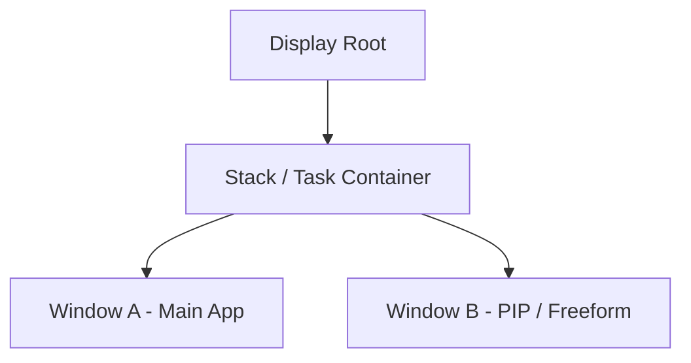
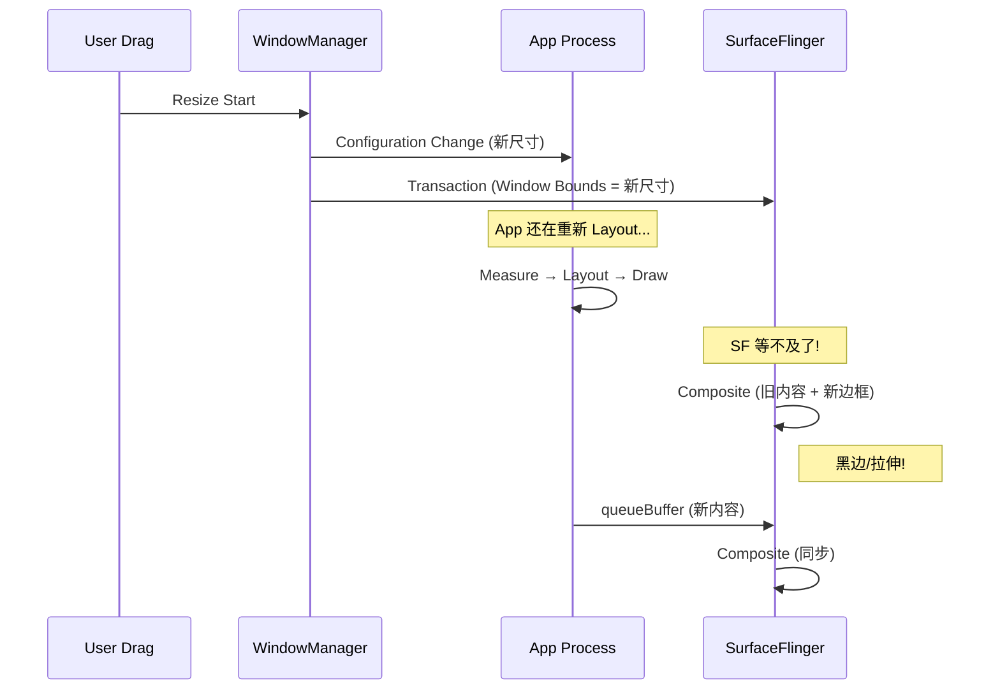

<!-- outline-start -->

**锚点（必须覆盖）：**
- 多窗口在 SurfaceFlinger 侧的 Layer 组织形式
- PIP 模式的渲染流程与性能考量
- Freeform 窗口 Resize 的竞态条件
- BLAST Sync 如何缓解 Resize 同步问题
- 在 Perfetto 中识别多窗口渲染问题

**扩展（可选深入）：**
- Android 12+ TaskFragment/RootTask 的层级变化
- 折叠屏场景下的多窗口渲染
- Configuration Change 对渲染的影响

<!-- outline-end -->

## 为什么多窗口的渲染值得关注

在 SurfaceFlinger 侧，所有的窗口都是 Layer Tree 的一部分。多窗口模式（PIP、Freeform、Split Screen）并没有引入新的渲染机制——它只是在 Layer Tree 中增加了更多 Layer。但多窗口引入了一个独特的性能问题：**窗口 Resize 的同步竞态**。

当用户拖拽 Freeform 窗口的边框时，窗口尺寸在变化，但 App 需要时间重新 Layout 和 Draw。如果 SF 合成时 App 还没画完新尺寸的内容，就会出现黑边或内容拉伸。理解这个竞态条件，是分析和修复多窗口渲染问题的关键。[已验证: AOSP WindowManagerService]

## Layer 组织架构

- **Task Layer**：系统为每个 Task 创建一个根容器 Layer
- **Activity Layer**：Task 下面挂载各个 Activity 的 SurfaceControl
- **App Surface**：Activity 下面是 App 的 Window Surface

每个独立窗口都有自己的 BufferQueue，所有可见窗口都会收到 VSync 信号。

## PIP（画中画）渲染流程

### 进入 PIP

1. App 调用 `enterPictureInPictureMode()`。
2. WindowManagerService 使用 SurfaceControl 动画 API 将 App Surface 缩小并移动到角落。
3. 动画过程中 App 仍在全分辨率渲染（或根据 Configuration Change 变为小分辨率）。

### 持续渲染

PIP 模式下，App 的渲染循环与全屏模式完全一致：VSync → Draw → Submit → Composite。SF 将其作为一个小 Layer 合成到屏幕上。

### 性能考量

- **额外合成成本**：PIP 窗口悬浮在其他内容之上，HWC 是否能复用底层 Layer 取决于设备策略
- **Resource Budget**：系统通常限制 PIP 窗口的 CPU/GPU 优先级，确保前台 App 流畅
- **Touch Input**：输入事件分发到 PIP 窗口，App 需要处理小窗口下的点击逻辑

## Freeform Resize 竞态条件

这是多窗口渲染中最经典的性能问题。当用户拖拽 Freeform 窗口边框时：

竞态根因：WMS 先更新了窗口边界，但 App 还没画完新尺寸的内容。SF 合成时看到的是旧内容 + 新边框。

### BLAST Sync 解决方案

Android 12+ 通过 BLAST 事务模型显著缓解此问题：

1. **Sync Token**：WMS 为这次 Resize 生成一个 Token。
2. **App Barrier**：App 完成新尺寸渲染后，带着同一个 Token 提交 Buffer。
3. **SF 等待**：SF 收到 Window Bounds Transaction 时，尝试等待对应 Token 的 Buffer。
4. **原子应用**：两者更容易在同一提交边界内生效。

### Trace 定位

在 Perfetto 中查找：
- `wm_task_moved` / WindowManager 相关 slice：标记 Resize 开始
- `Transaction.apply`：查看是否带有 SyncId
- SurfaceFlinger 的 Transaction 等待 slice：如果很长，说明 App 响应慢

### 优化建议

1. **减少 Configuration Change 开销**：避免在 `onConfigurationChanged` 中做重计算
2. **预渲染策略**：Chrome 会预渲染几个常见尺寸的 Bitmap Cache
3. **Skeleton UI**：Resize 过程中显示骨架屏而非空白

## 在 Perfetto 中识别多窗口问题

| 现象 | 可能原因 | Trace 特征 |
|:---|:---|:---|
| 黑边/拉伸 | Resize 竞态 | App 的 queueBuffer 与 WMS Transaction 时间差 |
| PIP 卡顿 | BufferQueue 压力 | PIP 窗口的 dequeueBuffer 阻塞 |
| 合成开销增大 | Layer 数量增多 | SF 的 Composite 耗时增加 |

## 与其他章节的关系

- **2.12 Window Manager Service**：WMS 的窗口管理机制
- **18.10 SurfaceControl API**：多窗口动画和 Layer 操控的底层 API

## 参考资料

- AOSP `frameworks/base/services/core/java/com/android/server/wm/`
- Android 官方文档：Picture-in-Picture
- Android 官方文档：Multi-Window Support
