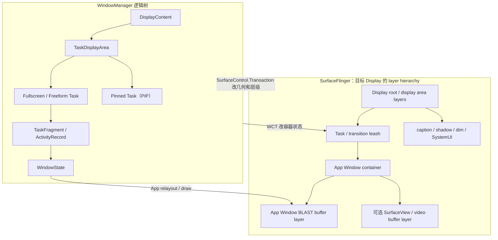
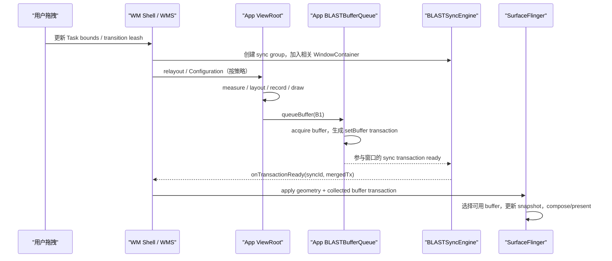

---

title: "PIP 与自由窗口渲染"
chapter: "18.18"
section: "18.18"
section_title: "PIP 与自由窗口渲染"
status: finalized
applicable_versions: "Android 8.0 (API 26) - Android 17 (API 37)"
last_verified: "2026-07-07"
last_verified_against: "AOSP android-17.0.0_r1 ViewRootImpl / Choreographer / DisplayEventReceiver / BLASTBufferQueue / TaskOrganizer / WindowContainerTransaction / PipTaskOrganizer；Android Picture-in-Picture / Multi-Window / SurfaceView 官方文档"
sources:
  - type: official
    path: "frameworks/base/core/java/android/view/ViewRootImpl.java"
  - type: official
    path: "frameworks/base/core/java/android/view/Choreographer.java"
  - type: official
    path: "frameworks/base/core/java/android/view/DisplayEventReceiver.java"
  - type: official
    path: "frameworks/native/libs/gui/BLASTBufferQueue.cpp"
  - type: official
    path: "frameworks/base/core/java/android/window/TaskOrganizer.java"
  - type: official
    path: "frameworks/base/core/java/android/window/WindowContainerTransaction.java"
  - type: official
    path: "frameworks/base/libs/WindowManager/Shell/src/com/android/wm/shell/pip/PipTaskOrganizer.java"
  - type: official
    path: "frameworks/base/libs/WindowManager/Shell/src/com/android/wm/shell/transition/Transitions.java"
  - type: official
    path: "https://developer.android.com/develop/ui/views/picture-in-picture"
  - type: official
    path: "https://developer.android.com/guide/topics/large-screens/multi-window-support"
  - type: official
    path: "https://developer.android.com/reference/android/view/SurfaceView"
tags: ["PIP", "画中画", "Freeform", "多窗口", "SurfaceControl", "BLAST", "渲染路径"]
related_chapters: ["2.6", "2.12", "18.10"]
created_by: "rendering-pipelines-merge"
created_date: "2026-04-09"
pipeline_stage: ready-to-publish
task6_state: reviewed
task9_state: reviewed
task9_result: pass-tech-review
task2b_state: fixed
task2b_result: fixed-lite
last_task2b_lite_at: 2026-07-07
reviewed_date: 2026-07-07
reviewed_by: openclaw-task6
task6_result: pass-light-edit
last_task9_at: "2026-07-07T12:33:06+08:00"
last_task9_audit: 2026-07-07
last_task9_audit_log: "logs/deep-review/2026-07-01-04-audit.md"
task9_reviewed_date: "2026-07-07"
task9_reviewed_by: "openclaw-task9"
last_task6_audit: "2026-06-27"
review_round: 1
deepseek_cn_review_state: done
last_deepseek_cn_review_at: 2026-07-07
review_notes: '2026-07-07 Task2B Verifier: task9_result 重复键修正（pass-tech-review → needs-rework），status finalized → ready-for-review | 2026-07-07 Task6 复审：pass-light-edit。修复 frontmatter 重复键 task2b_result（fixed-lite 正确）；无新增 B 类回炉项；转 Task9 复审。'
last_task6_at: 2026-07-07T12:15:00+08:00
last_task6_review_log: logs/review/2026-07-07-04-review.md
last_task9_review_log: "logs/deep-review/2026-07-07-12-deep-review.md"
task9_review_notes: "2026-07-07 Task9 deep-review：复核 TaskOrganizer Android 12+ 版本限定、BLASTBufferQueue Android 17 源码锚点与 Perfetto 定位路径；P0/P1/P2 0，queue 无 pending，自动晋升 finalized。"
finalized_date: "2026-07-07"
finalized_by: "openclaw-task9-auto-promote"
---
<!-- outline-start -->

**锚点（必须覆盖）：**
- 多窗口在 SurfaceFlinger 侧的 Layer 组织形式
- PIP 模式的渲染流程与性能考量
- Freeform 窗口 Resize 的竞态条件
- BLAST Sync 如何缓解 Resize 同步问题
- 在 Perfetto 中识别多窗口渲染问题

**扩展（可选深入）：**
- Android 12+ TaskFragment/RootTask 的层级变化
- 折叠屏场景下的多窗口渲染
- Configuration Change 对渲染的影响

<!-- outline-end -->

## 多窗口问题要先分清三个对象

PiP、Freeform、分屏和桌面窗口是 WindowManager 的窗口形态，不是新的应用绘制引擎。普通 View 仍走 `ViewRootImpl → HWUI → Surface/BLAST`，视频 `SurfaceView` 仍由 codec 或播放器向自己的 Surface 供帧。变化集中在三处：

- **Window/Task 的管理状态**：windowing mode、bounds、父子关系、focus、Insets；
- **SurfaceFlinger 的 layer 状态**：position、crop、alpha、Z-order、reparent，以及应用提交的 buffer；
- **Display 的合成状态**：同屏可见 layer 集合、DEVICE/CLIENT composition、present deadline 和 per-display fence。

分析前应建立 `Display → Window/Task → pid/tid/ViewRoot → SF layer/BufferQueue` 映射。屏幕上看见两个面板，不代表有两个 Window；同一进程里的两个 Window 也不代表它们有两套主线程和 RenderThread。

## Android 17 的容器树与 layer 树

WindowManager 维护的是逻辑容器树。Android 17 常见节点包括：

- `RootWindowContainer` / `DisplayContent`
- `DisplayArea` / `TaskDisplayArea`
- `Task` / `TaskFragment`
- `ActivityRecord` / `WindowToken` / `WindowState`

PiP 通常表现为 pinned windowing mode 下的 Task；Freeform/desktop 则是带独立 bounds 的 Task。Android 17 的 desktop windowing 还引入按 Display 决定 desktop eligibility 和 desktop-first/touch-first 状态的能力，其状态源位于对应 Display 的 `TaskDisplayArea`。

这棵 WMS 树不能机械映射成 SurfaceFlinger layer 树。Shell transition 可以创建临时 leash，把 Task 或 Activity surface reparent 到 leash 上做位移、缩放和透明度动画；圆角、阴影、dim、caption、输入法和 `SurfaceView` 还会增加 container/effect/buffer layer。下面只表示职责关系，不表示每台设备的固定节点数量：



SurfaceFlinger 收到的是多方 transaction：WMS/Shell 改 layer 几何，应用 BLAST 提交 App Window buffer，codec/相机/引擎还可能更新独立 Surface。SF FrontEnd 更新 layer state 和 snapshot，再由目标 Display 的 CompositionEngine/HWC 处理可见 layer 集合。一个 Window 是否顺利出帧，不能只看它自己的 `doFrame()`。

### 三种 transaction 不能混写

下面这段职责示意用来区分名字相近的接口，不是可编译代码：

```text
WindowContainerTransaction（WCT）
  setBounds(task / taskFragment)
  setWindowingMode(...)
  reparent / hierarchy operation
  -> 改 WindowManager 的高层容器状态

SurfaceControl.Transaction
  setPosition / setCrop / setAlpha / setLayer
  show / hide / reparent
  -> 原子修改 SF layer 状态

App BLAST buffer transaction
  setBuffer(app window layer, buffer, acquire fence, frame number)
  setDataspace / damage / transform / frame timeline
  -> 提交应用这一帧的像素内容
```

WCT 不携带应用下一块 buffer；SurfaceControl 几何 transaction 也不能证明 App 已按新尺寸完成绘制。PiP/resize 的错帧，常来自这三类状态没有在目标 display frame 形成预期组合。

## 多窗口怎样共享帧调度资源

同一 UI Looper 上的多个 `ViewRootImpl` 会取得同一个 ThreadLocal `Choreographer`。各窗口把 traversal callback 放进同一个 Looper，callback 到期后仍在 UI 线程串行执行。Window A 的 `performTraversals()` 很长，会压缩 Window B 在同一 VSync 周期内可用的主线程时间。

同一进程的硬件加速窗口各有 renderer/`CanvasContext` 和独立 Surface，但共享进程级 HWUI RenderThread。它们的 `DrawFrame`、buffer dequeue 和 layer update 会进入同一 RenderThread 任务系统。共享线程不等于共享 BufferQueue：每个顶层 Window 仍有自己的 BLAST/buffer 周转和 release 约束。

跨进程窗口各有 UI Looper、Choreographer connection 和 RenderThread。它们不在应用线程上串行，却仍会在同一 Display 上竞争：

- SurfaceFlinger/RenderEngine 的处理时间；
- HWC overlay plane、scaler 和带宽；
- GPU、内存带宽、CPU 与 thermal budget；
- 同一 display mode 和 present deadline。

多 Display 还要再拆一层。每个 Display 有自己的可见 layer set、mode、HWC strategy 和 present fence；不能拿内屏的一次 present 解释外接屏结果。

## PiP 的渲染流程

### 进入 PiP 时谁在做什么

应用通过 `PictureInPictureParams` 和 `enterPictureInPictureMode()`，或 Android 12+ 的 auto-enter 路径请求进入 PiP。之后大体会发生：

1. WindowManager 把目标 Task 切到 pinned windowing mode，计算 PiP destination bounds。
2. WM Shell 的 PiP/transition 组件取得 Task leash。Android 17 的 `PipTaskOrganizer` 注释明确说明：它监听 Task 进入/离开 PiP，动画期间连续应用 `SurfaceControl.Transaction`，结束时再提交最终 `WindowContainerTransaction`。
3. transition handler 对 leash 做 position、crop、scale、round、alpha 等动画。应用原有 App Window buffer 位于这棵子树内，因此系统可以先变换旧内容，不必等待应用每个动画采样点都画一块新 buffer。
4. 应用根据 PiP 状态、Configuration 或 layout 变化更新 UI；View/RenderThread 或独立视频 producer 继续按各自节奏提交 buffer。
5. SurfaceFlinger 在目标 Display 上合并当前 layer 状态和可用 buffer，HWC 或 RenderEngine 完成合成。

这个过程没有为 PiP 新建一套 VSync 或 BufferQueue 规则。视频可以保持 24/30fps，Display 仍按 60/90/120Hz present；SF 在多个 display frame 中复用同一块 PiP 视频 buffer 是正常的，不能按“每个 VSync 都没有新 BufferTX”判为丢帧。

[Android 17 `PipTaskOrganizer.java`](https://android.googlesource.com/platform/frameworks/base/+/android-17.0.0_r1/libs/WindowManager/Shell/src/com/android/wm/shell/pip/PipTaskOrganizer.java) 是控制面入口；应用窗口的像素提交仍要回到 [`ViewRootImpl.java`](https://android.googlesource.com/platform/frameworks/base/+/android-17.0.0_r1/core/java/android/view/ViewRootImpl.java) 和 BLAST 路径。

### `PictureInPictureParams` 直接影响过渡质量

PiP 参数不是装饰信息，几项配置会改变 transition 的处理方式：

- `sourceRectHint` 应指向进入 PiP 后仍可见的内容区域，例如视频 View 的窗口坐标 bounds。Android 12+ 进入和退出动画都会使用它；它是 transition hint，不是持续阶段的 buffer crop API。
- `setAutoEnterEnabled(true)`（API 31+）让系统在手势返回桌面时更早掌握进入 PiP 的意图，避免应用等到较晚的生命周期 callback 才发起切换。
- `setSeamlessResizeEnabled(true)` 只适合可以被系统连续缩放而不出现布局伪影的内容，典型是视频。Android 17 源码注释说明，设为 `false` 时系统会使用额外 transition 遮盖 resize artifact；复杂非视频 UI 应按视觉结果选择。
- target Android 15 / API 35+ 的应用可通过 `onPictureInPictureUiStateChanged()`，在 enter animation 开始时获知 `isTransitioningToPip()`，及时隐藏标题、推荐卡片等 PiP 不需要的 overlay，避免动画结束后才骤然消失。

应用应在内容 bounds 或宽高比变化时更新 params。一个很常见的错误是只在 Activity 创建时算一次 `sourceRectHint`，旋转、折叠或播放器 layout 改变后继续使用旧坐标。

### PiP 的主要性能风险

| 风险 | 发生机制 | 应看证据 |
|:---|:---|:---|
| 新 bounds 配旧 buffer | leash geometry 已推进，应用或视频 producer 尚未提供目标内容 | Shell transaction、App BufferTX、目标 DisplayFrame |
| HWC 路径变化 | 圆角、阴影、alpha、遮挡、HDR/SDR 混合改变整屏 layer 条件 | HWC composition type、client target、SF/GPU 时间 |
| resize 时内存峰值 | 旧大 buffer 尚未 release，新尺寸 buffer 已开始分配/queue | buffer id/size、dequeue、release fence、内存轨道 |
| UI 切换过晚 | 非必要控件直到 enter animation 结束才隐藏 | PiP UI state callback、app traversal、录屏 |
| producer cadence 错误 | PiP 后仍以不必要的高分辨率/高帧率生产，或生命周期误停播 | codec/engine timestamp、buffer size、`onPause`/`onStop` |

SurfaceFlinger 把 layer 缩小，不会自动降低 producer 分辨率或帧率。是否在稳定 PiP 阶段重配 decoder/surface，要在画质、切换成本、功耗和内存之间测量；不要在 transition 每一个 bounds 变化上反复销毁 Surface。

## Freeform Resize 的竞态

Freeform/desktop 拖拽把“geometry 与 buffer 来自不同模块”放大了。系统实现可以在过渡 leash 上连续缩放旧 buffer，也可以向应用发送一系列 bounds/configuration 变化；具体策略受平台版本、Shell transition、设备配置和 resize 模式影响，不能假设每个指针采样都对应一次 `measure → layout → draw`。

把旧状态记作 `G0/B0`，新状态记作 `G1/B1`，SF 可能暂时看到：

| 组合 | 视觉结果 |
|:---|:---|
| `G0 + B0` | 仍显示旧窗口，内容一致 |
| `G1 + B0` | 旧内容被缩放、裁剪或 letterbox；策略不当时出现拉伸/黑边 |
| `G1 + B1` | 新几何与新内容一致 |
| snapshot/starting layer | 系统用替代内容覆盖应用重绘间隙 |

`G0 + B1` 通常是需要避免的错误组合：应用已经按新配置生成内容，控制它的 layer geometry 却仍停在旧状态。同步组件的任务是收集参与对象的 transaction，让系统在合适的 display frame 应用预期组合；它不是强制整个 Display 等待所有 producer。

下面的时序展示一次需要应用重绘的 resize。虚线之外的视频/相机 producer 若没有加入同一同步关系，不会自动被等待：



图中 BQ 到 sync group 的箭头表示职责关系，不是一次从 native BLAST 直接调用 Java `BLASTSyncEngine`：buffer transaction 会经对应 WindowContainer 的 sync transaction 被 WMS 收集。

Activity 是否重建取决于 `configChanges` 声明和实际 Configuration 变化。自行处理配置不会免除 layout 适配；让系统重建也要求可靠保存 UI/播放状态。折叠姿态、旋转、caption/Insets、Display 切换可能与 resize 同时发生，排查时要记录完整 `Configuration` 和 WindowMetrics，不能只看宽高。

## “BLAST Sync”有两层含义

### App Window 的 `BLASTBufferQueue`

Android 17 的 `BLASTBufferQueue::acquireNextBufferLocked()` 会从 BufferQueue 取得下一块 buffer，把 buffer、acquire fence、frame number、dataspace、HDR metadata、damage、crop、transform 和 FrameTimeline 信息放入 `SurfaceComposerClient::Transaction`，再合入等待该 frame number 的 transaction。

源码还有一个直接针对 resize artifact 的保护：在 scaling mode 为 `FREEZE` 时，只有新 buffer 尺寸匹配 requested size，才更新 destination size；否则避免 destination bounds 先变而拉伸不匹配的 buffer。

`syncNextTransaction()` 用于把下一次取得的 buffer 放进一份 sync transaction，`mergeWithNextTransaction()` 则按 frame number 合并外部 transaction。这些能力解决“应用窗口的下一块 buffer 与相关 layer 状态如何一起提交”，不会凭空知道业务所说的“下一帧视频”是哪一块。

[Android 17 `BLASTBufferQueue.cpp`](https://android.googlesource.com/platform/frameworks/native/+/android-17.0.0_r1/libs/gui/BLASTBufferQueue.cpp) 可核查 `acquireNextBufferLocked()`、`syncNextTransaction()` 和 `mergeWithNextTransaction()`。

### system_server 的 `BLASTSyncEngine`

WMS 内部 `BLASTSyncEngine` 建立 `SyncGroup`，监视注册的 `WindowContainer` 子树何时进入 finished 状态：收到所需绘制内容，或对象消失。group ready 后，它把收集的 `SurfaceControl.Transaction` 交给 transition/调用方；重叠 group 还可能被串行化或建立依赖，并有 timeout 兜底。

它只等待加入 group 的对象。独立 camera、codec、游戏引擎 producer 如果没有通过受控 Surface 参与这份同步，WMS 不能为它推导内容语义。[Android 17 `BLASTSyncEngine.java`](https://android.googlesource.com/platform/frameworks/base/+/android-17.0.0_r1/services/core/java/com/android/server/wm/BLASTSyncEngine.java)

### API 34+ 的 `SurfaceSyncGroup`

公开 `SurfaceSyncGroup` 面向应用和嵌入 Surface，可配合 `AttachedSurfaceControl`、`SurfaceControlViewHost.SurfacePackage` 等对象收集 transaction。它和 WMS 内部 `BLASTSyncEngine` 目的相近，但 API、权限、参与对象和生命周期不同。不能因为都带 “SyncGroup” 就把两者的 trace 或 ready 条件混在一起。

同步也不是越大越好。等待对象越多，任一慢窗口或失效对象都可能延长 transition；只应把必须原子呈现的对象纳入同一组。

## SurfaceFlinger 与 HWC 的多窗口成本

HWC 按整个 Display 的可见 layer 集合选择 composition strategy，不按“某个 App 自己是否简单”单独决定。PiP、Freeform 和 desktop 场景里，以下变化都可能让 DEVICE/CLIENT 分配改变：

- PiP 的圆角、alpha、crop、scale 和 transition leash；
- desktop caption、shadow、dim、taskbar、IME 与更多重叠窗口；
- 不同 buffer format、dataspace、HDR metadata、protected usage；
- overlay plane/scaler/bandwidth 的设备限制；
- Display mode、rotation、color mode 和全局变换。

窗口数量增加不保证进入 CLIENT composition；一个带复杂变换或特殊格式的 layer 也可能改变策略。要比较异常前后的完整 layer set 和 HWC composition type，不能只看 PiP layer 名。

`FLAG_SECURE` 与 protected buffer 也要分开：前者约束截图/录屏和非安全 Display，后者要求受保护的读取与显示路径。protected PiP 无法取得合适硬件路径时可能黑屏，不能让普通 RenderEngine 随意采样作为回退。

Android 17 的公共 kernel 锚点只解释通用调度与 fence：[`kernel/sched/core.c`](https://android.googlesource.com/kernel/common/+/android17-6.18-2026-06_r6/kernel/sched/core.c)、[`sync_file.c`](https://android.googlesource.com/kernel/common/+/android17-6.18-2026-06_r6/drivers/dma-buf/sync_file.c) 和 [`dma-fence.c`](https://android.googlesource.com/kernel/common/+/android17-6.18-2026-06_r6/drivers/dma-buf/dma-fence.c)。某台设备的 DPU、HWC plane 或 Display driver 延迟仍要看 vendor 实现和设备 trace。

## Android 8 到 Android 17 的分析边界

| 平台 | 变化 | Review 时怎么用 |
|:---|:---|:---|
| Android 8 / API 26 | 手机 PiP 进入公开平台能力 | 进入/退出小窗要同时看 Task 几何和内容供帧 |
| Android 11 / API 30 | BLASTBufferQueue 进入现代 App Window 提交路径 | resize 要对齐 App buffer transaction 与 layer geometry |
| Android 12 / API 31 | WM Shell transition/PiP 控制与 FrameTimeline 成为现代分析基线；PiP 增加 auto-enter、seamless resize | PiP 过渡要结合 Shell transition、source rect 与 SurfaceFrame/DisplayFrame |
| Android 12L / API 32 | 大屏多任务和 Activity Embedding 普及 | 可见双栏可能是一个 Task window 内的 TaskFragment，不一定是两个 Window |
| Android 14 / API 34 | 公开 `SurfaceSyncGroup` | 应用/跨进程嵌入 Surface 可显式建立同步组 |
| Android 15 / API 35 | PiP UI transition state、target 35 edge-to-edge 等行为影响 UI/Insets | PiP enter 可更早隐藏 overlay；resize/IME 要检查 Insets |
| Android 16 / API 36 | OEM 可配置 desktop windowing；target 36 大屏方向/宽高比/resizability 限制开始被忽略，但有临时 opt-out | 测试 freeform、外接屏、旋转与配置重建 |
| Android 17 / API 37 | per-display desktop windowing；target 37 在大屏移除上述 opt-out | 按 Display 记录 desktop state；固定方向和不可 resize 不能再作为大屏布局前提 |

Android 17 的 target 37 规则适用于 `sw ≥ 600dp` 大屏：固定方向值、`resizeableActivity`、`minAspectRatio`、`maxAspectRatio` 等限制被忽略；小于 `sw600dp`、按 `android:appCategory` 分类的游戏，以及用户在 aspect ratio 设置里明确选择应用偏好的情况属于例外。这个行为增加应用遇到 resize/configuration 的机会，没有替换 BLAST、SurfaceFlinger 或 HWC 主路径。

Android 17 的 per-display desktop windowing 还意味着内屏和外接屏可以处于不同 desktop-first/touch-first 状态。窗口从一块屏移动到另一块屏时，要重新记录 displayId、density、WindowMetrics、refresh rate、color mode、Insets 和 present fence。

## Perfetto：从目标 DisplayFrame 反向定位

抓取至少应包含：

- `sched`、CPU frequency/idle，应用 main/RenderThread/producer 线程；
- WindowManager 与 WM Shell transition；
- SurfaceFlinger transactions/layers；
- FrameTimeline、Graphics/BufferQueue；
- GPU/HWC 轨道（设备支持时）；
- 内存轨道（调查 resize 峰值时）。

### 建立 Window 表

先为每个可见对象记录下面的映射，避免把同名旧 layer 或另一块 Display 的 frame 接进来：

| 维度 | 需要记录 |
|:---|:---|
| 归属 | uid、pid、package、Activity/PiP/SystemUI |
| 执行 | UI tid/Looper、ViewRoot、RenderThread tid、独立 producer 线程 |
| WMS | displayId、Task/TaskFragment、WindowState、windowing mode、bounds |
| SF | container/leash/buffer layer id、parent、Z、crop、visibility |
| Buffer | BLAST/BufferQueue 名、frame number、buffer id/size、fence |
| FrameTimeline | SurfaceFrame、DisplayFrame、expected/actual present |

### 可执行的定位顺序

1. 在录屏或事件标记上确定 PiP enter/exit 或 resize 的时间窗，并选中发生异常的目标 DisplayFrame。
2. 在 WMS/Shell 轨道找 WCT、sync id、transition id、leash 动画和 bounds 变化，确认 geometry 从哪一帧开始推进。
3. 回到目标应用 main thread，检查 `performTraversals()`、relayout Binder、Configuration/Insets dispatch 和 Activity 重建。
4. 在 RenderThread 或独立 producer 上找 draw、`dequeueBuffer()`、GPU submit、`queueBuffer()`；确认慢的是 App Window 还是视频/相机子 Surface。
5. 在 BLAST/SF 侧找对应 layer 的 `QueuedBuffer`、`BufferTX`、frame number、buffer size 和 acquire fence，确认像素内容何时进入 SF。
6. 对齐 geometry transaction 与 buffer transaction 在哪个 DisplayFrame 生效，再检查 SurfaceFlinger 是否等待 fence、复用旧 buffer 或使用 snapshot。
7. 比较异常前后的 DEVICE/CLIENT、client target、GPU 合成和 HWC/present fence，确认是否为整屏合成策略变化。
8. 从 release fence 回到 producer，判断下一块 buffer 是否因池耗尽而产生背压。

不要依赖某个厂商版本一定存在 `latchBuffer` 文字 slice。`BufferTX - <layerName>`、`QueuedBuffer - <window>BLAST#<id>`、FrameTimeline 名称也可能因版本或 trace 配置变化；layer id、frame number、transaction flow 和时间关系才是更稳的证据。

### 常见症状的证据方向

| 症状 | 起点 | 需要排除 |
|:---|:---|:---|
| PiP 进入时闪一下 | `sourceRectHint`、Shell overlay/leash、App 首块 PiP 内容 | 只凭录屏归因 App draw |
| Freeform 拖拽拉伸 | requested/buffer size、destination frame、leash scale、sync group | 把所有缩放都判为 BLAST 失败 |
| 同进程 Window B 总是晚 | UI traversal 顺序、共享 RenderThread 队列、Window A fence wait | 只量 Window B 自己的 draw duration |
| App 两侧都按时，整屏仍 miss | SF transaction、client composition、HWC、present fence | 用单个 App FrameTimeline 代表 Display |
| 外接屏异常、内屏正常 | displayId、mode、per-display desktop state、Output/HWC fence | 合并两块屏的 present 时间线 |
| resize 时内存尖峰 | 新旧 buffer size/id、release fence、Activity/Surface 重建 | 把稳定态 buffer 数量乘法当作峰值 |
| protected PiP 黑屏 | secure/protected 属性、目标 Display 与硬件保护路径 | 假设普通 GPU client composition 可兜底 |

## 应用侧改进

### PiP

- 持续更新正确的 `sourceRectHint` 和 aspect ratio；Android 12+ 手势导航场景优先 auto-enter。
- 视频等可连续缩放的内容才启用 seamless resize；非视频复杂 UI 先验证视觉结果。
- API 35+ 在 `isTransitioningToPip()` 阶段隐藏无关 overlay，退出时再按 mode callback 恢复。
- 不要在进入 PiP 的 `onPause()` 无条件停止视频；按官方生命周期建议在 `onStop()`/`onStart()` 或显式 PiP 状态下管理播放。
- 稳定 PiP 阶段是否降低解码分辨率/帧率要靠功耗和画质测试，transition 中避免频繁销毁 Surface。

### Freeform、折叠屏与 desktop

- 使用 WindowMetrics/自适应布局，不从物理 Display 尺寸推导当前窗口尺寸。
- 把状态保存和尺寸适配分开；Activity 重建与自行处理 Configuration 两条路径都要测试。
- 缩短 relayout/configuration 热路径，避免同步 I/O、大图解码和重型对象重建占住 UI 线程。
- Camera/SurfaceView/游戏引擎要按新 bounds 计算 aspect ratio、crop、rotation；独立 Surface 不会自动继承 View 布局的内容语义。
- 测试连续拖拽、快速最大化/还原、跨 Display 移动、IME、caption、旋转、折叠姿态和进程重建。

## Review 清单

- [ ] 已确定目标 displayId，而不是默认所有窗口都在内屏
- [ ] 已区分普通 View 双栏、TaskFragment 和独立顶层 Window
- [ ] 每个 Window 的 pid、UI tid、ViewRoot、RenderThread 与 producer 已映射
- [ ] WMS 逻辑 parent 与 SF leash/layer parent 都已记录
- [ ] WCT、SurfaceControl geometry transaction、App buffer transaction 已分开
- [ ] PiP 的 `sourceRectHint`、auto-enter、seamless resize 和 UI state callback 已核查
- [ ] Freeform resize 中的 geometry/buffer 组合已落到具体 DisplayFrame
- [ ] `BLASTBufferQueue`、`BLASTSyncEngine`、`SurfaceSyncGroup` 没有混用
- [ ] sync group 的参与对象、ready 条件与 timeout 已确认
- [ ] acquire/release/present fence 已按 buffer 和 Display 标注
- [ ] HWC strategy 已按整个可见 layer set 比较
- [ ] Android 17 target 37 大屏行为与 per-display desktop state 已测试

## 参考资料

- [Android 17 AOSP：ViewRootImpl.java](https://android.googlesource.com/platform/frameworks/base/+/android-17.0.0_r1/core/java/android/view/ViewRootImpl.java)
- [Android 17 AOSP：Choreographer.java](https://android.googlesource.com/platform/frameworks/base/+/android-17.0.0_r1/core/java/android/view/Choreographer.java)
- [Android 17 AOSP：RenderThread.cpp](https://android.googlesource.com/platform/frameworks/base/+/android-17.0.0_r1/libs/hwui/renderthread/RenderThread.cpp)
- [Android 17 AOSP：PictureInPictureParams.java](https://android.googlesource.com/platform/frameworks/base/+/android-17.0.0_r1/core/java/android/app/PictureInPictureParams.java)
- [Android 17 AOSP：WindowContainer.java](https://android.googlesource.com/platform/frameworks/base/+/android-17.0.0_r1/services/core/java/com/android/server/wm/WindowContainer.java)
- [Android 17 AOSP：BLASTSyncEngine.java](https://android.googlesource.com/platform/frameworks/base/+/android-17.0.0_r1/services/core/java/com/android/server/wm/BLASTSyncEngine.java)
- [Android 17 AOSP：PipTaskOrganizer.java](https://android.googlesource.com/platform/frameworks/base/+/android-17.0.0_r1/libs/WindowManager/Shell/src/com/android/wm/shell/pip/PipTaskOrganizer.java)
- [Android 17 AOSP：BLASTBufferQueue.cpp](https://android.googlesource.com/platform/frameworks/native/+/android-17.0.0_r1/libs/gui/BLASTBufferQueue.cpp)
- [Android Developers：Picture-in-picture](https://developer.android.com/develop/ui/views/picture-in-picture)
- [Android Developers：Android 17 大屏方向与 resizability 变化](https://developer.android.com/about/versions/17/changes/ff-restrictions-ignored)
- [AOSP：Multi-window support](https://source.android.com/docs/core/display/multi-window)
- [AOSP：Android 17 desktop windowing](https://source.android.com/docs/core/display/desktop-windowing)
