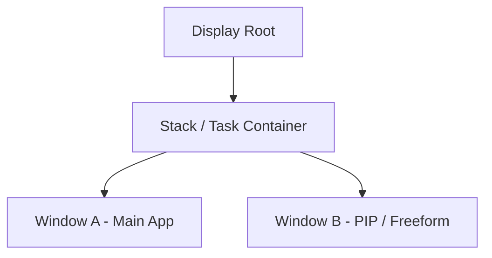
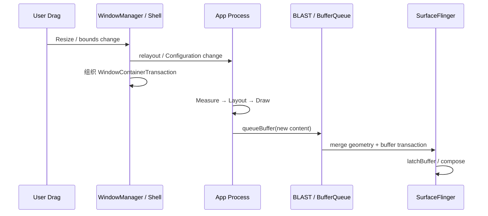

<!-- outline-start -->

**锚点（必须覆盖）：**
- 多窗口在 SurfaceFlinger 侧的 Layer 组织形式
- PIP 模式的渲染流程与性能考量
- Freeform 窗口 Resize 的竞态条件
- BLAST Sync 如何缓解 Resize 同步问题
- 在 Perfetto 中识别多窗口渲染问题

**扩展（可选深入）：**
- Android 12+ TaskFragment/RootTask 的层级变化
- 折叠屏场景下的多窗口渲染
- Configuration Change 对渲染的影响

<!-- outline-end -->

## 为什么多窗口的渲染值得关注

在 SurfaceFlinger（下文简称 SF）侧，多窗口只是更多 Layer 同时参与合成。复杂度来自同一段时间内要协调更多窗口的几何信息、buffer 和合成时序。

拖拽 Freeform 边框或进入 PiP 时，窗口 bounds 往往先变，App 的新尺寸内容后到。只要几何更新和内容更新落在不同帧，画面就可能出现黑边、拉伸或一帧空洞。这类错拍现象，是多窗口渲染分析里最常见的一类问题。[已验证: AOSP WindowManagerService]

## Layer 组织架构

- **Task / RootTask 容器**：WindowManager 和 Shell 先管理任务容器、windowing mode、父子层级，再把结果落成 Layer 树
- **Activity / Window Layer**：每个可见窗口都有自己的 `SurfaceControl`，bounds、crop、alpha、z-order 这类几何属性在这一层变化
- **App 内容 Surface**：窗口内容继续走各自的 producer 路径，常见是 ViewRoot + BLAST 窗口提交路径，视频或游戏也可能是独立 `SurfaceView` / decoder / engine producer

同一块 display 上的 App 侧窗口共用同一套 display-driven VSync 调度。某个窗口需要重绘时，`ViewRootImpl.scheduleTraversals()` 会把 Traversal callback 投给线程单例 `Choreographer`，后者再通过 `DisplayEventReceiver` 订阅下一拍 VSync-App。多一个可见窗口，增加的是 `performTraversals`、独立 Surface / BufferQueue、更多 Layer 和更多合成负担，不会多出一条独立的 VSync 源。SF 自己还有一套 VSync-SF 调度域，两边要分开看。[已验证: `ViewRootImpl.java`、`Choreographer.java`、`DisplayEventReceiver.java`；并与 §18.5 的多窗口串行模型一致]

## PIP（画中画）渲染流程

### 进入 PIP

App 调用 `enterPictureInPictureMode()` 后，WindowManager / Shell 会先改任务容器和窗口几何，再把相关变化整理成 `SurfaceControl.Transaction`。系统更倾向于复用已经存在的视频 layer 或主窗口内容，靠 reparent、position、crop、alpha 这类事务把内容送进 PiP 容器；App 是否马上按小窗尺寸重建自己的渲染目标，取决于它有没有收到配置变化、有没有真的重配 surface。[与 §18.10 的 PiP 场景描述一致]

### Shell 控制面与渲染边界

进入 PiP、拖拽小窗、退出 PiP 这几类操作，现代 Android 往往还要经过 Shell 控制面。`TaskOrganizer` 负责接管任务级窗口容器，`WindowContainerTransaction` 描述 bounds、层级和 windowing mode 的变化，PiP 场景常见的是 `PipTaskOrganizer` 参与协调。它们负责“窗口树怎么改”；到了内容提交阶段，`SurfaceControl.Transaction` 和 BLAST 再负责“哪一帧带着哪块 buffer 生效”。排查时把这两层拆开，线索会清楚很多。[已验证: AOSP `frameworks/base/core/java/android/window/TaskOrganizer.java`、`frameworks/base/core/java/android/window/WindowContainerTransaction.java`、`frameworks/base/libs/WindowManager/Shell/src/com/android/wm/shell/pip/PipTaskOrganizer.java`]

### 持续渲染、BufferQueue 和内存占用

PiP 不会凭空引入一套新的 BufferQueue 规则。多数场景里，原来的 producer 还在按原节奏供帧，变化的是 layer 的父节点、显示区域和几何属性。

对视频或 `SurfaceView` 内容，producer cadence 仍然常由 decoder 或引擎自己决定，例如 24fps、30fps、60fps。对普通 View 窗口，主线程仍然走 `Choreographer#doFrame` 这条 display-driven 节拍。PiP 多出来的是合成和窗口管理成本，不是新的 VSync 源。

内存和带宽要分两种情况看。若系统沿用原 buffer，只在 SF / HWC 侧做缩放和裁剪，切换动作更轻，稳定阶段的带宽未必马上下降。若 App 收到小窗配置后重配 surface，稳定后单帧 buffer 占用会下降，但切换阶段往往会短暂看到“旧大 buffer 还没 release，新小 buffer 已经开始 queue”的重叠，这时峰值占用会上扬一段。[已验证: BufferQueue / BLAST 的 acquire-release 语义]

### 性能考量

- **几何更新快于内容更新**：PiP 边界先改了，新内容还没 queue 上来，SF 合成时就会看到旧内容配新窗口
- **合成路径变化**：小窗的圆角、阴影、裁剪和上层 UI 容器，可能让原本稳定的 HWC 直合成退回 GPU 合成
- **resize 重分配成本**：buffer 尺寸变化会带来重新 dequeue、旧 buffer 释放滞后、release fence 等待这几件事，切换阶段容易放大卡顿

[待补充：PiP 进入场景 Perfetto 截图。标出 WindowManager / shell transition、App 侧 `queueBuffer()`、SurfaceFlinger `latchBuffer` 与实际呈现时刻。]

## Freeform Resize 竞态条件

Freeform 窗口拖拽比 PiP 更容易把错拍暴露出来，因为窗口 bounds 会连续变化，App 的 layout、draw 和 buffer 提交也会连续被打断。

WMS 或 Shell 先推进几何变化，App 后续才把新尺寸内容画完，这是 Freeform 黑边、拉伸、内容抖动的直接来源。窗口越复杂，`onConfigurationChanged()` 越重，buffer 重建越慢，这个时间差就越明显。

### BLAST Sync 如何缓解 Resize 错拍

把多窗口 resize 问题都压成“Android 12+ 才有 BLAST”不准确。这个问题要按三段看。

Android 8.0 到 10，PiP 和自由窗口已经存在，WMS 可以先改 bounds，App 再慢慢追上新尺寸内容。若窗口里带 `SurfaceView` 或视频 layer，Android N 起的位置同步已比更早版本稳定，位移动画里的错位少了一批；buffer 内容和 geometry 仍然可能落在不同帧。

Android 11，`BLASTBufferQueue` 进入主窗口路径。`ViewRootImpl` 在 App 进程里创建 BLAST，producer `queueBuffer()` 之后，App 进程内的 BLAST consumer 会先 `acquireNextBufferLocked()`，再把 buffer、fence、`frameNumber` 塞进 `SurfaceControl.Transaction`。如果这时还有 bounds、crop、transform 这类几何变化，`syncNextTransaction()`、`mergeWithNextTransaction()` 会把它们并进同一帧，再统一提交给 SF。[已验证: `frameworks/native/libs/gui/BLASTBufferQueue.cpp` 的 `acquireNextBufferLocked()`、`syncNextTransaction()`、`mergeWithNextTransaction()`；另见 §2.13、§18.10]

Android 12+，PiP transition 和 shell transition 的控制面继续完善，窗口容器变化、动画和 transaction 提交更集中地走 Shell / WM 这套路径。对排查来说，变化不在“突然有了 BLAST”，而在控制面和可观测性都更完整了，WindowManager / Shell transition、BLAST 提交、FrameTimeline 和 SF 合成更容易放到同一条时间线上。

把职责拆开看会更稳。WindowManager / Shell 负责 bounds、层级和过渡动画；BLAST 负责把这一帧的 buffer 与几何 transaction 放进同一帧；acquire fence 负责说明 buffer 何时可用；SurfaceFlinger 决定何时 latch、何时参与本轮 VSync-SF 合成。这样排查，就不会把“控制面发起了 resize”和“这一帧真的上屏了”混成一件事。

### 版本演进

| 版本 | 变化 | 对分析口径的影响 |
|:---|:---|:---|
| Android 8.0 | PiP 正式进入平台，多窗口内容开始经常以小窗形态参与合成 | 进入 / 退出小窗时要同时看窗口几何变化和内容供帧 |
| Android 10 | Multi-resume 更常见，多窗口并发活跃度上升 | 同一 display 上的主线程 Traversal 串行竞争更容易暴露 |
| Android 11 | `BLASTBufferQueue` 进入主窗口路径 | resize 排查要把 `queueBuffer()`、BLAST transaction merge、`latchBuffer` 摆到同一条时间线上 |
| Android 12+ | PiP / shell transition 控制面继续打磨，FrameTimeline 可观测性更好 | 进入小窗、拖拽、回退时可以把 WM / Shell transition 和实际呈现结果直接对照 |

### Trace 定位

排查 Freeform resize，至少把下面几条线拉到同一屏里看：

- **WindowManager / Shell 轨道**：看 bounds 变化和 transition 从哪一拍开始
- **App Main Thread**：看 `Choreographer#doFrame`、`performTraversals`、`relayoutWindow` 是否被 resize 拖长
- **RenderThread / producer 线程**：看 `dequeueBuffer()` 有没有等旧 buffer，`queueBuffer()` 有没有连续推迟
- **BLAST / BufferQueue 轨道**：看 `QueuedBuffer - <window>BLAST#<id>` 何时出现，是否和 geometry transaction 同步
- **SurfaceFlinger / FrameTimeline**：看 `latchBuffer`、合成周期和 actual present 是在第几拍出现

正常情况里，bounds 变化后 1 个合成周期内就能看到对应的新 buffer 被 latch。异常情况里，常见模式是 `performTraversals` 先被拉长，随后 `dequeueBuffer()` 等旧 buffer，`QueuedBuffer - ...BLAST#...` 迟迟不到，末尾 actual present 连续跨帧。

[待补充：Freeform resize 正常 / 异常 Trace 对照截图。左侧标出 `performTraversals`、`queueBuffer()`、`QueuedBuffer - ...BLAST#...`，右侧标出 `latchBuffer` 和 actual present。]

### 优化建议

- **压短 resize 路径里的主线程工作**：把不必跟窗口尺寸同步完成的计算移出 `onConfigurationChanged()` / relayout 热路径
- **减少无谓的 surface 重建**：只有真的需要更小 buffer 时再重配 surface，能沿用现有内容层的场景尽量沿用
- **拆分稳定内容和高频变化内容**：视频、预览或引擎画面保持独立 producer，控制条、阴影和装饰层按 transaction 更新，能少掉一部分整页重绘

## 在 Perfetto 中识别多窗口问题

抓 PiP / Freeform 问题，trace 至少要能看到 WindowManager 或 Shell transition、App 主线程、RenderThread 或 producer 线程、BLAST / BufferQueue、SurfaceFlinger、FrameTimeline 这几组轨道。缺哪一组，因果链就不完整。

### 最小可执行分析路径

1. 先在 WindowManager / Shell 轨道上找到进入 PiP 或 resize 开始的那一拍，确认问题起点。
2. 把 App Main Thread 的 `Choreographer#doFrame` 和 `performTraversals` 摆在一起，判断是主线程 relayout 先慢，还是后面的提交流程更慢。
3. 把 RenderThread 或 producer 线程的 `dequeueBuffer()`、`queueBuffer()` 摆在一起，判断 buffer 是不是被旧帧占住了。
4. 找 `QueuedBuffer - <window>BLAST#<id>`，确认 BLAST 收到这帧的时间。
5. 在 SF / FrameTimeline 侧看 `latchBuffer` 和 actual present，算清楚这帧是在第几次合成周期里真正出现的。

### 正常与异常的文字样例

| 场景 | 正常表现 | 异常表现 |
|:---|:---|:---|
| PiP 进入 | WindowManager / Shell transition 发起后，App 很快补上一帧，`latchBuffer` 跟在后一个合成周期内 | transition 很早发起，但 `queueBuffer()` / `QueuedBuffer - ...BLAST#...` 明显滞后，actual present 连续跨帧 |
| Freeform resize | `performTraversals` 略有抬高，但 `queueBuffer()` 和 `latchBuffer` 还能跟上 | `performTraversals` 被拉长，后面 `dequeueBuffer()` 等待，SF 先拿旧内容合成出新边界 |
| 合成路径退化 | PiP / 小窗阶段 SF 合成耗时变化不大 | 小窗圆角、裁剪或叠加层出现后，SF 合成耗时突然升高，FrameTimeline 出现连续 miss |

## 与其他章节的关系

- **2.12 Window Manager Service**：窗口容器、bounds 变化和 relayout 的 system_server 视角
- **18.10 SurfaceControl API**：PiP / 小窗过渡里的 transaction、reparent、layer 组织方式

## 参考资料

- AOSP `frameworks/base/core/java/android/view/ViewRootImpl.java`
- AOSP `frameworks/base/core/java/android/view/Choreographer.java`
- AOSP `frameworks/base/core/java/android/view/DisplayEventReceiver.java`
- AOSP `frameworks/native/libs/gui/BLASTBufferQueue.cpp`：`acquireNextBufferLocked()`、`syncNextTransaction()`、`mergeWithNextTransaction()`
- AOSP `frameworks/base/core/java/android/window/TaskOrganizer.java`
- AOSP `frameworks/base/core/java/android/window/WindowContainerTransaction.java`
- AOSP `frameworks/base/libs/WindowManager/Shell/src/com/android/wm/shell/pip/PipTaskOrganizer.java`
- AOSP `frameworks/base/libs/WindowManager/Shell/src/com/android/wm/shell/transition/Transitions.java`
- Android 官方文档：Picture-in-Picture
- Android 官方文档：Multi-Window Support
- Android 官方文档：`SurfaceView` API 文档（Android N 位置同步与 Android 14 alpha 语义）
