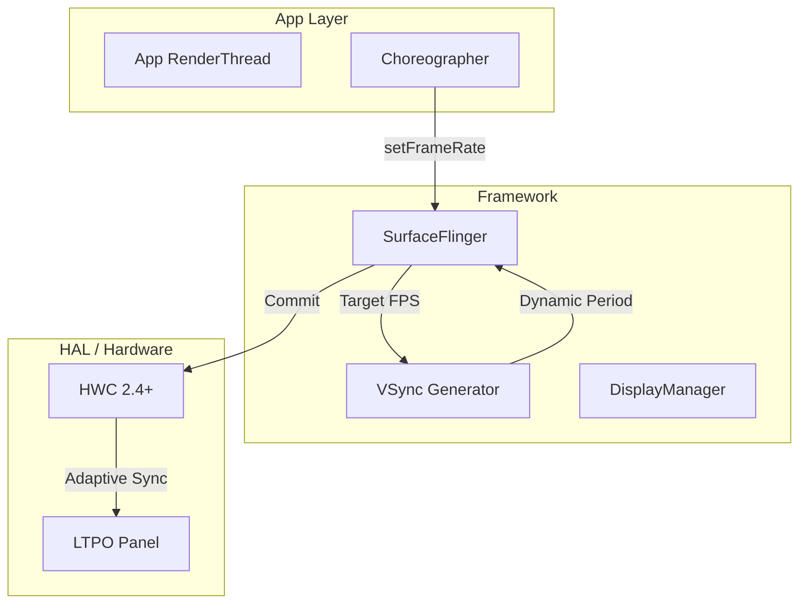
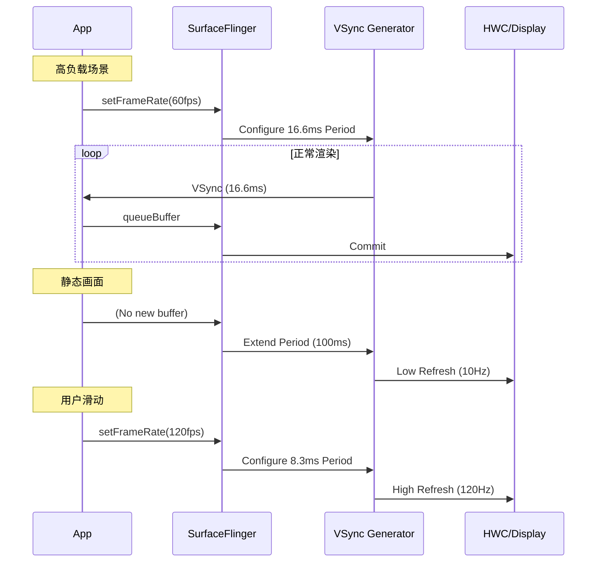

<!-- outline-start -->

**锚点（必须覆盖）：**
- VRR 的核心概念：动态 VSync 周期 vs 固定刷新率
- App 端 API：setFrameRate() 与 Android 16 Enhanced ARR
- VSync 调度的变化：传统固定周期 vs VRR 动态周期
- VRR 下的"假掉帧"问题与正确检测方法
- 在 Perfetto 中分析 VRR 行为

**扩展（可选深入）：**
- LTPO 面板技术
- 视频播放场景的帧率锁定
- 功耗优化：静态画面自动降频

<!-- outline-end -->

## 为什么 VRR 改变了渲染链路的基本假设

传统 Android 性能分析有一个根深蒂固的假设：**超过 16.6ms = 掉帧**。这个假设在 VRR（Variable Refresh Rate）设备上不再成立。

VRR 允许屏幕刷新率在设备支持的模式集合内动态变化。当 App 渲染慢了，屏幕可以自动延长当前帧的显示时间（从 16.6ms 延长到 33ms），而不是跳到下一个固定 VSync 边界。结果是：帧可能显示更久，但不会出现传统的"掉帧跳帧"视觉效果。[已验证: Android VRR API 文档]

理解 VRR 对渲染链路的影响，是分析 LTPO（Low-Temperature Polycrystalline Oxide）设备上性能问题的前提。

## 传统固定刷新率 vs VRR

| 特性 | 固定刷新率 | VRR |
|:---|:---|:---|
| VSync 周期 | 固定（如 16.6ms @ 60Hz） | **动态** |
| 渲染超时表现 | 跳到下一个 VSync（明显卡顿） | 延长当前帧（平滑过渡） |
| 静态功耗 | 仍 60Hz 刷新 | 可降至 1Hz |
| 分析复杂度 | 简单 | App/SF/Display 三方协调 |

### VSync 调度对比

```
固定 60Hz：
VSync:  |----16.6ms----|----16.6ms----|----16.6ms----|
Frame:  |    F1       |    F2       |    F3       |

VRR 动态：
VSync:  |--8.3ms--|--8.3ms--|------33ms------|--8.3ms--|
Frame:  |   F1   |   F2   |    F3 (慢)      |   F4   |
        ^120Hz   ^120Hz   ^30Hz (自动降频)  ^120Hz
```

## 系统架构



## App 端 API

### 标准 API（Android 11+）

```java
// 请求 120fps（游戏场景）
surface.setFrameRate(120f, Surface.FRAME_RATE_COMPATIBILITY_DEFAULT);

// 请求精确帧率（视频播放 24fps）
surface.setFrameRate(24f, Surface.FRAME_RATE_COMPATIBILITY_FIXED_SOURCE);

// 让系统决定（省电）
surface.setFrameRate(0f, Surface.FRAME_RATE_COMPATIBILITY_DEFAULT);
```

### Enhanced ARR API（Android 16+）

Android 16 引入了更简化的 API，App 只需声明意图，系统自动选择最佳帧率：

```java
// View-level 帧率分类
view.setRequestedFrameRate(View.REQUESTED_FRAME_RATE_CATEGORY_HIGH);    // 游戏/动画
view.setRequestedFrameRate(View.REQUESTED_FRAME_RATE_CATEGORY_NORMAL);  // 普通滚动
view.setRequestedFrameRate(View.REQUESTED_FRAME_RATE_CATEGORY_LOW);     // 静态/省电
```

投票机制：多个 View 各自声明帧率需求，系统综合决策最高帧率。

### SurfaceControl API（NDK）

```c
ASurfaceTransaction_setFrameRate(
    transaction, surfaceControl,
    90.0f, ANATIVEWINDOW_FRAME_RATE_COMPATIBILITY_DEFAULT
);
```

## 渲染时序



## VRR 下的掉帧检测

这是最容易踩的坑。传统方法在 VRR 设备上会产生大量误报：

```sql
-- ❌ 错误：固定帧率思维
SELECT * FROM slice 
WHERE name = 'DrawFrame' AND dur > 16666666;

-- ✅ 正确：使用 Perfetto stdlib 的 VRR 感知检测
INCLUDE PERFETTO MODULE android.frames;
SELECT frame_id, ts, dur, jank_type
FROM android_frames
WHERE jank_type != 'None';
```

Perfetto 的 `android_frames` 模块会考虑 VSync 周期变化，避免误报。

## 常见问题

| 问题 | 原因 | 解决 |
|:---|:---|:---|
| 帧率在 60/90/120 之间频繁跳动 | App 未明确请求帧率 | 使用 `setFrameRate()` |
| VRR 设备功耗反而更高 | App 持续请求高帧率 | 静态场景请求低帧率 |
| 24fps 视频在 120Hz 抖动 | 未使用 FIXED_SOURCE | 视频用 `FRAME_RATE_COMPATIBILITY_FIXED_SOURCE` |

## 在 Perfetto 中分析 VRR

| Track | 说明 |
|:---|:---|
| VSYNC | 显示实际 VSync 周期变化 |
| HW_VSYNC | 硬件 VSync 信号 |
| FrameTimeline | 每帧的预期/实际着陆时间 |

## 与其他章节的关系

- **2.3 VSync 机制**：VSync 的基础原理
- **2.18 Adaptive Refresh Rate**：ARR 的机制视角
- **2.19 刷新率切换与帧率适配**：刷新率切换的性能影响

## 参考资料

- Android 官方文档：setFrameRate()
- Android 官方文档：Adaptive Refresh Rate
- VESA DisplayPort Adaptive-Sync 标准
