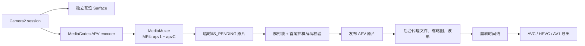

# 18.22 Android 17 Advanced Professional Video 与专业视频编解码管线

本文以 Android 17 / API 37 的 `android-17.0.0_r1` 为平台源码基线，以 `android17-6.18-2026-06_r6` 为 kernel 基线。APV 在 Android 16 引入；Android 16.1（完整 SDK 版本 36.1）增加 `MediaRecorder.VideoEncoder.APV`，Android 17 再增加录制质量参数。版本演进依据公开 API，源码结论均以 Android 17 tag 为准。

## APV 解决的是专业素材问题

APV（Advanced Professional Video）面向高质量录制、剪辑和后期素材交换。它关注编辑效率与多代处理后的画质，不以互联网分发所需的高压缩率为首要目标。官方列出的主要特征包括：

- 只做帧内编码，即每帧可以独立解码；不使用像素域预测，便于随机访问和并行处理；
- 以较低复杂度承载 2K、4K、8K 的高码率素材；
- 支持 frame tile（把一帧划成可并行处理的区域）、多视图，以及深度、alpha 遮罩、预览等辅助视频；
- 支持多种色度采样（例如 4:2:2、4:4:4）、位深、HDR10 / HDR10+ 和用户元数据；
- 经多次解码和再编码后，代际损失，即每轮转码累积的画质劣化，仍应受到控制。

这些特征让 APV 更接近录制母版（保存完整质量的源素材）或剪辑中间格式。HEVC、AV1 常以更高压缩率服务分发；长 GOP（Group of Pictures，一组相互依赖的帧）内容访问任意帧或反复转码时，通常要处理更多帧间依赖。APV 以更大的文件换取较快的编辑响应、并行处理能力和更稳定的多代画质。

产品不宜把 APV 设为普通拍摄的默认格式。Pro Video、现场粗剪、调色和素材交换等模式可以提供 APV；分享、上传和广泛播放仍应准备 AVC、HEVC 或 AV1 导出。系统能够识别 `video/apv`，无法保证接收文件的 App、桌面软件或云端服务也支持它。

## “平台支持”要拆成三层

“Android 支持 APV”至少包含三层含义，排查时要分别记录：

| 层次 | Android 17 能确认什么 | 仍需运行时或设备验证什么 |
| :--- | :--- | :--- |
| 标准与公开 API | `video/apv`、APV profile / level、P210、MediaRecorder APV、MP4 muxing 均有公开入口 | 目标 SDK 与运行版本是否满足接口要求 |
| AOSP 参考实现 | `frameworks/av` 有 C2 APV 软编码器、软解码器和 MP4 writer | 产品是否启用组件、组件对外公布的规格 |
| 设备产品能力 | `MediaCodecList` 可查询 vendor 和 platform codec | 硬件加速、Camera 输入组合、4K/8K、持续码率、温控和稳定性 |

这里的 profile 表示编码工具集与像素格式约束，level 表示分辨率、采样率等复杂度上限；muxing 是把编码轨道及其元数据封装进 MP4。设备能解码 APV，也无法保证 APV layer 会由 HWC 使用独立硬件 plane 直接 scanout，这正是 hardware overlay。普通 Surface 输出仍由 SurfaceFlinger 与 HWC 逐帧选择合成方式。

## Android 16 到 Android 17 的公开接口

Android 16 的公开常量覆盖 APV 422-10 的主要契约：

- `MediaFormat.MIMETYPE_VIDEO_APV = "video/apv"`；
- `MediaCodecInfo.CodecProfileLevel.APVProfile422_10 = 0x01`；
- `APVProfile422_10HDR10 = 0x1000`；
- `APVProfile422_10HDR10Plus = 0x2000`；
- APV Level 1 到 Level 7.1，以及每一级的 Band 0 到 Band 3；band 是同一 level 下进一步区分码率上限的档位；
- `CodecCapabilities.COLOR_FormatYUVP210`，即 10-bit、4:2:2、半平面 P210。

Android 16 平台承诺的实现范围是 APV 422-10，即 YUV 4:2:2、10-bit，目标码率最高 2 Gbps。官方同时用数 Gbps 和 2K/4K/8K 描述 APV 标准的设计范围。2 Gbps 是平台 profile 的目标上限，不能视为每台 Android 16 或 Android 17 设备都具备的能力。

P210 是 4:2:2、10-bit 的半平面 YUV 内存格式：Y 单独成平面，Cb/Cr 交错存放。每个 Y、Cb、Cr 样本使用 16-bit 容器，只有高 10 bit 有效，因此平均占用 32 bit/pixel。10-bit 描述有效位深，不表示内存中每个样本只占 10 bit。

`MediaRecorder.VideoEncoder.APV = 9` 在 API 文档中标为 36.1。需要兼容 Android 16.0 与 16.1 时，应使用 `Build.VERSION.SDK_INT_FULL` 和 `Build.VERSION_CODES_FULL.BAKLAVA_1` 区分次版本；只查 `SDK_INT == 36` 无法判断高层录制入口是否可用。Android 17 的 `VERSION_CODES.CINNAMON_BUN` 为 37，已经包含该入口。

Android 17 新增 `MediaRecorder.setVideoEncodingQuality(int)`。它只在选中的编码器支持 `EncoderCapabilities.BITRATE_MODE_CQ` 时生效；CQ（Constant Quality）让编码器以目标质量为主，码率随内容变化。可用范围来自该编码器的 `getQualityRange()`。同一次配置不要同时设置 encoding quality 和 video bitrate，API 文档将这种组合定义为行为未指定。质量值也没有跨 codec 的统一刻度，vendor A 的 `80` 与 vendor B 的 `80` 不能直接比较。

## 能力探测要检查完整 MediaFormat

只列出 `video/apv` codec，再调用 `areSizeAndRateSupported()`，会漏掉 profile、码率、输入色彩格式和编码模式。下面的代码探测 APV 编码器，分别检查 Surface 输入与 P210 buffer 输入。它还保留 performance point 的未知状态；performance point 是 codec 对某组分辨率和帧率给出的性能保证。

```kotlin
@RequiresApi(36)
data class ApvEncoderProbe(
    val name: String,
    val canonicalName: String,
    val hardware: Boolean,
    val softwareOnly: Boolean,
    val vendor: Boolean,
    val requestedProfileAdvertised: Boolean,
    val requestedLevelCovered: Boolean?,
    val sizeRateSupported: Boolean,
    val bitrateSupported: Boolean,
    val surfaceInputAdvertised: Boolean,
    val p210InputAdvertised: Boolean,
    val surfaceFormatSupported: Boolean,
    val p210FormatSupported: Boolean,
    val cqSupported: Boolean,
    val performancePointCoversTarget: Boolean?
)

@RequiresApi(36)
fun findApvEncoders(
    width: Int,
    height: Int,
    fps: Int,
    bitrate: Int,
    profile: Int = MediaCodecInfo.CodecProfileLevel.APVProfile422_10,
    level: Int? = null
): List<ApvEncoderProbe> {
    val mime = MediaFormat.MIMETYPE_VIDEO_APV
    val targetPoint =
        MediaCodecInfo.VideoCapabilities.PerformancePoint(width, height, fps)

    fun requestedFormat(colorFormat: Int) =
        MediaFormat.createVideoFormat(mime, width, height).apply {
            setInteger(MediaFormat.KEY_FRAME_RATE, fps)
            setInteger(MediaFormat.KEY_BIT_RATE, bitrate)
            setInteger(MediaFormat.KEY_PROFILE, profile)
            setInteger(MediaFormat.KEY_COLOR_FORMAT, colorFormat)
            level?.let { setInteger(MediaFormat.KEY_LEVEL, it) }
        }

    return MediaCodecList(MediaCodecList.ALL_CODECS).codecInfos.mapNotNull { info ->
        if (!info.isEncoder || info.isAlias) return@mapNotNull null
        if (info.supportedTypes.none { it.equals(mime, ignoreCase = true) }) {
            return@mapNotNull null
        }

        val caps = runCatching { info.getCapabilitiesForType(mime) }.getOrNull()
            ?: return@mapNotNull null
        val videoCaps = caps.videoCapabilities ?: return@mapNotNull null
        val encoderCaps = caps.encoderCapabilities ?: return@mapNotNull null

        val profileAdvertised = caps.profileLevels.any { it.profile == profile }
        val levelCovered = level?.let { requestedLevel ->
            caps.profileLevels.any {
                it.profile == profile && it.level >= requestedLevel
            }
        }
        val surfaceAdvertised = caps.colorFormats.any {
            it == MediaCodecInfo.CodecCapabilities.COLOR_FormatSurface
        }
        val p210Advertised = caps.colorFormats.any {
            it == MediaCodecInfo.CodecCapabilities.COLOR_FormatYUVP210
        }
        val sizeRateSupported =
            videoCaps.areSizeAndRateSupported(width, height, fps.toDouble())
        val bitrateSupported = videoCaps.bitrateRange.contains(bitrate)

        fun supports(colorFormat: Int, colorAdvertised: Boolean): Boolean {
            if (!profileAdvertised ||
                levelCovered == false ||
                !colorAdvertised ||
                !sizeRateSupported ||
                !bitrateSupported
            ) {
                return false
            }
            return runCatching {
                caps.isFormatSupported(requestedFormat(colorFormat))
            }.getOrDefault(false)
        }

        ApvEncoderProbe(
            name = info.name,
            canonicalName = info.canonicalName,
            hardware = info.isHardwareAccelerated,
            softwareOnly = info.isSoftwareOnly,
            vendor = info.isVendor,
            requestedProfileAdvertised = profileAdvertised,
            requestedLevelCovered = levelCovered,
            sizeRateSupported = sizeRateSupported,
            bitrateSupported = bitrateSupported,
            surfaceInputAdvertised = surfaceAdvertised,
            p210InputAdvertised = p210Advertised,
            surfaceFormatSupported = supports(
                MediaCodecInfo.CodecCapabilities.COLOR_FormatSurface,
                surfaceAdvertised
            ),
            p210FormatSupported = supports(
                MediaCodecInfo.CodecCapabilities.COLOR_FormatYUVP210,
                p210Advertised
            ),
            cqSupported = encoderCaps.isBitrateModeSupported(
                MediaCodecInfo.EncoderCapabilities.BITRATE_MODE_CQ
            ),
            performancePointCoversTarget =
                videoCaps.supportedPerformancePoints?.any { it.covers(targetPoint) }
        )
    }
}
```

`requestedLevelCovered == null` 表示调用方没有约束 level/band。传入 `level` 后，代码复刻 Android 17 Java legacy capability 路径，即 Java 侧旧兼容能力实现中的 `supportsProfileLevel()` 初步判断：在同一 profile 下，只要组件公布的 level 常量数值大于或等于请求值，就让请求进入后续 format 检查。APV 常量的高位编码 level，低位编码 band，二者共同影响采样率与码率上限。单纯比较常量大小不能证明输出严格符合指定 level/band；有此要求时，还要根据 APV 规格表独立核算采样率和码率。

`isFormatSupported()` 会联合检查 MIME、尺寸、帧率、profile、level 和码率等字段。代码仍把输入色彩格式与 `colorFormats` 单独交叉检查，以便发现 vendor 能力上报不一致。

`KEY_LEVEL` 还有一条 API 边界：它参与 profile/level 组合检查，却不保证其他 format 参数符合调用方指定的 level。Android 17 的 Java legacy capability 路径会用该 profile 已公布的最高 level 检查相关参数；native capability 路径同样没有公开契约保证其余参数符合指定 level。若工作流要求码流严格落在某个 APV level/band，除独立核算目标采样率与码率外，还要检查 configure 后的 output format 和生成的 bitstream（编码码流）。HDR 录制则应选用 HDR10 或 HDR10+ profile，并继续设置与核对 color standard、transfer、range 及静态或动态 HDR 元数据。只更换一个 profile 常量不足以证明整条 HDR 管线有效。

`supportedPerformancePoints` 有三种状态：`null` 表示 codec 没有公布性能点，空列表表示 codec 明确不保证任何性能点，非空且覆盖目标规格才代表厂商给出的单实例性能保证。该保证不涵盖 Camera、存储、温控或多个 codec 并发，因此只能作为启用目标规格的证据之一，不能替代长时间录制测试。

查询通过后，还要依次执行 `configure()`、`createInputSurface()`、短录制、`MediaMuxer.stop()`、重新解封装与解码校验。某个组合即使出现在能力表中，仍可能因为资源不足、Camera session 组合不成立或 vendor codec 初始化失败而无法使用。

## Android 17 的 AOSP 软件 APV 不能视为设备通用后备

`android-17.0.0_r1` 的 `frameworks/av` 包含：

- `c2.android.apv.encoder`；
- `c2.android.apv.decoder`。

两者都受固定只读 feature flag `android.media.swcodec.flags.apv_software_codec` 控制。这个开关由系统构建配置决定；关闭时，负责创建组件的 factory 直接返回 `nullptr`。代码还要求系统至少为 API 36 / Baklava。媒体 XML 同时声明 `enabled="false"`、`minsdk="36"` 和 `variant="!slow-cpu"`；最后一项表示 `slow-cpu` 配置变体排除该组件。因此，AOSP 仓库包含源码，不代表量产设备会在 `MediaCodecList` 中列出这两个组件。

参考组件自身和 XML 的限制也比 APV 标准上限窄：

| 项目 | Android 17 AOSP 参考实现 |
| :--- | :--- |
| profile | 只公布 `PROFILE_APV_422_10` |
| XML 公布的尺寸 | 最大 `1920x1920` |
| 码率 | 最大 `240,000,000` bit/s |
| encoder C2 接口尺寸 | 代码允许到 `4096x4096`，但产品能力仍受更严格的 XML 与运行时查询约束 |
| 默认状态 | 组件条目关闭，并受 flag 与 `!slow-cpu` variant 约束 |

XML 为软编码器声明 VBR（Variable Bitrate，可变码率）、CQ 和 `quality=0..100`。编码器代码只有在另一个固定只读 flag `android.media.swcodec.flags.apv_software_codec_cq` 开启时，才加入 CQ 对应的 C2 `bitrate-mode` 参数。静态 XML 与运行时代码的声明可能不同，应用应以 `EncoderCapabilities` 查询和一次真实 `configure()` 的结果为准。

2 Gbps、4K 和 8K 需要具备相应能力的 vendor 实现，AOSP 软件 codec 无法作为高规格后备方案。`MediaCodecInfo.java` 映射了 APV level/band 的理论采样率与码率；高等级码率超过 Java `int` 的表达范围时，内部上限会限制为 `Integer.MAX_VALUE`。应用的 `KEY_BIT_RATE` 同样是 `int`，2,000,000,000 bit/s 虽然仍能表示，但已接近上界。

### 422-10 码流不保证输出仍是 P210

AOSP 软编码器默认接受 implementation-defined（由 framework 与设备选择具体布局）和 `YCBCR_420_888`。硬件缓冲区能力允许时，候选格式还包括 P010、P210 与 RGBA1010102。编码前，组件会把不同输入转换成 P210 或内部的 4:2:2 10-bit 表示。由此可得两条工程结论：

1. Camera → codec 的 Surface 链路可能避免应用侧 CPU 拷贝，但这不能证明 codec 内部没有像素格式转换。
2. Camera 能建立 10-bit/HDR session，也不能说明它可以直接用 P210 向 APV encoder 供帧。Camera stream combination（同一 capture session 允许同时配置的输出组合）与 codec 输入能力需要分别查询。

`C2SoftApvDec.cpp` 的默认输出像素格式是 `HAL_PIXEL_FORMAT_YCBCR_420_888`；平台支持时，候选还包括 P010、P210、RGBA1010102 和 implementation-defined。实际申请 buffer 时，默认 `YCBCR_420_888` 路径会使用 YV12。显式请求且平台支持 P210、P010 或 RGBA1010102 时，代码先按请求格式申请；请求 implementation-defined 或目标格式不可用时，再按 P210、P010、RGBA1010102、YV12 的顺序尝试回退。

P010 是 4:2:0 10-bit 半平面 YUV，P210 是 4:2:2 10-bit，YV12 通常是 4:2:0 8-bit，RGBA1010102 则为每个 R/G/B 通道 10 bit、alpha 通道 2 bit。剪辑或调色 App 若要保留 4:2:2 与 10-bit，必须核对 decoder 的 `colorFormats`、configure 后的 output format，以及实际收到的 `Image` 或 `HardwareBuffer` 格式。只看 APV bitstream profile，会漏掉输出阶段的色度降采样或位深损失。

## 码率、内存带宽和存储要用同一组规格计算

以下容量和带宽按十进制单位估算：2 Gbps 等于 250 MB/s。按固定码率录制 4 分钟会写入约 60 GB 编码视频数据，其中还没有计入音频、容器与文件系统开销。即使降到 1 Gbps，也要持续写入约 125 MB/s。

Camera 到 encoder 的输入同样不可忽略。P210 分配 32 bit/pixel，3840 × 2160、60 fps 的一遍线性读流量约为：

`3840 × 2160 × 4 byte × 60 ≈ 1.99 GB/s（十进制）`

这只是按有效画面尺寸计算的一遍读取，没有计入 stride（每行像素在内存中的实际跨度）、对齐填充、Camera 写入、codec 内部转换、缓存维护、预览、输出和其他消费者。该估算不能替代 SoC 带宽计数器，却足以说明 250 MB/s 的编码输出并不能代表整条管线的内存流量。

允许开始录制前，至少检查四组条件：

- codec：完整 `MediaFormat`、硬件/软件属性、profile / level、Surface/P210 输入，以及 CQ 或目标码率模式；
- Camera：目标动态范围、位深、分辨率、帧率与双 Surface session 组合；
- 存储：目标卷、剩余空间、持续写入能力、外接设备断开和空间预留；
- 温控：开始时的 thermal status（系统暴露的热状态等级）、录制期间的降档门槛、codec reset 和相机关闭策略。

一次 10 秒测试只能证明初始化和短时写入可用。高规格开放条件应来自同一 codec、Camera 组合和存储卷上的长时间压力测试。运行时还要根据滚动写入耗时、输出 buffer 积压、thermal status 与剩余空间触发有滞回的降档。滞回是为降档和恢复设置不同门槛，避免条件在临界值附近波动时反复切换档位。

## 专业视频 App 应拆开录制、预览、代理和导出

下面的图标出取景、录制、校验、代理处理与导出的责任边界：



图中的原片是保留完整质量的 APV 素材；`IS_PENDING` 是 MediaStore 的待发布标记，置为 1 时文件不会作为已完成媒体公开。录制时应保留独立预览 Surface，避免把 APV 编码后再解码加入取景链路。预览 Surface 与 encoder input Surface 能否同时配置，由 Camera2 的 stream combination 和目标动态范围决定。即使 APV encoder 支持 4K60，只要 Camera session 不接受这组输出，录制仍无法开始。

剪辑时间线可以优先读取代理文件，即与原片时间对应的低分辨率替代素材。这样拖动、裁剪、缩略图和音频波形生成无需反复读取高码率原片。导出阶段再读取 APV 原片，并根据接收端选择 AVC、HEVC 或 AV1。代理文件必须通过稳定的素材 ID、时间基准和画面变换关系关联原片，不能只依赖文件名。

项目数据库至少记录：

- 原片、代理、缩略图、波形、导出文件和临时文件的角色；
- 原始 codec、profile / level、色彩与 HDR 信息；
- 降档原因、发生时间和降档前后规格；
- 文件是否可重建、是否已校验、最近访问时间；
- MediaStore URI、卷 ID 和用户是否已导出。

这些记录让清理程序只删除可以重新生成的数据，并在外接存储断开后继续保留项目与素材的关联。

## MP4 封装与异常退出

Android 的 `MediaMuxer` 从 API 36 起支持把 APV 写入 MP4。`android-17.0.0_r1` 的 `MPEG4Writer.cpp` 使用 `apv1` sample entry 标识 MP4 中的 APV track，并把解码该轨道所需的 codec-specific data（编解码器配置数据）写入 `apvC` box。APV 编码器可用，不能据此推导 WebM、3GP 或自定义容器也能直接接收同一输出；平台公开支持表只为 APV 标出 MP4。

使用 scoped storage（应用通过 MediaStore 管理共享媒体的存储模型）时，可以把 `MediaStore` 返回的 `FileDescriptor` 交给 `MediaMuxer`。在 `stop()` 成功、文件能够重新打开并通过基本解码校验前，应保持 `IS_PENDING=1`，校验通过后再发布。进程被杀、存储断开、空间耗尽或 `stop()` 抛出异常时，MP4 可能尚未写完索引等必要结构。此类文件应进入待恢复或安全删除状态，不能直接显示为成功素材。

写入队列必须设置容量上限。muxer 或文件系统变慢时，无限缓存 encoder output 会让存储停顿进一步演变为内存耗尽。产品可以根据风险停止录制、降低下一段录制的规格，或提示用户切换存储；不要在同一个 MP4 track 中静默更换 codec。

## 降级要同时覆盖规格、格式和工作流

APV 的降级分为三组：

- 规格降级：降低分辨率、帧率或码率；每个档位都要重新通过完整 format 和 Camera session 探测。
- 格式降级：APV 编码器缺失、只有软件实现或压力测试不稳定时，专业模式可以改用设备已验证的 HEVC 10-bit/HDR 组合，普通模式可以改用 HEVC 或 AVC。
- 工作流降级：保留 APV 原片，预览与剪辑使用代理文件，分享时转成广泛支持的格式。

APV 是帧内格式，但录制过程中更换 codec 通常仍要结束当前文件，并新建一个 segment（独立录制片段）。项目层应记录每个 segment 的边界、规格、时间戳映射与降级原因，导出时再将这些片段组织成连续时间线。

用户界面还要区分设备不支持、当前温控或存储条件不允许、本次运行失败三种状态。设备能力通常不会在同一软硬件组合内改变；温控或存储限制可能在条件改善后解除；运行失败则需要保留 codec、Camera 与 I/O 诊断。三者应给出不同的提示和恢复操作。

## Perfetto、媒体指标与 kernel 边界

APV 编码算法、C2 component 和 MP4 writer 位于 framework 或 vendor 用户空间。kernel tag 不定义 `video/apv`，也不承诺 422-10 或 2 Gbps。`android17-6.18-2026-06_r6` 只固定以下通用机制的源码语义：

- `dma-buf` 与 dma-fence / `sync_file`：跨 Camera、codec、GPU、SurfaceFlinger 共享 buffer，并传递异步任务的完成状态；
- `sched`、CPU frequency 和 idle：观察编码、Camera 与写入线程何时运行，以及 CPU 频率和空闲状态如何变化；
- block layer：观察高码率持续写入的块设备请求排队与长尾延迟，即少量异常慢请求造成的延迟尾部；
- thermal framework：把温度与冷却设备事件交给系统和厂商温控策略。

Perfetto 调查可按症状选择证据：

| 症状 | 优先观察 |
| :--- | :--- |
| 取景卡顿 | Camera request/result、buffer wait、预览 Surface、SurfaceFlinger、主线程 |
| encoder input 堵塞 | Camera 输出节奏、acquire/release fence、codec callback、C2/vendor 线程、sched |
| 输出码率或帧率异常 | 实际 sample size、PTS（Presentation Timestamp，期望呈现时间）、codec output format、MediaCodec metrics |
| 写入停顿 | muxer 写入切片、文件系统与 block I/O、队列深度、剩余空间 |
| 长录后失败 | thermal、CPU/GPU frequency、codec reset、Camera error、后台 I/O 竞争 |
| 素材不可播放 | `stop()` 结果、MP4 box、track format、首尾 sample、重新解码结果 |

量产机未必开放 block、vendor codec、Camera HAL 和部分 thermal 数据源。应用应使用 `Trace.beginSection()` 或 Perfetto Track Event 为 configure、start、首个 sample、写入批次、stop、校验与降级添加时间标记，同时保留线上可采集的计数器。即使缺少底层数据源，应用时间线仍可判断停顿发生在 encoder output 之前，还是 muxer 写入之后。

每次录制至少记录 codec name、canonical name（去除 alias 后的组件名称）、hardware/software、vendor/platform、profile/level、color format、bitrate mode、目标与实际码率、Camera session 规格、存储卷、thermal status、异常诊断和停止原因。不能只按机型名称推断 APV 能力；同一机型的 vendor image、存储状态与温控条件也可能不同。

## APV、HEVC、AV1 与 ProRes 的工作流差异

| 格式 | 常见位置 | 主要优势 | Android 侧注意点 |
| :--- | :--- | :--- | :--- |
| APV | 专业录制母版、剪辑中间素材 | 帧内、编辑友好，适合高码率和多次处理 | API 36 起有平台入口；设备 codec、Camera、存储能力均需探测 |
| HEVC | 高画质录制、交付、分发 | 压缩效率与移动端硬件覆盖较成熟 | 10-bit、HDR、帧率和编码能力仍按 codec 组合确认 |
| AV1 | 网络分发、归档 | 压缩效率高 | 解码覆盖与编码吞吐不同，移动端硬件编码不能按 API level 假设 |
| ProRes | 已采用该格式的专业后期交换 | 桌面后期工具链覆盖较广 | Android framework 没有可供所有设备依赖的统一 ProRes codec 契约 |

同一项目可以同时使用多种格式：APV 保存母版，代理文件服务剪辑，HEVC 或 AV1 负责交付。格式应按工作阶段选择，没有一种编码能够同时满足母版、交互编辑与广泛分发的全部目标。

## OpenAPV 的用途与平台边界

[OpenAPV](https://github.com/AcademySoftwareFoundation/openapv) 是 APV 的开源参考实现。在 Android 侧设计中，它仅作为码流与工具链参考；README 中的能力清单属于 OpenAPV 项目，不进入 Android 平台契约。README 的基础兼容性清单列出 422-10、422-12、444-10、444-12、4444-10、4444-12 和 400-10；同一 README 还列出 OpenAPV 项目扩展 profile（如 444-16C12、4444-16C12 和 UNCONST），用于项目自己的扩展场景。实现还提供 ARM NEON 与 x86 SSE/AVX SIMD 指令优化、tile 多线程、HDR/用户元数据，以及 CQP 和 ABR 码率控制。这里 CQP 是 Constant Quantization Parameter，即固定量化参数；ABR 是 Average Bitrate，即平均码率控制，不是播放器领域的 Adaptive Bitrate。

它适合用来：

- 阅读 bitstream 结构和 profile 行为；
- 生成可重复的编码、解码测试素材；
- 验证桌面或服务端工具；
- 对 vendor codec 做码流与画质交叉校验。

OpenAPV 的基础与扩展 profile 集合大于 Android 17 平台公开的 APV 422-10 集合。将 OpenAPV 编入应用，只能证明应用带有一套软件实现，不能证明设备存在 APV 硬件 codec、Camera 可以输出目标规格、MediaCodec 会选择这套实现，或 HWC 会用 overlay 显示解码结果。

## 线上分组统计与启用指标

APV 上线时应分别记录静态能力与每次运行结果，并按这些字段分组统计：

- 版本：`SDK_INT`、`SDK_INT_FULL`、vendor build、应用版本；
- codec：name、canonical name、hardware/software、vendor/platform、profile/level、color format、performance point、CQ 支持；
- Camera：camera ID、dynamic range、分辨率、帧率、session 输出组合；
- 录制：目标/实际码率、sample PTS 连续性、录制时长、segment 和降档记录；
- 存储：卷 ID、内置/外接、开始/结束剩余空间、写入耗时分位数；
- thermal：开始、峰值和结束时的 status，CPU/GPU frequency 变化，以及触发的策略；
- 结果：muxer stop、重新解封装、首尾抽样解码、代理生成和导出是否成功。

崩溃率无法单独回答 APV 是否可用。更有意义的指标包括录制成功率、文件可重新打开率、抽样解码成功率、有效录制时长、写入超时率、因温控或空间触发的降档比例，以及导出成功率。高规格只应对已经通过长时间验证的 codec + Camera + 存储组合开放。

## Android 17 源码与文档依据

下列依据限于 Android 16 到 Android 17 的公开文档、`android-17.0.0_r1` 平台源码和 `android17-6.18-2026-06_r6` kernel。OpenAPV 只作为 APV 标准与参考实现材料，不能外推为 Android 17 之后的平台能力。

- [Android 16（本章适用范围下限）APV 功能说明](https://developer.android.com/about/versions/16/features#apv)：APV 定位、标准特征与 Android 422-10 实现范围。
- [Android 17 CQ 功能说明](https://developer.android.com/about/versions/17/release-notes#audio-video)与 [`MediaRecorder` API](https://developer.android.com/reference/android/media/MediaRecorder#setVideoEncodingQuality(int))：CQ 入口、适用条件与质量值边界。
- [`CodecCapabilities.isFormatSupported()`](https://developer.android.com/reference/android/media/MediaCodecInfo.CodecCapabilities#isFormatSupported(android.media.MediaFormat))：format keys 的检查范围，以及指定 level 不约束其他参数的文档边界。
- [Android 17 `MediaFormat.java`](https://android.googlesource.com/platform/frameworks/base/+/refs/tags/android-17.0.0_r1/media/java/android/media/MediaFormat.java)：`MIMETYPE_VIDEO_APV` 与 format keys。
- [Android 17 `MediaCodecInfo.java`](https://android.googlesource.com/platform/frameworks/base/+/refs/tags/android-17.0.0_r1/media/java/android/media/MediaCodecInfo.java)：APV profile/level、P210、能力检查和码率上限映射。
- [Android 17 `MediaRecorder.java`](https://android.googlesource.com/platform/frameworks/base/+/refs/tags/android-17.0.0_r1/media/java/android/media/MediaRecorder.java)：APV encoder 常量与 `setVideoEncodingQuality()`。
- [MediaMuxer API](https://developer.android.com/reference/android/media/MediaMuxer)：APV 从 API 36 起支持 MP4。
- [Android 17 software codec flags](https://android.googlesource.com/platform/frameworks/av/+/refs/tags/android-17.0.0_r1/media/aconfig/swcodec_flags.aconfig)：APV 软件 codec 与 CQ 模式的固定只读 flags。
- [Android 17 `C2SoftApvEnc.cpp`](https://android.googlesource.com/platform/frameworks/av/+/refs/tags/android-17.0.0_r1/media/codec2/components/apv/C2SoftApvEnc.cpp) 与 [`C2SoftApvDec.cpp`](https://android.googlesource.com/platform/frameworks/av/+/refs/tags/android-17.0.0_r1/media/codec2/components/apv/C2SoftApvDec.cpp)：参考软 codec、profile、flag 和像素格式转换。
- [Android 17 software codec XML](https://android.googlesource.com/platform/frameworks/av/+/refs/tags/android-17.0.0_r1/media/libstagefright/data/media_codecs_google_c2_video.xml)：参考组件的启用状态、尺寸、码率和编码模式声明。
- [Android 17 `MPEG4Writer.cpp`](https://android.googlesource.com/platform/frameworks/av/+/refs/tags/android-17.0.0_r1/media/libstagefright/MPEG4Writer.cpp)：`apv1` sample entry 与 `apvC` box。
- Kernel common `android17-6.18-2026-06_r6`：[dma-buf](https://android.googlesource.com/kernel/common/+/refs/tags/android17-6.18-2026-06_r6/drivers/dma-buf/dma-buf.c)、[sync_file](https://android.googlesource.com/kernel/common/+/refs/tags/android17-6.18-2026-06_r6/drivers/dma-buf/sync_file.c)、[scheduler](https://android.googlesource.com/kernel/common/+/refs/tags/android17-6.18-2026-06_r6/kernel/sched/core.c)、[block layer](https://android.googlesource.com/kernel/common/+/refs/tags/android17-6.18-2026-06_r6/block/blk-core.c) 与 [thermal framework](https://android.googlesource.com/kernel/common/+/refs/tags/android17-6.18-2026-06_r6/drivers/thermal/thermal_core.c)。

## 小结

APV 为 Android 提供专业录制与后期素材能力。Android 17 已公开 MIME、422-10 profile、P210、MediaRecorder、MediaMuxer 和录制质量接口，这些 API 定义了共同契约。应用仍要核对 codec、Camera、像素格式、存储与温控，并通过完整录制、重新打开和抽样解码证明目标规格可用。

实现专业视频功能时，要分别验证三件事：平台规格上限是否由当前设备实现，422-10 码流在处理链中是否始终保留 P210，codec 可用后显示层是否真的采用 hardware overlay。能力探测、项目数据和线上指标都应记录这些结果，APV 才适合作为可靠的母版格式选项。
