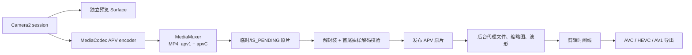

# 18.22 Android 17 Advanced Professional Video 与专业视频编解码管线

平台源码固定到 Android 17 / API 37 的 `android-17.0.0_r1`，kernel 固定到 `android17-6.18-2026-06_r6`。APV 在 Android 16 引入，Android 16 的 36.1 次版本补上 `MediaRecorder.VideoEncoder.APV`，Android 17 又增加录制质量参数。版本演进按公开接口说明，源码结论均以 Android 17 tag 为准。

## APV 解决的是专业素材问题

APV 的目标场景是高质量录制、剪辑和后期交换。官方列出的核心特征包括：

- 只做帧内编码，不使用像素域预测，便于随机访问和并行处理；
- 以较低复杂度承载 2K、4K、8K 的高码率素材；
- 支持 frame tile、多视图，以及深度、alpha、预览等辅助视频；
- 支持多种色度采样、位深、HDR10 / HDR10+ 和用户元数据；
- 经多次解码、再编码后，画质劣化仍应受到控制。

这些特征让 APV 更接近录制母版或剪辑中间格式。HEVC、AV1 常以更高压缩率服务分发，长 GOP 内容的任意帧访问和反复转码成本也更高。APV 用存储空间换取编辑响应、并行性和代际画质。

产品侧不宜把 APV 设成普通拍摄的默认格式。Pro Video、现场粗剪、调色、素材交换等模式可以提供 APV；分享、上传和广泛播放仍要准备 AVC、HEVC 或 AV1 导出。系统认识 `video/apv`，不代表接收文件的 App、桌面软件或云端处理服务也认识它。

## “平台支持”要拆成三层

讨论 APV 支持时，下面三层不能合并成一句“Android 支持 APV”：

| 层次 | Android 17 能确认什么 | 仍需运行时或设备验证什么 |
| :--- | :--- | :--- |
| 标准与公开 API | `video/apv`、APV profile / level、P210、MediaRecorder APV、MP4 muxing 均有公开入口 | 目标 SDK 与运行版本是否满足接口要求 |
| AOSP 参考实现 | `frameworks/av` 有 C2 APV 软编码器、软解码器和 MP4 writer | 产品是否启用组件、组件对外公布的规格 |
| 设备产品能力 | `MediaCodecList` 可查询 vendor 和 platform codec | 硬件加速、Camera 输入组合、4K/8K、持续码率、温控和稳定性 |

这一区分也适用于显示。设备能解码 APV，不表示 APV 图层一定被 HWC 作为硬件 overlay 扫出；普通 Surface 输出仍交给 SurfaceFlinger 和 HWC 每帧决定合成方式。

## Android 16 到 Android 17 的公开接口

Android 16 的公开常量覆盖了 APV 422-10 的主要契约：

- `MediaFormat.MIMETYPE_VIDEO_APV = "video/apv"`；
- `MediaCodecInfo.CodecProfileLevel.APVProfile422_10 = 0x01`；
- `APVProfile422_10HDR10 = 0x1000`；
- `APVProfile422_10HDR10Plus = 0x2000`；
- APV Level 1 到 Level 7.1，以及每一级的 Band 0 到 Band 3；
- `CodecCapabilities.COLOR_FormatYUVP210`，即 10-bit、4:2:2、半平面 P210。

Android 16 平台承诺的实现范围是 APV 422-10：YUV 4:2:2、10-bit，目标码率最高 2 Gbps。官方同时用“数 Gbps、2K/4K/8K”描述 APV 标准的设计范围。这里的 2 Gbps 是平台 profile 的目标上限，不是每台 Android 16 或 Android 17 设备的最低能力。

P210 的 Y、Cb、Cr 样本都使用 16-bit 容器，只有高 10 bit 承载有效数据；4:2:2 半平面布局平均分配 32 bit/pixel。位深是 10-bit，不等于内存中每个样本只占 10 bit。

`MediaRecorder.VideoEncoder.APV = 9` 在 API 文档中标为 36.1。需要兼容 Android 16.0 与 16.1 时，应使用 `Build.VERSION.SDK_INT_FULL` 和 `Build.VERSION_CODES_FULL.BAKLAVA_1` 区分次版本；只查 `SDK_INT == 36` 无法判断高层录制入口是否可用。Android 17 的 `VERSION_CODES.CINNAMON_BUN` 为 37，已经包含该入口。

Android 17 新增 `MediaRecorder.setVideoEncodingQuality(int)`。它只会在选中编码器支持 `EncoderCapabilities.BITRATE_MODE_CQ` 时生效，取值范围来自该编码器的 `getQualityRange()`。同一次配置不要同时设置 encoding quality 和 video bitrate，API 文档将这种组合定义为行为未指定。质量值也没有跨 codec 的统一刻度，不能把 vendor A 的 `80` 与 vendor B 的 `80` 当成同一画质。

## 能力探测要检查完整 MediaFormat

只列出 `video/apv` codec，再调用 `areSizeAndRateSupported()`，会漏掉 profile、码率、输入色彩格式和编码模式。下面的代码用于探测 APV 编码器；它分别检查 Surface 输入和 P210 buffer 输入，并把 performance point 的“未知”状态保留下来。

```kotlin
@RequiresApi(36)
data class ApvEncoderProbe(
    val name: String,
    val canonicalName: String,
    val hardware: Boolean,
    val softwareOnly: Boolean,
    val vendor: Boolean,
    val requestedProfileAdvertised: Boolean,
    val requestedLevelCovered: Boolean?,
    val sizeRateSupported: Boolean,
    val bitrateSupported: Boolean,
    val surfaceInputAdvertised: Boolean,
    val p210InputAdvertised: Boolean,
    val surfaceFormatSupported: Boolean,
    val p210FormatSupported: Boolean,
    val cqSupported: Boolean,
    val performancePointCoversTarget: Boolean?
)

@RequiresApi(36)
fun findApvEncoders(
    width: Int,
    height: Int,
    fps: Int,
    bitrate: Int,
    profile: Int = MediaCodecInfo.CodecProfileLevel.APVProfile422_10,
    level: Int? = null
): List<ApvEncoderProbe> {
    val mime = MediaFormat.MIMETYPE_VIDEO_APV
    val targetPoint =
        MediaCodecInfo.VideoCapabilities.PerformancePoint(width, height, fps)

    fun requestedFormat(colorFormat: Int) =
        MediaFormat.createVideoFormat(mime, width, height).apply {
            setInteger(MediaFormat.KEY_FRAME_RATE, fps)
            setInteger(MediaFormat.KEY_BIT_RATE, bitrate)
            setInteger(MediaFormat.KEY_PROFILE, profile)
            setInteger(MediaFormat.KEY_COLOR_FORMAT, colorFormat)
            level?.let { setInteger(MediaFormat.KEY_LEVEL, it) }
        }

    return MediaCodecList(MediaCodecList.ALL_CODECS).codecInfos.mapNotNull { info ->
        if (!info.isEncoder || info.isAlias) return@mapNotNull null
        if (info.supportedTypes.none { it.equals(mime, ignoreCase = true) }) {
            return@mapNotNull null
        }

        val caps = runCatching { info.getCapabilitiesForType(mime) }.getOrNull()
            ?: return@mapNotNull null
        val videoCaps = caps.videoCapabilities ?: return@mapNotNull null
        val encoderCaps = caps.encoderCapabilities ?: return@mapNotNull null

        val profileAdvertised = caps.profileLevels.any { it.profile == profile }
        val levelCovered = level?.let { requestedLevel ->
            caps.profileLevels.any {
                it.profile == profile && it.level >= requestedLevel
            }
        }
        val surfaceAdvertised = caps.colorFormats.any {
            it == MediaCodecInfo.CodecCapabilities.COLOR_FormatSurface
        }
        val p210Advertised = caps.colorFormats.any {
            it == MediaCodecInfo.CodecCapabilities.COLOR_FormatYUVP210
        }
        val sizeRateSupported =
            videoCaps.areSizeAndRateSupported(width, height, fps.toDouble())
        val bitrateSupported = videoCaps.bitrateRange.contains(bitrate)

        fun supports(colorFormat: Int, colorAdvertised: Boolean): Boolean {
            if (!profileAdvertised ||
                levelCovered == false ||
                !colorAdvertised ||
                !sizeRateSupported ||
                !bitrateSupported
            ) {
                return false
            }
            return runCatching {
                caps.isFormatSupported(requestedFormat(colorFormat))
            }.getOrDefault(false)
        }

        ApvEncoderProbe(
            name = info.name,
            canonicalName = info.canonicalName,
            hardware = info.isHardwareAccelerated,
            softwareOnly = info.isSoftwareOnly,
            vendor = info.isVendor,
            requestedProfileAdvertised = profileAdvertised,
            requestedLevelCovered = levelCovered,
            sizeRateSupported = sizeRateSupported,
            bitrateSupported = bitrateSupported,
            surfaceInputAdvertised = surfaceAdvertised,
            p210InputAdvertised = p210Advertised,
            surfaceFormatSupported = supports(
                MediaCodecInfo.CodecCapabilities.COLOR_FormatSurface,
                surfaceAdvertised
            ),
            p210FormatSupported = supports(
                MediaCodecInfo.CodecCapabilities.COLOR_FormatYUVP210,
                p210Advertised
            ),
            cqSupported = encoderCaps.isBitrateModeSupported(
                MediaCodecInfo.EncoderCapabilities.BITRATE_MODE_CQ
            ),
            performancePointCoversTarget =
                videoCaps.supportedPerformancePoints?.any { it.covers(targetPoint) }
        )
    }
}
```

`requestedLevelCovered == null` 表示调用方没有约束 level/band。传入 `level` 时，代码只复刻 Android 17 Java legacy capability 路径的 `supportsProfileLevel()` 准入判断：同一 profile 下，组件公布的 level 常量数值大于或等于请求值，便让该请求进入后续 format 检查。APV 的 level 高位和 band 低位会同时影响采样率、码率上限，这个数值比较是 framework capability 的近似入口，不是 APV level/band 的规格证明；要求严格落在某个 band 时，还要按 APV 表独立核算采样率和码率。

`isFormatSupported()` 会联合检查 MIME、尺寸、帧率、profile、level、码率等字段；输入色彩格式仍单独与 `colorFormats` 交叉检查，便于诊断 vendor 上报不一致。这里还有一条容易遗漏的 API 边界：`KEY_LEVEL` 能参与 profile/level 组合检查，但文档明确说明，它不会证明其他 format 参数满足调用方指定的那个 level。Android 17 的 Java legacy capability 路径会改用该 profile 的最高已公布 level 检查关键参数；无论设备走 Java legacy 还是 native capability 路径，公开 API 都没有给出“其余参数符合指定 level”的保证。工作流若要求输出严格落在某个 APV level/band，还要独立核算目标采样率与码率，并检查 configure 后的 output format 和生成码流。HDR 录制应把 `profile` 换成 HDR10 或 HDR10+ 版本，并继续设置、核对 color standard、transfer、range 和静态/动态 HDR 元数据，不能只换一个 profile 常量。

`supportedPerformancePoints == null` 表示 codec 没有公布性能点；空列表表示 codec 明确不保证任何性能点；非空且覆盖目标规格才是厂商给出的单实例性能保证。性能点也不覆盖 Camera、存储、温控和多 codec 并发，所以它是准入证据之一，不是长时间录制承诺。

查询通过后，还要完成一次 `configure()`、`createInputSurface()`、短录制、`MediaMuxer.stop()`、重新解封装和解码校验。部分组合可能在能力表中出现，却在资源不足、Camera session 组合不成立或 vendor codec 初始化时失败。

## Android 17 的 AOSP 软件 APV 不是设备兜底承诺

`android-17.0.0_r1` 的 `frameworks/av` 包含：

- `c2.android.apv.encoder`；
- `c2.android.apv.decoder`。

两者都由固定只读 flag `android.media.swcodec.flags.apv_software_codec` 控制；factory 在 flag 关闭时直接返回 `nullptr`，并要求系统至少为 API 36 / Baklava。媒体 XML 还把组件标成 `enabled="false"`、`minsdk="36"` 和 `variant="!slow-cpu"`。因此，AOSP 仓库里有源码，不表示任意 GMS 或 AOSP 产品都会列出这两个组件。

参考组件自身和 XML 的限制也比 APV 标准上限窄：

| 项目 | Android 17 AOSP 参考实现 |
| :--- | :--- |
| profile | 只公布 `PROFILE_APV_422_10` |
| XML 公布的尺寸 | 最大 `1920x1920` |
| 码率 | 最大 `240,000,000` bit/s |
| encoder C2 接口尺寸 | 代码允许到 `4096x4096`，但产品能力仍受更严格的 XML 与运行时查询约束 |
| 默认状态 | 组件条目关闭，并受 flag 与 `!slow-cpu` variant 约束 |

XML 为软编码器公布了 VBR、CQ 和 `quality=0..100`，编码器代码却只在另一个固定只读 flag `android.media.swcodec.flags.apv_software_codec_cq` 开启时加入 CQ 对应的 C2 bitrate-mode 参数。这个差异再次说明，应用要以运行时 `EncoderCapabilities` 和一次真实 configure 为准，不能只读静态 XML。

这组值说明，2 Gbps、4K、8K 要依赖具备对应能力的 vendor 实现，不能把 AOSP 软件 codec 当成高规格保底方案。`MediaCodecInfo.java` 对 APV level/band 的理论采样率和码率做了映射；高等级码率超过 Java `int` 表达范围时，内部上限会收敛到 `Integer.MAX_VALUE`。应用的 `KEY_BIT_RATE` 也是 `int`，2,000,000,000 bit/s 虽然仍可表示，但已经接近上界。

### 422-10 码流不保证输出仍是 P210

AOSP 软编码器默认接受 implementation-defined 和 `YCBCR_420_888`，并在硬件缓冲区能力允许时加入 P010、P210、RGBA1010102。编码前，它会把不同输入转换成 P210 或 4:2:2 10-bit 内部表示。由此可以得到两条工程结论：

1. Camera → codec 的 Surface 链路可能避免应用 CPU 拷贝，但不能据此断定 codec 内部零转换。
2. Camera 能建立 10-bit/HDR session，也不等于它能以 P210 直接供给 APV encoder；Camera stream combination 和 codec 输入能力要分别查询。

`C2SoftApvDec.cpp` 的输出像素格式参数默认是 `HAL_PIXEL_FORMAT_YCBCR_420_888`，平台支持时会把 P010、P210、RGBA1010102 和 implementation-defined 加入候选。实际取 buffer 时，默认 `YCBCR_420_888` 路径会落到 YV12；显式请求 P210、P010、RGBA1010102 等平台支持的格式时，代码先按请求值取 buffer；请求 implementation-defined 或请求值不可用时，才按 P210、P010、RGBA1010102、YV12 的顺序回退。P010 是 4:2:0 10-bit，YV12 通常是 4:2:0 8-bit。剪辑或调色 App 如果需要保住 4:2:2 和 10-bit，必须核对 decoder 的 `colorFormats`、configure 后的 output format，以及收到的 `Image` / `HardwareBuffer` 格式。只看 APV bitstream profile 会漏掉输出阶段的降采样或位深损失。

## 码率、内存带宽和存储要用同一组规格计算

2 Gbps 等于 250 MB/s。按固定码率估算，录制 4 分钟会写入约 60 GB 编码视频数据，尚未计入音频、容器和文件系统开销；1 Gbps 也需要持续写入约 125 MB/s。

Camera 到 encoder 的输入同样不可忽略。P210 分配 32 bit/pixel，3840 × 2160、60 fps 的一遍线性读流量约为：

`3840 × 2160 × 4 byte × 60 ≈ 1.99 GB/s`

这只是按有效画面尺寸计算的一遍读取，没有包含 stride、对齐、Camera 写入、codec 内部转换、缓存维护、预览、输出和其他消费者。它不能代替 SoC 带宽计数器，但足以说明“编码输出只有 250 MB/s”不是整条管线的内存成本。

录制准入至少检查四组条件：

- codec：完整 `MediaFormat`、硬件/软件属性、profile / level、Surface/P210 输入、CQ 或目标码率模式；
- Camera：目标动态范围、位深、分辨率、帧率与双 Surface session 组合；
- 存储：目标卷、剩余空间、持续写入能力、外接设备断开和空间预留；
- 温控：开始时 thermal status、录制期间降档门槛、codec reset 和相机关闭策略。

一次 10 秒测试只能证明初始化和短时写入可用。高规格开放条件应来自同一 codec、Camera 组合和存储卷上的长时间压力测试。运行时再以滚动写入耗时、输出 buffer 积压、thermal status 和剩余空间触发有滞回的降档，避免在相邻档位间反复切换。

## 专业视频 App 应拆开录制、预览、代理和导出

下面的图用于标出交互路径和后台路径的分界。



录制时保留独立预览 Surface，不要把“APV 编码后再解码”放进取景链路。预览 Surface 与 encoder input Surface 能否同时配置，由 Camera2 的 stream combination 和目标动态范围决定。即使 APV encoder 支持 4K60，Camera session 不接受这组输出时，录制仍无法开始。

剪辑时间线可优先读取低分辨率代理文件，拖动、裁剪、缩略图和波形生成不必反复访问高码率原片。导出再读取 APV 原片，并根据接收端选择 AVC、HEVC 或 AV1。代理文件必须与原片建立稳定的素材 ID、时间基准和变换关系，不能只靠同名文件匹配。

项目数据库至少记录：

- 原片、代理、缩略图、波形、导出件和临时文件的角色；
- 原始 codec、profile / level、色彩与 HDR 信息；
- 降档原因、发生时间和降档前后规格；
- 文件是否可重建、是否已校验、最近访问时间；
- MediaStore URI、卷 ID 和用户是否已导出。

这样清理程序才能只删除可重建数据，也能在外接存储断开后保留项目关系。

## MP4 封装与异常退出

Android 的 `MediaMuxer` 从 API 36 起支持把 APV 写入 MP4。`android-17.0.0_r1` 的 `MPEG4Writer.cpp` 为 APV 使用 sample entry `apv1`，并把 codec-specific data 写进 `apvC` box。APV 编码器存在，不代表 WebM、3GP 或任意自定义容器都可直接使用同一输出；平台公开表只给 APV 标出 MP4。

使用 scoped storage 时，可以把 `MediaStore` 返回的 `FileDescriptor` 交给 `MediaMuxer`。文件在 `stop()` 成功、重新打开并完成基本解码校验前保持 `IS_PENDING=1`，校验通过后再发布。进程被杀、存储断开、空间耗尽或 `stop()` 抛异常时，MP4 可能尚未形成可用的索引和尾部结构；这类文件应保留为待恢复状态或安全删除，不能直接显示为成功素材。

写入队列要设置上限。muxer 或文件系统变慢时，无限缓存 encoder output 只会把存储停顿改写成内存耗尽。产品可以按风险选择停止录制、降低后续录制档位或提示用户切换存储，但不要在同一个 MP4 track 中悄悄切换 codec。

## 降级要同时覆盖规格、格式和工作流

APV 的降级可以分成三组：

- 规格降级：降低分辨率、帧率或码率；每个档位都要重新通过完整 format 和 Camera session 探测。
- 格式降级：APV 编码器缺失、不是硬件实现或压力测试不稳定时，专业模式可回到设备已验证的 HEVC 10-bit/HDR 组合，普通模式可回到 HEVC 或 AVC。
- 工作流降级：保留 APV 原片，预览与剪辑使用代理文件，分享时转成广泛支持的格式。

APV 是帧内格式，录制过程中直接切到另一种 codec 通常意味着结束当前文件并新建 segment。项目层要记录 segment 边界、规格、时间戳映射与降级原因，导出时再把它们组织成连续时间线。

用户界面也要区分“设备不支持”“当前温控或存储条件不允许”和“本次运行失败”。这三种状态的恢复方式不同：前者通常固定到设备组合，中间一类可在条件改善后恢复，后一类需要保留 codec、Camera 和 I/O 诊断。

## Perfetto、媒体指标与 kernel 边界

APV 编码算法、C2 component 和 MP4 writer 位于 framework/vendor 用户空间。kernel tag 不定义 `video/apv`，也不承诺 422-10 或 2 Gbps。`android17-6.18-2026-06_r6` 只用于固定这些通用机制的语义：

- `dma-buf` 与 dma-fence / `sync_file`：Camera、codec、GPU、SurfaceFlinger 之间的共享 buffer 与完成同步；
- `sched`、CPU frequency 和 idle：编码、Camera、写入线程的调度与降频现象；
- block layer：高码率持续写入的请求排队和长尾；
- thermal framework：温控事件向设备策略传递的基础设施。

Perfetto 调查可按症状选择证据：

| 症状 | 优先观察 |
| :--- | :--- |
| 取景卡顿 | Camera request/result、buffer wait、预览 Surface、SurfaceFlinger、主线程 |
| encoder input 堵塞 | Camera 输出节奏、acquire/release fence、codec callback、C2/vendor 线程、sched |
| 输出码率或帧率异常 | 实际 sample size、PTS、codec output format、MediaCodec metrics |
| 写入停顿 | muxer 写入切片、文件系统与 block I/O、队列深度、剩余空间 |
| 长录后失败 | thermal、CPU/GPU frequency、codec reset、Camera error、后台 I/O 竞争 |
| 素材不可播放 | `stop()` 结果、MP4 box、track format、首尾 sample、重新解码结果 |

block、vendor codec、Camera HAL 和部分 thermal 数据源在量产机上未必可采集。应用应使用 `Trace.beginSection()` 或 Perfetto Track Event 标出 configure、start、首个 sample、写入批次、stop、校验与降级，同时保留可线上采集的计数器。没有底层数据源时，应用时间线仍能判断停顿发生在 encoder output 之前还是 muxer 写入之后。

每次录制至少记录 codec name、canonical name、hardware/software、vendor/platform、profile/level、color format、bitrate mode、目标与实际码率、Camera session 规格、存储卷、thermal status、异常诊断和停止原因。APV 支持不能按机型名称粗略推断，同一机型的 vendor image、存储状态和温控条件也可能不同。

## APV、HEVC、AV1 与 ProRes 的工作流差异

| 格式 | 常见位置 | 主要优势 | Android 侧注意点 |
| :--- | :--- | :--- | :--- |
| APV | 专业录制母版、剪辑中间素材 | 帧内、编辑友好、面向高码率和多次处理 | API 36 起有平台入口；设备 codec、Camera、存储能力均需探测 |
| HEVC | 高画质录制、交付、分发 | 压缩效率与移动端硬件覆盖较成熟 | 10-bit、HDR、帧率和编码能力仍按 codec 组合确认 |
| AV1 | 网络分发、归档 | 压缩效率高 | 解码覆盖与编码吞吐不同，移动端硬件编码不能按 API level 假设 |
| ProRes | 已采用该格式的专业后期交换 | 桌面后期工具使用广 | Android framework 没有可供所有设备依赖的统一 ProRes codec 契约 |

同一个项目可以同时使用多种格式：APV 保存母版，代理文件服务剪辑，HEVC 或 AV1 负责交付。格式选择跟随工作阶段，不需要给整个 App 固定一个“最优编码”。

## OpenAPV 的用途与平台边界

[OpenAPV](https://github.com/AcademySoftwareFoundation/openapv) 是 APV 的开源参考实现。其当前 README 列出的完整 profile 包括 422-10、422-12、444-10、444-12、4444-10、4444-12 和 400-10，并提供 ARM NEON、x86 SSE/AVX 优化、tile 多线程、HDR/用户元数据，以及 CQP、ABR 码率控制。

它适合用来：

- 阅读 bitstream 和 profile 行为；
- 生成可重复的编码、解码测试素材；
- 验证桌面或服务端工具；
- 对 vendor codec 做码流与画质交叉校验。

OpenAPV 支持的 profile 集合大于 Android 17 平台公开的 APV 422-10 集合。把 OpenAPV 编进应用，也只证明应用带有一套软件实现；它不能证明 Android 设备有 APV 硬件 codec、Camera 能输出目标规格、MediaCodec 会选中该实现，或 HWC 能用 overlay 显示解码结果。

## 线上分桶与准入指标

APV 上线时应把能力和结果分开记录：

- 版本：`SDK_INT`、`SDK_INT_FULL`、vendor build、应用版本；
- codec：name、canonical name、hardware/software、vendor/platform、profile/level、color format、performance point、CQ 支持；
- Camera：camera ID、dynamic range、分辨率、帧率、session 输出组合；
- 录制：目标/实际码率、sample PTS 连续性、录制时长、segment 和降档记录；
- 存储：卷 ID、内置/外接、开始/结束剩余空间、写入耗时分位数；
- thermal：开始/峰值/结束 status、CPU/GPU frequency 变化、触发的策略；
- 结果：muxer stop、重新解封装、首尾抽样解码、代理生成和导出是否成功。

崩溃率不能单独回答 APV 是否可用。更有意义的指标是录制成功率、文件可重新打开率、抽样解码成功率、有效录制时长、写入超时率、温控/空间降档比例和导出成功率。高规格只对已经通过长时验证的 codec + Camera + 存储组合开放。

## Android 17 源码与文档锚点

- [Android 16 APV 功能说明](https://developer.android.com/about/versions/16/features#apv)：APV 定位、标准特征与 Android 422-10 实现范围。
- [Android 17 CQ 功能说明](https://developer.android.com/about/versions/17/release-notes#audio-video)与 [`MediaRecorder` API](https://developer.android.com/reference/android/media/MediaRecorder#setVideoEncodingQuality(int))：CQ 入口、适用条件与质量值边界。
- [`CodecCapabilities.isFormatSupported()`](https://developer.android.com/reference/android/media/MediaCodecInfo.CodecCapabilities#isFormatSupported(android.media.MediaFormat))：format keys 的检查范围，以及指定 level 不约束其他参数的文档边界。
- [Android 17 `MediaFormat.java`](https://android.googlesource.com/platform/frameworks/base/+/refs/tags/android-17.0.0_r1/media/java/android/media/MediaFormat.java)：`MIMETYPE_VIDEO_APV` 与 format keys。
- [Android 17 `MediaCodecInfo.java`](https://android.googlesource.com/platform/frameworks/base/+/refs/tags/android-17.0.0_r1/media/java/android/media/MediaCodecInfo.java)：APV profile/level、P210、能力检查和码率上限映射。
- [Android 17 `MediaRecorder.java`](https://android.googlesource.com/platform/frameworks/base/+/refs/tags/android-17.0.0_r1/media/java/android/media/MediaRecorder.java)：APV encoder 常量与 `setVideoEncodingQuality()`。
- [MediaMuxer API](https://developer.android.com/reference/android/media/MediaMuxer)：APV 从 API 36 起支持 MP4。
- [Android 17 software codec flags](https://android.googlesource.com/platform/frameworks/av/+/refs/tags/android-17.0.0_r1/media/aconfig/swcodec_flags.aconfig)：APV 软件 codec 与 CQ 模式的固定只读 flags。
- [Android 17 `C2SoftApvEnc.cpp`](https://android.googlesource.com/platform/frameworks/av/+/refs/tags/android-17.0.0_r1/media/codec2/components/apv/C2SoftApvEnc.cpp) 与 [`C2SoftApvDec.cpp`](https://android.googlesource.com/platform/frameworks/av/+/refs/tags/android-17.0.0_r1/media/codec2/components/apv/C2SoftApvDec.cpp)：参考软 codec、profile、flag 和像素格式转换。
- [Android 17 software codec XML](https://android.googlesource.com/platform/frameworks/av/+/refs/tags/android-17.0.0_r1/media/libstagefright/data/media_codecs_google_c2_video.xml)：参考组件的启用状态、尺寸、码率和编码模式声明。
- [Android 17 `MPEG4Writer.cpp`](https://android.googlesource.com/platform/frameworks/av/+/refs/tags/android-17.0.0_r1/media/libstagefright/MPEG4Writer.cpp)：`apv1` sample entry 与 `apvC` box。
- Kernel common `android17-6.18-2026-06_r6`：[dma-buf](https://android.googlesource.com/kernel/common/+/refs/tags/android17-6.18-2026-06_r6/drivers/dma-buf/dma-buf.c)、[sync_file](https://android.googlesource.com/kernel/common/+/refs/tags/android17-6.18-2026-06_r6/drivers/dma-buf/sync_file.c)、[scheduler](https://android.googlesource.com/kernel/common/+/refs/tags/android17-6.18-2026-06_r6/kernel/sched/core.c)、[block layer](https://android.googlesource.com/kernel/common/+/refs/tags/android17-6.18-2026-06_r6/block/blk-core.c) 与 [thermal framework](https://android.googlesource.com/kernel/common/+/refs/tags/android17-6.18-2026-06_r6/drivers/thermal/thermal_core.c)。

## 小结

APV 给 Android 增加的是专业录制和后期素材能力。Android 17 已有 MIME、422-10 profile、P210、MediaRecorder、MediaMuxer 和录制质量接口，但这些 API 只建立公共契约。应用仍要核对 codec、Camera、像素格式、存储和温控，并用完整录制与回读测试证明目标规格可用。

设计专业视频功能时，需要守住三条边界：标准上限不等于设备能力，422-10 码流不等于处理链始终保持 P210，codec 可用也不等于显示层获得硬件 overlay。把这三条边界写进能力探测、项目数据和线上指标，APV 才能成为可靠的母版格式选项。
