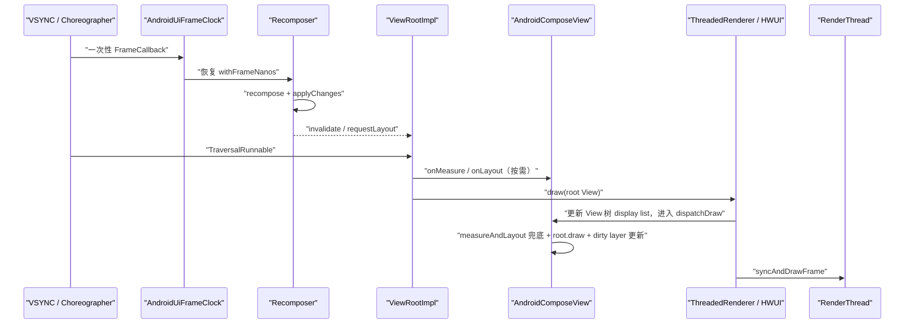
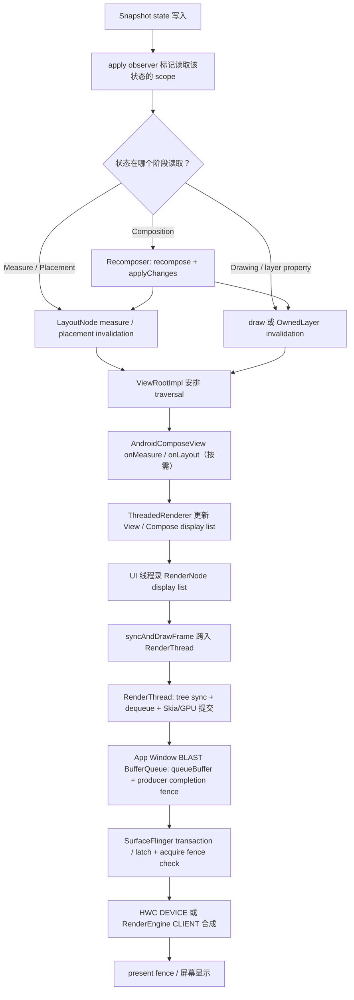

# 18.23 Android 17 Jetpack Compose 渲染管线架构

Compose 改写了 UI 的描述、状态追踪和节点更新方式，却没有绕过 Android 的 App Window 渲染管线。对一个开启硬件加速、没有额外独立 Surface 的普通 Compose 页面，像素仍经由 `ViewRootImpl`、HWUI、RenderThread、App Window 的 BLAST BufferQueue、SurfaceFlinger 和 HWC 到达屏幕。

这条边界是分析 Compose 卡顿的起点：Composition、Layout 和 Drawing 属于 Compose；窗口 buffer 的生产、合成与 present 属于 Android 图形栈。只盯着重组次数，解释不了 RenderThread、GPU 或 SurfaceFlinger 造成的慢帧。

## 复核基线与阅读边界

复核日期为 2026-07-31，采用以下基线。平台、Jetpack 与内核必须分别记录，不能用 Android 版本替代 Compose 版本。

| 层级 | 基线 | 说明 |
| --- | --- | --- |
| Android 平台 | Android 17 / API 37 / `android-17.0.0_r1` | `Choreographer`、`ViewRootImpl`、`ThreadedRenderer`、`HardwareRenderer`、HWUI、SurfaceFlinger |
| Jetpack Compose | Compose BOM `2026.06.01`，Runtime/UI/Foundation `1.11.4` | Compose 独立发布，不属于 `android-17.0.0_r1` 源码标签 |
| Android 内核 | `android17-6.18-2026-06_r6` | 调度、cpuset、cpufreq、dma-buf 与 fence 等机制；内核没有 Composition 或 LayoutNode |

讨论范围限定为 Android 12 至 Android 17 上的硬件加速 App Window。软件 Canvas、截图/离屏捕获、Preview，以及 `SurfaceView`、`TextureView`、视频或相机等独立 Producer 会改变局部路径，不能套用“单一窗口 buffer”的结论。

## Compose 改了什么，复用了什么

Compose 主要提供四组机制：

- `Snapshot` 追踪状态读写，并把变更送到相关观察者；
- `Recomposer` 对失效的 restart scope 执行 recomposition 和 `applyChanges`；
- `LayoutNode` 树执行 Compose 自己的测量、放置、绘制和语义处理；
- `OwnedLayer` / `GraphicsLayer` 保存可复用的绘制内容与图层属性。

窗口侧仍由 Android 平台负责：

- `AndroidComposeView` 作为 `ViewGroup` 接入 View 树；
- `ViewRootImpl` 安排 traversal 与 draw；
- UI 线程把 View/Compose 绘制操作录入 RenderNode display list；
- RenderThread 同步 RenderNode 树，通过 Skia 生成并提交 GPU 工作；
- App Window Producer 把 buffer 排入队列；
- SurfaceFlinger latch buffer、构建合成状态，并交给 HWC 或 RenderEngine；
- 显示系统在选定的 frame timeline 上 present。

因此，“Compose 有独立渲染引擎”这个说法过于宽泛。Compose 有独立的 UI runtime 和节点系统；在 Android 的常规硬件加速窗口里，它使用 HWUI 图形后端。

## 两条帧驱动在同一主线程会合

Compose 与 View traversal 都使用 Choreographer，但工作不同：

1. `AndroidUiFrameClock` 为等待 `withFrameNanos` 的协程注册一次性 `Choreographer.FrameCallback`。`Recomposer` 用它对齐动画、重组和变更应用。
2. `ViewRootImpl` 的 traversal callback 驱动窗口的 measure、layout、draw 与 HWUI 提交。

下面的时序图用于区分这两类回调。



图中两个 Choreographer 回调可能落在同一帧，却不能合并成“Compose 在自己的 `doFrame` 中完成布局和提交”。重组应用状态变化；窗口 traversal 决定何时调用 `onMeasure`、`onLayout` 和 draw。

Compose 1.11.4 的 `AndroidUiFrameClock` 采用一次性回调。下面的缩写代码只展示注册和取消语义。

```kotlin
override suspend fun <R> withFrameNanos(onFrame: (Long) -> R): R =
    suspendCancellableCoroutine { continuation ->
        val callback = Choreographer.FrameCallback { frameTimeNanos ->
            continuation.resumeWith(runCatching { onFrame(frameTimeNanos) })
        }
        choreographer.postFrameCallback(callback)
        continuation.invokeOnCancellation {
            choreographer.removeFrameCallback(callback)
        }
    }
```

这个回调不会在 `doFrame` 内再次注册自己。后续是否申请帧取决于新的 `withFrameNanos` 等待者和待处理工作；把它写成永久自循环会误导功耗与调度分析。

## AndroidComposeView：Compose 与 ViewRoot 的接缝

`ComposeView` / `AbstractComposeView` 负责创建 composition；具体承载 Compose 节点树的是内部 `AndroidComposeView`。后者继承 `ViewGroup`，但普通 Compose 子节点不是 Android `View`。

Compose 1.11.4 的三个入口各有明确职责：

| Android 入口 | Compose 工作 | 需要注意的边界 |
| --- | --- | --- |
| `onMeasure()` | 把 `MeasureSpec` 转成 Compose `Constraints`，更新 root constraints 并执行所需测量 | 仍受父 View 的测量契约约束 |
| `onLayout()` | 调用 `MeasureAndLayoutDelegate.measureAndLayout()`，完成待处理测量/放置并更新根边界 | Layout 不在 `AndroidUiFrameClock` 回调里直接完成 |
| `dispatchDraw()` | 再做一次 `measureAndLayout()` 兜底，调用 `root.draw()`，更新 dirty `OwnedLayer` | 兜底路径允许 draw 前清理新产生的布局请求 |

硬件加速 draw 的调用顺序也应说清楚。Android 17 的 `ViewRootImpl.performDraw()` 进入 `ThreadedRenderer.draw()`；`ThreadedRenderer` 先通过 `updateRootDisplayList()` 更新 View 树的 display list，期间会调用 `AndroidComposeView.dispatchDraw()`，随后才执行 `syncAndDrawFrame()`。

UI 线程负责 RenderNode display list 的录制。RenderThread 接手已经录好的渲染节点树及其属性，执行 tree sync、buffer 获取、Skia/GPU 工作提交和 buffer 入队。把 RenderThread 描述为“录 Compose display list”会混淆两种记录过程。

## Composition、Layout、Drawing 可以分别失效

Composable 函数不会简单地“一次执行，依次完成三阶段”。状态在哪个阶段被读取，决定变更从哪个 restart scope 开始传播。

| 状态读取位置 | 变更后的主要工作 | 可能跳过的阶段 |
| --- | --- | --- |
| Composable 函数体 | Recomposition，随后按变更结果请求 Layout 或 Drawing | 无法预先保证 |
| 测量 lambda | 重新测量受影响节点和必要祖先/子树 | 可跳过 Recomposition |
| 放置 lambda | 重新放置相关节点 | 可跳过 Recomposition，常可跳过测量 |
| draw lambda | 重录所属 layer 的绘制内容 | 可跳过 Recomposition 和 Layout |
| `graphicsLayer {}` 属性 lambda | 更新 layer 属性 | 内容未变时可复用 display list |

下面的例子用于展示“延后读取”如何把高频位置变化限制在 Layout 或 layer 属性阶段。

```kotlin
@Composable
fun MovingBadge(offsetPx: State<Int>) {
    Box(
        Modifier
            .offset { IntOffset(offsetPx.value, 0) }
            .graphicsLayer {
                alpha = if (offsetPx.value > 0) 1f else 0.6f
            }
    )
}
```

`offset {}` 在布局阶段读取状态，`graphicsLayer {}` 在 layer 属性更新时读取状态。是否值得这样做要以 trace 为准：同一个状态被两个阶段读取，也会建立两组观察关系；这段代码只是说明作用域边界。

### Recomposition 不等于重绘

Recomposition 负责重新执行失效的 composable scope 并生成变更。若参数未变且满足跳过条件，scope 可以被跳过；若变更只影响副作用或语义，也不一定产生新的绘制内容。

反过来，Drawing 也可以在没有 Recomposition 的情况下发生。例如 `Canvas`、`drawWithContent` 或 layer 属性 lambda 在绘制相关 scope 读取状态，状态变化可直接使相应绘制范围失效。

Strong Skipping 属于 Compose Compiler / Kotlin 工具链能力。它从 Kotlin 2.0.20 起默认启用，不能写成 Android 17 的平台特性。稳定参数通常按 `equals` 比较，不稳定参数通常按实例比较；跳过仍受 restartable、参数变化以及编译器推断结果约束。

## LayoutNode 的测量与放置

`LayoutNode` 是 Compose UI 树的核心节点。父节点通过 `Constraints(minWidth, maxWidth, minHeight, maxHeight)` 测量子节点，子节点返回 `Placeable`，父节点在 `MeasureResult` 的 placement block 中确定位置。

Compose 的常规布局协议要求一个 child 在一次 measure pass 中只测量一次，这有助于限制自定义布局的歧义。它不代表整棵树每帧只遍历一遍，也不代表 Compose 永远没有额外测量：

- Intrinsic measurement 会先查询固有尺寸；
- `SubcomposeLayout` 可在测量时按约束生成内容；
- Lazy 容器会按视口、缓存窗口与预取策略组合/测量项目；
- Lookahead 会维护预测布局信息；
- 约束、内容或依赖状态在 traversal 中变化时，可能产生新的测量请求；
- `dispatchDraw()` 仍会处理尚未完成的 measure/layout 请求。

所以，“Compose 比 View 快，因为只测量一次”不是可复用的结论。应在 Perfetto 中找出哪个节点、哪种布局策略和哪次状态变化扩大了测量范围。

## Drawing、GraphicsLayer 与 RenderNode

### 普通 LayoutNode 不等于一个 RenderNode

大多数 `Text`、`Row`、`Column` 不会各自持有独立 Android `RenderNode`。没有 layer 边界的节点会把绘制操作录入最近的所属 layer，根节点也有自己的绘制承载范围。

这也修正了一个常见表述：Compose 不是“只重录失效 LayoutNode 的 display list”。display list 的复用单位是 `OwnedLayer` / `GraphicsLayer` 等绘制边界。一个普通 LayoutNode 的 draw 内容发生变化，可能需要重录包含它的最近所属 layer。

### Android 17 上的 graphicsLayer 主路径

在 Android 12 至 Android 17 的范围内，Compose 1.11.4 的 `AndroidComposeView.createLayer()` 主路径创建 `GraphicsLayerOwnerLayer`。Android 17 对应的图形实现是 `GraphicsLayerV29`，内部使用公开的 `android.graphics.RenderNode`：

- `GraphicsLayerOwnerLayer.updateDisplayList()` 只在 dirty 时调用 `graphicsLayer.record(...)`；
- `GraphicsLayerV29` 通过 `RenderNode.beginRecording()` / `endRecording()` 保存绘制操作；
- 绘制时通过 `Canvas.drawRenderNode()` 引用该节点；
- translation、scale、rotation、alpha 等 layer 属性可以在内容不变时更新，避免重录内部 draw commands。

`RenderNodeLayer` 仍存在于兼容代码中，但不应作为 Android 17 + Compose 1.11.4 的主路径来讲。

### layer 边界不等于离屏 buffer

`Modifier.graphicsLayer` 会建立图形 layer 隔离边界，但是否先渲染到 offscreen buffer 由合成策略和效果决定。

| 条件 | RenderNode / layer 边界 | offscreen buffer |
| --- | --- | --- |
| 普通 LayoutNode，无显式 layer | 通常并入最近所属 layer | 无额外 offscreen |
| `graphicsLayer` + 平移/缩放/旋转 | 有 | 通常不需要 |
| `CompositingStrategy.Auto` + `alpha < 1` 且内容可能重叠 | 有 | 为保证整体 alpha 语义，可自动启用 |
| `RenderEffect` | 有 | 需要中间结果 |
| 非 `SrcOver` 的 `BlendMode` 或非空 `ColorFilter` | 有 | Compose 1.11.4 强制按 Offscreen 处理 |
| `CompositingStrategy.Offscreen` | 有 | 始终启用 |
| `CompositingStrategy.ModulateAlpha` | 有 | alpha 场景可避免，但重叠内容的视觉结果可能不同 |

离屏渲染会增加中间纹理、填充、带宽与 GPU 内存压力。`ModulateAlpha` 也不是无条件优化：只有内容不重叠、逐绘制指令调制 alpha 能满足视觉要求时才适用。

## 从状态写入到 present

下面的流程图把 Compose、HWUI、窗口队列和 SurfaceFlinger 放在一条证据链上。



这条链路里，`queueBuffer` 只说明 Producer 交付了一个带 fence 的 buffer，不说明 SurfaceFlinger 已 latch，更不说明屏幕已经显示。定位“用户看到的这一帧”时，要继续对齐 BufferTX、FrameTimeline、latch、合成和 present 证据。

### UI 线程与 RenderThread 的分工

UI 线程主要完成：

- Snapshot 通知、recomposition 与 `applyChanges`；
- Compose 测量和放置；
- View/Compose display list 的录制；
- 调用 `syncAndDrawFrame()` 并参与 HWUI 同步。

RenderThread 主要完成：

- 同步 RenderNode tree 和渲染属性；
- `dequeueBuffer` 取得可写的窗口 buffer，必要时等待消费者返回的 release fence；
- 让 Skia 构建/提交 GLES 或 Vulkan GPU 工作；
- 完成 swap/queue，把 producer completion fence 随 buffer 提交；Consumer 侧把它作为 acquire fence。

RenderThread trace slice 的长度不等于 GPU 执行时长。GPU 可能在 RenderThread 提交返回后继续工作；需要 GPU completion、fence 或 GPU counter 才能判断设备执行时间。类似地，`syncAndDrawFrame()` 返回通常也不能当成 present 完成。

## Snapshot 与 Recomposer 的并发边界

Snapshot 让状态读写拥有版本化视图，并用 read/write observer 建立失效关系。它不是“所有状态操作都无锁”的承诺，也不会让同一个 composition 自动并行重组。

对 Android UI 性能分析，保留以下边界就够了：

- 同一个 composition 不会被 Recomposer 同时重组两次；
- Runtime 1.11.0-alpha01 已移除曾经的实验性 concurrent recomposition API，不能再依据旧字段推断当前存在并发组合；
- 多个 `ComposeView` 各有 composition root，但可以共享 window Recomposer、parent composition context，也可以显式共享同一份 state；
- 后台线程可以借助 Snapshot API组织状态更新；涉及多项状态的一致更新时，使用明确的 mutable snapshot 或应用自己的同步策略；
- `apply()` 可能遇到并发修改冲突，业务代码不应把 Snapshot 当作任意跨线程数据结构的替代品；
- Android `View`、`AndroidComposeView`、绘制对象与副作用仍受各自线程约束，state 能跨线程写不代表 UI 对象能跨线程访问。

这比分析 Runtime 内部锁的行号更稳定。锁实现和字段会随 Compose 版本调整，而 composition 单实例串行、状态冲突处理和 Android UI 线程边界才是应用需要依赖的契约。

## PausableComposition 与 Lazy 预取

### 它解决的是哪段工作

`PausableComposition` 支持把一个尚未投入使用的子 composition 分段推进。典型场景是 Lazy 容器预先准备可能进入视口的 item：空闲预算不足时请求暂停，后续继续 `resume()`；只有 `isComplete` 为真并完成 `apply()` 后，结果才可加入布局树使用。

它不负责把当前可见页面的常规 recomposition 随意切成多帧，也不直接减少 draw、GPU 或 SurfaceFlinger 工作。它改变的是预取 composition 在多帧之间的安排，工作总量仍由内容决定。

### API 与暂停语义

Compose 1.11.4 的关键 API 是：

- `PausableComposition.setPausableContent()` / `setPausableContentWithReuse()` 返回 `PausedComposition`；
- 调用方反复执行 `resume(shouldPause)`；
- `shouldPause` 返回 `true` 只是暂停请求，并不保证任意函数边界都能立即停下；
- `resume()` 完成后还必须检查 `isComplete`，随后同步调用 `apply()`；
- 暂停期间读过的 state 若发生变化，已完成状态可能重新变为需要继续推进；
- 放弃这项预取工作时调用 `cancel()`，并按 API 契约丢弃不确定状态的 composition。

### 1.11.4 的默认预取路径

PausableComposition 最初在 Runtime `1.8.0-alpha02` 加入，不是 Compose 1.7 的稳定特性。Foundation 的 Lazy 预取开关经历过调整：

- Foundation 1.10.6 因稳定性考虑把 `isPausableCompositionInPrefetchEnabled` 设为 `false`；
- Foundation 1.11.4 源码中的该 flag 为 `true`；
- `LazyLayoutPrefetchState` 在 flag 开启时调用 paused precomposition，分别记录 resume、pause、apply 和 measure 的历史耗时。

默认 Android 预取调度器以 `View.display.refreshRate` 估算 `frameIntervalNs`，用“预计下一帧时间减去当前时间”计算 `availableTimeNanos()`。如果距离上次 draw 已超过两个帧间隔，它会把当前阶段视为 idle，允许更积极地执行预取。

这套调度没有直接读取 `Choreographer.FrameData.getPreferredFrameTimeline().getDeadlineNanos()`。因此不要把 `availableTimeNanos()` 写成 Android 12+ 精确 frame deadline；它是 Compose Foundation 当前实现的预算估算。

## 互操作：按 Surface 拓扑分类

`AndroidView` 或 `ComposeView` 只说明 UI 框架嵌套关系。图形管线要继续问四个问题：谁是 Producer、谁消费 buffer、是否新建 Surface、SurfaceFlinger 中是否出现独立 Layer。

| 场景 | 常见 Producer / Surface | 管线判断 |
| --- | --- | --- |
| Compose 中嵌普通 `TextView`、`ImageView` | 仍由 App Window HWUI Producer 生成窗口 buffer | 单一标准 App Window 路径 |
| View 树中嵌普通 `ComposeView` | 仍由 App Window HWUI Producer 生成窗口 buffer | 单一标准 App Window 路径 |
| `AndroidView` 内含 `SurfaceView` | 子内容通常有独立 BufferQueue / SurfaceControl layer | 混合多 Surface 路径 |
| `AndroidView` 内含 `TextureView` | 独立 Producer 先写 SurfaceTexture，再作为纹理进入 App Window | Producer 独立，但常回到 App Window 合成 |
| 视频、相机、WebView 或厂商组件 | 取决于内部采用 SurfaceView、TextureView、SurfaceTexture 或软件绘制 | 必须用 dumpsys/trace 验证 |

### AndroidView 的边界

`AndroidViewHolder` 把 Compose `Constraints` 转成 View `MeasureSpec`，代理传统 View 的 measure/layout，并把 View invalidation 传播回 Compose 所属 layer。普通 AndroidView 没有天然的“额外 Surface 开销”，性能取决于被包装 View 的工作量、嵌套深度、失效频率和内部是否创建独立 Producer。

### ComposeView 的边界

每个 `ComposeView` 有自己的 composition root 与 `AndroidComposeView` 宿主，但“状态互不共享”不是框架保证。多个 ComposeView 可以持有同一个 state，也可能通过 View tree composition context 共享 window Recomposer。拆成多个 ComposeView 会增加宿主和 composition 生命周期管理，应依据模块边界、生命周期和 trace 结果决定。

### 混合动画不自动同步

Compose 与普通 View 往往共享主线程 Choreographer 和窗口 traversal，这只能保证它们受同一窗口调度。若内部存在 SurfaceView、视频解码器或其他独立 Producer，各 Producer 的 dequeue、render、queue、fence 和 SurfaceFlinger latch 时序仍可能不同。需要逐对象对齐 frame timeline，不能仅凭“同一个 Choreographer”认定画面同步。

FrameTimeline 的宿主 `SurfaceFrame` 适合判断 App Window 是否按时交付，不能代替独立 Surface 或 SurfaceTexture 输入流的时间线。混合页面应从异常 `DisplayFrame` 的 present 反向确认：宿主使用了哪次 BufferTX，独立 layer 使用了新 buffer 还是旧 buffer，Texture 输入又是否赶上宿主 RenderThread 的采样。

## 用 Perfetto 定位慢帧

### 先确认看到的是哪一帧

从 FrameTimeline 的 expected/actual slice 或目标 jank 帧出发，记录 token、时间区间和刷新率。60 Hz 的名义间隔约 16.67 ms，120 Hz 约 8.33 ms，但应用得到的可用预算还会受回调相位、deadline、buffer 压力和系统调度影响，不能把名义帧间隔机械拆成固定的 “composition 5 ms、layout 8 ms、draw 3 ms”。

### 再沿线程和队列取证

建议按下面顺序检查：

1. **Main thread**：目标 `Choreographer#doFrame` 内是否有 composition、snapshot apply、measure/layout、display-list recording、GC、Binder 或业务代码。
2. **Compose scope**：若 trace 没有 composition 细节，确认构建是否按当前官方说明启用了 Compose composition tracing；“没看到 slice”不等于“没有重组”。
3. **RenderThread**：检查 `DrawFrame`、tree sync、`dequeueBuffer` 等等待，以及 CPU 调度空洞。不要把整段都记成 GPU 时间。
4. **GPU / fences**：有 GPU counters、GPU completion 或 fence 时，判断复杂 path、过度离屏、像素填充、纹理上传或频率限制。
5. **BufferQueue / SurfaceFlinger**：对齐 queue、BufferTX、latch、composition 和 present，确认 App Window 是否错过目标 timeline。
6. **HWC**：检查 layer 集合与 DEVICE/CLIENT 选择。独立 Surface 过多、效果或格式限制可能把部分合成压到 RenderEngine。
7. **内核**：在 `android17-6.18-2026-06_r6` 边界内查看 sched、cpuset、cpufreq、dma-buf 与 fence 等机制；这里能解释线程为何没运行或 fence 为何没到，不能解释哪个 composable 被重组。

### 按阶段选择优化手段

| 证据 | 优先检查 | 常见改法 |
| --- | --- | --- |
| Recomposition 范围大 | 状态读取位置、参数稳定性、无效派生状态 | 缩小 state reader scope；只在输出变化频率低于输入时使用 `derivedStateOf` |
| 高频状态把 Composition 拉进来 | 动画/滚动值在函数体读取 | 能满足语义时，把读取移到 placement、draw 或 layer property lambda |
| Measure/Layout 重 | Intrinsics、Subcompose、Lazy 嵌套、自定义 MeasurePolicy | 减少重复 intrinsic 查询；压缩布局层级；稳定 constraints；用 benchmark 验证 |
| Display-list recording 重 | 大范围 draw invalidation、复杂 path/text、所属 layer 过大 | 缩小绘制失效范围；缓存可复用计算；选择合适 layer 边界 |
| GPU 重 | Offscreen、blur、blend、overdraw、大纹理 | 降低中间 buffer 面积；减少高成本 effect；核对色彩/格式和纹理上传 |
| dequeue / queue 阻塞 | buffer 压力、消费者落后、独立 Producer 时序 | 沿 BufferQueue 和 fence 找等待方，避免只改 Compose 代码 |
| SurfaceFlinger / HWC 重 | Layer 数量、CLIENT 合成、显示侧 deadline | 调整 Surface 拓扑或效果；与设备合成能力一起验证 |

`derivedStateOf` 有自己的观察和计算成本。它适合“输入频繁变化，派生结果较少变化”的场景，例如滚动位置映射成“是否显示返回顶部按钮”；它不会降低源 state 的写入频率，也不是所有性能问题的默认答案。

## 版本演进：平台与 Compose 分开记

| 时间/版本 | 相关变化 |
| --- | --- |
| Compose 1.0（2021） | AndroidComposeView、LayoutNode、Snapshot 与基础硬件加速接入进入稳定版 |
| Runtime 1.8.0-alpha02（2024-09） | 加入实验性 PausableComposition，供可暂停的子 composition 使用 |
| Kotlin 2.0.20 | Strong Skipping 默认启用；这是编译器边界 |
| Foundation 1.10.6 | Lazy 预取的 PausableComposition flag 因稳定性问题暂时默认关闭 |
| Runtime 1.11.0 | 新 SlotTable/link-buffer 实现仍是实验能力且默认关闭；旧实验性 concurrent recomposition API 已移除 |
| Compose 1.11.4 / BOM 2026.06.01 | Jetpack 基线；Foundation 源码中 Lazy PausableComposition 预取 flag 为 `true` |
| Android 17 / API 37 | 平台上限；标准 App Window 仍走 ViewRoot/HWUI/RenderThread/SurfaceFlinger |

不要把“Android 17 同期可用的 Compose 版本”写成系统内置版本。应用依赖决定 Compose Runtime/UI/Foundation 版本，同一台 Android 17 设备可以运行不同 Compose 版本构建的应用。

## 常见误区

### “每个 Composable 都对应一个 RenderNode”

Composable 是函数调用与 group 结构，LayoutNode 是 UI 节点，RenderNode/GraphicsLayer 是绘制复用边界，三者不是一一对应关系。普通 LayoutNode 往往录入最近所属 layer。

### “Compose 的 FrameCallback 会直接 measure、layout、draw”

`AndroidUiFrameClock` 负责恢复等待帧的协程。窗口 traversal 通过 `AndroidComposeView.onMeasure()`、`onLayout()` 和 `dispatchDraw()` 执行布局与绘制，并由 `ThreadedRenderer.draw()` 提交 HWUI 帧。

### “graphicsLayer 一定创建离屏纹理”

graphicsLayer 建立 layer 边界；平移、缩放、旋转等属性通常可由 RenderNode 处理。Offscreen、特定 alpha 语义、RenderEffect、BlendMode 或 ColorFilter 才可能需要中间 buffer。

### “RenderThread slice 就是 GPU 时长”

RenderThread 负责准备和提交 GPU 工作，也可能等待 buffer 或 fence。GPU 可以异步执行，必须结合 GPU 与 fence 证据。

### “queueBuffer 代表已经上屏”

queue 之后仍有 SurfaceFlinger latch、合成决策、HWC/RenderEngine 工作和 present。看到 queue 只能证明 Producer 交付。

### “多个 ComposeView 的状态天然隔离”

composition root 分开不妨碍显式共享 state，也不保证拥有不同 Recomposer。需要查看 parent composition context、window Recomposer 和业务状态所有权。

### “PausableComposition 会降低 GPU 工作量”

它主要安排 Lazy 预取子 composition 的推进时机。draw 和 GPU 工作是否减少，取决于进入屏幕的内容与绘制方式。

## 源码核对索引

关键结论来自以下固定基线：

| 结论 | 基线源码 |
| --- | --- |
| 一次性 frame callback | Compose UI 1.11.4 [`AndroidUiFrameClock.android.kt`](https://android.googlesource.com/platform/frameworks/support/+/854220f44ea8ea80fee824a6c5a045f39bede289/compose/ui/ui/src/androidMain/kotlin/androidx/compose/ui/platform/AndroidUiFrameClock.android.kt) |
| AndroidComposeView 的 measure/layout/draw 接缝 | Compose UI 1.11.4 [`AndroidComposeView.android.kt`](https://android.googlesource.com/platform/frameworks/support/+/854220f44ea8ea80fee824a6c5a045f39bede289/compose/ui/ui/src/androidMain/kotlin/androidx/compose/ui/platform/AndroidComposeView.android.kt) |
| Android 17 主 graphics layer | Compose UI 1.11.4 [`GraphicsLayerOwnerLayer.android.kt`](https://android.googlesource.com/platform/frameworks/support/+/854220f44ea8ea80fee824a6c5a045f39bede289/compose/ui/ui/src/androidMain/kotlin/androidx/compose/ui/platform/GraphicsLayerOwnerLayer.android.kt)；UI Graphics 1.11.4 [`GraphicsLayerV29.android.kt`](https://android.googlesource.com/platform/frameworks/support/+/854220f44ea8ea80fee824a6c5a045f39bede289/compose/ui/ui-graphics/src/androidMain/kotlin/androidx/compose/ui/graphics/layer/GraphicsLayerV29.android.kt) |
| offscreen 策略 | Compose UI Graphics 1.11.4 [`GraphicsLayer.kt`](https://android.googlesource.com/platform/frameworks/support/+/854220f44ea8ea80fee824a6c5a045f39bede289/compose/ui/ui-graphics/src/commonMain/kotlin/androidx/compose/ui/graphics/layer/GraphicsLayer.kt) 与 [`CompositingStrategy.kt`](https://android.googlesource.com/platform/frameworks/support/+/854220f44ea8ea80fee824a6c5a045f39bede289/compose/ui/ui-graphics/src/commonMain/kotlin/androidx/compose/ui/graphics/layer/CompositingStrategy.kt) |
| PausableComposition 契约 | Compose Runtime 1.11.4 [`PausableComposition.kt`](https://android.googlesource.com/platform/frameworks/support/+/854220f44ea8ea80fee824a6c5a045f39bede289/compose/runtime/runtime/src/commonMain/kotlin/androidx/compose/runtime/PausableComposition.kt) |
| Lazy 预取 flag 与分段执行 | Compose Foundation 1.11.4 [`ComposeFoundationFlags.kt`](https://android.googlesource.com/platform/frameworks/support/+/854220f44ea8ea80fee824a6c5a045f39bede289/compose/foundation/foundation/src/commonMain/kotlin/androidx/compose/foundation/ComposeFoundationFlags.kt)、[`LazyLayoutPrefetchState.kt`](https://android.googlesource.com/platform/frameworks/support/+/854220f44ea8ea80fee824a6c5a045f39bede289/compose/foundation/foundation/src/commonMain/kotlin/androidx/compose/foundation/lazy/layout/LazyLayoutPrefetchState.kt) 与 [`PrefetchScheduler.android.kt`](https://android.googlesource.com/platform/frameworks/support/+/854220f44ea8ea80fee824a6c5a045f39bede289/compose/foundation/foundation/src/androidMain/kotlin/androidx/compose/foundation/lazy/layout/PrefetchScheduler.android.kt) |
| ViewRoot 到 HWUI 提交 | AOSP Android 17 [`ViewRootImpl.java`](https://android.googlesource.com/platform/frameworks/base/+/refs/tags/android-17.0.0_r1/core/java/android/view/ViewRootImpl.java)、[`ThreadedRenderer.java`](https://android.googlesource.com/platform/frameworks/base/+/refs/tags/android-17.0.0_r1/core/java/android/view/ThreadedRenderer.java) 与 [`HardwareRenderer.java`](https://android.googlesource.com/platform/frameworks/base/+/refs/tags/android-17.0.0_r1/graphics/java/android/graphics/HardwareRenderer.java) |
| RenderThread 到窗口 buffer | AOSP Android 17 [`DrawFrameTask.cpp`](https://android.googlesource.com/platform/frameworks/base/+/refs/tags/android-17.0.0_r1/libs/hwui/renderthread/DrawFrameTask.cpp)、[`CanvasContext.cpp`](https://android.googlesource.com/platform/frameworks/base/+/refs/tags/android-17.0.0_r1/libs/hwui/renderthread/CanvasContext.cpp) 与 [`BLASTBufferQueue.cpp`](https://android.googlesource.com/platform/frameworks/native/+/refs/tags/android-17.0.0_r1/libs/gui/BLASTBufferQueue.cpp) |
| SurfaceFlinger 与 HWC | AOSP Android 17 [SurfaceFlinger FrontEnd](https://android.googlesource.com/platform/frameworks/native/+/refs/tags/android-17.0.0_r1/services/surfaceflinger/FrontEnd/) 与 [`HWComposer.cpp`](https://android.googlesource.com/platform/frameworks/native/+/refs/tags/android-17.0.0_r1/services/surfaceflinger/DisplayHardware/HWComposer.cpp) |
| 内核机制边界 | ACK `android17-6.18-2026-06_r6` [`sched/core.c`](https://android.googlesource.com/kernel/common/+/refs/tags/android17-6.18-2026-06_r6/kernel/sched/core.c)、[`dma-buf.c`](https://android.googlesource.com/kernel/common/+/refs/tags/android17-6.18-2026-06_r6/drivers/dma-buf/dma-buf.c) 与 [`sync_file.c`](https://android.googlesource.com/kernel/common/+/refs/tags/android17-6.18-2026-06_r6/drivers/dma-buf/sync_file.c) |

Compose 版本可在 Android Developers 的 [Compose BOM 页面](https://developer.android.com/develop/ui/compose/bom)、[BOM 映射表](https://developer.android.com/develop/ui/compose/bom/bom-mapping) 与 [Compose Runtime release notes](https://developer.android.com/jetpack/androidx/releases/compose-runtime) 交叉核对。平台源码以 `android-17.0.0_r1` 固定标签为准，不用 moving branch 代替。

## 总结

Compose 渲染性能可以按三层排查：

1. **Compose 层**：Snapshot 失效范围、Recomposition、Layout、Drawing、GraphicsLayer 与 Lazy 预取；
2. **App Window 层**：ViewRoot traversal、UI display-list recording、RenderThread、Skia/GPU 与 BLAST BufferQueue；
3. **系统合成层**：SurfaceFlinger latch、LayerSnapshot、HWC/RenderEngine 和 present。

普通 Compose 页面仍是标准 App Window Producer。Compose 只决定窗口内容如何生成；独立 Surface、GPU fence、SurfaceFlinger 合成与显示时序仍需按 Android 图形栈的方法取证。把阶段、线程、buffer 和 present timeline 对齐后，才能判断一帧慢在重组、布局、录制、GPU、队列，还是显示合成。
