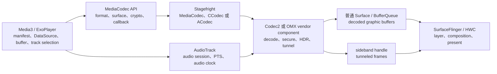

# 18.23 Android 17 多媒体播放管线：Codec2、Tunneled Playback 与 Media3 ABR

视频播放卡顿可能来自下载、码率选择、解码、Surface 消费、合成、显示或音频时钟。把这些阶段统称为“播放器卡”，很容易在错误的层上调参数。分析时固定两个核查基线：

- Android 平台：Android 17 / API 37 / `android-17.0.0_r1`。
- kernel：`android17-6.18-2026-06_r6`。
- Media3：截至 2026-07-31 的最新稳定版为 1.10.1，源码 tag 对应 commit `5fb306449733dd71595700c1227ad6087578c559`。1.11.0-rc01 已在 2026-07-22 发布，这里的常量仍以稳定版 1.10.1 为准。

Android 平台版本和 Media3 版本彼此独立。设备运行 Android 17，不表示应用使用最新 Media3；升级 Media3 也不会替换设备上的 codec、Composer HAL 或显示驱动。

## 按责任边界理解播放管线

下面这张图把普通视频输出与 tunneled playback 共用的控制面放在一起，便于确认每一项证据属于哪一层。



Media3 决定下载哪个分片、保留多少 buffer、从哪些 track 中选当前档位。`MediaCodec` 是应用可见的 codec 控制接口。Stagefright 再把请求交给 CCodec/Codec2 或 ACodec/OMX。普通视频帧经 Surface 的 BufferQueue 到达 SurfaceFlinger；tunnel 模式把 sideband handle 绑定到 layer，逐帧选择主要由 codec、音频同步硬件和 HWC 完成。

常见现象可以先这样归位：

| 现象 | 优先核对 | 有效证据 |
| --- | --- | --- |
| 弱网降质或反复切档 | DataSource、BandwidthMeter、ABR | 传输样本、带宽估计、buffered duration、track change reason |
| 首帧慢 | manifest、首个分片、codec 初始化、首帧显示 | 请求时长、configure/start、首个 input/output PTS、first-frame callback |
| seek 慢 | 请求范围、关键帧、flush 后预解码 | seek 目标、前一同步帧、discard 数量、seek 后首帧 |
| 普通播放掉帧 | codec、Surface、SurfaceFlinger/HWC | output/release 时间、queue/latch、acquire fence、present |
| tunnel 黑屏或停住 | audio session、HW A/V sync、sideband、vendor HAL | tunnel capability、codec configure、AudioTrack 状态、sideband layer、HWC/vendor log |
| 某些设备硬解失败 | codec 组合能力 | codec name、MIME、profile/level、secure、HDR、分辨率、帧率 |

这张表只能确定调查入口。比如用户看到“画面卡、声音继续”，既可能是解码器输出晚，也可能是普通 Surface 队列背压、HWC 切换合成策略或 tunnel 侧视频同步异常，需要沿同一帧的时间关系继续收证。

## Android 17 同时保留 Codec2 与 OMX 路径

Android 10 已把可更新的软件 Codec2 组件纳入 Media Codecs APEX，并支持 vendor C2 service；Android 11 起 Codec2 协议支持 tunneled playback。Android 17 的 `frameworks/av` 仍同时包含 `CCodec` 和 `ACodec`，因此不能把平台现状概括成“已经全面切到 Codec2”。

两条路径的应用入口都可以是 `MediaCodec`，native 侧对象和等待点却不同：

| 维度 | Codec2 / CCodec | OMX / ACodec |
| --- | --- | --- |
| 组件入口 | `C2ComponentStore`、`C2Component` | OMX node、component、port |
| 工作单元 | `C2Work`、`C2Buffer`、config update | input/output buffer、port callback |
| 完成通知 | `onWorkDone()` 等 C2 listener | empty/fill buffer done、OMX event |
| tunnel 配置 | `C2PortTunneledModeTuning` 与 tunnel handle | OMX video tunnel extension 与 sideband window |
| 诊断重点 | work queue、graphic block、C2 参数、component store | port 状态、buffer ownership、OMX command/event |

Codec 名称仍是线上诊断的关键字段。API level 只能说明框架能力上限，不能告诉你本次实例选中了哪一个 vendor component，也不能证明 secure、HDR、低延迟和 tunnel 的组合可用。

排查 `MediaCodec` 卡住时，至少记录：

- codec name 和 canonical name；
- MIME、profile、level、分辨率、帧率；
- CCodec 或 ACodec 路径；
- secure、HDR、tunneled、low-latency 标志；
- 输出 Surface 类型；
- configure/start/flush/stop/release 的起止时间；
- input/output PTS 与异常诊断信息。

`android-17.0.0_r1` 的 `CCodec::ClientListener::onWorkDone()` 接收 `C2Work` 列表并转交 CCodec；`ACodec.cpp` 仍保留 tunneled video 配置。看到 `MediaCodec` Java 栈相同，不应推断两台设备的 native buffer 周转也相同。

### 低延迟、HDR 与动态元数据属于组合能力

Android 11 / API 30 起，应用可在 codec 声明 `FEATURE_LowLatency` 后设置 `MediaFormat.KEY_LOW_LATENCY`。这项能力要求 decoder 避免持有超出编码标准所需的数据，不会删除 B-frame 重排、网络 jitter buffer、Surface 排队或显示 VSync；运行时还可通过 `PARAMETER_KEY_LOW_LATENCY` 调整。验收要同时记录 codec name、profile/level、首帧、稳态掉帧、功耗和热状态，不能从 API 可用性推出固定延迟。

HDR、Dolby Vision、secure、high-frame-rate、low-latency 与 tunnel 要按实际组合查询和测试。显示支持、decoder profile、extractor metadata、secure Surface、HWC plane 和 tone mapping 任一环节都可能改变结果。Android 17 还增加 Eclipsa video 的平台播放与采集能力；这同样只说明 framework 能传递相应动态元数据，不保证所有 SoC、显示或 codec 组合都走硬件低成本路径。

完整音频输出、AAudio/MMAP 与回调预算由 [1.16 Audio Pipeline](../../part1-fundamentals/ch01-architecture/16-audio-pipeline-performance.md) 承载；Camera 到 encoder 的 Surface 管线见 [18.14 Camera](14-camera-pipeline.md)；Media3 的 Surface 生命周期、prewarming、effects、HDR/DRM、首帧与播放器侧观测见 [22.43 Media3 实战](../../part5-app/ch22-rendering-practice/43-media3-video-rendering-pipeline-performance.md)。本节只保留播放控制面、Codec2/OMX、tunnel 与 ABR 的共同边界。

## 三种视频承载路径不能混为一谈

普通 SurfaceView、TextureView 和 tunneled playback 都能显示视频，帧的消费者不同。

| 路径 | decoded frame 的去向 | SurfaceFlinger/HWC 看到什么 | 主要取舍 |
| --- | --- | --- | --- |
| 普通 SurfaceView | codec → Surface/BufferQueue | 独立视频 layer；HWC 每轮决定 DEVICE 或 CLIENT 等 composition | 适合长视频、高分辨率和 protected 内容；overlay 只是候选结果 |
| TextureView | codec → SurfaceTexture → App HWUI → App Window | 视频已采样进宿主窗口，通常没有独立视频 layer | 支持 View 变换、裁剪和动画；增加宿主 GPU 采样与窗口提交 |
| Tunneled playback | codec/HAL → sideband stream | sideband layer；HWC 按 A/V 同步取得视频帧 | 减少常规 decoded-buffer 处理，适合部分 TV/机顶盒；调试证据和图形效果受限 |

普通 SurfaceView 有独立 layer，不保证获得硬件 overlay。格式、缩放、旋转、alpha、HDR/SDR 混合、protected usage、plane 数量和带宽都可能改变 HWC 的选择。TextureView 的外部视频 buffer 先被应用 HWUI 消费，再画入宿主窗口；宿主主线程、RenderThread 或 GPU 迟到都会影响视频可见时间。

Tunnel 也没有“绕过 SurfaceFlinger 直接显示”。Android 官方文档与 Android 17 源码给出的边界是：codec 返回 sideband handle，native window 把 handle 交给 SurfaceFlinger，SurfaceFlinger 将该 layer 配置为 sideband，HWC 再按音频时钟或 tuner 时钟取得并显示视频帧。普通 decoded graphic buffer 不再按常规逐帧 `queueBuffer()` 形式交给应用/framework 图形路径。

## Tunneled playback 的 Android 17 源码路径

### 能力与配置条件

低层播放器需要同时满足这些条件：

1. 低层平台接入时，选中的视频 decoder 必须支持 `MediaCodecInfo.CodecCapabilities.FEATURE_TunneledPlayback`；音频输出还要能建立硬件 A/V sync。Media3 会进一步检查已选音频、视频 renderer 的 tunneling support。
2. 点播场景创建一个有效的 audio session id，并让 `AudioTrack` 与视频 `MediaCodec` 使用同一个 id。
3. `AudioTrack` 使用带 `AudioAttributes.FLAG_HW_AV_SYNC` 的输出路径，并接收带 PTS 的音频数据。只把视频格式标成 tunneled，不能建立完整同步关系。
4. 输出使用 `SurfaceView` 提供的 Surface。官方低层接入步骤也以 `SurfaceView` 为承载面。
5. MIME、profile/level、secure decoder、DRM、HDR、分辨率和帧率在同一 codec 组合中均受支持。

能力查询回答“是否可以请求”，configure 成功和长时间稳定播放仍要由设备测试证明。Media3 的 `setTunnelingEnabled(true)` 也只是偏好；1.10.1 的 `DefaultTrackSelector` 要求恰好有一个已选音频 renderer 和一个已选视频 renderer，且各自选择的所有 track 都报告 `TUNNELING_SUPPORTED`，才给这两个 renderer 写入 tunneling 配置。

下面的 Media3 代码用于表达 tunnel 偏好，同时保留普通路径作为不满足条件时的选择。

```kotlin
val trackSelector = DefaultTrackSelector(context).apply {
    setParameters(
        buildUponParameters()
            .setTunnelingEnabled(true)
            .build()
    )
}

val player = ExoPlayer.Builder(context)
    .setTrackSelector(trackSelector)
    .build()
```

这段代码不保证设备进入 tunnel。应用要从 renderer、codec 和 session 日志确认最终模式，并对目标机型做手工播放测试。Media3 官方 API 也明确提示 tunneled playback 存在设备特定限制。

### audio session 如何变成硬件同步 ID

Android 17 的 `MediaCodec.configure()` 遍历 `MediaFormat` 时，会把 `KEY_AUDIO_SESSION_ID` 改写为 native key `audio-hw-sync`，值来自：

`AudioSystem.getAudioHwSyncForSession(sessionId)`

`MediaFormat.KEY_AUDIO_SESSION_ID` 保存的是 AudioTrack session id；传给 codec component 的是 AudioFlinger/Audio HAL 关联的 hardware sync id。两者不是同一个概念。排查时要同时记录 session id、audio route 和最终硬件同步配置，避免把 Java session id 直接当成 `HW_AV_SYNC`。

### CCodec 如何建立 sideband

`android-17.0.0_r1` 的 CCodec 路径可以按四步阅读：

1. `CCodec.cpp` 在有输出 Surface、当前组件为视频 decoder，且消息包含非零 `feature-tunneled-playback` 时调用 `configureTunneledVideoPlayback()`。
2. 该函数创建 `C2PortTunneledModeTuning::output`，模式为 `SIDEBAND`。有 `audio-hw-sync` 时选择 `AUDIO_HW_SYNC`；有 `hw-av-sync-id` 时选择 `HW_AV_SYNC`；两者都没有时构造 `REALTIME` 模式。
3. 函数通过 `C2PortTunnelHandleTuning::output` 查询组件返回的 tunnel handle，并包装为 native handle。
4. `CCodec::setSurface()` 调用 `native_window_set_sideband_stream()` 把 handle 设到输出 Surface；退出 tunnel 时会把 sideband stream 置空。

`C2Config.h` 把 tunneled mode、sync type、sync id、tunnel handle 和 tunnel render time 定义成独立参数。这里能确认的是框架与 component 的协议。sideband handle 之后如何关联 codec 硬件、secure video path 和 display plane，由 vendor codec/HWC/driver 实现决定。

ACodec/OMX 也有对应路径：读取 `feature-tunneled-playback` 和 `audio-hw-sync`，调用 OMX tunnel extension，取得 sideband window，再绑定到 native window。配置成功后，`ACodec` 把输出端口的 `nBufferCountActual` 设为 0，跳过普通 native window buffer 分配。Android 17 保留这段实现，运行时应以实际 codec 名称和日志判断走哪一支。

### 首帧 ready、首帧 render 与 panel 可见是三个时刻

Tunnel 的首帧控制很容易被误读。Android 17 提供：

- `MediaCodec.PARAMETER_KEY_TUNNEL_PEEK`：控制 AudioTrack 暂停时，首个已解码视频帧是否提前显示；
- `MediaCodec.OnFirstTunnelFrameReadyListener`：报告首帧已经解码并具备 render 条件；
- `MediaCodec.OnFrameRenderedListener`：报告 codec/HAL 给出的 frame rendered 事件。

当 peek 关闭时，首帧可以完成解码并触发 first-tunnel-frame-ready，但仍保持上一幅画面或黑屏；AudioTrack 开始播放或应用开启 peek 后，held frame 才进入显示过程。`OnFirstTunnelFrameReadyListener` 因而不能充当“首帧已上屏”指标。`OnFrameRenderedListener` 也不是 panel scanout 完成的 present fence。

Codec2 的对应路径为：

- Android 17 的 native `MediaCodec` 在显式 peek 状态下给第一块非 CSD、非 decode-only 输入写入内部 `tunnel-first-frame` 标记；
- `CCodecBufferChannel` 把该标记转成 `C2StreamTunnelHoldRender`；
- component 返回带 `C2StreamTunnelHoldRender` 和 `FLAG_INCOMPLETE` 的 work update 时，CCodec 上报 first-tunnel-frame-ready；
- `MediaCodec` 收到 ready 事件且 peek 已开启时发出内部 `android._trigger-tunnel-peek`，`CCodecConfig` 再把它映射到 `C2_PARAMKEY_TUNNEL_START_RENDER`；
- component 通过 `C2PortTunnelSystemTime` 上报 `CLOCK_MONOTONIC` 纳秒时间，CCodec 再触发 frame-rendered callback。

这里存在一处公开文档与兼容实现必须同时阅读的边界。`MediaCodec.java` 的 API 注释写着 peek 默认开启；Android 17 的 native `MediaCodec.cpp` 却在应用未显式设置时保留 `kLegacyMode`，`start` 后把 `android._tunnel-peek-set-legacy=1` 传给 component。`CCodecConfig` 将其映射为 `UNSPECIFIED_PEEK`，decoder 可以忽略 hold/start-render 协议。官方设备实现文档也说明：应用未设置 `PARAMETER_KEY_TUNNEL_PEEK` 时，行为由 OEM 决定。

依赖 seek 预览或暂停态首帧的应用应在 codec 第一次 `start` 后、提交第一块有效视频输入前显式设置 `PARAMETER_KEY_TUNNEL_PEEK` 为 0 或 1。Android 17 会在 `flush` 或 `stop/start` 时保留已经显式设置的 enable bit，并把状态重置为“尚无首帧”；如果要改变策略，应在这个重置边界之后、下一块有效输入之前设置新值。重建 codec 实例时仍要重新显式设置，避免回到 legacy unspecified 模式。

点播 tunnel 通常以音频时钟推进视频。AudioTrack underrun、pause 或路由切换导致时钟不前进时，视频也可能停住。静音不等于可以停止喂音频；官方实现要求继续提交带 PTS 的音频数据。

## Media3 1.10.1 的 ABR 到底看什么

ABR 的工作分为两层：

1. `DefaultTrackSelector` 先按 renderer/codec 能力、viewport、用户约束、MIME、语言、HDR 等条件得到可选 track。
2. `AdaptiveTrackSelection` 再在可选 track 中，根据带宽预算、播放速度、下一个 chunk 时长、buffer 水位和 live edge 决定当前档位；传入的 `BandwidthMeter` 能提供首字节时间估计时，还会把 TTFB 算入预算。

第二层不会读取 HWC composition type，也不会因某一帧错过 display deadline 自动降码率。解码掉帧若要影响选档，需要应用限制可选分辨率/码率、排除 track，或实现自定义策略。

### 默认带宽估计

Media3 1.10.1 的 `DefaultBandwidthMeter` 在一次全速网络传输结束时计算样本：

`sampleBitrate = sampleBytesTransferred * 8000 / sampleElapsedTimeMs`

样本以 `sqrt(sampleBytesTransferred)` 作为权重放入 `SlidingPercentile`。累计传输时间达到 2 秒，或累计字节达到 512 KiB 后，使用 0.5 分位数更新 `bitrateEstimate`。尚无足够样本时，初始值按网络类型与国家/地区分组选择；未知或离线的默认初值为 1 Mbps。

这些阈值属于 Media3 1.10.1，不是 Android 17 平台常量。换 Media3 版本后应重新查源码，不能从设备 API level 推导。

### 选档与 buffer 门槛

Media3 1.10.1 的 `AdaptiveTrackSelection` 默认值为：

| 常量 | 值 | 含义 |
| --- | ---: | --- |
| `DEFAULT_MIN_DURATION_FOR_QUALITY_INCREASE_MS` | 10,000 ms | 点播升档通常要求的最小 buffer |
| `DEFAULT_MAX_DURATION_FOR_QUALITY_DECREASE_MS` | 25,000 ms | buffer 达到该值时可推迟降档 |
| `DEFAULT_MIN_DURATION_TO_RETAIN_AFTER_DISCARD_MS` | 25,000 ms | 为加快升档而丢弃旧 chunk 时，至少保留的播放时长 |
| `DEFAULT_BANDWIDTH_FRACTION` | 0.7 | 对估计带宽保留安全余量 |
| `DEFAULT_BUFFERED_FRACTION_TO_LIVE_EDGE_FOR_QUALITY_INCREASE` | 0.75 | 靠近 live edge 时调整升档门槛 |
| `DEFAULT_MAX_WIDTH_TO_DISCARD` / `HEIGHT` | 1279 / 719 | 允许为升档丢弃的旧低清 chunk 尺寸上限 |

有效预算会考虑播放速度。TTFB 或下一 chunk 时长未知时，1.10.1 的计算为：

`allocatableBandwidth = bitrateEstimate * bandwidthFraction / playbackSpeed`

当 `BandwidthMeter` 同时提供 TTFB，且下一个 chunk 时长已知时，预算改为：

`allocatableBandwidth = cautiousBandwidth × max(chunkDuration / playbackSpeed - TTFB, 0) / chunkDuration`

1.10.1 的 `DefaultBandwidthMeter` 没有覆盖 `BandwidthMeter.getTimeToFirstByteEstimateUs()`，因此使用接口默认值 `TIME_UNSET`；`ExperimentalBandwidthMeter` 则通过 `TimeToFirstByteEstimator` 提供估计。多条 adaptive selection 共用带宽时，factory 生成的 adaptation checkpoints 还会参与预算分配。因此，把算法简化成 `track bitrate < 0.7 × bandwidth estimate` 会漏掉直播、倍速、可选的 TTFB 和并行选择影响。

`updateSelectedTrack()` 先求忽略 buffer 健康度的理想档位，再做两项抑制：

- 升档时 buffer 不足，保留当前档位。点播默认门槛为 10 秒；直播会结合到 live edge 的可用时长和下一 chunk 时长降低门槛。
- 降档时 buffer 仍有 25 秒或更多，可暂缓降档。

这种设计减少短时抖动造成的频繁切换，也意味着网络样本变差后不一定立刻降档。分析一次 rebuffer，必须把传输完成时间、BandwidthMeter 更新、下一次 track 决策和 buffer 消耗放到同一时间轴。

### 没有“亚 100 ms 主动预测缓存”这条默认主线

Media3 1.10.1 的默认 ABR 源码中没有 `AdaptivePlaybackCache` 或 `StreamSharingCache`，也没有官方源码支持二者协同预测、把 ABR 决策压缩到亚 100 ms 的说法。

源码确有 experimental bandwidth estimator，但它们不是上述虚构类，也不是 `DefaultBandwidthMeter` 的默认逻辑。引用实验组件时必须写清构造方式、启用条件和版本，不能把它们描述为所有 Media3 播放都会经过的主路径。

## ABR、解码和显示瓶颈怎样区分

下面这组判断比“码率高所以卡”更可靠：

| 观察结果 | 更可能的方向 | 还需排除 |
| --- | --- | --- |
| segment 下载耗时持续超过媒体时长，buffer 下降 | 网络/CDN/带宽估计 | 后台限速、请求排队、错误重试 |
| 下载快且 buffer 充足，codec output 持续晚于 PTS | 解码能力或 codec 配置 | thermal、secure/HDR 组合、倍速 `KEY_OPERATING_RATE` |
| codec output/release 准时，普通 Surface queue/latch 晚 | BufferQueue、fence、Surface 消费 | TextureView 宿主帧、错误 timestamp |
| SurfaceFlinger 已有 ready buffer，present 仍晚 | 合成、HWC、display | plane 竞争、GPU client composition、刷新率切换 |
| tunnel 只有音频、无常规视频 BufferTX | tunnel/sideband 调查 | 不能因缺少普通 BufferQueue 事件直接判黑屏原因 |
| 画质频繁上下跳，网络样本也剧烈变化 | ABR 采样或参数 | CDN 分片大小、TTFB、并行请求、live edge |

高分辨率、HDR、高帧率或 secure decoder 的解码压力不会自动反馈给默认 ABR。设备即使分别支持 HEVC、HDR10、60 fps、secure 和 tunnel，也未必支持它们的组合。播放开始前要过滤 codec 能力，线上再按实际 codec name 和内容属性分组。

## Perfetto 与播放器事件要放在同一时钟上

Perfetto 能观察调度、binder、频率、BufferQueue、SurfaceFlinger、HWC 和 audio 事件；Media3 的带宽估计、buffer 水位与选档原因通常需要应用自己打 trace event 或记录 AnalyticsListener 事件。两组数据使用同一单调时钟，才能回答“先发生了什么”。

普通 SurfaceView 路径可按下面顺序复原：

`segment complete → input PTS → codec output → releaseOutputBuffer(timestamp) → queueBuffer → SF latch → HWC present`

TextureView 要在 codec queue 之后加上：

`SurfaceTexture frame available → 宿主 doFrame/RenderThread 采样 → App Window queue → SF`

Tunnel 路径则改为：

`compressed input PTS → codec/HAL event → audio clock/HW_AV_SYNC → sideband/HWC → render feedback`

Tunnel 的逐帧 decoded buffer 不走普通 BufferQueue 形态，不要强行用常规 `BufferTX` 数量解释每一个视频 PTS。SurfaceFlinger 仍管理 sideband layer 的位置、尺寸、层级和与其他 layer 的合成；HWC 可以在其他 layer 不变时独立按同步时钟更新 tunnel 视频。

建议播放器 session 记录这些字段：

- content/session id、Media3 版本、Android build fingerprint；
- selected track、selection reason、码率、分辨率、帧率和 MIME；
- bandwidth estimate、TTFB、buffered duration、live offset；
- codec name、CCodec/ACodec、secure、HDR、tunnel；
- SurfaceView/TextureView、display mode、requested frame rate；
- AudioTrack session、route、underrun 和 timestamp；
- 首帧 ready、首帧 rendered、应用定义的可见首帧；
- dropped/skipped frame、rebuffer、seek、decoder exception。

`FrameTimeline` 对应用宿主窗口和 SurfaceFlinger 显示帧很有价值；Perfetto 官方文档仍说明 SurfaceView 未获完整支持。它不能代表 tunnel decoder 的每个视频 PTS，也不能单独证明某个视频帧已被 panel 扫描。视频指标要保留媒体 PTS 与 display 时间两套语义。

## `KEY_ALLOW_FRAME_DROP` 的适用边界

Android 17 的 `MediaCodec` 文档延续 Android 10 起的 Surface 输出语义：Surface 消费不及时，默认允许丢弃过量帧。面向非 View 的输出 Surface，例如 ImageReader 或独立 SurfaceTexture，目标 SDK 为 Android 10 及以上时可在 configure format 中设置 `MediaFormat.KEY_ALLOW_FRAME_DROP = 0`，选择不让 Surface 丢帧；消费持续跟不上时，decoder 会逐步被阻塞。

View surface 在 Android 10 之前就会丢弃过量帧，公开文档只把“选择退出默认丢帧”描述为非 View surface 能力。不要在 SurfaceView/TextureView 场景中把该 key 当成通用的“零丢帧开关”。

该 key 只处理 Surface 消费过慢时的 frame drop 策略。码流缺帧、decoder 丢帧、应用主动 skip、Media3 late-frame drop、HWC 重复旧帧和 display miss 都是不同事件，统计时需要分开命名。

## 应用侧的稳妥策略

1. **固定版本信息。** 每条播放日志都带 Android tag 对应的设备 build、Media3 版本和 codec name。只写“Android 17 + ExoPlayer”无法复现算法常量。
2. **先限制候选能力，再让 ABR 选档。** 对低端设备限制最大分辨率、帧率、bitrate 或 MIME。默认 ABR 不会通过 dropped frame 自动学会设备的解码上限。
3. **长视频优先评估 SurfaceView。** 需要普通 View 级变换时再选 TextureView，并把宿主主线程、RenderThread、GPU 采样和 App Window buffer 算入时延。
4. **Tunnel 只在验证过的设备组合启用。** TV/机顶盒、高分辨率长视频是常见候选；手机、复杂动画、圆角/模糊、截图、视频特效和部分 PiP 场景要评估功能限制。
5. **准备可控回退。** Tunnel 初始化或播放异常时，释放当前 codec 后重建普通 SurfaceView 路径。回退次数必须受限，并保留第一次失败的 codec diagnostic。
6. **不要单改一个 ABR 常量。** `bandwidthFraction`、buffer 门槛、LoadControl、segment duration、TTFB、live offset 和倍速互相影响。按点播、普通直播、低延迟直播分别实验。
7. **组合测试 DRM/HDR/高帧率。** 用目标内容覆盖 secure decoder、Widevine 等级、HDCP、HDR format、60/120 fps、AV1/HEVC/VVC、tunnel 和外接显示。
8. **使用 Media3 1.10.1 或核对对应修复。** 1.10.1 release notes 包含 tunnel 模式 audio session id 生成竞态的修复；旧版本遇到相关 `IllegalStateException` 时，应先确认是否命中该已知问题。

Android 17 增加了 VVC/H.266 的 framework MIME、MediaCodec/Codec2 API 与 MP4 extractor 支持，但 AOSP 不提供 VVC 软件 decoder，也不提供 VVC encoder。设备只有在 SoC 厂商提供并注册 vendor Codec2 VVC decoder 后才能解码。因此，“运行 API 37”和“本机能播放 VVC”必须作为两个字段记录。

## 低延迟直播与倍速播放

点播 ABR 追求较低 rebuffer 和稳定画质。低延迟直播还要约束 live offset；buffer 过厚会离 live edge 越来越远，buffer 过薄又放大网络抖动。分析时至少记录 target live offset、current live offset、segment/part duration、playback speed 调整和每次选档原因。

Tunnel 倍速播放还依赖设备音频与视频硬件能力。官方实现建议把 `MediaFormat.KEY_OPERATING_RATE` 设为内容帧率与倍速的乘积，例如 60 fps 内容以 2 倍速播放时请求 120。该值表达 decoder 所需处理速率，不保证当前 codec 在 secure/HDR/tunnel 组合下可以达到。

Media3 Transformer 的离线转码不属于这里讨论的播放路径。Transformer 涉及 decoder、effect、encoder、muxer、GPU/CPU 和文件 I/O，应单独分析。

## Kernel 证据边界

普通 codec → Surface 路径常用 dma-buf 共享 graphic buffer，并用 dma-fence/sync_file 表达 codec、GPU、SurfaceFlinger 与 HWC 之间的异步完成关系。kernel 语义固定到 `android17-6.18-2026-06_r6` 的 `drivers/dma-buf/dma-buf.c`、`drivers/dma-buf/sync_file.c` 与 `include/linux/dma-fence.h`。

Tunnel 的 sideband handle 不会让 AOSP common kernel 自动暴露完整逐帧路径。codec job、secure buffer、A/V synchronizer、plane 提交和 scanout 常位于厂商驱动或固件。Perfetto 只能看到 framework 事件时，应明确标注“vendor display evidence unavailable”，不要用 common kernel 的 fence 定义补写设备没有提供的时序。

## Android 17 源码与官方资料

- [Android 17 `MediaCodec.java`](https://android.googlesource.com/platform/frameworks/base/+/refs/tags/android-17.0.0_r1/media/java/android/media/MediaCodec.java)：audio session 转换、tunnel peek、first-tunnel-frame-ready 与 frame-rendered API。
- [Android 17 `MediaFormat.java`](https://android.googlesource.com/platform/frameworks/base/+/refs/tags/android-17.0.0_r1/media/java/android/media/MediaFormat.java)：`KEY_AUDIO_SESSION_ID` 与 `KEY_ALLOW_FRAME_DROP`。
- [Android 17 `MediaCodecInfo.java`](https://android.googlesource.com/platform/frameworks/base/+/refs/tags/android-17.0.0_r1/media/java/android/media/MediaCodecInfo.java)：`FEATURE_TunneledPlayback`。
- [Android 17 native `MediaCodec.cpp`](https://android.googlesource.com/platform/frameworks/av/+/refs/tags/android-17.0.0_r1/media/libstagefright/MediaCodec.cpp)：peek 状态机、legacy unspecified 行为与首帧内部标记。
- [Android 17 `CCodec.cpp`](https://android.googlesource.com/platform/frameworks/av/+/refs/tags/android-17.0.0_r1/media/codec2/sfplugin/CCodec.cpp)：tunnel 条件、C2 配置、handle 查询和 native window 绑定。
- [Android 17 `CCodecBufferChannel.cpp`](https://android.googlesource.com/platform/frameworks/av/+/refs/tags/android-17.0.0_r1/media/codec2/sfplugin/CCodecBufferChannel.cpp)：tunnel first frame、render time 与 C2 work 回调。
- [Android 17 `CCodecConfig.cpp`](https://android.googlesource.com/platform/frameworks/av/+/refs/tags/android-17.0.0_r1/media/codec2/sfplugin/CCodecConfig.cpp)：tunnel peek 到 C2 参数的映射。
- [Android 17 `C2Config.h`](https://android.googlesource.com/platform/frameworks/av/+/refs/tags/android-17.0.0_r1/media/codec2/core/include/C2Config.h)：tunneled mode、sideband handle、hold/start render 与 render time 参数。
- [Android 17 `ACodec.cpp`](https://android.googlesource.com/platform/frameworks/av/+/refs/tags/android-17.0.0_r1/media/libstagefright/ACodec.cpp)：仍保留的 OMX tunneled playback 路径。
- [Media3 1.10.1 `AdaptiveTrackSelection.java`](https://github.com/androidx/media/blob/1.10.1/libraries/exoplayer/src/main/java/androidx/media3/exoplayer/trackselection/AdaptiveTrackSelection.java)：ABR 常量、预算与升降档条件。
- [Media3 1.10.1 `DefaultBandwidthMeter.java`](https://github.com/androidx/media/blob/1.10.1/libraries/exoplayer/src/main/java/androidx/media3/exoplayer/upstream/DefaultBandwidthMeter.java)：传输样本和 sliding percentile。
- [Media3 1.10.1 `ExperimentalBandwidthMeter.java`](https://github.com/androidx/media/blob/1.10.1/libraries/exoplayer/src/main/java/androidx/media3/exoplayer/upstream/experimental/ExperimentalBandwidthMeter.java)：实验带宽估计与 TTFB 输入。
- [Media3 1.10.1 `DefaultTrackSelector.java`](https://github.com/androidx/media/blob/1.10.1/libraries/exoplayer/src/main/java/androidx/media3/exoplayer/trackselection/DefaultTrackSelector.java)：tunnel renderer 组合判定。
- [Media3 release notes](https://developer.android.com/jetpack/androidx/releases/media3)、[Media3 1.10.1 release](https://github.com/androidx/media/releases/tag/1.10.1)、[track selection guide](https://developer.android.com/media/media3/exoplayer/track-selection) 与 [multimedia tunneling](https://source.android.com/docs/devices/tv/multimedia-tunneling)：版本、应用接入和设备实现边界。
- [Android Media modules](https://source.android.com/docs/core/media/media-modules) 与 [Android 17 VVC support](https://source.android.com/docs/core/media/vvc)：Codec2 模块边界以及 API 37 VVC framework/vendor 分工。
- Kernel `android17-6.18-2026-06_r6`：[dma-buf](https://android.googlesource.com/kernel/common/+/refs/tags/android17-6.18-2026-06_r6/drivers/dma-buf/dma-buf.c)、[sync_file](https://android.googlesource.com/kernel/common/+/refs/tags/android17-6.18-2026-06_r6/drivers/dma-buf/sync_file.c) 与 [dma-fence](https://android.googlesource.com/kernel/common/+/refs/tags/android17-6.18-2026-06_r6/include/linux/dma-fence.h)。

## 小结

Android 17 的 MediaCodec 仍可能落到 CCodec/Codec2 或 ACodec/OMX。普通 SurfaceView、TextureView 和 tunnel 的 decoded-frame 消费者不同；SurfaceView 不保证 overlay，tunnel 也仍通过 SurfaceFlinger 的 sideband layer 交给 HWC。

Media3 1.10.1 的默认 ABR 以带宽估计、播放速度、chunk 时长、buffer 和 live edge 为核心输入；自定义 `BandwidthMeter` 还能提供 TTFB。它不会读取 HWC 状态，也不会因 decoder 掉帧自动降档。排查时把 Media3 事件、codec PTS、Surface/SF/HWC 和 AudioTrack 放到同一时间轴，才能把网络、解码、显示与同步问题分开。
