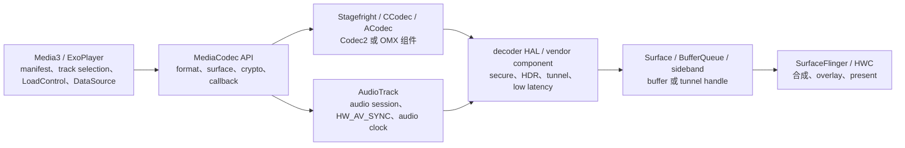

# 18.23 多媒体播放管线：Codec2、Tunneled Playback 与 Media3 ABR

<!-- outline-start -->
## 要点

### 🔹 多媒体播放链路的分层边界
梳理 Media3 / ExoPlayer、MediaCodec、Stagefright、Codec2 / OMX、Surface / SurfaceView、AudioTrack、SurfaceFlinger 与 HWC 的职责边界，说明视频播放卡顿、音画不同步、弱网降质和硬解失败分别落在哪一层观察。

### 🔹 OMX 到 Codec2 的迁移对性能诊断的影响
围绕 Android 10+ Codec2 架构、ComponentStore、C2Component、C2Work / C2Buffer 与旧 OMX 回调模型对比，解释为什么同样是 MediaCodec API，底层组件、buffer 生命周期和厂商 HAL 行为可能完全不同。

### 🔹 Tunneled Playback 的直出路径
覆盖 tunneled playback 的条件、AudioTrack 同步、sideband / tunnel handle、SurfaceView layer 与 HWC 直出关系，区分普通 BufferQueue 合成路径和硬件 tunnel 路径的延迟、功耗与可观测性差异。

### 🔹 Media3 ABR 与网络/解码能力协同
整理 Adaptive Bitrate 的决策输入：带宽估计、buffer 水位、track selection 参数、设备解码能力、DRM / 高帧率内容限制，避免把弱网卡顿、解码瓶颈和渲染合成瓶颈混在一起。

### 🔹 Perfetto 与日志观察点
建立排查清单：MediaCodec / Codec2 线程、binder 调用、BufferQueue、FrameTimeline、SurfaceFlinger、AudioTrack、network 与 app 自定义 event，用于定位掉帧、卡顿、seek 慢、首帧慢和码率切换抖动。

### 🔹 应用侧优化策略
给出播放器工程可执行策略：能力探测、SurfaceView / TextureView 选择、tunnel 开关灰度、Media3 参数治理、低端设备降档、弱网预加载、首帧指标与线上分桶归因。

## 扩展

### 🔸 低延迟直播与普通点播的诊断差异
补充 live edge、buffer 策略、码率升降级和丢帧策略对低延迟直播体验的影响。

### 🔸 DRM、HDR、高帧率内容的设备兼容矩阵
补充 secure decoder、HDR format、60fps/120fps、widevine security level 与 SoC 能力差异对播放性能的影响。

### 🔸 Media3 Transformer / 转码链路
如后续素材充分，可拆出离线转码、剪辑、滤镜和导出性能的独立小节。

<!-- outline-end -->

本文处理视频播放性能里最容易混在一起的三件事：MediaCodec / Codec2 的解码路径、tunneled playback 的硬件直出路径，以及 Media3 ABR 的码率选择。读完这一节，排查卡顿时应该能先判断问题在网络、解码、buffer、合成还是音视频同步，而不是把所有现象都归到“播放器卡”。

## 播放管线先按责任分层

一个在线视频播放器至少跨过四层：

Media3 负责“选什么内容和什么时候切换”，MediaCodec 负责“把编码帧交给哪个 codec 并接收状态”，Stagefright / Codec2 / OMX 负责“把 Java API 请求翻译成 native 组件操作”，SurfaceFlinger 和 HWC 负责“这帧怎么出现在屏幕上”。AudioTrack 不只播放音频；在 tunnel 模式下，它还提供音视频同步要用的硬件同步标识。

这几个层次对应不同现象：

| 现象 | 优先观察层 | 常见证据 |
|------|------------|----------|
| 弱网后画质下降 | Media3 ABR、DataSource、CDN | 带宽估计下降、buffer 水位下降、track selection 事件 |
| 首帧慢 | DataSource、MediaCodec configure/start、首个输出 buffer、Surface attach | manifest 请求、segment 下载、codec 初始化、first frame event |
| seek 慢 | 数据加载、关键帧间距、decoder flush 后重解码 | seek 后请求范围、I 帧距离、decoder flush / output 恢复时间 |
| 播放掉帧 | decoder 输出、BufferQueue、SurfaceFlinger / HWC | dequeue / queue 等待、FrameTimeline miss、HWC overlay 失败 |
| 音画不同步 | AudioTrack、MediaCodec render timestamp、tunnel clock | AudioTimestamp、HW_AV_SYNC、render callback、音频 underrun |
| 部分机型硬解失败 | MediaCodecList、codec profile / level、secure / HDR / tunnel 能力 | codec capabilities、configure 异常、vendor log |

普通播放路径里，decoder 输出进入 Surface，随后走 BufferQueue，SurfaceFlinger 再决定 GPU 合成还是 HWC overlay。详见 2.13 节和 18.15 节。TextureView 会多一层 SurfaceTexture / App 渲染参与，适合做 UI 变换，但播放性能诊断时要把 App RenderThread 也算进去。SurfaceView 更接近系统合成路径，适合长视频、TV 和高分辨率内容。详见 18.6 节。

## OMX 到 Codec2 改变了 native 侧的观察方式

MediaCodec API 看起来稳定，但 Android 10 之后底层不一定还是 OMX。Codec2 使用 `C2ComponentStore` 创建组件，用 `C2Component`、`C2Work`、`C2Buffer` 描述工作单元和 buffer；OMX 更依赖 node、port、state command 和 callback。官方 updatable media 文档也把自定义 codec service 的入口指向 `frameworks/av/media/codec2/core/` 的 Codec 2.0 接口和 `C2ComponentStore`。[已验证: 官方文档, source.android.com/docs/core/media/updatable-media]

AOSP main 中，`C2ComponentStore` 暴露 `createComponent()` / `createInterface()` 等入口，`C2Component` 接口包含 work 目标 ID、参数查询、config 和 tunneling 相关方法。`CCodec::ClientListener::onWorkDone()` 接收 `std::list<std::unique_ptr<C2Work>>`，再交回 CCodec 处理输出。这个模型和 OMX 的 `onEmptyBufferDone()` / `onFillBufferDone()` callback 不同，trace 里看到的等待点也会不同。[已验证: AOSP main, frameworks/av/media/codec2/core/include/C2Component.h; frameworks/av/media/codec2/sfplugin/CCodec.cpp]

诊断时不要只记 “MediaCodec 卡住”。同样的 Java 调用，native 侧可能出现三类差异：

- 组件实例来源不同：CCodec 走 Codec2 client / component store；旧设备或部分 vendor 路径可能仍出现 ACodec / OMX node。
- buffer 生命周期不同：Codec2 更偏 work 队列和 graphic block；OMX 更偏 input / output port 上的 buffer 回调。
- vendor 行为不同：profile / level、secure decoder、HDR、低延迟、tunnel 支持都由设备能力决定，不能只靠 API level 判断。

这也是媒体章节要和 26.3 节的线上分桶结合的原因。播放失败率只按 Android 版本看不够，至少要分 codec name、MIME、profile / level、secure、surface 类型、tunnel 开关、SoC / GPU、DRM 级别和内容形态。

## Tunneled playback 是硬件直出，不是普通 overlay 的同义词

Android 官方把 multimedia tunneling 定义为：压缩视频数据通过硬件视频 decoder 直接送到显示，避免 app code 和 Android framework code 处理 decoded video buffer。Android 5+ 的点播场景使用与音频 presentation timestamp 同步的 AudioTrack clock；Android 11+ 的直播电视场景可以使用 tuner 驱动的 PCR / STC。官方文档也写明，tunnel 能减少参与 video path 的进程，可能改善渲染效率、cadence 和同步，但会降低 GPU effects、PiP 圆角/模糊等图形能力。[已验证: 官方文档, source.android.com/docs/devices/tv/multimedia-tunneling]

普通 SurfaceView overlay 和 tunnel 的边界要分清：

| 路径 | buffer 走向 | App 是否接触 decoded frame | SurfaceFlinger / HWC 角色 | 适用场景 |
|------|-------------|----------------------------|----------------------------|----------|
| SurfaceView 普通播放 | decoder → Surface / BufferQueue → SurfaceFlinger → HWC | 不直接接触像素，但仍走 Android 图形栈 | SF 参与 layer 管理，HWC 决定 overlay / composition | 手机、平板、通用视频播放 |
| TextureView | decoder → SurfaceTexture → App GL / RenderThread → SF / HWC | App 参与纹理消费和变换 | App 渲染成本进入播放路径 | 需要动画、圆角、旋转、复杂 UI 变换 |
| Tunneled playback | compressed stream → hardware decoder → sideband / tunnel → display | 不接触 decoded frame | 设备实现决定送显时机，HWC / display 侧按同步时钟出帧 | TV、机顶盒、长视频、低功耗/同步优先场景 |

AOSP 的 Java API 层把 `MediaFormat.KEY_AUDIO_SESSION_ID` 转成 native 侧的 `audio-hw-sync`，调用 `AudioSystem.getAudioHwSyncForSession(sessionId)`。`MediaFormat` 对这个字段的说明是：它描述与 tunneled video codec 关联的 AudioTrack audio session ID。CCodec 配置阶段在 video decoder + surface + `feature-tunneled-playback` 条件下调用 `configureTunneledVideoPlayback()`，并保存 sideband handle；ACodec 路径也会根据 `feature-tunneled-playback` 和 `audio-hw-sync` 配置 tunnel。[已验证: AOSP main, frameworks/base/media/java/android/media/MediaCodec.java; frameworks/base/media/java/android/media/MediaFormat.java; frameworks/av/media/codec2/sfplugin/CCodec.cpp; frameworks/av/media/libstagefright/ACodec.cpp]

应用侧启用 tunnel 不能只设置一个开关。至少要满足这些条件：

- codec capability 声明支持 `FEATURE_TunneledPlayback`。官方 API 文档把它定义为 video 或 audio decoder 支持 tunneled playback 的能力。[已验证: 官方文档, developer.android.com/reference/android/media/MediaCodecInfo.CodecCapabilities]
- video `MediaFormat` 设置 `MediaCodecInfo.CodecCapabilities.FEATURE_TunneledPlayback`，并带上与 AudioTrack 关联的 `KEY_AUDIO_SESSION_ID`。
- AudioTrack 使用同一 audio session，并在硬件 AV sync 路径下工作。
- 输出面通常应使用 SurfaceView；TextureView 的 UI 变换能力和 tunnel 目标相冲突。
- 设备 codec、DRM、安全路径、HDR、分辨率、帧率都要支持这一组合。

Tunnel 适合把播放交给硬件时钟和显示硬件，但诊断会少掉一部分 BufferQueue / SF 中间证据。打开 tunnel 后，如果 Perfetto 中看不到常规 decoded buffer 消费，不代表没有出帧；要补 AudioTrack、codec event、vendor media log 和 HWC / display 侧证据。

## Media3 ABR 同时看带宽、buffer 和设备能力

Media3 的 track selection 文档给了两类入口：通用 `TrackSelectionParameters` 用于限制分辨率、语言、role 等；`DefaultTrackSelector.Parameters` 还提供 `setTunnelingEnabled(true)`，在 renderer 和 selected tracks 组合支持时表达 tunnel 偏好。[已验证: 官方文档, developer.android.com/media/media3/exoplayer/track-selection]

ABR 不是“网速低就立刻降码率”这么简单。`AdaptiveTrackSelection` 的类注释写得很直接：它基于 bandwidth，并结合 buffer state 更新选择的 track。当前 Media3 release 分支默认参数包括：升质量至少保留 10s buffer，降质量判断使用 25s buffer 阈值，切换后丢弃旧低清 chunk 时至少保留 25s，带宽使用系数为 0.7。`DefaultBandwidthMeter` 在网络传输结束时按本次传输字节数和耗时计算 sample bitrate，写入 sliding percentile，满足最小时间或字节条件后更新 `bitrateEstimate`。[已验证: androidx/media release, AdaptiveTrackSelection.java; DefaultBandwidthMeter.java]

这会带来三个诊断结论：

- 弱网卡顿要同时看 throughput 和 buffer。带宽估计下降但 buffer 足够时，播放器可能延后降档；buffer 已低但带宽估计没更新时，下一次 chunk 下载结束才可能触发新的估计。
- 解码瓶颈会伪装成网络问题。高码率、高分辨率、HDR、60fps / 120fps、secure decoder 组合可能让 decoder 输出跟不上，即使网络足够也会掉帧。
- 渲染瓶颈会反过来影响播放体验。Surface 太小、TextureView 做复杂变换、HWC overlay 失败、App 主线程挡住 UI，都可能让用户看到卡顿，但 ABR 层只能看到 buffer 与下载，不知道 HWC 为什么没按时 present。

低延迟直播还要加入 live edge。离 live edge 太近时，升质量可能增加 rebuffer 风险；离得太远，延迟目标又被破坏。Media3 的 ABR 参数可以调，但线上调参必须和内容类型绑定：点播、普通直播、低延迟直播、体育高帧率、长视频后台音频，每种目标不同。

## Perfetto 和日志观察点

媒体播放 trace 要把 App、media service、network、graphics、audio 放在同一条时间线上看。单看 dropped frames 或单看 ExoPlayer event 都不够。

| 问题 | 观察点 | 判断方式 |
|------|--------|----------|
| 首帧慢 | manifest / segment 请求、MediaCodec configure/start、first output、first render、Surface attach | 拆成网络下载、codec 初始化、首个 buffer 输出、显示呈现四段 |
| seek 慢 | seek 请求、DataSource range、decoder flush、I frame 前解码、first frame after seek | Media3 troubleshooting 文档指出，准确 seek 需要从前一个 I frame 解码并丢弃中间帧；I frame 间距越大，seek 越容易慢。[已验证: 官方文档, developer.android.com/media/media3/exoplayer/troubleshooting] |
| 播放掉帧 | `MediaCodec` / `CCodec` 线程、BufferQueue、FrameTimeline、SF/HWC present | 先看 decoder 是否按时输出，再看 buffer 是否排队，再看合成是否 miss |
| tunnel 无画面 | codec capability、`audio-hw-sync`、AudioTrack start、vendor media log、HWC / display sideband | 常规 BufferQueue 证据可能缺失，要看 tunnel 配置是否成功 |
| 码率切换抖动 | `DefaultBandwidthMeter` sample、track change event、buffer 水位、CDN RTT | 区分网络采样波动和 track 参数过激 |
| 音画不同步 | AudioTrack underrun、AudioTimestamp、render timestamp、tunnel peek / first tunnel frame | 音频时钟不推进时，tunnel 视频可能跟着停住 |

如果只允许加少量埋点，播放器侧至少记录这些字段：session id、content id、MIME、codec name、surface 类型、是否 secure、是否 HDR、高帧率、是否 tunnel、selected track bitrate / resolution、bandwidth estimate、buffered duration、dropped frame count、first frame time、rebuffer 次数、seek latency、fatal / recoverable decoder exception。线上分桶要能把“同一视频在同一机型上是否只在 tunnel 打开时异常”查出来。

## 应用侧策略

工程上可以按“能力探测 → 路径选择 → 参数治理 → 线上灰度”推进。

1. 能力探测：启动前读取 `MediaCodecList`，按 MIME、profile / level、secure、HDR、tunnel、分辨率、帧率生成设备能力摘要。能力摘要进入播放 session 日志，不要只在本地 debug 打印。
2. Surface 选择：长视频默认优先 SurfaceView；需要复杂 UI 变换再选 TextureView。TextureView 方案必须把 App 渲染成本纳入播放指标。
3. Tunnel 灰度：TV / 机顶盒和部分长视频场景可以启用 tunnel；手机场景先小流量灰度。异常回退到普通 SurfaceView，而不是直接降级到软解。
4. Media3 参数治理：分内容类型设置 max video size、max bitrate、LoadControl、seek 参数和 live offset。低端设备要限制档位，不要让 ABR 选到 decoder 跟不上的 track。
5. 弱网策略：预加载、CDN 选择、buffer 策略和 ABR 参数一起调。只改 `bandwidthFraction` 容易把画质压低，但不一定减少 rebuffer。
6. 兼容矩阵：DRM、HDR、Widevine level、高帧率、AV1 / HEVC、tunnel、secure decoder 必须组合测试。单项能力支持不等于组合支持。

[自动发现] Android `MediaCodec` 文档还说明了 Surface 输出在 Android 10 之后的丢帧语义：当 Surface 消费不够快，默认会丢弃过量帧；非 View surface 可以通过 `MediaFormat.KEY_ALLOW_FRAME_DROP` 选择是否允许丢帧。[已验证: 官方文档, developer.android.com/reference/android/media/MediaCodec; AOSP main, MediaFormat.java] 这会影响“decoder 是否掉帧”的解释：应用看到的 dropped frame 可能是系统为了追赶进度做出的选择，不一定是 codec 算力不足。

## 扩展：低延迟直播、DRM/HDR 和转码

低延迟直播和点播的诊断差异在目标函数。点播更看重稳定画质和低 rebuffer；低延迟直播要同时压住 live edge、segment duration、buffer 水位和码率切换频率。直播里“主动升质量”可能增加延迟风险，“过快降质量”又会造成画质来回跳。日志里必须记录 live offset、target live offset、playback speed 调整和每次 track change 的原因。

DRM、HDR、高帧率内容要建兼容矩阵。一个设备支持 HEVC，不代表支持 HEVC + secure decoder + HDR10 + 60fps + tunnel。Widevine L1 / L3、安全解码器、HDR display capability、HDCP、SoC 解码能力和 HWC 直出能力都可能成为边界。线上问题按“codec name + secure + HDR + frame rate + tunnel + surface type”分桶，排查效率会高很多。

Media3 Transformer / 转码链路暂不在本节展开。它更接近离线导出和编辑性能，涉及 encoder、muxer、滤镜、GPU / CPU 负载和文件 IO。后续素材充分时，适合拆到独立小节处理。

## 参考资料

- [来源: DeepResearch/2026-05-12-android-media-codec2-tunneled-playback-analysis.md]
- [来源: DeepResearch/2026-05-15-android-multimedia-codec2-tunneled-abr.md]
- [引用: https://source.android.com/docs/devices/tv/multimedia-tunneling]
- [引用: https://source.android.com/docs/core/media/updatable-media]
- [引用: https://developer.android.com/media/media3/exoplayer/track-selection]
- [引用: https://developer.android.com/media/media3/exoplayer/troubleshooting]
- [引用: https://developer.android.com/reference/android/media/MediaCodec]
- [引用: https://developer.android.com/reference/android/media/MediaCodecInfo.CodecCapabilities]
- [已验证: AOSP main, frameworks/base/media/java/android/media/MediaCodec.java]
- [已验证: AOSP main, frameworks/base/media/java/android/media/MediaFormat.java]
- [已验证: AOSP main, frameworks/av/media/codec2/sfplugin/CCodec.cpp]
- [已验证: AOSP main, frameworks/av/media/libstagefright/ACodec.cpp]
- [已验证: androidx/media release, AdaptiveTrackSelection.java]
- [已验证: androidx/media release, DefaultBandwidthMeter.java]
