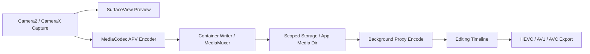

# 18.24 Advanced Professional Video 与专业视频编解码管线

<!-- outline-start -->
## 要点

### 🔹 APV 的定位与适用场景
区分 APV 面向专业录制、剪辑、后期交换的帧内高码率工作流，避免把它和普通在线视频分发编码混在一起。

### 🔹 APV 422-10 Profile 的能力边界
覆盖 YUV 4:2:2、10-bit、最高 2 Gbps 目标码率、HDR 与多视图/辅助视频等能力，以及设备支持探测方式。

### 🔹 MediaCodec 能力探测与降级策略
围绕 codec list、profile / level、hardware acceleration、performance point 和 vendor codec 差异设计能力表。

### 🔹 编码、解码与存储 I/O 成本
建立 2K/4K/8K 高码率素材的 CPU、GPU、内存带宽、存储吞吐和发热风险检查项。

### 🔹 专业视频 App 的管线设计
拆分录制、预览、代理文件、后台转码、导出和缓存清理，不把所有工作压到交互路径。

### 🔹 Perfetto 与媒体日志观察点
明确 MediaCodec、Camera、Surface、AudioTrack、I/O 和 thermal 轨道的观察顺序。

## 扩展

### 🔸 APV 与 HEVC/AV1/ProRes 工作流对照
[待补充]

### 🔸 OpenAPV 参考实现与 Android 平台支持边界
[待补充]

### 🔸 高码率素材的线上失败率与设备分桶
[待补充]

<!-- outline-end -->

## APV 解决的是专业素材，不是在线视频分发

Android 16 把 APV 放进平台媒体能力，面向的是手机上的专业录制、现场粗剪、后期交换和多次转码。它更接近中间格式：帧内编码、低复杂度、高吞吐、可承受较高码率，目标是在剪辑过程中保住画质和响应速度。[已验证: 官方文档, developer.android.com/about/versions/16/features]

这个定位决定了 App 设计不能沿用短视频上传的思路。HEVC、AV1 更适合最终分发，压缩率优先，编码器可能为了码率节省引入更重的预测和延迟。APV 更适合录制后马上剪、裁、调色、导出，文件会大很多，但随机访问和重复编码的损伤更可控。

一条实用边界是：APV 不应成为默认拍摄格式。只有用户明确进入 Pro Video、Log/HDR、外接存储、现场剪辑、素材交换这类模式时，才值得打开 APV 选项。普通分享路径仍应提供 HEVC / AVC / AV1 导出，避免把 `video/apv` 文件直接交给无法识别该格式的第三方 App。

## Android 16 平台暴露的能力

Android 16 官方文档给 APV 的能力描述集中在几个点：帧内编码、2K/4K/8K 高码率、帧 tile 并行、不同色度采样和位深、多视图与辅助视频、HDR10 / HDR10+ 和用户自定义元数据。Android 16 平台实现的是 APV 422-10 Profile，也就是 YUV 4:2:2、10-bit，目标码率最高到 2 Gbps。[已验证: 官方文档, developer.android.com/about/versions/16/features]

AOSP `MediaFormat` 已加入 `MIMETYPE_VIDEO_APV = "video/apv"`，并由 `FLAG_APV_SUPPORT` 标记。公开 API 页面显示该 MIME 常量从 API 36 起可用。[已验证: AOSP master, frameworks/base/media/java/android/media/MediaFormat.java]

`MediaRecorder.VideoEncoder.APV` 在 API 参考中标成 version 36.1，常量值为 `9`。这说明录制侧的高层入口和 `MediaCodec` MIME 入口并非同一批次暴露：编译 SDK、运行系统版本、设备 vendor codec 能力三者都要同时检查。[已验证: 官方文档, MediaRecorder.VideoEncoder.APV]

## 能力探测要按设备建表

APV 支持不能只看 `Build.VERSION.SDK_INT >= 36`。平台有 MIME 常量只表示 framework 认识这种格式，设备是否能编码、是否硬件加速、是否能跑到 4K60 或 8K30，要看 codec list 和 vendor HAL 上报能力。

下面这段代码只做能力盘点。读者应关注四个字段：codec 名称、是否硬件加速、是否来自 vendor、目标分辨率帧率是否被 `VideoCapabilities` 接受。

```kotlin
@RequiresApi(36)
data class ApvCodecChoice(
    val name: String,
    val encoder: Boolean,
    val hardware: Boolean,
    val vendor: Boolean,
    val sizeRateSupported: Boolean,
    val performancePointCoversTarget: Boolean?
)

@RequiresApi(36)
fun findApvCodecs(
    encoder: Boolean,
    width: Int,
    height: Int,
    fps: Int
): List<ApvCodecChoice> {
    val mime = MediaFormat.MIMETYPE_VIDEO_APV
    val requiredPoint = MediaCodecInfo.VideoCapabilities.PerformancePoint(width, height, fps)

    return MediaCodecList(MediaCodecList.REGULAR_CODECS).codecInfos.mapNotNull { info ->
        if (info.isEncoder != encoder) return@mapNotNull null
        if (info.isAlias) return@mapNotNull null
        if (info.supportedTypes.none { it.equals(mime, ignoreCase = true) }) return@mapNotNull null

        val caps = runCatching { info.getCapabilitiesForType(mime) }.getOrNull()
            ?: return@mapNotNull null
        val videoCaps = caps.videoCapabilities ?: return@mapNotNull null
        val points = videoCaps.supportedPerformancePoints

        ApvCodecChoice(
            name = info.name,
            encoder = encoder,
            hardware = info.isHardwareAccelerated,
            vendor = info.isVendor,
            sizeRateSupported = videoCaps.areSizeAndRateSupported(width, height, fps.toDouble()),
            performancePointCoversTarget = points?.any { it.covers(requiredPoint) }
        )
    }
}
```

如果 `performancePointCoversTarget` 是 `null`，不能把它当成失败。官方文档说明，性能点数据来自 vendor HAL，升级到 Android 10 及以上但 vendor image 未更新的设备可能拿不到这组数据。APV 属于新格式，线上分桶时要把 “没有 performance point 数据” 和 “明确不支持目标规格” 分开记录。[已验证: 官方文档, developer.android.com/media/optimize/performance/codec]

## Profile、码率和存储吞吐要一起算

APV 422-10 的 2 Gbps 上限看起来像 codec 参数，工程上先变成存储和热设计问题。2 Gbps 约等于 250 MB/s，录 4 分钟会产生约 60 GB 原始视频载荷，容器、音频和元数据还会继续增加。即使配置在 1 Gbps，持续写入也有 125 MB/s，普通闪存、低电量状态、温控降频、后台同步都会让写入尾延迟变大。

录制前应做三类检查：

- codec 能力：`video/apv` 编码器是否存在，是否硬件加速，目标分辨率帧率是否通过 `areSizeAndRateSupported()`。
- 存储能力：剩余空间、目标目录所在卷、持续写入速度、失败后的半成品清理策略。
- 热状态：录制前后的 CPU / GPU / codec / camera 负载，是否在温控接近降频时禁止 8K 或高帧率档位。

这里不要用一次短 benchmark 给设备贴标签。APV 的风险来自持续写入和持续编码，30 秒能跑通不代表 10 分钟稳定。更稳的做法是把设备按 SoC、codec 名称、硬件加速、分辨率帧率、存储卷和温控状态分桶，线上只对稳定分桶开放高规格。

## 专业视频 App 的管线拆法

APV 录制路径建议拆成六段：采集、预览、编码、落盘、代理文件、导出。交互路径只放采集、预览和必要的编码控制，代理文件生成、波形/缩略图、转码导出和清理任务都放到后台任务队列。



预览不要依赖 APV 解码回放。录制时应保留一条独立预览 Surface，让 Camera 输出直接进入预览层；编码器只消费录制流。剪辑时间线也不应每次都解码 APV 原片，低分辨率代理文件能把拖动、缩放、裁剪和粗剪成本压下来，最终导出时再回到原素材。

缓存清理要按项目维度设计。一个项目可能同时有 APV 原片、代理文件、缩略图、波形、导出文件和失败临时文件。只按文件扩展名清理会误删素材，也会留下占空间的中间产物。项目数据库至少记录素材角色、生成来源、可重建性和访问时间。

## 编码、解码和导出的降级策略

APV 的降级不能只做成 “开/关”。更实用的是分三层：

- 规格降级：从 8K 降到 4K，从 60 fps 降到 30 fps，从 2 Gbps 降到 1 Gbps 或更低档位。
- 格式降级：APV 编码器缺失或长时稳定性不足时，专业模式保留 HEVC 10-bit / HDR；普通模式回到 HEVC / AVC。
- 工作流降级：原片仍用 APV，剪辑预览使用代理文件；导出给社交 App 时转成 HEVC / AVC。

降级结果要写进媒体元数据或项目记录。后续导出、云同步、崩溃分析都依赖这份记录判断文件来源。没有这份记录，用户只会看到“专业模式已开启”，但排查时无法知道那次录制是否在中途降到 HEVC 或更低码率。

## Perfetto 和日志观察点

APV 问题通常不在单个线程上。排查顺序建议从用户症状反推：预览卡顿看 Camera、SurfaceFlinger 和 UI 线程；录制掉帧看 MediaCodec、Camera HAL、sched 和频率；文件损坏看写入器、存储 I/O 和异常退出；长时间录制失败看 thermal、battery、codec reset 和后台任务竞争。

Perfetto 配置至少覆盖这些方向：

- `sched` / `freq` / `idle`：确认编码、相机和写入线程是否被抢占或降频。
- `camera` / `hal`：确认 Camera HAL 输出节奏、buffer 等待和 session 状态变化。
- `gfx` / `view` / `SurfaceFlinger`：确认预览 Surface 是否独立于编码路径，是否触发额外 GPU 合成。
- block I/O 与文件系统事件：确认写入是否出现长尾停顿，尤其是外接存储和空间逼近上限时。
- thermal / battery：确认温控策略是否在录制中改变 CPU、GPU、NPU 或 codec 可用预算。

媒体日志要记录 codec 名称、canonical name、MIME、profile / level 原始值、目标规格、实际输出码率、异常码、停止原因和存储卷。APV 是新格式，线上早期的问题大多来自设备差异，缺少这些字段就只能按机型猜。

## APV、HEVC、AV1 和 ProRes 的工作流差异

| 格式 | 更适合的阶段 | 优势 | 主要代价 |
|:---|:---|:---|:---|
| APV | 专业录制、剪辑中间素材 | 帧内编码、编辑友好、面向多次处理 | 文件大、设备支持新、分享兼容性弱 |
| HEVC | 高画质录制与分发 | 压缩率高、硬件支持广 | 剪辑随机访问成本高，授权和兼容性依设备而变 |
| AV1 | 分发、归档、网络播放 | 压缩率高，生态增长快 | 移动端编码成本和硬件普及度仍要按设备确认 |
| ProRes | 专业后期交换 | 后期工具链成熟 | Android 平台系统级支持不能假设存在 |

这个表不用于选出“最好”的格式。录制、剪辑、导出、分享是不同阶段，格式选择应按阶段拆开。APV 的价值在录制和编辑，不在把文件直接发给每个播放器。

## OpenAPV 能做什么，不能替平台背书

OpenAPV 是 APV 的开源参考实现，仓库说明覆盖 422-10、422-12、444-10、444-12、4444-10、4444-12 和 400-10 等 profile，并提供编码、解码和 bitstream parser 工具。[已验证: GitHub, AcademySoftwareFoundation/openapv]

参考实现适合做三件事：理解 bitstream、准备测试素材、验证服务端或桌面工具的兼容性。它不能证明某台 Android 设备具备硬件编码，也不能替代 `MediaCodecList` 的运行时探测。Android 16 平台公开承诺的是 APV 422-10 Profile 支持入口；厂商 codec 是否存在、性能是否足够、长时间录制是否稳定，仍以设备实测和线上分桶为准。

## 线上分桶字段

APV 上线早期建议把失败率拆到足够细，至少包含这些字段：

- 系统版本：`SDK_INT`、`SDK_INT_FULL`、vendor build、camera provider 版本。
- codec 信息：codec name、canonical name、hardware / software、vendor / platform、profile / level、performance point。
- 录制规格：分辨率、帧率、目标码率、色彩格式、HDR 标记、音频配置。
- 存储状态：卷类型、剩余空间、持续写入速度估计、是否外接存储。
- 热状态：开始温度档、结束温度档、录制时长、是否触发降级。
- 失败形态：`MediaCodec.CodecException`、Camera error、写入失败、用户停止、系统杀进程、导出失败。

高码率格式的线上治理不要只看崩溃率。更有用的指标是录制成功率、可播放率、导出成功率、平均有效录制时长、因空间不足或温控导致的自动降级比例。这些指标能回答一个问题：这台设备是否应该继续开放 APV 高规格。

## 小结

APV 在 Android 上补的是专业视频中间格式能力。App 侧的主要工作不是把编码器打开，而是把设备能力探测、存储吞吐、温控、代理文件、导出格式和线上分桶一起设计好。只要这些边界没有建好，`video/apv` 很容易从专业功能变成大文件失败源。
