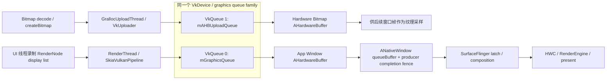
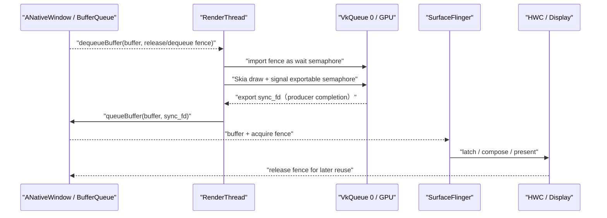

# 18.24 Android 17 HWUI Vulkan 多队列并行渲染与帧边界管理

Android 17 的 HWUI Vulkan 后端会从同一个 graphics queue family 取得两条 `VkQueue`：queue 0 服务 RenderThread 的窗口绘制，queue 1 服务 `HardwareBitmapUploader` 的 AHardwareBuffer 上传。它们共享 `VkDevice`，各自绑定一个 Skia `GrDirectContext`。

“两条 queue”是源码事实，“GPU 一定并行执行”则不是。不同 `VkQueue` 可以分别接受 host submission，驱动仍可根据 GPU 引擎、依赖、内存带宽、频率和调度策略将工作交错或串行执行。分析时需要区分可依赖的接口行为、合理推断和需要 trace 验证的硬件行为。

对 `android-14.0.0_r1` 至 `android-17.0.0_r1` 的 `VulkanManager.cpp` 做标签对比后，可以确认双 queue 在 Android 14 基线中已经存在。标题中的 Android 17 是源码锚点，不表示该结构由 Android 17 新增。

## 复核基线

| 层级 | 基线 | 负责内容 |
| --- | --- | --- |
| Android 平台 | Android 17 / API 37 / `android-17.0.0_r1` | HWUI、VulkanManager、SkiaVulkanPipeline、ANativeWindow、FrameTimeline |
| Android 内核 | `android17-6.18-2026-06_r6` | CPU 线程调度、dma-buf、dma-fence 与 sync_file；厂商 GPU 调度仍由具体驱动实现，没有 `VulkanManager` 或 Skia 逻辑 |
| 历史对照 | `android-14.0.0_r1`、`android-15.0.0_r1`、`android-16.0.0_r1` | 判断双 queue 与 frame-boundary 代码何时已出现 |

分析范围限定为 HWUI 选择 `SkiaVulkan` 的进程。应用自己创建的 Vulkan device/queue、SurfaceFlinger 的 RenderEngine Vulkan 上下文，以及厂商 GPU 服务不属于这个 `VulkanManager` 实例。

## 完整路径

下面的流程图用于定位两条 queue 在 HWUI 中的位置。



应用进程生产窗口 buffer，SurfaceFlinger 负责 latch 和合成决策，HWC/显示设备完成 present。图中只把应用进程内的 HWUI Vulkan 部分展开到两条 queue；它没有改变后半段的 BufferQueue、SurfaceFlinger 与显示路径。

queue 1 只负责把 CPU 侧 bitmap 像素复制进新分配的 AHardwareBuffer；窗口帧仍由 queue 0 生成。上传完成的 hardware bitmap 后续可以被 queue 0 采样，但两条 queue 不会共同 present 同一个 App Window 帧。

## VulkanManager：共享 device，不共享 GrDirectContext

`VulkanManager` 通过进程内弱引用缓存，让 RenderThread 与上传线程复用仍然存活的 Vulkan device。下面的代码展示实例获取规则。

```cpp
static wp<VulkanManager> sWeakInstance = nullptr;
static std::mutex sLock;

sp<VulkanManager> VulkanManager::getInstance() {
    std::lock_guard _lock{sLock};
    sp<VulkanManager> manager = sWeakInstance.promote();
    if (!manager.get()) {
        manager = new VulkanManager();
        sWeakInstance = manager;
    }
    return manager;
}
```

弱引用本身不拥有对象。RenderThread、`VkUploader` 以及各 `GrDirectContext` 会持有强引用；`createContext()` 还通过 context delete callback 增减 `VulkanManager` 的强引用。只要上传 context 仍存活，RenderThread 清理自己的引用不会导致 manager 被另建一份。所有强引用释放后，下一次 `getInstance()` 才会创建新实例。

共享范围包括：

- `VkInstance`；
- `VkPhysicalDevice`；
- `VkDevice`；
- graphics queue family index；
- 已启用的 Vulkan extension 与 feature 信息。

隔离范围包括：

- RenderThread 和 UploadThread 各自的 `GrDirectContext`；
- 两个 context 各自创建的 Skia Vulkan memory allocator；
- device-lost 回调中的上下文标签；
- queue 0 与 queue 1 的提交顺序。

`SkiaVMA::Options{.fThreadSafe = false}` 不能解释成“整个 VkDevice 无需跨线程同步”。它只说明每个 context 创建的 allocator 不负责多线程并发访问；共享 Vulkan 对象、queue 和跨 queue 资源依赖仍要遵守 Vulkan 的 external synchronization 与 semaphore/fence 规则。

## 两条 graphics queue 如何创建

### 同一 queue family，两个 queue index

`setupDevice()` 选中第一个带 `VK_QUEUE_GRAPHICS_BIT` 的 family，并要求该 family 至少提供两个 queue。下面的缩写代码保留了能力检查与取 queue 的关键点。

```cpp
constexpr uint32_t kRequestedQueueCount = 2;

for (uint32_t i = 0; i < queueFamilyCount; i++) {
    if (queueProps[i].queueFamilyProperties.queueFlags & VK_QUEUE_GRAPHICS_BIT) {
        mGraphicsQueueIndex = i;
        LOG_ALWAYS_FATAL_IF(
            queueProps[i].queueFamilyProperties.queueCount < kRequestedQueueCount);
        break;
    }
}

VkDeviceQueueCreateInfo queueInfo{
    .queueFamilyIndex = mGraphicsQueueIndex,
    .queueCount = kRequestedQueueCount,
    .pQueuePriorities = queuePriorities,
};

mGetDeviceQueue(mDevice, mGraphicsQueueIndex, 0, &mGraphicsQueue);
mGetDeviceQueue(mDevice, mGraphicsQueueIndex, 1, &mAHBUploadQueue);
```

两个 queue 拥有相同 capability 和同一个 family index，因此共享 queue-family ownership 语义。`setupDevice()` 内没有“只有一条 queue 时改为复用 queue 0”的分支；HWUI 一旦走到这段 Vulkan device 初始化，能力不满足会触发 fatal。渲染后端是否选择 Vulkan 由更上层的设备配置与进程策略决定，不能据此推导“所有 Android 17 设备都会启动 Vulkan HWUI”。

### 两个 Skia context 绑定不同 queue

`createContext(ContextType)` 把同一组 device 信息交给 Skia，只替换 `fQueue`：

- `kRenderThread` → `mGraphicsQueue`；
- `kUploadThread` → `mAHBUploadQueue`。

这样做的直接收益是 host 侧提交隔离：硬件位图上传不会被塞进 RenderThread 使用的同一个 Vulkan queue 顺序中。可见性能收益仍取决于驱动：

- GPU 有可重叠的 copy/graphics 执行资源时，上传可能与窗口绘制部分重叠；
- 两条 queue 争用内存带宽、cache 或同一图形引擎时，驱动可能交错甚至串行；
- AHardwareBuffer 上传涉及的分配、页映射和 cache 维护也可能反向影响渲染；
- 两条 queue 使用同一个 global priority 请求，queue 1 没有天然的低优先级。

所以，双 queue 更准确的描述是“允许独立提交并减少 queue 级顺序约束”，不能写成“保证硬件并行”或“RenderThread 无需等待任何上传影响”。

## HardwareBitmapUploader：上传隔离不等于异步返回

### CPU 像素会被复制

`Bitmap.Config.HARDWARE` 的这条创建路径先分配带 `AHARDWAREBUFFER_USAGE_GPU_SAMPLED_IMAGE` 的 AHardwareBuffer，再调用 `SkImages::TextureFromAHardwareBufferWithData()` 把 `SkPixmap` 数据写进去。`Bitmap.cpp` 也明确把 `allocateHardwareBitmap()` 描述为复制 bitmap contents。

因此，这里不是“已有像素零拷贝变成 GPU 纹理”。AHardwareBuffer 省去了后续再建一份应用可见像素存储的需要，但首次创建仍包含 CPU 源像素到 gralloc buffer 的数据传输。

### GrallocUploadThread 与调用方等待

Vulkan 上传在 `GrallocUploadThread` 上执行：

1. 取得或创建共享 `VulkanManager`；
2. 创建绑定 queue 1 的 `GrDirectContext`；
3. 调用 `TextureFromAHardwareBufferWithData()` 记录上传；
4. 执行 `mGrContext->submit(GrSyncCpu::kYes)`；
5. `runSync()` 返回后，`uploadHardwareBitmap()` 才把结果交回调用方。

`GrSyncCpu::kYes` 表示上传线程等待 GPU 完成。它避免调用方拿到仍在写入的 hardware bitmap，也意味着单次 hardware bitmap 创建并非“发出请求立刻返回”。主线程若同步创建大图，仍可能被解码、AHB 分配、上传和 GPU 等待拖住。

queue 1 与 queue 0 可以在这段时间分别提交工作。即便如此，GPU 资源争用仍可能拉长 RenderThread 的 queue 0 工作，必须用 trace 验证。

### 60 秒闲置回收

`HardwareBitmapUploader.cpp` 把 `kThreadTimeout` 设为 60000 ms。没有 pending upload 且超过该间隔后，`VkUploader::onIdle()` 会释放上传 `GrDirectContext` 和 manager 强引用；下一次上传按需重建。

源码只证明“释放上传 context 及其持有资源”。具体回收多少 GPU 内存取决于驱动、Skia cache、AHardwareBuffer 的其他持有者和设备内存策略，不能写成固定的“回收数十 MB”。

## Global priority：可选请求，不是实时保证

`Properties::contextPriority` 默认值为 0。系统代码只有在 Vulkan context 创建前通过隐藏的 `HardwareRenderer.setContextPriority()` 设置 EGL priority 常量，`VulkanManager` 才尝试映射到：

- `VK_QUEUE_GLOBAL_PRIORITY_LOW_EXT`；
- `VK_QUEUE_GLOBAL_PRIORITY_MEDIUM_EXT`；
- `VK_QUEUE_GLOBAL_PRIORITY_HIGH_EXT`。

Android 17 源码在 `contextPriority != 0` 且识别到 `VK_EXT_global_priority` v2 时才附加 `VkDeviceQueueGlobalPriorityCreateInfoEXT`。如果 global-priority query 可用，代码先确认选中的 queue family 报告了所请求档位；不支持时记录 warning，并继续创建 device。

还要注意三点：

- `mAPIVersion` 固定为 Vulkan 1.1，不能因为源码检查了 `VK_API_VERSION_1_4` 就宣称 HWUI 在 Android 17 使用 Vulkan 1.4 core priority；
- 两条 queue 来自同一个 `VkDeviceQueueCreateInfo`，global priority 请求对这次创建的两条 queue 一起生效；
- global priority 是交给驱动的调度提示与权限受控能力，不等于 Linux 线程实时优先级，也不承诺 GPU 抢占时延。

## 两种“帧边界”不能混用

### Vulkan frame-boundary 是 GPU 工具标记

Android 17 的 `finishFrame()` 在提交 Skia 工作时有两条标记路径：

1. AGI capture layer 提供私有 `VK_ANDROID_frame_boundary` 时，HWUI 把本帧的 signal semaphore 和 render-target image 传给 `vkFrameBoundaryANDROID()`；
2. 该私有入口不存在时，HWUI 设置 `GrSubmitInfo.fMarkBoundary = Yes` 和进程内递增的 `fFrameID`，由 Skia/可用的 `VK_EXT_frame_boundary` 支持向工具描述 frame boundary。

Khronos `VK_EXT_frame_boundary` 的用途是给 queue submission 附加应用定义的 frame ID、结果 image/buffer 和工具 tag。它是 profiling annotation，不会自动创建执行依赖，也不会替代 present semaphore。

`VK_ANDROID_frame_boundary` 在 AOSP 头文件中被明确描述为 AGI 专用扩展，由 AGI Vulkan capture layer 在抓帧时提供。普通运行时查不到该 proc pointer 属于预期情况。

### FrameTimeline 是窗口 present 时间线

FrameTimeline 的 `vsyncId` 走另一条路径。`CanvasContext::draw()` 取得 `FrameTimelineVsyncId`，构造 `ANativeWindowFrameTimelineInfo`，再由 render pipeline 在 queueBuffer 前设置给 ANativeWindow。SurfaceFlinger 用它建立 App `SurfaceFrame` 与显示 `DisplayFrame` 的 expected/actual 关系。

两类 ID 的差异如下：

| 对象 | 生成位置 | 主要消费者 | 是否直接表示 expected present |
| --- | --- | --- | --- |
| Vulkan `currentFrameID` | HWUI `VulkanManager::finishFrame()` 的进程内计数器 | Skia、Vulkan 工具、AGI capture | 否 |
| FrameTimeline `vsyncId` | Choreographer / 平台帧时间线传入 HWUI | ANativeWindow、SurfaceFlinger、Perfetto FrameTimeline | 是 |
| BufferQueue frame number | Producer queue 次序 | BLAST、SurfaceFlinger、transaction/trace | 不单独表示 |

AOSP 没有把 `currentFrameID` 赋值为 `FrameTimelineVsyncId`。工具可以按时间、submission、render target 或其他元数据做关联，但不能声称二者天然相等。

### Frame boundary 也不等于 present

Vulkan frame-boundary 标记发生在 queue submission 附近。后面还有：

- GPU 完成对窗口 image 的写入；
- producer completion fence signal；
- `ANativeWindow::queueBuffer()`；
- BLAST buffer transaction；
- SurfaceFlinger latch；
- HWC DEVICE 或 RenderEngine CLIENT 合成；
- display present。

因此，GPU 工具把 draw call 归到某帧，只解决“这些 GPU 命令属于哪组工作”。用户何时看到该帧仍要看 FrameTimeline 与 present fence。

## dequeue fence 与 producer completion fence

### dequeue fence：等待旧消费者释放 buffer

`VulkanSurface::dequeueNativeBuffer()` 从 App Window 的 ANativeWindow 取得 buffer 和 dequeue fence。该 fence 表示这块复用 buffer 的上一轮消费者工作何时结束，Producer 要等它 signal 后才能安全写入。

当 fence 尚未 signal 时，`VulkanManager::dequeueNextBuffer()` 会尝试：

1. `dup()` fence fd；
2. 创建 `VkSemaphore`；
3. 以 `VK_EXTERNAL_SEMAPHORE_HANDLE_TYPE_SYNC_FD_BIT` 和 `VK_SEMAPHORE_IMPORT_TEMPORARY_BIT` 临时导入；
4. 让 Skia surface 在该 semaphore 上等待；
5. 立即 `FlushAndSubmit()`，确保 wait 进入 GPU 提交。

导入或创建失败时，源码退回 CPU `sync_wait()`。这条 fence 不是“SurfaceFlinger 作为 Producer 告诉 App 内容准备好”，方向应理解为 Consumer/HWC 释放旧 buffer 给 App Producer 复用。

### finishFrame：导出本轮 GPU 完成 fence

queue 0 绘制结束时，`finishFrame()` 创建可导出 sync-fd 的 semaphore，把它放进 `GrFlushInfo.fSignalSemaphores`，flush/submit 后通过 `vkGetSemaphoreFdKHR()` 取得 fd。`VulkanSurface::presentCurrentBuffer()` 把这个 fd 传给 `ANativeWindow::queueBuffer()`。

这个 fd 在 BufferQueue 消费侧成为当前 buffer 的 acquire fence：SurfaceFlinger 可以接收 buffer 元数据，但必须尊重 fence，等待 GPU 写完后再安全读取。`presentCurrentBuffer()` 这个函数名容易让人误会；源码行为是 queue buffer，不是屏幕 present。

创建可导出 semaphore 失败、导致 `sharedSemaphore` 为空时，`finishFrame()` 会用 `mQueueWaitIdle(mGraphicsQueue)` 做保守兜底。`vkGetSemaphoreFdKHR()` 在成功提交后单独失败时，Android 17 源码只记录错误并返回无效 fd，不能把这两类失败写成同一条 fallback。正常路径不需要 RenderThread 在 CPU 上等待整帧 GPU 完成。

下面的时序图用于检查 fence 方向。



这条链路解释了两个常见现象：`queueBuffer()` 可以在 GPU 完成前返回；下一次 `dequeueBuffer()` 也可能因为旧 buffer 仍被 GPU/HWC 使用而等待。

## Buffer age 与 partial update

当 `Properties::enablePartialUpdates` 和 `Properties::useBufferAge` 同时开启时，`VulkanManager` 使用 `SwapBehavior::BufferAge`。`VulkanSurface` 按本进程的 present count 与每块 buffer 上次成功 queue 的 count 计算 age；新 buffer、内容无效或 transform 改变时返回 0。

HWUI 会把 buffer age 与 swap history 结合，扩大本次需要恢复的 damage，并通过 `native_window_set_surface_damage()` 把窗口 damage 交给 ANativeWindow。这里有三个限制：

- buffer age 表示内容可复用历史，不等于“系统只执行脏矩形内的所有 GPU 指令”；
- age 为 0 时需要按完整内容处理；
- driver、tile 架构、offscreen layer、blend 和 SurfaceFlinger 合成仍会影响最终带宽。

因此，partial update 的收益要用 GPU counter、render stage 和功耗数据评估，不能只凭 `bufferAge != 0` 认定 fill rate 已按比例下降。

## VkFunctor 只说明 WebView 私有互操作

`getVkFunctorInitParams()` 会向 HWUI 的 WebView Vulkan functor 回调提供 `VkInstance`、`VkPhysicalDevice`、`VkDevice`、queue 0、queue family index 和已启用 feature/extension。`VkFunctorDrawable` 明确持有 `WebViewFunctor::Handle`，并在 RenderThread 上调用相关回调。

它不是面向普通应用的通用 Vulkan 接口，也不是 SurfaceView 自定义渲染自动复用 HWUI device 的桥梁。任意 native renderer 都不能据此取得 HWUI 私有 device；应用应使用公开 Vulkan/ANativeWindow API 管理自己的实例、device、queue 与同步。

## 与 SkiaGL 的正确比较方式

旧结论常把 SkiaGL 写成“只有一个 context，所以 hardware bitmap 上传必定和 RenderThread 串行”。Android 17 的 `HardwareBitmapUploader` 对 GL 同样有独立 `EGLUploader`、`GrallocUploadThread` 与 EGL context，并通过 EGL fence 等待上传。

两种后端的可观察差异应这样描述：

| 维度 | SkiaVulkan | SkiaGL |
| --- | --- | --- |
| HWUI 明确管理的提交对象 | 同一 VkDevice 上两条 graphics `VkQueue` | RenderThread 与 uploader 各自的 EGL/GL context；驱动内部 queue 拓扑不可由 GL API 直接得知 |
| AHB 上传完成等待 | UploadThread `GrSyncCpu::kYes` | UploadThread `eglClientWaitSyncKHR()` |
| 窗口完成 fence | Vulkan semaphore 导出 sync fd | EGL/GL native fence 路径 |
| GPU frame annotation | 可使用 `VK_EXT_frame_boundary` 或 AGI 私有扩展 | 依赖 GL/驱动/工具支持，不能概括成“无分析能力” |
| 是否保证上传与绘制并行 | 否 | 否 |

Vulkan 的价值在于 queue、semaphore 和外部句柄关系由 API 显式表达；它不自动让同一负载变快。性能判断仍需在同设备、同内容、同刷新率和同热状态下测量。

## 性能观测：分清 queue、GPU 与 present

### Perfetto

建议同时采集以下证据：

- Main thread 与 RenderThread 调度、`syncAndDrawFrame`、`Vulkan finish frame`、`flush commands`；
- `GrallocUploadThread` 的 hardware bitmap 上传 slice；
- `dequeueBuffer` / `queueBuffer` duration；
- FrameTimeline expected/actual 与 jank type；
- `gpu.renderstages`：设备 producer 支持时，可用 `hw_queue_iid`、context、submission ID 和 render stage 查看 GPU 活动；
- `gpu.counters`：设备支持时查看频率、busy、带宽、cache 等计数器；
- GPU/DRM ftrace 与 dma-buf/fence 事件：用来判断驱动调度和 fence 等待。

Perfetto 的 GPU data source 由设备/驱动 producer 提供，名称可能带 `.adreno`、`.mali` 等后缀，字段丰富度也会不同。看到两条 HWUI `VkQueue` 不保证 trace 一定显示两条可命名的硬件 queue。

### AGI

AGI frame profiling 可检查 Vulkan API call、render pass、shader、texture、pipeline state 与资源。抓取 HWUI 渲染时，`VK_ANDROID_frame_boundary` 由 AGI capture layer 注入，帮助工具识别窗口帧。

AGI 不替代系统 trace：它擅长解释一帧 GPU 命令做了什么；FrameTimeline、BufferQueue、SurfaceFlinger、HWC 和 present timing 仍需要 Perfetto、dumpsys 或厂商显示工具。

### 常见症状与证据

| 症状 | 先看 | 避免的误判 |
| --- | --- | --- |
| hardware bitmap 创建卡住调用线程 | decode、AHB allocation、GrallocUploadThread、`GrSyncCpu` wait | 看到 queue 1 就认定调用异步返回 |
| RenderThread 慢且 upload 同期发生 | queue 0/1 submission、GPU busy、带宽、频率、调度 | 把两个 queue 直接当成两套 GPU 引擎 |
| `dequeueBuffer` 长等待 | 上一轮 release fence、buffer 数量、SF/HWC/GPU 使用期 | 归因于 Vulkan command recording |
| `queueBuffer` 按时但帧晚 | acquire fence、SF latch、composition、present | 把 queue 时间当上屏时间 |
| AGI 有清晰 frame boundary，Perfetto token 对不上 | Vulkan frame ID 与 FrameTimeline vsyncId 分开对齐 | 假设两个 ID 数值相同 |
| partial update 开启但 GPU 仍重 | buffer age、damage、offscreen layer、overdraw、tile load/store | 认为 surface damage 会裁掉所有上游工作 |

## 版本演进

以下结论只来自固定 tag 的代码对照：

| 平台标签 | 双 graphics queue | frame-boundary 相关代码 | global-priority 相关代码 |
| --- | --- | --- | --- |
| `android-14.0.0_r1` | 已有 queue 0 + AHB upload queue 1 | 本次对照未见 Android 17 形态的 boundary 分支 | 已有 `VK_EXT_global_priority` 请求 |
| `android-15.0.0_r1` | 保持双 queue | 本次对照未见 Android 17 形态的 boundary 分支 | 保持 extension 请求 |
| `android-16.0.0_r1` | 保持双 queue | 已有 `VK_EXT_frame_boundary`、AGI 私有扩展与 `fFrameID` | 增加 global-priority query/KHR 相关处理 |
| `android-17.0.0_r1` | 保持双 queue | 保持两条 boundary 路径 | 保持 query 与不支持时的降级处理 |

这张表能支持“Android 17 当前是什么”，也能排除“双 queue 是 Android 17 新特性”的说法。若要定位某个提交首次进入主线，还需继续查 support branch 与 Git history，不能只用四个 release tag 推断精确日期。

## 源码核对索引

- [`VulkanManager.cpp`](https://android.googlesource.com/platform/frameworks/base/+/refs/tags/android-17.0.0_r1/libs/hwui/renderthread/VulkanManager.cpp) / [`VulkanManager.h`](https://android.googlesource.com/platform/frameworks/base/+/refs/tags/android-17.0.0_r1/libs/hwui/renderthread/VulkanManager.h)：device、两条 queue、context、global priority、frame boundary、fence 导入导出；
- [`HardwareBitmapUploader.cpp`](https://android.googlesource.com/platform/frameworks/base/+/refs/tags/android-17.0.0_r1/libs/hwui/HardwareBitmapUploader.cpp) / [`Bitmap.cpp`](https://android.googlesource.com/platform/frameworks/base/+/refs/tags/android-17.0.0_r1/libs/hwui/hwui/Bitmap.cpp)：GL/Vulkan 上传线程、首次内容复制、CPU 等待与 60 秒 idle timeout；
- [`SkiaVulkanPipeline.cpp`](https://android.googlesource.com/platform/frameworks/base/+/refs/tags/android-17.0.0_r1/libs/hwui/pipeline/skia/SkiaVulkanPipeline.cpp)：dequeue、draw、finishFrame、swapBuffers 的调用关系；
- [`VulkanSurface.cpp`](https://android.googlesource.com/platform/frameworks/base/+/refs/tags/android-17.0.0_r1/libs/hwui/renderthread/VulkanSurface.cpp)：ANativeWindow buffer、dequeue fence、buffer age、surface damage 与 queueBuffer；
- [`CanvasContext.cpp`](https://android.googlesource.com/platform/frameworks/base/+/refs/tags/android-17.0.0_r1/libs/hwui/renderthread/CanvasContext.cpp)：FrameTimeline info、damage history、dequeue/queue duration；
- 历史标签：[`android-14.0.0_r1`](https://android.googlesource.com/platform/frameworks/base/+/refs/tags/android-14.0.0_r1/libs/hwui/renderthread/VulkanManager.cpp)、[`android-15.0.0_r1`](https://android.googlesource.com/platform/frameworks/base/+/refs/tags/android-15.0.0_r1/libs/hwui/renderthread/VulkanManager.cpp)、[`android-16.0.0_r1`](https://android.googlesource.com/platform/frameworks/base/+/refs/tags/android-16.0.0_r1/libs/hwui/renderthread/VulkanManager.cpp)：双 queue、frame-boundary 与 global-priority query 的版本对照；
- [Khronos `VkFrameBoundaryEXT`](https://registry.khronos.org/vulkan/specs/latest/man/html/VkFrameBoundaryEXT.html)：Vulkan frame annotation 的规范语义；
- [内核 `dma-fence.c`](https://android.googlesource.com/kernel/common/+/refs/tags/android17-6.18-2026-06_r6/drivers/dma-buf/dma-fence.c) / [`sync_file.c`](https://android.googlesource.com/kernel/common/+/refs/tags/android17-6.18-2026-06_r6/drivers/dma-buf/sync_file.c)：`android17-6.18-2026-06_r6` 的 fence 与 sync-file 边界；
- [Perfetto GPU data sources](https://perfetto.dev/docs/data-sources/gpu)：GPU counter、render stage 与设备 producer 的观察口径；
- [Perfetto FrameTimeline](https://perfetto.dev/docs/data-sources/frametimeline)：expected/actual 时间线与 jank 分类；
- [AGI Frame Profiler](https://developer.android.com/agi/frame-trace/frame-profiler)：单帧 Vulkan/GL 调用和 GPU 资源分析。

上述平台源码均固定在 `android-17.0.0_r1`。内核侧采用 `android17-6.18-2026-06_r6`，只用于解释线程调度、GPU driver、dma-buf 与 fence 机制，不能把厂商 driver 行为写成 AOSP HWUI 保证。

## 总结

Android 17 HWUI Vulkan 的双 queue 架构可以压缩成四句话：

1. queue 0 供 RenderThread 生成 App Window 帧，queue 1 供 GrallocUploadThread 上传 hardware bitmap；
2. 两条 queue 共享 VkDevice，但使用独立 Skia context 和 allocator，允许独立提交，不保证硬件同时执行；
3. Vulkan frame-boundary 是 GPU 工具标记，FrameTimeline `vsyncId` 才是窗口 expected/actual present 的时间锚点；
4. dequeue fence 保护旧 buffer 的安全复用，queueBuffer 携带的 producer completion fence 保护 SurfaceFlinger 的安全读取，二者方向不能颠倒。

分析问题时，应把 RenderThread、GrallocUploadThread、两条 queue、GPU completion fence、BufferQueue、FrameTimeline 和 present 放进同一个时间区间。只看到 queue 数量，仍不足以判断并行度、卡顿原因或用户看到的显示时刻。
