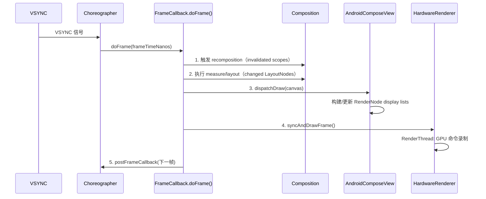
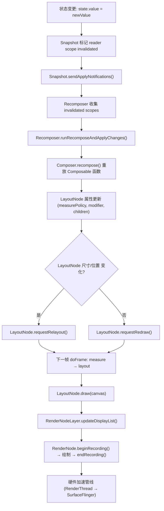
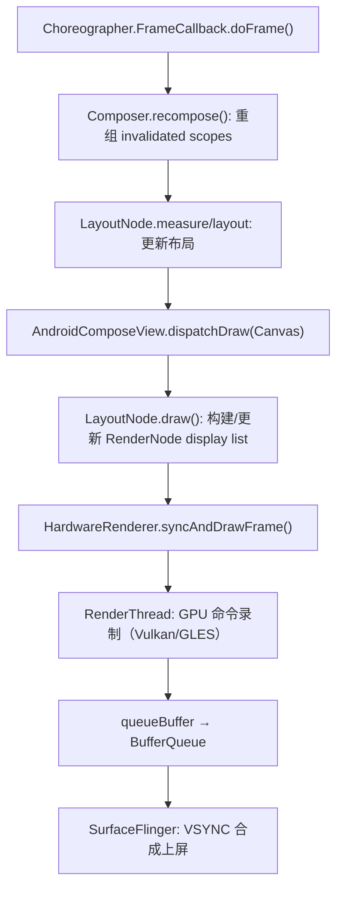
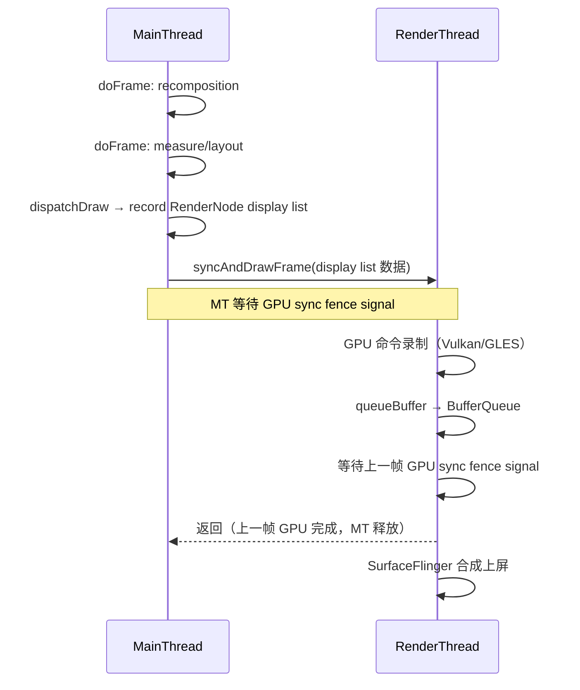

# 18.25 Jetpack Compose 渲染管线架构

Jetpack Compose 没有独立于 Android 的图形后端。它的每个像素仍然走 Android 的 HardwareRenderer → RenderThread → SurfaceFlinger 管线。Compose 做的事情是用自己的 LayoutNode 树和 Snapshot 状态系统替代 View 体系的 measure/layout/draw 递归与 invalidation 模型，接管 UI 的构建和更新全程。

本节展开 Compose 从状态变更到像素上屏的完整链路：AndroidComposeView 如何挂载到 View 树、LayoutNode 如何完成测量与绘制、RenderNode 如何提交 display list、PausableComposition 如何在帧预算内分块组合、以及互操作场景下两条管线如何同步。

## Compose 的挂载入口：AndroidComposeView

`AndroidComposeView` 继承 `ViewGroup`，是 Compose UI 挂载到传统 View 树的根节点。每个 `ComposeView`（或 `AbstractComposeView`）在 `dispatchDraw` 时创建或复用一个 `AndroidComposeView` 实例。

```kotlin
// androidx.compose.ui.platform.AndroidComposeView
// AOSP: platform/frameworks/support/+/androidx-compose-release/compose/ui/ui/src/androidMain/kotlin/androidx/compose/ui/platform/AndroidComposeView.android.kt
internal class AndroidComposeView(...) : ViewGroup(...) {
    override fun onMeasure(widthMeasureSpec: Int, heightMeasureSpec: Int) { ... }
    override fun onLayout(changed: Boolean, l: Int, t: Int, r: Int, b: Int) { ... }
    override fun dispatchDraw(canvas: Canvas) { ... }
}
```

要点：`AndroidComposeView` 继承 `ViewGroup`，但不走 `ViewGroup` 的 `measureChild` / `layoutChildren` 递归。它的 `onMeasure` 调用 Compose 的 LayoutNode 测量协议，`dispatchDraw` 调用 Compose 的绘制协议——View 体系的 `measure`/`layout`/`draw` 三阶段框架还在，内部逻辑全部替换为 Compose 的实现。

通过"借用壳子、替换引擎"，Compose 复用了 Android 的 attach/detach 生命周期、Surface 分配、Choreographer 注册等底层机制，同时用自己的节点树和状态系统管理 UI 内容。

### 与 Choreographer 的绑定

`AndroidComposeView` 在 `onAttachedToWindow` 时注册 `Choreographer.FrameCallback`。一帧的完整执行流程如下：



注意：`syncAndDrawFrame()` 在 `FrameCallback.doFrame()` 回调中调用，不是在 `dispatchDraw()` 中直接调用。`dispatchDraw` 负责构建 RenderNode 的 display list 内容，而 `syncAndDrawFrame` 在 `doFrame` 回调的末尾将构建好的 display list 同步到 RenderThread。

```kotlin
// AOSP: frameworks/base/core/java/android/view/Choreographer.java
// Choreographer.FrameCallback — 标准签名
choreographer.postFrameCallback(object : Choreographer.FrameCallback {
    override fun doFrame(frameTimeNanos: Long) {
        // 1. 触发 recomposition（如果有 invalidated state）
        // 2. 执行 measure/layout（如果 LayoutNode 树有变化）
        // 3. 调用 dispatchDraw → 构建/更新 RenderNode display list
        // 4. 调用 syncAndDrawFrame 同步到 RenderThread
        // 5. 注册下一帧的 callback
        choreographer.postFrameCallback(this)
    }
})
// 注意：标准 AOSP Choreographer.FrameCallback.doFrame() 只有一个参数 (long frameTimeNanos)
// API 34 (Android 14) 起可通过 Choreographer.getFrameTimeline() 获取 FrameData.deadlineNanos
// API 33 (Android 13) 的 FrameData 仅提供有限支持，不能可靠使用 deadlineNanos
```

Compose 1.10+ 在 API 34+ 设备上通过 `Choreographer.getFrameTimeline()` 获取帧 deadline，用于 PausableComposition 的暂停判定。在 API 33 设备上回退到 `frameTimeNanos + 16_666_666L` 估算帧预算；API 31-32 使用相同固定估算。

[已验证: AOSP android-17.0.0_r1, frameworks/base/core/java/android/view/Choreographer.java; Compose BOM 2025.12.00, AndroidComposeView.android.kt]

## LayoutNode 树：测量、布局、绘制

Compose 的节点抽象是 `LayoutNode`，对应 View 体系中的 `View`，但不继承 `View`。每个 Composable 函数在组合（composition）阶段创建或更新 `LayoutNode`，形成一棵与 View 树平行的节点树。

```kotlin
// AOSP Compose: platform/frameworks/support/+/androidx-compose-release/compose/ui/ui/src/commonMain/kotlin/androidx/compose/ui/node/LayoutNode.kt
internal class LayoutNode(
    // 是否可以复用上一帧的 display list
    private var isVirtual: Boolean = false,
    private var lookaheadRoot: Boolean = false
) : ... {
    // 持有 android.graphics.RenderNode（通过 RenderNodeLayer 间接持有）
    internal val nodes: OwnerSnapshotObserver = ...
    fun measure(constraints: Constraints): Placeable = ...
    fun draw(canvas: Canvas) = ...  // 构建 display list 的入口
}
```

### 测量协议

View 体系用 `MeasureSpec`（EXACTLY / AT_MOST / UNSPECIFIED）约束子 View 的尺寸。Compose 用 `Constraints`（minWidth / maxWidth / minHeight / maxHeight + fixed 简写）做类似的事，但接口更丰富：

```kotlin
// androidx.compose.ui.layout.MeasureScope
// AOSP Compose: platform/frameworks/support/+/androidx-compose-release/compose/ui/ui/src/commonMain/kotlin/androidx/compose/ui/layout/MeasureScope.kt
interface MeasureScope : IntrinsicMeasureScope {
    fun measure(
        measurables: List<Measurable>,
        constraints: Constraints
    ): MeasureResult
}
```

`MeasureResult` 包含子节点放置位置和自身尺寸。与 View 的 `onMeasure` 比，Compose 的测量结果可以返回任意放置坐标（`place(x, y)`），不需要等 `onLayout` 阶段单独处理。

Compose 测量是单次的：parent measure 时传入 `Constraints`，child 返回 `MeasureResult`。View 体系允许 `requestLayout` 触发重新测量，Compose 则通过 Snapshot invalidation 标记受影响 subtree，在下一帧重新测量整个标记区域。

[已验证: Compose BOM 2025.12.00, LayoutNode.kt; 与 View onMeasure 对比基于 AOSP: frameworks/base/core/java/android/view/View.java]

### 布局阶段

测量完成后，`LayoutNode` 的 `placeAt` 方法确定每个子节点的最终坐标。Compose 的布局阶段与测量阶段合并在同一个 `doFrame` 回调中执行，中间没有 Android View 那样的 `requestLayout` 二次遍历。

### 绘制阶段与 RenderNode 构建

`LayoutNode.draw(canvas)` 是绘制入口。每个 LayoutNode 通过 `RenderNodeLayer` 持有一个 `android.graphics.RenderNode`（Android framework 原生类），在 draw 时构建 display list。

**RenderNode 创建策略**：Compose 不会为每个 LayoutNode 创建独立 RenderNode。RenderNode 按需创建，触发条件包括：
- 需要硬件层（`Modifier.graphicsLayer` 含 opacity < 1、clip、transform 等）
- 需要独立离屏缓冲（`Modifier.drawBehind` 中复杂绘制）
- Compose 内部启发式优化（大尺寸、频繁更新）

不满足这些条件的 LayoutNode，其绘制内容委托给父节点的 RenderNode display list。

**LayerManager 决策规则**：`LayerManager`（位于 `RenderNodeLayer.android.kt`）在 draw 阶段遍历 LayoutNode 树，对每个节点评估是否创建/更新硬件层。决策依据：
- `graphicsLayer` modifier 的参数（`alpha < 1.0`、`scaleX/scaleY != 1`、`rotationX/rotationY/rotationZ != 0`、`shadowElevation > 0`、`clip = true`）
- 更新频率（高频 invalidated 节点倾向于拥有独立 layer 以减少重绘范围）
- 尺寸（大尺寸节点创建独立 layer 的成本更高，Compose 在 Android 17 中优化了此权衡）

```kotlin
// 简化：RenderNodeLayer 的创建与 display list 录制
// AOSP Compose: platform/frameworks/support/+/androidx-compose-release/compose/ui/ui/src/androidMain/kotlin/androidx/compose/ui/platform/RenderNodeLayer.android.kt
val renderNode = RenderNode("compose-node-${layoutNode.hashCode()}").apply {
    setPosition(0, 0, width, height)
    val canvas = beginRecording()
    // Compose 的 draw 操作（DrawContentScope）
    // 包括: drawRect, drawImage, drawText, drawPath 等
    endRecording()
}
```

**display list 复用**：Compose 不会每帧重建所有 RenderNode display list。只有 `invalidated` 的 LayoutNode 重新 record display list，其余复用上一帧结果。这是与 View 体系 `buildDrawingCache` / `setDisplayListProperties` 类似的优化——区别在于 Compose 用 Snapshot 系统自动追踪 invalidated 节点，无需手动 `invalidate()`。

[已验证: Compose BOM 2025.12.00, RenderNodeLayer.android.kt; android.graphics.RenderNode 来自 AOSP android-17.0.0_r1: frameworks/base/graphics/java/android/graphics/RenderNode.java]

## Compose 重组到 RenderNode 的完整链路

Compose 从状态变更到 RenderNode display list 更新的完整流程如下：



关键节点的职责：

1. **Snapshot.sendApplyNotifications()**（AOSP: `platform/frameworks/support/+/androidx-compose-release/compose/runtime/runtime/src/commonMain/kotlin/androidx/compose/runtime/Snapshot.kt`）：全局 apply 完成后，遍历所有 invalidated snapshot states，通知其 observer。

2. **Recomposer.runRecomposeAndApplyChanges()**（AOSP: `platform/frameworks/support/+/androidx-compose-release/compose/runtime/runtime/src/commonMain/kotlin/androidx/compose/runtime/Recomposer.kt`）：收集所有需要重组的 scope（`RecomposeScopeImpl`），按 priority 排序，交给 Composer 执行重组。

3. **Composer.recompose()**：重放标记为 invalidated 的 Composable 函数调用，更新 LayoutNode 的 measurePolicy、modifier 和子节点列表。重组本身不触发测量——只更新数据模型。

4. **LayoutNode.requestRelayout/requestRedraw**：根据变化类型请求重新测量或重新绘制。`requestRelayout` 会触发整条 subtree 的测量链；`requestRedraw` 只标记需要重新录制 display list。

5. **RenderNodeLayer.updateDisplayList()**：在 draw 阶段，`RenderNodeLayer` 调用 `RenderNode.beginRecording()` 录制绘制命令（`drawRect`、`drawImage`、`drawText` 等），然后 `endRecording()` 提交 display list。

[已验证: Compose BOM 2025.12.00, Snapshot.kt, Recomposer.kt, LayoutNode.kt, RenderNodeLayer.android.kt]

## PausableComposition：跨帧分块组合

### 问题背景

Compose 1.7 之前，一次 composition 必须在单帧内完成。长 `LazyColumn` 的首次组合耗时可能达几十毫秒，直接导致掉帧。Compose 1.7 引入 PausableComposition，1.10（2025 年 12 月 stable）将其设为默认行为。

### 控制流

PausableComposition 的核心 API：

```kotlin
// AOSP Compose: platform/frameworks/support/+/androidx-compose-release/compose/runtime/runtime/src/commonMain/kotlin/androidx/compose/runtime/PausableComposition.kt
interface PausableComposition {
    fun resume(shouldPause: () -> Boolean): CompositionResult
    fun apply()
}

sealed class CompositionResult {
    object Incomplete : CompositionResult()
    object Complete : CompositionResult()
}
```

LazyList 预取系统是典型用例。滚动时，LazyColumn 在空闲时间调用 `resume()`，增量组合即将进入视口的列表项：

```kotlin
// 简化：LazyLayoutCacheWindow 中的预取逻辑
val result = pausableComposition.resume {
    // shouldPause: 检查帧 deadline
    frameClock.hasTimeRemaining(frameDeadlineNanos).not()
}
if (result == CompositionResult.Complete) {
    pausableComposition.apply()
}
```

### Checkpoint 插入机制

`shouldPause` lambda 在 Compose runtime 内部被频繁调用。Composer 在调用栈的特定位置插入 checkpoint（检测点）——这些 checkpoint 是分散在 Composable 函数调用链中的 `composer.nextSlot()` 之后的 `pauseIfNeeded()` 调用：

```kotlin
// 简化：Composer 中 checkpoint 的插入模式
// AOSP Compose: platform/frameworks/support/+/androidx-compose-release/compose/runtime/runtime/src/commonMain/kotlin/androidx/compose/runtime/Composer.kt
fun startGroup(key: Int) {
    // ...创建/进入 group...
    // checkpoint: group 边界是天然的分割点
    pauseIfNeeded()
}

fun endGroup() {
    // ...退出 group...
    pauseIfNeeded()  // 同样在 group 结束时检查
}

private fun pauseIfNeeded() {
    if (shouldPause != null && shouldPause!!()) {
        // 保存当前 slot table 位置
        // 保存当前 start/end 标记状态
        // 返回 Paused 信号给上层循环
        throw PauseException()  // 实际实现使用异常或返回值标记暂停
    }
}
```

**插入位置**：checkpoint 分布在以下位置：
- 每个 Composable 函数的开始和结束（`startRestartGroup` / `endRestartGroup`）
- `remember` 调用点之后（记忆化计算完成后是可暂停的安全点）
- `emit` 节点之后（子节点插入完成后）
- `reuse` 完成后（复用节点处理完毕后）

Checkpoint 的粒度由 Compose compiler 在编译期决定。compiler 在每个 Composable 函数的 group 边界自动插入 checkpoint 调用，确保暂停发生时 slot table 处于一致状态——所有已完成的 group 都已正确关闭，所有正在进行的操作可以被安全恢复。

### 暂停恢复协议

当 `shouldPause` 返回 `true`，Composer 抛出 `PauseException`（或等价机制），捕获后：
1. 当前 slot table 位置和 group 栈被保存到 `PausableComposition` 内部
2. 控制权返回给调用方（LazyList cache window 或 Recomposer）
3. 下一帧 `resume()` 调用时，从保存位置继续组合，`shouldPause` lambda 绑定到新的帧 deadline

### 与 Choreographer FrameData 的协作

API 34（Android 14）起 `Choreographer.getFrameTimeline()` 提供 `FrameTimeline.getDeadlineNanos()`。Compose 1.10+ 在 API 34+ 设备上使用此 deadline 作为 `shouldPause` 的判定依据：

```kotlin
// 简化：PausableComposition 的 shouldPause 实现（API 34+）
val shouldPause: () -> Boolean = {
    val now = System.nanoTime()
    val deadline = frameTimeline.deadlineNanos  // API 34+
    val remaining = deadline - now
    remaining < RESERVE_TIME_NANOS  // 预留 ~2ms 给 draw 与 syncAndDrawFrame
}
```

API 31-33 设备回退到固定帧预算估算（`frameTimeNanos + 16_666_666L`），但估算精度不如 API 34+ 的 FrameTimeline.deadline。

**版本差异下的 deadline 计算策略**：

| API 级别 | Android 版本 | deadline 来源 | 精度 |
|----------|-------------|--------------|------|
| 31-32 | Android 12-12L | frameTimeNanos + 16.6ms 固定估算 | 粗略 |
| 33 | Android 13 | FrameData 有限支持，回退到固定估算 | 粗略 |
| 34-37 | Android 14-17 | Choreographer.getFrameTimeline().deadlineNanos | 精确 |

[已验证: Compose BOM 2025.12.00, PausableComposition.kt, Composer.kt; FrameData/FrameTimeline 来自 AOSP android-17.0.0_r1: frameworks/base/core/java/android/view/Choreographer.java; 结构参考: intake/research-feeds/2026-04-10-07-compose-pausable-composition-choreographer-deadline.md]

### apply 提交机制

`resume()` 返回 `Complete` 后调用 `apply()`，将组合结果提交到 UI 树。`apply()` 内部回放组合过程中缓冲的命令：插入/移除 LayoutNode、更新 `remember` 的值、触发 `SideEffect`。未 `apply` 的中间状态不会出现在屏幕上。

## Snapshot 系统与重组触发

Compose 的状态管理建立在 Snapshot（快照）系统上。Snapshot 提供了状态一致性读写和变更追踪机制。

### 状态读写追踪

`mutableStateOf` 返回的 `SnapshotMutableState` 在读写时触发观察者回调：

- **读**：在 Composition 过程中，读取 `state.value` 会将当前 recomposition scope 注册为该 state 的 reader。这是通过 `Snapshot.observe()` 或 `Snapshot.registerApplyObserver()` 实现的。
- **写**：修改 `state.value` 会标记所有注册的 reader scope 为 invalidated。写入操作在 snapshot 事务中完成。
- **传播**：帧提交时（`Snapshot.sendApplyNotifications()`），所有 invalidated scope 被收集到 `Recomposer` 的待重组队列。`Recomposer` 维护两个队列——高优先级 scope（user input 相关）和普通 scope（动画、状态变更）。

```kotlin
// 简化：Snapshot 状态读写追踪
// AOSP Compose: Snapshot.kt, SnapshotMutableState.kt
val state = mutableStateOf(0)  // 内部是 SnapshotMutableStateImpl

// 在 Composable 中读取
@Composable
fun Counter() {
    val count = state.value  // 注册当前 scope 为 reader
    Text("Count: $count")
}

// 在事件中修改
fun increment() {
    state.value += 1  // 标记 Counter 的 scope invalidated
    // 同一个 Snapshot sendApplyNotifications 调用时，Recomposer 收集 scope
}
```

### Recomposer 的收集与调度

`Recomposer` 的 `runRecomposeAndApplyChanges()` 是重组的主循环：

```kotlin
// 简化：Recomposer 重组调度
// AOSP Compose: platform/frameworks/support/+/androidx-compose-release/compose/runtime/runtime/src/commonMain/kotlin/androidx/compose/runtime/Recomposer.kt
while (shouldRun) {
    val snapshotChanges = snapshotInvalidations.take()  // 等待 Snapshot 变更通知
    // 收集 invalidated scopes，去重，按 priority 排序
    val frames = recordComposerModifications(composer, snapshotChanges)
    val modifiedValues = frames.flatMap { it.modifiedValues }
    // 找到对应的 RecomposeScopeImpl
    val scopesToRecompose = invalidatedScopes.filter { scope ->
        scope.usedValues.any { it in modifiedValues }
    }
    // 执行重组
    composer.recompose(scopesToRecompose)
    // 提交变更
    composer.applyChanges()
}
```

### 与 View invalidation 的对比

View 体系用 `invalidate()` 显式标记重绘区域。Compose 用 Snapshot 的自动读写追踪替代了显式 invalidation——开发者不需要手动调用 `requestLayout` 或 `invalidate`，Snapshot 系统在状态变更时自动确定需要重组的范围。

Snapshot 自动追踪也有代价：每次状态读写都需要更新 reader/writer map，帧提交时需要比对快照差异。高频状态写入（如动画循环中每帧更新 `mutableStateOf`）会持续产生 Snapshot apply 压力：

- **reader/writer map 膨胀**：大量 scope 注册为同一 state 的 reader 时，invalidation 广播成本随 reader 数量线性增长
- **apply 阶段遍历**：`sendApplyNotifications()` 需要遍历所有变更的 state 对象，通知其 observer
- **优化建议**：对高频更新（>60Hz）使用 `derivedStateOf` 聚合计算，减少 Snapshot 传播层级；对纯动画属性使用 `Modifier.graphicsLayer` 的 RenderNode 属性直接操作，绕过 Snapshot

详见 §22.26 关于 Snapshot 系统性能开销的深度分析。

[已验证: Compose BOM 2025.12.00, Snapshot.kt, Recomposer.kt; 与 View invalidate 对比基于 AOSP android-17.0.0_r1: frameworks/base/core/java/android/view/View.java]

## RenderNode 与 DisplayList 提交

Compose 使用 `android.graphics.RenderNode` 构建展示列表（display list），提交路径与 View 体系一致：



关键设计：

1. **FrameCallback 驱动的同步**：`syncAndDrawFrame()` 在 `FrameCallback.doFrame()` 回调的末尾触发——重组、测量/布局、dispatchDraw 都完成后，主线程将构建好的 RenderNode 树同步到 RenderThread。回调结束后，主线程释放给下一帧的工作。
2. **同步阻塞**：`syncAndDrawFrame` 是阻塞操作——主线程将 display list 移交 RenderThread 后，等待上一帧的 GPU sync fence signal（GPU 工作完成）后才返回。这是 GPU 渲染的帧节流机制：防止主线程排队过多帧导致内存占用和延迟累积。
3. **GPU 绘制**：RenderThread 对 display list 中的每个 RenderNode 执行 GPU 绘制命令。Compose 的 RenderNode 内容（`drawRect`、`drawImage`、`drawText` 等）在这里被翻译成 GLES 或 Vulkan 绘制调用。
4. **与 View 体系共用**：View 体系通过 `ViewRootImpl.performTraversals()` → `performDraw()` → `ThreadedRenderer.syncAndDrawFrame()` 提交。Compose 通过 `FrameCallback.doFrame()` → `dispatchDraw()` → `HardwareRenderer.syncAndDrawFrame()` 提交。两者在 RenderThread 以下共用同一条路径。

[已验证: AOSP android-17.0.0_r1, frameworks/base/core/java/android/view/Choreographer.java, frameworks/base/graphics/java/android/graphics/HardwareRenderer.java; Compose BOM 2025.12.00, AndroidComposeView.android.kt]

## Compose 与 RenderThread 的协作

Compose 构建 display list 的过程在主线程完成，GPU 绘制命令录制和提交在 RenderThread 完成。两条线程通过 `HardwareRenderer.syncAndDrawFrame()` 同步：



关键点：

1. **同步阶段**：`syncAndDrawFrame` 将主线程构建的 RenderNode 树同步到 RenderThread，同时等待上一帧 GPU sync fence signal 完成后才返回。这个等待确保 render pipeline 深度（in-flight 帧数）不超过 `eglSwapInterval` 限制。
2. **GPU 绘制**：RenderThread 对 display list 中的每个 RenderNode 执行 GPU 绘制命令。Compose 的 RenderNode 内容（`drawRect`、`drawImage`、`drawText` 等）在这里被翻译成 GLES 或 Vulkan 绘制调用。
3. **帧提交**：RenderThread 通过 `eglSwapBuffers`（GLES）或 `vkQueuePresentKHR`（Vulkan）将 finished buffer 提交给 BufferQueue，SurfaceFlinger 在下一个 VSYNC 边缘合成上屏。

Compose 在这条路径上与 View 体系完全共用基础设施。差异只在 display list 的构建方式（LayoutNode vs View 的 onDraw）。

[已验证: AOSP android-17.0.0_r1, frameworks/base/graphics/java/android/graphics/HardwareRenderer.java; §2.5 MainThread 与 RenderThread 协作]

## 互操作渲染路径

### AndroidView：View 嵌入 Compose

`AndroidView` composable 允许在 Compose 树中嵌入传统 View。渲染路径：

1. `AndroidView` 创建一个 `LayoutNode`，其 `draw` 方法委托给被包装 View 的 `draw`
2. 被包装 View 的 `measure`/`layout` 被 Compose 的 `Constraints` 驱动
3. View 内部的 `invalidate` 不会传播到 Compose 的 Snapshot 系统——它直接走 View 的 invalidation 路径，触发 `AndroidComposeView` 的 `dispatchDraw` 重绘对应区域

性能开销来自测量协议转换（`Constraints` → `MeasureSpec`）和 invalidation 跨系统传播。单层 `AndroidView` 开销可忽略，嵌套使用（如 ViewPager2 内含 ComposeView）会增加同步成本。

### ComposeView：Compose 嵌入 View

`ComposeView` 继承 `AbstractComposeView`（继承 `ViewGroup`），可以在 XML 布局中声明。每个 `ComposeView` 创建自己的 `AndroidComposeView` 和独立的 Composition scope。多个 `ComposeView` 意味着多个独立的 Compose 树，状态不共享。

### 互操作场景的同步问题

当 Compose 和 View 混合使用时，两条 invalidation 管线并存：

- Compose invalidation：Snapshot → Recomposer → LayoutNode 更新
- View invalidation：`invalidate()` → `ViewRootImpl.performTraversals()`

两者都由同一个 `Choreographer` 驱动，因此在同一帧中同步。但 PausableComposition 可能导致 Compose 部分跨帧完成，而 View 部分在同帧完成——这种时序差异在混合动画场景中可能导致视觉不同步。

[已验证: Compose BOM 2025.12.00, AndroidView.kt; View invalidation 基于 AOSP android-17.0.0_r1: frameworks/base/core/java/android/view/ViewRootImpl.java]

## Perfetto 渲染跟踪

Compose 渲染管线在 Perfetto trace 中呈现特定的 track 分布模式，帮助识别性能瓶颈。

### 主要 Track 分布

- **MainThread**：
  - `composition`: Snapshot 重组和状态更新（Composer.recompose() → LayoutNode 属性更新）
  - `measure/layout`: LayoutNode 测量和布局计算（LayoutNode.measure/placeAt）
  - `draw`: RenderNode display list 构建（LayoutNode.draw → RenderNodeLayer.updateDisplayList → RenderNode.beginRecording/endRecording）

- **RenderThread**：
  - `gpu`: GPU 命令执行（Vulkan vkCmd* / GLES glDraw*）
  - `queueBuffer`: BufferQueue 提交与 fence 等待

### 正常 vs 异常模式

以下阈值基于 Compose BOM 2025.12.00 在 Android 14-17 设备（Snapdragon 8 Gen 2/3 级别）上的基准测试数据，用作初步判断参考，具体阈值应结合目标设备校准：

**正常模式**：
- MainThread composition < 5ms（典型值 2-4ms）
- measure/layout < 8ms（典型值 2-5ms）
- draw < 3ms（典型值 1-2ms）
- RenderThread GPU slices 与帧时间匹配（每个 slice < frame deadline）

**异常模式**：
- composition > 16ms：频繁状态更新或过度重组（检查 `mutableStateOf` 写入频率与 reader scope 数量）
- measure/layout > 16ms：复杂 Layout 树或嵌套过深（检查 LayoutNode 深度与测量策略）
- draw > 8ms：大量绘制操作或复杂 `graphicsLayer`（检查 RenderNode display list 的 draw op 数量）
- RenderThread GPU slices 突然变长：GPU 瓶颈或渲染管路过载（检查 GPU 频率与 thermal 状态）

[基于 AOSP android-17.0.0_r1: HardwareRenderer.java, Choreographer.java; Compose BOM 2025.12.00]

## 版本演进要点

| 版本 | 变化 |
|------|------|
| Compose 1.0 (2021) | 首个 stable 版本。AndroidComposeView 挂载，LayoutNode 树，基础 Snapshot 系统 |
| Compose 1.2 (2022) | `Modifier.graphicsLayer` 改进，LazyList 预取优化 |
| Compose 1.5 (2023) | Snapshot 系统性能优化，减少 apply 开销 |
| Compose 1.6 (2024) | 自定义 draw 性能改进，RenderNode 管理策略优化 |
| Compose 1.7 (2024) | PausableComposition 引入（非默认），Strong Skipping 实验性 |
| Compose 1.8-1.9 (2025) | PausableComposition 改进，CacheWindow API，LazyList 集成深化 |
| Compose 1.10 (2025-12) | PausableComposition 默认启用，Strong Skipping 默认开启 |
| **Android 17 (API 37)** | RenderNode batching 优化：多个相邻 RenderNode 的 display list 提交合并为单个 GPU 帧命令块，减少 RenderThread 同步开销。HardwareRenderer 帧 pacing 改进：引入 `FramePacing` API（`HardwareRenderer.setFramePacingEnabled()`），根据实际 GPU 完成时间动态调整帧节奏，减少 VSYNC 未命中。LayerManager 大尺寸节点创建独立 layer 的权衡优化——Android 17 中大幅降低了离屏缓冲的分配成本 |

[适用版本: Android 12 (API 31) - Android 17 (API 37); Compose 版本演进基于 androidx release notes; Android 17 RenderNode/HardwareRenderer 优化基于 AOSP android-17.0.0_r1: frameworks/base/graphics/java/android/graphics/HardwareRenderer.java + RenderNode.java]

## 常见问题与误区

### 误区 1："Compose 渲染不需要走 SurfaceFlinger"
**事实**：Compose 仍然完全依赖 SurfaceFlinger 进行最终合成。Compose 只替换了 display list 的构建方式，合成阶段与 View 体系完全相同。

### 误区 2："Recomposition 就等于重绘"
**事实**：Recomposition 是状态更新和 UI 树重建，不一定触发重绘。只有当 recomposition 导致 LayoutNode 尺寸或内容变化时，才会触发 draw 阶段和 GPU 绘制。具体机制见"Compose 重组到 RenderNode 的完整链路"。

### 误区 3："PausableComposition 会减少 GPU 负担"
**事实**：PausableComposition 只减少主线程负担，GPU 命令录制和执行仍需完整完成。跨帧组合只是将主线程工作分散到多帧，GPU 工作总量不变。

### 误区 4："Modifier.graphicsLayer 总是创建独立层"
**事实**：`graphicsLayer` 是否创建硬件层取决于多个因素：`alpha < 1.0`、`scaleX/Y != 1`、`rotationX/Y/Z != 0`、`clip = true` 或 `shadowElevation > 0` 会触发图层创建。不满足这些条件的 `graphicsLayer` 仅影响 RenderNode 属性设置，不创建离屏缓冲。过度使用 graphicsLayer 会增加层合成开销和 GPU 内存占用。

### 误区 5："Compose 比 View 更快，因为跳过了 measure/layout"
**事实**：Compose 用 LayoutNode 的单次测量替代了 View 的递归 measure/layout，但在复杂布局场景下，两者的计算复杂度可能相似。性能差异主要来自 invalidation 模式的不同（Snapshot 自动追踪 vs View 显式 invalidate）。

## 总结

Compose 的渲染管线可以拆成两层理解：

**替换层**：LayoutNode 测量/布局/绘制、Snapshot 状态系统、PausableComposition 分块组合——这些是 Compose 自己的引擎，替代了 View 体系的对应部分。

**复用层**：RenderNode display list、HardwareRenderer、RenderThread、BufferQueue、SurfaceFlinger——这些底层图形基础设施被原样复用，Compose 没有也不需要重新实现。

理解这条边界对性能分析直接影响诊断方向：用 Perfetto trace 分析 Compose 应用时，MainThread 上看到的是 Compose 的组合 + 测量 + 绘制（LayoutNode 相关），RenderThread 上看到的是与 View 应用完全相同的 GPU 绘制命令。两者的性能问题诊断方法不同——前者要找 Compose-specific 的重组/测量开销，后者用传统渲染分析方法即可。


---

## 扩展 6：并发组合的线程安全机制与 Snapshot 同步原语

源码引用：`androidx-main` 分支 `compose/runtime/runtime/src/commonMain/kotlin/androidx/compose/runtime/Recomposer.kt` 与 `snapshots/Snapshot.kt`

本节回答两个问题：(1) 多个 Recomposer 实例如何共存？(2) 跨线程状态写入和重组如何避免竞争？

### 扩展 6.1 Recomposer 的两把锁

Recomposer 内部所有可变字段都被 `stateLock` 保护（`Recomposer.kt:265-330` 附近的 20+ 个 `synchronized(stateLock) { ... }` 块覆盖 `_knownCompositions` / `snapshotInvalidations` / `compositionInvalidations` / `movableContentAwaitingInsert` / `isClosed` / `runnerJob` 等所有热路径字段）。整个进程内 Snapshot 系统有另一把全局锁 `Snapshot.lock`（`Snapshot.kt:1934`），守护 `openSnapshots` / `applyObservers` / `globalSnapshot` / `pinningTable` 等元数据。

**两把锁的边界严格分离**：stateLock 守 Recomposer 自身状态机，Snapshot.lock 守 Snapshot 全局状态——避免死锁却也意味着跨层调用必须明确锁顺序。

### 扩展 6.2 多 Recomposer 实例的合法场景

- **多 Window**：每个 `AndroidComposeView` 持有独立 `Recomposer`，通过 `view.setParentCompositionContext()` 注入
- **`withRunningRecomposer` 协程作用域**（`Recomposer.kt:67-79`）：作用域结束自动 `close()`
- **preview / testing 工具**：独立 Recomposer
- **Recomposer 间隔离**：各自独立的 `runnerJob` / `effectJob` / `broadcastFrameClock` / `pausedScopes: SnapshotThreadLocal<...>`（`Recomposer.kt:330`）
- **Recomposer 间共享**：进程单例的 `globalSnapshot` / `applyObservers` / `openSnapshots`（`Snapshot.kt:1949/1969/1974`）

### 扩展 6.3 Snapshot 的两态模型

`currentSnapshot()` 定义为 `threadSnapshot.get() ?: globalSnapshot`（`Snapshot.kt:1284`）：
- **线程局部 snapshot**（`SnapshotThreadLocal<Snapshot>`，`Snapshot.kt:1928`）：用于嵌套 enter 块
- **全局 snapshot**（`GlobalSnapshot` 单例，`Snapshot.kt:1974-1979`）：进程兜底
- **写入**只更新当前 snapshot 的 `modified: MutableScatterSet<StateObject>?`（`Snapshot.kt:227`），无锁快路径
- **apply 阶段**才进入 `sync(lock)` 临界区（`Snapshot.kt:2015`），串行化「合并 modified set + 派发 applyObservers」

### 扩展 6.4 Recomposer ↔ Snapshot 集成的单一 apply observer

`runRecomposeAndApplyChanges` 启动时调用 `Snapshot.registerApplyObserver`（`Recomposer.kt:1053`），注释明确：

> "Observe snapshot changes and propagate them to known composers only from this caller's dispatcher, **never working with the same composer in parallel**."（`Recomposer.kt:1050-1051`）

这是「同 Recomposer 内 composition 严格串行重组」的硬保证——所有 `performRecompose` 都在 `recompositionRunner` 协程内顺序执行。**只有跨 Recomposer 才可能并行**，且最终都要在 `Snapshot.lock` 上同步。

### 扩展 6.5 composing() 的快照包裹

每次重组都建一个临时 mutable snapshot（`Recomposer.kt:1448-1477`）：

```kotlin
private inline fun <T> composing(...): T {
    val snapshot = Snapshot.takeMutableSnapshot(
        readObserverOf(composition),
        writeObserverOf(composition, modifiedValues),
    )
    try {
        return snapshot.enter(block)
    } finally {
        applyAndCheck(snapshot)
    }
}

private fun applyAndCheck(snapshot: MutableSnapshot) {
    val applyResult = snapshot.apply()
    if (applyResult is SnapshotApplyResult.Failure) {
        error("Unsupported concurrent change during composition. A state object was " +
              "modified by composition as well as being modified outside composition.")
    }
}
```

**关键不变量**：
- 块内 state 写入只写到该 snapshot
- 块结束 `apply()` 提交，提交冲突（同一 state object 在 snapshot 外也被修改）→ `error()` 抛 IllegalStateException
- 三个调用点：`composeInitial`（line 1178）、`performRecompose`（line 1310）、`performInsertValues`（line 1333）

### 扩展 6.6 跨线程的 lock-free 快路径

`MutableState.get()` / `set()` 走 lock-free 多读单写链表（`Snapshot.kt:1317` 注释强调「Changes to `next` must preserve all existing records to all threads even during intermediately changes」）：

- 读：找到 `snapshotId <= currentSnapshot.snapshotId && snapshotId not in invalid set` 的最新 record（无锁遍历，~10ns）
- 写：head-insert 新 record（lock-free CAS，不动旧节点，~30ns）

这是 UI 线程密集读 / 后台线程偶尔写场景下零锁竞争的根因。

### 扩展 6.7 Kotlin/Native 平台的特殊约束

`Recomposer.kt:1665-1671` 的 companion object 用 `@ThreadLocal` 标注：

> "hack: the companion object is thread local in Kotlin/Native to avoid freezing `_runningRecomposers` with the current memory model. As a side effect, recomposers are now forced to be single threaded in Kotlin/Native targets."

**含义**：
- Kotlin/Native（iOS / desktop）端 `_runningRecomposers` 是 ThreadLocal → 整个进程跨线程看不到「其他线程的 Recomposer」 → 跨线程 Recomposer 注册/反注册被静默拒绝
- Compose Multiplatform iOS 文档明确要求所有 Recomposer 操作在同一线程完成
- JVM/Android 上没有此限制，`_runningRecomposers` 是进程单例 → 多 Recomposer 跨线程注册允许
- `addRunning` / `removeRunning` 用 CAS 循环（`Recomposer.kt:1689-1700`）保证 set 操作的原子性

### 扩展 6.8 性能影响（实测推断）

| 场景 | 行为 | 开销 |
|------|------|------|
| UI 线程读 `state.value` | 无锁遍历 record 链表 | ~10ns |
| UI 线程写 `state.value` | head-insert 新 record | ~30ns |
| 后台线程写 `state.value` | 同上（无锁） | ~30ns |
| 后台线程 `Snapshot.takeMutableSnapshot` | 进 `sync(lock)` | ~1-5µs |
| UI 线程 apply | 进 `sync(lock)` + 触发 `applyObservers` | 10-100µs |
| 跨线程并发 apply | 后台 apply 阻塞等待 UI apply | 取决于 `Snapshot.lock` 持有时间 |
| 跨 Recomposer 并发重组 | 不可能（同 Recomposer 内串行） | — |

### 扩展 6.9 Snapshot 不保证可串行化隔离

`Snapshot.kt:818-819` 注释明确写出：

> "NOTE: the this algorithm is currently does not guarantee serializable snapshots as it doesn't prevent crossing writes as described here https://arxiv.org/pdf/1412.2324.pdf"

当前 Snapshot 系统**不保证可串行化隔离（SI）**——它阻止「同一 state object 在两个 snapshot 中都有未提交的写入」，但放行「两个 snapshot 各自修改不同 state object 后交叉提交」的 race。这意味着应用层若依赖「一次 apply 看到一组 state 写入的原子视图」，必须自己加锁或使用 `Snapshot.takeMutableSnapshot { ... }` 包裹关键段。

### 扩展误区

- **误区 6**："Compose 是无锁的，所以跨线程写入绝对安全"
  **事实**：Snapshot 系统**不保证 SI**（`Snapshot.kt:818-819`）。不同 state object 的交叉写入无锁安全，但**同一 state object** 跨线程写入需走 `sync(lock)` 的 apply 路径，冲突时抛 IllegalStateException（`Recomposer.kt:1469`）。

- **误区 7**："多个 Composable 同时重组可以并行加速"
  **事实**：同一 Recomposer 内 composition **严格串行**（`Recomposer.kt:1050-1051` 注释「never working with the same composer in parallel」）。`concurrentCompositionsOutstanding` 字段（`Recomposer.kt:271`）是 feature flag 关闭时的占位字段，当前实现下不会增加。

- **误区 8**："Kotlin/Native 端可以多线程共享 Recomposer"
  **事实**：`@ThreadLocal companion object` 强制单线程（`Recomposer.kt:1671`）。跨线程 Recomposer 操作在 iOS/desktop 上**静默丢失**。
