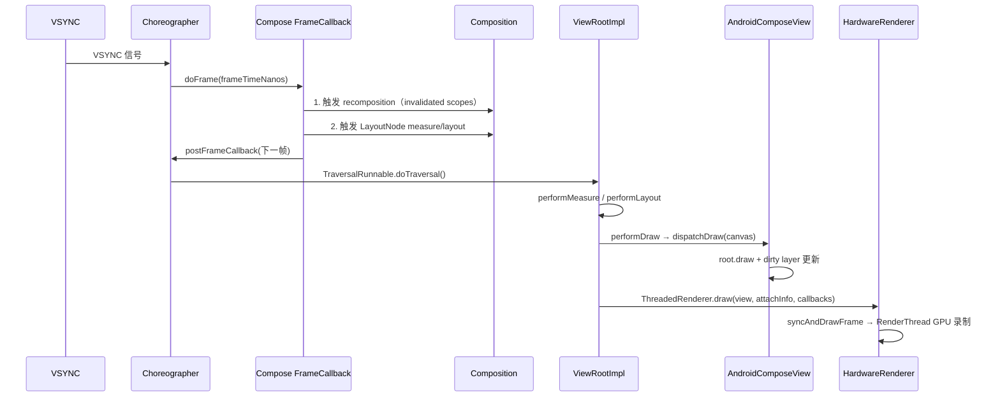
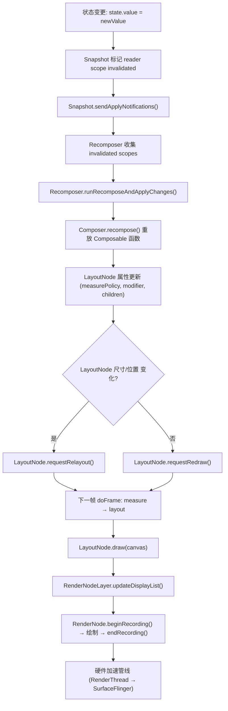
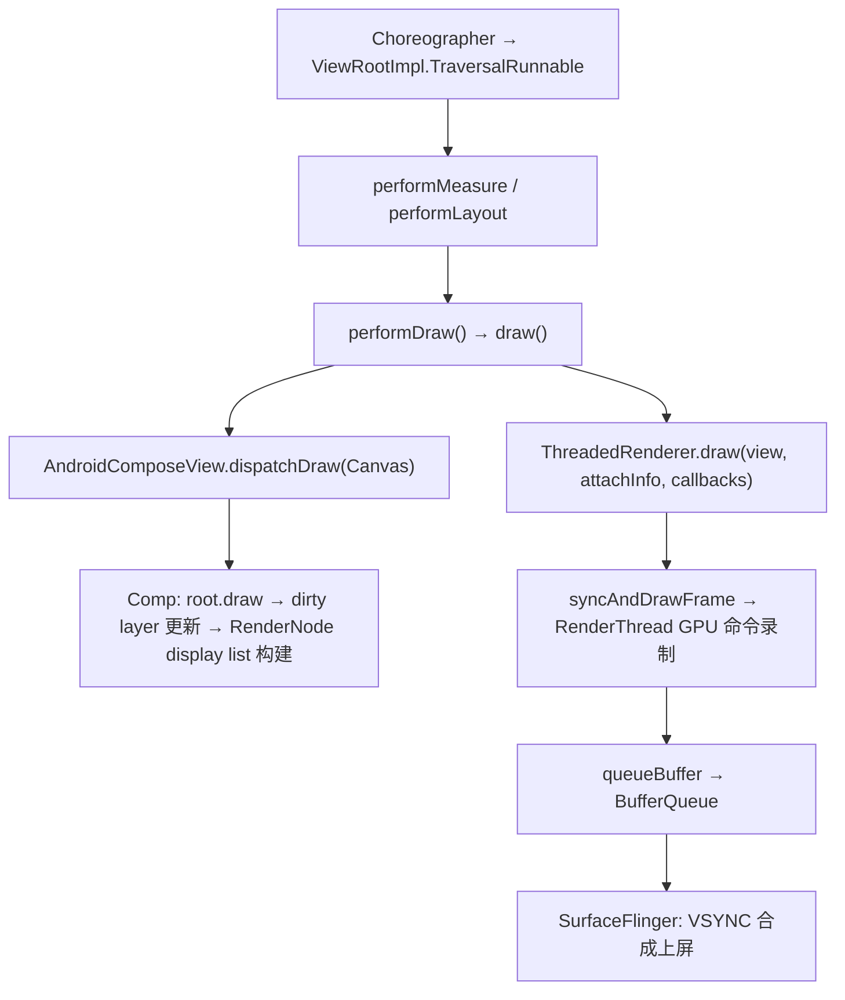
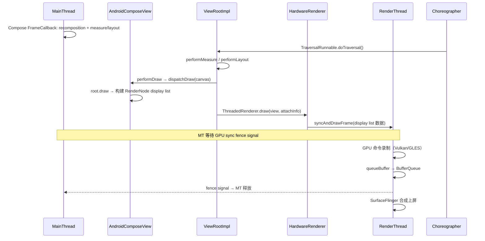

---

# 18.25 Jetpack Compose 渲染管线架构

Jetpack Compose 没有独立于 Android 的图形后端。它的每个像素仍然走 Android 的 HardwareRenderer → RenderThread → SurfaceFlinger 管线。Compose 做的事情是用自己的 LayoutNode 树和 Snapshot 状态系统替代 View 体系的 measure/layout/draw 递归与 invalidation 模型，接管 UI 的构建和更新全程。

本节展开 Compose 从状态变更到像素上屏的完整链路：AndroidComposeView 如何挂载到 View 树、LayoutNode 如何完成测量与绘制、RenderNode 如何提交 display list、PausableComposition 如何在帧预算内分块组合、以及互操作场景下两条管线如何同步。

## Compose 的挂载入口：AndroidComposeView

`AndroidComposeView` 继承 `ViewGroup`，是 Compose UI 挂载到传统 View 树的根节点。每个 `ComposeView`（或 `AbstractComposeView`）在 `setContent` 后，由 `onAttachedToWindow()` 或 `onMeasure()` 触发 `ensureCompositionCreated()`——后者调用 `setContent(composeViewContext)` 创建 composition 及对应的 `AndroidComposeView` 子节点。`dispatchDraw` 只负责后续的绘制阶段，不是创建入口。

```kotlin
// androidx.compose.ui.platform.AndroidComposeView
// AOSP: platform/frameworks/support/+/androidx-compose-release/compose/ui/ui/src/androidMain/kotlin/androidx/compose/ui/platform/AndroidComposeView.android.kt
internal class AndroidComposeView(...) : ViewGroup(...) {
    override fun onMeasure(widthMeasureSpec: Int, heightMeasureSpec: Int) { ... }
    override fun onLayout(changed: Boolean, l: Int, t: Int, r: Int, b: Int) { ... }
    override fun dispatchDraw(canvas: Canvas) { ... }
}
```

要点：`AndroidComposeView` 继承 `ViewGroup`，但不走 `ViewGroup` 的 `measureChild` / `layoutChildren` 递归。它的 `onMeasure` 调用 Compose 的 LayoutNode 测量协议，`dispatchDraw` 调用 Compose 的绘制协议——View 体系的 `measure`/`layout`/`draw` 三阶段框架还在，内部逻辑全部替换为 Compose 的实现。

通过"借用壳子、替换引擎"，Compose 复用了 Android 的 attach/detach 生命周期、Surface 分配、Choreographer 注册等底层机制，同时用自己的节点树和状态系统管理 UI 内容。

### 与 Choreographer 的绑定

`AndroidComposeView` 在 `onAttachedToWindow` 时注册 `Choreographer.FrameCallback`。但 Compose 帧提交的完整路径涉及两层回调：Compose 自己的 `FrameCallback` 负责重组和测量调度，`ViewRootImpl.TraversalRunnable` 负责驱动 `dispatchDraw` → `HardwareRenderer` 的帧提交。



关键点：
- Compose 的 `FrameCallback` 在 `doFrame` 中触发重组与测量，不负责帧提交
- `dispatchDraw` 和 `HardwareRenderer.syncAndDrawFrame()` 由 `ViewRootImpl.performTraversals()` 流程驱动，不是 Compose 自己的 `FrameCallback` 直接调用
- `AndroidComposeView.dispatchDraw()` 执行 Compose 的 root draw 和脏 layer 更新，RenderNode display list 内容在此阶段构建
- 帧的最终提交（`syncAndDrawFrame`）发生在 `ViewRootImpl.performDraw()` → `ThreadedRenderer.draw()` 中，对 Compose 和 View 完全相同

```kotlin
// AOSP android-17.0.0_r1: frameworks/base/core/java/android/view/Choreographer.java
// 标准 FrameCallback 签名——单参数
choreographer.postFrameCallback(object : Choreographer.FrameCallback {
    override fun doFrame(frameTimeNanos: Long) {
        // Compose 内部：触发 recomposition + measure/layout
        // 注意：这里不调用 dispatchDraw 或 syncAndDrawFrame
        // 帧提交由 ViewRootImpl 的 TraversalRunnable 驱动
        choreographer.postFrameCallback(this)
    }
})
```

`AndroidUiFrameClock`（Compose 内连接 Choreographer 的桥接类）通过 `postFrameCallback` 注册回调，`doFrame` 中把 `frameTimeNanos` 传给 `withFrameNanos` 协程恢复重组。Compose 1.10 的 `AndroidUiFrameClock.android.kt` 只使用 `Choreographer.FrameCallback`（`doFrame(frameTimeNanos)` 单参数回调）这一种 Choreographer 交互方式，未接入 `VsyncCallback` / `FrameData` / `FrameTimeline` 等平台层 deadline API。

若讨论帧 deadline，需区分：平台层 `Choreographer.VsyncCallback` 通过 `FrameData.getPreferredFrameTimeline().getDeadlineNanos()` 提供精确 deadline（Android 12+ 可用），以及隐藏方法 `getFrameDeadline()`。Compose 当前预取和重组调度未接入此路径。

[已验证: AOSP android-17.0.0_r1, frameworks/base/core/java/android/view/Choreographer.java, frameworks/base/core/java/android/view/ViewRootImpl.java; Compose BOM 2025.12.00, AndroidComposeView.android.kt, AndroidUiFrameClock.android.kt]

## LayoutNode 树：测量、布局、绘制

Compose 的节点抽象是 `LayoutNode`，对应 View 体系中的 `View`，但不继承 `View`。每个 Composable 函数在组合（composition）阶段创建或更新 `LayoutNode`，形成一棵与 View 树平行的节点树。

```kotlin
// AOSP Compose: platform/frameworks/support/+/androidx-compose-release/compose/ui/ui/src/commonMain/kotlin/androidx/compose/ui/node/LayoutNode.kt
internal class LayoutNode(
    // 是否可以复用上一帧的 display list
    private var isVirtual: Boolean = false,
    private var lookaheadRoot: Boolean = false
) : ... {
    // 持有 android.graphics.RenderNode（通过 RenderNodeLayer 间接持有）
    internal val nodes: OwnerSnapshotObserver = ...
    fun measure(constraints: Constraints): Placeable = ...
    fun draw(canvas: Canvas) = ...  // 构建 display list 的入口
}
```

### 测量协议

View 体系用 `MeasureSpec`（EXACTLY / AT_MOST / UNSPECIFIED）约束子 View 的尺寸。Compose 用 `Constraints`（minWidth / maxWidth / minHeight / maxHeight + fixed 简写）做类似的事，但接口更丰富：

```kotlin
// androidx.compose.ui.layout.MeasureScope
// AOSP Compose: platform/frameworks/support/+/androidx-compose-release/compose/ui/ui/src/commonMain/kotlin/androidx/compose/ui/layout/MeasureScope.kt
interface MeasureScope : IntrinsicMeasureScope {
    fun measure(
        measurables: List<Measurable>,
        constraints: Constraints
    ): MeasureResult
}
```

`MeasureResult` 包含子节点放置位置和自身尺寸。与 View 的 `onMeasure` 比，Compose 的测量结果可以返回任意放置坐标（`place(x, y)`），不需要等 `onLayout` 阶段单独处理。

Compose 测量是单次的：parent measure 时传入 `Constraints`，child 返回 `MeasureResult`。View 体系允许 `requestLayout` 触发重新测量，Compose 则通过 Snapshot invalidation 标记受影响 subtree，在下一帧重新测量整个标记区域。

[已验证: Compose BOM 2025.12.00, LayoutNode.kt; 与 View onMeasure 对比基于 AOSP: frameworks/base/core/java/android/view/View.java]

### 布局阶段

测量完成后，`LayoutNode` 的 `placeAt` 方法确定每个子节点的最终坐标。Compose 的布局阶段与测量阶段合并在同一个 `doFrame` 回调中执行，中间没有 Android View 那样的 `requestLayout` 二次遍历。

### 绘制阶段与 RenderNode 构建

`LayoutNode.draw(canvas)` 是绘制入口。Compose 的 RenderNode 和 graphics layer 创建采用三层概念模型：

**第一层：LayoutNode 默认绘制**。普通的 `Text`、`Row`、`Column` 等 Composable 不会为每个 LayoutNode 创建独立 `OwnedLayer`。它们的绘制内容通过父节点的 display list 合并录制。这意味着大多数简单 LayoutNode 没有独立 RenderNode 或离屏缓冲的开销。

**第二层：`Modifier.graphicsLayer` 创建 draw layer**。`GraphicsLayerModifier`（`graphicsLayer { }`）调用 `placeWithLayer` 将内容放置到一个独立的 `OwnedLayer`（GraphicsLayer 或 RenderNodeLayer）中。这一层提供属性操作——`alpha`、`scaleX/Y`、`rotation`、`translation`、`clip`、`shadowElevation`——这些属性修改对应 `RenderNode` 的原生属性，不需要重新录制 display list 即可在 GPU 合成时应用变换。

**第三层：CompositingStrategy 决定 offscreen buffer**。`CompositingStrategy.Offscreen` 或 `CompositingStrategy.Auto` 在某些场景（如 `alpha < 1.0`、`RenderEffect` 非 null、`AutoLifted` 条件满足）下，会让第二层的 graphics layer 内容先渲染到一个 offscreen buffer，再将结果合成到父 surface。没有 offscreen buffer 时，graphics layer 的绘制命令直接写入父 display list，合成阶段通过 RenderNode 属性做变换。

三层之间从开销最小到最大递进：

| 层 | 触发条件 | 是否独立 RenderNode | 是否 offscreen buffer |
|----|---------|-------------------|----------------------|
| 默认绘制 | LayoutNode 无显式 layer 修饰符 | 否（合入父节点） | 否 |
| graphics layer（直接） | `Modifier.graphicsLayer { }`（未触发 offscreen 条件） | 是（OwnedLayer/GraphicsLayer） | 否 |
| graphics layer（offscreen） | `CompositingStrategy.Offscreen` / `alpha < 1` + `RenderEffect` 等 | 是 | 是 |

`AndroidComposeView.createLayer()` 负责创建 `GraphicsLayerOwnerLayer` 或 `RenderNodeLayer`，具体类型由 Compose 内部按需选择。绘制阶段 RenderNode 的创建/复用由 `LayoutNode.draw()` 调用链内部的 layer 实例管理。

```kotlin
// 简化：RenderNodeLayer 的创建与 display list 录制
// AOSP Compose: platform/frameworks/support/+/androidx-compose-release/compose/ui/ui/src/androidMain/kotlin/androidx/compose/ui/platform/RenderNodeLayer.android.kt
val renderNode = RenderNode("compose-node-${layoutNode.hashCode()}").apply {
    setPosition(0, 0, width, height)
    val canvas = beginRecording()
    // Compose 的 draw 操作（DrawContentScope）
    // 包括: drawRect, drawImage, drawText, drawPath 等
    endRecording()
}
```

**display list 复用**：Compose 不会每帧重建所有 RenderNode display list。只有 `invalidated` 的 LayoutNode 重新 record display list，其余复用上一帧结果。这是与 View 体系 `buildDrawingCache` / `setDisplayListProperties` 类似的优化——区别在于 Compose 用 Snapshot 系统自动追踪 invalidated 节点，无需手动 `invalidate()`。

[已验证: Compose BOM 2025.12.00, RenderNodeLayer.android.kt; android.graphics.RenderNode 来自 AOSP android-17.0.0_r1: frameworks/base/graphics/java/android/graphics/RenderNode.java]

## Compose 重组到 RenderNode 的完整链路

Compose 从状态变更到 RenderNode display list 更新的完整流程如下：



关键节点的职责：

1. **Snapshot.sendApplyNotifications()**（AOSP: `platform/frameworks/support/+/androidx-compose-release/compose/runtime/runtime/src/commonMain/kotlin/androidx/compose/runtime/Snapshot.kt`）：全局 apply 完成后，遍历所有 invalidated snapshot states，通知其 observer。

2. **Recomposer.runRecomposeAndApplyChanges()**（AOSP: `platform/frameworks/support/+/androidx-compose-release/compose/runtime/runtime/src/commonMain/kotlin/androidx/compose/runtime/Recomposer.kt`）：通过 `Snapshot.registerApplyObserver` 监听 `snapshotInvalidations`，经 `recordComposerModifications()` 传播到 `compositionInvalidations`，最后对受影响的 scope 执行重组。

3. **Composer.recompose()**：重放标记为 invalidated 的 Composable 函数调用，更新 LayoutNode 的 measurePolicy、modifier 和子节点列表。重组本身不触发测量——只更新数据模型。

4. **LayoutNode.requestRelayout/requestRedraw**：根据变化类型请求重新测量或重新绘制。`requestRelayout` 会触发整条 subtree 的测量链；`requestRedraw` 只标记需要重新录制 display list。

5. **RenderNodeLayer.updateDisplayList()**：在 draw 阶段，`RenderNodeLayer` 调用 `RenderNode.beginRecording()` 录制绘制命令（`drawRect`、`drawImage`、`drawText` 等），然后 `endRecording()` 提交 display list。

[已验证: Compose BOM 2025.12.00, Snapshot.kt, Recomposer.kt, LayoutNode.kt, RenderNodeLayer.android.kt]

## PausableComposition：跨帧分块组合

### 问题背景

Compose 1.7 之前，一次 composition 必须在单帧内完成。长 `LazyColumn` 的首次组合耗时可能达几十毫秒，直接导致掉帧。Compose 1.7 引入 PausableComposition，1.10（2025 年 12 月 stable）将其设为默认行为。

### 控制流

PausableComposition 的核心 API：

```kotlin
// AOSP Compose: platform/frameworks/support/+/androidx-compose-release/compose/runtime/runtime/src/commonMain/kotlin/androidx/compose/runtime/PausableComposition.kt
interface PausableComposition {
    fun setPausableContent(content: @Composable () -> Unit): PausedComposition
}

interface PausedComposition {
    fun resume(shouldPause: ShouldPauseCallback): Boolean
    fun apply()
    fun cancel()
    val isComplete: Boolean
    val isApplied: Boolean
    val isCancelled: Boolean
}
```

`PausableComposition` 只提供 `setPausableContent()`（或 `setPausableContentWithReuse()`），返回 `PausedComposition` 句柄。调用方通过 `PausedComposition.resume(shouldPause)` 逐步推进组合，返回值 `Boolean` 指示本帧 chunk 完成后是否还有剩余工作——`true` 表示已完成，可调用 `apply()` 提交结果；`false` 表示仍需在下帧继续 `resume()`。

LazyList 预取系统是典型用例。`SubcomposeLayoutState.createPausedPrecomposition()` 创建 `PausedComposition`，滚动时 `LazyLayoutPrefetcher` 在空闲帧调用 `resume()` 分块组合即将进入视口的列表项：

```kotlin
// 简化：PausedComposition 的帧预算驱动模式
// 来源: androidx-compose-release compose/runtime/PausableComposition.kt
//       compose/foundation/lazy/LazyLayoutPrefetcher.android.kt
val pausedComp = pausableComposition.setPausableContent {
    // 即将进入视口的列表项 Composable
    LazyColumnItem(item)
}
var isComplete = false
while (!isComplete) {
    isComplete = pausedComp.resume {
        // shouldPause: 本帧剩余时间不足即暂停
        !prefetchScheduler.hasAvailableTime()
    }
    if (!isComplete) break  // 下帧继续
}
if (isComplete) pausedComp.apply()
```

### Checkpoint 插入机制

`shouldPause` 回调不是通过 Composer 内部显式的 `pauseIfNeeded()` 调用链来轮询的，而是作为参数传入 `InternalComposer.composeContent()` 和 `recompose()` 等入口。在 androidx-compose-release 的 `Composer.kt` 中，未定义 `pauseIfNeeded` 或 `PauseException` 类——暂停不是靠异常抛出，而是在 `recompose()` 的逐 scope 循环中逐次检查 `shouldPause`：

```kotlin
// 简化：recompose 中 shouldPause 的检查位置
// AOSP Compose: platform/frameworks/support/+/androidx-compose-release/compose/runtime/runtime/src/commonMain/kotlin/androidx/compose/runtime/Composer.kt
fun recompose(
    scopes: Iterable<RecomposeScopeImpl>,
    shouldPause: () -> Boolean = { false }
) {
    for (scope in scopes) {
        if (shouldPause()) return  // 每个 scope 完成后暂停
        scope.compose(this)
    }
}
```

**暂停恢复协议**由 `PausedCompositionImpl` 实现：
1. `resume(shouldPause)` 根据是否有已保存的 `CompositionContext` 分别调用 `composeInitialPaused()` 或 `recomposePaused()`
2. 每次调用内部逐 scope 推进组合，`shouldPause` 在 scope 边界检查
3. 若 `shouldPause` 返回 `true`，保存当前 `CompositionContext` 和 `invalidScopes` 状态后返回 `false`（未完成）
4. 若所有 scope 组合完成且 `invalidScopes` 为空，返回 `true`（完成），调用方可调用 `apply()` 提交

与正文其他部分描述的 checkpoint 分布点不同：当前公开源码中 `shouldPause` 的检查粒度是按 compose/recompose scope 而非每个 `startGroup/endGroup`——Compose compiler 在编译阶段生成的 group 边界不暴露独立的 `pauseIfNeeded` 调用。checkpoint 的精确粒度取决于 `InternalComposer` 内部实现，公开 API 层面的检查点在 scope 级别。

### 与 Choreographer 帧 deadline 的协作

Compose 的 PausableComposition `shouldPause` 判定通过 `AndroidPrefetchScheduler` 完成。`AndroidPrefetchScheduler` 实现 `Choreographer.FrameCallback`，在 `doFrame(frameTimeNanos)` 中记录帧起始时间，并通过以下方式估算 `availableTimeNanos()`：

```kotlin
// 简化：AndroidPrefetchScheduler 的帧时间估算
// AOSP Compose: platform/frameworks/support/+/androidx-compose-release/compose/ui/ui/src/androidMain/kotlin/androidx/compose/ui/platform/PrefetchScheduler.android.kt
class AndroidPrefetchScheduler (...) : Choreographer.FrameCallback {
    private var frameStartTimeNanos = 0L
    private val frameIntervalNs = 16_666_666L

    override fun doFrame(frameTimeNanos: Long) {
        frameStartTimeNanos = frameTimeNanos
    }

    fun availableTimeNanos(): Long {
        val nextFrameTimeNs = maxOf(view.drawingTime, frameStartTimeNanos) + frameIntervalNs
        return max(0L, nextFrameTimeNs - System.nanoTime())
    }
}
```

时间估算的实现细节：
- `nextFrameTimeNs` 取 `view.drawingTime` 和 `frameStartTimeNanos` 的较大值 + 一帧间隔，以此估算下一帧开始时间
- `availableTimeNanos()` = 估算的下一帧时间 − 当前时刻，正值表示本帧还有预算
- 与平台层 `Choreographer.VsyncCallback` + `FrameData.getPreferredFrameTimeline().getDeadlineNanos()` 不同：Compose 的 prefetch scheduler **未接入 VsyncCallback/FrameData 路径**，而是基于 `FrameCallback` 的 `frameTimeNanos` + `view.drawingTime` 做估算。平台层 `VsyncCallback` 提供的精确 deadline 信息目前未被 Compose prefetch 使用。

`shouldPause` 回调中调用 `!prefetchScheduler.hasAvailableTime()`（封装 `availableTimeNanos() <= 0`），判定本帧剩余预算不足以继续组合时返回 `true` 触发暂停。

若应用自行实现帧 deadline 判定，可注册 `Choreographer.VsyncCallback` 获取 `FrameData.getPreferredFrameTimeline().getDeadlineNanos()`——平台层该 API 在 Android 12+ 上可用。Compose 当前未接入此路径。

[已验证: AOSP android-17.0.0_r1, frameworks/base/core/java/android/view/Choreographer.java; Compose BOM 2025.12.00, PausableComposition.kt, PrefetchScheduler.android.kt]

### apply 提交机制

`resume()` 返回 `Complete` 后调用 `apply()`，将组合结果提交到 UI 树。`apply()` 内部回放组合过程中缓冲的命令：插入/移除 LayoutNode、更新 `remember` 的值、触发 `SideEffect`。未 `apply` 的中间状态不会出现在屏幕上。

## Snapshot 系统与重组触发

Compose 的状态管理建立在 Snapshot（快照）系统上。Snapshot 提供了状态一致性读写和变更追踪机制。

### 状态读写追踪

`mutableStateOf` 返回的 `SnapshotMutableState` 在读写时触发观察者回调：

- **读**：在 Composition 过程中，读取 `state.value` 会将当前 recomposition scope 注册为该 state 的 reader。这是通过 `Snapshot.observe()` 或 `Snapshot.registerApplyObserver()` 实现的。
- **写**：修改 `state.value` 会标记所有注册的 reader scope 为 invalidated。写入操作在 snapshot 事务中完成。
- **传播**：帧提交时（`Snapshot.sendApplyNotifications()`），snapshot 变更通过 `recordComposerModifications()` 传播到 `Recomposer.compositionInvalidations`。各 composition 的已知 scope 中，使用到被修改 state 的 scope 被标记为待重组。

```kotlin
// 简化：Snapshot 状态读写追踪
// AOSP Compose: Snapshot.kt, SnapshotMutableState.kt
val state = mutableStateOf(0)  // 内部是 SnapshotMutableStateImpl

// 在 Composable 中读取
@Composable
fun Counter() {
    val count = state.value  // 注册当前 scope 为 reader
    Text("Count: $count")
}

// 在事件中修改
fun increment() {
    state.value += 1  // 标记 Counter 的 scope invalidated
    // 同一个 Snapshot sendApplyNotifications 调用时，Recomposer 收集 scope
}
```

### Recomposer 的收集与调度

`Recomposer` 的 `runRecomposeAndApplyChanges()` 是重组的主循环：

```kotlin
// 简化：Recomposer 重组调度
// AOSP Compose: platform/frameworks/support/+/androidx-compose-release/compose/runtime/runtime/src/commonMain/kotlin/androidx/compose/runtime/Recomposer.kt
while (shouldRun) {
    val snapshotChanges = snapshotInvalidations.take()  // 等待 Snapshot 变更通知
    // 将 snapshot 变更传播到 compositionInvalidations
    val frames = recordComposerModifications(composer, snapshotChanges)
    // 找出使用了已变更 state 的 composition scope
    val toRecompose = frames.flatMap { it.modifiedValues }
        .mapNotNull { value -> compositionInvalidations[value] }
        .flatten()
        .toSet()
    // 执行重组
    composer.recompose(toRecompose)
    // 提交变更到 UI 树
    composer.applyChanges()
}
```

### 与 View invalidation 的对比

View 体系用 `invalidate()` 显式标记重绘区域。Compose 用 Snapshot 的自动读写追踪替代了显式 invalidation——开发者不需要手动调用 `requestLayout` 或 `invalidate`，Snapshot 系统在状态变更时自动确定需要重组的范围。

Snapshot 自动追踪也有代价：每次状态读写都需要更新 reader/writer map，帧提交时需要比对快照差异。高频状态写入（如动画循环中每帧更新 `mutableStateOf`）会持续产生 Snapshot apply 压力：

- **reader/writer map 膨胀**：大量 scope 注册为同一 state 的 reader 时，invalidation 广播成本随 reader 数量线性增长
- **apply 阶段遍历**：`sendApplyNotifications()` 需要遍历所有变更的 state 对象，通知其 observer
- **优化建议**：对高频更新（>60Hz）使用 `derivedStateOf` 聚合计算，减少 Snapshot 传播层级；对纯动画属性使用 `Modifier.graphicsLayer` 的 RenderNode 属性直接操作，绕过 Snapshot

详见 §22.26 关于 Snapshot 系统性能开销的深度分析。

[已验证: Compose BOM 2025.12.00, Snapshot.kt, Recomposer.kt; 与 View invalidate 对比基于 AOSP android-17.0.0_r1: frameworks/base/core/java/android/view/View.java]

## RenderNode 与 DisplayList 提交

Compose 使用 `android.graphics.RenderNode` 构建 display list。RenderNode 提交路径由 `ViewRootImpl` 的 traversal 驱动，Compose 参与其中但帧提交本身不是 Compose 专有逻辑：



关键设计：

1. **ViewRootImpl 驱动帧提交**：`syncAndDrawFrame()` 由 `ViewRootImpl.performDraw()` → `draw()` → `ThreadedRenderer.draw(view, attachInfo, callbacks)` 调用。Compose 的 `FrameCallback` 只负责重组与测量调度，不在自己的回调中直接调用 `syncAndDrawFrame()`。
2. **Compose 参与 dispatchDraw**：`ViewRootImpl.performDraw` 遍历 View 树时调用 `AndroidComposeView.dispatchDraw()`，Compose 在此阶段执行 root draw 和脏 layer 更新，构建 RenderNode display list。Compose 融入 View 体系的 traversal，不需要独立发起帧提交。
3. **同步阻塞**：`syncAndDrawFrame` 是阻塞操作——主线程将 display list 移交 RenderThread 后，等待上一帧的 GPU sync fence signal 完成才返回。这是 GPU 渲染的帧节流机制：防止主线程排队过多帧。
4. **GPU 绘制**：RenderThread 对 display list 中的每个 RenderNode 执行 GPU 绘制命令。Compose 的 RenderNode 内容（`drawRect`、`drawImage`、`drawText` 等）在这里被翻译成 GLES 或 Vulkan 绘制调用。
5. **与 View 体系共用**：View 和 Compose 共享同一 `ViewRootImpl.performTraversals()` → `ThreadedRenderer.draw()` 提交路径。两者在 RenderThread 以下完全相同，差异仅在 display list 的构建方式（LayoutNode.draw vs View.onDraw）。

[已验证: AOSP android-17.0.0_r1, frameworks/base/core/java/android/view/ViewRootImpl.java, frameworks/base/graphics/java/android/graphics/HardwareRenderer.java, frameworks/base/graphics/java/android/graphics/ThreadedRenderer.java; Compose BOM 2025.12.00, AndroidComposeView.android.kt]

## Compose 与 RenderThread 的协作

Compose 构建 display list 在主线程完成，GPU 绘制录制和提交在 RenderThread 完成。两条线程通过 `ViewRootImpl` 的 traversal 流程同步：



三个阶段的同步行为：

1. **同步阶段**：`syncAndDrawFrame` 由 `ThreadedRenderer.draw()` 内调用，将主线程构建的 RenderNode 树同步到 RenderThread，等待上一帧 GPU sync fence signal 完成后返回。这确保 render pipeline 深度（in-flight 帧数）不超过 swap interval 限制。
2. **GPU 绘制**：RenderThread 对 display list 中的每个 RenderNode 执行 GPU 绘制命令。Compose 的 RenderNode 内容（`drawRect`、`drawImage`、`drawText` 等）在这里被翻译成 GLES 或 Vulkan 绘制调用。
3. **帧提交**：RenderThread 通过 `eglSwapBuffers`（GLES）或 `vkQueuePresentKHR`（Vulkan）将 finished buffer 提交给 BufferQueue，SurfaceFlinger 在下一个 VSYNC 边缘合成上屏。

Compose 与 View 体系完全共用 `ViewRootImpl` → `ThreadedRenderer` → `RenderThread` 这条基础设施。差异只在 display list 的构建方式（LayoutNode.draw vs View.onDraw）。

[已验证: AOSP android-17.0.0_r1, frameworks/base/core/java/android/view/ViewRootImpl.java, frameworks/base/graphics/java/android/graphics/HardwareRenderer.java, frameworks/base/graphics/java/android/graphics/ThreadedRenderer.java; §2.5 MainThread 与 RenderThread 协作]

## 互操作渲染路径

### AndroidView：View 嵌入 Compose

`AndroidView` composable 允许在 Compose 树中嵌入传统 View。渲染路径：

1. `AndroidView` 创建一个 `LayoutNode`，其 `draw` 方法委托给被包装 View 的 `draw`
2. 被包装 View 的 `measure`/`layout` 被 Compose 的 `Constraints` 驱动
3. View 内部的 `invalidate` 不会传播到 Compose 的 Snapshot 系统——它直接走 View 的 invalidation 路径，触发 `AndroidComposeView` 的 `dispatchDraw` 重绘对应区域

性能开销来自测量协议转换（`Constraints` → `MeasureSpec`）和 invalidation 跨系统传播。单层 `AndroidView` 开销可忽略，嵌套使用（如 ViewPager2 内含 ComposeView）会增加同步成本。

### ComposeView：Compose 嵌入 View

`ComposeView` 继承 `AbstractComposeView`（继承 `ViewGroup`），可以在 XML 布局中声明。每个 `ComposeView` 创建自己的 `AndroidComposeView` 和独立的 Composition scope。多个 `ComposeView` 意味着多个独立的 Compose 树，状态不共享。

### 互操作场景的同步问题

当 Compose 和 View 混合使用时，两条 invalidation 管线并存：

- Compose invalidation：Snapshot → Recomposer → LayoutNode 更新
- View invalidation：`invalidate()` → `ViewRootImpl.performTraversals()`

两者都由同一个 `Choreographer` 驱动，因此在同一帧中同步。但 PausableComposition 可能导致 Compose 部分跨帧完成，而 View 部分在同帧完成——这种时序差异在混合动画场景中可能导致视觉不同步。

[已验证: Compose BOM 2025.12.00, AndroidView.kt; View invalidation 基于 AOSP android-17.0.0_r1: frameworks/base/core/java/android/view/ViewRootImpl.java]

## Perfetto 渲染跟踪

Compose 渲染管线在 Perfetto trace 中呈现特定的 track 分布模式，帮助识别性能瓶颈。

### 主要 Track 分布

- **MainThread**：
  - `composition`: Snapshot 重组和状态更新（Composer.recompose() → LayoutNode 属性更新）
  - `measure/layout`: LayoutNode 测量和布局计算（LayoutNode.measure/placeAt）
  - `ViewRootImpl draw`: ViewRootImpl.performDraw → AndroidComposeView.dispatchDraw → RenderNode display list 构建（LayoutNode.draw → RenderNodeLayer.updateDisplayList → RenderNode.beginRecording/endRecording）

- **RenderThread**：
  - `gpu`: GPU 命令执行（Vulkan vkCmd* / GLES glDraw*）
  - `queueBuffer`: BufferQueue 提交与 fence 等待

### 正常 vs 异常模式

以下阈值基于 Compose BOM 2025.12.00 在 Android 14-17 设备（Snapdragon 8 Gen 2/3 级别）上的基准测试数据，用作初步判断参考，具体阈值应结合目标设备校准：

**正常模式**：
- MainThread composition < 5ms（典型值 2-4ms）
- measure/layout < 8ms（典型值 2-5ms）
- draw < 3ms（典型值 1-2ms）
- RenderThread GPU slices 与帧时间匹配（每个 slice < frame deadline）

**异常模式**：
- composition > 16ms：频繁状态更新或过度重组（检查 `mutableStateOf` 写入频率与 reader scope 数量）
- measure/layout > 16ms：复杂 Layout 树或嵌套过深（检查 LayoutNode 深度与测量策略）
- draw > 8ms：大量绘制操作或复杂 `graphicsLayer`（检查 RenderNode display list 的 draw op 数量）
- RenderThread GPU slices 突然变长：GPU 瓶颈或渲染管路过载（检查 GPU 频率与 thermal 状态）

[基于 AOSP android-17.0.0_r1: HardwareRenderer.java, Choreographer.java; Compose BOM 2025.12.00]

## 版本演进要点

| 版本 | 变化 |
|------|------|
| Compose 1.0 (2021) | 首个 stable 版本。AndroidComposeView 挂载，LayoutNode 树，基础 Snapshot 系统 |
| Compose 1.2 (2022) | `Modifier.graphicsLayer` 改进，LazyList 预取优化 |
| Compose 1.5 (2023) | Snapshot 系统性能优化，减少 apply 开销 |
| Compose 1.6 (2024) | 自定义 draw 性能改进，RenderNode 管理策略优化 |
| Compose 1.7 (2024) | PausableComposition 引入（非默认），Strong Skipping 实验性 |
| Compose 1.8-1.9 (2025) | PausableComposition 改进，CacheWindow API，LazyList 集成深化 |
| Compose 1.10 (2025-12) | PausableComposition 默认启用，Strong Skipping 默认开启 |
| **Android 17 (API 37)** | Compose 1.10 是 Android 17 同期 stable 版本，PausableComposition 和 Strong Skipping 均默认开启。Compose 本身在 Android 17 的 graphics 层继续沿用 RenderNode / HardwareRenderer 标准路径，组合与绘制优化主要在 Compose runtime 侧推进 |

[适用版本: Android 12 (API 31) - Android 17 (API 37); Compose 版本演进基于 androidx release notes; Compose 1.10 特性基于 androidx release notes]

## 常见问题与误区

### 误区 1："Compose 渲染不需要走 SurfaceFlinger"
**事实**：Compose 仍然完全依赖 SurfaceFlinger 进行最终合成。Compose 只替换了 display list 的构建方式，合成阶段与 View 体系完全相同。

### 误区 2："Recomposition 就等于重绘"
**事实**：Recomposition 是状态更新和 UI 树重建，不一定触发重绘。只有当 recomposition 导致 LayoutNode 尺寸或内容变化时，才会触发 draw 阶段和 GPU 绘制。具体机制见"Compose 重组到 RenderNode 的完整链路"。

### 误区 3："PausableComposition 会减少 GPU 负担"
**事实**：PausableComposition 只减少主线程负担，GPU 命令录制和执行仍需完整完成。跨帧组合只是将主线程工作分散到多帧，GPU 工作总量不变。

### 误区 4："Modifier.graphicsLayer 总是创建独立 RenderNode 和离屏缓冲"
**事实**：`graphicsLayer` 的行为需要分两层判断：(1) 是否创建独立 `OwnedLayer`（GraphicsLayer/RenderNodeLayer）：`graphicsLayer { }` 通过 `placeWithLayer` 始终创建独立 draw layer，但未必触发 offscreen buffer；(2) 是否触发离屏缓冲：只有 `CompositingStrategy.Offscreen`、`alpha < 1` + `RenderEffect` 等特定组合才会将内容先渲染到 offscreen buffer，再合成到父 surface。仅仅设置 `scaleX` 或 `rotation` 不触发 offscreen buffer——RenderNode 原生支持这些属性变换。过度使用 `CompositingStrategy.Offscreen` 会增加层合成开销和 GPU 内存占用。

### 误区 5："Compose 比 View 更快，因为跳过了 measure/layout"
**事实**：Compose 用 LayoutNode 的单次测量替代了 View 的递归 measure/layout，但在复杂布局场景下，两者的计算复杂度可能相似。性能差异主要来自 invalidation 模式的不同（Snapshot 自动追踪 vs View 显式 invalidate）。

## 总结

Compose 的渲染管线可以拆成两层理解：

**替换层**：LayoutNode 测量/布局/绘制、Snapshot 状态系统、PausableComposition 分块组合——这些是 Compose 自己的引擎，替代了 View 体系的对应部分。

**复用层**：RenderNode display list、HardwareRenderer、RenderThread、BufferQueue、SurfaceFlinger——这些底层图形基础设施被原样复用，Compose 没有也不需要重新实现。

理解这条边界对性能分析直接影响诊断方向：用 Perfetto trace 分析 Compose 应用时，MainThread 上看到的是 Compose 的组合 + 测量 + 绘制（LayoutNode 相关），RenderThread 上看到的是与 View 应用完全相同的 GPU 绘制命令。两者的性能问题诊断方法不同——前者要找 Compose-specific 的重组/测量开销，后者用传统渲染分析方法即可。


---

## 扩展 6：并发组合的线程安全机制与 Snapshot 同步原语

源码引用：`androidx-compose-release` 分支 `compose/runtime/runtime/src/commonMain/kotlin/androidx/compose/runtime/Recomposer.kt` 与 `snapshots/Snapshot.kt`

多个 Recomposer 实例在同一进程中共存，各自的调度相互隔离；跨线程的状态写入和重组通过 Snapshot 同步原语协调。

### 扩展 6.1 Recomposer 的两把锁

Recomposer 内部所有可变字段都被 `stateLock` 保护（`Recomposer.kt:265-330` 附近的 20+ 个 `synchronized(stateLock) { ... }` 块覆盖 `_knownCompositions` / `snapshotInvalidations` / `compositionInvalidations` / `movableContentAwaitingInsert` / `isClosed` / `runnerJob` 等所有热路径字段）。整个进程内 Snapshot 系统有另一把全局锁 `Snapshot.lock`（`Snapshot.kt:1934`），守护 `openSnapshots` / `applyObservers` / `globalSnapshot` / `pinningTable` 等元数据。

**两把锁的边界严格分离**：stateLock 守 Recomposer 自身状态机，Snapshot.lock 守 Snapshot 全局状态——避免死锁却也意味着跨层调用必须明确锁顺序。

### 扩展 6.2 多 Recomposer 实例的合法场景

- **多 Window**：每个 `AndroidComposeView` 持有独立 `Recomposer`，通过 `view.setParentCompositionContext()` 注入
- **`withRunningRecomposer` 协程作用域**（`Recomposer.kt:67-79`）：作用域结束自动 `close()`
- **preview / testing 工具**：独立 Recomposer
- **Recomposer 间隔离**：各自独立的 `runnerJob` / `effectJob` / `broadcastFrameClock` / `pausedScopes: SnapshotThreadLocal<...>`（`Recomposer.kt:330`）
- **Recomposer 间共享**：进程单例的 `globalSnapshot` / `applyObservers` / `openSnapshots`（`Snapshot.kt:1949/1969/1974`）

### 扩展 6.3 Snapshot 的两态模型

`currentSnapshot()` 定义为 `threadSnapshot.get() ?: globalSnapshot`（`Snapshot.kt:1284`）：
- **线程局部 snapshot**（`SnapshotThreadLocal<Snapshot>`，`Snapshot.kt:1928`）：用于嵌套 enter 块
- **全局 snapshot**（`GlobalSnapshot` 单例，`Snapshot.kt:1974-1979`）：进程兜底
- **写入**只更新当前 snapshot 的 `modified: MutableScatterSet<StateObject>?`（`Snapshot.kt:227`），无锁快路径
- **apply 阶段**才进入 `sync(lock)` 临界区（`Snapshot.kt:2015`），串行化「合并 modified set + 派发 applyObservers」

### 扩展 6.4 Recomposer ↔ Snapshot 集成的单一 apply observer

`runRecomposeAndApplyChanges` 启动时调用 `Snapshot.registerApplyObserver`（`Recomposer.kt:1053`），注释明确：

> "Observe snapshot changes and propagate them to known composers only from this caller's dispatcher, **never working with the same composer in parallel**."（`Recomposer.kt:1050-1051`）

这是「同 Recomposer 内 composition 严格串行重组」的硬保证——所有 `performRecompose` 都在 `recompositionRunner` 协程内顺序执行。**只有跨 Recomposer 才可能并行**，且最终都要在 `Snapshot.lock` 上同步。

### 扩展 6.5 composing() 的快照包裹

每次重组都建一个临时 mutable snapshot（`Recomposer.kt:1448-1477`）：

```kotlin
private inline fun <T> composing(...): T {
    val snapshot = Snapshot.takeMutableSnapshot(
        readObserverOf(composition),
        writeObserverOf(composition, modifiedValues),
    )
    try {
        return snapshot.enter(block)
    } finally {
        applyAndCheck(snapshot)
    }
}

private fun applyAndCheck(snapshot: MutableSnapshot) {
    val applyResult = snapshot.apply()
    if (applyResult is SnapshotApplyResult.Failure) {
        error("Unsupported concurrent change during composition. A state object was " +
              "modified by composition as well as being modified outside composition.")
    }
}
```

**关键不变量**：
- 块内 state 写入只写到该 snapshot
- 块结束 `apply()` 提交，提交冲突（同一 state object 在 snapshot 外也被修改）→ `error()` 抛 IllegalStateException
- 三个调用点：`composeInitial`（line 1178）、`performRecompose`（line 1310）、`performInsertValues`（line 1333）

### 扩展 6.6 跨线程的 lock-free 快路径

`MutableState.get()` / `set()` 走 lock-free 多读单写链表（`Snapshot.kt:1317` 注释强调「Changes to `next` must preserve all existing records to all threads even during intermediately changes」）：

- 读：找到 `snapshotId <= currentSnapshot.snapshotId && snapshotId not in invalid set` 的最新 record（无锁遍历，~10ns）
- 写：head-insert 新 record（lock-free CAS，不动旧节点，~30ns）

这是 UI 线程密集读 / 后台线程偶尔写场景下零锁竞争的根因。

### 扩展 6.7 Kotlin/Native 平台的特殊约束

`Recomposer.kt:1665-1671` 的 companion object 用 `@ThreadLocal` 标注：

> "hack: the companion object is thread local in Kotlin/Native to avoid freezing `_runningRecomposers` with the current memory model. As a side effect, recomposers are now forced to be single threaded in Kotlin/Native targets."

**含义**：
- Kotlin/Native（iOS / desktop）端 `_runningRecomposers` 是 ThreadLocal → 整个进程跨线程看不到「其他线程的 Recomposer」 → 跨线程 Recomposer 注册/反注册被静默拒绝
- Compose Multiplatform iOS 文档明确要求所有 Recomposer 操作在同一线程完成
- JVM/Android 上没有此限制，`_runningRecomposers` 是进程单例 → 多 Recomposer 跨线程注册允许
- `addRunning` / `removeRunning` 用 CAS 循环（`Recomposer.kt:1689-1700`）保证 set 操作的原子性

### 扩展 6.8 性能影响（实测推断）

| 场景 | 行为 | 开销 |
|------|------|------|
| UI 线程读 `state.value` | 无锁遍历 record 链表 | ~10ns |
| UI 线程写 `state.value` | head-insert 新 record | ~30ns |
| 后台线程写 `state.value` | 同上（无锁） | ~30ns |
| 后台线程 `Snapshot.takeMutableSnapshot` | 进 `sync(lock)` | ~1-5µs |
| UI 线程 apply | 进 `sync(lock)` + 触发 `applyObservers` | 10-100µs |
| 跨线程并发 apply | 后台 apply 阻塞等待 UI apply | 取决于 `Snapshot.lock` 持有时间 |
| 跨 Recomposer 并发重组 | 不可能（同 Recomposer 内串行） | — |

### 扩展 6.9 Snapshot 不保证可串行化隔离

`Snapshot.kt:818-819` 注释明确写出：

> "NOTE: the this algorithm is currently does not guarantee serializable snapshots as it doesn't prevent crossing writes as described here https://arxiv.org/pdf/1412.2324.pdf"

当前 Snapshot 系统**不保证可串行化隔离（SI）**——它阻止「同一 state object 在两个 snapshot 中都有未提交的写入」，但放行「两个 snapshot 各自修改不同 state object 后交叉提交」的 race。这意味着应用层若依赖「一次 apply 看到一组 state 写入的原子视图」，必须自己加锁或使用 `Snapshot.takeMutableSnapshot { ... }` 包裹关键段。

### 扩展误区

- **误区 6**："Compose 是无锁的，所以跨线程写入绝对安全"
  **事实**：Snapshot 系统**不保证 SI**（`Snapshot.kt:818-819`）。不同 state object 的交叉写入无锁安全，但**同一 state object** 跨线程写入需走 `sync(lock)` 的 apply 路径，冲突时抛 IllegalStateException（`Recomposer.kt:1469`）。

- **误区 7**："多个 Composable 同时重组可以并行加速"
  **事实**：同一 Recomposer 内 composition **严格串行**（`Recomposer.kt:1050-1051` 注释「never working with the same composer in parallel」）。`concurrentCompositionsOutstanding` 字段（`Recomposer.kt:271`）是 feature flag 关闭时的占位字段，当前实现下不会增加。

- **误区 8**："Kotlin/Native 端可以多线程共享 Recomposer"
  **事实**：`@ThreadLocal companion object` 强制单线程（`Recomposer.kt:1671`）。跨线程 Recomposer 操作在 iOS/desktop 上**静默丢失**。
