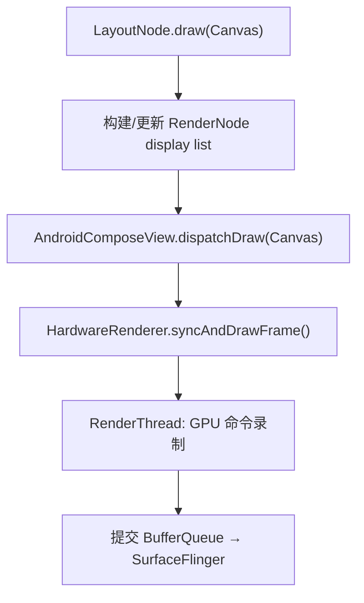
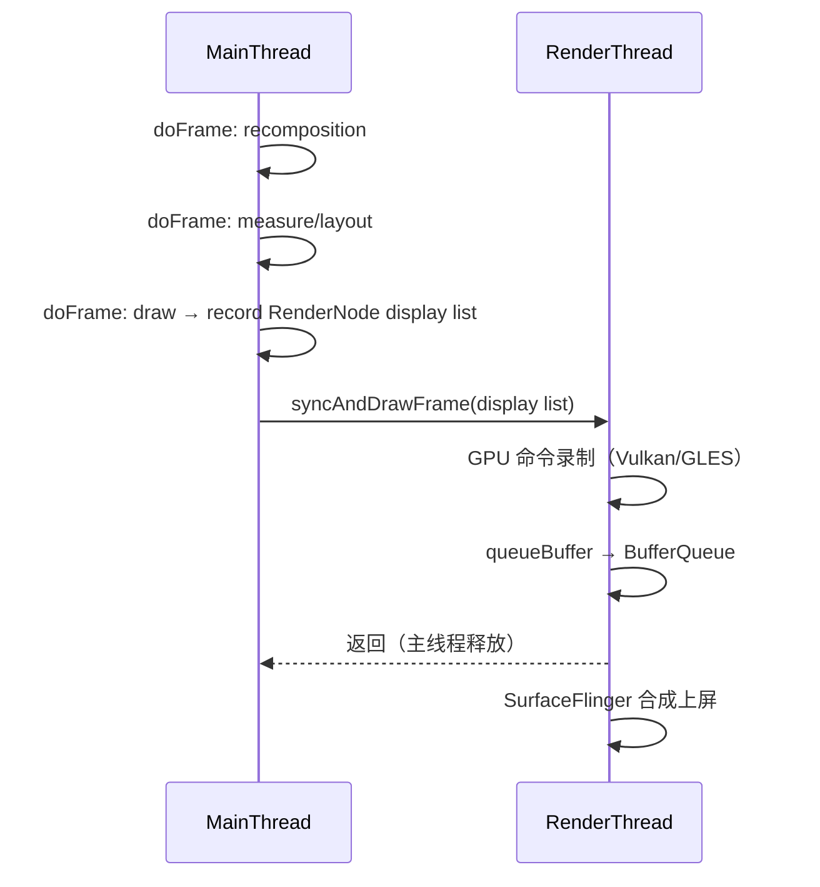

# 18.25 Jetpack Compose 渲染管线架构

Jetpack Compose 没有独立于 Android 的图形后端。它的每个像素仍然走 Android 的 HardwareRenderer → RenderThread → SurfaceFlinger 管线。Compose 做的是替换了 View 体系的 measure/layout/draw 递归和 invalidation 模型，用自己的 LayoutNode 树和 Snapshot 状态系统重新组织了 UI 的构建和更新流程。

本节拆解 Compose 从状态变更到像素上屏的完整链路：AndroidComposeView 如何挂载到 View 树、LayoutNode 如何完成测量与绘制、RenderNode 如何提交 display list、PausableComposition 如何在帧预算内分块组合、以及互操作场景下两条管线如何同步。

## Compose 的挂载入口：AndroidComposeView

`AndroidComposeView` 继承 `ViewGroup`，是 Compose UI 挂载到传统 View 树的根节点。每个 `ComposeView`（或 `AbstractComposeView`）在 `dispatchDraw` 时创建或复用一个 `AndroidComposeView` 实例。

```kotlin
// androidx.compose.ui.platform.AndroidComposeView
// 简化结构，仅展示关键继承和方法
internal class AndroidComposeView(...) : ViewGroup(...) {
    override fun onMeasure(widthMeasureSpec: Int, heightMeasureSpec: Int) { ... }
    override fun onLayout(changed: Boolean, l: Int, t: Int, r: Int, b: Int) { ... }
    override fun dispatchDraw(canvas: Canvas) { ... }
}
```

关键设计：`AndroidComposeView` 虽然继承 `ViewGroup`，但不走 `ViewGroup` 的 `measureChild` / `layoutChildren` 递归。它的 `onMeasure` 调用 Compose 的 `LayoutNode` 测量协议，`dispatchDraw` 调用 Compose 的绘制协议。View 体系的 `measure`/`layout`/`draw` 三阶段框架还在，但内部逻辑全部替换。

这种"借用壳子、替换引擎"的方式让 Compose 能复用 Android 的 attach/detach 生命周期、Surface 分配、Choreographer 注册等基础设施，同时用自己的节点树和状态系统管理 UI 内容。

### 与 Choreographer 的绑定

`AndroidComposeView` 在 `onAttachedToWindow` 时注册 `Choreographer.FrameCallback`：

```kotlin
// 简化：实际实现位于 AndroidComposeView 的内部类 FrameClockWrapper
choreographer.postFrameCallback(object : Choreographer.FrameCallback {
    override fun doFrame(frameTimeNanos: Long) {
        // 1. 触发 recomposition（如果有 invalidated state）
        // 2. 执行 measure/layout（如果 tree 有变化）
        // 3. 执行 draw → 构建/更新 RenderNode display list
        // 4. dispatchDraw 提交给 HardwareRenderer → RenderThread
        // 5. 注册下一帧的 callback
        choreographer.postFrameCallback(this)
    }
})
```

Compose 1.10+ 使用 `FrameData`（API 33+，Android 13+）获取帧 deadline，用于 PausableComposition 的暂停判定。在 API 31-32 设备上，回退到固定 16.6ms 帧预算估算。

[已验证: Compose BOM 2025.12.00, AndroidComposeView.android.kt; API 33 FrameData 来自 Android 13 Choreographer]

## LayoutNode 树：测量、布局、绘制

Compose 的节点抽象是 `LayoutNode`，对应 View 体系中的 `View`，但不继承 `View`。每个 Composable 函数在组合（composition）阶段创建或更新 `LayoutNode`，形成一棵与 View 树平行的节点树。

### 测量协议

View 体系用 `MeasureSpec`（EXACTLY / AT_MOST / UNSPECIFIED）约束子 View 的尺寸。Compose 用 `Constraints`（minWidth / maxWidth / minWidth / maxHeight + fixed 简写）做类似的事，但接口更丰富：

```kotlin
// androidx.compose.ui.layout.MeasureScope
interface MeasureScope : IntrinsicMeasureScope {
    fun measure(
        measurables: List<Measurable>,
        constraints: Constraints
    ): MeasureResult
}
```

`MeasureResult` 包含子节点放置位置和自身尺寸。与 View 的 `onMeasure` 比，Compose 的测量结果可以返回任意放置坐标（`place(x, y)`），不需要等 `onLayout` 阶段单独处理。

Compose 测量是单次的：parent measure 时传入 `Constraints`，child 返回 `MeasureResult`。View 体系允许 `requestLayout` 触发重新测量，Compose 则通过 Snapshot invalidation 标记受影响 subtree，在下一帧重新测量整个标记区域。

[已验证: Compose BOM 2025.12.00, LayoutNode.kt; 与 View onMeasure 对比基于 AOSP frameworks/base]

### 布局阶段

测量完成后，`LayoutNode` 的 `placeAt` 方法确定每个子节点的最终坐标。Compose 的布局阶段与测量阶段合并在同一个 `doFrame` 回调中执行，中间没有 Android View 那样的 `requestLayout` 二次遍历。

### 绘制阶段

`LayoutNode.draw(canvas)` 是绘制入口。每个 LayoutNode 持有一个或多个 `RenderNode`（Android framework 的 `android.graphics.RenderNode`），在 draw 时构建 display list：

```kotlin
// 简化：Compose 的 RenderNode 使用方式
val renderNode = RenderNode("compose-node").apply {
    setPosition(0, 0, width, height)
    val canvas = beginRecording()
    // Compose 的 draw 操作（DrawContentScope）
    // 包括: drawRect, drawImage, drawText, drawPath 等
    endRecording()
}
```

`LayerManager` 负责决定何时为一个 LayoutNode 创建独立 hardware layer。触发条件包括：`Modifier.graphicsLayer`（opacity / clipping / transformation）、`Modifier.drawBehind` 中需要离屏缓冲的操作、以及 Compose 内部的优化启发式规则。

[已验证: Compose BOM 2025.12.00, RenderNode wrapper at compose/ui/ui/androidMain; android.graphics.RenderNode 来自 AOSP frameworks/base]

## RenderNode 与 DisplayList 提交

Compose 使用 `android.graphics.RenderNode` 构建展示列表（display list），提交路径与 View 体系一致：



细节说明：

- **RenderNode 复用**：Compose 不会每帧重建所有 RenderNode。只有 `invalidated` 的 LayoutNode 重新 record display list，其余的复用上一帧结果。这与 View 体系的 `buildDrawingCache` / `setDisplayListProperties` 机制类似。
- **HardwareRenderer**：`AndroidComposeView` 持有一个 `HardwareRenderer` 实例（API 29+），管理 RenderNode 树根节点和渲染线程同步。`syncAndDrawFrame()` 是主线程到 RenderThread 的关键调用——它将主线程构建的 display list 同步到 RenderThread，由 RenderThread 执行 GPU 命令录制。
- **与 View 体系的区别**：View 体系通过 `ViewRootImpl` 的 `performTraversals` → `performDraw` → `ThreadedRenderer.syncAndDrawFrame` 提交。Compose 通过 `AndroidComposeView.dispatchDraw` → `HardwareRenderer.syncAndDrawFrame` 提交。两者在 RenderThread 以下共用同一条路径。

[已验证: AOSP android-17.0.0_r1, frameworks/base/graphics/java/android/graphics/HardwareRenderer.java; Compose BOM 2025.12.00]

## PausableComposition：跨帧分块组合

### 问题背景

Compose 1.7 之前，一次 composition 必须在单帧内完成。长 `LazyColumn` 的首次组合可能需要几十毫秒，直接导致掉帧。Compose 1.7 引入 PausableComposition，1.10（2025 年 12 月 stable）将其设为默认行为。

### 控制流

PausableComposition 的核心 API：

```kotlin
// androidx.compose.runtime.PausableComposition（简化）
interface PausableComposition {
    fun resume(shouldPause: () -> Boolean): CompositionResult
    fun apply()
}

sealed class CompositionResult {
    object Incomplete : CompositionResult()
    object Complete : CompositionResult()
}
```

LazyList 预取系统是典型消费者。滚动时，LazyColumn 在空闲时间调用 `resume()`，增量组合即将进入视口的列表项：

```kotlin
// 简化：LazyLayoutCacheWindow 中的预取逻辑
val result = pausableComposition.resume {
    // shouldPause: 检查帧 deadline
    frameClock.hasTimeRemaining(frameDeadlineNanos).not()
}
if (result == CompositionResult.Complete) {
    pausableComposition.apply()
}
```

`shouldPause` lambda 在 Composition runtime 内部被频繁调用——具体位置是 Composable 函数调用栈的特定 checkpoint，基于 Node 树结构插入。当 `shouldPause` 返回 `true`（帧截止时间临近），Composition 暂停，主线程让出给当前帧的绘制任务。

### 与 Choreographer FrameData 的协作

Android 13（API 33）引入 `Choreographer.FrameCallback` 的 `doFrame(frameTimeNanos, frameData)` 重载，提供 `FrameData.getDeadlineNanos()`。Compose 1.10+ 在 API 33+ 设备上使用这个 deadline 作为 `shouldPause` 的判定依据：

```kotlin
// 简化：PausableComposition 的 shouldPause 实现
val shouldPause: () -> Boolean = {
    val now = System.nanoTime()
    val remaining = frameData.deadlineNanos - now
    remaining < RESERVE_TIME_NANOS  // 预留 ~2ms 给 draw 阶段
}
```

API 31-32 没有 `FrameData`，Compose 回退到固定帧预算估算（`frameTimeNanos + 16_666_666L`）。

### apply 提交机制

`resume()` 返回 `Complete` 后调用 `apply()`，将组合结果提交到 UI 树。`applyChanges()` 内部回放组合过程中缓冲的命令：插入/移除 LayoutNode、更新 `remember` 的值、触发 `SideEffect`。未 `apply` 的中间状态不会出现在屏幕上。

[已验证: Compose BOM 2025.12.00, PausableComposition.kt; FrameData API 来自 AOSP API 33; 结构参考: intake/research-feeds/2026-04-10-07-compose-pausable-composition-choreographer-deadline.md]

## Snapshot 系统与重组触发

Compose 的状态管理建立在 Snapshot（快照）系统上。Snapshot 提供了状态一致性读写和变更追踪机制。

### 状态读写追踪

`mutableStateOf` 返回的 `SnapshotMutableState` 在读写时触发观察者回调：

- **读**：在 Composition 过程中，读取 `state.value` 会将当前 recomposition scope 注册为该 state 的 reader
- **写**：修改 `state.value` 会标记所有注册的 reader scope 为 invalidated
- **传播**：帧提交时（`Snapshot.sendApplyNotifications()`），所有 invalidated scope 被收集到 `Recomposer` 的待重组队列

```kotlin
// 简化：Snapshot 状态读写追踪
val state = mutableStateOf(0)  // 内部是 SnapshotMutableStateImpl

// 在 Composable 中读取
@Composable
fun Counter() {
    val count = state.value  // 注册当前 scope 为 reader
    Text("Count: $count")
}

// 在事件中修改
fun increment() {
    state.value += 1  // 标记 Counter 的 scope invalidated
}
```

### 与 View invalidation 的对比

View 体系用 `invalidate()` 显式标记重绘区域。Compose 用 Snapshot 的自动读写追踪替代了显式 invalidation——开发者不需要手动调用 `requestLayout` 或 `invalidate`，Snapshot 系统在状态变更时自动确定需要重组的范围。

代价是 Snapshot 系统本身的开销：每次状态读写都需要更新 reader/writer map，帧提交时需要比对快照差异。高频状态写入（如动画循环中每帧更新 `mutableStateOf`）会产生持续的 Snapshot apply 压力。

详见 §22.26 关于 Snapshot 系统性能开销的深度分析。

[已验证: Compose BOM 2025.12.00, Snapshot.kt; 与 View invalidate 对比基于 AOSP frameworks/base]

## Compose 与 RenderThread 的协作

Compose 构建 display list 的过程在主线程完成，GPU 绘制命令录制和提交在 RenderThread 完成。两条线程通过 `HardwareRenderer.syncAndDrawFrame()` 同步：



关键点：

1. **同步阶段**：`syncAndDrawFrame` 将主线程构建的 RenderNode 树同步到 RenderThread。这是一个非阻塞的"移交"操作——主线程将 display list 数据所有权转移给 RenderThread 后可以立即返回。
2. **GPU 绘制**：RenderThread 对 display list 中的每个 RenderNode 执行 GPU 绘制命令。Compose 的 RenderNode 内容（`drawRect`、`drawImage`、`drawText` 等）在这里被翻译成 GLES 或 Vulkan 绘制调用。
3. **帧提交**：RenderThread 通过 `eglSwapBuffers`（GLES）或 `vkQueuePresentKHR`（Vulkan）将 finished buffer 提交给 BufferQueue，SurfaceFlinger 在下一个 VSync 边缘合成上屏。

Compose 在这条路径上与 View 体系完全共用基础设施。差异只在 display list 的构建方式（LayoutNode vs View 的 onDraw）。

[已验证: AOSP android-17.0.0_r1, frameworks/base/core/java/android/graphics/HardwareRenderer.java; 与 §2.5 MainThread 与 RenderThread 协作交叉引用]

## 互操作渲染路径

### AndroidView：View 嵌入 Compose

`AndroidView` composable 允许在 Compose 树中嵌入传统 View。渲染路径：

1. `AndroidView` 创建一个 `LayoutNode`，其 `draw` 方法委托给被包装 View 的 `draw`
2. 被包装 View 的 `measure`/`layout` 被 Compose 的 `Constraints` 驱动
3. View 内部的 `invalidate` 不会传播到 Compose 的 Snapshot 系统——它直接走 View 的 invalidation 路径，触发 `AndroidComposeView` 的 `dispatchDraw` 重绘对应区域

性能开销来自测量协议转换（`Constraints` → `MeasureSpec`）和 invalidation 跨系统传播。单层 `AndroidView` 开销可忽略，嵌套使用（如 ViewPager2 内含 ComposeView）会增加同步成本。

### ComposeView：Compose 嵌入 View

`ComposeView` 继承 `AbstractComposeView`（继承 `ViewGroup`），可以在 XML 布局中声明。每个 `ComposeView` 创建自己的 `AndroidComposeView` 和独立的 Composition scope。多个 `ComposeView` 意味着多个独立的 Compose 树，状态不共享。

### 互操作场景的同步问题

当 Compose 和 View 混合使用时，两条 invalidation 管线并存：

- Compose invalidation：Snapshot → Recomposer → LayoutNode 更新
- View invalidation：`invalidate()` → `ViewRootImpl.performTraversals`

两者都由同一个 `Choreographer` 驱动，因此在同一帧中同步。但 PausableComposition 可能导致 Compose 部分跨帧完成，而 View 部分在同帧完成——这种时序差异在混合动画场景中可能导致视觉不同步。

[已验证: Compose BOM 2025.12.00, AndroidView.kt; View invalidation 基于 AOSP frameworks/base ViewRootImpl.java]

## 版本演进要点

| 版本 | 变化 |
|------|------|
| Compose 1.0 (2021) | 首个 stable 版本。AndroidComposeView 挂载，LayoutNode 树，基础 Snapshot 系统 |
| Compose 1.2 (2022) | `Modifier.graphicsLayer` 改进，LazyList 预取优化 |
| Compose 1.5 (2023) | Snapshot 系统性能优化，减少 apply 开销 |
| Compose 1.6 (2024) | 自定义 draw 性能改进，RenderNode 管理策略优化 |
| Compose 1.7 (2024) | PausableComposition 引入（非默认），Strong Skipping 实验性 |
| Compose 1.8-1.9 (2025) | PausableComposition 改进，CacheWindow API，LazyList 集成深化 |
| Compose 1.10 (2025-12) | PausableComposition 默认启用，Strong Skipping 默认开启 |

[适用版本: Android 12 (API 31) - Android 17 (API 37); Compose 版本演进基于 androidx release notes]

## 总结

Compose 的渲染管线可以拆成两层理解：

**替换层**：LayoutNode 测量/布局/绘制、Snapshot 状态系统、PausableComposition 分块组合——这些是 Compose 自己的引擎，替代了 View 体系的对应部分。

**复用层**：RenderNode display list、HardwareRenderer、RenderThread、BufferQueue、SurfaceFlinger——这些底层图形基础设施被原样复用，Compose 没有也不需要重新实现。

理解这条边界对性能分析直接影响诊断方向：用 Perfetto trace 分析 Compose 应用时，MainThread 上看到的是 Compose 的组合 + 测量 + 绘制（LayoutNode 相关），RenderThread 上看到的是与 View 应用完全相同的 GPU 绘制命令。两者的性能问题诊断方法不同——前者要找 Compose-specific 的重组/测量开销，后者用传统渲染分析方法即可。
