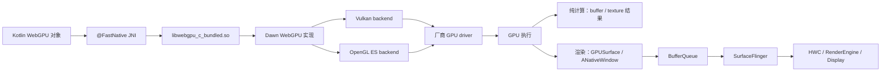
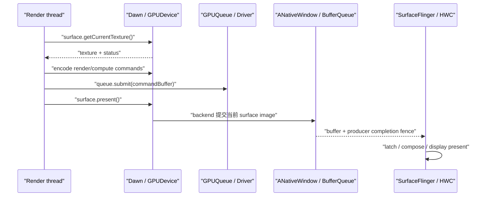

# 18.25 Android 17 Jetpack WebGPU 渲染与计算管线

Jetpack WebGPU 把 WebGPU 的对象模型带到 Kotlin：应用通过 `GPUInstance`、`GPUAdapter`、`GPUDevice`、`GPUQueue`、pipeline、bind group 和 command encoder 描述 GPU 工作，AndroidX 随 AAR 打包 Dawn 原生实现，再由 Dawn 选择 Vulkan 或 OpenGL ES 后端。

这条路径容易被三个相近名称带偏：

- Jetpack WebGPU 是应用依赖，版本随 APK/AAB 发布，不随 Android 系统 OTA 更新；
- WebView 网页中的 WebGPU 由 Chromium/WebView 运行时提供，不复用 Jetpack WebGPU 的 instance、device 或 native handle；
- Android 平台仍负责 `Surface`、`ANativeWindow`、BufferQueue、SurfaceFlinger、HWC 和内核同步，平台不会把普通 HWUI 内容自动改成 WebGPU。

复核时，官方 release notes 的最新公开版本仍是 `androidx.webgpu:webgpu:1.0.0-alpha05`，发布日期为 2026-04-22，最低系统版本为 Android 7.0 / API 24。它仍处于 alpha 阶段，适合评估、原型和能够接受 API 变更成本的产品；选型时不能只看 Android 版本，还要检查 adapter、feature、limit、surface capability 和目标设备上的实测结果。

## 复核基线

| 层级 | 基线 | 负责内容 |
| --- | --- | --- |
| Jetpack WebGPU | `1.0.0-alpha05` | Kotlin API、JNI handle 包装、helper、随包发布的 Dawn |
| Dawn | `9d41fdf36977cca92361c6ae2769129bbaaafd9b` | WebGPU 验证、资源与命令管理、后端选择、shader 翻译 |
| Android 平台 | Android 17 / API 37 / `android-17.0.0_r1` | `Surface`、`ANativeWindow`、BufferQueue、SurfaceFlinger、HWC |
| Android 内核 | `android17-6.18-2026-06_r6` | CPU 调度、dma-buf、dma-fence 与 sync_file；厂商 GPU/display 调度由具体驱动实现 |

alpha05 的 AAR 在 `assets/dawn_build_metadata.json` 中记录上述 Dawn SHA。下载到的 AAR SHA-256 为 `f977680085599a1cdfd4f8c5b0289d1fda905e33bcf4f5238042849bee74d1c0`，包含四个 ABI 的 `libwebgpu_c_bundled.so`：解压后 arm64-v8a 约 5.8 MiB、armeabi-v7a 约 3.7 MiB、x86 约 6.5 MiB、x86_64 约 6.3 MiB。安装体积要以应用自己的 ABI 配置、压缩方式和 App Bundle 拆分结果为准，不能把四个解压尺寸直接当成单台设备的安装增量。

Maven 的 alpha05 source JAR 与 AndroidX 提交 `c48b772dd76241af6af60bee13d3cad0e4520306` 中的 `Functions.kt`、`GPURequestAdapterOptions.kt`、`helper/WebGpu.kt` 逐文件一致，因此用该提交固定 Kotlin 层行为，不用会继续变化的 `androidx-main` 分支充当版本锚点。

Android 17 不要求 Jetpack WebGPU 使用 Vulkan 1.4。官方入门文档给出的条件是“Vulkan 1.1+ 为首选后端”，Compatibility feature level 可覆盖 OpenGL ES 路径。Android 17 只是平台源码上限，不会抹平不同 GPU、驱动和 Dawn 后端之间的能力差异。

## 库架构与调用链

### Kotlin binding 不是系统 GPU 服务

下面的图把渲染与纯计算的分叉位置标出来。



纯计算任务不需要 `Surface`，执行到 GPU 资源和结果读回处即可。可见渲染需要额外创建 `GPUSurface`，后半段进入 Android 公共显示路径。Dawn 不会绕过 BufferQueue，也不会替代 SurfaceFlinger。

Kotlin API 的入口是 native bridge。下面的声明来自 alpha05 的 `Functions.kt`，用于确认库加载后的第一个对象如何创建。

```kotlin
public object GPU {
    @JvmOverloads
    @FastNative
    public external fun createInstance(descriptor: GPUInstanceDescriptor? = null): GPUInstance
}
```

alpha05 源码中，创建资源、编码命令、提交队列和查询状态等 native 方法都通过 `external` 进入 JNI，绝大多数桥接方法带 `@FastNative`；`close()` 等少数引用释放入口没有该注解。`@FastNative` 可以减少部分 JNI 过渡成本，但不能据此宣称调用成本“等同 NDK”，更不能忽略 Dawn 验证、对象包装、shader/pipeline 创建和驱动调用。

Kotlin 层还负责以下对象与适配逻辑：

- descriptor、状态对象和 `IntDef` 类型；
- `AutoCloseable` handle 包装；
- callback 到 `suspend` 的适配；
- `Surface` 到 `ANativeWindow` 指针的 helper；
- `createWebGpu()` 初始化 helper 和事件轮询。

库内 KDoc 明确提示部分文档由生成式工具生成，可能存在错误。遇到 KDoc、入门示例和接口行为不一致时，应以 alpha05 的公开 API、对应 Dawn SHA 和运行结果为准。

### 版本由应用控制

`System.loadLibrary("webgpu_c_bundled")` 加载的是应用包内 native library。升级 `androidx.webgpu` 会改变 Kotlin API 与 Dawn 二进制；系统 OTA 不会单独替换这份 `.so`。排查线上问题时至少记录：

- Android 版本和 build fingerprint；
- `androidx.webgpu` 版本；
- AAR 内的 Dawn SHA；
- `GPUAdapterInfo.backendType`、vendor/device 信息；
- adapter features、limits 和 surface capabilities；
- 应用是否请求了 Core/Compatibility 或指定 backend。

使用 `createWebGpu()` helper 时，helper 会先加载 native library。直接从 `GPU.createInstance()` 组织初始化时，调用方要在首次 WebGPU API 前执行 `initLibrary()` 或等价的 `System.loadLibrary("webgpu_c_bundled")`。

直接初始化时，不能照搬 helper 的资源创建代码后便忽略事件推进。alpha05 helper 在 adapter 和 device 创建完成后，才启动每 100 ms 调用一次 `instance.processEvents()` 的轮询任务；源码注释把它用于后续异步方法，因此该轮询任务并不负责前面的 `requestAdapter()` 和 `requestDevice()`。不使用 helper 时，应根据实际调用的异步 API、callback mode 和所绑定的 Dawn 版本安排事件推进，不能把 Kotlin `suspend` 包装器当作常驻事件循环。

只记录“Android 17 + 某 SoC”不足以复现问题。同一平台版本上的厂商驱动、系统镜像和应用内 Dawn 都可能不同。

## Feature level、backend、feature、limit 是四个维度

### Core 与 Compatibility 不等于 Vulkan 与 GLES

`GPURequestAdapterOptions` 有两个容易混用的字段：

- `featureLevel`：请求 WebGPU 能力档，默认 `FeatureLevel.Core`；
- `backendType`：请求 Dawn 原生后端，默认 `BackendType.Undefined`，由实现选择。

Core 表示现代 WebGPU 能力基线；Compatibility 允许实现面向 OpenGL ES 3.1、D3D11 等较老 API 提供较宽覆盖。Vulkan 与 OpenGLES 表示 Dawn 最终使用的 native backend。两组枚举描述的轴不同，因此不能写成“Core 就是 Vulkan、Compatibility 就是 GLES”。

Android 上常见组合会是 Core + Vulkan，扩大设备覆盖时可能请求 Compatibility 并命中 OpenGLES，但应用仍应读取 adapter 信息确认。下面的代码展示诊断时应保留的两个值。

```kotlin
val options = GPURequestAdapterOptions(
    featureLevel = FeatureLevel.Core,
    backendType = BackendType.Undefined,
)
val adapter = instance.requestAdapter(options)
val info = adapter.getInfo()

Log.i(
    "WebGPU",
    "backend=${BackendType.toString(info.backendType)}, " +
        "vendor=${info.vendor}, device=${info.device}"
)
```

`backendType` 是观测结果；不能靠 GPU 商品名或 Android 大版本推断。把 backend 记录进 benchmark 和错误报告，也比维护一张静态 SoC 白名单更可靠。

### 能力必须查询后再请求

feature level 也不是“所有高级能力”的总开关。alpha05 把 subgroup、timestamp query、shader f16、压缩纹理等能力定义为独立 `FeatureName`。正确流程是：

1. 读取 `adapter.getFeatures()` / `adapter.hasFeature()`；
2. 读取 `adapter.getLimits()`；
3. 只把 workload 必需能力写入 `GPUDeviceDescriptor.requiredFeatures` 和 `requiredLimits`；
4. 处理 `requestDevice()` 失败，选择降级 workload 或其他实现。

例如 subgroup 需要同时检查 `FeatureName.Subgroups` 和 adapter info 中的 `subgroupMinSize` / `subgroupMaxSize`。Compatibility 模式也不能概括成“不支持 storage texture”或“不支持 compute”；alpha05 的 `GPUCompatibilityModeLimits` 只补充 vertex/fragment stage 的四个 storage buffer/texture 上限，具体能力仍由 adapter feature 和 limit 决定。

`GPULimits.maxImmediateSize` 也不能直接改名为“Vulkan push constant 支持”。WebGPU API 的公开语义应按自身 feature/limit 解读，底层后端如何映射寄存器、uniform buffer 或 push constant 属于 Dawn 和驱动实现细节。

### Shader 路径不要写死

应用输入 WGSL，Dawn 负责验证、转换并创建后端 pipeline。Vulkan 后端通常生成适合 Vulkan 的 shader 模块，OpenGLES 后端生成适合 GLES 的 shader；中间表示、优化阶段和驱动编译方式会随 Dawn commit 与 backend 改变。若写死“WGSL → SPIR-V → GLSL ES 3.10”，很快会把实现细节误当成 API 合约。

对应用稳定的边界是：

- shader 源码使用 WGSL；
- pipeline 创建可能包含验证和编译成本；
- adapter/device 的 feature 与 limit 决定 WGSL 和资源能否使用；
- shader compilation info、error scope 与 uncaptured error callback 用于发现失败。

## 可见渲染：从 Compose Surface 到屏幕

### AndroidExternalSurface 提供独立 layer

官方示例使用 Compose `AndroidExternalSurface`。它的 Android 实现内部创建 `SurfaceView`，得到一块独立于宿主 App Window 的 `Surface` 和 window layer。默认 z-order 位于父窗口之后，SurfaceFlinger 可以把该 layer 与宿主 Compose layer 分别 latch、合成和 present。

WebGPU 绘制结果不会进入宿主 HWUI 的 RenderNode/display list，宿主 Compose 画布也不能像处理普通绘制节点那样对它应用任意裁剪、变换或 effect。需要 `Modifier.graphicsLayer {}` 一类视觉效果时，可以评估 `AndroidEmbeddedExternalSurface` 的 TextureView 路径，但要重新测量中间纹理、合成和延迟成本。

`AndroidExternalSurface` 走 SurfaceView 独立 layer，`AndroidEmbeddedExternalSurface` 则把 `SurfaceTexture` 作为 TextureView 内容嵌回宿主窗口。两者的 Producer、合成拓扑和性能证据不同，不能只按 Compose API 名称归为同一条路径。

`AndroidExternalSurface.onSurface`、`onChanged` 和 `onDestroyed` 的生命周期回调在主线程触发；拿到 `Surface` 后可以切到专用渲染线程。Surface 销毁回调到达后，渲染线程必须停止 acquire、encode、submit 和 present，不能继续持有一个已失效的窗口目标。

### Surface 进入 Dawn 的位置

`createWebGpu(surface)` 最终调用 `windowFromSurface(surface)`，把 Java `Surface` 转为 native window 指针，再用 `GPUSurfaceSourceAndroidNativeWindow` 创建 `GPUSurface`。此处的 `ANativeWindow` 是 Dawn 后端与 Android WSI/BufferQueue 的交界。

稳健的初始化顺序如下：

1. Surface 可用后创建 `GPUSurface`；
2. 请求 adapter 时把 `compatibleSurface` 传入选项；
3. 读取 `surface.getCapabilities(adapter)`；
4. 从 `formats`、`presentModes`、`alphaModes` 中选择受支持配置；
5. 创建 device 和长期复用的 shader module、pipeline、bind group；
6. 使用当前宽高调用 `surface.configure()`。

这套顺序针对手动初始化。alpha05 的 `createWebGpu(surface)` 虽然先创建 `GPUSurface`，随后却把调用方传入的 `GPURequestAdapterOptions` 原样交给 `requestAdapter()`，不会把新建 surface 自动写入 `compatibleSurface`。需要以目标 surface 参与 adapter 筛选时，应拆开 `initLibrary()`、`createInstance()`、`createSurface()`、`requestAdapter()` 和 `requestDevice()`，再把手动创建的 `GPUSurface` 放进 adapter options。

官方最小示例直接使用 `RGBA8Unorm`，便于演示；产品代码不应假设某个 format、present mode 或 alpha mode 在所有 adapter/surface 组合上都可用。

### 一帧的获取、编码、提交与呈现

下面的时序图用于区分 WebGPU 的 `present()` 与物理屏幕 present。



`surface.present()` 表示把当前 surface texture 交给后端呈现路径，不等于像素已出现在屏幕上。其后仍有 GPU 完成、BufferQueue、SurfaceFlinger latch、HWC/RenderEngine 合成和 display present。

每次 `getCurrentTexture()` 都要检查 `GPUSurfaceTexture.status`：

- `SuccessOptimal`：可正常编码和呈现；
- `SuccessSuboptimal`：本帧可用，但应准备按最新能力和尺寸重新配置；
- `Timeout`：跳过本次并控制重试节奏；
- `Outdated`：更新尺寸/配置后再取；
- `Lost`：重建与 Android `Surface` 关联的 `GPUSurface`；
- `Error`：检查是否尚未 configure、参数是否合法以及错误回调。

resize 时更新宽高并重新 `configure()`。Surface 销毁时，先让 render loop 停止，再 `unconfigure()`/`close()`；新 Surface 创建后重新建立与 native window 的关联。不要让旧 Surface 的 texture、view 或 command encoder 进入新 Surface 的帧。

### 独立 Surface 的 FrameTimeline 边界

普通 App Window 常有完整的 expected/actual FrameTimeline。`AndroidExternalSurface` 是独立 layer，WebGPU producer 是否为每个 buffer 传递标准 App FrameTimeline token 和 desired-present 信息，要看 Dawn backend、Android WSI 和版本实现。

trace 中缺少该独立 layer 的 expected slice，不代表没有显示。此时用 layer 名称、BufferQueue frame number、acquire fence、SurfaceFlinger latch、HWC composition 和 present fence 补齐；不能把宿主 Compose App Window 的 vsync token 直接套到 WebGPU layer。

## 纯计算管线

WebGPU compute 使用同一组 instance、adapter、device、queue、buffer、texture 和 bind group，不需要创建 `GPUSurface`。典型路径是：

1. 查询所需 feature/limit；
2. 创建 storage/uniform/input/output buffer；
3. 创建 WGSL shader module、pipeline layout 和 compute pipeline；
4. 写入或映射输入；
5. `beginComputePass()`、绑定 pipeline/bind group、`dispatchWorkgroups()`；
6. `finish()` 后交给 `queue.submit()`；
7. 用 `onSubmittedWorkDone()` 或 buffer map callback 等待需要读回的结果。

同一 device 上的 compute 与 render 可以共享 GPU buffer/texture，省去不必要的 CPU 往返。它们是否能在硬件上并行，取决于 Dawn 如何提交、后端 queue 拓扑、资源依赖、GPU 引擎和驱动调度；一个 `GPUDevice` 暴露的默认 `GPUQueue` 不能被描述成 Vulkan 多 queue 的直接替代。

### 计算 workload 的能力分层

按 feature level 或 SoC 名称预测模型能否运行不够严谨。计算任务至少检查：

- `maxStorageBuffersPerShaderStage`、`maxStorageBufferBindingSize`、`maxBufferSize`；
- workgroup storage、invocation、X/Y/Z size 与 dispatch dimension 上限；
- shader f16、subgroup、timestamp query 等可选 feature；
- buffer map、拷贝与 CPU readback 的数据量；
- Compatibility mode 的 vertex/fragment storage 附加限制。

需要很多 storage binding 时，可以减少同时绑定的资源、把小参数合并到结构化 buffer、拆分 dispatch，或为能力不足的设备准备 CPU/其他 GPU API 路径。每种改法都会改变中间 buffer 数量、内存带宽和 dispatch 次数，应由目标 workload 的测量决定。

### Device lost 与结果正确性

`GPUDeviceDescriptor` 要求调用方提供 device-lost 和 uncaptured-error callback 及各自的 `Executor`。device lost 后，原 device 创建的 queue、pipeline 和资源不能继续作为有效执行环境使用。恢复代码应能重新请求 adapter/device、重建资源，并从 CPU/磁盘/网络可恢复数据重新填充必要状态。

不能声称“低内存设备更频繁 device lost”，也不能把 device lost 全部归因于内存。驱动 reset、GPU hang、后端错误、显式 destroy 以及进程生命周期都可能影响结果。诊断时记录 reason、message、backend、设备构建和前后 trace。

需要校验数值结果的 compute 任务还要考虑浮点精度、workgroup 划分、越界保护和不同 backend 的 shader 编译差异。吞吐量达标不代表输出正确；为关键 kernel 保留小规模 CPU reference 和误差阈值测试。

## 线程、协程与事件轮询

### 协程不决定 GPU 命令在哪个线程

`GPUInstance.requestAdapter()`、`GPUAdapter.requestDevice()`、异步 pipeline 创建和 `GPUQueue.onSubmittedWorkDone()` 都提供 callback + `Executor` 版本。对应的 `suspend` wrapper 使用 direct executor，再通过 continuation 恢复挂起协程。

这说明协程只是异步 API 的 Kotlin 适配。它不能推出“WebGPU 默认在主线程提交”，也不能推出所有 handle 都有未公开的创建线程绑定。alpha05 的公开 Kotlin API 没有声明 `GPUQueue` 或 `GPUCommandEncoder` 必须回到创建线程；不能添加库没有承诺的亲和规则。

工程上仍建议给 WebGPU 建立单一 render/compute owner：

- 由专用线程串行修改 encoder、pass encoder 和 surface 状态；
- UI 线程只转交输入、尺寸和生命周期事件；
- callback executor 明确命名并控制负载；
- Surface 销毁时发停止信号，等待 owner 停止使用 surface；
- 需要跨线程共享数据时，用不可变快照、消息队列或明确同步。

这套约束来自应用架构，用来减少竞态和生命周期错误；它不冒充 WebGPU 规范中的强制线程模型。

### `createWebGpu()` helper 的 100 ms 主线程 poller

alpha05 的 `androidx.webgpu.helper.createWebGpu()` 为处理异步事件，在主线程 `Handler` 上每 100 ms 调用一次 `instance.processEvents()`。源码注释说明，这是等待 Dawn issue 修复前的临时轮询。

因此需要分清两件事：

- helper 的事件泵会周期性经过主线程；
- shader 编码、`queue.submit()` 和整个 render loop 不必放在主线程。

若 callback 很重，应把后续工作转交专用 executor。测量主线程时也要识别 `processEvents()` 的周期性任务，避免把它误认成 Compose 重组或 Choreographer 回调。

### handle 生命周期

大多数 WebGPU wrapper 实现 `AutoCloseable`，native handle 依赖显式 `close()` 降低引用计数。长期资源可在 renderer 生命周期内持有，临时 view、encoder、pass、command buffer 则应按 API 所有权和使用期及时释放。

alpha05 helper 的 `close()` 有一条值得留意的源码边界：`device.close()` 仍被注释，旁边记录了待修复 issue；helper 当前关闭 surface、instance、adapter，并停止事件 poller。应用不能由此推导“helper 会替所有子资源完成释放”，资源管理与版本升级测试仍要覆盖 native heap、GPU memory 和重复进入/退出页面的场景。

## 性能边界：只给可验证的判断

目前没有一组官方 Android benchmark 能证明 Jetpack WebGPU 固定达到 Vulkan 的某个百分比，也没有证据支持“Dawn 加载固定需要 50—100 ms”。设备、ABI、Dawn commit、backend、shader、pipeline 缓存、draw/dispatch 数量、分辨率和热状态都会改变结果。

### CPU 侧成本

WebGPU 相对直接使用 Vulkan，多了 Kotlin/JNI 调用、Dawn 对象与状态管理、WebGPU 验证及后端翻译。相对 GLES，它又可能通过更明确的 pipeline、bind group 和 command buffer 减少运行时隐式状态处理。谁更快不能靠 API 层级直接决定。

应优先检查这些可操作项：

- pipeline、shader module、bind group layout 和长期 bind group 是否复用；
- 是否每帧创建大量短命 Kotlin/native wrapper；
- 是否把可合并的 draw/dispatch 拆成很多细小 JNI 调用；
- `queue.writeBuffer()` / `writeTexture()` 的次数、大小与分配；
- pipeline 创建是否出现在首帧或动画关键路径；
- 是否每帧调用 `onSubmittedWorkDone()` 把异步 GPU 队列变成 CPU/GPU 串行；
- validation/error callback 是否持续报告问题。

`@FastNative` 只优化桥接的一部分。命令批量录制进 command buffer，复用 pipeline/bind group，减少无意义状态切换，通常比争论单次 JNI 纳秒数更有价值。

### GPU 侧成本

WebGPU 不会改变 shader 的算术量、采样数量、overdraw、render target 带宽和分辨率。Dawn 可能选择不同资源转换、barrier、render pass 或 shader 变换，驱动也可能对同一 WGSL 产生不同机器码。

渲染 workload 要看 vertex/fragment 时间、overdraw、attachment load/store、texture bandwidth 和 present 等待；计算 workload 要看 occupancy、workgroup size、访存合并、缓存、带宽和 CPU readback。遇到性能差异时，应对比同设备上的 backend、命令规模和 GPU counter，不能只按“WebGPU vs Vulkan”给出原因。

### 冷启动与持续运行

冷路径可能包含 native library 加载、instance/adapter/device 创建、shader/pipeline 编译和 Surface 配置。把每段加自定义 trace，才能知道某台设备慢在哪里。不要引用脱离设备与版本的固定毫秒数。

持续测试还要控制：

- 屏幕刷新率与分辨率；
- 前后台状态和 Surface 重建次数；
- CPU/GPU 频率、温度与功耗限制；
- pipeline warm-up 与磁盘/驱动缓存；
- Vulkan/Core、GLES/Compatibility 等实际组合；
- 相同输入、相同画质和相同同步点。

## 选型：按约束决定，不按宣传语决定

| 约束 | Jetpack WebGPU 的价值 | 需要提前验证或考虑的替代 |
| --- | --- | --- |
| Kotlin 中使用现代 GPU render/compute | API 比直接 Vulkan 更紧凑，WGSL 与 WebGPU 对象模型清晰 | alpha API 变更、Dawn 打包尺寸、目标设备覆盖 |
| Android 与 Web/桌面共享 shader 和算法结构 | WGSL 与 bind-group 思路可复用 | Kotlin 宿主代码不能原样跨平台；surface、输入、资源加载仍是平台代码 |
| 图像处理、可视化、仿真 | render 与 compute 可共享同一 device 资源 | 格式、storage、workgroup limit 和 readback 成本 |
| 低层平台扩展或外部内存互操作 | 标准 WebGPU 可减少厂商 API 依赖 | 若必须使用特定 Vulkan/Android extension，直接 Vulkan/NDK 更可控 |
| 大型游戏或既有引擎 | 可用于新 renderer 评估 | 成熟引擎、Vulkan、GLES 的工具、生态与生产经验可能更合适 |
| 端侧 ML 推理 | 自定义 GPU kernel 有发挥空间 | 优先比较 LiteRT、GPU/NPU delegate 与厂商运行时的算子覆盖、量化和运维成本；NNAPI 已在 Android 15 废弃，不宜作为 Android 17 新项目的默认方案 |
| WebView 网页内容 | 网页可按浏览器能力使用 `navigator.gpu` | 这是 Chromium/WebView 路径，不由 `androidx.webgpu` 依赖提供 |

“API 更少”不等于“代码量必然少一个数量级”，“Core 命中”也不等于“可以替代所有 Vulkan compute”。选型结论应附带 target-device coverage、正确性、稳定性、包体、功耗和持续性能数据。

## 调试与 trace

### 先把 WebGPU 层错误收干净

为 instance、surface、device、queue、buffer、texture、pipeline 和 pass 设置可读 label。对可能失败的创建/编码区域使用 `pushErrorScope()` / `popErrorScope()`，同时保留 uncaptured-error 与 device-lost callback。

下面的代码展示 validation scope 的边界；用途是把一段可疑创建逻辑的错误与其他异步错误分开。

```kotlin
device.pushErrorScope(ErrorFilter.Validation)
val pipeline = device.createComputePipeline(descriptor)

try {
    device.popErrorScope()
} catch (error: WebGpuRuntimeException) {
    Log.e("WebGPU", "compute pipeline validation failed", error)
}
```

alpha05 的 suspend `popErrorScope()` 在捕获到非 `NoError` 类型时以异常结束，所以调用方要处理异常；不能照搬其他语言 binding 的返回对象模型。

### Perfetto 看系统路径，应用 trace 补 WebGPU 语义

Perfetto 不保证自动显示每个 Kotlin WebGPU 调用、JNI 方法或 Vulkan/GLES API 名称。建议在应用中给这些区间加自定义 trace：

- library/instance/adapter/device 初始化；
- shader 与 pipeline 创建；
- acquire current texture；
- command encoding；
- queue submit；
- surface present；
- `onSubmittedWorkDone()` 与 buffer map 等待；
- Surface resize、destroy 和重建。

设备提供 GPU render-stage producer 时，可继续查看 hardware queue、submission、stage 和 GPU duration；提供 GPU counter 时，再观察 busy、频率、带宽与缓存。然后把 WebGPU layer 的 BufferQueue、SurfaceFlinger latch、composition 和 display present 对齐。

跨层判断可按下面的顺序进行：

| 现象 | 先查证据 | 不要直接归因 |
| --- | --- | --- |
| 首次显示慢 | `.so` 加载、adapter/device、shader/pipeline、Surface configure | 固定的 Dawn 启动耗时 |
| CPU render thread 忙 | JNI 次数、对象分配、encode slice、validation error | GPU 算力不足 |
| submit 后长时间无结果 | GPU stage、fence、readback/map wait、device lost | 协程调度 |
| WebGPU layer 晚 | acquire、submit、BufferQueue、SF latch、present | 宿主 Compose 重组 |
| Vulkan 与 GLES 差异大 | `backendType`、同画质命令、shader、driver counter | Core/Compatibility 名称 |
| 页面反复进入后内存增长 | handle close、helper 的 device close 缺口、Surface 重建、native/GPU memory | Kotlin GC 单一原因 |

### AGI、RenderDoc 与 backend

AGI、RenderDoc 或厂商 profiler 能否抓取，取决于实际 backend、设备驱动、应用是否 debuggable、图形层注入限制和工具版本。记录 `GPUAdapterInfo.backendType` 后再选择工具。Vulkan backend 不保证任意设备都能被某版工具成功抓帧，OpenGLES backend 也不能笼统写成“不支持”。

AGI 擅长分析 GPU command、pipeline、shader 和资源；Perfetto 擅长线程、BufferQueue、SurfaceFlinger、FrameTimeline 与显示时间。两者回答的问题不同。Vulkan 系统 trace 见 §18.9，GLES 路径见 §18.8，ANGLE 的 GLES→Vulkan 边界见 §18.11。

## Jetpack WebGPU 与 WebView WebGPU 的边界

Jetpack WebGPU 在应用进程中加载 AndroidX AAR 内的 Dawn。WebView 页面调用 Web API 时，由当前 Android System WebView/Chromium 构建、页面安全上下文、功能开关、设备能力和 blocklist 决定 `navigator.gpu` 是否可用；网页代码还可能经过 renderer/GPU process。

两条路径不能共享：

- `GPUInstance` / `GPUDevice`；
- native handle；
- command buffer；
- pipeline 缓存合约；
- Surface 生命周期；
- Dawn 版本假设。

应用同时包含 WebView 与 Jetpack WebGPU 时，要分别记录 AndroidX WebGPU 版本和 WebView package/version。网页端用 Web API feature detection，原生端用 adapter feature/limit/capability 查询，不能用一侧结果替另一侧背书。

## 常见误判

| 误判 | 修正 |
| --- | --- |
| Android 17 新设备必须 Vulkan 1.4，所以 WebGPU 一定走 Vulkan 1.4 | Jetpack 官方只把 Vulkan 1.1+ 列为首选；读取 backend 与 adapter 能力 |
| Core 就是 Vulkan，Compatibility 就是 GLES | feature level 与 backend 是两个字段 |
| Compatibility 不支持 compute、storage texture 或 subgroup | 分别查询 feature 与 limit；不能用一个 profile 名称代替能力表 |
| Kotlin API 全是空壳，行为全在 native | 主要 GPU 操作进 JNI，但 Kotlin 还有 descriptor、handle、callback/suspend 和 helper |
| `@FastNative` 让 JNI 与 NDK 调用等价 | 它只减少部分桥接成本，完整成本仍含 Dawn、验证和驱动 |
| 协程依赖说明 GPU 命令默认跑主线程 | coroutine 是 callback 适配；命令在哪个线程调用由应用决定 |
| `surface.present()` 返回即表示上屏 | 后面仍有 GPU 完成、BufferQueue、SF/HWC 和 display present |
| SurfaceView 上的 WebGPU 也属于宿主 HWUI 帧 | `AndroidExternalSurface` 使用独立 layer，producer 和 timeline 要分开看 |
| WebView 支持 WebGPU 就等于原生库可用 | 两者由不同依赖、进程和能力检测控制 |
| WebGPU 固定达到 Vulkan 90%—95% | 没有跨设备、跨 workload 的官方固定比例 |
| alpha05 的 Dawn commit 无法追踪 | AAR 的 `dawn_build_metadata.json` 给出精确 SHA |

## 源码与文档入口

- [Jetpack WebGPU release notes](https://developer.android.com/jetpack/androidx/releases/webgpu)：确认最新 artifact、alpha 状态、发布日期和版本变化。
- [WebGPU for Android overview](https://developer.android.com/develop/ui/views/graphics/webgpu) 与 [Getting started](https://developer.android.com/develop/ui/views/graphics/webgpu/getting-started)：确认 API 24、Vulkan 1.1+ 首选、Compatibility 请求、Compose Surface 和基础渲染流程。
- AndroidX alpha05 快照中的 [`Functions.kt`](https://android.googlesource.com/platform/frameworks/support/+/c48b772dd76241af6af60bee13d3cad0e4520306/webgpu/webgpu/src/main/java/androidx/webgpu/Functions.kt)、[`GPURequestAdapterOptions.kt`](https://android.googlesource.com/platform/frameworks/support/+/c48b772dd76241af6af60bee13d3cad0e4520306/webgpu/webgpu/src/main/java/androidx/webgpu/GPURequestAdapterOptions.kt)、[`GPUInstance.kt`](https://android.googlesource.com/platform/frameworks/support/+/c48b772dd76241af6af60bee13d3cad0e4520306/webgpu/webgpu/src/main/java/androidx/webgpu/GPUInstance.kt) 与 [`GPURequestCallback.kt`](https://android.googlesource.com/platform/frameworks/support/+/c48b772dd76241af6af60bee13d3cad0e4520306/webgpu/webgpu/src/main/java/androidx/webgpu/GPURequestCallback.kt)：核对 native 入口、adapter 选项、Executor 与 suspend wrapper。
- AndroidX alpha05 快照中的 [`GPUSurface.kt`](https://android.googlesource.com/platform/frameworks/support/+/c48b772dd76241af6af60bee13d3cad0e4520306/webgpu/webgpu/src/main/java/androidx/webgpu/GPUSurface.kt)、[`GPUSurfaceConfiguration.kt`](https://android.googlesource.com/platform/frameworks/support/+/c48b772dd76241af6af60bee13d3cad0e4520306/webgpu/webgpu/src/main/java/androidx/webgpu/GPUSurfaceConfiguration.kt) 与 [`SurfaceGetCurrentTextureStatus.kt`](https://android.googlesource.com/platform/frameworks/support/+/c48b772dd76241af6af60bee13d3cad0e4520306/webgpu/webgpu/src/main/java/androidx/webgpu/SurfaceGetCurrentTextureStatus.kt)：核对 configure、acquire status 与 present。
- AndroidX alpha05 快照中的 [`helper/WebGpu.kt`](https://android.googlesource.com/platform/frameworks/support/+/c48b772dd76241af6af60bee13d3cad0e4520306/webgpu/webgpu/src/main/java/androidx/webgpu/helper/WebGpu.kt) 与 [`helper/Util.kt`](https://android.googlesource.com/platform/frameworks/support/+/c48b772dd76241af6af60bee13d3cad0e4520306/webgpu/webgpu/src/main/java/androidx/webgpu/helper/Util.kt)：核对 native library 名称、Surface 转换、100 ms event poller 和 helper close 边界。
- [`AndroidExternalSurface.android.kt`](https://android.googlesource.com/platform/frameworks/support/+/c48b772dd76241af6af60bee13d3cad0e4520306/compose/foundation/foundation/src/androidMain/kotlin/androidx/compose/foundation/AndroidExternalSurface.android.kt)：核对 SurfaceView/TextureView 承载、独立 layer、主线程生命周期回调与跨线程渲染约束。
- [alpha05 AAR](https://dl.google.com/dl/android/maven2/androidx/webgpu/webgpu/1.0.0-alpha05/webgpu-1.0.0-alpha05.aar)、[source JAR](https://dl.google.com/dl/android/maven2/androidx/webgpu/webgpu/1.0.0-alpha05/webgpu-1.0.0-alpha05-sources.jar) 与 [对应 Dawn commit](https://dawn.googlesource.com/dawn/+/9d41fdf36977cca92361c6ae2769129bbaaafd9b/)：核对 minSdk、ABI 二进制、Kotlin 源码、`dawn_build_metadata.json` 和固定原生实现。
- Dawn 固定提交中的 [`Surface.cpp`](https://dawn.googlesource.com/dawn/+/9d41fdf36977cca92361c6ae2769129bbaaafd9b/src/dawn/native/Surface.cpp)、[`SwapChainVk.cpp`](https://dawn.googlesource.com/dawn/+/9d41fdf36977cca92361c6ae2769129bbaaafd9b/src/dawn/native/vulkan/SwapChainVk.cpp) 与 [`SwapChainEGL.cpp`](https://dawn.googlesource.com/dawn/+/9d41fdf36977cca92361c6ae2769129bbaaafd9b/src/dawn/native/opengl/SwapChainEGL.cpp)：核对 ANativeWindow、VkAndroidSurfaceKHR 与 EGL window surface 两条 WSI 路径。
- [W3C WebGPU Specification](https://www.w3.org/TR/webgpu/) 与 [WGSL Specification](https://www.w3.org/TR/WGSL/)：核对 API 与 shader 语言的标准语义。
- Android 17 的 [`native_window_jni.h`](https://android.googlesource.com/platform/frameworks/native/+/refs/tags/android-17.0.0_r1/include/android/native_window_jni.h)、[`Surface.cpp`](https://android.googlesource.com/platform/frameworks/native/+/refs/tags/android-17.0.0_r1/libs/gui/Surface.cpp)、[`BufferQueueProducer.cpp`](https://android.googlesource.com/platform/frameworks/native/+/refs/tags/android-17.0.0_r1/libs/gui/BufferQueueProducer.cpp) 与 [`SurfaceFlinger.cpp`](https://android.googlesource.com/platform/frameworks/native/+/refs/tags/android-17.0.0_r1/services/surfaceflinger/SurfaceFlinger.cpp)：核对 Java Surface、ANativeWindow、BufferQueue 与显示合成边界。
- kernel `android17-6.18-2026-06_r6` 的 [`dma-buf.c`](https://android.googlesource.com/kernel/common/+/refs/tags/android17-6.18-2026-06_r6/drivers/dma-buf/dma-buf.c)、[`dma-fence.c`](https://android.googlesource.com/kernel/common/+/refs/tags/android17-6.18-2026-06_r6/drivers/dma-buf/dma-fence.c) 与 [`sync_file.c`](https://android.googlesource.com/kernel/common/+/refs/tags/android17-6.18-2026-06_r6/drivers/dma-buf/sync_file.c)：核对共享 buffer 和 sync fence 的内核边界；Dawn 的 feature/profile 逻辑不在内核中。
- [Perfetto GPU data sources](https://perfetto.dev/docs/data-sources/gpu) 与 [FrameTimeline](https://perfetto.dev/docs/data-sources/frametimeline)：核对 GPU producer 能力、expected/actual frame 与系统显示观察口径。
- [NNAPI migration guide](https://developer.android.com/ndk/guides/neuralnetworks/migration-guide)：确认 NNAPI 自 Android 15 废弃，以及 Android 17 新项目不应把它当作默认 ML 路径。
