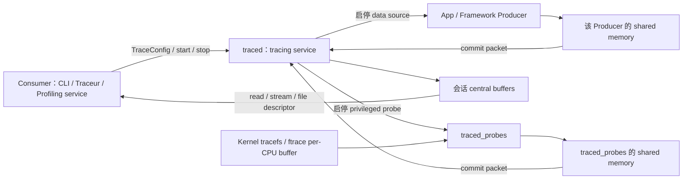

# 13.1 Perfetto 简介与演进

## 为什么要了解 Perfetto

日志和单次堆栈擅长记录局部状态，却很难回答跨线程、跨进程的时间关系。一次卡顿可能同时经过 App 主线程、RenderThread、GPU、SurfaceFlinger；一次 Binder 阻塞还要看调用方是否在运行、对端何时被唤醒、事务何时返回。只看其中一层，很容易把等待时间算到错误的模块上。

Perfetto 把所选 data source 的事件放进同一时间域，并提供时间线和 PerfettoSQL 两种观察方式。data source 是向 trace 写入某类数据的组件或能力。采集配置决定最终能看到什么：启用调度事件可以还原线程何时运行，启用 Binder、FrameTimeline、进程统计或堆 profiling 后，才能继续回答对应问题。空白轨道只说明当前 trace 没有这份证据，不能直接推断系统没有发生相应行为。

Android 的系统追踪主线已经从 Systrace 转到 Perfetto。旧的 ftrace/atrace 经验仍然有用，但采集配置、二进制格式、分析引擎和长时录制模型都需要按 Perfetto 重新理解。

## Perfetto 是什么

Perfetto 是 Google 开源的一套 tracing 基础设施，包括 SDK、守护进程、采集工具、Trace Processor 分析引擎和可视化界面。它覆盖 Android、Linux 和 Chrome，但各平台能采集的数据源不同。Android 9 已把 `traced` / `traced_probes` 放进系统镜像；Android 9 和 10 的非 Pixel 设备通常还要手动启用服务，Android 11 起大多数设备默认启用。

从数据流看，这套基础设施可以分为三个模块：

- **采集层**：按 `TraceConfig` 启动 data source，收集 ftrace、atrace、进程统计、功耗、堆 profiling 或 SDK 自定义事件。
- **分析层**：Trace Processor 解析并按时间排序不同格式的事件，把数据写入按列组织的内部存储，再通过 PerfettoSQL 提供查询接口。
- **可视化层**：Perfetto UI 在浏览器本地解析和展示 trace，默认不会上传文件。大型 trace 可能超过浏览器内存上限，此时可让本机原生 Trace Processor 作为解析后端。

采集端、分析端和 UI 可以独立升级。设备侧平台 Perfetto 负责产出 trace，主机上的 Trace Processor 和 UI 可以使用更新版本读取它。排查解析差异时，必须同时记录设备 build fingerprint、采集端版本和分析端版本。

## 复核基线

| 层级 | 锚点 | 分析边界 |
| --- | --- | --- |
| Android 平台 | Android 17 / API 37 / `android-17.0.0_r1` | 固定 `traced`、`traced_probes`、Perfetto CLI 与平台 data source |
| 平台内 Perfetto | `external/perfetto` 提交 `ece66975738007dd0978b911d8a2077e49b8f31e` | `CHANGELOG` 已包含 v54.0，并带有后续 `android.aflags` 变更；不能直接写成上游最新版本 |
| Profiling 模块 | `packages/modules/Profiling` 提交 `8b3abe8eebc0e97890977d9658038f4966aa7df6` | 固定 `ProfilingManager`、`ProfilingTrigger` 与 `com.android.profiling` APEX 边界 |
| Android 内核 | `android17-6.18-2026-06_r6` | 固定 common kernel 的 tracefs/ftrace 和通用调度 tracepoint；厂商事件及启用项以设备内核为准 |
| 主机分析工具 | 与 trace 一起记录实际版本 | Perfetto UI、`trace_processor_shell`、Python API 和 `traceconv` 可独立于系统镜像升级 |

这里不能只写“Android 17 + Perfetto”。同一份 Android 17 镜像内有固定的平台采集端，而浏览器 UI 和主机预编译工具仍在迭代；SQL 表、标准库模块和 UI 行为可能随分析端版本变化。

## 从 Systrace 到 Perfetto：为什么要换

Systrace 是 Android 4.1（2012 年）引入的 tracing 工具。它通过 Linux 内核的 ftrace 采集系统事件，通过 atrace 接收 Framework 和应用写入的区间标记，最终生成可在 Chrome 中查看的 HTML 报告。它长期是 Android 性能分析的常用工具。

它的限制主要集中在采集模型和分析工具。

**长时采集缺少完整的流式写盘模型。** ftrace 为每个 CPU 使用容量有限的 ring buffer（写满后循环复用空间的缓冲区）；事件产生速度超过读取速度时，旧数据会被覆盖。Perfetto 默认也把事件保存在会话的 central buffer 中，同样受容量约束。配置 `write_into_file`、`file_write_period_ms` 和 `max_file_size_bytes` 后，它可以周期性把 central buffer 写入文件。长 trace 仍要根据峰值事件速率计算 buffer，单纯延长录制时间无法避免丢包。

**数据源范围较窄。** Systrace 的 Android 工作流主要围绕 ftrace 和 atrace。Perfetto 除了接入这些旧数据，还能在设备支持时采集 heapprofd、ART heap graph、进程统计、功耗 rail、GPU 和 SDK Track Event 等数据源。

**缺少面向批处理的结构化分析接口。** 旧 HTML 查看器适合缩放和点选，复杂聚合通常还要自行解析文本。Trace Processor 把不同 trace 格式转换成统一表结构，同一条 PerfettoSQL 可以在 UI、命令行、Python API 和批处理流程中复用。

Perfetto 的 Producer（提供 data source 并产生事件的一方）先把序列化的 trace packet 写进与 tracing service 共享的临时 buffer，service 再把已提交的 packet 搬到会话的 central buffer。ftrace 还多一层内核 per-CPU buffer，由 `traced_probes` 周期读取。三层任一处都可能丢数据；分析前应查询用于记录解析和采集异常的 `stats` 表，检查其中 `severity = 'data_loss'` 且 `value != 0` 的记录。

下表总结了二者的关键差异：

| 维度 | Systrace | Perfetto |
| --- | --- | --- |
| 引入阶段 | Android 4.1（2012 年） | Android 9 基础服务进 system image，Android 10 完整可用，Android 11+ 大多数设备默认启用 |
| 采集模型 | ftrace/atrace 事件导出后生成 HTML 报告 | ftrace per-CPU buffer + Producer shared memory + service central buffer |
| 采集时长 | 受 ftrace buffer 与导出流程约束 | 默认仍受 central buffer 限制；可按周期写文件并设置文件上限 |
| 配置方式 | category + 命令行为主 | simple mode flags 或 normal mode `TraceConfig` |
| 数据源 | ftrace + atrace | ftrace + atrace + heap / log / process stats / power 等 |
| 分析方式 | HTML 报告，交互能力有限 | SQL 查询 + Web UI + 脚本 |
| UI 承载能力 | 旧 Catapult 查看器面向旧格式 | 浏览器有内存上限；大型 trace 可连接本机原生 Trace Processor |
| 跨平台 | 主要 Android | Android + Linux + Chrome |
| 当前定位 | 兼容旧流程 | Android tracing 主线平台 |

Perfetto UI 和 Trace Processor 可以读取 Systrace/ftrace 文本及旧 HTML 格式，旧文件仍可继续分析。反向转换时使用 `traceconv systrace`；转换只保留目标格式能表达的数据，不能把它当成无损往返。

## Perfetto 的架构

Perfetto 采用 service-based model。Producer 提供 data source 并写入 trace packet；Consumer 是发起和控制采集的一方，负责提交 `TraceConfig`、控制会话并读取结果；Android 上的 `traced` 是 tracing service，管理会话的 central buffer。

下面的图用于区分三层 buffer 和控制方向。配置经 `traced` 发给 Producer，trace packet 则沿相反方向进入 central buffer。



每个 Producer 通常只与 service 共享一块临时 shared memory（两个进程都能访问的内存区域），同一 Producer 内的多个 data source 共用它。central buffer 属于 tracing service，不会映射给其他 Producer。ftrace 事件还要先经过内核 per-CPU buffer，所以 ftrace、Producer shared memory 和 central buffer 要分别检查丢包。

### traced：核心守护进程

`traced` 是 Perfetto 的 tracing service。Android 17 的 `perfetto.rc` 让它以 `nobody` 用户运行，通过 consumer/producer UNIX socket 接收本机进程间的控制连接和 Producer 连接。它负责会话、data source 路由、central buffer 和结果读取。

它的工作可以分成三类：

- **管理采集会话**：接收 Consumer 发来的 `TraceConfig`，创建 buffer，并把各 data source 的配置路由给对应 Producer。
- **汇聚 trace packet**：Producer 在 shared memory chunk（共享内存中分配的一段空间）内序列化 packet，再通过 IPC（Inter-Process Communication，进程间通信）通知 service 提交；service 把完整 packet 搬进目标 central buffer。
- **交付结果**：Consumer 可以从 service 读取 buffer，或把文件描述符交给 service，让它在结束时或 long-trace 周期内写出 `.perfetto-trace`。

需要分清三个层次：

1. **Producer shared memory**：每个 Producer 的低开销写入区。
2. **central trace buffers**：`traced` 统一管理的会话 buffer。
3. **输出文件**：默认在录制结束时一次性写出；只有显式设置 `write_into_file: true` 和 `file_write_period_ms`，才会定期写入磁盘。

默认配置在会话结束时写文件。开启 `write_into_file` 后，service 才会按 `file_write_period_ms` 周期把 central buffer 写入文件。buffer 至少要容纳一个写文件周期内的峰值数据量；`flush_period_ms` 用于要求低频 Producer 提交尚未填满的 shared-memory page（一页写入空间）。前者控制 service 写文件的频率，后者控制 Producer 提交数据的频率。

`perfetto` CLI 的 simple mode 和 normal mode 都要连接 tracing service。simple mode 只是在 CLI 内部用 flags 生成受限配置，并没有绕过 `traced`。Android 9/10 的非 Pixel 设备若服务未启动，应先按官方方式设置 `persist.traced.enable=1`；Android 11 起，大多数设备默认启动 `traced` / `traced_probes`。更老设备或特殊镜像再评估主机脚本的 sideload 模式、atrace 或厂商工具。

### traced_probes：系统数据源代理

`traced_probes` 是系统 probe Producer，也就是代替 tracing service 访问受权限保护数据的采集进程；它负责读取 ftrace、`/proc`、`/sys`、log 和部分 Android HAL（Hardware Abstraction Layer，硬件抽象接口）数据源。

Android 17 的 `traced` 与 `traced_probes` 都以 `nobody` 用户运行，权限差异来自进程所属 group、Linux capability 和 SELinux domain 策略。`traced_probes` 额外加入 `readproc`、`log`、`readtracefs`，拥有 `DAC_READ_SEARCH`、`SYS_NICE` 与 `shared_kallsyms`；其中 log 访问在 `perfetto.rc` 注释中明确受 SELinux 限制，只对 userdebug/eng 等调试系统镜像放行。不能把这套模型简化成“`traced_probes` 以 root 运行”。

`traced_probes` 支持的主要数据源包括：

- **ftrace**：内核级事件，如 CPU 调度（`sched_switch`、`sched_wakeup`）、系统调用和中断等。这是 trace 中 CPU 行为数据的来源。
- **atrace**：Framework 和 App 的 `android.os.Trace` 标注最终进入 tracefs 路径，由 ftrace data source 一并读取。
- **`/proc` 和 `/sys` 轮询器**：按固定间隔读取进程 CPU、内存和系统级计数器等数据。
- **功耗计数器**：从 Android 10 开始，集成了电池和能耗相关的硬件计数器，包括总电流和 ODPM（On-Device Power Rails Monitor，各硬件子系统的独立功耗）。

这些 data source 默认不采集，只有会话请求时才激活。守护进程和已初始化 SDK 仍有基础资源占用，因此“空闲时零开销”不应作为绝对承诺。

### heapprofd 与 traced_perf：专用 profiling 进程

`traced_probes` 负责通用系统数据源，但 Perfetto 的 profiling 能力还有一组独立组件：

- `heapprofd`：负责 Native heap allocation sampling，也就是按采样规则记录原生内存分配调用栈。Android 17 的同一二进制还编入 `JavaHprofProducer`，所以 `java_hprof_producer.cc` 是 `heapprofd` 的组成代码，并非第三个独立守护进程。
- `JavaHprofProducer`：处理 `android.java_hprof`。它在发送 `__SIGRTMIN+6` 实时信号前调用 `CanProfile(...)`，检查目标 App 的 `profileable`、`debuggable` 属性和 installer gate（安装来源是否允许 profiling 的策略门槛）。目标进程中的 ART Perfetto 插件捕获信号，生成表示对象保留关系的引用图，并写回 tracing shared memory。结果是 retained graph，用于分析哪些对象仍被引用；它不包含传统 HPROF 文件中的完整对象字段数据。
- `traced_perf` / `perf_producer`：通过 Linux `perf_event_open` 周期采样 CPU，并记录采样点对应的调用栈；源码位于 `external/perfetto/src/profiling/perf/`。

这些组件仍由 `TraceConfig` 控制，并把结果交给 `traced` 的会话 buffer。遇到空结果时，先确认请求的是 Native/ART allocation profile、ART heap dump 还是 CPU sampling，再检查目标进程是否允许被分析、采样配置、符号文件和设备支持。

### Perfetto UI：可视化界面

Perfetto UI 托管在 `ui.perfetto.dev`，默认在浏览器本地解析文件，不会自动上传 trace。浏览器可用内存通常低于主机物理内存，trace 解析后的内存占用还可能达到二进制文件的数倍。大型 trace 可以执行 `./trace_processor server http <trace>`，让 UI 使用本机原生 Trace Processor；能否直接使用浏览器内的 WebAssembly 分析引擎，要按浏览器、系统和 trace 实际大小判断。

UI 主要提供三类观察入口：

- **时间线视图**：进程通常显示为轨道分组，线程可以拥有 Slice、线程状态等多条轨道；调度事件则按 CPU 核心组织。轨道上的色块表示有起止时间的事件（Slice）。
- **计数器图表**：CPU 频率、内存使用量等随时间变化的数值，以折线图的形式叠加显示。
- **SQL 查询面板**：直接在 UI 中写 SQL 语句查询 trace 数据，结果以表格形式返回。

13.3 节再展开 Perfetto UI 的具体操作。

### Trace Processor：SQL 分析引擎

Trace Processor 是 Perfetto 的分析核心。它检测输入格式，分块解析并按时间排序事件，再写入专用的列式存储。查询接口使用 PerfettoSQL：它继承 SQLite 方言，并增加 `INCLUDE PERFETTO MODULE`、Perfetto table/function/macro 等扩展。Trace Processor 的内部数据模型和执行能力超出了“把 trace 导入普通 SQLite 文件”的范围。

Trace Processor 的分析能力分为三层，从高层到底层依次是：

1. **内置 Metrics**：`trace_processor_shell --run-metrics android_cpu,android_startup,android_frame_timeline_metric` 可以输出 CPU、启动和 FrameTimeline 等结构化结果。Android 17 对应源码中可核到 `android_frame_timeline_metric`、`android_hwui_metric`、`android_jank_cuj`；`android_jank` 不是同目录下的 metric 名。
2. **PerfettoSQL Standard Library 与 Trace Summary v2**：Standard Library 把常用分析逻辑封装成可复用模块。Trace Summary v2 是按规范运行查询并输出批量摘要的框架，可以引用这些模块生成结构化结果。模块和命令行参数会随主机 Trace Processor 版本演进，自动化脚本应固定工具版本。
3. **原始表查询**：直接查询 `slice`、`sched`、`counter`、`thread_state` 等表，适合验证高层 metric 没覆盖的边界，但调用方要自己处理进程筛选、时间窗口、丢包和版本差异。

下面的查询只用于统计名字包含 `doFrame` 的完整 Slice，重点是确认时间单位和过滤条件；它不等价于 FrameTimeline 的 jank 判定。

```sql
-- Perfetto 内部时间单位为纳秒（ns），除以 1e6 转为毫秒
SELECT
  name,
  COUNT(*) AS frame_count,
  AVG(dur) / 1e6 AS avg_ms,
  MAX(dur) / 1e6 AS max_ms
FROM slice
WHERE dur > 0
  AND name LIKE '%doFrame%'
GROUP BY name;
```

结果只说明这些 Slice 自身的持续时间。判断掉帧还要关联目标进程、FrameTimeline expected/actual slice、Vsync 和显示路径；Trace Processor 可通过 `trace_processor_shell`、Python/C++ API 或 UI 查询页执行同一类 PerfettoSQL。

## 核心概念

使用 Perfetto 前，需要先区分几个核心概念。这些概念贯穿了 Perfetto 的采集、分析和可视化三个阶段。

### TraceConfig：采集配置

每次 trace 会话都由一个 TraceConfig 定义。它是 protobuf message，设备端不接受 JSON 配置。对 perfetto normal mode 来说，Android 10 起可以用 `--txt` 让 CLI 读取人类可读的 PBTX/PBTXT 文本格式；Android 9 只接受序列化后的 binary protobuf。simple mode 不读取 TraceConfig 文件，而是在 CLI 内根据命令行 flags 生成受限配置，只覆盖 ftrace/atrace 子集。

TraceConfig 至少要回答四个问题：

- 启用哪些 data source；
- buffer 多大，各 data source 写入哪个 buffer；
- 录制多久；
- 结束时一次性写文件，还是按 long trace（周期写盘的长时录制）配置写盘。

下面的最小 PBTX 用于验证 normal mode 配置结构：一个 64 MiB central buffer、一个 ftrace data source 和 10 秒时长。

```protobuf
buffers {
  size_kb: 65536
  fill_policy: DISCARD
}

data_sources {
  config {
    name: "linux.ftrace"
    ftrace_config {
      ftrace_events: "sched/sched_switch"
      ftrace_events: "sched/sched_wakeup"
      atrace_categories: "gfx"
      atrace_categories: "view"
      atrace_categories: "input"
      atrace_categories: "sched"
    }
  }
}

duration_ms: 10000
```

`DISCARD` 会在 buffer 满后丢弃新 packet，保留会话开始时的较早事件；默认的 `RING_BUFFER` 会复用旧空间，更适合保留停止采集前的一段滚动时间窗。选择策略前要先确定希望保留问题发生前的证据，还是会话启动后的早期证据。

下面的命令展示 Android 9、10/11 与 12+ 的输入差异。Android 9 示例刻意不引用不存在的“PBTX 转换工具”。

```bash
# Android 12+：perfetto.rc 创建并放行专用配置目录
adb push config.pbtx /data/misc/perfetto-configs/config.pbtx
adb shell perfetto --txt -c /data/misc/perfetto-configs/config.pbtx \
  -o /data/misc/perfetto-traces/trace.perfetto-trace

# Android 10/11 非 root 设备：通过 stdin 传 PBTX
cat config.pbtx | adb shell perfetto -c - --txt \
  -o /data/misc/perfetto-traces/trace.perfetto-trace

# Android 9 快速抓 ftrace/atrace 子集：使用 simple mode
adb shell perfetto -o /data/misc/perfetto-traces/trace.perfetto-trace \
  -t 10s sched freq idle am wm gfx view binder_driver

# Android 9 normal mode：config.bin 必须是预先序列化的 TraceConfig
cat config.bin | adb shell perfetto -c - \
  -o /data/misc/perfetto-traces/trace.perfetto-trace
```

Android 9 的 binary config 应使用与目标 schema 匹配的 protobuf 定义和构建工具生成；Perfetto 源码树没有名为 `perfetto_to_pb` 的官方工具。该版本从 `/data/misc/perfetto-traces/` 取结果还可能受 `adb pull` 权限限制，可用 `adb shell cat /data/misc/perfetto-traces/trace.perfetto-trace > trace.perfetto-trace` 导出。Perfetto UI 的 Record 页面、`record_android_trace` 和 Android Studio 可以代为组织配置与传输，但仍受设备版本和权限限制。

### Data Source：数据的来源

Data Source 是 Perfetto 对“可采集能力”的抽象。一个 data source 可以是内核事件、用户空间标记、进程统计、堆分析，也可以是功耗或图形时间线。系统级 data source 多数由 `traced_probes` 这类系统进程代采；App 自定义 trace 则由 App 自己充当 Producer。

除了 `linux.ftrace` 之外，入门阶段最容易混淆的是这些能力：

- **Native heap sampling**：按调用栈观察原生内存分配，常见入口是 heapprofd。
- **Java allocation sampling**：按调用栈观察 Java 对象分配热点，通常也走 heapprofd，但配置里要加 `heaps: "com.android.art"`。
- **Java heap dump / retained graph**：观察对象之间的引用和保留关系，走 `android.java_hprof`。
- **logcat in trace**：把日志写进同一时间窗里，方便和 Binder、调度、渲染事件一起读；官方 `android.log` data source 标注为 Android userdebug builds 支持，普通 user build 不应默认视为可用。
- **power / rail counters**：能不能抓到，要看设备和 HAL 是否实现了对应能力。

只知道 data source 名称还不够，排查前要确认目标设备能否采集。下表先列出常见能力的版本与权限门槛：

### 常见 data source 可用性对照表

| 能力 | 典型前提 | user build 额外门槛 | 适合看什么 |
| --- | --- | --- | --- |
| ftrace + atrace（调度、Binder、gfx、view、input 等） | Android 9+ 有 Perfetto services；Android 9/10 非 Pixel 设备常见要手动 enable | 常规系统追踪一般不要求 App 在 manifest 中额外声明可分析属性 | CPU 调度、Binder、渲染、输入、系统服务时序 |
| FrameTimeline | Android 12+ | 无额外 App gate | 帧级 jank 分类、`Expected/Actual Timeline` |
| logcat in trace | Android 10+ 常用；官方 `android.log` data source 标注为 userdebug builds 支持 | 普通 user build 不应默认可用，先以设备实测能力为准 | 把日志与同一时间窗里的系统事件放在一起看 |
| Native heap sampling | Android 10+ | 目标 App 通常要 `profileable` 或 `debuggable`；`userdebug` / root 可以扩大到更多系统进程 | native alloc / free 调用栈 |
| Java allocation sampling | Android 12+ | 和上面一样，目标 App 需要 `profileable` 或 `debuggable` | Java 对象分配热点 |
| Java heap dump / retained graph | Android 11+ | 目标 App 通常要 `profileable` 或 `debuggable` | retained graph、泄漏保留关系 |
| power / rail counters | Android 10+，并且设备实现了对应 HAL / energy 接口 | 机型能力决定是否有数据 | 电源 rail、子系统能耗 |

这张表只回答设备是否提供采集入口。选择采集方式时还要考虑 Consumer：Traceur、`adb shell perfetto`、`record_android_trace` 和 Android Studio Profiler 使用的配置、权限与目标范围并不完全相同。

### LMKD 行为追踪

Perfetto 可以追踪 lmkd（Low Memory Killer Daemon）的杀死行为，但观测路径取决于 Android 版本和内核配置。

**Legacy kernel LMK（Android 9 及更早，部分设备延续到 Android 10）**：旧实现主要在内核中选择并杀死进程，通过 ftrace 事件 `lowmemorykiller/lowmemory_kill` 记录。Perfetto 解析这类事件后，可在 `instant` 表中看到 `mem.lmk`。下面的命令只用于确认目标内核是否注册了旧 tracepoint。

```bash
adb shell cat /sys/kernel/tracing/events/lowmemorykiller/enable
```

路径不存在只能说明该内核没有暴露旧 `lowmemorykiller` tracepoint；还要通过进程、属性和源码确认设备使用哪套 lmkd 实现。

**Modern lmkd（Android 10+）**：用户空间的 lmkd 位于 `system/memory/lmkd/`，主要结合 PSI（Pressure Stall Information，系统因资源压力而停顿的统计）和进程状态做决策。Android 17 的 `kill_one_process()` 成功终止进程后，会调用 `ATRACE_INSTANT_FOR_TRACK(LOG_TAG, desc)`、写入 event log，并把 `LMK_KILL_OCCURRED` 数据包交给 AMS（ActivityManagerService）和 statsd 统计服务。Perfetto 没有名为 `android_lmk_proc_state` 或 `linux.lowmemorykiller` 的独立 data source，诊断时要组合以下证据：

- trace 中的 lmkd instant event：只有采集窗口和 atrace 配置覆盖 kill 时才会出现；
- event log/logcat 的 kill 描述：用于核对 pid、`oom_adj`（进程在低内存回收中的优先级分值）、RSS（当前驻留在物理内存中的页量）和 kill reason；
- statsd 的 LMK kill 统计：适合离线核对 kill 结果，不保证已经进入当前 Perfetto trace；
- `/proc/pressure/memory` 的 `some` / `full` 指标与内存、swap、进程 RSS：`some` 表示至少有任务因内存压力停顿，`full` 表示所有非 idle 任务同时因内存压力停顿，用于还原 kill 前的压力环境；
- `sched` 和进程生命周期事件：用于确认 lmkd 何时运行、目标进程何时退出。

`onTrimMemory()` 回调不能直接证明 lmkd 随后执行了 kill，厂商和版本也可能改变回调策略。分析卡顿与低内存的关系时，应先确认压力、回收、GC、调度和帧超时的先后顺序，再判断它们是否属于同一条因果链。

详细源码分析见 §7.3「卡顿分析方法论」。

上述 Android 17 行为固定到 `system/memory/lmkd` 提交 `c3601e823bd07c9c190f67e2f9bc7486e4978328`；旧内核事件的解析路径另由 Perfetto ftrace parser 提供。

### Track：时间线上的一条轨道

Perfetto UI 把事件组织为水平 Track。一个进程通常显示为可折叠的分组，里面可能同时有主线程 Slice、RenderThread Slice、线程状态、计数器和 profiling 轨道；CPU 调度则按 CPU 核心单独组织。不能把“一个进程”与“一个 Track”画等号。

Track 是事件的容器，具有相同上下文的一组事件会被组织到同一条 Track 上。例如：

- 线程上的 atrace/Track Event Slice 通常进入该线程对应的 Slice Track；
- `sched_switch` 经解析后形成 CPU scheduling Track 和线程状态数据；
- CPU 频率、进程 RSS、功耗等数值进入各自的 Counter Track；
- FrameTimeline、GPU render stage 等 data source 可以创建专用 Track。

UI 的折叠层级是展示模型，Trace Processor 中的 `track` 表还会通过维度和关联表表达进程、线程或全局作用域。写 SQL 时应使用 `upid`、`utid` 或对应专用表关联，不能从 UI 的视觉缩进推断数据库父子关系。

### Slice：时间段内的事件

Slice 是 Perfetto 中最常见的事件类型，表示一个有开始和结束时间的操作。在 UI 中，Slice 显示为轨道上的色块：长度对应持续时间，颜色和标注用于区分事件类型。

`Choreographer#doFrame` 是常见的主线程 Slice，它可以包含 traversal、measure、layout、draw 等子 Slice。RenderThread 的工作位于另一条线程 Track 上，不能缩进成主线程 `draw` 的子 Slice。

下面的示意只表达轨道归属，不提供虚构的耗时数据。

```text
Main thread Track
└── Choreographer#doFrame
    └── traversal / measure / layout / draw

RenderThread Track
└── DrawFrame / GPU submission

FrameTimeline / flow
└── 把同一帧跨线程、跨进程的阶段关联起来
```

同一 Track 内可以用 `parent_id` 分析嵌套；跨 Track 应依赖 flow、frame token、时间关系或领域专用表。把时间上重叠的两个 Slice 直接认作父子关系，会把等待方和执行方混在一起。

### Counter：随时间变化的数值

Counter 由一组“时间戳 + 数值”样本组成，没有 Slice 那样明确的起止区间。UI 会把相邻样本连成折线或阶梯图，但这不代表数据源在两个采样点之间进行了连续测量。

在 Perfetto UI 中，Counter 以折线图的形式显示。常见的 Counter 包括：

- CPU 频率（每个核心独立追踪）；
- 进程的内存使用量（RSS，以及按共享页比例分摊后的 PSS）；
- 电池电流、功耗 rail 等设备提供的功耗数值；
- App 通过 Track Event 写入的队列长度等自定义数值。

Counter 和 Slice 通常要配合分析。若长帧期间 CPU 频率较低，这只能作为候选解释：线程可能没有处于 Running，也可能运行在另一颗 CPU；DVFS（动态电压与频率调节）还可能在负载下降后才降频。继续检查 `sched`、`thread_state`、CPU 迁移、run queue 和频率变化顺序，才能判断低频是否位于影响该帧的执行路径上。

## 哪些问题优先使用 Perfetto

Perfetto 最适合回答“多个执行主体在同一个时间窗里各自做了什么”。它不能替代 heap 内容检查、网络抓包、GPU shader profiler 或业务日志，但可以先确定问题处在哪一层，再选择更专用的工具。

常见入口如下：

**流畅性分析。** FrameTimeline、Choreographer、RenderThread、GPU、BufferQueue 和 SurfaceFlinger 分布在多条轨道。采集到相应 data source 后，可以区分 App 未按期产出、GPU 未完成、SurfaceFlinger 未及时 latch（选定本轮要合成的 buffer）或显示末端延迟。缺少 FrameTimeline 或 GPU producer 时，只能对 trace 中已有的区间下结论。

**启动速度分析。** 冷启动会经过进程创建、Application/Provider、Activity 生命周期、Binder 调用、类加载和首帧。`android_startup` 标准库模块或 metric 提供阶段归类，线程 Slice、调度和 Binder 事件用于验证归类是否符合当前应用路径。

**ANR 分析。** 主线程可能在执行长任务、等待锁、等待 Binder 或长期得不到 CPU。trace 覆盖 Binder 事件时，可以关联调用方和对端；覆盖锁竞争、调度和线程状态时，可以继续区分 Runnable、Running 与各类 Sleep。trace 窗口没覆盖 ANR 前因时，仍要结合 traces.txt、ANR reason 和日志。

**功耗分析。** Android 10 起的 `android.power` 可以采集 battery counter；设备实现 IPowerStats HAL（向系统暴露硬件功耗统计的接口）且具备专用计量硬件时，还能采集 ODPM rail。rail 名称、覆盖子系统和分辨率由设备决定，不能默认每台 Android 17 设备都有 CPU、GPU、显示和 Modem 的独立功耗轨道。

**内存分析。** heapprofd 的 Native/ART allocation profile 回答“采样窗口内哪些调用栈发生分配”，`android.java_hprof` 回答“快照时哪些对象保留了其他对象”。两者都可以与 GC、调度、PSI 和进程内存计数器对齐，但不能互相替代。

问题跨越线程、进程或系统层时，Perfetto 通常是第一轮定位工具。日志、FrameMetrics、Android Studio Profiler、AGI 和 heap analyzer 再对已经定位到具体模块的问题补证据。

## Perfetto 的跨平台能力

Perfetto 的 SDK、service model、Trace Processor 和 UI 也用于 Android 之外的平台，但系统级 data source 仍依赖操作系统集成。

Chrome 使用 Perfetto tracing 基础设施采集浏览器进程、渲染、网络和 GPU 等事件。Perfetto UI 能直接分析 Chrome trace；`chrome://tracing` 还涉及历史格式和旧查看入口，不应把两者描述成完全相同的前端。

在 Linux 桌面/服务器上，Perfetto 可以采集 ftrace、`/proc` 和 `/sys` 轮询数据，也能分析 Native 应用的 CPU 与堆 profiling。`tracebox` 把常用采集组件封装为单文件可执行程序，便于在不同 Linux 机器上部署；实际可用的数据源仍取决于内核、权限和构建配置。

UI 操作、PerfettoSQL 和 service model 可以跨平台复用；Android 的 atrace、FrameTimeline、Binder 与 Java heap graph 则是平台特有数据。迁移分析脚本时应先检查输入格式和 data source，再复用查询逻辑。

## Perfetto SDK：在 App 中嵌入自定义 Trace

Perfetto 提供 C++17 Tracing SDK，允许 App 在代码中写入自定义 trace 事件。它支持的事件类型比最终写入 atrace 的 `android.os.Trace` 更丰富：

- **Track Event**：支持 Slice、instant（单个时间点事件）、Counter、flow（跨 track 关联事件）、category 和 debug annotation（附加调试字段）；
- **自定义 Counter**：可以追踪 App 特有的指标（队列长度、缓存命中率等），和系统级数据在同一时间线上展示。
- **两种运行模式**：
  - *In-process 模式*：Perfetto 服务运行在 App 进程内部，只采集 App 自己的事件，不需要系统 tracing 权限。支持 Android、Linux、macOS、Windows。
  - *System backend*：Producer 连接系统 `traced`，自定义事件可以进入设备级 trace；Android 上能否连接以及可以暴露哪些类别，仍受系统 socket、SELinux、应用可分析资格和版本约束。

大多数应用先使用 SDK 的 Track Event API，Perfetto UI 和 Trace Processor 已理解通用 Track Event schema。只有通用事件无法表达业务数据时，才继承 `perfetto::DataSource` 定义自有 protobuf。

完全自定义的 packet 字段还需要 Trace Processor importer 或 UI 插件理解其 schema，否则只能看到原始 packet，无法自动生成对应的分析表和轨道。若只需记录方法区间并兼容 Android Java/Kotlin 代码，`android.os.Trace` 通常接入成本更低；需要跨平台 C++、结构化参数、Counter 或 flow 时，再评估 Perfetto SDK。

## 版本演进与抓取入口对照表

下面按关键 Android 版本列出服务状态、配置输入和新增入口，避免把某一版本的命令或 data source 套到所有设备。

### Android 版本对照表

| 版本 | `traced` / `traced_probes` 状态 | normal mode 配置输入 | 配置文件读取路径 / SELinux | 常见启用条件 | 分析边界 |
| --- | --- | --- | --- | --- | --- |
| Android 9 (P) | 服务已进入 system image | binary protobuf，通过 stdin 传入 | 不支持 `--txt`；shell 不能按 Android 12+ 的方式读取专用配置目录 | 非 Pixel 设备常见要手动 enable `persist.traced.enable=1` | 可以使用 Perfetto，但不能直接输入文本 PBTX |
| Android 10 (Q) | 服务仍可能未默认 enable | binary protobuf；或 PBTX 配合 `--txt` | 非 root 设备受 SELinux 限制，PBTX 宜经 stdin 传入 | 非 Pixel 设备仍常见手动 enable | heapprofd 开始进入常用工作流 |
| Android 11 (R) | 大多数设备默认启用 | binary protobuf；或 PBTX 配合 `--txt` | 同 Android 10，非 root 设备宜经 stdin 传入 | 一般不用再手动 enable | Perfetto 成为日常 Android 系统追踪主入口 |
| Android 12 (S) | 默认启用 | binary protobuf；或 PBTX 配合 `--txt` | `perfetto.rc` 创建 `/data/misc/perfetto-configs/`，shell 可放置配置 | FrameTimeline 进入平台 | 长 trace 与 FrameTimeline 都要单独配置，默认 trace 不会自动包含 |
| Android 15 (V, API 35) | 默认启用 | 同 Android 12+ | 专用配置目录可用 | `ProfilingManager.requestProfiling()` 允许 App 主动请求 system trace、heap dump/profile 或 stack sample | 由 App 发起请求，系统不会因某个事件自动触发 |
| Android 16 (API 36) | 默认启用 | 同 Android 12+ | 专用配置目录可用 | `ProfilingTrigger` 增加 `APP_FULLY_DRAWN`、`ANR` 等系统触发入口 | 后台 trace 按系统采样与限流运行，不保证每次事件都有 artifact（交付给 App 的分析文件） |
| Android 17 (API 37) | 默认启用；平台 Perfetto 固定到 `ece6697573…` | 同 Android 12+ | 专用配置目录可用 | 新增 `OOM`、`ANOMALY`、`KILL_EXCESSIVE_CPU_USAGE`、`COLD_START`、`APP_COMPAT` 等 trigger | artifact 类型随 trigger 改变，包括 system trace、stack sample、Java heap dump 或异常专用数据 |

Android 17 的 `traced` / `traced_probes` 仍由 `external/perfetto` 构建为 `/system/bin` 平台二进制。`packages/modules/Profiling` 另行定义 `com.android.profiling` APEX（可独立更新的系统模块包），其中包含 Profiling framework/service 和负责移除敏感信息的 redactor 等模块。`traced`、`traced_probes` 及整个 Perfetto 项目并没有因此全部迁入该 APEX。判断设备实现时应分别查看 `/system/bin`、`/apex/com.android.profiling`、系统 build manifest 和 feature flag。

系统触发 profiling 也不表示设备会持续保存完整 trace。系统按采样窗口运行后台 ring-buffer trace，并施加系统级和 App 自定义限流；事件发生时若没有活跃的后台 trace、额度不足或 feature flag 关闭，都可能拿不到 artifact。

### 常见抓取入口对照表

| 入口 | 运行位置 | 输入方式 | 结果形式 | 适合场景 | 备注 |
| --- | --- | --- | --- | --- | --- |
| Traceur / 系统追踪 | 设备端 UI | UI 开关、预置模板 | 设备上的 `.perfetto-trace` 文件 | 现场快速抓一份设备级 trace | 依赖系统 tracing services |
| `adb shell perfetto` simple mode | 设备 shell | 命令行 flags | `.perfetto-trace` | 快速抓 ftrace/atrace 子集 | 仍依赖 tracing service；CLI 会根据 flags 生成受限 TraceConfig |
| `adb shell perfetto` normal mode | 设备 shell | TraceConfig protobuf；Android 10+ 可 `--txt` 读 pbtx | `.perfetto-trace` | 全量 data source、long trace、精细 buffer 配置 | 依赖 `traced` / `traced_probes` |
| `record_android_trace` | 主机脚本 + 设备 | 脚本 flags 或 config file | 自动 pull 到本地的 trace 文件 | 频繁使用 adb 的采集流程 | 封装 device-side perfetto、ADB 传输与结果导出 |
| Android Studio Profiler | Android Studio | Studio 预置配置 | Profiler session / trace | App 开发期的 CPU、内存与系统 trace | 可采范围由 Profiler 配置、设备 build 和目标 App 资格决定 |
| tracebox | Linux 主机 | CLI / config file | Linux trace | Linux 桌面 / 服务器 tracing | 不是 Android 设备抓取入口 |

选择入口前，先确认目标是整机时序、单个 App，还是 Linux 主机。这个范围会决定可用命令、权限和结果文件格式。

## 常见问题与误区

**“Perfetto 需要 root 权限才能用。”** 常规 Traceur 和 `adb shell perfetto` 可以在 user build 上采集系统允许的调度、gfx、view、input 等数据。Native/ART allocation profile、ART heap dump、log、内核符号和厂商 probe 另有 `profileable`、`debuggable`、installer、SELinux、root 或 userdebug 门槛。权限要按具体 data source 检查。

**“Perfetto 和 Android Studio Profiler 是什么关系？”** Android Studio 的部分 profiler 和 System Trace 使用 Perfetto 的采集或解析能力，并提供面向 App 的预设界面。Perfetto CLI/UI 则直接提供 TraceConfig、PerfettoSQL 与平台轨道。两者可以处理部分相同类型的 trace，但入口、预设和权限不完全相同。

**“Systrace 还能用吗？”** 旧设备、旧脚本和历史 trace 仍可使用，Perfetto UI 也能读取旧格式。Android 9 已包含 Perfetto services，Android 9/10 的非 Pixel 设备常见要手动 enable，Android 11+ 大多数设备默认启用。新的系统追踪流程优先围绕 Perfetto 建立。

**“抓 trace 会影响性能吗？”** 开销由 data source、事件率、stack unwinding（从采样地址还原调用栈）、采样间隔、buffer 搬运、写文件周期和目标进程数量共同决定。调度/渲染 trace 通常比 heap profiling 或高频 callstack sampling 轻，但没有跨设备固定比例。做 benchmark 时要记录配置，并用开启和关闭采集的 A/B 结果估算扰动。

## 下一步

13.2 节继续讲设备抓取和 TraceConfig，13.3 节进入 Perfetto UI。实操前固定检查三项：采集端与分析端版本、data source 及其权限、`stats` 表中的丢包记录。分析渲染问题前还应理解 §2.1 的线程、BufferQueue 与显示路径；同一组件不保证在每份 trace 中都出现同名 Track。

## 参考资料

- [Perfetto documentation](https://perfetto.dev/docs/)：平台定位、组件与跨平台范围。
- [Service-based model](https://perfetto.dev/docs/concepts/service-model)、[Buffers and dataflow](https://perfetto.dev/docs/concepts/buffers) 与 [Trace configuration](https://perfetto.dev/docs/concepts/config)：Producer/Consumer、三层 buffer、丢包、PBTX/binary 和 long trace。
- [Advanced System Tracing on Android](https://perfetto.dev/docs/learning-more/android)：Android 9-12 的服务启用、`--txt`、stdin、SELinux 和配置目录。
- [Trace Processor Architecture](https://perfetto.dev/docs/design-docs/trace-processor-architecture)、[PerfettoSQL Syntax](https://perfetto.dev/docs/analysis/perfetto-sql-syntax) 与 [Visualising large traces](https://perfetto.dev/docs/visualization/large-traces)：解析、排序、列式存储、SQL 方言，以及本机 HTTP 后端的使用边界。
- [Native/ART allocation profiling](https://perfetto.dev/docs/data-sources/native-heap-profiler)、[ART heap dumps](https://perfetto.dev/docs/data-sources/java-heap-profiler) 与 [Power data sources](https://perfetto.dev/docs/data-sources/battery-counters)：内存和功耗 data source 的版本、权限与硬件边界。
- [ProfilingTrigger API](https://developer.android.com/reference/android/os/ProfilingTrigger) 与 [Trigger-based profiling](https://developer.android.com/topic/performance/tracing/profiling-manager/trigger-based-capture)：API 36/37 trigger、后台采样、artifact 和限流。
- Android 17 `external/perfetto` 的 [`CHANGELOG`](https://android.googlesource.com/platform/external/perfetto/+/refs/tags/android-17.0.0_r1/CHANGELOG) 与 [`perfetto.rc`](https://android.googlesource.com/platform/external/perfetto/+/refs/tags/android-17.0.0_r1/perfetto.rc)：平台 Perfetto 基线、进程身份、socket、启停和目录。
- Android 17 Profiling 模块的 [`ProfilingTrigger.java`](https://android.googlesource.com/platform/packages/modules/Profiling/+/refs/tags/android-17.0.0_r1/framework/java/android/os/ProfilingTrigger.java) 与 [`apex/Android.bp`](https://android.googlesource.com/platform/packages/modules/Profiling/+/refs/tags/android-17.0.0_r1/apex/Android.bp)：trigger 常量、feature flag 与 `com.android.profiling` 组成。
- Android 17 [`lmkd.cpp`](https://android.googlesource.com/platform/system/memory/lmkd/+/refs/tags/android-17.0.0_r1/lmkd.cpp)：PSI、kill instant event、event log 与 stats 数据。
- common kernel `android17-6.18-2026-06_r6` 的 [`kernel/trace/trace.c`](https://android.googlesource.com/kernel/common/+/refs/tags/android17-6.18-2026-06_r6/kernel/trace/trace.c) 与 [`sched.h`](https://android.googlesource.com/kernel/common/+/refs/tags/android17-6.18-2026-06_r6/include/trace/events/sched.h)：tracefs/ftrace 与调度 tracepoint 基线。
- [高爷 Systrace 系列导读](https://androidperformance.com/2019/05/28/Android-Systrace-About/) 与 [SmartPerfetto 架构实践](https://androidperformance.com/2026/04/10/SmartPerfetto-Architecture-Deep-Dive/)：中文实践背景与自动化分析思路。
