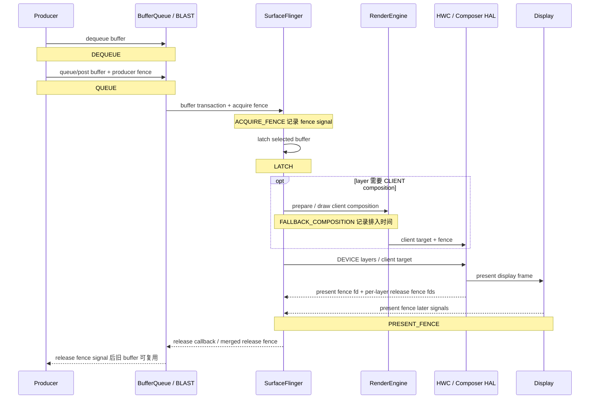

# 13.18 FrameTracer 与 Graphics Frame Event 数据通路

FrameTimeline 可以判断某个 SurfaceFrame 或 DisplayFrame 是否按预测时间完成，FrameTracer 则提供 buffer 从 Producer 持有、提交、可读、latch 到 present 的观测点。两套数据经常出现在同一条 trace 中，却使用不同的身份与时间语义。混用 `frame_number`、FrameTimeline token 和三类 fence，会让一段可执行查询变成错误归因。

平台源码固定为 Android 17 / API 37 / `android-17.0.0_r1`。FrameTracer 位于 framework 与 SurfaceFlinger，不依赖内核函数才能解释其事件；继续追查 dma-buf、sync_file 或 dma-fence 时，内核锚点固定为 `android17-6.18-2026-06_r6`。SQL 以 SmartPerfetto v1.3.0 固定的 Perfetto v57.2 `trace_processor_shell` 为查询环境，并与该版本的 importer diff test 对照。

## 两条数据源分别保存什么

SurfaceFlinger 注册了两条独立的 Perfetto 数据源：

| 数据源 | 主要实现 | 观测对象 | 适合回答的问题 |
| --- | --- | --- | --- |
| `android.surfaceflinger.frametimeline` | `Scheduler/FrameTimeline.cpp` | expected/actual SurfaceFrame 与 DisplayFrame | 帧有没有晚、丢弃或发生 stuffing，App 与 SF 哪一侧错过预测时间 |
| `android.surfaceflinger.frame` | `FrameTracer/FrameTracer.cpp` | 每个 layer/buffer 的阶段事件 | Producer 何时持有和提交 buffer、producer fence 何时 signal、SF 何时 latch、显示 present 反馈何时到达 |

FrameTimeline 的核心身份是 `surface_frame_token` 与 `display_frame_token`。一个 DisplayFrame 可以包含多个 SurfaceFrame。FrameTracer 的核心身份是 layer、buffer id 与 BufferQueue frame number；Perfetto 导入后，buffer id 主要编码在 track name 中，`frame_number` 与 `layer_name` 作为 `frame_slice` 字段暴露。

两套身份没有可直接等值连接的“全程帧号”。FrameTracer 的 `frame_number` 不能与 `surface_frame_token` 或 `display_frame_token` 直接比较。联合分析要先限定同一个 layer，再用时间重叠、present 邻域和必要的 transaction 证据建立对应关系。

## Android 17 的六个实际发射事件

`graphics_frame_event.proto` 定义了 14 个枚举值（含 `UNSPECIFIED`）。枚举是协议容量，不代表 AOSP 每一种都会发射。对 `android-17.0.0_r1` 的 `Layer.cpp`、`FrameTracer.cpp`、`SurfaceFlinger.cpp` 和 `HWComposer.cpp` 核对后，AOSP SurfaceFlinger 的实际调用点只有以下六类：

| 事件 | Android 17 发射位置 | 时间含义 | 判读限制 |
| --- | --- | --- | --- |
| `DEQUEUE` | `Layer::setBuffer()` 处理带有效 `dequeueTime` 的 buffer transaction | Producer 获得该 buffer 的时间 | 只在 transaction 携带正数 `dequeueTime` 时记录 |
| `QUEUE` | 与 `DEQUEUE` 相同的 `dequeueTime > 0` 条件块，时间取 `postTime` | buffer transaction 携带的 post 时间 | 没有有效 `dequeueTime` 时，AOSP 连 `QUEUE` 也不会记录；该事件不能当成 GPU 已完成，也不等同于 SF 已收到并采纳 |
| `ACQUIRE_FENCE` | latch 路径调用 `traceFence()` | producer/acquire fence 的 signal 时间 | 对 HWUI 常对应 GPU 写完；Camera、Video 或原生 Producer 可能来自其他硬件 |
| `LATCH` | `Layer::latchBufferImpl()` 附近 | SF 采纳该 buffer 的 latch 时间 | Android 13+ 允许特定 unsignaled buffer 先 latch，读取前仍须遵守 fence |
| `FALLBACK_COMPOSITION` | `OutputLayer::requiresClientComposition()` 为真时 | 该 layer 被加入 client composition 的时间戳 | 这是排入 RenderEngine client composition 的观测点，不是 GPU 合成完成时间 |
| `PRESENT_FENCE` | post-composition 路径 | display present fence signal；无有效 fence 时使用 HWC present timestamp 推导值 | present fence 是 per-display/per-frame，FrameTracer 把同一 display 反馈记到相关 layer 上 |

下面这张图把六个事件放回 Producer、SurfaceFlinger 与显示系统的公共路径。虚线 release 路径用于说明真实 buffer 回收关系，它不属于 AOSP FrameTracer 的 emit 集合。



图中的 `PRESENT_FENCE` 表示 Android 显示栈的 present 时间锚点。它不证明面板像素已经完成光学响应，也不能代替 per-layer release fence。release fence 决定旧 buffer 何时可安全复用；AOSP Android 17 虽然在 proto 中保留 `RELEASE_FENCE = 9`，FrameTracer 没有对应发射点。

允许 unsignaled latch 时，acquire fence 的约束只是被推迟到后续读取边界。DEVICE composition 会把原 layer 的 acquire fence 随 buffer 交给 HWC；CLIENT composition 由 RenderEngine 消费或等待原 layer 的 fence，再把 client target 自己的完成 fence 交给 HWC。看到 `LATCH` 早于 `AcquireFenceSignaled`，不能据此认定 SF 在未同步的情况下读取了 buffer。

### `HWC_COMPOSITION_QUEUED` 与 `RELEASE_FENCE`

`HWC_COMPOSITION_QUEUED = 6` 和 `RELEASE_FENCE = 9` 在 Android 17 的 AOSP SurfaceFlinger 中都没有 emit 调用。trace 中出现前者时，应记录设备 build 与来源实现，再判断是否为 OEM instrumentation。仅凭 proto 注释，无法把它归为标准 AOSP 事件。

同理，缺少 `RELEASE_FENCE` 事件不表示系统没有 release fence。HWC 仍会返回 per-layer release fence，SurfaceFlinger 仍会合并并通过 release callback / BufferQueue 传给 Producer。FrameTracer 数据源没有把这条信号写入 `GraphicsFrameEvent`。

## `traceFence()` 为什么可能缺尾部事件

`traceFence()` 遇到已 signal 的 fence 时，会按 signal time 写入事件；遇到 pending fence 时，会把它保存到对应 layer、buffer id 的 `pendingFences`。同一个 buffer 以后再次触发 FrameTracer 调用时，`tracePendingFencesLocked()` 才会重新检查并补写已经 signal 的事件。

这套实现带来三个诊断边界：

1. 补写发生得晚，TracePacket 的 timestamp 仍使用原 fence signal time；trace processor 排序后看起来会回到正确时间位置；
2. trace 结束前没有后续同 buffer 调用时，尾部 pending fence 可能没有机会补写；
3. signal time 距检查时刻超过 60 秒的 pending fence 会被丢弃，避免旧 trace 的 fence 污染后续采集。

因此，缺少某一帧的 `AcquireFenceSignaled` 或 `PresentFenceSignaled` 需要结合 trace 尾部、buffer 是否继续复用、fence 有效性和数据源采集区间判断，不能直接写成“fence 从未 signal”。

## Perfetto v57.2 怎样导入 Graphics Frame Event

Perfetto 的 `GraphicsFrameEventParser` 将一份 proto 事件投影成 raw event 与 phase slice。当前查询入口是 `gpu_track` 和 `frame_slice`，筛选条件为 `gpu_track.scope = 'graphics_frame_event'`。

| track name | slice 内容 | `dur` 的含义 |
| --- | --- | --- |
| `Buffer: <bufferId> <layer>` | `Dequeue`、`Queue`、`AcquireFenceSignaled`、`Latch`、`FallbackComposition`、`PresentFenceSignaled` 等 raw event | importer 支持带 `duration_ns` 的 span；Android 17 的六类 AOSP 发射调用没有传正 duration，均导入为 instant slice |
| `APP_<bufferId> <layer>` | 一帧对应一个 phase slice | `DEQUEUE → QUEUE` |
| `GPU_<bufferId> <layer>` | 一帧对应一个 phase slice | `QUEUE → ACQUIRE_FENCE signal` |
| `SF_<bufferId> <layer>` | 一帧对应一个 phase slice | `LATCH → PRESENT_FENCE signal` |
| `Display_<layer>` | 连续 present 之间的 phase slice | 当前 present → 同 layer 下一次 present |

`APP_` phase 表示 Producer 持有 buffer 的时间。它可能包含 CPU 准备、GPU 提交、主动 pacing、锁等待或其他 Producer 行为，不能统一命名为“App 绘制耗时”。`GPU_` phase 表示提交到 producer fence signal 的间隔；对于 HWUI 它常能反映 GPU 完成等待，对 Camera、Video 和其他硬件 Producer 则要改用相应生产者语义。

`SF_` phase 将 latch 到 display present feedback 放在一起，覆盖 SF 调度、client/device composition 和显示后段，无法单独量出 HWC 或 RenderEngine 的执行时间。`Display_` phase 是相邻 present 的 cadence；它不表示 buffer 从 present 到 release 的生命周期。末尾的 `Display_` slice 没有下一次 present 来闭合时，`dur` 为 `-1`。

还有一个容易漏掉的 parser 分支：acquire fence 可能在 `QUEUE` packet 被处理前已经 signal。此时 importer 不创建 `GPU_` phase，避免制造反向或错误时长。某一帧缺 `GPU_` slice，不应自动解释为数据损坏。

## 确认 trace 中是否有这组数据

下面的片段只展示两条 SurfaceFlinger 数据源，需合并到已经定义采集时长与 buffer 的完整配置中。

```textproto
data_sources {
  config { name: "android.surfaceflinger.frame" }
}
data_sources {
  config { name: "android.surfaceflinger.frametimeline" }
}
```

这只是可合并的配置片段，不能单独作为完整采集配置运行。完整排障应按问题补充 sched、atrace、GPU counter 或应用 track event，并按采集时长与数据量设置 buffer。只打开 `gfx` atrace category，不能据此假定两条原生 Perfetto 数据源都已启用。

## SQL 1：列出目标 layer 的 raw event 与 phase

这条查询直接采用 Perfetto v57.2 importer diff test 使用的表关系，并加上目标 layer 过滤。

```sql
SELECT
  fs.ts,
  fs.dur,
  gt.name AS track_name,
  fs.name AS slice_name,
  fs.frame_number,
  fs.layer_name
FROM gpu_track AS gt
JOIN frame_slice AS fs
  ON fs.track_id = gt.id
WHERE gt.scope = 'graphics_frame_event'
  AND fs.layer_name GLOB '*com.example.app*'
ORDER BY fs.ts;
```

把包名替换为目标 layer 的稳定片段。`Buffer:` 轨迹用于查看六类 raw event；`APP_`、`GPU_`、`SF_`、`Display_` 轨迹已经由 importer 计算好阶段时长。查询结果中 `dur = -1` 的未闭合 slice 不能参与均值、P95 或总时长统计。

## SQL 2：按 frame number 汇总四类 phase

下面的查询把 importer 生成的 phase 归入四列，不使用 SQLite 不支持的 `PIVOT` 语法。

```sql
WITH phase AS (
  SELECT
    fs.layer_name,
    fs.frame_number,
    fs.dur,
    CASE
      WHEN gt.name GLOB 'APP_*' THEN 'app_hold'
      WHEN gt.name GLOB 'GPU_*' THEN 'producer_fence_wait'
      WHEN gt.name GLOB 'SF_*' THEN 'latch_to_present'
      WHEN gt.name GLOB 'Display_*' THEN 'present_interval'
    END AS phase_name
  FROM gpu_track AS gt
  JOIN frame_slice AS fs
    ON fs.track_id = gt.id
  WHERE gt.scope = 'graphics_frame_event'
    AND fs.dur >= 0
    AND fs.layer_name GLOB '*com.example.app*'
)
SELECT
  layer_name,
  frame_number,
  MAX(CASE WHEN phase_name = 'app_hold' THEN dur END) / 1e6
    AS app_hold_ms,
  MAX(CASE WHEN phase_name = 'producer_fence_wait' THEN dur END) / 1e6
    AS producer_fence_wait_ms,
  MAX(CASE WHEN phase_name = 'latch_to_present' THEN dur END) / 1e6
    AS latch_to_present_ms,
  MAX(CASE WHEN phase_name = 'present_interval' THEN dur END) / 1e6
    AS present_interval_ms
FROM phase
WHERE phase_name IS NOT NULL
GROUP BY layer_name, frame_number
ORDER BY latch_to_present_ms DESC;
```

NULL 列表示该 phase 在当前 trace 中没有闭合或没有生成。不要用 `COALESCE(..., 0)` 把缺失证据改写成零耗时。排序只是定位候选帧，根因仍要结合 active refresh rate、FrameTimeline expected/actual、线程状态、GPU 数据和 composition type 判断。

这条汇总还假设查询窗口内的完整 `layer_name` 只对应一个 layer 生命周期。窗口销毁重建、同名 layer 或多 Display 镜像场景可能让同名对象重新使用较小的 frame number；跨长 trace 自动化时应再限定时间窗，并保留原始 track name 或 layer 身份，避免把不同 BufferQueue 的同名帧合并。

## FrameTimeline 与 FrameTracer 怎样配合

FrameTimeline 从 Android 12 起提供 expected/actual SurfaceFrame 与 DisplayFrame。`ActualSurfaceFrameStart` 在 Android 17 包含 `present_type`、`on_time_finish`、`gpu_composition`、`jank_type`、`prediction_type`、`is_buffer`、`jank_severity_type`、`present_delay_millis`、`vsync_resynced_jitter_millis` 和 `jank_severity_score` 等字段。SQL 视图会把 jank bitmask 转成可读分类。

Android 17 的 proto 相比 `android-16.0.0_r1` 增加了以下五个枚举值：

| 值 | Android 17 名称 | 诊断含义 |
| ---: | --- | --- |
| 2048 | `JANK_NON_ANIMATING` | 当前内容不按动画 cadence 分类；它位于源码的 non-jank 集合，不能按普通卡顿原因计数 |
| 4096 | `JANK_APP_RESYNCED_JITTER` | App 侧重新同步相关抖动 |
| 8192 | `JANK_DISPLAY_NOT_ON` | Display 未处于 on 状态 |
| 16384 | `JANK_DISPLAY_MODE_CHANGE_IN_PROGRESS` | 显示模式切换进行中 |
| 32768 | `JANK_DISPLAY_POWER_MODE_CHANGE_IN_PROGRESS` | 显示电源模式切换进行中 |

这些值是 bitmask，可以同时出现多个原因。Android 17 还增加了 `jank_type_experimental`、`present_type_experimental` 与 `jank_debug_metadata`；proto 明确要求 experimental 字段不要用于正式 jank 判定。版本首引来自 Android 16 与 Android 17 固定 tag 的 proto 对比，不能由当前文件的存在反推到更早版本。

### `gpu_composition` 与 `FALLBACK_COMPOSITION`

Android 17 的 `Layer.cpp` 在 `OutputLayer::requiresClientComposition()` 为真时记录 `FALLBACK_COMPOSITION`，并对相关 SurfaceFrame 调用 `setGpuComposition()`。所以 FrameTimeline 的 `gpu_composition` 与 FrameTracer raw event 来自同一条 client-composition 判定分支。

`requiresClientComposition()` 的条件是当前 output layer 没有 HWC state，或 HWC composition type 为 `CLIENT`。一次 display frame 可以混合 DEVICE layer 与 CLIENT target。某个 layer 出现 `FallbackComposition` 只证明该 layer 进入 client composition；它无法单独证明 overlay plane 耗尽，也无法量化 RenderEngine GPU 时长。format、transform、blend、dataspace、color transform、protected content 和 vendor HWC 策略都可能影响决策。

### 不要把两个 frame identity 直接 JOIN

FrameTimeline 查询应使用 `surface_frame_token` 对齐 App expected/actual，使用 `display_frame_token` 对齐 SurfaceFrame 与 DisplayFrame。FrameTracer 查询使用 `layer_name` 与 BufferQueue `frame_number`。可靠的联合步骤是：

1. 在 `actual_frame_timeline_slice` 中选出目标进程和目标 layer 的 late/dropped frame；
2. 记录该 SurfaceFrame 的时间区间与 `display_frame_token`；
3. 在相同 layer、相邻时间范围内查找 `APP_`、`GPU_`、`SF_` phase 和 raw event；
4. 回到 Perfetto UI 检查 layer、transaction、`BufferTX - <layerName>` 与 present 邻域；
5. 需要自动化关联时，使用时间窗并输出匹配置信度，不能把 frame token 与 frame number 写成等值条件。

标准 HWUI App Window 的 FrameTimeline 覆盖较完整。SurfaceView、Camera、Video、游戏、WebView overlay、Flutter PlatformView 等路径可能有独立 Producer、独立 layer 或不完整的 App SurfaceFrame。此时先识别 Producer 与目标 layer，再决定 FrameTimeline 是否能作为主索引。

## 四类耗时怎样读

### `APP_` 偏长：Producer 长时间持有 buffer

`DEQUEUE → QUEUE` 增长说明 Producer 拿到 buffer 后较晚提交。对标准 HWUI，可检查 MainThread、RenderThread、`DrawFrame`、Skia/GPU submit 与 pacing；对游戏看 Logic、Render/RHI、swap；对 Camera/Video 看 HAL、codec 与时间戳策略。CPU 线程不忙时，也可能是主动 pacing、GPU backpressure 或同步依赖。

### `GPU_` 偏长：producer completion fence 晚

`QUEUE → ACQUIRE_FENCE signal` 增长表示 Consumer 较晚获得可安全读取的 buffer。HWUI 或游戏通常要补 GPU stage、frequency、utilization、shader 和内存带宽证据。Camera、Video 和硬件 blitter 路径需要使用对应生产设备的 completion 语义。固定使用 16.6 ms 判定会在 90/120 Hz、30 fps 内容、VRR/ARR 和非整数 cadence 场景中产生误报，应与当前 expected timeline 和目标帧率比较。

### acquire 已 signal，latch 仍晚：检查 transaction 与 SF 调度

FrameTracer importer 没有生成独立的 acquire-to-latch phase track。可以从 raw event 时间或事件参数确认二者间隔，再查看 transaction readiness、同步 transaction、`BufferTX - <layerName>`、SF actual timeline 和 layer 是否被选择。Android 13+ 的 unsignaled latch 还会让 latch 与 fence signal 的先后关系更灵活，单看事件顺序不足以解释读取等待发生在哪里。

### `SF_` 偏长：系统输出段的综合延迟

`LATCH → PRESENT_FENCE signal` 同时包含 SF 调度、HWC validate/present、可选 RenderEngine client composition、显示模式节奏和 display 后段。若 `FallbackComposition` 出现，继续查 RenderEngine 与 GPU；若全部目标 layer 走 DEVICE，继续查 HWC/DisplayHAL、刷新率或 mode change。present fence 仍是显示栈锚点，panel 扫描和光学响应需要额外测量。

### `Display_` 偏长：present cadence 出现空档

`Display_` 的 duration 是同 layer 相邻两次 present feedback 的间隔。它适合观察 cadence 和沿用旧 buffer 的时段，不等于某个 buffer 的 release latency。30 fps 内容在 60 Hz display 上出现约 33.3 ms 间隔可以完全符合预期，必须结合 requested frame rate、内容 cadence 与 FrameTimeline 判断。

## 按出图类型修正解释

| 出图类型 | FrameTracer 中要锁定的对象 | 不能直接套用的解释 |
| --- | --- | --- |
| 标准 App Window | 宿主 App Window layer | `APP_` 仍不等于完整 `doFrame`；主线程工作可能发生在 dequeue 前 |
| SurfaceView / 游戏 Surface | 独立 Surface layer | 宿主窗口 token 不能代替独立 layer 的 buffer frame number |
| TextureView | 宿主 App Window layer，外部 SurfaceTexture 另查 | 外部 Producer 的 ready 时间不等于宿主窗口 present |
| 软件绘制 / 离屏渲染 | 最终上传或提交到窗口的 layer；纯离屏 Bitmap 没有 SF layer | 离屏 CPU 绘制可能发生在 dequeue 前，不能要求 FrameTracer 覆盖这段工作 |
| Native EGL / Vulkan | 实际 `ANativeWindow` / Surface 对应的独立 layer | 不能套用 MainThread、RenderThread 或 HWUI 的线程归因 |
| Camera / 普通 Video Surface | preview/video layer | acquire fence 可能来自 HAL 或 codec，不能统一归为 GPU |
| Tunneled / sideband video | sideband layer 与 HAL/HWC 证据 | 可能没有普通逐帧 BufferQueue / FrameTracer 事件 |
| WebView / Flutter / React Native | 先区分宿主合成和独立 overlay | framework frame id 不能直接作为 BufferQueue frame number |
| 多窗口 / 多 Display | 每个窗口的 layer 与各自目标 Display | 共享进程或线程不等于共享 BufferQueue；present fence 必须按 Display 区分 |

这种分型来自渲染管线的 Producer、Surface、layer 与 composition 边界。工具只看到事件时，很容易把宿主窗口、独立 Surface 和 display frame 混成一条“App 帧”。

## 版本边界

| 平台 | 数据能力 | 判读影响 |
| --- | --- | --- |
| Android 11 / API 30 | FrameTracer 数据源已经存在 | 缺少 Android 12 的 FrameTimeline 配套；可单独分析 buffer phase |
| Android 12 / API 31 | FrameTimeline 成为现代 trace 基线 | 可以用 SurfaceFrame/DisplayFrame 选 jank 候选，再按 layer 与时间匹配 FrameTracer |
| Android 13 / API 33 | `AutoSingleLayer` unsignaled latch 成为默认策略 | latch 与 acquire fence signal 不再保持简单的“必须先 signal 再 latch”假设 |
| Android 14～16 / API 34～36 | 两条数据源的公共模型延续 | 仍要固定设备、vendor build、刷新率和 Perfetto 版本 |
| Android 17 / API 37 | 当前源码与 proto 锚点；扩展 FrameTimeline jank bitmask | 使用 Android 17 调用名、emit 集合和五个新增 jank 值 |

联合诊断范围从 Android 12 开始，因为这条路径依赖 FrameTimeline。Android 11 的 FrameTracer 可以作为历史兼容路径保留。Android 10 及更早版本应使用当时可用的 BufferQueue、atrace、SF 与 fence 证据，不能假定存在这条 Perfetto data source。

## 使用边界

FrameTracer 提供的是一组时间锚点和 importer 生成的阶段，不是端到端用户可见延迟测量。使用它时要守住以下边界：

- `QUEUE` 之后 Producer 仍可能写 buffer，完成时刻由 acquire fence 约束；
- `LATCH` 表示 SF 采纳 buffer，不保证内容已经完成读取或显示；
- `FALLBACK_COMPOSITION` 表示进入 client composition，不提供 RenderEngine 完成时刻；
- `PRESENT_FENCE` 是 per-display 的 present 反馈，不是 per-layer release，也不是 panel 光学响应；
- FrameTimeline token 与 BufferQueue frame number 属于不同身份域；
- phase 缺失、`dur = -1` 和 trace 尾部 pending fence 都要按缺失证据处理；
- 固定毫秒阈值只能作为筛选条件，帧预算应来自实际刷新率、内容 cadence 与 expected timeline。

遵守这些条件后，FrameTimeline 用来选择“哪一帧值得查”，FrameTracer 用来判断“buffer 路径哪一段出现等待”，线程、GPU、HWC 和 display 证据再负责解释等待来源。

## 参考源码与验证材料

- [Android 17 `FrameTracer.h`](https://android.googlesource.com/platform/frameworks/native/+/refs/tags/android-17.0.0_r1/services/surfaceflinger/FrameTracer/FrameTracer.h) 与 [`FrameTracer.cpp`](https://android.googlesource.com/platform/frameworks/native/+/refs/tags/android-17.0.0_r1/services/surfaceflinger/FrameTracer/FrameTracer.cpp)
- [Android 17 `Layer.cpp` 的六类 emit 调用](https://android.googlesource.com/platform/frameworks/native/+/refs/tags/android-17.0.0_r1/services/surfaceflinger/Layer.cpp)
- [Android 17 `graphics_frame_event.proto`](https://android.googlesource.com/platform/external/perfetto/+/refs/tags/android-17.0.0_r1/protos/perfetto/trace/android/graphics_frame_event.proto)
- [Android 17 `frame_timeline_event.proto`](https://android.googlesource.com/platform/external/perfetto/+/refs/tags/android-17.0.0_r1/protos/perfetto/trace/android/frame_timeline_event.proto)
- [Perfetto v57.2 GraphicsFrameEvent importer](https://github.com/Gracker/perfetto/blob/39bdbfe942aa51de9a08c4fc5f363c2ca57ebd9f/src/trace_processor/importers/proto/graphics_frame_event_parser.cc)
- [Perfetto v57.2 importer diff test 与标准查询](https://github.com/Gracker/perfetto/blob/39bdbfe942aa51de9a08c4fc5f363c2ca57ebd9f/test/trace_processor/diff_tests/parser/graphics/tests.py)
- [Perfetto FrameTimeline 文档](https://perfetto.dev/docs/data-sources/frametimeline)
- [Android 图形同步框架](https://source.android.com/docs/core/graphics/sync)
- [kernel `android17-6.18-2026-06_r6` `sync_file.c`](https://android.googlesource.com/kernel/common/+/refs/tags/android17-6.18-2026-06_r6/drivers/dma-buf/sync_file.c)
