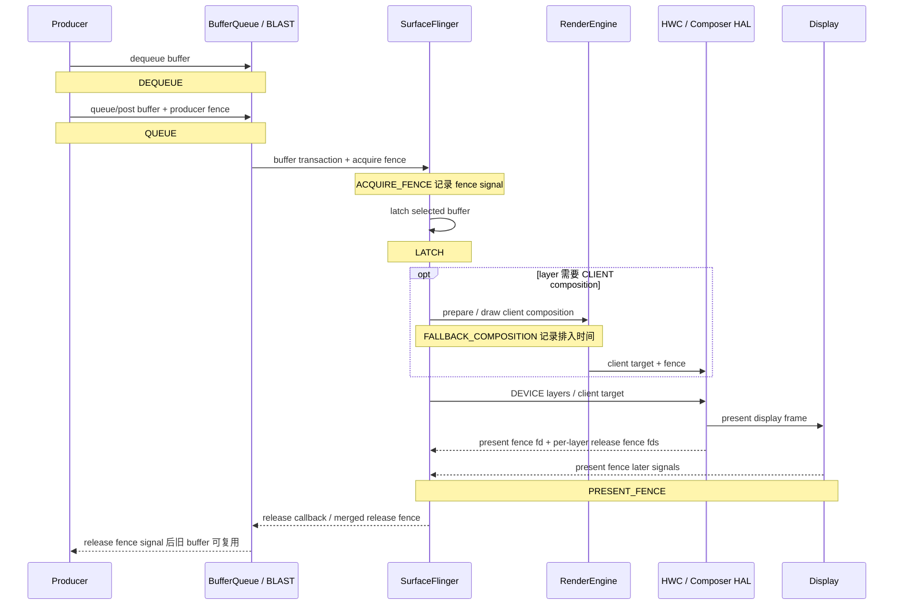

# 13.18 FrameTracer 与 Graphics Frame Event 数据通路

FrameTimeline 可以判断某个 SurfaceFrame 或 DisplayFrame 是否按预测时间完成。SurfaceFrame 表示某个 layer 提交的一帧，DisplayFrame 表示 SurfaceFlinger 把一个或多个 SurfaceFrame 合成后送去显示的一帧。FrameTracer 则记录 buffer 从 Producer 持有、提交、可供读取、latch（SurfaceFlinger 选中该 buffer 用于合成）到 present（显示系统给出呈现反馈）的时间点。

两套数据经常出现在同一条 trace 中，却使用不同的 ID 和时间含义。这里还涉及三种 fence（同步栅栏）：acquire fence 约束 Consumer 何时可以读取 buffer，present fence 标记显示设备何时完成该帧的 present，release fence 通知 Producer 何时可以安全复用旧 buffer。混用 `frame_number`、FrameTimeline token 和这三种 fence，会让语法正确的查询得出错误归因。

本文核对的平台源码版本是 Android 17 / API 37 / `android-17.0.0_r1`。FrameTracer 实现在 `frameworks/native` 的 SurfaceFlinger 中，只解释它发出的事件时不必依赖内核函数；继续追查 DMA-BUF（跨驱动共享的 buffer）、`sync_file`（把 fence 暴露为文件描述符的内核接口）或 `dma-fence`（内核中的 fence 同步对象）时，对应的内核版本是 `android17-6.18-2026-06_r6`。SQL 以 SmartPerfetto v1.3.0 固定的 Perfetto v57.2 `trace_processor_shell` 为查询环境，并与该版本 importer 的 diff test（固定输入与期望输出的回归测试）对照。

## 两条数据源分别保存什么

SurfaceFlinger（下文简称 SF）注册了两条独立的 Perfetto 数据源：

| 数据源 | 主要实现 | 观测对象 | 适合回答的问题 |
| --- | --- | --- | --- |
| `android.surfaceflinger.frametimeline` | `Scheduler/FrameTimeline.cpp` | expected（预测）与 actual（实际）的 SurfaceFrame、DisplayFrame | 帧是否晚到、丢弃或发生 Buffer Stuffing（队列持续积压），App 与 SF 哪一侧错过预测时间 |
| `android.surfaceflinger.frame` | `FrameTracer/FrameTracer.cpp` | 每个 layer/buffer 的阶段事件 | Producer 何时持有和提交 buffer、producer fence 何时 signal（变为已完成）、SF 何时 latch、显示 present 反馈何时到达 |

FrameTimeline 使用 `surface_frame_token` 与 `display_frame_token` 标识帧，一个 DisplayFrame 可以包含多个 SurfaceFrame。FrameTracer 使用 layer、buffer id 与 BufferQueue frame number：buffer id 标识被循环使用的 buffer 对象，frame number 标识该 BufferQueue 上的一次提交。Perfetto 导入后，buffer id 主要编码在 track name 中，`frame_number` 与 `layer_name` 则作为 `frame_slice` 字段提供给 SQL。

两套数据没有可直接等值连接的“全程帧号”。FrameTracer 的 `frame_number` 不能与 `surface_frame_token` 或 `display_frame_token` 直接比较。联合分析要先限定同一个 layer，再根据时间是否重叠、是否靠近同一次 present，以及相关 transaction（提交给 SF 的状态更新）建立对应关系。

## Android 17 的六个实际发射事件

`graphics_frame_event.proto` 是这类 trace 数据的 Protocol Buffers（protobuf）结构定义，其中列出 14 个枚举值（含 `UNSPECIFIED`）。枚举只表示协议允许写入哪些值，不代表 AOSP 会发出每一种事件。对 `android-17.0.0_r1` 的 `Layer.cpp`、`FrameTracer.cpp`、`SurfaceFlinger.cpp` 和 `HWComposer.cpp` 核对后，AOSP SurfaceFlinger 只有以下六类 emit（写入 trace）调用：

| 事件 | Android 17 发射位置 | 时间含义 | 判读限制 |
| --- | --- | --- | --- |
| `DEQUEUE` | `Layer::setBuffer()` 处理带有效 `dequeueTime` 的 buffer transaction | Producer 从 BufferQueue 取得该 buffer 的时间 | 只在 transaction 携带正数 `dequeueTime` 时记录 |
| `QUEUE` | 与 `DEQUEUE` 相同的 `dequeueTime > 0` 条件块，时间取 `postTime` | buffer transaction 携带的提交时间 | 没有有效 `dequeueTime` 时，AOSP 连 `QUEUE` 也不会记录；该事件不能当成 GPU 已完成，也不表示 SF 已经采纳该 buffer |
| `ACQUIRE_FENCE` | latch 路径调用 `traceFence()` | producer/acquire fence 的 signal 时间 | 对 HWUI（Android 硬件加速 UI 渲染器）常对应 GPU 写完；Camera、Video 或原生 Producer 可能来自其他硬件 |
| `LATCH` | `Layer::latchBufferImpl()` 附近 | SF 采纳该 buffer 的 latch 时间 | Android 13+ 允许特定 unsignaled buffer 先 latch，读取前仍须遵守 fence |
| `FALLBACK_COMPOSITION` | `OutputLayer::requiresClientComposition()` 为真时 | 该 layer 被加入 client composition 的时间戳 | client composition 指 RenderEngine 使用 GPU 合成；这里记录的是任务被安排进入该路径的时间，不是 GPU 完成时间 |
| `PRESENT_FENCE` | post-composition 路径 | display present fence signal；无有效 fence 时使用 HWC present timestamp 推导值 | HWC 是 Hardware Composer（硬件合成器）；present fence 按 display 和 frame 生成，FrameTracer 把同一个 display 反馈记到相关 layer 上 |

下面这张图把六个事件放回 Producer、SurfaceFlinger 与显示系统的公共路径。Producer 生成并提交图像内容，BufferQueue 在 Producer 与 Consumer 之间传递 buffer；在这条路径中，SF 选择要使用的 buffer，RenderEngine 或 HWC 再负责后续合成。虚线 release 路径只用于说明真实的 buffer 回收关系，不属于 AOSP FrameTracer 的 emit 集合。



图中的 `PRESENT_FENCE` 是 Android 显示栈的 present 参考时间。它不能证明面板像素已经完成光学响应，也不能代替每个 layer 的 release fence。release fence 决定旧 buffer 何时可以安全复用；AOSP Android 17 虽然在 proto 中保留 `RELEASE_FENCE = 9`，FrameTracer 没有对应 emit 调用。

允许 unsignaled latch（fence 尚未 signal 时先选中 buffer）时，acquire fence 的等待被推迟到后续真正读取 buffer 的位置。DEVICE composition 由 HWC 直接合成 layer，因此 SF 会把原 layer 的 acquire fence 随 buffer 交给 HWC；CLIENT composition 由 RenderEngine 使用 GPU 合成，它会消费或等待原 layer 的 fence，再把 client target（GPU 合成后的整屏目标 buffer）及其完成 fence 交给 HWC。看到 `LATCH` 早于 `AcquireFenceSignaled`，不能据此认定 SF 在没有同步的情况下读取了 buffer。

### `HWC_COMPOSITION_QUEUED` 与 `RELEASE_FENCE`

`HWC_COMPOSITION_QUEUED = 6` 和 `RELEASE_FENCE = 9` 在 Android 17 的 AOSP SurfaceFlinger 中都没有 emit 调用。trace 中出现前者时，应记录设备 build 与来源实现，再判断是否来自 OEM instrumentation（设备厂商自行增加的跟踪代码）。只看 proto 注释，无法把它归为标准 AOSP 事件。

缺少 `RELEASE_FENCE` 事件也不表示系统没有 release fence。HWC 仍会返回每个 layer 的 release fence，SurfaceFlinger 仍会按需要合并，并通过 release callback / BufferQueue 传给 Producer；FrameTracer 数据源没有把这条信号写入 `GraphicsFrameEvent`。

## `traceFence()` 为什么可能缺尾部事件

`traceFence()` 遇到已 signal 的 fence 时，会按 signal time（fence 变为完成状态的时间）写入事件；遇到 pending fence（仍在等待完成的 fence）时，会把它保存到对应 layer、buffer id 的 `pendingFences`。同一个 buffer 以后再次触发 FrameTracer 调用时，`tracePendingFencesLocked()` 才会重新检查，并补写此时已经 signal 的事件。

这套实现会影响以下三种判断：

1. 即使补写发生得晚，TracePacket（trace 文件中的 protobuf 记录单元）的 timestamp 仍使用原 fence signal time；Trace Processor 按时间排序后，事件会出现在原来的 signal 位置；
2. trace 结束前没有后续同 buffer 调用时，尾部 pending fence 可能没有机会补写；
3. signal time 距检查时刻超过 60 秒的 pending fence 会被丢弃，防止前一次 trace 遗留的 fence 被写进后续采集。

因此，缺少某一帧的 `AcquireFenceSignaled` 或 `PresentFenceSignaled` 需要结合 trace 尾部、buffer 是否继续复用、fence 有效性和数据源采集区间判断，不能直接写成“fence 从未 signal”。

## Perfetto v57.2 怎样导入 Graphics Frame Event

Perfetto 的 `GraphicsFrameEventParser` 会把一条 proto 事件导入为 raw event（单个原始事件）和 phase slice（由起止事件配对生成的阶段区间）。在 Perfetto v57.2 中，SQL 查询入口是 `gpu_track` 和 `frame_slice`，筛选条件为 `gpu_track.scope = 'graphics_frame_event'`。

| track name | slice 内容 | `dur` 的含义 |
| --- | --- | --- |
| `Buffer: <bufferId> <layer>` | `Dequeue`、`Queue`、`AcquireFenceSignaled`、`Latch`、`FallbackComposition`、`PresentFenceSignaled` 等 raw event | importer 支持带 `duration_ns` 的 span（持续区间）；Android 17 的六类 AOSP emit 调用没有传入正 duration，因此均导入为 instant slice（零时长事件） |
| `APP_<bufferId> <layer>` | 一帧对应一个 phase slice | `DEQUEUE → QUEUE` |
| `GPU_<bufferId> <layer>` | 一帧对应一个 phase slice | `QUEUE → ACQUIRE_FENCE signal` |
| `SF_<bufferId> <layer>` | 一帧对应一个 phase slice | `LATCH → PRESENT_FENCE signal` |
| `Display_<layer>` | 连续 present 之间的 phase slice | 当前 present → 同 layer 下一次 present |

`APP_` phase 表示 Producer 持有 buffer 的时间。它可能包含 CPU 准备、GPU 提交、主动 pacing（按目标帧率控制提交节奏）、锁等待或其他 Producer 行为，不能统一命名为“App 绘制耗时”。`GPU_` phase 表示从提交到 producer fence signal 的间隔；对于 HWUI，它常能反映等待 GPU 完成的时间，对 Camera、Video 和其他硬件 Producer 则要按对应设备的完成信号解释。

`SF_` phase 把 latch 到 display present feedback 合成一个区间，覆盖 SF 调度、CLIENT/DEVICE composition 和显示后段，无法单独量出 HWC 或 RenderEngine 的执行时间。`Display_` phase 表示相邻 present 的 cadence（重复出现的帧节奏），不表示 buffer 从 present 到 release 的生命周期。末尾的 `Display_` slice 没有下一次 present 与它配对时，`dur` 为 `-1`，表示区间尚未闭合。

还要考虑一个 parser 分支：acquire fence 可能在 `QUEUE` packet 被 importer 处理前已经 signal。此时 importer 不创建 `GPU_` phase，以免生成起止顺序相反或时长错误的区间。某一帧缺少 `GPU_` slice，不应直接解释为数据损坏。

## 确认 trace 中是否有这组数据

下面的片段只展示两条 SurfaceFlinger 数据源，需合并到已经定义采集时长与 buffer 的完整配置中。

```textproto
data_sources {
  config { name: "android.surfaceflinger.frame" }
}
data_sources {
  config { name: "android.surfaceflinger.frametimeline" }
}
```

这只是可合并的配置片段，不能单独作为完整采集配置运行。完整排障应按问题补充 sched（CPU 调度）、atrace、GPU counter 或应用 track event，并根据采集时长与数据量设置 buffer。只打开 `gfx` atrace category，不能据此判断这两条原生 Perfetto 数据源已经启用。

## SQL 1：列出目标 layer 的 raw event 与 phase

这条查询采用 Perfetto v57.2 importer diff test 使用的表关系，并增加目标 layer 过滤。`ts` 与 `dur` 的单位是纳秒，`GLOB` 使用通配符匹配 layer 名称。

```sql
SELECT
  fs.ts,
  fs.dur,
  gt.name AS track_name,
  fs.name AS slice_name,
  fs.frame_number,
  fs.layer_name
FROM gpu_track AS gt
JOIN frame_slice AS fs
  ON fs.track_id = gt.id
WHERE gt.scope = 'graphics_frame_event'
  AND fs.layer_name GLOB '*com.example.app*'
ORDER BY fs.ts;
```

把包名替换为目标 layer 名称中稳定不变的片段。`Buffer:` 轨迹用于查看六类 raw event；`APP_`、`GPU_`、`SF_`、`Display_` 轨迹已经由 importer 计算好阶段时长。查询结果中 `dur = -1` 的未闭合 slice 不能参与均值、P95（第 95 百分位值）或总时长统计。

## SQL 2：按 frame number 汇总四类 phase

下面的查询把 importer 生成的 phase 归入四列，不使用 SQLite 不支持的 `PIVOT` 语法。

```sql
WITH phase AS (
  SELECT
    fs.layer_name,
    fs.frame_number,
    fs.dur,
    CASE
      WHEN gt.name GLOB 'APP_*' THEN 'app_hold'
      WHEN gt.name GLOB 'GPU_*' THEN 'producer_fence_wait'
      WHEN gt.name GLOB 'SF_*' THEN 'latch_to_present'
      WHEN gt.name GLOB 'Display_*' THEN 'present_interval'
    END AS phase_name
  FROM gpu_track AS gt
  JOIN frame_slice AS fs
    ON fs.track_id = gt.id
  WHERE gt.scope = 'graphics_frame_event'
    AND fs.dur >= 0
    AND fs.layer_name GLOB '*com.example.app*'
)
SELECT
  layer_name,
  frame_number,
  MAX(CASE WHEN phase_name = 'app_hold' THEN dur END) / 1e6
    AS app_hold_ms,
  MAX(CASE WHEN phase_name = 'producer_fence_wait' THEN dur END) / 1e6
    AS producer_fence_wait_ms,
  MAX(CASE WHEN phase_name = 'latch_to_present' THEN dur END) / 1e6
    AS latch_to_present_ms,
  MAX(CASE WHEN phase_name = 'present_interval' THEN dur END) / 1e6
    AS present_interval_ms
FROM phase
WHERE phase_name IS NOT NULL
GROUP BY layer_name, frame_number
ORDER BY latch_to_present_ms DESC;
```

NULL 表示该 phase 在当前 trace 中没有闭合或没有生成，不能用 `COALESCE(..., 0)` 把缺失证据改写成零耗时。排序只用于定位候选帧；判断原因时还要结合 active refresh rate（当前生效刷新率）、FrameTimeline expected/actual、线程状态、GPU 数据和 composition type（合成类型）。

这条汇总还假设查询窗口内的完整 `layer_name` 只对应一个 layer 生命周期。窗口销毁后重建、出现同名 layer，或镜像到多个 Display 时，同名对象可能从较小的 frame number 重新计数。对长 trace 做自动化查询时，应进一步限制时间窗，并保留原始 track name 或 layer 标识，避免合并来自不同 BufferQueue 的同名帧。

## FrameTimeline 与 FrameTracer 怎样配合

FrameTimeline 从 Android 12 起提供 expected/actual SurfaceFrame 与 DisplayFrame。Android 17 的 `ActualSurfaceFrameStart` 包含多组判断字段：`present_type` 表示早到、准时或晚到，`on_time_finish` 表示 App 是否按时完成，`gpu_composition` 表示是否使用 GPU 合成，`jank_type` 与 `jank_severity_type` 描述卡顿类型和严重程度，`prediction_type` 描述预测是否仍有效，`is_buffer` 区分 buffer 帧与动画状态。`present_delay_millis`、`vsync_resynced_jitter_millis` 和 `jank_severity_score` 则提供延迟、VSync 重新同步抖动与评分。SQL 视图会把 jank bitmask（用不同二进制位同时表示多个原因的整数）转换成可读分类。

Android 17 的 proto 相比 `android-16.0.0_r1` 增加了以下五个枚举值：

| 值 | Android 17 名称 | 诊断含义 |
| ---: | --- | --- |
| 2048 | `JANK_NON_ANIMATING` | 当前内容不按动画帧节奏分类；它位于源码的 non-jank 集合，不能按普通卡顿原因计数 |
| 4096 | `JANK_APP_RESYNCED_JITTER` | App 侧重新同步相关抖动 |
| 8192 | `JANK_DISPLAY_NOT_ON` | Display 未处于 on 状态 |
| 16384 | `JANK_DISPLAY_MODE_CHANGE_IN_PROGRESS` | 显示模式切换进行中 |
| 32768 | `JANK_DISPLAY_POWER_MODE_CHANGE_IN_PROGRESS` | 显示电源模式切换进行中 |

这些值是 bitmask，所以一帧可以同时带有多个原因。Android 17 还增加了 `jank_type_experimental`、`present_type_experimental` 与 `jank_debug_metadata`；proto 明确要求 experimental 字段不得用于正式 jank 判定。上述新增版本来自 Android 16 与 Android 17 固定 tag 的 proto 对比，不能因为某个字段存在于当前文件，就推断更早版本也支持它。

### `gpu_composition` 与 `FALLBACK_COMPOSITION`

Android 17 的 `Layer.cpp` 在 `OutputLayer::requiresClientComposition()` 为真时记录 `FALLBACK_COMPOSITION`，并对相关 SurfaceFrame 调用 `setGpuComposition()`。所以 FrameTimeline 的 `gpu_composition` 与 FrameTracer raw event 来自同一条 client-composition 判定分支。

`requiresClientComposition()` 在当前 output layer 没有 HWC state，或 HWC composition type 为 `CLIENT` 时返回真。一次 display frame 可以同时包含由 HWC 直接合成的 DEVICE layer 和由 RenderEngine 生成的 CLIENT target。某个 layer 出现 `FallbackComposition`，只说明它进入 client composition；这条事件不能单独证明 overlay plane（显示硬件可直接合成的图层通道）已经用完，也不能量化 RenderEngine 的 GPU 时长。像素 format、几何 transform、alpha blend、dataspace、color transform、protected content 和 vendor HWC 策略都可能影响这一选择。

### 不要把两个 frame identity 直接 JOIN

FrameTimeline 查询应使用 `surface_frame_token` 对齐 App expected/actual，使用 `display_frame_token` 对齐 SurfaceFrame 与 DisplayFrame。FrameTracer 查询则使用 `layer_name` 与 BufferQueue `frame_number`。两者联合分析时可按以下步骤操作：

1. 在 `actual_frame_timeline_slice` 中选出目标进程和目标 layer 的 late/dropped frame；
2. 记录该 SurfaceFrame 的时间区间与 `display_frame_token`；
3. 在相同 layer、相邻时间范围内查找 `APP_`、`GPU_`、`SF_` phase 和 raw event；
4. 回到 Perfetto UI 检查 layer、transaction、`BufferTX - <layerName>`，以及该帧前后的 present 事件；
5. 需要自动关联时，限定时间窗并输出匹配置信度，不能把 frame token 与 frame number 写成等值条件。

标准 HWUI App Window 的 FrameTimeline 覆盖较完整。SurfaceView、Camera、Video、游戏、WebView overlay（独立叠加层）、Flutter PlatformView 等路径可能有独立 Producer、独立 layer，或没有完整的 App SurfaceFrame。此时应先识别真正提交 buffer 的 Producer 与目标 layer，再决定能否主要依靠 FrameTimeline 定位帧。

## 四类耗时怎样读

### `APP_` 偏长：Producer 长时间持有 buffer

`DEQUEUE → QUEUE` 增长说明 Producer 拿到 buffer 后较晚提交。对标准 HWUI，可检查 MainThread、RenderThread、`DrawFrame`、Skia/GPU submit 与 pacing；对游戏检查 Logic、Render/RHI（Rendering Hardware Interface，渲染硬件抽象层）和 swap；对 Camera/Video 检查 HAL、codec 与时间戳策略。即使 CPU 线程不忙，也可能存在主动 pacing、GPU backpressure（GPU 处理不过来导致上游放慢）或同步依赖。

### `GPU_` 偏长：producer completion fence 晚

`QUEUE → ACQUIRE_FENCE signal` 增长表示 Consumer 等了较久，才获得可以安全读取的 buffer。分析 HWUI 或游戏时，通常还要补充 GPU stage、frequency、utilization、shader 和内存带宽证据。Camera、Video 和硬件 blitter（用于复制、缩放或格式转换图像的硬件单元）要按对应生产设备的 completion fence 解释。固定使用 16.6 ms 判定，会在 90/120 Hz、30 fps 内容、VRR（Variable Refresh Rate，可变刷新率）、ARR（Adaptive Refresh Rate，自适应刷新率）和非整数帧节奏场景中产生误报，应改为与当前 expected timeline 和目标帧率比较。

### acquire 已 signal，latch 仍晚：检查 transaction 与 SF 调度

FrameTracer importer 没有生成独立的 acquire-to-latch phase track。可以从 raw event 时间或事件参数计算二者间隔，再查看 transaction readiness（transaction 是否满足提交条件）、同步 transaction、`BufferTX - <layerName>`、SF actual timeline，以及该 layer 是否被本轮合成选中。Android 13+ 的 unsignaled latch 还会让 latch 与 fence signal 的先后关系更灵活，只看事件顺序无法确定真正的读取等待发生在哪里。

### `SF_` 偏长：系统输出段的综合延迟

`LATCH → PRESENT_FENCE signal` 同时包含 SF 调度、HWC validate/present、可选的 RenderEngine client composition、显示模式节奏和 display 后段。若出现 `FallbackComposition`，继续检查 RenderEngine 与 GPU；若全部目标 layer 都走 DEVICE composition，继续检查 HWC、DisplayHAL、刷新率或 mode change。present fence 仍只是显示栈中的参考时间，panel（显示面板）扫描和光学响应需要额外测量。

### `Display_` 偏长：相邻 present 的帧节奏出现空档

`Display_` 的 duration 是同一 layer 相邻两次 present feedback 的间隔，适合观察帧节奏和继续显示旧 buffer 的时段，但不等于某个 buffer 的 release latency（从 present 到允许复用的延迟）。30 fps 内容在 60 Hz display 上出现约 33.3 ms 间隔可能完全符合预期，必须结合 requested frame rate、内容帧率与 FrameTimeline 判断。

## 按出图类型修正解释

| 出图类型 | FrameTracer 中要锁定的对象 | 不能直接套用的解释 |
| --- | --- | --- |
| 标准 App Window | 宿主 App Window layer | `APP_` 仍不等于完整 `doFrame`；主线程工作可能发生在 dequeue 前 |
| SurfaceView / 游戏 Surface | 独立 Surface layer | 宿主窗口 token 不能代替独立 layer 的 buffer frame number |
| TextureView | 宿主 App Window layer，外部 SurfaceTexture 另查 | 外部 Producer 的 ready 时间不等于宿主窗口 present |
| 软件绘制 / 离屏渲染 | 最终上传或提交到窗口的 layer；纯离屏 Bitmap 没有 SF layer | 离屏 CPU 绘制可能发生在 dequeue 前，不能要求 FrameTracer 覆盖这段工作 |
| Native EGL / Vulkan | 实际 `ANativeWindow` / Surface 对应的独立 layer | 不能套用 MainThread、RenderThread 或 HWUI 的线程归因 |
| Camera / 普通 Video Surface | preview/video layer | acquire fence 可能来自 HAL 或 codec，不能统一归为 GPU |
| Tunneled / sideband video | sideband layer 与 HAL/HWC 证据；sideband 表示视频数据通过专用硬件路径交给显示系统 | 可能没有普通的逐帧 BufferQueue / FrameTracer 事件 |
| WebView / Flutter / React Native | 先区分宿主合成和独立 overlay | framework frame id 不能直接作为 BufferQueue frame number |
| 多窗口 / 多 Display | 每个窗口的 layer 与各自目标 Display | 共享进程或线程不等于共享 BufferQueue；present fence 必须按 Display 区分 |

这张表按渲染管线中的 Producer、Surface、layer 与 composition 关系区分场景。如果只看事件名，很容易把宿主窗口、独立 Surface 和 display frame 都当成同一条“App 帧”。

## 不同 Android 版本的能力

| 平台 | 数据能力 | 判读影响 |
| --- | --- | --- |
| Android 11 / API 30 | FrameTracer 数据源已经存在 | 缺少 Android 12 的 FrameTimeline 配套；可单独分析 buffer phase |
| Android 12 / API 31 | FrameTimeline 成为现代 trace 基线 | 可以用 SurfaceFrame/DisplayFrame 选 jank 候选，再按 layer 与时间匹配 FrameTracer |
| Android 13 / API 33 | `AutoSingleLayer` unsignaled latch 成为默认策略，允许符合条件的单 layer buffer 在 fence signal 前先 latch | latch 与 acquire fence signal 不再保持简单的“必须先 signal 再 latch”假设 |
| Android 14～16 / API 34～36 | 两条数据源的公共模型延续 | 仍要固定设备、vendor build、刷新率和 Perfetto 版本 |
| Android 17 / API 37 | 本文核对的源码与 proto 版本；扩展 FrameTimeline jank bitmask | 使用 Android 17 调用名、emit 集合和五个新增 jank 值 |

联合诊断范围从 Android 12 开始，因为这条路径依赖 FrameTimeline。Android 11 的 FrameTracer 可以作为历史兼容路径保留。Android 10 及更早版本应使用当时可用的 BufferQueue、atrace、SF 与 fence 证据，不能假定存在这条 Perfetto data source。

## 使用限制

FrameTracer 提供的是一组参考时间点和 importer 生成的阶段，不能直接当作端到端的用户可见延迟。使用时要遵守以下条件：

- `QUEUE` 之后 Producer 仍可能写 buffer，完成时刻由 acquire fence 约束；
- `LATCH` 表示 SF 采纳 buffer，不保证内容已经完成读取或显示；
- `FALLBACK_COMPOSITION` 表示进入 client composition，不提供 RenderEngine 完成时刻；
- `PRESENT_FENCE` 是每个 display 的 present 反馈，不是每个 layer 的 release，也不是 panel 光学响应；
- FrameTimeline token 与 BufferQueue frame number 属于两套不同的 ID；
- phase 缺失、`dur = -1` 和 trace 尾部 pending fence 都要按缺失证据处理；
- 固定毫秒阈值只能作为筛选条件，帧预算应来自实际刷新率、内容帧率与 expected timeline。

遵守这些条件后，FrameTimeline 用来选择“哪一帧值得查”，FrameTracer 用来判断“buffer 路径哪一段出现等待”，线程、GPU、HWC 和 display 证据再负责解释等待来源。

## 参考源码与验证材料

- [Android 17 `FrameTracer.h`](https://android.googlesource.com/platform/frameworks/native/+/refs/tags/android-17.0.0_r1/services/surfaceflinger/FrameTracer/FrameTracer.h) 与 [`FrameTracer.cpp`](https://android.googlesource.com/platform/frameworks/native/+/refs/tags/android-17.0.0_r1/services/surfaceflinger/FrameTracer/FrameTracer.cpp)
- [Android 17 `Layer.cpp` 的六类 emit 调用](https://android.googlesource.com/platform/frameworks/native/+/refs/tags/android-17.0.0_r1/services/surfaceflinger/Layer.cpp)
- [Android 17 `graphics_frame_event.proto`](https://android.googlesource.com/platform/external/perfetto/+/refs/tags/android-17.0.0_r1/protos/perfetto/trace/android/graphics_frame_event.proto)
- [Android 17 `frame_timeline_event.proto`](https://android.googlesource.com/platform/external/perfetto/+/refs/tags/android-17.0.0_r1/protos/perfetto/trace/android/frame_timeline_event.proto)
- [Perfetto v57.2 GraphicsFrameEvent importer](https://github.com/Gracker/perfetto/blob/39bdbfe942aa51de9a08c4fc5f363c2ca57ebd9f/src/trace_processor/importers/proto/graphics_frame_event_parser.cc)
- [Perfetto v57.2 importer diff test 与标准查询](https://github.com/Gracker/perfetto/blob/39bdbfe942aa51de9a08c4fc5f363c2ca57ebd9f/test/trace_processor/diff_tests/parser/graphics/tests.py)
- [Perfetto FrameTimeline 文档](https://perfetto.dev/docs/data-sources/frametimeline)
- [Android 图形同步框架](https://source.android.com/docs/core/graphics/sync)
- [kernel `android17-6.18-2026-06_r6` `sync_file.c`](https://android.googlesource.com/kernel/common/+/refs/tags/android17-6.18-2026-06_r6/drivers/dma-buf/sync_file.c)
