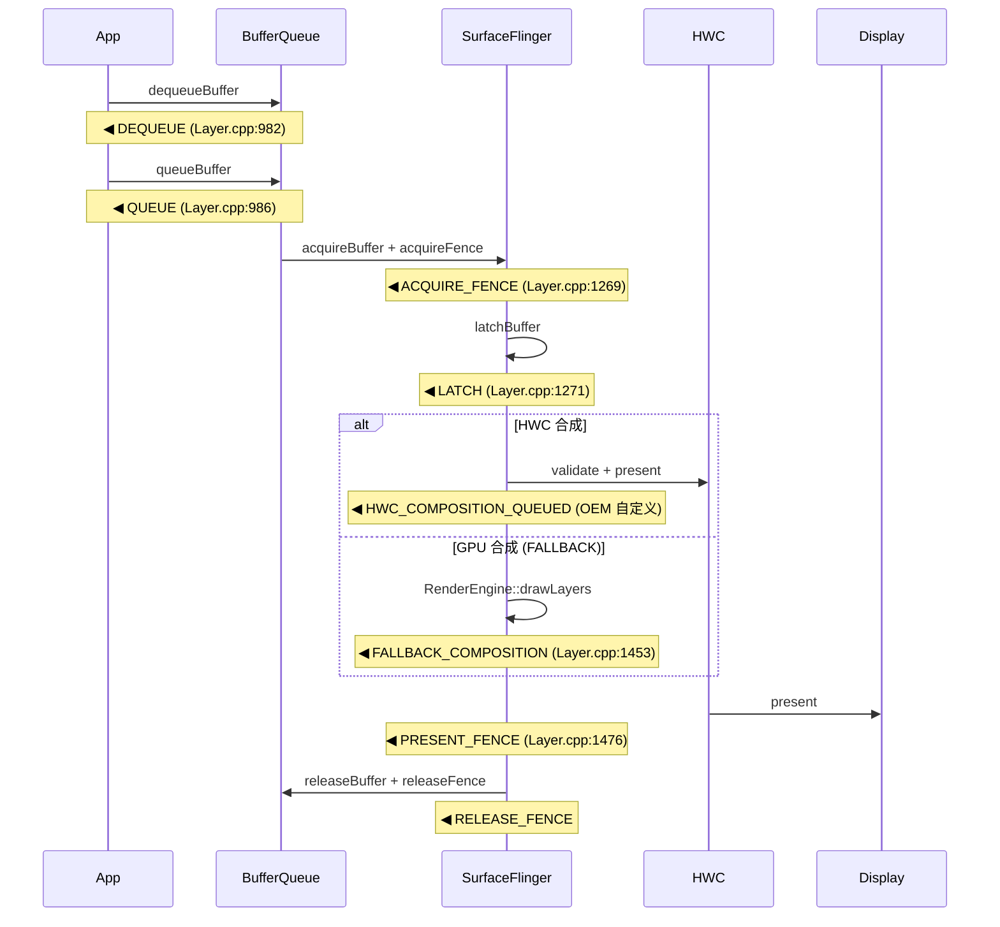

# 13.19 FrameTracer 与 Graphics Frame Event 数据通路

## 两条数据源，两个问题

SurfaceFlinger 进程内运行着两条容易混淆的 Perfetto 数据源：

| 数据源 | 承载文件 | 回答的问题 |
|--------|---------|-----------|
| `android.surfaceflinger.frametimeline` | `Scheduler/FrameTimeline.cpp` | 这帧是否按时，为何延迟 |
| `android.surfaceflinger.frame` | `FrameTracer/FrameTracer.cpp` | buffer 在 GPU↔HWC 流水线上卡在哪一步 |

FrameTimeline 产出 jank 分类（App deadlined miss / SurfaceFlinger deadlined miss / Display halo / Dropped / Missed），对「帧有没有问题」给出定性判断。FrameTracer 产出的是 buffer 生命周期事件——从 App 端 `dequeueBuffer` 到 SF 释放 `RELEASE_FENCE`，每一步都有时间戳。它回答的是「这帧在流水线的哪一段花的时间最长」。

两者通过 `buffer_id` + `frame_number` 在 trace processor 侧可关联。典型工作流：先用 FrameTimeline 找到 jank 帧，再用 FrameTracer 定位卡在哪个阶段。

> 源码级细节（初始化路径、proto 定义、Layer.cpp 调用点分布）详见 13.17 §1.7-1.8。本节聚焦实战诊断方法。

## Buffer 生命周期事件链

FrameTracer 追踪的是一个 GraphicBuffer 从 App dequeue 到最终显示再释放的完整旅程。13 种 `BufferEventType` 中，AOSP 代码中实际发射的只有 6 种，其余是 proto 占位符或 OEM 自定义。下图展示的是 AOSP 可观测的完整链路：



六个阶段的时间含义：

| 阶段 | 起止 | 含义 |
|------|------|------|
| DEQUEUE → QUEUE | App 端 | App 拿到 buffer 后的绘制耗时（CPU + GPU 提交） |
| QUEUE → ACQUIRE_FENCE | BufferQueue 传输 | buffer 从 App 进程到 SF 进程的传输 + acquire fence signal 等待（GPU 完成渲染） |
| ACQUIRE_FENCE → LATCH | SF 内部 | SF acquire buffer 到决定 latch 的间隔，通常接近 0（同一帧内） |
| LATCH → FALLBACK_COMPOSITION | GPU 合成 | 仅 GPU 合成路径有此事件，表示 GPU 实际完成合成的时刻 |
| LATCH → PRESENT_FENCE | 显示呈现 | latch 到上屏的时间，包含 HWC 合成或 GPU 合成 + 显示控制器刷新 |
| PRESENT_FENCE → RELEASE_FENCE | buffer 回收 | buffer 被显示控制器读取完毕，归还给 BufferQueue 供 App 复用 |

关键区分点：`HWC_COMPOSITION_QUEUED`（类型 6）在 AOSP 源码中**没有发射点**——`FrameTracer.cpp`、`Layer.cpp`、`SurfaceFlinger.cpp`、`HWComposer.cpp` 均无对应的 `traceTimestamp/traceFence` 调用。该 proto 值是给 OEM HWC HAL 使用的占位符，Pixel/Samsung 等闭源实现可能自行发射。如果在 trace 中看到 `HWC_COMPOSITION_QUEUED`，来源是 OEM 扩展而非 AOSP。详见 13.17 §1.8 的校正分析。

## Perfetto SQL 实战：buffer 阶段耗时分析

FrameTracer 数据存储在 `android.surfaceflinger.frame` track 中。下面是四个递进的诊断查询。

### 查询 1：查看 trace 中有哪些 layer 的 buffer 事件

```sql
-- 快速查看 trace 中有哪些 layer 产生了 FrameTracer 事件
SELECT DISTINCT
  EXTRACT_ARG(arg_set_id, 'graphics_frame_event.buffer_event.layer_name') AS layer_name,
  COUNT(*) AS event_count
FROM slice
WHERE name = 'graphics_frame_event'
GROUP BY layer_name
ORDER BY event_count DESC;
```

### 查询 2：单帧全阶段耗时分解

```sql
-- 将 FrameTracer 事件展开为每帧每阶段的耗时表
WITH frame_events AS (
  SELECT
    EXTRACT_ARG(arg_set_id, 'graphics_frame_event.buffer_event.layer_name') AS layer_name,
    EXTRACT_ARG(arg_set_id, 'graphics_frame_event.buffer_event.frame_number') AS frame_number,
    EXTRACT_ARG(arg_set_id, 'graphics_frame_event.buffer_event.type') AS event_type,
    ts,
    dur
  FROM slice
  WHERE name = 'graphics_frame_event'
)
SELECT * FROM frame_events
WHERE layer_name = 'com.example.app/com.example.app.MainActivity'
  AND frame_number = 42
ORDER BY ts;
```

结果示例（单帧 7 个事件，时间戳单位 ns）：

```
layer_name         | frame_number | event_type           | ts           | dur
-------------------|--------------|----------------------|--------------|-----
com.example...     | 42           | DEQUEUE (1)          | 100034000000 | 0
com.example...     | 42           | QUEUE (2)            | 100048000000 | 0
com.example...     | 42           | ACQUIRE_FENCE (4)    | 100050200000 | 5600000
com.example...     | 42           | LATCH (5)            | 100050200000 | 0
com.example...     | 42           | FALLBACK_COMPOSITION | 100053800000 | 0
com.example...     | 42           | PRESENT_FENCE (8)    | 100066600000 | 0
```

这一帧的瓶颈在读这张表时一目了然：
- App 绘制（DEQUEUE → QUEUE）：14ms
- GPU 渲染（QUEUE → ACQUIRE_FENCE signal）：2.2ms + 5.6ms fence wait
- GPU 合成（LATCH → FALLBACK_COMPOSITION）：3.6ms
- 上屏（FALLBACK_COMPOSITION → PRESENT_FENCE）：12.8ms（含 vsync 等待）

### 查询 3：批量计算每帧总延迟和阶段占比

```sql
-- 按帧聚合，计算 DEQUEUE 到 PRESENT_FENCE 的端到端延迟
-- 以及各阶段耗时占比
WITH events_pivot AS (
  SELECT
    layer_name,
    frame_number,
    MAX(CASE WHEN event_type = 1 THEN ts END) AS ts_dequeue,
    MAX(CASE WHEN event_type = 2 THEN ts END) AS ts_queue,
    MAX(CASE WHEN event_type = 4 THEN ts END) AS ts_acquire,
    MAX(CASE WHEN event_type = 5 THEN ts END) AS ts_latch,
    MAX(CASE WHEN event_type = 7 THEN ts END) AS ts_fallback,
    MAX(CASE WHEN event_type = 8 THEN ts END) AS ts_present
  FROM (
    SELECT
      EXTRACT_ARG(arg_set_id, 'graphics_frame_event.buffer_event.layer_name') AS layer_name,
      EXTRACT_ARG(arg_set_id, 'graphics_frame_event.buffer_event.frame_number') AS frame_number,
      EXTRACT_ARG(arg_set_id, 'graphics_frame_event.buffer_event.type') AS event_type,
      ts
    FROM slice
    WHERE name = 'graphics_frame_event'
  )
  GROUP BY layer_name, frame_number
)
SELECT
  layer_name,
  frame_number,
  (ts_present - ts_dequeue) / 1e6 AS total_ms,
  (ts_queue - ts_dequeue) / 1e6 AS app_draw_ms,
  (ts_acquire - ts_queue) / 1e6 AS gpu_render_ms,
  (ts_latch - ts_acquire) / 1e6 AS sf_latch_ms,
  COALESCE((ts_fallback - ts_latch) / 1e6, 0) AS gpu_compose_ms,
  (ts_present - COALESCE(ts_fallback, ts_latch)) / 1e6 AS present_ms
FROM events_pivot
WHERE ts_present IS NOT NULL AND ts_dequeue IS NOT NULL
ORDER BY total_ms DESC
LIMIT 20;
```

### 查询 4：识别频繁 GPU 合成的 layer

```sql
-- 统计每个 layer 的 GPU 合成占比
-- FALLBACK_COMPOSITION 出现 = HWC 无法合成该 layer
WITH composition_stats AS (
  SELECT
    layer_name,
    COUNT(DISTINCT CASE WHEN event_type = 7 THEN frame_number END) AS gpu_compose_frames,
    COUNT(DISTINCT CASE WHEN event_type = 8 THEN frame_number END) AS total_presented_frames
  FROM (
    SELECT
      EXTRACT_ARG(arg_set_id, 'graphics_frame_event.buffer_name.layer_name') AS layer_name,
      EXTRACT_ARG(arg_set_id, 'graphics_frame_event.buffer_event.frame_number') AS frame_number,
      EXTRACT_ARG(arg_set_id, 'graphics_frame_event.buffer_event.type') AS event_type
    FROM slice
    WHERE name = 'graphics_frame_event'
  )
  GROUP BY layer_name
)
SELECT
  layer_name,
  gpu_compose_frames,
  total_presented_frames,
  ROUND(100.0 * gpu_compose_frames / NULLIF(total_presented_frames, 0), 1) AS gpu_compose_pct
FROM composition_stats
WHERE total_presented_frames > 0
ORDER BY gpu_compose_pct DESC;
```

`gpu_compose_pct` 高意味着大量帧走了 GPU 合成而非 HWC overlay。常见原因：layer 数量超过 HWC overlay plane 上限、layer 带有复杂变换（缩放/旋转/半透明叠加）、HWC 不支持的像素格式。

## GPU Stall 三种典型模式

用 FrameTracer 数据能区分三种性能瓶颈：

**模式一：ACQUIRE_FENCE 等待过长（GPU 渲染慢）**

QUEUE 到 ACQUIRE_FENCE 的间隔包含 buffer 跨进程传递 + acquire fence signal 等待。fence signal 时间取决于 GPU 完成渲染的时刻。如果这个间隔 > 1 帧（16.6ms @ 60Hz / 8.3ms @ 120Hz），说明 GPU 渲染本身是瓶颈。

```sql
-- 找出 GPU 渲染耗时超过 1 帧周期的帧
SELECT
  layer_name,
  frame_number,
  (ts_acquire - ts_queue) / 1e6 AS gpu_wait_ms
FROM (
  SELECT
    EXTRACT_ARG(arg_set_id, 'graphics_frame_event.buffer_event.layer_name') AS layer_name,
    EXTRACT_ARG(arg_set_id, 'graphics_frame_event.buffer_event.frame_number') AS frame_number,
    EXTRACT_ARG(arg_set_id, 'graphics_frame_event.buffer_event.type') AS event_type,
    ts
  FROM slice WHERE name = 'graphics_frame_event'
)
PIVOT(
  MAX(ts) FOR event_type IN (2 AS ts_queue, 4 AS ts_acquire)
)
WHERE (ts_acquire - ts_queue) / 1e6 > 16.6  -- 超过 60Hz 单帧
ORDER BY gpu_wait_ms DESC;
```

**模式二：FALLBACK_COMPOSITION 频繁触发（HWC 合成能力不足）**

`FALLBACK_COMPOSITION` 表示 HWC 决策该 layer 走 GPU 合成（`requiresClientComposition() == true`）。频繁出现意味着 HWC overlay 处于不健康状态。

判定函数（`OutputLayer.cpp:1137-1140`，android-17.0.0_r1）：

```cpp
bool OutputLayer::requiresClientComposition() const {
    const auto& state = getState();
    return !state.hwc || state.hwc->hwcCompositionType == Composition::CLIENT;
}
```

触发条件有两个：`state.hwc == nullptr`（layer 没有 HWC 关联）或 `hwcCompositionType == Composition::CLIENT`（HWC 主动决策回退到 GPU）。其余 6 种 composition type（DEVICE / SOLID_COLOR / CURSOR / SIDEBAND / DISPLAY_DECORATION / REFRESH_RATE_INDICATOR）走 HWC 路径。

**模式三：LATCH 到 PRESENT_FENCE 间隔异常（合成 + 上屏延迟）**

这个间隔包含 HWC/GPU 合成执行 + 显示控制器刷新等待。如果 HWC 合成正常但此间隔过长，问题可能在显示控制器端（如 vsync 等待过长、刷新率切换中）。

## 版本边界与数据可用性

| Android 版本 | FrameTracer 状态 | 可用事件 | 注意事项 |
|-------------|-----------------|---------|---------|
| 10 (API 29) 及以下 | 不存在 | 无 | 只能用 `ATRACE_TAG_GRAPHICS` atrace 手工对齐时间戳 |
| 11 (API 30) | 引入 | 7 种（核心 6 种 + RELEASE_FENCE） | 无 FrameTimeline 配套，诊断能力有限 |
| 12 (API 31) | 稳定 | 13 种 proto 定义，6 种实际发射 | FrameTimeline 同步引入，可联合分析 |
| 13-14 (API 33-34) | 默认启用 | 同上 | `gfxinfo framestats` 也开始输出对应数据 |
| 15 (API 35) | 稳定 | 同上 + 部分 OEM 扩展 | Pixel 设备可能额外发射 `HWC_COMPOSITION_QUEUED` |
| 16-17 (API 36-37) | 稳定 | 同上，`getCurrentBufferId()` → `getLatchedBufferId()` API 一致性改动 | buffer 标识获取方式变更，不影响事件类型 |

[已验证: AOSP android-17.0.0_r1, frameworks/native/services/surfaceflinger/]

跨版本诊断建议：Android 11 以下无法使用 FrameTracer，需要用 `systrace` 抓 `gfx` + `view` category，手工对齐 `RenderThread` 的 `eglSwapBuffers` 时间戳与 SF 的 `composite` 时间戳。Android 12+ 可以直接在 Perfetto UI 中用 `android.surfaceflinger.frame` track 可视化查看。

## FrameTracer + FrameTimeline 联合诊断

FrameTracer 的 buffer 阶段数据 + FrameTimeline 的 jank 分类数据，组合起来才能回答「这帧为什么 jank」和「jank 卡在哪一步」两个层面的问题。

关联键：FrameTracer 的 `frame_number` + `layer_name` ↔ FrameTimeline 的 `frame_number` + layer 信息。

```sql
-- 联合查询：找出被 FrameTimeline 标记为 jank 的帧，
-- 并从 FrameTracer 数据定位延迟阶段
WITH jank_frames AS (
  SELECT
    layer_name,
    frame_number,
    jank_tag,
    prediction_type
  FROM android.frames
  WHERE jank_tag IS NOT NULL AND jank_tag != 'None'
),
frame_stages AS (
  SELECT
    layer_name,
    frame_number,
    (ts_present - ts_dequeue) / 1e6 AS total_ms,
    (ts_queue - ts_dequeue) / 1e6 AS app_draw_ms,
    (ts_acquire - ts_queue) / 1e6 AS gpu_render_ms,
    COALESCE((ts_fallback - ts_latch) / 1e6, 0) AS gpu_compose_ms
  FROM (
    SELECT
      EXTRACT_ARG(arg_set_id, 'graphics_frame_event.buffer_event.layer_name') AS layer_name,
      EXTRACT_ARG(arg_set_id, 'graphics_frame_event.buffer_event.frame_number') AS frame_number,
      EXTRACT_ARG(arg_set_id, 'graphics_frame_event.buffer_event.type') AS event_type,
      ts
    FROM slice WHERE name = 'graphics_frame_event'
  )
  PIVOT(
    MAX(ts) FOR event_type IN (
      1 AS ts_dequeue, 2 AS ts_queue, 4 AS ts_acquire,
      5 AS ts_latch, 7 AS ts_fallback, 8 AS ts_present
    )
  )
)
SELECT
  j.layer_name,
  j.frame_number,
  j.jank_tag,
  f.total_ms,
  f.app_draw_ms,
  f.gpu_render_ms,
  f.gpu_compose_ms,
  CASE
    WHEN f.app_draw_ms > 16.6 THEN 'App draw slow'
    WHEN f.gpu_render_ms > 16.6 THEN 'GPU render slow'
    WHEN f.gpu_compose_ms > 8 THEN 'GPU compose heavy'
    ELSE 'SF scheduling / HWC delay'
  END AS likely_bottleneck
FROM jank_frames j
JOIN frame_stages f USING (layer_name, frame_number)
ORDER BY f.total_ms DESC
LIMIT 30;
```

`likely_bottleneck` 列给出的是基于阈值的初步判断，不是精确归因。实际分析还需结合线程 slice 数据（App 主线程、RenderThread、SF 主线程）确认。但这一步已经把 jank 帧从几十上百帧缩小到了「App 侧问题还是 SF/GPU 侧问题」的二分判断，后续下钻方向就明确了。

## 扩展

### FrameTracer 与 GPU 内存 counter 的联合观测

FrameTracer 记录 buffer 生命周期，结合 `gpu_memory` counter track 可以观察 GPU 内存随帧的变化趋势。当 App 频繁 allocate/free 大尺寸 GraphicBuffer（如相机预览、视频解码、大图加载）时，GPU 内存曲线会出现阶梯式波动。

观测方法：在 Perfetto UI 中同时勾选 `android.surfaceflinger.frame`（slice track）和 `gpu_memory`（counter track），按时间轴对齐。SQL 侧可以按 frame_number 分组，关联 buffer 生命周期内的 GPU 内存变化：

```sql
-- 每帧期间 GPU 内存峰值与均值
WITH frame_windows AS (
  SELECT
    layer_name,
    frame_number,
    MIN(ts) AS frame_start,
    MAX(ts) AS frame_end
  FROM (
    SELECT
      EXTRACT_ARG(arg_set_id, 'graphics_frame_event.buffer_event.layer_name') AS layer_name,
      EXTRACT_ARG(arg_set_id, 'graphics_frame_event.buffer_event.frame_number') AS frame_number,
      ts
    FROM slice WHERE name = 'graphics_frame_event'
  )
  GROUP BY layer_name, frame_number
)
SELECT
  f.layer_name,
  f.frame_number,
  MAX(c.value) / 1e6 AS peak_gpu_mb,
  AVG(c.value) / 1e6 AS avg_gpu_mb
FROM frame_windows f
JOIN counter c
  ON c.ts BETWEEN f.frame_start AND f.frame_end
JOIN counter_track t ON c.track_id = t.id
WHERE t.name LIKE '%gpu_memory%'
GROUP BY f.layer_name, f.frame_number
ORDER BY peak_gpu_mb DESC
LIMIT 20;
```

[待验证: `gpu_memory` counter track 名称在不同设备/版本上可能不同，需对照实际 trace 确认]

### FrameTracer 在游戏场景的限制

游戏通常使用 `SurfaceView` 或 ANativeWindow 直出，buffer 流转路径与普通 View 体系不同：

- **事件链更短**：缺少 View 测量/布局/绘制的对应 slice，DEQUEUE → QUEUE 的间隔直接对应游戏引擎的帧渲染耗时（Unity/Godot/自定义引擎），中间没有 `RenderThread` 参与的痕迹。
- **HWC 事件可能缺失**：部分游戏使用 `SECURE` 或 `PROTECTED` buffer，HWC 行为与普通 buffer 不同，`PRESENT_FENCE` 可能延迟或缺失。
- **多 buffer 深度**：游戏常使用 triple buffering（`minUndequeuedBuffers = 2`），buffer 流水线深度更大，DEQUEUE 到 PRESENT_FENCE 的端到端延迟天然比双 buffer 长，分析时需调整预期基线。
- **帧率不匹配**：游戏跑 30/60/90/120fps 时，FrameTimeline 的 vsync 周期预期不同。FrameTracer 的 `frame_number` 是连续的，但并非每个 frame_number 都对应一次上屏——游戏丢帧时 buffer 被 cancel 或 reuse。

对游戏场景，建议同时开启 `gfx` + `gpu` atrace category 配合 FrameTracer 分析，`gpu` category 包含 GPU 频率和 GPU queue 深度信息，能补齐 FrameTracer 在 GPU 侧的观测盲区。

## 延伸阅读

### Android 17 HWC Composition Queue 事件追踪与 GPU 渲染性能边界判定
- 来源：/Users/gracker/Library/Mobile Documents/iCloud~md~obsidian/Documents/Obsidian/DeepResearch/2026-06-27-android17-hwc-composition-queue-event-source.md
- 类型：DeepResearch 调研结果
- 摘要：基于 4 个 AOSP tag 的 proto diff 证明 HWC_COMPOSITION_QUEUED 自 Android 12 即存在且无 emit 站点，FALLBACK_COMPOSITION 才是真实 GPU 合成事件。完整记录 presentOrValidate 快速/慢速路径状态机、traceFence pending 队列机制，以及 GPU/HWC 合成边界的 OutputLayer 判定逻辑。
- 注入时间：2026-06-28
- 价值：修正 HWC_COMPOSITION_QUEUED 为 Android 17 新增的错误认知，提供 FrameTracer 事件 emit 站点的完整源码排查，对 Perfetto GPU 分析至关重要
