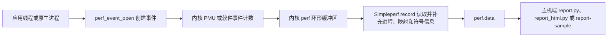

# Simpleperf 与 ARM Topdown 微架构分析

Simpleperf 是 Android 平台的原生 CPU 性能分析工具。它通过 Linux `perf_events` 子系统，也就是内核提供的性能事件接口，采集事件计数、PC（Program Counter，当前执行指令的地址）和调用栈，再把结果写入 `perf.data`。它适合回答“CPU 时间集中在哪些函数”“某段代码执行了多少条指令”“热点由哪条调用路径进入”等问题。

它不负责堆内存泄漏、Java 对象分配、完整系统调用时序或整机功耗归因。对应问题应分别使用 Heap Dump/LeakCanary、Allocation Tracking、Perfetto ftrace 和 Power Profiler；ftrace 是 Linux 内核的事件跟踪机制。Simpleperf 也能读取 PMU（Performance Monitoring Unit，处理器性能监控单元）的硬件计数器，但这些计数不能单独换算成可靠的能耗。

平台源码锚定 `android-17.0.0_r1`，内核源码锚定 `android17-6.18-2026-06_r6`。下文用“A17”简称这份 Android 17 平台源码。较早版本只用于说明兼容边界，不能用 A17 的默认值反推旧设备行为。

simpleperf 提供 Android 上的采样、硬件计数器和调用图；微架构分析继续把事件映射到前端、后端、错误推测和退休槽位。Topdown 结论必须建立在设备 PMU 支持和可复现负载上。

## 采样、调用图与硬件事件基础

### 采样模型

一次采样从内核事件开始，在主机报告结束。下面的图用于定位每一层负责的数据。



内核决定事件能否打开、何时产生样本，以及样本进入哪个 perf ring buffer（环形缓冲区，一块循环复用的内存队列）。Simpleperf 负责配置事件、持续读取记录、处理调用栈并保存分析所需的元数据。报告工具再把地址映射到库、函数和源码行。

这套模型带来三个阅读报告时必须遵守的约束：

- `record` 产生离散样本，不会记录每次函数调用。占比接近只表示所选事件的权重接近，无法证明调用次数接近。
- `cpu-cycles`、`instructions`、`task-clock` 衡量的量不同。报告里的 `Overhead` 是某条目占所选事件总权重的比例，不能一律解释为墙钟时间，也就是现实中经过的时间。
- 函数地址要配上 build ID 匹配的符号文件才能还原名称。build ID 是写在 ELF 二进制中的构建标识；采样完整而符号缺失时，报告仍会出现大量 `[unknown]`。

内核实现入口可从 [`kernel/events/core.c`](https://android.googlesource.com/kernel/common/+/refs/tags/android17-6.18-2026-06_r6/kernel/events/core.c) 和 [`include/uapi/linux/perf_event.h`](https://android.googlesource.com/kernel/common/+/refs/tags/android17-6.18-2026-06_r6/include/uapi/linux/perf_event.h) 查看。产品内核配置、SELinux 强制访问控制策略、PMU 型号和厂商限制都会影响可用事件，源码标签不能替代目标设备探测。

### 版本与权限边界

#### 版本能力

| Android 版本 | Simpleperf 能力边界 |
| --- | --- |
| Android 5.0（API 21）起 | 设备端 `simpleperf` 可执行文件受支持 |
| Android 7.0（API 24）起 | 官方 Python 采集与报告脚本受支持；Java 仅能识别已编译为本地指令的代码 |
| Android 8.x（API 26–27） | Java 仍以已编译代码为主；系统库从 Android 8.0 起携带 `.gnu_debugdata` |
| Android 9（API 28）起 | 可为解释执行、JIT（运行时编译）和 AOT（提前编译）Java/Kotlin 代码生成调用栈 |
| Android 10（API 29）起 | 发布应用可声明 `profileable`，由 shell 使用预装分析工具采样 |
| Android 16（API 36）起 | 应用采样优先由 `simpleperf_app_runner` 启动设备内置 Simpleperf；侧载二进制不再拥有获取内核样本所需的权限 |
| Android 17（API 37） | 沿用 `simpleperf_app_runner` 路径；以 `android-17.0.0_r1` 的实现为准 |

Android 9 以前的 Java 支持不等于 ART method tracing。ART 是 Android Runtime；method tracing 会记录方法进入和退出，Simpleperf 仍按 CPU 事件抽样。Android 9 起，解释器、JIT 与 AOT 代码都能进入采样调用栈。

#### 三种常见授权场景

1. `profileable` 发布应用：Android 10 起可允许 shell 使用设备预装的分析工具采样。shell 是通过 ADB 操作设备时使用的受限本机账号；这种构建的运行形态更接近 release。
2. `debuggable` 应用：允许调试器和更多开发期检查，但 debug 构建会改变 Java、JNI 和编译优化行为。Android 12 及更高版本上，A17 的 `app_profiler.py` 默认拒绝这类构建；接受该偏差后，需显式传入 `--unrepresentative_profile_debug_app`。
3. root 或 AOSP 调试设备：可分析普通发布应用、原生系统进程或全系统目标。root 表示以超级用户身份运行，userdebug/eng 则是开放更多诊断能力的系统构建；最终能力仍由内核和安全策略决定。

发布包若要接受本机 shell 采样，应在 `<application>` 中加入下面的声明。该元素开放本机性能分析能力，不会把应用改成 `debuggable`。

```xml
<manifest xmlns:android="http://schemas.android.com/apk/res/android">
    <application>
        <profileable android:shell="true" />
    </application>
</manifest>
```

`android:shell="true"` 允许 shell 通过 Simpleperf、Perfetto 等预装工具执行受控分析。它不授予任意读取进程内存或接入调试器的权限；Perfetto 的原生堆、Java 堆和 CPU profiler 仍各自执行权限检查并只返回规定的分析结果。具体限制见 [`<profileable>` 官方说明](https://developer.android.com/guide/topics/manifest/profileable-element)。

`adb shell am set-debug-app` 不会修改 APK 的 `debuggable` 或 `profileable` 属性，不能作为发布包的采样授权。`persist.simpleperf.profile_app_uid` 是供“应用内控制 Simpleperf”流程使用的系统属性，记录被临时授权的应用 UID；UID 是 Android 用来隔离应用权限的数字身份。Android 13 起，`api_profiler.py prepare --days` 可为这项授权设置有效天数。常规外部采样交给 `app_profiler.py` 处理。

### 工具位置与环境检查

NDK 发行包把设备端程序、主机端程序和 Python 脚本放在顶层 `simpleperf/` 目录，不在 LLVM 工具链的 `bin/` 目录。路径中的 `${arch}` 表示目标 CPU 架构，`${host}` 表示运行报告工具的桌面系统：

- `simpleperf/bin/android/${arch}/simpleperf`：设备端静态可执行文件。
- `simpleperf/bin/${host}/${arch}/simpleperf`：主机端报告程序。
- `simpleperf/*.py`：`app_profiler.py`、`report.py`、`report_html.py` 等脚本。

进入 NDK 的 `simpleperf/` 目录后，先让工具查询设备功能。下面的命令用于检查应用运行器、调用栈、离开 CPU 采样等能力，并列出设备接受的事件名。

```bash
./run_simpleperf_on_device.py list --show-features
./run_simpleperf_on_device.py list
```

这份输出才是当前设备的能力清单。看到事件名不表示当前 UID 一定有权打开它；采集时返回的 `permission denied`、`not supported` 或 `event not found` 分别指向权限、内核或硬件支持、事件名称等不同问题。

Android 16/17 上应使用同一版本 NDK 附带的脚本发起应用采样。脚本会优先选择 `simpleperf_app_runner`，由它在受控应用上下文中启动设备内置 Simpleperf。手工 `adb push` 一个二进制再执行，可能可以显示帮助信息，却无法获取内核样本。

### 一条可靠的应用采样路径

下面以 `profileable` 发布应用为例，记录十秒用户态 CPU 时间和 DWARF 调用栈。DWARF 是二进制中的调试与栈展开信息格式；“用户态”表示只统计 App 等普通进程执行的部分，不含内核态。命令从环境变量读取真实包名和未剥离原生库目录，缺少输入时会立即退出。

```bash
: "${PACKAGE_NAME:?请先设置目标应用的 PACKAGE_NAME}"
: "${UNSTRIPPED_LIB_DIR:?请先设置未剥离原生库目录 UNSTRIPPED_LIB_DIR}"

./app_profiler.py \
  -p "${PACKAGE_NAME}" \
  -r "-e task-clock:u -f 1000 --duration 10 -g" \
  -lib "${UNSTRIPPED_LIB_DIR}"

./report_html.py
```

这组记录参数也是 A17 `app_profiler.py` 的默认值；显式写出它们便于复现实验。脚本在当前目录生成 `perf.data`，再用 `UNSTRIPPED_LIB_DIR` 中未删除调试信息的库准备 `binary_cache/` 符号缓存。`report_html.py` 读取两者并生成 `report.html`。采样窗口内必须操作目标功能，否则报告只反映空闲或启动状态。

若要从 Activity 启动前开始采样，可把真实 Activity 名交给脚本。下面的命令要求三个环境变量均已设置。

```bash
: "${PACKAGE_NAME:?请先设置目标应用的 PACKAGE_NAME}"
: "${ACTIVITY_NAME:?请先设置要启动的 ACTIVITY_NAME}"
: "${UNSTRIPPED_LIB_DIR:?请先设置未剥离原生库目录 UNSTRIPPED_LIB_DIR}"

./app_profiler.py \
  -p "${PACKAGE_NAME}" \
  -a "${ACTIVITY_NAME}" \
  -r "-e task-clock:u -f 1000 --duration 5 -g" \
  -lib "${UNSTRIPPED_LIB_DIR}"
```

脚本会先结束目标进程、布置采样，再启动 Activity。这里的“从启动前采样”只保证覆盖进程与 Activity 启动，不会替实验清除应用数据或系统文件缓存。比较冷启动结果时，应固定应用数据、ART 编译状态、存储状态和业务输入。

#### 调用栈开销从低频开始校准

设备端 `simpleperf record` 的默认事件是 `cpu-cycles`，默认频率是每个运行中线程每秒约 4000 个样本。A17 的 `app_profiler.py` 已把应用采样默认值降为 `task-clock:u`、1000 Hz、DWARF 调用栈和十秒窗口。混合 Java/原生应用可从脚本默认值开始，再根据样本数、丢失记录、截断栈和业务扰动调低频率或缩短窗口。

采样开销受事件类型、频率、线程数、CPU 型号、栈展开方式和符号处理影响，无法用一个固定百分比覆盖。应在同一设备上比较“未采样”和“采样”两组的业务指标，并把采样频率视为实验变量。

### `stat`、`record` 与 `report`

#### `stat`：回答“消耗了多少”

`stat` 汇总事件计数，不保存每个热点位置。下面的命令用于观察目标进程在十秒内的 CPU 时间、周期数和指令数。

```bash
: "${APP_PID:?请先设置目标进程的 APP_PID}"

simpleperf stat \
  -e task-clock,cpu-cycles,instructions \
  -p "${APP_PID}" \
  --duration 10
```

若硬件事件无法打开，可以保留 `task-clock` 单独测量。`instructions / cpu-cycles` 常被称为 IPC（Instructions Per Cycle，每周期退休指令数）。异构 CPU 的各类核心采用不同微架构，PMU 约束和线程迁核也会影响聚合结果，跨设备比较尤其要谨慎。

#### `record`：回答“消耗发生在哪”

`record` 以指定事件触发样本，并把程序计数器、线程、映射及可选调用栈写入 `perf.data`。下面的命令适用于已经具备权限的设备端环境。

```bash
: "${APP_PID:?请先设置目标进程的 APP_PID}"

simpleperf record \
  -e task-clock:u \
  -f 1000 \
  -p "${APP_PID}" \
  --duration 10 \
  -g \
  -o perf.data
```

`-f 1000` 表示线程处于运行态时每秒约采样 1000 次。线程一秒只运行 200 ms 时，样本量约为 200 个。`-c` 则按事件累计值指定采样周期，例如 `-c 100000` 表示每累计十万个所选事件产生一个样本。

#### `report`：回答“样本如何归属”

下面的命令用于读取同一个 `perf.data`，显示调用图并按进程、线程、库和函数分组。

```bash
simpleperf report \
  -i perf.data \
  -g \
  --sort comm,pid,tid,dso,symbol
```

默认报告的主要维度已经包含 `comm,pid,tid,dso,symbol`：`comm` 是进程或线程名，PID 和 TID 分别是进程 ID 与线程 ID，DSO（Dynamic Shared Object）是动态共享库，`symbol` 是函数符号。显式写出排序字段有助于团队保存可复现命令。需要缩小范围时，可使用 `--comms`、`--pids`、`--tids` 或 `--dsos`。

### 事件选择与解释

#### 时间类事件

- `task-clock`：线程在 CPU 上运行的时间，适合用作 CPU 热点的直观权重。
- `cpu-clock`：软件 CPU 时钟事件，也可用于 `--trace-offcpu`。
- `cpu-cycles`：硬件周期计数；CPU 频率、微架构和迁核会改变它与时间的关系。

#### 工作量与缓存类事件

- `instructions`：退休指令数，也就是已经完成执行并提交结果的指令数；用于观察执行工作量，评估算法改动时常与 `cpu-cycles` 一起看。
- `cache-references`、`cache-misses`：通用缓存事件，但映射到哪级缓存、是否支持以及权限条件由 PMU 驱动决定。
- `raw-*`：平台专用原始事件。事件编码与 CPU 型号绑定，不能把一台设备的命令复制到另一种 SoC（System on Chip，片上系统）后直接比较。

并发采集的硬件事件超过可用 PMU 计数器时，内核可能 multiplex（分时复用）这些计数器，再按启用时间缩放结果。误差会随负载和调度变化。工程分析可采用两步：

1. 用 `task-clock` 和调用栈找出热点函数。
2. 围绕同一稳定负载，分组采集少量 PMU 事件验证瓶颈类型。

用户态后缀 `:u` 会排除内核态样本。分析应用代码时，它能减少无符号内核帧和权限干扰；分析系统调用成本时则应保留内核态，并准备匹配的内核符号。

### 调用栈与符号

#### DWARF 与帧指针（FP）

`-g` 默认选择 DWARF 调用栈。内核为样本保存寄存器和用户栈数据，Simpleperf 再用 Android 的 `libunwindstack` 库离线还原栈帧。展开依赖 ELF（Executable and Linkable Format，Android 原生二进制格式）中的 `.eh_frame`、`.debug_frame`、`.ARM.exidx` 或 `.gnu_debugdata`。A17 的默认单样本栈数据上限是 65,528 字节；深栈仍可能在到达线程入口前结束。

`--call-graph fp` 让内核沿帧指针获取调用链。它在保留帧指针的 ARM64 原生代码上开销较低；ART 不保证为 Java 代码保留合适的帧指针，32 位 ARM/Thumb 混合代码也容易断栈。选择 FP 前应确认编译参数和目标代码形态。

下面的两条采集命令读取同一组真实输入，用于在相同负载上比较 DWARF 与 FP 的栈完整度。

```bash
: "${PACKAGE_NAME:?请先设置目标应用的 PACKAGE_NAME}"
: "${UNSTRIPPED_LIB_DIR:?请先设置未剥离原生库目录 UNSTRIPPED_LIB_DIR}"

./app_profiler.py -p "${PACKAGE_NAME}" \
  -r "-e task-clock:u -f 1000 --duration 10 -g" \
  -lib "${UNSTRIPPED_LIB_DIR}"

./app_profiler.py -p "${PACKAGE_NAME}" \
  -r "-e task-clock:u -f 1000 --duration 10 --call-graph fp" \
  -lib "${UNSTRIPPED_LIB_DIR}" \
  -o perf-fp.data
```

比较时应检查 `[unknown]` 比例、栈深、热点归属和被测指标扰动。FP 报告更短时，原因可能是代码没有保留帧指针，与业务调用路径深度无关。

#### Java/Kotlin 符号

Android 9 起，Simpleperf 可处理 ART 解释器、JIT 和 AOT 代码。Android 17 源码中的 [`JITDebugReader`](https://android.googlesource.com/platform/system/extras/+/android-17.0.0_r1/simpleperf/JITDebugReader.h) 负责读取 JIT 与 DEX 调试描述；DEX 是 Android 运行时使用的字节码格式。样本仍由 perf 事件触发，读取调试信息不会把采样变成方法追踪。

经过 R8/ProGuard 混淆的 Java/Kotlin 符号需要映射文件。下面的报告命令从环境变量读取与 APK 同构建的文件。

```bash
: "${R8_MAPPING_FILE:?请先设置与 APK 同构建的 R8_MAPPING_FILE}"

./report_html.py \
  --proguard-mapping-file "${R8_MAPPING_FILE}"
```

映射文件必须来自与 APK 相同的构建产物。版本不匹配时，方法名可能无法恢复，也可能被错误的同名映射替换。

#### 原生符号

APK 内的 `.so` 动态库通常已经剥离调试信息。`app_profiler.py -lib` 应指向同一构建的未剥离库，脚本据此创建 `binary_cache/`。判断是否匹配应以 ELF build ID 为准，不能只看文件名。

已有 `perf.data` 且设备仍可连接时，可补建符号缓存。下面的命令用于从设备和本地目录收集样本涉及的二进制。

```bash
: "${PERF_DATA_FILE:?请先设置已有记录文件 PERF_DATA_FILE}"
: "${UNSTRIPPED_LIB_DIR:?请先设置未剥离原生库目录 UNSTRIPPED_LIB_DIR}"

./binary_cache_builder.py \
  -i "${PERF_DATA_FILE}" \
  -lib "${UNSTRIPPED_LIB_DIR}"
```

生成缓存后重新运行报告。若 `[unknown]` 仍集中在应用库，应检查 build ID、ABI（Application Binary Interface，二进制接口约定）、拆分 APK，以及被采样进程实际加载的路径。

### 多进程、线程与离开 CPU 时间

#### 目标选择

下面每条命令都是独立的目标选择方式，执行时只选与问题相符的一条。PID、线程 ID、进程名正则和包名都从真实环境变量读取；正则表达式用于按文本模式匹配一个或多个进程名。

```bash
# 一个或多个 PID
simpleperf record \
  -p "${PID_LIST:?请设置逗号分隔的 PID_LIST}" \
  --duration 10

# 进程名匹配给定正则
simpleperf record \
  -p "${PROCESS_NAME_REGEX:?请设置 PROCESS_NAME_REGEX}" \
  --duration 10

# 指定线程
simpleperf record \
  -t "${THREAD_ID_LIST:?请设置逗号分隔的 THREAD_ID_LIST}" \
  --duration 10

# debuggable 或 profileable 应用
simpleperf record \
  --app "${PACKAGE_NAME:?请设置 PACKAGE_NAME}" \
  --duration 10

# 全系统目标；常规产品设备通常需要 root 权限
simpleperf record -a --duration 10
```

`--app` 以包名准备应用采样，并可等待应用进程出现。多进程应用仍应在报告中保留 `pid`、`tid` 和 `comm`，否则相同库中的同名函数会被汇总，主进程与 `:remote` 进程的成本难以区分。

`-p` 接受 PID 列表或进程名正则。按名称选目标前，应保存 `adb shell ps -A -o PID,NAME` 的输出，确认没有同名测试进程进入样本。

#### 离开 CPU 采样的边界

普通 CPU 采样只在线程运行时产生样本，这段时间称为 on-CPU。线程因抢占、锁、I/O 或其他等待而未在 CPU 上执行时处于 off-CPU。`--trace-offcpu` 额外记录 `sched:sched_switch` 调度切换样本和上下文切换记录，用相邻时间戳估算线程离开 CPU 后停留在哪条调用路径。

使用前先探测内核支持。下面的命令用于确认 `trace-offcpu`，再以 `task-clock` 记录线程在 CPU 和离开 CPU 的数据。

```bash
: "${PACKAGE_NAME:?请先设置目标应用的 PACKAGE_NAME}"

./run_simpleperf_on_device.py list --show-features

./app_profiler.py \
  -p "${PACKAGE_NAME}" \
  -r "-e task-clock:u -f 1000 --duration 10 -g --trace-offcpu"

./report_html.py --trace-offcpu on-off-cpu
```

`--trace-offcpu` 要求整次记录只选择 `cpu-clock` 或 `task-clock` 中的一个事件。`on-off-cpu` 报告模式会把两类权重分开显示；离开 CPU 的权重来自调度时间戳，丢失样本或切换记录都会降低精度。若问题涉及可运行队列等待、线程唤醒者、Binder（Android 进程间通信机制）对端或 CPU 频率，Perfetto System Trace 能提供更完整的时间上下文。

### 丢样、截断栈与缓冲区

采样数据要经过内核 `perf` 环形缓冲区和 Simpleperf 用户态记录缓冲区。内核缓冲区溢出会增加 `kernelspace` 丢失记录；对栈数据超过 1 KiB 的 DWARF 样本，A17 会在用户态缓冲区紧张时先缩短栈，再丢弃样本，以保留 mmap（内存映射）和 fork（创建子进程）等还原地址空间所需的记录。

不要看到丢样就同时增大所有参数。按下列顺序定位：

1. 降低 `-f`，确认丢样是否随采样率下降。
2. 只出现内核丢样时，逐步增大 `-m`。该参数表示每个 CPU 的内核缓冲页数，必须是 2 的幂；未指定时，A17 会尝试不超过 1024 页的最大可用值。
3. 用户态缓冲区不足或栈被截断时，增大 `--user-buffer-size`。
4. 缩短采样时长、减少目标线程或改用 FP，检查数据量是否回到可控范围。
5. 每次只改一个变量，并记录工具结束时的 `Samples recorded`、`Samples lost` 和 `truncated stacks` 统计。

A17 的非全系统记录默认使用 64 MiB 或 256 MiB 用户态缓冲区：设备报告内存不超过 3 GiB 时取 64 MiB，否则取 256 MiB；全系统记录固定为 256 MiB。这是 `GetDefaultRecordBufferSize()` 的实现分支，不能据此判断某台设备需要多大缓冲区。

确认用户态丢样或截断栈后，可从环境变量传入本轮实验值。下面的命令不预设设备通用数值。

```bash
: "${PACKAGE_NAME:?请先设置目标应用的 PACKAGE_NAME}"
: "${USER_BUFFER_SIZE:?请设置带单位的 USER_BUFFER_SIZE，例如按实验选择 MiB 值}"

./app_profiler.py \
  -p "${PACKAGE_NAME}" \
  -r "-e task-clock:u -f 1000 --duration 10 -g --user-buffer-size ${USER_BUFFER_SIZE}"
```

缓冲区增大会增加分析进程的内存占用。系统内存紧张、采样目标很多或栈很深时，应同时观察被测业务是否受到分析工具干扰。A17 用户态缓冲区可用空间低于低水位时，会把 DWARF 样本中超过 1 KiB 的有效栈数据裁到 1 KiB；低于临界水位时，直接丢弃这类样本。结束日志能区分这两种结果。

Android 17 的 [`RecordReadThread`](https://android.googlesource.com/platform/system/extras/+/android-17.0.0_r1/simpleperf/RecordReadThread.h) 用独立读取线程把内核缓冲区读取与主线程处理分开，以降低 DWARF 采样的丢失概率。读取线程只能缩短排队时间；过高频率、权限限制或硬件事件溢出仍需单独处理。

### 报告与时间线工具

#### 文本和 HTML 报告

文本报告适合自动化对比。下面的命令从环境变量读取真实库名，显示调用图并限制到该原生库。

```bash
: "${TARGET_DSO:?请先设置要分析的 TARGET_DSO}"

./report.py \
  -g \
  --dsos "${TARGET_DSO}"
```

`--dsos` 只保留匹配库的样本；调用图仍需要采集阶段已经记录调用栈。

HTML 报告适合交互检查。下面的命令从环境变量读取与二进制同提交的源码树，并加入源码与反汇编视图。

```bash
: "${SOURCE_ROOT:?请先设置与二进制同提交的 SOURCE_ROOT}"

./report_html.py \
  --add_source_code \
  --source_dirs "${SOURCE_ROOT}" \
  --add_disassembly
```

源码注释依赖调试行号信息、源码路径和当前文件内容。构建机路径无法在本机解析时，`--source_dirs` 应指向对应提交的源码树。

#### 转为 Perfetto/Android Studio 可读格式

Simpleperf 的 `perf.data` 可由 `report-sample` 转成 protobuf，也就是按协议定义编码的二进制消息。Android Studio CPU Profiler 官方支持这种格式；Android 17 的 Perfetto Trace Processor 也包含 Simpleperf protobuf 解析器。下面的命令保留调用链并生成 `perf.trace`。

```bash
simpleperf report-sample \
  --protobuf \
  --show-callchain \
  -i perf.data \
  -o perf.trace
```

生成的文件可在 Android Studio CPU Profiler 中打开；Android 17 对应版本的 Perfetto UI 和 Trace Processor 也能解析。转换入口是 `report-sample`；`--show-callchain` 决定输出中是否包含调用链。若要兼容其他版本的 Perfetto UI，AOSP 当前还提供 `gecko_profile_generator.py` 和 `report_sample.py` 两条转换路径。

Perfetto Trace Processor 会把这种 protobuf 中的样本导入 `cpu_profile_stack_sample` 和栈分析表。Android 17 导入器会忽略 Simpleperf 的 `ContextSwitch` 记录，也没有把 `event_type` 与丢样信息完整映射成时间线语义。它适合查看样本火焰图，无法替代包含调度数据的系统跟踪。

Perfetto 的 `linux.perf` 是另一套采集入口，由 `traced_perf` 组件调用 `perf_event_open` 并直接向 Perfetto 会话写入调用栈样本。这样采到的样本能与 ftrace 数据共享时间轴。已经生成的 Simpleperf `perf.data` 属于另一场采集，不会自动并入新会话。

下面的 A17 配置以真实系统进程 `surfaceflinger` 为目标，按 100 Hz 采集用户态调用栈，并在同一会话加入调度和进程信息。SurfaceFlinger 是 Android 负责合成屏幕图层的系统服务；采样这类系统进程通常需要 userdebug/eng 构建或等价权限。

```protobuf
duration_ms: 10000

buffers {
  size_kb: 40960
  fill_policy: DISCARD
}

data_sources {
  config {
    name: "linux.perf"
    perf_event_config {
      timebase {
        counter: SW_CPU_CLOCK
        frequency: 100
        timestamp_clock: PERF_CLOCK_BOOTTIME
      }
      callstack_sampling {
        scope {
          target_cmdline: "surfaceflinger"
        }
      }
    }
  }
}

data_sources {
  config {
    name: "linux.ftrace"
    ftrace_config {
      ftrace_events: "sched/sched_switch"
      ftrace_events: "sched/sched_waking"
    }
  }
}

data_sources {
  config {
    name: "linux.process_stats"
    process_stats_config {
      scan_all_processes_on_start: true
    }
  }
}
```

`SW_CPU_CLOCK` 是触发采样的软件 CPU 时钟，`PERF_CLOCK_BOOTTIME` 让样本时间戳采用包含休眠时间的系统启动时钟，便于与 Android system trace 对齐。`callstack_sampling` 未显式配置 `kernel_frames`，所以示例只保留默认的 DWARF 用户态栈；`linux.ftrace` 补充切换与唤醒事件，`linux.process_stats` 补充进程元数据。字段定义可在 Android 17 的 [`perf_event_config.proto`](https://android.googlesource.com/platform/external/perfetto/+/refs/tags/android-17.0.0_r1/protos/perfetto/config/profiling/perf_event_config.proto) 和 [`perf_events.proto`](https://android.googlesource.com/platform/external/perfetto/+/refs/tags/android-17.0.0_r1/protos/perfetto/common/perf_events.proto) 中核对。函数热点和源码归属优先使用 Simpleperf；需要把调用栈与调度、Binder、频率、帧时间放在同一时间轴时，使用 Perfetto `linux.perf` 加 ftrace。

### Android 17 源码实现要点

#### 应用运行器的版本分支

下面的摘录用于说明 Android 16/17 为什么优先使用设备内置 Simpleperf，代码来自 `android-17.0.0_r1` 的 `environment.cpp`。

```cpp
// Before Android 16, we prefer using run-as, which can use the latest sideloaded simpleperf.
// After Android 16, sideloaded simpleperf has no permission to get kernel samples. So prefer
// using simpleperf_app_runner to run simpleperf shipped on device.
bool prefer_simpleperf_app_runner = GetAndroidVersion() >= kAndroidVersion16;
```

后续分支在 Android 16/17 上先尝试 `simpleperf_app_runner`，旧版本先尝试 `run-as`。因此，A17 应用采样应由 `app_profiler.py` 协调设备内置程序，完整上下文见 [`environment.cpp`](https://android.googlesource.com/platform/system/extras/+/android-17.0.0_r1/simpleperf/environment.cpp#841)。

#### 采集与展开模块

| 模块 | Android 17 中的职责 |
| --- | --- |
| [`event_selection_set.cpp`](https://android.googlesource.com/platform/system/extras/+/android-17.0.0_r1/simpleperf/event_selection_set.cpp) | 组织事件、CPU、线程和 perf 事件文件描述符（内核对象句柄），启动记录读取线程 |
| [`RecordReadThread.cpp`](https://android.googlesource.com/platform/system/extras/+/android-17.0.0_r1/simpleperf/RecordReadThread.cpp) | 从内核缓冲区读取记录，管理用户态缓冲、栈裁剪和数据通知 |
| [`OfflineUnwinder.h`](https://android.googlesource.com/platform/system/extras/+/android-17.0.0_r1/simpleperf/OfflineUnwinder.h) | 用采样寄存器、栈和映射执行离线 DWARF 展开 |
| [`JITDebugReader.h`](https://android.googlesource.com/platform/system/extras/+/android-17.0.0_r1/simpleperf/JITDebugReader.h) | 读取 ART JIT/DEX 调试描述，维护 JIT 代码符号 |
| [`cmd_record.cpp`](https://android.googlesource.com/platform/system/extras/+/android-17.0.0_r1/simpleperf/cmd_record.cpp) | 解析 `record` 参数，协调记录、映射、展开和文件写入 |
| [`record_file_writer.cpp`](https://android.googlesource.com/platform/system/extras/+/android-17.0.0_r1/simpleperf/record_file_writer.cpp) | 写入 `perf.data` 及其特性段 |
| [`scripts/app_profiler.py`](https://android.googlesource.com/platform/system/extras/+/android-17.0.0_r1/simpleperf/scripts/app_profiler.py) | 配置应用目标、默认采样参数、Activity 启动和二进制缓存收集 |

这些模块解释了两个常见现象：采样期间看到的栈可能在写盘前经过离线展开；JIT 方法名依赖运行时调试信息，不能只靠 APK 内静态符号恢复。

### 温度、频率与异构 CPU

Simpleperf 记录的是设备当时执行出来的数据。温控降频、任务迁核和后台负载会改变同一业务路径的 `task-clock`、`cpu-cycles` 与样本分布。

分析 big.LITTLE 或更多 CPU 簇时，应保存以下实验条件。big.LITTLE 泛指由高性能核与高能效核组成的异构 CPU 架构：

- 设备型号、系统构建号、内核版本和电量状态；
- 前台/后台状态、屏幕亮度、网络与充电状态；
- 测试前温度区间和每轮冷却策略；
- 业务输入、迭代次数、编译模式与应用版本；
- Simpleperf 事件、频率、调用栈模式和权限路径。

不要关闭温控服务、修改 `sysctl` 内核运行参数、解除厂商 PMU 限制或强制锁频来“修复”采样。此类修改会改变调度和功耗环境，也可能损害设备。需要解释频率和调度时，可另采 Perfetto 的 `power/cpu_frequency`、调度与温控数据；目标设备是否开放对应跟踪点仍由产品配置决定。

跨 CPU 簇聚合 `cpu-cycles` 时，一个周期在不同微架构上的含义并不相同。可先用 `task-clock` 排热点，再用 `simpleperf report --cpu` 为各 CPU 簇分别过滤样本。`report` 不支持按 CPU 作为排序列，CPU 簇列表也必须来自目标设备拓扑。若优化前后的线程落在不同 CPU 簇，单个全局 IPC 数字很容易掩盖迁核造成的变化。

### 结果复核清单

采集完成后，按以下问题检查报告：

- 目标包、PID、进程名和采样时段是否正确？
- 业务操作是否完整覆盖采样窗口？
- 事件是否在目标设备成功打开？是否发生 PMU 复用？
- 结束日志里是否出现 `Samples lost` 或 `truncated stacks`？
- `[unknown]` 是否集中在应用库？build ID 与映射文件是否匹配？
- Java、JIT、AOT 和原生帧是否符合系统版本能力？
- `Overhead` 表示哪一种事件权重？是否被误写成墙钟耗时？
- 优化前后是否使用相同设备状态、输入、频率和调用栈方式？
- 热、频率、迁核或后台任务能否解释差异？
- 结论能否由另一轮采样、微基准或 Perfetto 时间线交叉验证？

这份清单能拦住两类误判：把采样噪声当成业务变化，以及把符号或权限缺失当成“代码没有执行”。


## Android 17 采集能力与微架构工作流

基础采样回答热点在哪里，Android 17 的事件支持和工作流用于进一步确认缓存、分支和流水线瓶颈。

前文讲解了 Simpleperf 的常规 PMU（Performance Monitoring Unit，处理器性能监控单元）采样。Android 17 在这套基础上加入 SPE（Statistical Profiling Extension，统计分析扩展）的采集与解码，并改进后台采集、应用进程跟踪和 ETM profile（性能数据）转换。这里的“微架构”指缓存、地址转换和分支预测等处理器内部行为。讨论范围限于已经进入 `android-17.0.0_r1` 的实现；设备能否使用这些能力，仍由 SoC（System on Chip，片上系统）、内核配置和权限共同决定。

Android 16 与 Android 17 的差异需要分开看：

| 能力 | Android 16 | Android 17 |
|---|---|---|
| Arm SPE | Simpleperf 尚无 `SPERecorder` / `SPEDecoder` | 新增 SPE 发现、采集和 `report` 解码 |
| CoreSight TRBE | `ETMRecorder` 已能识别 ETR 与 TRBE，发现 TRBE 时已把 sink 选择交给内核 | 列出多个 ETR 名称、记录 TRBE 支持的 CPU，并按 CPU 判断通用事件是否实际使用 TRBE |
| `record --background` | 无此选项 | 新增单次 `fork()` 的后台模式 |
| `--app` | `record`、`stat` 已支持 | `stat --monitor-new-thread` 可继续发现同一包名的新进程 |
| devfreq / `pmu_lib` | `--use-devfreq-counters` 已能临时切换并恢复 `mem_latency` governor | 保留原流程，并在未找到该 governor 时增加 `pmu_lib` 后备路径与恢复动作 |
| 内核模块 ETM AutoFDO | 已识别模块 DSO，但 branch-list 未保存运行时模块信息，`.ko` 也缺少可供转换器使用的 program header | 保存模块内存范围与首个符号，并从 `.text` section 建立 AutoFDO 偏移映射 |

DSO（Dynamic Shared Object）在 Simpleperf 中是被分析二进制的对象抽象，范围也包括内核与内核模块。branch-list 是序列化保存已解码分支路径的中间文件；ELF program header 描述运行时装载段，`.text` section 则保存机器指令。AutoFDO 是一种基于实际执行数据的反馈优化格式，编译器可用其中的指令范围和分支计数调整代码布局。生成 profile 只准备了优化输入，不代表编译产物一定会变快。

### 先分清 PMU、SPE 和 ETM

三种机制都可以由 Simpleperf 驱动，但它们回答的问题不同。

| 机制 | 输入数据 | 适合回答的问题 | 主要代价 |
|---|---|---|---|
| PMU 计数与溢出采样 | cycles、instructions、cache miss 等事件 | 哪些函数消耗 CPU，事件率是否异常 | 计数器数量有限；采样依赖溢出中断 |
| SPE 统计采样 | CPU 生成的 SPE packet | 哪些指令与访存、TLB、分支事件相关 | 依赖可选硬件和 AUX 缓冲；当前解码器只使用部分字段 |
| ETM/ETE 指令 trace | 控制流 trace | 执行过哪些分支路径，如何生成 AutoFDO profile | 数据量大，容易因 sink 与缓冲压力丢失 trace |

SPE packet 是硬件写出的一条采样记录；TLB（Translation Lookaside Buffer）是缓存虚拟地址到物理地址转换结果的结构；AUX 则是 Linux perf 为大体积硬件 trace 准备的辅助缓冲区。SPE 从 Armv8.2-A 起成为可选扩展，运行在 AArch64，也就是 64 位 Arm 执行状态中，不以 Armv9 为前提。

ETM（Embedded Trace Macrocell）和 ETE（Embedded Trace Extension）是 CoreSight 中的指令控制流 trace 源。CoreSight 是 Arm 的片上硬件跟踪框架；sink 指接收并保存 trace 的终点。TRBE（Trace Buffer Extension）是每 CPU 的内存 sink，ETR（Embedded Trace Router）则可把 trace 写入系统内存。二者都不负责生成 SPE 微架构样本。

### Android 17 的 SPE 采集链路

#### 从 sysfs 事件到 AUX 数据

Android 17 的 `SPETypeFinder` 会扫描 `/sys/bus/event_source/devices/arm_spe*`。`sysfs` 是内核把设备属性暴露给用户空间的虚拟文件系统；发现逻辑从中读取 PMU 数字类型 `type` 和 `format/*` 配置位，并把 `arm_spe` 作为默认设备 `arm_spe_0` 的别名。`SPERecorder` 还会读取：

- `caps/min_interval`：CPU 建议的最小采样间隔，并非硬件强制下限；读取失败时，Simpleperf 把采样周期设为 4096。
- 每个在线 CPU 的 MIDR（Main ID Register，处理器型号与版本标识）：解码时据此判断 SPE 版本和 CPU 型号。
- PMU `type`：交给 `perf_event_open()` 创建使用 AUX 缓冲的性能事件。

一次 `record` 命令只能选择一个 SPE 设备。带配置的事件名采用 sysfs 暴露的字段，例如 `arm_spe_0/<field>=<value>/`；字段名称不应从其他芯片照搬。

开始采集前，可以用下面的命令核对目标设备实际暴露的事件。它的用途是阻止脚本把“不支持 SPE”和“权限不足”混为一类错误：

```bash
adb shell su root simpleperf list | grep arm_spe
adb shell 'ls -d /sys/bus/event_source/devices/arm_spe* 2>/dev/null'
```

`su root` 表示切换为超级用户。两条命令都没有输出时，当前内核没有向 perf 子系统注册 SPE PMU。sysfs 存在而 `record` 失败时，再检查 root、SELinux 强制访问控制策略、perf 权限和事件配置。

目标设备支持通用 `arm_spe` 事件后，可以用以下流程采集一个已经运行的应用进程：

```bash
target_pid=$(adb shell pidof -s com.example.app)
adb shell su root simpleperf record \
  -e arm_spe -p "$target_pid" --duration 10 \
  -o /data/local/tmp/spe.data
adb shell su root simpleperf report \
  -i /data/local/tmp/spe.data
```

`pidof -s` 只取一个匹配进程的 PID（Process ID，进程编号）。`record` 把原始 SPE packet 写入 perf AUX 数据，`report` 再调用 `SPEDecoder` 生成可聚合的 sample。示例使用 root，是因为量产设备通常不允许 shell 任意分析其他进程；可调试应用还可以按前文的 `run-as` 流程操作。

#### 当前解码器能给出什么

`SPEDecoder` 会从 packet 中提取采样指令虚拟地址（也称 IP，Instruction Pointer）、数据虚拟地址、上下文线程 ID 和事件位。Android 17 能据此生成的事件包括：

- architecturally retired；
- L1 data cache access / refill；
- TLB access / walk；
- branch condition not taken / branch mispredicted；
- LLC access / miss；
- remote access、misalignment；
- SPE 新版本提供的 L2 access / miss 等事件。

这些名称来自 decoder 的事件表。LLC 指 last-level cache，也就是处理器缓存层级中的末级缓存；实际事件集合还受 CPU 所实现 SPE 版本的约束。报告中的地址能帮助定位关联指令或数据访问，但“被采样到”仍属于统计结果，不能解释为对每一次 load/store（内存读写）的完整追踪。

Android 17 的 decoder 没有把以下 packet 信息转换成 perf sample 字段：

| 尚未输出的字段 | 对分析结论的限制 |
|---|---|
| `PERF_SAMPLE_DATA_SRC` | 该 perf 标准字段没有写入，因此无法直接给出 L1、L2、LLC、内存构成的逐级访问来源 |
| operation type | 不能仅凭报告稳定区分 load、store 或其他操作 |
| branch target / previous branch | 不能从 SPE 报告还原完整分支路径 |
| physical address | 报告只使用虚拟地址 |
| latency counter / `PERF_SAMPLE_WEIGHT` | 不能报告 issue 到完成的周期数 |
| timestamp | 当前生成的 sample 时间为 0，不能用它与其他 trace 做逐样本时间对齐 |

因此，`simpleperf report --spe-cache-miss` 不是 Android 17 的有效命令，固定的“缓存延迟链”和“TLB walk 深度”也不是当前报告能够提供的数据。需要这些字段时，应先检查后续平台版本的 decoder 是否已经实现，再决定分析方案。

#### 采样事件不能简单相加

一条 SPE record 可以同时携带多个事件位。Android 17 的 `report` 会为这些事件分别建立视图，同一条 record 可能同时计入 L1 refill、TLB walk 和 remote access。各类 sample 数量适合分别排序热点，不适合相加后当作互斥事件总数。

SPE 的 packet 由硬件写入 profiling buffer，不要求每个样本触发一次 PMU 溢出中断。不过，Linux SPE 驱动仍要处理 AUX 缓冲区装填、截断、碰撞和 IRQ（Interrupt Request，硬件中断请求）。采样间隔过小或缓冲消费不及时会产生丢失记录。开销与丢失率必须在目标设备和目标负载上测量，不能套用固定百分比。

### TRBE 是 CoreSight sink

CoreSight 链路可以概括为：

> CPU 上的 ETM/ETE 生成控制流 trace → CoreSight 选择 sink → ETR 或每 CPU 的 TRBE 把 trace 保存到内存

TRBE 是每 CPU 的 trace sink，对应 CPU 的 ETE 可以把 trace 写入该 CPU 的内存缓冲。缓冲到达边界时，内核驱动通过 maintenance IRQ（维护中断）更新 AUX 状态；wrap（写指针绕回）、碰撞、截断和硬件 erratum（已知设计缺陷）都可能造成 trace gap，也就是控制流记录缺口。由此不能推出“独立带宽必然无丢包”或“固定低延迟”。

#### Android 17 的选择逻辑

Android 16 的 `ETMRecorder::FindSinkConfig()` 已能识别 ETR 和 TRBE，并在发现 TRBE 时把 `config2` 设为 0，让内核选择合适的 sink。`config2` 是 `perf_event_attr` 中用于传递 CoreSight sink 配置的字段。Android 17 的变化集中在更细的 sink 建模：

- `CheckSinkSupport()` 收集所有可用 ETR 配置，并保存支持 TRBE 的 CPU ID。
- 事件列表除通用 `cs-etm` 外，还可以列出 `cs-etm/@tmc_etr0/` 这类显式 ETR 事件。
- 通用 `cs-etm` 在存在可用 TRBE 时令 `config2` 为 0，交给内核按 CPU 选择 TRBE；没有 TRBE 时选择可用的 ETR。
- 显式 ETR 事件把对应 sink 配置写入 `config2`。
- `IsUsingTRBE()` 同时检查 `config2` 和目标 CPU 是否支持 TRBE。

目标设备的 sink 名称由内核提供，下面的命令用于查看 Simpleperf 已经识别出的实际事件：

```bash
adb shell su root simpleperf list | grep cs-etm
```

只有列表中出现显式 ETR 事件时，才能指定它与默认 `cs-etm` 做对照。默认事件是否使用 TRBE 还取决于采集 CPU 的支持集合，不能只根据产品宣传材料判断。

下面的命令用于做一次短时的系统级内核指令 trace，以便先检查权限、sink 和数据丢失情况：

```bash
adb shell su root simpleperf record \
  -a -e cs-etm:k --duration 5 \
  -o /data/local/tmp/kernel-etm.data
```

`:k` 将事件限制在内核态。系统级 ETM 通常要求 root；Simpleperf 也会阻止应用 UID（Android 用于隔离应用的数字身份）采集内核 ETM，以免泄露受 KASLR（Kernel Address Space Layout Randomization，内核地址空间布局随机化）保护的地址。

### `record --background` 的进程语义

Android 17 新增的 `--background` 适合脚本启动有限时长的采集。实现只调用一次 `fork()`，也就是从当前进程复制出一个子进程：

1. 父进程打印子进程 PID，然后成功返回。
2. 子进程忽略终端断开时常见的 `SIGHUP` 信号，并调用 `setsid()` 脱离原会话、创建新会话。
3. 子进程把标准输入、标准输出和标准错误重定向到 `/dev/null` 空设备，随后执行采集。

这里没有第二次 `fork()`。命令行解析发生在分叉前，但输出文件准备和正式采集发生在子进程中。分叉后的报错不会出现在当前终端，所以后台采集应使用绝对输出路径，并在长任务前做一次短时前台预检。

下面的脚本在设备端定位目标进程、启动 60 秒采集，并在主机端保存 Simpleperf 返回的后台 PID。它假设当前设备端 `simpleperf` 已有采样目标的权限；`--background` 不会绕过 profileable、root、SELinux 或内核权限：

```bash
background_pid=$(adb shell '
  target_pid=$(pidof -s com.example.app) &&
  simpleperf record --background \
    -p "$target_pid" --duration 60 \
    -o /data/local/tmp/app-perf.data
')
printf 'simpleperf background pid: %s\n' "$background_pid"
```

父进程输出的是纯 PID，便于脚本保存。若 `background_pid` 为空，应立即检查包进程、权限和前台预检结果，不要等待输出文件凭空出现。

需要提前结束采集时，向这个 PID 发送 `SIGINT` 中断信号，让 Simpleperf 关闭事件并写完 `perf.data`：

```bash
adb shell kill -INT "$background_pid"
adb shell ls -l /data/local/tmp/app-perf.data
```

`SIGKILL` 会强制终止进程，不给清理逻辑执行机会，可能留下不完整数据；它不适合作为常规停止方式。后台模式也不等同于无人值守的全天采集，文件增长、设备温度、丢样和静默失败仍需外部监控。

### `--app` 与新进程跟踪

`--app <package>` 在 Android 16 已经存在。它让 Simpleperf 等待包对应的初始进程；非 root 场景依赖 `run-as`，目标 APK 必须允许调试。Android 16 的 `NewThreadMonitor` 已能扫描初始 PID 集合中的新线程。Android 17 的增量是让 `stat` 在 `--app` 场景继续发现同包名进程：

- 只有启用 `--monitor-new-thread` 时才持续扫描新进程与线程。
- 扫描器遍历 `/proc` 进程信息，读取进程对应的应用包名，把新出现且包名匹配的进程加入监控。
- 新进程加入后，它的现有线程和随后创建的线程都可以成为统计目标。
- 帮助文本要求把该选项与 `--per-thread --no-inherit` 配合使用。

下面的命令用于观察应用冷启动期间出现的同包名进程和线程。先停止旧进程，再让第一条 adb 在主机后台等待，随后启动应用：

```bash
adb shell am force-stop com.example.app

adb shell simpleperf stat \
  --app com.example.app \
  --per-thread --no-inherit --monitor-new-thread \
  --duration 10 &
stat_adb_pid=$!

adb shell am start -n com.example.app/.MainActivity
wait "$stat_adb_pid"
```

这里的 `stat_adb_pid` 是主机端 adb 进程，不是设备上的 Simpleperf PID。`--app` 单独使用时，不应宣称它会持续纳入全部后续子进程；动态纳入依赖 `--monitor-new-thread`。

### `--use-devfreq-counters` 与 `pmu_lib`

devfreq 是 Linux 为内存控制器等非 CPU 设备提供的动态频率框架，governor 是它选择频率的策略。`--use-devfreq-counters` 在 Android 16 已存在；Android 17 新增的是 `pmu_lib` 供应商驱动后备路径。相关处理位于 `DevfreqCounters::Use()`，只在显式传入该选项时运行，而且要求 root。

处理顺序如下：

1. 扫描 `/sys/class/devfreq/*/governor`。
2. 读取各节点的 governor；值恰好为 `mem_latency` 时记录文件路径，并临时写入 `performance`。
3. 只有未找到这类节点时，才检查 `/sys/devices/system/cpu/pmu_lib/enable_counters`。
4. 文件当前值为 `1` 时写入 `DEADBEEF`，对象析构时写入 `BEEFDEAD`。

这两个 magic value（约定好的特殊常量）来自供应商驱动，不能推广为通用 PMU 控制接口。路径不存在时，Simpleperf 跳过该后备路径。

下面的命令只适合受控、已 root 的实验设备，用于在需要 devfreq 计数器的统计任务中触发这套流程：

```bash
adb shell su root simpleperf stat \
  --use-devfreq-counters \
  -e cpu-cycles,instructions \
  --duration 10 -a
```

该选项会改变内存延迟相关 governor 或暂时停用供应商计数器，测量结果也会受到状态切换影响。正常退出时，`DevfreqCounters` 对象的析构逻辑负责恢复；进程被 `SIGKILL` 或崩溃时，恢复逻辑没有机会运行。实验脚本应在运行前后记录 governor 和 `enable_counters`，发现状态未恢复时按设备内核文档处理。

### 从内核模块 ETM trace 生成 AutoFDO profile

内核模块 `.ko` 是可动态装载的 ELF 目标文件，通常没有描述运行时装载段的 program header。`KernelModuleDso` 在 Android 16 已存在，但当时 `inject` 的通用转换路径没有携带足够的模块运行时信息，也无法从 program header 得到 AutoFDO 所需的可执行范围。Android 17 改进了两段链路：

- 生成 branch-list 时保存模块的内存起止地址和首个符号；转换时据此重建 `KernelModuleDso`，把 trace 内存地址对齐到 `.ko` 文件地址。
- 从存放机器指令的 `.text` section 构造一个只用于文件偏移换算的伪可执行 segment。
- 支持从 ETM `perf.data` 直接生成 AutoFDO，也支持先转成 branch-list 再生成。

源码测试以 zram 模块数据覆盖这两条转换路径。zram 是把压缩数据保存在内存中的块设备内核模块。测试证明的是地址映射和格式转换能力，不代表 zram 或其他模块会自动获得固定比例的性能提升。

采集阶段可以使用前文的内核 ETM 命令。把数据拉到构建主机后，先把 `module_symdir` 设为匹配设备构建产物中存放未剥离符号模块的目录。下面的命令会拒绝未设置的变量，并把输出限定到 zram 模块：

```bash
adb pull /data/local/tmp/kernel-etm.data ./kernel-etm.data

: "${module_symdir:?set module_symdir to the matching unstripped module directory}"
simpleperf inject \
  -i kernel-etm.data \
  --symdir "$module_symdir" \
  --binary 'zram\.ko$' \
  --output autofdo \
  -o zram.afdo
```

`--symdir` 会递归查找调试二进制和模块，Android 17 没有 `--kernel-module-dir` 选项。输入的 `perf.data` 或 branch-list 需要包含模块 map（运行时地址区间记录），地址对齐还依赖采集时保存的 kallsyms（内核符号表）首符号信息；主机上的 `.ko` 也要与设备运行版本和 build ID 对应。若一个 AutoFDO 文件包含多个二进制，Simpleperf 会提示拆分；`--binary` 可在转换时把范围限定到单个模块。

生成 `zram.afdo` 只完成 profile 制备。能否用于内核模块构建、编译器接受哪种 profile，以及优化后是否改善目标负载，都要由对应 Android 17 内核构建规则和基准测试确认。

### 选择分析手段

| 现象 | 优先工具 | 原因 |
|---|---|---|
| 不清楚 CPU 时间消耗在哪些函数 | PMU `cpu-cycles` 采样 | 覆盖面广，调用栈和符号工作流成熟 |
| 怀疑访存、TLB 或分支事件集中在少量指令 | SPE | 可按采样 IP、数据地址和事件位聚合 |
| 需要完整控制流或生成 AutoFDO profile | ETM/ETE | 提供可解码的分支路径 |
| 需要调度、Binder 进程间通信、频率和帧时序上下文 | Perfetto | 提供系统时间线；SPE 报告当前不能逐样本时间对齐 |

一个稳妥的调查顺序是：用 Perfetto 或常规 PMU 缩小问题范围，再按问题类型选择 SPE 或 ETM。SPE 和 ETM 都可能增加数据量与系统负载，应先做短时预检，再记录同一设备、同一负载下的对照基线，并检查丢失记录。

### 核验清单

- `simpleperf list` 中确认目标 SPE 或 `cs-etm` 事件存在。
- 从 sysfs 核对 SPE 配置字段，不复制其他 SoC 的事件字符串。
- SPE 报告不宣称 Android 17 decoder 尚未输出的 latency、`data_src`、物理地址或时间戳。
- 多个 SPE 事件视图不相加为互斥总数。
- TRBE 按 sink 理解，并检查 CPU 支持集合与 trace 丢失。
- 后台采集先做前台预检，保存 PID，使用绝对路径和有限 `--duration`。
- 应用动态进程统计显式启用 `--per-thread --no-inherit --monitor-new-thread`。
- `--use-devfreq-counters` 只在 root 实验设备使用，并核对状态恢复。
- 内核模块 AutoFDO 使用匹配设备且未剥离符号的 `.ko` 和 build ID，并用 `--binary` 限定单个模块。
- 所有性能收益都由目标工作负载的前后对照测量给出，不引用与当前设备无关的固定比例。

### 源码索引

- [SPERecorder.cpp：SPE PMU 发现、配置与 AUX 元数据](https://android.googlesource.com/platform/system/extras/+/refs/tags/android-17.0.0_r1/simpleperf/SPERecorder.cpp)
- [SPEDecoder.cpp：packet 解码、事件映射与当前未实现字段](https://android.googlesource.com/platform/system/extras/+/refs/tags/android-17.0.0_r1/simpleperf/SPEDecoder.cpp)
- [event_selection_set.cpp：SPE min_interval 与 AUX 缓冲配置](https://android.googlesource.com/platform/system/extras/+/refs/tags/android-17.0.0_r1/simpleperf/event_selection_set.cpp)
- [ETMRecorder.cpp：TRBE / ETR sink 发现与选择](https://android.googlesource.com/platform/system/extras/+/refs/tags/android-17.0.0_r1/simpleperf/ETMRecorder.cpp)
- [cmd_record.cpp：`--background` 进程模型](https://android.googlesource.com/platform/system/extras/+/refs/tags/android-17.0.0_r1/simpleperf/cmd_record.cpp)
- [cmd_stat.cpp：应用新线程监控与 devfreq / pmu_lib 保护](https://android.googlesource.com/platform/system/extras/+/refs/tags/android-17.0.0_r1/simpleperf/cmd_stat.cpp)
- [cmd_inject.cpp：内核模块 DSO 地址映射与 AutoFDO 输出](https://android.googlesource.com/platform/system/extras/+/refs/tags/android-17.0.0_r1/simpleperf/cmd_inject.cpp)
- [arm_spe_pmu.c：Android 17 内核 SPE AUX 缓冲与 IRQ 处理](https://android.googlesource.com/kernel/common/+/refs/tags/android17-6.18-2026-06_r6/drivers/perf/arm_spe_pmu.c)
- [coresight-trbe.c：Android 17 内核 TRBE per-CPU sink 驱动](https://android.googlesource.com/kernel/common/+/refs/tags/android17-6.18-2026-06_r6/drivers/hwtracing/coresight/coresight-trbe.c)


## ARM Topdown 分类与反证

硬件事件采集完成后，Topdown 将 pipeline slot 分类。事件可用性、复用比例和 SoC 定义必须随结果一起记录。

### Topdown 能回答什么

一次 CPU 性能分析通常会遇到两个不同的问题：

- 处理器把可用的执行机会消耗在了哪里；
- 哪段代码、哪条指令或哪类数据访问造成了这些消耗。

Topdown（自顶向下微架构分析）处理前一个问题。处理器流水线会重叠执行取指、解码、发射和退休等阶段，其中“退休”表示把指令结果正式提交为程序可见状态；Topdown 把这些阶段可用的执行机会归入少量类别，帮助工程师决定下一轮该查取指、分支、数据访问，还是执行单元。函数热点、调用栈、指令地址和内存地址仍要交给采样工具定位。

因此，Topdown 是诊断顺序，不是优化处方。看到 Backend Bound 偏高后直接加预取，或者看到 Frontend Bound 偏高后直接改链接布局，都缺少中间的归因证据。

平台锚点是 Android 17 / API 37 与 AOSP `android-17.0.0_r1` 中的 simpleperf。Arm Telemetry Solution 的示例公式来自它支持的具体 CPU 数据库；这些公式不能自动套到任意 Android SoC（System on Chip，片上系统）。

结论范围限于参考资料列出的版本：AOSP simpleperf、Android common kernel 的 perf 权限说明，以及 Arm 对 Topdown/Telemetry Solution 的公开文档。厂商内核补丁、后续平台版本的 simpleperf 变化、SoC 私有 PMU（Performance Monitoring Unit，硬件性能监控单元）扩展和商业性能工具链不在范围内。

### Intel TMAM 与 Arm Topdown 的关系

Ahmad Yasin 在 2014 年 ISPASS 论文中提出了面向 Intel 乱序处理器的 Top-Down 分析方法。乱序处理器会在保持程序可见结果不变的前提下调整内部操作的执行顺序。论文用 pipeline slot（流水线执行机会）统计 Retiring、Bad Speculation、Frontend Bound 和 Backend Bound；后来 Intel 将这套体系扩展为多级 TMAM（Top-Down Microarchitecture Analysis Method）。

Arm 当前也有官方 Topdown Methodology，并由 Arm Telemetry Solution 提供事件定义、CPU 数据库和 `topdown-tool`。这里的 telemetry specification 是某款 CPU 对 PMU 事件、指标公式和分析分组的定义。Arm 官方的跨平台说明保留了相同的四个一级名称，同时明确指出 Arm 与 Intel 使用不同的 PMU 事件、计算公式和工具。

| 项目 | Intel TMAM | Arm Topdown |
| --- | --- | --- |
| 一级分类 | Retiring、Bad Speculation、Frontend Bound、Backend Bound | 同名四类 |
| 计数事件 | Intel 型号专属事件与 perf metric | Arm CPU 对应的 PMU 事件 |
| 公式参数 | 由 Intel 微架构定义 | 由 Arm CPU telemetry specification 定义 |
| 官方工具 | Linux perf 的 Topdown/metric 支持及 Intel 工具 | Arm Telemetry Solution 的 `topdown-tool` |
| Android 17 现成入口 | 没有通用入口 | simpleperf 可采集设备支持的事件，但不计算四类指标 |

四个名称相同，不表示分母、流水线宽度、错误分支恢复代价也相同。把 Intel 的公式换成 Arm 事件名，结果通常没有物理含义。

#### Slot 不是 CPU cycle

Slot 表示一个周期内处理器理论上可以接收或处理的一次操作机会。超标量处理器能在同一周期处理多个操作，因此每周期有多个 slot。某个公式若采用 8 slots/cycle，分母就可能写成 `8 × CPU_CYCLES`。

这个 8 属于具体 CPU 定义。它不能根据 Armv8、Armv9 或 Android API 级别推导，也不能从 IPC（Instructions Per Cycle，每周期退休指令数）反推。Retiring 指标统计公式定义下的退休 slot 占比，两者不是同一个量。

#### 四个一级类别

| 类别 | 计量含义 | 下一轮常查方向 | 常见误读 |
| --- | --- | --- | --- |
| Frontend Bound | 前端没有及时向后端提供操作所损失的 slot | I-cache、I-TLB、取指、解码、分支预测与代码布局 | 一律归因于 I-cache miss |
| Backend Bound | 后端资源约束导致无法发射操作所损失的 slot | 数据 cache、D-TLB、内存延迟、依赖链、执行端口 | 一律归因于 DRAM |
| Bad Speculation | 已推测执行但未退休的操作，以及公式计入的流水线恢复开销 | 错误分支、机器清空、输入相关的分支行为 | 等同于 `branch-misses` 计数 |
| Retiring | 公式认定为已退休操作的 slot | 指令组合、向量化、冗余工作、算法成本 | 数值越高，代码就一定没有优化空间 |

I-cache 与 D-cache 分别保存指令和数据，I-TLB 与 D-TLB 分别缓存两类地址转换；DRAM 指主内存。表中的“发射”表示把操作送往后端执行资源，“执行端口”则是操作进入具体执行单元的通道。

同一次、同一 CPU 上取得的有效计数代入匹配公式后，四类通常应接近 100%。出现负值、明显超过 100% 或各类相加大幅偏离 100% 时，应先检查 CPU 公式、事件支持、计数复用、线程迁移和采集时段。

### 公式属于 CPU，不属于 Arm64

Arm Telemetry Solution 把公式放在每款 CPU 的 telemetry 数据中。以仓库中的 Neoverse V1 r1p2 定义为例，一级公式包含以下参数：

| 指标 | Neoverse V1 r1p2 示例公式 |
| --- | --- |
| Backend Bound | `100 × STALL_SLOT_BACKEND / (8 × CPU_CYCLES)` |
| Frontend Bound | `100 × (STALL_SLOT_FRONTEND / (8 × CPU_CYCLES) - 4 × BR_MIS_PRED / CPU_CYCLES)` |
| Retiring | `100 × (1 - STALL_SLOT / (8 × CPU_CYCLES)) × OP_RETIRED / OP_SPEC` |
| Bad Speculation | `100 × ((1 - OP_RETIRED / OP_SPEC) × (1 - STALL_SLOT / (8 × CPU_CYCLES)) + 4 × BR_MIS_PRED / CPU_CYCLES)` |

表里的 8 和 4 都来自 Neoverse V1 定义。复制这些公式到 Cortex、C1、Kryo、Oryon、Tensor 自研核或其他厂商核，没有充分依据。即使两个 CPU 都能计数 `STALL_SLOT_FRONTEND`，它们的公式也可能不同。

AOSP Android 17 的 `simpleperf/event_table.json` 收录了 Arm64 架构事件定义，也为若干已知 CPU 型号维护了事件支持表。生成器会把 `STALL_SLOT_BACKEND` 这类名称转换成 `raw-stall-slot-backend`。simpleperf 再结合 MIDR（Main ID Register，处理器型号与版本标识）和实际 `perf_event_open()` 探测结果过滤事件。这个数据库说明工具认识某个事件，不能替代 CPU 的 telemetry specification。

分析前要通过四道门：

1. 精确识别采集落在哪种 CPU 核上；
2. 目标核暴露了公式需要的全部事件；
3. 手里有这款核对应的官方或厂商公式；
4. 这些事件在一致的 workload（可重复执行的测试负载）时段内得到可信计数。

任何一道门没有通过，都应把结果降级为普通 PMU 线索，不能标成完整的 Arm Topdown 百分比。

### Android 17 中各工具的边界

#### simpleperf stat：计数

`simpleperf stat` 通过 Linux `perf_event_open()` 读取事件计数。Android 17 的命令支持：

- `simpleperf list raw`：列出当前设备可用的 Arm CPU PMU 原始事件；
- `--group`：让一组事件同时调度和退出调度；
- `--print-hw-counter`：探测每个 CPU 可用的硬件计数器数量；
- `--per-core`：按 CPU 输出计数；
- `--cpu`：选择在哪些 CPU 上监控后续事件；
- `--csv`：输出便于脚本解析的结果。

`--cpu` 只限制监控 CPU，不会设置目标线程的 affinity（CPU 亲和性，即允许运行的 CPU 集合）。需要固定线程时，应在测试程序中调用 `sched_setaffinity()`，或对独立 native benchmark 使用 `taskset`。给线上 App 强行绑核会改变调度行为，测试结果只代表该实验条件。

#### simpleperf record/report：采样归因

`record` 周期性记录样本，`report` 按 DSO、函数、线程或调用栈聚合。DSO（Dynamic Shared Object）是 Simpleperf 对被分析二进制的对象抽象，也用于表示内核和内核模块。它们适合回答“热点在哪”。事件计数与样本数不能混用：

- `stat` 输出某段时间内累计发生多少次事件；
- `record` 输出抽样位置，样本还会受采样周期、skid（采样地址相对真实触发指令的偏移）和调用栈质量影响。

`record` 配合 `report --raw-period` 可以让聚合结果显示各样本 `period` 字段的累计值，而非 period percentage，仍不能直接得到 Topdown 四类占比。`android-17.0.0_r1` 没有 `report --print-sample-period` 这个选项。

#### Arm topdown-tool：Linux perf 上的公式引擎

Arm 官方 `topdown-tool` 自动选择 CPU telemetry 数据，调用 Linux perf 采集事件，再计算指标。metric 是由若干事件计算出的指标，group 是一组相关指标。工具可按两者组织采集；使用 `--max-events` 限制同时采集的事件数后，超出的部分会通过多次运行 workload 完成，因此仍要考虑各轮负载差异。

官方安装与用法面向 Arm Linux 系统，采集后端是 Linux `perf`。当前文档没有承诺它能读取 simpleperf 的 `perf.data`，也没有 simpleperf `.data` 转 Streamline `.apc` 的标准步骤。要在 Android 上复用该工具，需要单独验证 Python 运行环境、perf 兼容性、CPU 数据库、权限和采集接口。

#### Perfetto：系统时序上下文

Perfetto 擅长记录调度、CPU 频率、idle（CPU 空闲状态）、热状态、线程状态和应用 trace marker（业务代码写入的时间标记）。它能解释某个计数窗口是否发生迁核、降频或长时间阻塞。

simpleperf 不会自动产出 `.perfetto-trace`，Topdown 百分比也不会自动变成 Perfetto counter track（随时间展示数值的计数器轨道）。常用做法是并行采集、用同一 workload marker 对齐窗口，再分别读取 PMU 结果与系统时序。若项目需要把派生指标写入 Perfetto，应显式实现 counter track 生产端，并记录公式、CPU 型号和采集窗口。

Android 17 simpleperf 还提供 `sample_filter_for_perfetto_trace.py`。脚本读取一份单独采集的 Perfetto trace，按 slice（带开始和结束时间的区间事件）名称正则提取时间范围，再生成 simpleperf `--filter-file` 可用的样本过滤文件。它用于对齐分析窗口，不会把 `perf.data` 转成 Perfetto trace，也不计算 Topdown 指标。

#### Arm SPE：可选的归因来源

Android 17 simpleperf 源码包含 `SPERecorder` 与 `SPEDecoder`，`simpleperf list arm_spe` 会检查内核是否暴露 SPE（Statistical Profiling Extension，统计分析扩展）PMU。该版本解码器会输出采样指令虚拟地址、数据虚拟地址、线程 ID 和事件位，却不会输出 operation type（操作类型）、`PERF_SAMPLE_DATA_SRC`、latency weight（延迟权重）或可用于逐样本对齐的时间戳。因此，它能按事件位定位热点指令或地址，无法直接给出读写类型、逐级数据来源或访问延迟。

SPE 不是一级 Topdown 公式的替代品。它更适合在 Backend Bound 已由计数确认后，帮助定位延迟落在哪些指令或地址。Android 17 该版本源码中没有名为 `brbe` 的 simpleperf 后端，不能把 BRBE（Branch Record Buffer Extension，分支记录扩展）写成通用可用的采集选项。

### 一套可复现的 Android 工作流

#### 步骤一：固定问题和 workload

先写清 workload，也就是可重复执行的测试负载：

- 业务阶段，例如图片解码的第 20 至 120 帧；
- 目标进程与线程；
- 输入数据；
- 冷启动、热启动或稳态；
- 设备温度、供电方式与后台负载；
- 是否允许绑核；
- 每组至少重复多少次。

应丢弃预热轮次，并保存每轮耗时。若耗时本身波动很大，PMU 百分比的差异也很难解释。大核与小核上的计数不要相加后套单一公式。

#### 步骤二：在设备上发现能力

下面三条命令分别确认原始事件、硬件计数器数量和 SPE 设备；它们只读取能力，不会开始长时间采集。

```bash
adb shell simpleperf list raw
adb shell simpleperf stat --print-hw-counter
adb shell simpleperf list arm_spe
```

输出中没有 `raw-stall-slot-backend`、`raw-stall-slot-frontend`、`raw-stall-slot`、`raw-op-retired` 或 `raw-op-spec` 时，不应构造完整一级 Topdown。`list raw` 还可能按 CPU 标出支持范围，异构 SoC 应逐簇核对。

#### 步骤三：用通用事件建立基线

下面的示例针对可由 shell profile 的 App 采集 10 秒，并按 CPU 输出 CSV。事件仍要以本机 `simpleperf list` 的结果为准。

```bash
adb shell simpleperf stat \
  --app com.example.app \
  -e cpu-cycles,instructions,branch-misses,cache-misses \
  --duration 10 \
  --per-core \
  --csv
```

这组数据可以计算 IPC、分支错误的相对变化和 cache miss 的相对变化，但不能生成 Arm Topdown 四类。Android 17 会为 `--app` 优先使用设备内置 `simpleperf_app_runner`；非 root 设备上的 App 通常需要声明 `debuggable`，或通过 `<profileable android:shell="true">` 允许 shell profiling。系统范围 `-a` 采集通常需要 root。

基线至少回答这些问题：

- workload 是否运行在预期 CPU 簇；
- 每轮 CPU cycles 与 instructions 是否稳定；
- 目标线程是否频繁迁核；
- 分支或 cache 指标是否随回归同步变化；
- 内核态是否应该计入。只看用户态时可给事件加 `:u` 修饰符。

#### 步骤四：只在完整支持时采集一级事件

若设备列出了全部事件，并且目标 CPU 公式要求它们在同一窗口计数，可以尝试把七个事件放进一个 group。下面的命令会在 group 无法同时调度时暴露问题。

```bash
adb shell simpleperf stat \
  --app com.example.app \
  --group raw-cpu-cycles,raw-stall-slot-backend,raw-stall-slot-frontend,raw-stall-slot,raw-br-mis-pred,raw-op-retired,raw-op-spec \
  --duration 10 \
  --per-core \
  --csv
```

group 所需的计数器超过硬件能力时，内核可能拒绝调度；普通非 group 采集则可能发生 multiplexing（分时复用）。simpleperf 文档明确提醒：复用时各事件只在部分时间内计数，彼此甚至可能不在相同时段运行。不能忽略警告后照常计算比例。

若完整 group 放不下，应按 CPU 公式所需事件拆分：

| 诊断项 | Neoverse V1 示例所需事件 |
| --- | --- |
| Backend Bound | `CPU_CYCLES`、`STALL_SLOT_BACKEND` |
| Frontend Bound | `CPU_CYCLES`、`STALL_SLOT_FRONTEND`、`BR_MIS_PRED` |
| Retiring | `CPU_CYCLES`、`STALL_SLOT`、`OP_RETIRED`、`OP_SPEC` |
| Bad Speculation | `CPU_CYCLES`、`STALL_SLOT`、`OP_RETIRED`、`OP_SPEC`、`BR_MIS_PRED` |

每组要在可重复的 workload 上独立运行，且每组内部同时计数。跨轮拼接会引入输入、调度、温度和 DVFS 差异；应报告重复次数与离散程度。Arm `topdown-tool` 的 `--max-events` 与按 metric 采集也会为事件拆分而重复运行 workload，不能把跨轮误差藏起来。

#### 步骤五：用 CPU 专属定义计算

计算脚本应把这些信息一并写入结果：

- SoC、CPU MIDR、CPU 编号与簇；
- Android build 与内核版本；
- 事件名、原始编码和用户态/内核态修饰符；
- enabled time、running time 与是否 multiplex；前者是事件启用的总时长，后者是事件实际占用 PMU 计数器的时长；
- 公式来源及版本；
- workload 标记和持续时间；
- 原始计数、派生值与重复轮次。

公式里任何分母为零时都应返回无效值。派生值要保留未裁剪结果；直接把负值裁成 0、把超过 100% 的值裁成 100%，会掩盖采集或公式错误。

#### 步骤六：按方向做二级归因

Topdown 只给调查方向。下一轮要选择能区分原因的证据。表中的 LL cache 是 last-level cache（末级缓存），refill 表示发生未命中后从下一层取回内容，TLB walk 表示遍历页表完成地址转换；依赖链则表示后一个操作必须等待前一个操作的结果：

| 一级结果 | 可继续采集的证据 | 要验证的假设 |
| --- | --- | --- |
| Frontend Bound 高 | L1I/LL cache refill、I-TLB walk、branch miss、代码地址样本 | 取指、翻译、分支恢复或代码体积谁占主导 |
| Backend Bound 高 | L1D/L2/LL cache refill、D-TLB walk、内存延迟、SPE 样本、依赖链 | 内存子系统或执行资源谁在限制发射 |
| Bad Speculation 高 | branch miss、分支地址样本、输入分布、机器清空相关事件 | 哪类分支和哪组输入造成浪费 |
| Retiring 高但耗时仍长 | 指令数、操作混合、向量化报告、算法工作量 | 是否退休了过多但可省掉的工作 |

下面的 simpleperf 采样示例用 CPU cycles 定位热点函数。它用于归因，不参与一级百分比计算。示例假设 shell 已有附加到该 PID 的权限；受限发布包应改用 `--app` 对应的受控入口或主机端 `app_profiler.py`。

```bash
app_id=com.example.app
pid=$(adb shell pidof -s "$app_id")
test -n "$pid"

adb shell simpleperf record \
  -p "$pid" \
  -e cpu-cycles:u \
  -g \
  --duration 10 \
  -o /data/local/tmp/topdown-hot.data

adb shell simpleperf report \
  -i /data/local/tmp/topdown-hot.data \
  --sort dso,symbol
```

调用栈质量取决于 unwind（栈展开）信息、帧指针和运行时。硬件事件采样还可能发生 skid，也就是记录到的 PC 落在真正触发事件的指令之后。Android 17 这版 Simpleperf 的 SPE 解码器可辅助定位带特定事件位的指令或数据虚拟地址，但不输出延迟字段；需要源码行时，应保留未剥离符号与匹配 build ID。

#### 步骤七：用 Perfetto 解释运行环境

与 simpleperf 同步采集的 Perfetto trace 至少应覆盖：

- `sched_switch` 与线程状态；
- CPU frequency 与 idle；
- thermal 或 power 相关轨道；
- 业务阶段的应用 trace marker。

如果 Backend Bound 上升的那轮同时发生了迁到小核、热降频或 workload 窗口错位，应先修正实验。频率降低会改变 cycles、耗时和内存等待的相对表现；它不是某个 Topdown 类别的单一原因。

### 从指标到修改：保持假设可证伪

“可证伪”要求修改前先写出可观察预测，例如“若主要原因是 I-cache miss，调整布局后耗时与 L1I refill 应同时下降”。结果不符合预测时，应放弃或修改原假设。

#### Frontend Bound

调查顺序可采用：

1. 用 I-cache、I-TLB 和 branch 相关计数区分取指与预测；
2. 用热点地址确认问题集中在哪个二进制和函数；
3. 查看函数布局、内联膨胀、异常冷路径和间接分支；
4. 只改一个变量，再复测耗时、一级指标与二级事件。

PGO（Profile-Guided Optimization，基于运行 profile 的编译优化）、函数重排和 BOLT（二进制级代码布局优化工具）可能改善代码局部性，但 Android NDK 默认工作流不等于已经集成 BOLT。`-fno-jump-tables`、强制函数对齐或扩大内联也可能增加指令数与代码体积，不应作为固定模板。

#### Backend Bound

Backend Bound 要继续区分 memory-bound（受内存层级限制）与 core-bound（受执行单元或依赖限制）。cache miss 偏高仍不足以证明 DRAM 是限制项，还要看 miss 层级、每千指令 miss、TLB、内存延迟和并行未决请求。

SoA（Structure of Arrays，把同类字段连续存放）、预取、对齐、`restrict`、向量化和软件流水都有适用条件。`restrict` 是 C 中关于指针不别名的承诺，C++ 通常使用编译器提供的扩展写法；违反这项承诺会触发未定义行为。固定 64 字节对齐可能浪费空间，错误预取也会抢带宽和 cache。修改前应有事件或指令级证据，修改后应同时检查耗时与副作用。

#### Bad Speculation

分支无关写法不保证更快。它可能引入更多指令、额外 load，或阻碍编译器生成目标核更合适的代码。先找到高错误率分支，再用真实输入分布比较分支版、查表版或条件选择版。

#### Retiring

Retiring 占比高说明流水线大部分可计量 slot 在退休操作，不代表这些操作都值得执行。解码同一数据两次、复制多余缓冲区或使用标量循环，都可能产生很高的 Retiring。此时应把 instructions、业务工作量与耗时一起看。

### 常见失真来源

#### 异构 CPU 聚合

Android SoC 常有多种 CPU 核。不同簇的事件支持、流水线宽度和公式可能不同。按 SoC 汇总原始计数（raw count）后套一个公式，会把不同物理含义的计数混在一起。使用 `--per-core` 保存原始结果，并按同构簇分别解释。

#### 计数器复用

事件数超过 PMU 可用计数器后，内核会进行时间复用。缩放计数可估计总量，却不能恢复事件间完全同步的关系。Topdown 公式依赖多个事件的比值，group 和可重复 workload 很重要。

#### 调度、DVFS 与热状态

DVFS（Dynamic Voltage and Frequency Scaling）是动态调整电压与频率的机制。线程迁核会更换 PMU 语义；频率变化会改变周期分母；热节流会改变 workload 进度。Perfetto 的调度与频率轨道应和 PMU 结果一起归档。

#### 统计口径

`:u` 只统计用户态，`:k` 只统计内核态。App 的系统调用、缺页和驱动等待可能出现在内核态或睡眠时间里。报告要说明口径，不能把用户态 PMU 百分比当作端到端耗时分解。

#### 样本与计数混淆

一个函数占 30% 的采样样本（samples），不表示它制造了 30% 的全部 cache miss，更不表示它占 30% 的 Backend Bound。采样周期、事件精度、skid、调用栈丢失和符号解析都会影响归因。

#### 只看百分比

优化后 Backend Bound 百分比可能上升，同时总 cycles 大幅下降。这可能是其他类别下降得更快。每轮都要同时保存墙钟耗时、cycles、instructions、绝对事件数和派生百分比。


## 结论

Android 17 上可执行的可靠路径是：

1. 用 `simpleperf list raw` 识别目标 CPU 暴露的事件；
2. 用 `simpleperf stat` 取得按核、同窗口的计数；
3. 只采用目标 CPU telemetry specification 中的公式；
4. 用 `record/report` 或 SPE 把方向定位到代码与数据访问；
5. 用 Perfetto 核对调度、频率、idle、热状态和业务窗口；
6. 每次修改后复测端到端耗时、绝对计数与派生指标。

缺少 CPU 专属公式时，保留“前端 stall 事件升高”“分支错误增加”这类可核验描述，比生成看似完整的四个百分比更可靠。

依据包括 AOSP `android-17.0.0_r1`、Android common kernel `android17-6.18-2026-06_r6`、Arm Topdown/Telemetry Solution 文档与 Neoverse V1 r1p2 示例定义。把该方法应用到具体手机 SoC 时，还要补入对应 CPU 的 telemetry specification、设备 `simpleperf list raw` 输出和同窗口计数原始记录；这些证据缺失时，只能把示例公式视为示范，不能写成通用 Android 结论。


## 参考资料

### Simpleperf 与 Android 采样

- [Simpleperf 总览（AOSP `android-17.0.0_r1`）](https://android.googlesource.com/platform/system/extras/+/android-17.0.0_r1/simpleperf/doc/README.md)
- [Android 应用采样（AOSP `android-17.0.0_r1`）](https://android.googlesource.com/platform/system/extras/+/android-17.0.0_r1/simpleperf/doc/android_application_profiling.md)
- [命令参考（AOSP `android-17.0.0_r1`）](https://android.googlesource.com/platform/system/extras/+/android-17.0.0_r1/simpleperf/doc/executable_commands_reference.md)
- [脚本参考（AOSP `android-17.0.0_r1`）](https://android.googlesource.com/platform/system/extras/+/android-17.0.0_r1/simpleperf/doc/scripts_reference.md)
- [`cmd_record.cpp`（AOSP `android-17.0.0_r1`）](https://android.googlesource.com/platform/system/extras/+/android-17.0.0_r1/simpleperf/cmd_record.cpp)
- [`RecordReadThread.cpp`（AOSP `android-17.0.0_r1`）](https://android.googlesource.com/platform/system/extras/+/android-17.0.0_r1/simpleperf/RecordReadThread.cpp)
- [`app_profiler.py`（AOSP `android-17.0.0_r1`）](https://android.googlesource.com/platform/system/extras/+/android-17.0.0_r1/simpleperf/scripts/app_profiler.py)
- [`<profileable>` Manifest 元素（Android Developers）](https://developer.android.com/guide/topics/manifest/profileable-element)
- [Android Studio Callstack Sample（Android Developers）](https://developer.android.com/studio/profile/sample-callstack)
- [Perfetto 调用栈采样](https://perfetto.dev/docs/quickstart/callstack-sampling)
- [Perfetto 导入 Simpleperf 数据](https://perfetto.dev/docs/getting-started/other-formats)
- [Perfetto `PerfEventConfig`（AOSP `android-17.0.0_r1`）](https://android.googlesource.com/platform/external/perfetto/+/refs/tags/android-17.0.0_r1/protos/perfetto/config/profiling/perf_event_config.proto)
- [Perfetto perf 事件枚举（AOSP `android-17.0.0_r1`）](https://android.googlesource.com/platform/external/perfetto/+/refs/tags/android-17.0.0_r1/protos/perfetto/common/perf_events.proto)
- [Linux perf events 核心实现（`android17-6.18-2026-06_r6`）](https://android.googlesource.com/kernel/common/+/refs/tags/android17-6.18-2026-06_r6/kernel/events/core.c)
- [perf_event UAPI（`android17-6.18-2026-06_r6`）](https://android.googlesource.com/kernel/common/+/refs/tags/android17-6.18-2026-06_r6/include/uapi/linux/perf_event.h)

### ARM Topdown 与微架构

- [A Top-Down Method for Performance Analysis and Counters Architecture（ISPASS 2014）](https://cris.haifa.ac.il/en/publications/a-top-down-method-for-performance-analysis-and-counters-architect/)
- [AOSP android-17.0.0_r1：simpleperf](https://android.googlesource.com/platform/system/extras/+/refs/tags/android-17.0.0_r1/simpleperf/)
- [AOSP android-17.0.0_r1：simpleperf 命令参考](https://android.googlesource.com/platform/system/extras/+/refs/tags/android-17.0.0_r1/simpleperf/doc/executable_commands_reference.md)
- [AOSP android-17.0.0_r1：cmd_stat.cpp](https://android.googlesource.com/platform/system/extras/+/refs/tags/android-17.0.0_r1/simpleperf/cmd_stat.cpp)
- [AOSP android-17.0.0_r1：cmd_list.cpp](https://android.googlesource.com/platform/system/extras/+/refs/tags/android-17.0.0_r1/simpleperf/cmd_list.cpp)
- [AOSP android-17.0.0_r1：Arm64 PMU 事件表](https://android.googlesource.com/platform/system/extras/+/refs/tags/android-17.0.0_r1/simpleperf/event_table.json)
- [AOSP android-17.0.0_r1：raw event 名称生成规则](https://android.googlesource.com/platform/system/extras/+/refs/tags/android-17.0.0_r1/simpleperf/event_table_generator.py)
- [AOSP android-17.0.0_r1：SPERecorder.cpp](https://android.googlesource.com/platform/system/extras/+/refs/tags/android-17.0.0_r1/simpleperf/SPERecorder.cpp)
- [AOSP android-17.0.0_r1：SPEDecoder.cpp](https://android.googlesource.com/platform/system/extras/+/refs/tags/android-17.0.0_r1/simpleperf/SPEDecoder.cpp)
- [AOSP android-17.0.0_r1：Perfetto 时间窗转 simpleperf sample filter](https://android.googlesource.com/platform/system/extras/+/refs/tags/android-17.0.0_r1/simpleperf/scripts/sample_filter_for_perfetto_trace.py)
- [AOSP android-17.0.0_r1：simpleperf sample filter 文档](https://android.googlesource.com/platform/system/extras/+/refs/tags/android-17.0.0_r1/simpleperf/doc/sample_filter.md)
- [Android common kernel android17-6.18-2026-06_r6：perf security](https://android.googlesource.com/kernel/common/+/refs/tags/android17-6.18-2026-06_r6/Documentation/admin-guide/perf-security.rst)
- [Android Developers：Simpleperf](https://developer.android.com/ndk/guides/simpleperf)
- [Arm：Topdown Methodology L1 Events](https://learn.arm.com/learning-paths/servers-and-cloud-computing/triggering-pmu-events-2/topdown/)
- [Arm：Telemetry Solution / topdown-tool](https://learn.arm.com/install-guides/topdown-tool/)
- [Arm：Neoverse V1 Top-down Methodology](https://developer.arm.com/community/arm-community-blogs/b/servers-and-cloud-computing-blog/posts/arm-neoverse-v1-top-down-methodology)
- [Arm：Arm 与 Intel Topdown 对照](https://learn.arm.com/learning-paths/cross-platform/topdown-compare/2-code-examples/)
- [Arm Telemetry Solution 6d4f550d053c：Neoverse V1 r1p2 指标定义](https://gitlab.arm.com/telemetry-solution/telemetry-solution/-/blob/6d4f550d053c4a5f322d966fc2b1c95ae403eb9b/data/pmu/cpu/specifications/neoverse/neoverse_v1_r1p2_pmu.json)
- [Perfetto：TraceConfig](https://perfetto.dev/docs/concepts/config)
