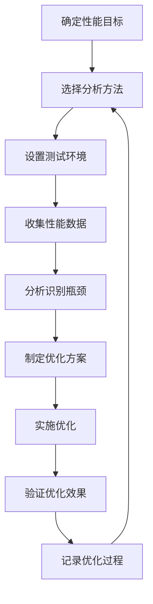

# Chapter 14.2 - Simpleperf

## 14.1 简介与用途

Simpleperf 是 Android 系统自带的高性能性能分析工具，专为开发者设计。它能够深入分析应用程序在 Android 设备上的运行性能，包括 CPU 使用率、内存占用、函数调用栈等关键指标。

### 主要用途

- **CPU 性能分析**：精确测量函数级别的 CPU 时间消耗，识别性能瓶颈
- **内存使用分析**：跟踪内存分配和释放模式，发现内存泄漏
- **线程行为分析**：分析线程调度、锁竞争、上下文切换等
- **系统调用跟踪**：记录应用程序与系统内核的交互
- **功耗分析**：通过追踪 CPU、内存、网络等硬件使用来估算应用功耗

### 适用范围

Simpleperf 适用于：
- Native C/C++ 代码性能分析
- Java/Kotlin 代码（通过 ART 方法跟踪）
- 混合型应用（JNI + Java）
- 系统级性能分析（Framework 层）
- AOSP 内核组件调试

### 基本优势

相比第三方性能分析工具，Simpleperf 具有以下优势：

- **零依赖**：无需额外安装，Android 系统自带
- **低开销**：性能分析本身对应用性能影响最小
- **系统级集成**：与 Android 调试体系无缝结合
- **多格式支持**：支持 Perfetto、Android Profileable 等现代格式
- **官方支持**：由 Google 官方维护，与 Android 版本同步更新

---

## 14.2 安装与配置

### 设备要求

Simpleperf 需要满足以下设备要求：

- **Android 版本**：Android 5.0 (API 21) 及以上
- **root 权限**：需要 root 权限才能进行完整的系统级跟踪
- **调试模式**：设备需开启 USB 调试或无线调试
- **应用签名**：被测试应用需要 debuggable 或包含 debug key

### 基本安装

#### 设备端设置

```bash
# 启用 ADB 调试
adb shell settings put global adb_enabled 1

# 设置应用为可调试模式（如果应用不是 debuggable）
adb shell pm grant com.example.debug android.permission.SET_DEBUG_APP
adb shell am set-debug-app --persistent com.example.debug

# 验证设备是否支持 simpleperf
adb shell simpleperf --version
```

#### 工具包准备

```bash
# 从设备获取 simpleperf
adb pull /system/bin/simpleperf ~/android-tools/simpleperf

# 或者从 Android NDK 获取
$ANDROID_NDK_HOME/toolchains/llvm/prebuilt/linux-x86_64/bin/simpleperf
```

### 推荐配置

#### .bashrc 配置

```bash
export ANDROID_NDK_HOME=$HOME/Android/Sdk/ndk/25.1.8937393
export PATH=$PATH:$ANDROID_NDK_HOME/toolchains/llvm/prebuilt/linux-x86_64/bin

# alias for quick access
alias android-simpleperf="$ANDROID_NDK_HOME/toolchains/llvm/prebuilt/linux-x86_64/bin/simpleperf"
```

#### ADB 连接脚本

```bash
#!/bin/bash
# connect_device.sh

adb devices
adb shell "echo 'Device ready for simpleperf analysis'"
adb shell simpleperf version
```

---

## 14.3 基本使用方法

### 命令格式

Simpleperf 使用以下基本命令格式：

```bash
simpleperf <command> [options] [target]
```

常用命令包括：

- `record`：记录性能数据
- `report`：生成性能报告
- `stat`：实时统计
- `top`：实时监控
- `list`：列出可用功能

### 简单示例

#### CPU 使用率分析

```bash
# 启动应用并记录 CPU 使用
simpleperf record com.example.app

# 指定时间限制
simpleperf record -f 5 --trace-fg com.example.app

# 生成报告
simpleperf report
```

#### 函数级别分析

```bash
# 记录函数调用
simpleperf record -g --trace-fg com.example.app

# 只记录特定函数
simpleperf record -g --trace-fg com.example.app -- android.app.Activity.onCreate

# 生成调用图
simpleperf report --show-call-graph
```

---

## 14.4 高级功能与选项

### 采样选项

```bash
# 设置采样频率
simpleperf record -f 1000 --trace-fg com.example.app

# 使用硬件事件采样
simpleperf record -e cpu-cycles,instructions --trace-fg com.example.app

# 自定义事件
simpleperf record -e cache-misses,cache-references --trace-fg com.example.app
```

### 过滤选项

```bash
# 过滤特定进程
simpleperf record --pid 1234

# 过滤线程
simpleperf record --tid 5678

# 过滤包名
simpleperf record com.example.*

# 排除系统进程
simpleperf record --exclude-pid android.*,system.*
```

### 输出选项

```bash
# 输出到文件
simpleperf record -o output.data --trace-fg com.example.app

# 指定格式
simpleperf record -o output.perfetto --trace-fg com.example.app

# 实时输出
simpleperf record --trace-fg com.example.app -f 1000
```

---

## 14.5 数据收集方法

### Perfetto 数据收集

Simpleperf 支持 Perfetto 格式的数据收集，这是 Android 系统推荐的现代性能分析格式：

```bash
# 使用 Perfetto 格式
simpleperf record --trace-fg com.example.app --perfetto

# 指定 Perfetto 配置
simpleperf record --trace-fg com.example.app --perfetto --config perfetto_config.xml

# 导出到 Perfetto UI
simpleperf record --trace-fg com.example.app --out perfetto.traces
```

### Android Profileable 数据收集

```bash
# 启用应用的可分析性
adb shell pm grant com.example.app android.permission.SET_DEBUG_APP
adb shell am profile start com.example.app

# 使用 simpleperf 收集数据
simpleperf record --trace-fg com.example.app --android-profileable
```

### 系统级跟踪

```bash
# 全系统跟踪
simpleperf record --system-wide --trace-fg com.example.app

# 指定跟踪时间
simpleperf record --system-wide -f 100 --duration 30 --trace-fg com.example.app

# 混合跟踪
simpleperf record --system-wide --pid 1234 --duration 60
```

---

## 14.6 数据分析与解读

### CPU 分析报告

```bash
# 基本 CPU 报告
simpleperf report

# 按函数排序
simpleperf report --sort comm,dso,symbol

# 按热函数显示
simpleperf report --show-total-period

# 显示调用栈
simpleperf report --show-call-graph
```

### 内存分析

```bash
# 内存分配跟踪
simpleperf record -e alloc_count,alloc_size --trace-fg com.example.app

# 内存泄漏检测
simpleperf record -e malloc_count,malloc_size --trace-fg com.example.app

# 报告分析
simpleperf report --show-alloc-stats
```

### 多维度分析

```bash
# 组合分析
simpleperf report --show-branch-miss --show-cache-miss

# 时间线分析
simpleperf report --show-timeline

# 热点分析
simpleperf report --top 10
```

---

## 14.7 性能优化实践

### CPU 优化

#### 函数内联优化

```java
// 优化前
public int calculateSum(List<Integer> numbers) {
    int sum = 0;
    for (int num : numbers) {
        sum += num;
    }
    return sum;
}

// 优化后（使用更高效的算法）
public int calculateSumOptimized(List<Integer> numbers) {
    return numbers.stream().mapToInt(Integer::intValue).sum();
}
```

#### 循环优化

```java
// 优化前
for (int i = 0; i < list.size(); i++) {
    Object item = list.get(i);
    // 处理 item
}

// 优化后
for (Object item : list) {
    // 处理 item
}
```

### 内存优化

#### 对象池化

```java
// 对象池实现
public class TexturePool {
    private final Queue<Texture> texturePool = new ConcurrentLinkedQueue<>();
    private final int maxPoolSize;
    
    public Texture borrow() {
        Texture texture = texturePool.poll();
        return texture != null ? texture : new Texture();
    }
    
    public void returnTexture(Texture texture) {
        if (texturePool.size() < maxPoolSize) {
            texturePool.offer(texture);
        }
    }
}
```

#### 内存泄漏预防

```java
// 避免静态引用
public class MemoryLeakExample {
    private static Context context; // ❌ 内存泄漏
    
    // ✅ 使用 Application Context
    public static void setContext(Context appContext) {
        context = appContext.getApplicationContext();
    }
}
```

### 线程优化

#### 线程池配置

```java
// 优化的线程池配置
ExecutorService optimizedExecutor = new ThreadPoolExecutor(
    4, // 核心线程数
    8, // 最大线程数
    60, // 空闲线程存活时间
    TimeUnit.SECONDS,
    new LinkedBlockingQueue<>(100), // 任务队列大小
    new ThreadPoolExecutor.CallerRunsPolicy() // 拒绝策略
);
```

#### 异步处理优化

```java
// 使用 RxJava 进行异步处理
Observable.just(data)
    .subscribeOn(Schedulers.io())
    .observeOn(AndroidSchedulers.mainThread())
    .subscribe(result -> {
        // 更新 UI
    });
```

---

## 14.8 常见问题与解决方案

### 设备相关问题

#### 设备不支持 Simpleperf

```bash
# 检查设备支持
adb shell simpleperf --version

# 如果不支持，使用 ADB shell 方法
adb shell setprop debug.perfetto.enable true
adb shell am profile start com.example.app
```

#### Root 权限问题

```bash
# 检查 root 权限
adb shell su -c "id"

# 无 root 权限的替代方案
adb shell run-as com.example.app simpleperf record
```

### 数据收集问题

#### 数据丢失

```bash
# 检查存储空间
adb shell df -h /data

# 增加缓冲区
simpleperf record -b 4096 --trace-fg com.example.app

# 使用压缩输出
simpleperf record -z --trace-fg com.example.app
```

#### 跟踪中断

```bash
# 监控跟踪状态
simpleperf stat --duration 10

# 使用自动保存
simpleperf record -a --trace-fg com.example.app
```

### 性能问题

#### 过度跟踪导致性能下降

```bash
# 降低采样频率
simpleperf record -f 100 --trace-fg com.example.app

# 选择性跟踪
simpleperf record -g --trace-fg com.example.app --com.example.app.MainActivity
```

---

## 14.9 性能案例分析

### 案例 1：应用启动优化

#### 问题背景
某 Android 应用启动时间过长，用户反馈启动缓慢。

#### 分析过程
```bash
# 启动应用并记录启动过程
adb shell am force-stop com.example.app
simpleperf record --trace-fg com.example.app --duration 30 -o startup.data

# 生成启动分析报告
simpleperf report --sort comm,dso,symbol --show-total-period startup.data
```

#### 发现问题
- 主线程阻塞时间过长
- 静态初始化耗时较高
- 重复的视图创建

#### 优化方案
```java
// 延迟初始化
public class LazyInitializer {
    private static volatile LazyInitializer instance;
    
    public static LazyInitializer getInstance() {
        if (instance == null) {
            synchronized (LazyInitializer.class) {
                if (instance == null) {
                    instance = new LazyInitializer();
                }
            }
        }
        return instance;
    }
}

// 使用 ViewStub 延迟加载视图
<ViewStub
    android:id="@+id/lazyViewStub"
    android:layout_width="match_parent"
    android:layout_height="wrap_content"
    android:layout="@layout/lazy_layout" />
```

### 案例 2：内存泄漏修复

#### 问题背景
应用长时间使用后内存占用持续增长，最终导致 OOM。

#### 分析过程
```bash
# 监控内存分配
simpleperf record -e alloc_count,alloc_size --trace-fg com.example.app -o memory.data

# 分析内存分配模式
simpleperf report --show-alloc-stats memory.data

# 使用 MAT 分析
adb pull /data/local/tmp/memory.hprof ~/analysis/
```

#### 发现问题
- Handler 导致的内存泄漏
- 静态集合持有 Activity 引用
- 资源未正确释放

#### 优化方案
```java
// 使用静态内部类避免内存泄漏
public class SafeHandler extends Handler {
    private final WeakReference<Activity> activityReference;
    
    public SafeHandler(Activity activity) {
        activityReference = new WeakReference<>(activity);
    }
    
    @Override
    public void handleMessage(Message msg) {
        Activity activity = activityReference.get();
        if (activity != null) {
            // 处理消息
        }
    }
}

// 使用弱引用集合
private static final Map<String, WeakReference<Context>> contextCache = new ConcurrentHashMap<>();

public void putContext(String key, Context context) {
    contextCache.put(key, new WeakReference<>(context));
}
```

---

## 14.10 工具集成与自动化

### 与 Android Studio 集成

#### Simpleperf 插件

```gradle
// build.gradle 配置
plugins {
    id 'com.android.application'
    id 'simpleperf-plugin'
}

simpleperf {
    enabled true
    traceLevel 'function'
    outputPath 'build/reports/simpleperf'
}
```

#### 自定义配置

```xml
<!-- simpleperf_config.xml -->
<config>
    <buffersize>8192</buffersize>
    <duration>30</duration>
    <target>com.example.app</target>
    <events>
        <event>cpu-cycles</event>
        <event>cache-misses</event>
        <event>branch-misses</event>
    </events>
</config>
```

### CI/CD 集成

#### Jenkins Pipeline

```groovy
pipeline {
    agent any
    stages {
        stage('Performance Test') {
            steps {
                sh '''
                    # 启动设备
                    adb devices
                    
                    # 运行性能测试
                    simpleperf record --trace-fg com.example.app --duration 60 -o perf-test.data
                    
                    # 生成报告
                    simpleperf report --sort comm,dso,symbol perf-test.data
                    
                    # 上传报告
                    cp perf-report.html $BUILD_ARTIFACTS/
                '''
            }
        }
    }
}
```

#### GitHub Actions

```yaml
name: Performance Test
on: [push, pull_request]
jobs:
  performance:
    runs-on: ubuntu-latest
    steps:
      - uses: actions/checkout@v2
      - name: Run performance test
        run: |
          # Android 设备模拟器设置
          avdmanager create avd -n test-device -k "system-images;android-30;google_apis;x86_64"
          emulator -avd test-device -no-window &
          
          # 等待启动
          adb wait-for-device
          
          # 运行测试
          simpleperf record --trace-fg com.example.app --duration 60
          simpleperf report --html perf-report.html
```

---

## 14.11 性能基准测试

### 基准测试框架

#### Simpleperf 基准测试脚本

```bash
#!/bin/bash
# benchmark.sh

APP_PACKAGE="com.example.app"
DURATION=30
OUTPUT_DIR="benchmarks"

mkdir -p $OUTPUT_DIR

# 基准测试函数
run_benchmark() {
    local test_name=$1
    local events=$2
    local output_file="$OUTPUT_DIR/${test_name}_$(date +%Y%m%d_%H%M%S).data"
    
    echo "Running benchmark: $test_name"
    echo "Events: $events"
    echo "Output: $output_file"
    
    simpleperf record --trace-fg $APP_PACKAGE --duration $DURATION -e $events -o "$output_file"
    
    # 生成报告
    simpleperf report --sort comm,dso,symbol "$output_file" > "$output_dir/${test_name}_report.txt"
}

# 运行不同场景的基准测试
run_benchmark "cpu_heavy" "cpu-cycles,instructions,cache-misses"
run_benchmark "memory_heavy" "alloc_count,alloc_size,page-faults"
run_benchmark "io_heavy" "io_read,io_write"
run_benchmark "network_heavy" "net_bytes_sent,net_bytes_recv"
```

### 性能基准指标

#### CPU 性能基准

| 测试场景 | 预期性能 | 可接受范围 | 优化目标 |
|---------|---------|-----------|---------|
| 密集计算 | < 100ms/iteration | < 150ms | < 80ms |
| UI 渲染 | < 16ms/frame | < 20ms | < 12ms |
| 内存分配 | < 1ms/alloc | < 2ms | < 0.5ms |

#### 内存使用基准

| 测试场景 | 预期内存 | 可接受范围 | 优化目标 |
|---------|---------|-----------|---------|
| 启动内存 | < 50MB | < 80MB | < 40MB |
| 运行内存 | < 100MB | < 150MB | < 80MB |
| 内存泄漏 | 0KB/session | < 10KB | 0KB |

---

## 14.12 总结与最佳实践

### 关键要点总结

1. **工具选择**：根据分析需求选择合适的 Simpleperf 功能和参数
2. **性能影响**：平衡数据详细程度和性能开销
3. **数据解读**：结合多种分析维度，避免单一指标判断
4. **持续优化**：建立性能监控体系，定期进行性能分析
5. **团队协作**：制定性能标准和规范，统一优化目标

### 最佳实践建议

#### 分析流程优化



#### 团队协作建议

1. **建立性能标准**：制定明确的性能指标和优化目标
2. **统一工具链**：团队统一使用 Simpleperf 和分析工具
3. **知识共享**：建立性能分析案例库和最佳实践文档
4. **自动化监控**：集成 CI/CD 中的性能测试环节
5. **定期审查**：定期进行性能审查和优化

---

## 14.13 参考资源

### 官方文档

- [Simpleperf 官方文档](https://developer.android.com/ndk/guides/simpleperf)
- [Perfetto 性能分析](https://perfetto.dev/docs/android-configuration)
- [Android Profileable 应用](https://developer.android.com/guide/topics/profiling/profileable-apps)

### 工具链接

- [Simpleperf GitHub](https://github.com/google/simpleperf)
- [Perfetto UI](https://ui.perfetto.dev/)
- [Android 性能分析工具集](https://developer.android.com/studio/profile)

### 相关书籍

- [Android 性能优化大师](https://book.douban.com/subject/30275785/)
- [高性能 Android 应用开发](https://book.douban.com/subject/27126143/)
- [Android 系统级性能调优](https://book.douban.com/subject/35528770/)