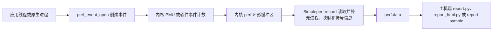

# 14.2 Simpleperf

Simpleperf 是 Android 平台的原生 CPU 性能分析工具。它通过 Linux `perf_events` 子系统，也就是内核提供的性能事件接口，采集事件计数、PC（Program Counter，当前执行指令的地址）和调用栈，再把结果写入 `perf.data`。它适合回答“CPU 时间集中在哪些函数”“某段代码执行了多少条指令”“热点由哪条调用路径进入”等问题。

它不负责堆内存泄漏、Java 对象分配、完整系统调用时序或整机功耗归因。对应问题应分别使用 Heap Dump/LeakCanary、Allocation Tracking、Perfetto ftrace 和 Power Profiler；ftrace 是 Linux 内核的事件跟踪机制。Simpleperf 也能读取 PMU（Performance Monitoring Unit，处理器性能监控单元）的硬件计数器，但这些计数不能单独换算成可靠的能耗。

平台源码锚定 `android-17.0.0_r1`，内核源码锚定 `android17-6.18-2026-06_r6`。下文用“A17”简称这份 Android 17 平台源码。较早版本只用于说明兼容边界，不能用 A17 的默认值反推旧设备行为。

## 14.2.1 采样模型

一次采样从内核事件开始，在主机报告结束。下面的图用于定位每一层负责的数据。



内核决定事件能否打开、何时产生样本，以及样本进入哪个 perf ring buffer（环形缓冲区，一块循环复用的内存队列）。Simpleperf 负责配置事件、持续读取记录、处理调用栈并保存分析所需的元数据。报告工具再把地址映射到库、函数和源码行。

这套模型带来三个阅读报告时必须遵守的约束：

- `record` 产生离散样本，不会记录每次函数调用。占比接近只表示所选事件的权重接近，无法证明调用次数接近。
- `cpu-cycles`、`instructions`、`task-clock` 衡量的量不同。报告里的 `Overhead` 是某条目占所选事件总权重的比例，不能一律解释为墙钟时间，也就是现实中经过的时间。
- 函数地址要配上 build ID 匹配的符号文件才能还原名称。build ID 是写在 ELF 二进制中的构建标识；采样完整而符号缺失时，报告仍会出现大量 `[unknown]`。

内核实现入口可从 [`kernel/events/core.c`](https://android.googlesource.com/kernel/common/+/refs/tags/android17-6.18-2026-06_r6/kernel/events/core.c) 和 [`include/uapi/linux/perf_event.h`](https://android.googlesource.com/kernel/common/+/refs/tags/android17-6.18-2026-06_r6/include/uapi/linux/perf_event.h) 查看。产品内核配置、SELinux 强制访问控制策略、PMU 型号和厂商限制都会影响可用事件，源码标签不能替代目标设备探测。

## 14.2.2 版本与权限边界

### 版本能力

| Android 版本 | Simpleperf 能力边界 |
| --- | --- |
| Android 5.0（API 21）起 | 设备端 `simpleperf` 可执行文件受支持 |
| Android 7.0（API 24）起 | 官方 Python 采集与报告脚本受支持；Java 仅能识别已编译为本地指令的代码 |
| Android 8.x（API 26–27） | Java 仍以已编译代码为主；系统库从 Android 8.0 起携带 `.gnu_debugdata` |
| Android 9（API 28）起 | 可为解释执行、JIT（运行时编译）和 AOT（提前编译）Java/Kotlin 代码生成调用栈 |
| Android 10（API 29）起 | 发布应用可声明 `profileable`，由 shell 使用预装分析工具采样 |
| Android 16（API 36）起 | 应用采样优先由 `simpleperf_app_runner` 启动设备内置 Simpleperf；侧载二进制不再拥有获取内核样本所需的权限 |
| Android 17（API 37） | 沿用 `simpleperf_app_runner` 路径；以 `android-17.0.0_r1` 的实现为准 |

Android 9 以前的 Java 支持不等于 ART method tracing。ART 是 Android Runtime；method tracing 会记录方法进入和退出，Simpleperf 仍按 CPU 事件抽样。Android 9 起，解释器、JIT 与 AOT 代码都能进入采样调用栈。

### 三种常见授权场景

1. `profileable` 发布应用：Android 10 起可允许 shell 使用设备预装的分析工具采样。shell 是通过 ADB 操作设备时使用的受限本机账号；这种构建的运行形态更接近 release。
2. `debuggable` 应用：允许调试器和更多开发期检查，但 debug 构建会改变 Java、JNI 和编译优化行为。Android 12 及更高版本上，A17 的 `app_profiler.py` 默认拒绝这类构建；接受该偏差后，需显式传入 `--unrepresentative_profile_debug_app`。
3. root 或 AOSP 调试设备：可分析普通发布应用、原生系统进程或全系统目标。root 表示以超级用户身份运行，userdebug/eng 则是开放更多诊断能力的系统构建；最终能力仍由内核和安全策略决定。

发布包若要接受本机 shell 采样，应在 `<application>` 中加入下面的声明。该元素开放本机性能分析能力，不会把应用改成 `debuggable`。

```xml
<manifest xmlns:android="http://schemas.android.com/apk/res/android">
    <application>
        <profileable android:shell="true" />
    </application>
</manifest>
```

`android:shell="true"` 允许 shell 通过 Simpleperf、Perfetto 等预装工具执行受控分析。它不授予任意读取进程内存或接入调试器的权限；Perfetto 的原生堆、Java 堆和 CPU profiler 仍各自执行权限检查并只返回规定的分析结果。具体限制见 [`<profileable>` 官方说明](https://developer.android.com/guide/topics/manifest/profileable-element)。

`adb shell am set-debug-app` 不会修改 APK 的 `debuggable` 或 `profileable` 属性，不能作为发布包的采样授权。`persist.simpleperf.profile_app_uid` 是供“应用内控制 Simpleperf”流程使用的系统属性，记录被临时授权的应用 UID；UID 是 Android 用来隔离应用权限的数字身份。Android 13 起，`api_profiler.py prepare --days` 可为这项授权设置有效天数。常规外部采样交给 `app_profiler.py` 处理。

## 14.2.3 工具位置与环境检查

NDK 发行包把设备端程序、主机端程序和 Python 脚本放在顶层 `simpleperf/` 目录，不在 LLVM 工具链的 `bin/` 目录。路径中的 `${arch}` 表示目标 CPU 架构，`${host}` 表示运行报告工具的桌面系统：

- `simpleperf/bin/android/${arch}/simpleperf`：设备端静态可执行文件。
- `simpleperf/bin/${host}/${arch}/simpleperf`：主机端报告程序。
- `simpleperf/*.py`：`app_profiler.py`、`report.py`、`report_html.py` 等脚本。

进入 NDK 的 `simpleperf/` 目录后，先让工具查询设备功能。下面的命令用于检查应用运行器、调用栈、离开 CPU 采样等能力，并列出设备接受的事件名。

```bash
./run_simpleperf_on_device.py list --show-features
./run_simpleperf_on_device.py list
```

这份输出才是当前设备的能力清单。看到事件名不表示当前 UID 一定有权打开它；采集时返回的 `permission denied`、`not supported` 或 `event not found` 分别指向权限、内核或硬件支持、事件名称等不同问题。

Android 16/17 上应使用同一版本 NDK 附带的脚本发起应用采样。脚本会优先选择 `simpleperf_app_runner`，由它在受控应用上下文中启动设备内置 Simpleperf。手工 `adb push` 一个二进制再执行，可能可以显示帮助信息，却无法获取内核样本。

## 14.2.4 一条可靠的应用采样路径

下面以 `profileable` 发布应用为例，记录十秒用户态 CPU 时间和 DWARF 调用栈。DWARF 是二进制中的调试与栈展开信息格式；“用户态”表示只统计 App 等普通进程执行的部分，不含内核态。命令从环境变量读取真实包名和未剥离原生库目录，缺少输入时会立即退出。

```bash
: "${PACKAGE_NAME:?请先设置目标应用的 PACKAGE_NAME}"
: "${UNSTRIPPED_LIB_DIR:?请先设置未剥离原生库目录 UNSTRIPPED_LIB_DIR}"

./app_profiler.py \
  -p "${PACKAGE_NAME}" \
  -r "-e task-clock:u -f 1000 --duration 10 -g" \
  -lib "${UNSTRIPPED_LIB_DIR}"

./report_html.py
```

这组记录参数也是 A17 `app_profiler.py` 的默认值；显式写出它们便于复现实验。脚本在当前目录生成 `perf.data`，再用 `UNSTRIPPED_LIB_DIR` 中未删除调试信息的库准备 `binary_cache/` 符号缓存。`report_html.py` 读取两者并生成 `report.html`。采样窗口内必须操作目标功能，否则报告只反映空闲或启动状态。

若要从 Activity 启动前开始采样，可把真实 Activity 名交给脚本。下面的命令要求三个环境变量均已设置。

```bash
: "${PACKAGE_NAME:?请先设置目标应用的 PACKAGE_NAME}"
: "${ACTIVITY_NAME:?请先设置要启动的 ACTIVITY_NAME}"
: "${UNSTRIPPED_LIB_DIR:?请先设置未剥离原生库目录 UNSTRIPPED_LIB_DIR}"

./app_profiler.py \
  -p "${PACKAGE_NAME}" \
  -a "${ACTIVITY_NAME}" \
  -r "-e task-clock:u -f 1000 --duration 5 -g" \
  -lib "${UNSTRIPPED_LIB_DIR}"
```

脚本会先结束目标进程、布置采样，再启动 Activity。这里的“从启动前采样”只保证覆盖进程与 Activity 启动，不会替实验清除应用数据或系统文件缓存。比较冷启动结果时，应固定应用数据、ART 编译状态、存储状态和业务输入。

### 调用栈开销从低频开始校准

设备端 `simpleperf record` 的默认事件是 `cpu-cycles`，默认频率是每个运行中线程每秒约 4000 个样本。A17 的 `app_profiler.py` 已把应用采样默认值降为 `task-clock:u`、1000 Hz、DWARF 调用栈和十秒窗口。混合 Java/原生应用可从脚本默认值开始，再根据样本数、丢失记录、截断栈和业务扰动调低频率或缩短窗口。

采样开销受事件类型、频率、线程数、CPU 型号、栈展开方式和符号处理影响，无法用一个固定百分比覆盖。应在同一设备上比较“未采样”和“采样”两组的业务指标，并把采样频率视为实验变量。

## 14.2.5 `stat`、`record` 与 `report`

### `stat`：回答“消耗了多少”

`stat` 汇总事件计数，不保存每个热点位置。下面的命令用于观察目标进程在十秒内的 CPU 时间、周期数和指令数。

```bash
: "${APP_PID:?请先设置目标进程的 APP_PID}"

simpleperf stat \
  -e task-clock,cpu-cycles,instructions \
  -p "${APP_PID}" \
  --duration 10
```

若硬件事件无法打开，可以保留 `task-clock` 单独测量。`instructions / cpu-cycles` 常被称为 IPC（Instructions Per Cycle，每周期退休指令数）。异构 CPU 的各类核心采用不同微架构，PMU 约束和线程迁核也会影响聚合结果，跨设备比较尤其要谨慎。

### `record`：回答“消耗发生在哪”

`record` 以指定事件触发样本，并把程序计数器、线程、映射及可选调用栈写入 `perf.data`。下面的命令适用于已经具备权限的设备端环境。

```bash
: "${APP_PID:?请先设置目标进程的 APP_PID}"

simpleperf record \
  -e task-clock:u \
  -f 1000 \
  -p "${APP_PID}" \
  --duration 10 \
  -g \
  -o perf.data
```

`-f 1000` 表示线程处于运行态时每秒约采样 1000 次。线程一秒只运行 200 ms 时，样本量约为 200 个。`-c` 则按事件累计值指定采样周期，例如 `-c 100000` 表示每累计十万个所选事件产生一个样本。

### `report`：回答“样本如何归属”

下面的命令用于读取同一个 `perf.data`，显示调用图并按进程、线程、库和函数分组。

```bash
simpleperf report \
  -i perf.data \
  -g \
  --sort comm,pid,tid,dso,symbol
```

默认报告的主要维度已经包含 `comm,pid,tid,dso,symbol`：`comm` 是进程或线程名，PID 和 TID 分别是进程 ID 与线程 ID，DSO（Dynamic Shared Object）是动态共享库，`symbol` 是函数符号。显式写出排序字段有助于团队保存可复现命令。需要缩小范围时，可使用 `--comms`、`--pids`、`--tids` 或 `--dsos`。

## 14.2.6 事件选择与解释

### 时间类事件

- `task-clock`：线程在 CPU 上运行的时间，适合用作 CPU 热点的直观权重。
- `cpu-clock`：软件 CPU 时钟事件，也可用于 `--trace-offcpu`。
- `cpu-cycles`：硬件周期计数；CPU 频率、微架构和迁核会改变它与时间的关系。

### 工作量与缓存类事件

- `instructions`：退休指令数，也就是已经完成执行并提交结果的指令数；用于观察执行工作量，评估算法改动时常与 `cpu-cycles` 一起看。
- `cache-references`、`cache-misses`：通用缓存事件，但映射到哪级缓存、是否支持以及权限条件由 PMU 驱动决定。
- `raw-*`：平台专用原始事件。事件编码与 CPU 型号绑定，不能把一台设备的命令复制到另一种 SoC（System on Chip，片上系统）后直接比较。

并发采集的硬件事件超过可用 PMU 计数器时，内核可能 multiplex（分时复用）这些计数器，再按启用时间缩放结果。误差会随负载和调度变化。工程分析可采用两步：

1. 用 `task-clock` 和调用栈找出热点函数。
2. 围绕同一稳定负载，分组采集少量 PMU 事件验证瓶颈类型。

用户态后缀 `:u` 会排除内核态样本。分析应用代码时，它能减少无符号内核帧和权限干扰；分析系统调用成本时则应保留内核态，并准备匹配的内核符号。

## 14.2.7 调用栈与符号

### DWARF 与帧指针（FP）

`-g` 默认选择 DWARF 调用栈。内核为样本保存寄存器和用户栈数据，Simpleperf 再用 Android 的 `libunwindstack` 库离线还原栈帧。展开依赖 ELF（Executable and Linkable Format，Android 原生二进制格式）中的 `.eh_frame`、`.debug_frame`、`.ARM.exidx` 或 `.gnu_debugdata`。A17 的默认单样本栈数据上限是 65,528 字节；深栈仍可能在到达线程入口前结束。

`--call-graph fp` 让内核沿帧指针获取调用链。它在保留帧指针的 ARM64 原生代码上开销较低；ART 不保证为 Java 代码保留合适的帧指针，32 位 ARM/Thumb 混合代码也容易断栈。选择 FP 前应确认编译参数和目标代码形态。

下面的两条采集命令读取同一组真实输入，用于在相同负载上比较 DWARF 与 FP 的栈完整度。

```bash
: "${PACKAGE_NAME:?请先设置目标应用的 PACKAGE_NAME}"
: "${UNSTRIPPED_LIB_DIR:?请先设置未剥离原生库目录 UNSTRIPPED_LIB_DIR}"

./app_profiler.py -p "${PACKAGE_NAME}" \
  -r "-e task-clock:u -f 1000 --duration 10 -g" \
  -lib "${UNSTRIPPED_LIB_DIR}"

./app_profiler.py -p "${PACKAGE_NAME}" \
  -r "-e task-clock:u -f 1000 --duration 10 --call-graph fp" \
  -lib "${UNSTRIPPED_LIB_DIR}" \
  -o perf-fp.data
```

比较时应检查 `[unknown]` 比例、栈深、热点归属和被测指标扰动。FP 报告更短时，原因可能是代码没有保留帧指针，与业务调用路径深度无关。

### Java/Kotlin 符号

Android 9 起，Simpleperf 可处理 ART 解释器、JIT 和 AOT 代码。Android 17 源码中的 [`JITDebugReader`](https://android.googlesource.com/platform/system/extras/+/android-17.0.0_r1/simpleperf/JITDebugReader.h) 负责读取 JIT 与 DEX 调试描述；DEX 是 Android 运行时使用的字节码格式。样本仍由 perf 事件触发，读取调试信息不会把采样变成方法追踪。

经过 R8/ProGuard 混淆的 Java/Kotlin 符号需要映射文件。下面的报告命令从环境变量读取与 APK 同构建的文件。

```bash
: "${R8_MAPPING_FILE:?请先设置与 APK 同构建的 R8_MAPPING_FILE}"

./report_html.py \
  --proguard-mapping-file "${R8_MAPPING_FILE}"
```

映射文件必须来自与 APK 相同的构建产物。版本不匹配时，方法名可能无法恢复，也可能被错误的同名映射替换。

### 原生符号

APK 内的 `.so` 动态库通常已经剥离调试信息。`app_profiler.py -lib` 应指向同一构建的未剥离库，脚本据此创建 `binary_cache/`。判断是否匹配应以 ELF build ID 为准，不能只看文件名。

已有 `perf.data` 且设备仍可连接时，可补建符号缓存。下面的命令用于从设备和本地目录收集样本涉及的二进制。

```bash
: "${PERF_DATA_FILE:?请先设置已有记录文件 PERF_DATA_FILE}"
: "${UNSTRIPPED_LIB_DIR:?请先设置未剥离原生库目录 UNSTRIPPED_LIB_DIR}"

./binary_cache_builder.py \
  -i "${PERF_DATA_FILE}" \
  -lib "${UNSTRIPPED_LIB_DIR}"
```

生成缓存后重新运行报告。若 `[unknown]` 仍集中在应用库，应检查 build ID、ABI（Application Binary Interface，二进制接口约定）、拆分 APK，以及被采样进程实际加载的路径。

## 14.2.8 多进程、线程与离开 CPU 时间

### 目标选择

下面每条命令都是独立的目标选择方式，执行时只选与问题相符的一条。PID、线程 ID、进程名正则和包名都从真实环境变量读取；正则表达式用于按文本模式匹配一个或多个进程名。

```bash
# 一个或多个 PID
simpleperf record \
  -p "${PID_LIST:?请设置逗号分隔的 PID_LIST}" \
  --duration 10

# 进程名匹配给定正则
simpleperf record \
  -p "${PROCESS_NAME_REGEX:?请设置 PROCESS_NAME_REGEX}" \
  --duration 10

# 指定线程
simpleperf record \
  -t "${THREAD_ID_LIST:?请设置逗号分隔的 THREAD_ID_LIST}" \
  --duration 10

# debuggable 或 profileable 应用
simpleperf record \
  --app "${PACKAGE_NAME:?请设置 PACKAGE_NAME}" \
  --duration 10

# 全系统目标；常规产品设备通常需要 root 权限
simpleperf record -a --duration 10
```

`--app` 以包名准备应用采样，并可等待应用进程出现。多进程应用仍应在报告中保留 `pid`、`tid` 和 `comm`，否则相同库中的同名函数会被汇总，主进程与 `:remote` 进程的成本难以区分。

`-p` 接受 PID 列表或进程名正则。按名称选目标前，应保存 `adb shell ps -A -o PID,NAME` 的输出，确认没有同名测试进程进入样本。

### 离开 CPU 采样的边界

普通 CPU 采样只在线程运行时产生样本，这段时间称为 on-CPU。线程因抢占、锁、I/O 或其他等待而未在 CPU 上执行时处于 off-CPU。`--trace-offcpu` 额外记录 `sched:sched_switch` 调度切换样本和上下文切换记录，用相邻时间戳估算线程离开 CPU 后停留在哪条调用路径。

使用前先探测内核支持。下面的命令用于确认 `trace-offcpu`，再以 `task-clock` 记录线程在 CPU 和离开 CPU 的数据。

```bash
: "${PACKAGE_NAME:?请先设置目标应用的 PACKAGE_NAME}"

./run_simpleperf_on_device.py list --show-features

./app_profiler.py \
  -p "${PACKAGE_NAME}" \
  -r "-e task-clock:u -f 1000 --duration 10 -g --trace-offcpu"

./report_html.py --trace-offcpu on-off-cpu
```

`--trace-offcpu` 要求整次记录只选择 `cpu-clock` 或 `task-clock` 中的一个事件。`on-off-cpu` 报告模式会把两类权重分开显示；离开 CPU 的权重来自调度时间戳，丢失样本或切换记录都会降低精度。若问题涉及可运行队列等待、线程唤醒者、Binder（Android 进程间通信机制）对端或 CPU 频率，Perfetto System Trace 能提供更完整的时间上下文。

## 14.2.9 丢样、截断栈与缓冲区

采样数据要经过内核 `perf` 环形缓冲区和 Simpleperf 用户态记录缓冲区。内核缓冲区溢出会增加 `kernelspace` 丢失记录；对栈数据超过 1 KiB 的 DWARF 样本，A17 会在用户态缓冲区紧张时先缩短栈，再丢弃样本，以保留 mmap（内存映射）和 fork（创建子进程）等还原地址空间所需的记录。

不要看到丢样就同时增大所有参数。按下列顺序定位：

1. 降低 `-f`，确认丢样是否随采样率下降。
2. 只出现内核丢样时，逐步增大 `-m`。该参数表示每个 CPU 的内核缓冲页数，必须是 2 的幂；未指定时，A17 会尝试不超过 1024 页的最大可用值。
3. 用户态缓冲区不足或栈被截断时，增大 `--user-buffer-size`。
4. 缩短采样时长、减少目标线程或改用 FP，检查数据量是否回到可控范围。
5. 每次只改一个变量，并记录工具结束时的 `Samples recorded`、`Samples lost` 和 `truncated stacks` 统计。

A17 的非全系统记录默认使用 64 MiB 或 256 MiB 用户态缓冲区：设备报告内存不超过 3 GiB 时取 64 MiB，否则取 256 MiB；全系统记录固定为 256 MiB。这是 `GetDefaultRecordBufferSize()` 的实现分支，不能据此判断某台设备需要多大缓冲区。

确认用户态丢样或截断栈后，可从环境变量传入本轮实验值。下面的命令不预设设备通用数值。

```bash
: "${PACKAGE_NAME:?请先设置目标应用的 PACKAGE_NAME}"
: "${USER_BUFFER_SIZE:?请设置带单位的 USER_BUFFER_SIZE，例如按实验选择 MiB 值}"

./app_profiler.py \
  -p "${PACKAGE_NAME}" \
  -r "-e task-clock:u -f 1000 --duration 10 -g --user-buffer-size ${USER_BUFFER_SIZE}"
```

缓冲区增大会增加分析进程的内存占用。系统内存紧张、采样目标很多或栈很深时，应同时观察被测业务是否受到分析工具干扰。A17 用户态缓冲区可用空间低于低水位时，会把 DWARF 样本中超过 1 KiB 的有效栈数据裁到 1 KiB；低于临界水位时，直接丢弃这类样本。结束日志能区分这两种结果。

Android 17 的 [`RecordReadThread`](https://android.googlesource.com/platform/system/extras/+/android-17.0.0_r1/simpleperf/RecordReadThread.h) 用独立读取线程把内核缓冲区读取与主线程处理分开，以降低 DWARF 采样的丢失概率。读取线程只能缩短排队时间；过高频率、权限限制或硬件事件溢出仍需单独处理。

## 14.2.10 报告与时间线工具

### 文本和 HTML 报告

文本报告适合自动化对比。下面的命令从环境变量读取真实库名，显示调用图并限制到该原生库。

```bash
: "${TARGET_DSO:?请先设置要分析的 TARGET_DSO}"

./report.py \
  -g \
  --dsos "${TARGET_DSO}"
```

`--dsos` 只保留匹配库的样本；调用图仍需要采集阶段已经记录调用栈。

HTML 报告适合交互检查。下面的命令从环境变量读取与二进制同提交的源码树，并加入源码与反汇编视图。

```bash
: "${SOURCE_ROOT:?请先设置与二进制同提交的 SOURCE_ROOT}"

./report_html.py \
  --add_source_code \
  --source_dirs "${SOURCE_ROOT}" \
  --add_disassembly
```

源码注释依赖调试行号信息、源码路径和当前文件内容。构建机路径无法在本机解析时，`--source_dirs` 应指向对应提交的源码树。

### 转为 Perfetto/Android Studio 可读格式

Simpleperf 的 `perf.data` 可由 `report-sample` 转成 protobuf，也就是按协议定义编码的二进制消息。Android Studio CPU Profiler 官方支持这种格式；Android 17 的 Perfetto Trace Processor 也包含 Simpleperf protobuf 解析器。下面的命令保留调用链并生成 `perf.trace`。

```bash
simpleperf report-sample \
  --protobuf \
  --show-callchain \
  -i perf.data \
  -o perf.trace
```

生成的文件可在 Android Studio CPU Profiler 中打开；Android 17 对应版本的 Perfetto UI 和 Trace Processor 也能解析。转换入口是 `report-sample`；`--show-callchain` 决定输出中是否包含调用链。若要兼容其他版本的 Perfetto UI，AOSP 当前还提供 `gecko_profile_generator.py` 和 `report_sample.py` 两条转换路径。

Perfetto Trace Processor 会把这种 protobuf 中的样本导入 `cpu_profile_stack_sample` 和栈分析表。Android 17 导入器会忽略 Simpleperf 的 `ContextSwitch` 记录，也没有把 `event_type` 与丢样信息完整映射成时间线语义。它适合查看样本火焰图，无法替代包含调度数据的系统跟踪。

Perfetto 的 `linux.perf` 是另一套采集入口，由 `traced_perf` 组件调用 `perf_event_open` 并直接向 Perfetto 会话写入调用栈样本。这样采到的样本能与 ftrace 数据共享时间轴。已经生成的 Simpleperf `perf.data` 属于另一场采集，不会自动并入新会话。

下面的 A17 配置以真实系统进程 `surfaceflinger` 为目标，按 100 Hz 采集用户态调用栈，并在同一会话加入调度和进程信息。SurfaceFlinger 是 Android 负责合成屏幕图层的系统服务；采样这类系统进程通常需要 userdebug/eng 构建或等价权限。

```protobuf
duration_ms: 10000

buffers {
  size_kb: 40960
  fill_policy: DISCARD
}

data_sources {
  config {
    name: "linux.perf"
    perf_event_config {
      timebase {
        counter: SW_CPU_CLOCK
        frequency: 100
        timestamp_clock: PERF_CLOCK_BOOTTIME
      }
      callstack_sampling {
        scope {
          target_cmdline: "surfaceflinger"
        }
      }
    }
  }
}

data_sources {
  config {
    name: "linux.ftrace"
    ftrace_config {
      ftrace_events: "sched/sched_switch"
      ftrace_events: "sched/sched_waking"
    }
  }
}

data_sources {
  config {
    name: "linux.process_stats"
    process_stats_config {
      scan_all_processes_on_start: true
    }
  }
}
```

`SW_CPU_CLOCK` 是触发采样的软件 CPU 时钟，`PERF_CLOCK_BOOTTIME` 让样本时间戳采用包含休眠时间的系统启动时钟，便于与 Android system trace 对齐。`callstack_sampling` 未显式配置 `kernel_frames`，所以示例只保留默认的 DWARF 用户态栈；`linux.ftrace` 补充切换与唤醒事件，`linux.process_stats` 补充进程元数据。字段定义可在 Android 17 的 [`perf_event_config.proto`](https://android.googlesource.com/platform/external/perfetto/+/refs/tags/android-17.0.0_r1/protos/perfetto/config/profiling/perf_event_config.proto) 和 [`perf_events.proto`](https://android.googlesource.com/platform/external/perfetto/+/refs/tags/android-17.0.0_r1/protos/perfetto/common/perf_events.proto) 中核对。函数热点和源码归属优先使用 Simpleperf；需要把调用栈与调度、Binder、频率、帧时间放在同一时间轴时，使用 Perfetto `linux.perf` 加 ftrace。

## 14.2.11 Android 17 源码实现要点

### 应用运行器的版本分支

下面的摘录用于说明 Android 16/17 为什么优先使用设备内置 Simpleperf，代码来自 `android-17.0.0_r1` 的 `environment.cpp`。

```cpp
// Before Android 16, we prefer using run-as, which can use the latest sideloaded simpleperf.
// After Android 16, sideloaded simpleperf has no permission to get kernel samples. So prefer
// using simpleperf_app_runner to run simpleperf shipped on device.
bool prefer_simpleperf_app_runner = GetAndroidVersion() >= kAndroidVersion16;
```

后续分支在 Android 16/17 上先尝试 `simpleperf_app_runner`，旧版本先尝试 `run-as`。因此，A17 应用采样应由 `app_profiler.py` 协调设备内置程序，完整上下文见 [`environment.cpp`](https://android.googlesource.com/platform/system/extras/+/android-17.0.0_r1/simpleperf/environment.cpp#841)。

### 采集与展开模块

| 模块 | Android 17 中的职责 |
| --- | --- |
| [`event_selection_set.cpp`](https://android.googlesource.com/platform/system/extras/+/android-17.0.0_r1/simpleperf/event_selection_set.cpp) | 组织事件、CPU、线程和 perf 事件文件描述符（内核对象句柄），启动记录读取线程 |
| [`RecordReadThread.cpp`](https://android.googlesource.com/platform/system/extras/+/android-17.0.0_r1/simpleperf/RecordReadThread.cpp) | 从内核缓冲区读取记录，管理用户态缓冲、栈裁剪和数据通知 |
| [`OfflineUnwinder.h`](https://android.googlesource.com/platform/system/extras/+/android-17.0.0_r1/simpleperf/OfflineUnwinder.h) | 用采样寄存器、栈和映射执行离线 DWARF 展开 |
| [`JITDebugReader.h`](https://android.googlesource.com/platform/system/extras/+/android-17.0.0_r1/simpleperf/JITDebugReader.h) | 读取 ART JIT/DEX 调试描述，维护 JIT 代码符号 |
| [`cmd_record.cpp`](https://android.googlesource.com/platform/system/extras/+/android-17.0.0_r1/simpleperf/cmd_record.cpp) | 解析 `record` 参数，协调记录、映射、展开和文件写入 |
| [`record_file_writer.cpp`](https://android.googlesource.com/platform/system/extras/+/android-17.0.0_r1/simpleperf/record_file_writer.cpp) | 写入 `perf.data` 及其特性段 |
| [`scripts/app_profiler.py`](https://android.googlesource.com/platform/system/extras/+/android-17.0.0_r1/simpleperf/scripts/app_profiler.py) | 配置应用目标、默认采样参数、Activity 启动和二进制缓存收集 |

这些模块解释了两个常见现象：采样期间看到的栈可能在写盘前经过离线展开；JIT 方法名依赖运行时调试信息，不能只靠 APK 内静态符号恢复。

## 14.2.12 温度、频率与异构 CPU

Simpleperf 记录的是设备当时执行出来的数据。温控降频、任务迁核和后台负载会改变同一业务路径的 `task-clock`、`cpu-cycles` 与样本分布。

分析 big.LITTLE 或更多 CPU 簇时，应保存以下实验条件。big.LITTLE 泛指由高性能核与高能效核组成的异构 CPU 架构：

- 设备型号、系统构建号、内核版本和电量状态；
- 前台/后台状态、屏幕亮度、网络与充电状态；
- 测试前温度区间和每轮冷却策略；
- 业务输入、迭代次数、编译模式与应用版本；
- Simpleperf 事件、频率、调用栈模式和权限路径。

不要关闭温控服务、修改 `sysctl` 内核运行参数、解除厂商 PMU 限制或强制锁频来“修复”采样。此类修改会改变调度和功耗环境，也可能损害设备。需要解释频率和调度时，可另采 Perfetto 的 `power/cpu_frequency`、调度与温控数据；目标设备是否开放对应跟踪点仍由产品配置决定。

跨 CPU 簇聚合 `cpu-cycles` 时，一个周期在不同微架构上的含义并不相同。可先用 `task-clock` 排热点，再用 `simpleperf report --cpu` 为各 CPU 簇分别过滤样本。`report` 不支持按 CPU 作为排序列，CPU 簇列表也必须来自目标设备拓扑。若优化前后的线程落在不同 CPU 簇，单个全局 IPC 数字很容易掩盖迁核造成的变化。

## 14.2.13 结果复核清单

采集完成后，按以下问题检查报告：

- 目标包、PID、进程名和采样时段是否正确？
- 业务操作是否完整覆盖采样窗口？
- 事件是否在目标设备成功打开？是否发生 PMU 复用？
- 结束日志里是否出现 `Samples lost` 或 `truncated stacks`？
- `[unknown]` 是否集中在应用库？build ID 与映射文件是否匹配？
- Java、JIT、AOT 和原生帧是否符合系统版本能力？
- `Overhead` 表示哪一种事件权重？是否被误写成墙钟耗时？
- 优化前后是否使用相同设备状态、输入、频率和调用栈方式？
- 热、频率、迁核或后台任务能否解释差异？
- 结论能否由另一轮采样、微基准或 Perfetto 时间线交叉验证？

这份清单能拦住两类误判：把采样噪声当成业务变化，以及把符号或权限缺失当成“代码没有执行”。

## 参考资料

- [Simpleperf 总览（AOSP `android-17.0.0_r1`）](https://android.googlesource.com/platform/system/extras/+/android-17.0.0_r1/simpleperf/doc/README.md)
- [Android 应用采样（AOSP `android-17.0.0_r1`）](https://android.googlesource.com/platform/system/extras/+/android-17.0.0_r1/simpleperf/doc/android_application_profiling.md)
- [命令参考（AOSP `android-17.0.0_r1`）](https://android.googlesource.com/platform/system/extras/+/android-17.0.0_r1/simpleperf/doc/executable_commands_reference.md)
- [脚本参考（AOSP `android-17.0.0_r1`）](https://android.googlesource.com/platform/system/extras/+/android-17.0.0_r1/simpleperf/doc/scripts_reference.md)
- [`cmd_record.cpp`（AOSP `android-17.0.0_r1`）](https://android.googlesource.com/platform/system/extras/+/android-17.0.0_r1/simpleperf/cmd_record.cpp)
- [`RecordReadThread.cpp`（AOSP `android-17.0.0_r1`）](https://android.googlesource.com/platform/system/extras/+/android-17.0.0_r1/simpleperf/RecordReadThread.cpp)
- [`app_profiler.py`（AOSP `android-17.0.0_r1`）](https://android.googlesource.com/platform/system/extras/+/android-17.0.0_r1/simpleperf/scripts/app_profiler.py)
- [`<profileable>` Manifest 元素（Android Developers）](https://developer.android.com/guide/topics/manifest/profileable-element)
- [Android Studio Callstack Sample（Android Developers）](https://developer.android.com/studio/profile/sample-callstack)
- [Perfetto 调用栈采样](https://perfetto.dev/docs/quickstart/callstack-sampling)
- [Perfetto 导入 Simpleperf 数据](https://perfetto.dev/docs/getting-started/other-formats)
- [Perfetto `PerfEventConfig`（AOSP `android-17.0.0_r1`）](https://android.googlesource.com/platform/external/perfetto/+/refs/tags/android-17.0.0_r1/protos/perfetto/config/profiling/perf_event_config.proto)
- [Perfetto perf 事件枚举（AOSP `android-17.0.0_r1`）](https://android.googlesource.com/platform/external/perfetto/+/refs/tags/android-17.0.0_r1/protos/perfetto/common/perf_events.proto)
- [Linux perf events 核心实现（`android17-6.18-2026-06_r6`）](https://android.googlesource.com/kernel/common/+/refs/tags/android17-6.18-2026-06_r6/kernel/events/core.c)
- [perf_event UAPI（`android17-6.18-2026-06_r6`）](https://android.googlesource.com/kernel/common/+/refs/tags/android17-6.18-2026-06_r6/include/uapi/linux/perf_event.h)
