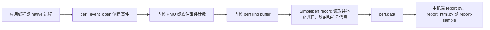

---


title: Simpleperf
chapter: '14.2'
section: '14.2'
status: finalized
drafted_date: '2026-04-03'
drafted_by: openclaw-task2a
applicable_versions: Android 5.0 (API 21) – Android 17 (API 37)
version_boundary: '[已验证] API 21-37 (Android 5-17) 基于 NDK r29 + android-17.0.0_r1 全量源码路径验证 — 2026-06-21 Task2B 验证 simpleperf 核心源码 (main.cpp/cmd_record/environment/JITDebugReader 等 19 个文件) 均在 android-17.0.0_r1 存在'
last_verified: '2026-06-21'
last_verified_against: NDK r29 simpleperf docs + AOSP system/extras/simpleperf (android-17.0.0_r1, 2026-06-21 全量源码路径验证通过) + Perfetto linux.perf data source docs
confidence: medium
sources:
  - type: official
    path: android.googlesource.com/platform/system/extras/+/android-17.0.0_r1/simpleperf/doc/README.md
    note: android-17.0.0_r1 分支，Simpleperf 官方文档与命令行行为锚点
tags:
  - simpleperf
  - cpu-profiling
  - performance-analysis
  - ndk
  - native-profiling
last_task9_audit: '2026-07-17T11:25:48+08:00'
last_task9_audit_at: '2026-06-10T16:20:00+08:00'
last_task9_reviewed_at: '2026-06-22T00:28:28+08:00'
last_task9_at: '2026-06-22T00:28:28+08:00'
last_task9_autofix_at: '2026-06-22'
last_task2b_lite_at: 2026-06-22
task2b_result: fixed-lite
task2b_state: fixed
task6_state: reviewed
task9_state: reviewed
pipeline_stage: ready-to-publish
last_task2b_at: 2026-06-21T12:52:41+08:00
task9_result: auto-fixed
task6_result: pass-light-edit
task6_review_notes: "2026-06-22 18 Task6 revisiting-review (Task2B lite-fix 后复审): pass-light-edit。修复 6 处重复 frontmatter key + 3 处 简单perf→Simpleperf 术语一致性。L1/L2 扫描零命中（上分为上分流误匹配）。否定-纠正 1 处在限内。无 B 类问题。task9_result=auto-fixed 视为 pass，queue 无 pending，自动晋升 finalized。"
reviewed_by: openclaw-task6
reviewed_date: 2026-06-23
last_task6_at: 2026-06-22T18:17:53+08:00
last_task6_review_log: "logs/review/2026-06-22-18-review.md"
task6_l1_l2_fixes: 9
task6_l3_l4_issues: 0
task6_new_rework: false
last_task2b_by: openclaw-task2b-main
deepseek_cn_review_state: done
last_deepseek_cn_review_at: 2026-06-22
last_task6_audit: "2026-07-04"
last_task6_audit_at: '2026-07-04T17:11:54+08:00'
last_task6_audit_reason: 'idle audit: L1扫描修复3处禁用词(链路→调用过程/启动流程/折叠流程)，高频词/否定纠正/元叙述/物理动词均零命中，frontmatter完整，无outline块(工具章节不适用)'
last_task9_audit_log: 'logs/deep-review/2026-07-17-11-audit.md'
---

# 14.2 Simpleperf

Simpleperf 是 Android 平台的原生 CPU profiler。它借助 Linux `perf_events` 子系统采集计数器、程序计数器和调用栈，再把结果写入 `perf.data`。它适合回答“CPU 时间花在哪些函数”“某段代码消耗了多少条指令”“热点由哪条调用路径进入”等问题。

它不负责堆内存泄漏、Java 对象分配、完整系统调用时序或整机功耗归因。对应问题应分别使用 Heap Dump/LeakCanary、Allocation Tracking、Perfetto ftrace 和 Power Profiler。Simpleperf 的 PMU 计数可以辅助解释 CPU 行为，却不能单独换算成可靠的能耗。

本文的平台源码统一锚定 `android-17.0.0_r1`，内核源码统一锚定 `android17-6.18-2026-06_r6`。涉及 Android 5.0 至 Android 16 的内容仅用于说明兼容边界。

## 14.2.1 采样模型

一次采样从内核事件开始，在主机报告结束。下面的图用于定位每一层负责的数据。



内核决定事件能否打开、何时产生样本以及样本进入哪个 ring buffer。Simpleperf 负责配置事件、持续读取记录、处理调用栈并保存分析所需的元数据。报告工具再把地址映射到库、函数和源码行。

这套模型带来三个阅读报告时必须遵守的约束：

- `record` 产生的是离散样本，不是每次函数调用的日志。占比接近，表示事件权重接近；它不保证调用次数接近。
- `cpu-cycles`、`instructions`、`task-clock` 衡量的量不同。报告里的 `Overhead` 取决于所选事件，不能一律解释为墙钟时间。
- 函数地址只有配上正确 build id 的符号文件才有意义。采样完整而符号缺失时，报告仍会出现大量 `[unknown]`。

内核实现入口可从 [`kernel/events/core.c`](https://android.googlesource.com/kernel/common/+/refs/tags/android17-6.18-2026-06_r6/kernel/events/core.c) 和 [`include/uapi/linux/perf_event.h`](https://android.googlesource.com/kernel/common/+/refs/tags/android17-6.18-2026-06_r6/include/uapi/linux/perf_event.h) 查看。产品内核的配置、SELinux 策略、PMU 型号和厂商限制会影响可用事件，源码标签本身不能替代目标设备探测。

## 14.2.2 版本与权限边界

### 版本能力

| Android 版本 | Simpleperf 能力边界 |
| --- | --- |
| Android 5.0（API 21）起 | 设备端 `simpleperf` 可执行文件受支持 |
| Android 7.0（API 24）起 | 官方 Python 采集与报告脚本受支持；Java 仅能识别已编译为本地指令的代码 |
| Android 8.x（API 26–27） | Java 仍以已编译代码为主；系统库开始普遍携带 `.gnu_debugdata` |
| Android 9（API 28）起 | 可为解释执行、JIT 和 AOT Java/Kotlin 代码生成调用栈 |
| Android 10（API 29）起 | release 应用可声明 `profileable`，由 shell 使用预装分析工具采样 |
| Android 16（API 36）起 | 应用采样优先由 `simpleperf_app_runner` 启动设备内置 Simpleperf；侧载二进制不再拥有获取内核样本所需的权限 |
| Android 17（API 37） | 沿用 runner 路径；本文以 `android-17.0.0_r1` 的实现为准 |

Android 9 以前的 Java 支持不等于 ART method tracing。Simpleperf 仍按 CPU 事件采样，只是可解析的 ART 执行形态受版本约束。Android 9 起，解释器、JIT 与 AOT 代码都能进入采样调用栈。

### 三种常见授权场景

1. `debuggable` 应用：开发构建可通过应用上下文采样。
2. `profileable` release 应用：Android 10 起可允许 shell 使用设备预装的分析工具采样。
3. root/AOSP 调试设备：可分析普通 release 应用、native 系统进程或全系统目标；最终能力仍由内核和安全策略决定。

release 包若要接受本机 shell 采样，应在 `<application>` 中加入下面的声明。这个片段只开放本地 profiling 能力，不会把应用改成 `debuggable`。

```xml
<manifest ...>
    <application ...>
        <profileable android:shell="true" />
    </application>
</manifest>
```

`android:shell="true"` 允许 shell 通过 Simpleperf、Perfetto 等预装工具读取有限的 profiling 数据。它不开放内存数据，也不允许调试器任意检查应用状态，具体限制见 [`<profileable>` 官方说明](https://developer.android.com/guide/topics/manifest/profileable-element)。

不要把 `adb shell am set-debug-app` 当作 release 采样授权；该命令不会修改 APK 的 `debuggable` 或 `profileable` 属性。也不要把 `persist.simpleperf.profile_app_uid` 写成通用、永久授权方案。Android 13 起的该属性服务于“应用内控制 Simpleperf”的专用 API，`api_profiler.py prepare` 还会配置过期时间。常规外部采样交给 `app_profiler.py` 处理。

## 14.2.3 工具位置与环境检查

NDK 发行包把设备端程序、主机端程序和 Python 脚本放在顶层 `simpleperf/` 目录，不在 LLVM toolchain 的 `bin/` 目录：

- `simpleperf/bin/android/${arch}/simpleperf`：设备端静态可执行文件。
- `simpleperf/bin/${host}/${arch}/simpleperf`：主机端报告程序。
- `simpleperf/*.py`：`app_profiler.py`、`report.py`、`report_html.py` 等脚本。

进入 NDK 的 `simpleperf/` 目录后，先让工具查询设备功能。下面的命令用于检查 runner、调用栈、off-CPU 等能力，并列出设备接受的事件名。

```bash
./run_simpleperf_on_device.py list --show-features
./run_simpleperf_on_device.py list
```

输出才是当前设备的能力清单。看到事件名不代表当前 UID 一定有权打开它；采集时返回的 `permission denied`、`not supported` 或 `event not found` 仍需分别处理。

Android 16/17 上应使用同一版本 NDK 附带的脚本发起应用采样。脚本会选择 `simpleperf_app_runner` 和设备内置程序。手工 `adb push` 一个二进制再从应用上下文执行，可能能显示帮助信息，却无法获取内核样本。

## 14.2.4 一条可靠的应用采样路径

下面以一个 profileable 或 debuggable 应用为例，记录十秒用户态 CPU 时间和 DWARF 调用栈。`-lib` 应指向当前 APK 对应的未剥离 native 库目录。

```bash
./app_profiler.py \
  -p com.example.app \
  -r "-e task-clock:u -f 1000 --duration 10 -g" \
  -lib /path/to/unstripped-native-libs

./report_html.py
```

`app_profiler.py` 会在当前目录生成 `perf.data`，并为报告准备 `binary_cache/`。`report_html.py` 读取这两部分，生成包含时间分布、样本表、火焰图和函数信息的 `report.html`。采样期间必须操作目标功能，否则数据只会反映空闲或启动状态。

若要从 Activity 启动前开始采样，可把 Activity 名交给脚本。下面的命令用于覆盖冷启动或页面启动窗口。

```bash
./app_profiler.py \
  -p com.example.app \
  -a .MainActivity \
  -r "-e task-clock:u -f 1000 --duration 5 -g" \
  -lib /path/to/unstripped-native-libs
```

脚本先布置采样，再启动 Activity。分析冷启动时还应固定是否清进程、是否清数据、编译状态和磁盘缓存条件，否则两次结果没有可比性。

### 调用栈开销从低频开始校准

官方命令的默认事件是 `cpu-cycles`，默认频率是每个运行中线程每秒约 4000 个样本。这个默认值不等于所有应用的合适值。混合 Java/native 应用使用 DWARF 展开时，可从 `task-clock:u`、1000 Hz 和短时窗口开始，然后查看样本数量、丢失记录和栈完整度。

采样开销受事件类型、频率、线程数、CPU 型号、栈展开方式和符号处理影响，无法用一个固定百分比覆盖。应在同一设备上比较“未采样”和“采样”两组的业务指标，并把采样频率视为实验变量。

## 14.2.5 `stat`、`record` 与 `report`

### `stat`：回答“消耗了多少”

`stat` 汇总事件计数，不保存每个热点位置。下面的命令用于观察目标进程在十秒内的 CPU 时间、周期数和指令数。

```bash
simpleperf stat \
  -e task-clock,cpu-cycles,instructions \
  -p "${APP_PID}" \
  --duration 10
```

若硬件事件无法打开，可以保留 `task-clock` 单独测量。`instructions / cpu-cycles` 常被称为 IPC，但异构 CPU 上不同微架构、不同 PMU 约束和线程迁核都会影响聚合结果，跨设备比较尤其要谨慎。

### `record`：回答“消耗发生在哪”

`record` 以指定事件触发样本，并把程序计数器、线程、映射及可选调用栈写入 `perf.data`。下面的命令适用于已经具备权限的设备端环境。

```bash
simpleperf record \
  -e task-clock:u \
  -f 1000 \
  -p "${APP_PID}" \
  --duration 10 \
  -g \
  -o perf.data
```

`-f 1000` 表示线程处于运行态时每秒约采样 1000 次。线程一秒只运行 200 ms 时，样本量约为 200 个，而非 1000 个。也可用 `-c <period>` 指定累计多少个事件产生一个样本。

### `report`：回答“样本如何归属”

下面的命令用于读取同一个 `perf.data`，显示调用图并按进程、线程、库和函数分组。

```bash
simpleperf report \
  -i perf.data \
  -g \
  --sort comm,pid,tid,dso,symbol
```

默认报告的主要维度已经包含 `comm,pid,tid,dso,symbol`。显式写出排序字段有助于团队保存可复现命令。需要缩小范围时，可使用 `--comms`、`--pids`、`--tids` 或 `--dsos`。

## 14.2.6 事件选择与解释

### 时间类事件

- `task-clock`：线程在 CPU 上运行的时间，适合用作 CPU 热点的直观权重。
- `cpu-clock`：软件 CPU 时钟事件，也可用于 `--trace-offcpu`。
- `cpu-cycles`：硬件周期计数；CPU 频率、微架构和迁核会改变它与时间的关系。

### 工作量与缓存类事件

- `instructions`：退休指令数，用于观察执行工作量；推测算法改动时常与 `cpu-cycles` 一起看。
- `cache-references`、`cache-misses`：通用缓存事件，但映射到哪级缓存、是否支持以及权限条件由 PMU 驱动决定。
- `raw-*`：平台专用原始事件。事件编码与 CPU 型号绑定，不能把一台设备的命令复制到另一种 SoC 后直接比较。

同一硬件计数器组无法同时容纳过多事件时，内核可能复用 PMU。复用后的计数依赖时间缩放，误差会随负载和调度变化。工程分析可采用两步：

1. 用 `task-clock` 和调用栈找出热点函数。
2. 围绕同一稳定负载，分组采集少量 PMU 事件验证瓶颈类型。

用户态后缀 `:u` 会排除内核态样本。分析应用代码时，它能减少无符号内核帧和权限干扰；分析系统调用成本时则应保留内核态，并准备匹配的内核符号。

## 14.2.7 调用栈与符号

### DWARF 与 frame pointer

`-g` 默认选择 DWARF 调用栈。内核为样本保存寄存器和用户栈数据，Simpleperf 使用 Android 的 `libunwindstack` 展开。它对 Java/native 混合栈更稳健，也依赖 ELF 中的 `.eh_frame`、`.debug_frame`、`.ARM.exidx` 或 `.gnu_debugdata`。

`--call-graph fp` 让内核沿 frame pointer 获取调用链。它在保留 frame pointer 的 ARM64 native 代码上开销较低；ART 不保证为 Java 代码保留合适的 frame pointer，32 位 ARM/Thumb 混合代码也容易断栈。选择 FP 前应确认编译参数和目标代码形态。

下面的两条采集命令用于在同一负载上比较 DWARF 与 FP 的栈完整度。

```bash
./app_profiler.py -p com.example.app \
  -r "-e task-clock:u -f 1000 --duration 10 -g" \
  -lib /path/to/unstripped-native-libs

./app_profiler.py -p com.example.app \
  -r "-e task-clock:u -f 1000 --duration 10 --call-graph fp" \
  -lib /path/to/unstripped-native-libs \
  -o perf-fp.data
```

比较时应检查 `[unknown]` 比例、栈深、热点归属和被测指标扰动。FP 报告更短时，原因可能是省略 frame pointer，而非业务调用路径更浅。

### Java/Kotlin 符号

Android 9 起，Simpleperf 可处理 ART 解释器、JIT 和 AOT 代码。Android 17 源码中的 [`JITDebugReader`](https://android.googlesource.com/platform/system/extras/+/android-17.0.0_r1/simpleperf/JITDebugReader.h) 负责读取 JIT 调试信息，采样程序仍由 perf 事件驱动。

经过 R8/ProGuard 混淆的 Java/Kotlin 符号需要 mapping 文件。下面的报告命令用于恢复原始类名和方法名。

```bash
./report_html.py \
  --proguard-mapping-file /path/to/mapping.txt
```

mapping 文件必须来自与 APK 相同的构建产物。版本不匹配会生成表面可读却归属错误的名字。

### Native 符号

APK 内的 `.so` 通常已经剥离调试信息。`app_profiler.py -lib` 应指向同一构建的未剥离库，脚本据此创建 `binary_cache/`。判断是否匹配应以 ELF build id 为准，不能只看文件名。

已有 `perf.data` 且设备仍可连接时，可补建符号缓存。下面的命令用于从设备和本地目录收集样本涉及的二进制。

```bash
./binary_cache_builder.py \
  -i perf.data \
  -lib /path/to/unstripped-native-libs
```

生成缓存后重新运行报告。若 `[unknown]` 仍集中在应用库，应检查 build id、ABI、split APK 和被采样进程实际加载的路径。

## 14.2.8 多进程、线程与 off-CPU

### 目标选择

下面的命令展示 `record` 支持的几种目标选择方式。

```bash
# 一个或多个 PID
simpleperf record -p 11904,11905 --duration 10

# 名称包含 chrome，或名称匹配给定正则的进程
simpleperf record -p chrome --duration 10
simpleperf record -p "chrome:(privileged|sandboxed)" --duration 10

# 指定线程
simpleperf record -t 11904,11905 --duration 10

# debuggable 或 profileable 应用
simpleperf record --app com.example.app --duration 10

# 全系统目标；常规产品设备通常需要 root
simpleperf record -a --duration 10
```

`--app` 以包名准备应用采样，并可等待应用进程出现。多进程应用仍应在报告中保留 `pid`、`tid` 和 `comm`，否则相同库中的同名函数会被汇总，主进程与 `:remote` 进程的成本难以区分。

`-p` 接受 PID 列表，也可按进程名子串或正则选择。生产脚本若依赖名称匹配，应先记录 `ps -A -o PID,NAME`，防止同名测试进程进入样本。

### off-CPU 采样的边界

普通 CPU 采样只在线程运行时产生样本。`--trace-offcpu` 额外观察 `sched_switch` 和上下文切换记录，从而估计线程离开 CPU 后停留在哪条调用路径。

使用前先探测内核支持。下面的命令用于确认 `trace-offcpu`，再以 `task-clock` 记录 on-CPU 与 off-CPU 数据。

```bash
./run_simpleperf_on_device.py list --show-features

./app_profiler.py \
  -p com.example.app \
  -r "-e task-clock:u -f 1000 --duration 10 -g --trace-offcpu"

./report_html.py --trace-offcpu on-off-cpu
```

`--trace-offcpu` 只允许搭配 `cpu-clock` 或 `task-clock`。报告中的 off-CPU 权重由调度切换时间推导；样本或 switch 记录丢失会降低精度。若问题涉及 runnable 等待、线程唤醒者、Binder 对端或 CPU 频率，Perfetto System Trace 能提供更完整的时间上下文。

## 14.2.9 丢样、截断栈与缓冲区

采样数据要经过内核 perf ring buffer 和 Simpleperf 用户态记录缓冲区。消费者跟不上生产速度时，工具会报告 lost samples；DWARF 样本占用较大，用户态缓冲区紧张时还可能出现 truncated stacks。

不要看到丢样就同时增大所有参数。按下列顺序定位：

1. 降低 `-f`，确认丢样是否随采样率下降。
2. 只出现内核丢样时，逐步增大 `-m`。
3. 用户态缓冲区不足或栈被截断时，增大 `--user-buffer-size`。
4. 缩短采样时长、减少目标线程或改用 FP，检查数据量是否回到可控范围。
5. 每次只改一个变量，并记录工具结束时的 samples、lost 和 truncated 统计。

下面的命令用于在确认用户态缓冲区不足后，把缓存调到 256 MiB。该值仅作诊断起点，不代表设备通用配置。

```bash
./app_profiler.py \
  -p com.example.app \
  -r "-e task-clock:u -f 1000 --duration 10 -g --user-buffer-size 256M"
```

缓冲区增大会增加分析进程的内存占用。系统内存紧张、采样目标很多或栈很深时，应同时观察被测业务是否受到分析工具干扰。

Android 17 的 [`RecordReadThread`](https://android.googlesource.com/platform/system/extras/+/android-17.0.0_r1/simpleperf/RecordReadThread.h) 专门把 kernel buffer 的读取与主线程处理解耦，以降低 DWARF 采样的丢失概率。它能缓解读取阻塞，无法消除过高频率、权限限制或硬件事件溢出带来的问题。

## 14.2.10 报告与时间线工具

### 文本和 HTML 报告

文本报告适合自动化对比。下面的命令用于显示调用图，并限制到一个 native 库。

```bash
./report.py \
  -g \
  --dsos libexample.so
```

HTML 报告适合交互检查。下面的命令会加入源码与反汇编视图。

```bash
./report_html.py \
  --add_source_code \
  --source_dirs /path/to/source-root \
  --add_disassembly
```

源码注释依赖 debug line、源码路径和当前文件内容。构建机路径无法在本机解析时，需要把 `--source_dirs` 指到对应提交的源码树。

### 转为 Perfetto/Android Studio 可读格式

Simpleperf 的 `perf.data` 可由 `report-sample` 转成 Perfetto trace processor 接受的 protobuf。下面的命令保留调用链并生成 `perf.trace`。

```bash
simpleperf report-sample \
  --protobuf \
  --show-callchain \
  -i perf.data \
  -o perf.trace
```

生成的文件可在 Android Studio CPU Profiler 或 Perfetto UI 中打开。正确子命令是 `report-sample`，`simpleperf report --protobuf` 不是这条转换路径。

Perfetto 的 `linux.perf` 是另一套采集入口。Android 17 的 Perfetto 具备该数据源，它也调用 `perf_event_open`，但会在 Perfetto 会话中直接生成 callstack samples，因此能与同一次会话的 ftrace 数据共享时间轴。它不会把已经生成的 Simpleperf `perf.data` 自动并入新会话。

下面的 Perfetto 配置用于在 Android 17 上对指定进程名进行 100 Hz 调用栈采样，并在同一会话加入调度和进程信息。运行前仍需满足目标设备的权限和 unwind 条件。

```protobuf
duration_ms: 10000

buffers {
  size_kb: 40960
  fill_policy: DISCARD
}

data_sources {
  config {
    name: "linux.perf"
    perf_event_config {
      timebase {
        counter: SW_CPU_CLOCK
        frequency: 100
        timestamp_clock: PERF_CLOCK_MONOTONIC
      }
      callstack_sampling {
        scope {
          target_cmdline: "com.example.app"
        }
      }
    }
  }
}

data_sources {
  config {
    name: "linux.ftrace"
    ftrace_config {
      ftrace_events: "sched/sched_switch"
      ftrace_events: "sched/sched_waking"
    }
  }
}

data_sources {
  config {
    name: "linux.process_stats"
    process_stats_config {
      scan_all_processes_on_start: true
    }
  }
}
```

`SW_CPU_CLOCK` 是采样 timebase；`linux.ftrace` 补充切换与唤醒事件；`linux.process_stats` 补充进程元数据。字段定义可在 Android 17 的 [`perf_event_config.proto`](https://android.googlesource.com/platform/external/perfetto/+/refs/tags/android-17.0.0_r1/protos/perfetto/config/profiling/perf_event_config.proto) 和 [`perf_events.proto`](https://android.googlesource.com/platform/external/perfetto/+/refs/tags/android-17.0.0_r1/protos/perfetto/common/perf_events.proto) 中核对。选择工具时可按问题形态判断：函数热点和源码归属优先 Simpleperf；需要把调用栈与调度、Binder、频率、帧时间放在同一时间轴时，优先 Perfetto `linux.perf` 加 ftrace。

## 14.2.11 Android 17 源码实现要点

### 应用 runner 的版本分支

下面的摘录用于说明 Android 16/17 为什么优先使用设备内置 Simpleperf，代码来自 `android-17.0.0_r1` 的 `environment.cpp`。

```cpp
// Before Android 16, we prefer using run-as, which can use the latest sideloaded simpleperf.
// After Android 16, sideloaded simpleperf has no permission to get kernel samples. So prefer
// using simpleperf_app_runner to run simpleperf shipped on device.
bool prefer_simpleperf_app_runner = GetAndroidVersion() >= kAndroidVersion16;
```

后续分支在 Android 16/17 上先尝试 `simpleperf_app_runner`，旧版本先尝试 `run-as`。这也是推荐 `app_profiler.py` 代替手写 push/run-as 脚本的源码依据，完整上下文见 [`environment.cpp`](https://android.googlesource.com/platform/system/extras/+/android-17.0.0_r1/simpleperf/environment.cpp#841)。

### 采集与展开模块

| 模块 | Android 17 中的职责 |
| --- | --- |
| [`event_selection_set.cpp`](https://android.googlesource.com/platform/system/extras/+/android-17.0.0_r1/simpleperf/event_selection_set.cpp) | 组织事件、CPU、线程和 perf event fd，启动记录读取线程 |
| [`RecordReadThread.cpp`](https://android.googlesource.com/platform/system/extras/+/android-17.0.0_r1/simpleperf/RecordReadThread.cpp) | 从 kernel buffer 读取 record，管理用户态缓冲与数据通知 |
| [`OfflineUnwinder.h`](https://android.googlesource.com/platform/system/extras/+/android-17.0.0_r1/simpleperf/OfflineUnwinder.h) | 用采样寄存器、栈和映射执行离线 DWARF 展开 |
| [`JITDebugReader.h`](https://android.googlesource.com/platform/system/extras/+/android-17.0.0_r1/simpleperf/JITDebugReader.h) | 读取 ART JIT/DEX 调试描述，维护 JIT 代码符号 |
| [`cmd_record.cpp`](https://android.googlesource.com/platform/system/extras/+/android-17.0.0_r1/simpleperf/cmd_record.cpp) | 解析 `record` 参数，协调记录、映射、展开和文件写入 |
| [`record_file_writer.cpp`](https://android.googlesource.com/platform/system/extras/+/android-17.0.0_r1/simpleperf/record_file_writer.cpp) | 写入 `perf.data` 及其 feature sections |

这些模块解释了两个常见现象：采样期间看到的栈可能在写盘前经过离线展开；JIT 方法名依赖运行时调试信息，不能只靠 APK 内静态符号恢复。

## 14.2.12 热、频率与异构 CPU

Simpleperf 记录的是设备当时执行出来的数据。温控降频、任务迁核和后台负载会改变同一业务路径的 `task-clock`、`cpu-cycles` 与样本分布。

分析 big.LITTLE 或更多 CPU cluster 时，应保存以下实验条件：

- 设备型号、系统构建号、内核版本和电量状态；
- 前台/后台状态、屏幕亮度、网络与充电状态；
- 测试前温度区间和每轮冷却策略；
- 业务输入、迭代次数、编译模式与应用版本；
- Simpleperf 事件、频率、调用栈模式和权限路径。

不要关闭 thermal service、改 sysctl、解除厂商 PMU 限制或强制锁频来“修复”采样。此类修改会改变调度和功耗环境，也可能损害设备。需要解释频率和调度时，可另采 Perfetto 的 `power/cpu_frequency`、调度与 thermal 数据源；目标设备是否开放对应 tracepoint 仍由产品配置决定。

跨 cluster 聚合 `cpu-cycles` 时，一个周期的微架构意义不相同。可把 `task-clock` 用作热点排序，再按 CPU 或 cluster 分组查看硬件事件。若优化前后的线程落在不同 cluster，单个全局 IPC 数字很容易掩盖迁核造成的变化。

## 14.2.13 结果复核清单

采集完成后，按以下问题检查报告：

- 目标包、PID、进程名和采样时段是否正确？
- 业务操作是否完整覆盖采样窗口？
- 事件是否在目标设备成功打开？是否发生 PMU 复用？
- 结束日志里是否有 lost samples 或 truncated stacks？
- `[unknown]` 是否集中在应用库？build id 与 mapping 文件是否匹配？
- Java、JIT、AOT 和 native 帧是否符合系统版本能力？
- `Overhead` 表示哪一种事件权重？是否被误写成墙钟耗时？
- 优化前后是否使用相同设备状态、输入、频率和调用栈方式？
- 热、频率、迁核或后台任务能否解释差异？
- 结论能否由另一轮采样、微基准或 Perfetto 时间线交叉验证？

这份清单能拦住两类误判：把采样噪声当成业务变化，以及把符号或权限缺失当成“代码没有执行”。

## 参考资料

- [Simpleperf 总览（AOSP `android-17.0.0_r1`）](https://android.googlesource.com/platform/system/extras/+/android-17.0.0_r1/simpleperf/doc/README.md)
- [Android 应用采样（AOSP `android-17.0.0_r1`）](https://android.googlesource.com/platform/system/extras/+/android-17.0.0_r1/simpleperf/doc/android_application_profiling.md)
- [命令参考（AOSP `android-17.0.0_r1`）](https://android.googlesource.com/platform/system/extras/+/android-17.0.0_r1/simpleperf/doc/executable_commands_reference.md)
- [脚本参考（AOSP `android-17.0.0_r1`）](https://android.googlesource.com/platform/system/extras/+/android-17.0.0_r1/simpleperf/doc/scripts_reference.md)
- [`<profileable>` manifest element（Android Developers）](https://developer.android.com/guide/topics/manifest/profileable-element)
- [Android Studio Callstack Sample（Android Developers）](https://developer.android.com/studio/profile/sample-callstack)
- [Perfetto callstack sampling](https://perfetto.dev/docs/quickstart/callstack-sampling)
- [Perfetto 导入 Simpleperf 数据](https://perfetto.dev/docs/getting-started/other-formats)
- [Perfetto `PerfEventConfig`（AOSP `android-17.0.0_r1`）](https://android.googlesource.com/platform/external/perfetto/+/refs/tags/android-17.0.0_r1/protos/perfetto/config/profiling/perf_event_config.proto)
- [Perfetto perf event 枚举（AOSP `android-17.0.0_r1`）](https://android.googlesource.com/platform/external/perfetto/+/refs/tags/android-17.0.0_r1/protos/perfetto/common/perf_events.proto)
- [Linux perf events core（`android17-6.18-2026-06_r6`）](https://android.googlesource.com/kernel/common/+/refs/tags/android17-6.18-2026-06_r6/kernel/events/core.c)
- [perf_event UAPI（`android17-6.18-2026-06_r6`）](https://android.googlesource.com/kernel/common/+/refs/tags/android17-6.18-2026-06_r6/include/uapi/linux/perf_event.h)
