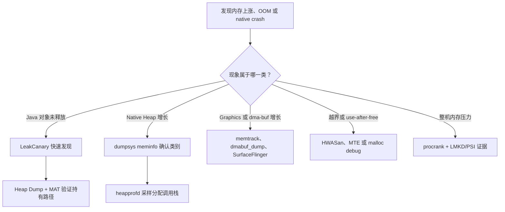

# 内存分析工具

<!-- outline-start -->
## 本节要点大纲

### 锚点（必须覆盖）

- 🔹 LeakCanary 原理与配置
- 🔹 MAT（Memory Analyzer Tool）的使用方法
- 🔹 heapprofd（Perfetto）Native 内存分析
- 🔹 adb shell dumpsys meminfo 的详细解读
- 🔹 showmap / procrank / libmeminfo 等内存查看工具

### 扩展（可选深入）

- 🔸 malloc debug / malloc hooks 的使用方法
- 🔸 HWASAN / MTE 用于内存错误检测

### OpenClaw 加工指引

> **锚点**是最低覆盖要求，加工时必须逐条落实并标注验证结果。
> **扩展**视素材丰富程度选择性深入。
> 如果从 Obsidian 素材或 AOSP 源码中发现大纲未列出但与本节强相关的知识点，
> 可**就地插入**最相关的锚点之后，并用 `[自动发现]` 标注，方便后续 review。
> 锚点内容需 L1/L2 验证，扩展内容至少 L2 验证，自动发现内容至少标注来源。
<!-- outline-end -->

## 先确定要测哪一种内存

“应用内存上涨”只描述了现象。Java 对象、C/C++ allocator、匿名 `mmap`、文件映射、线程栈、Graphic Buffer 和 zRAM 中的换出页，采集接口与归因方式都不同。选错工具时，报告可能很完整，结论却指向另一个内存域。

本文按四类证据组织工具：

| 证据 | 能回答的问题 | 主要工具 |
| --- | --- | --- |
| Java 对象保留图 | 哪个 GC Root 仍能到达应销毁对象 | LeakCanary、Android Studio Heap Dump、MAT |
| 分配调用栈 | 哪条代码路径分配最多、当前仍保留多少采样分配 | heapprofd、ART allocation profiling |
| 进程与 VMA 记账 | PSS/RSS/USS 如何变化，内存落在哪类映射 | `dumpsys meminfo`、`showmap`、`procrank`、libmeminfo |
| 非法内存访问 | 哪里发生越界、use-after-free 或错误释放 | malloc debug、HWASan、MTE |

下面的决策图用于从症状选择第一件工具。



同一问题常要经过两层证据：记账工具确认“涨在哪里”，归因工具解释“由谁产生”。单次快照通常只能提出假设。

本文的平台实现锚定 `android-17.0.0_r1`，涉及内核 `/proc`、dma-buf 与 MTE 的说明锚定 `android17-6.18-2026-06_r6`。较早版本只保留兼容边界。

## LeakCanary：发现应被回收的 Java 对象

### 它观察的对象

LeakCanary 适合开发与测试阶段。默认 watcher 会观察已经销毁的 `Activity`、`Fragment`、Fragment View，以及已经执行 `onCleared()` 的 `ViewModel`。业务对象不在默认清单时，可在生命周期结束处交给 `ObjectWatcher`。

它判断的是“对象在等待期和 GC 后仍被保留”，不是“对象已经被证明永远无法释放”。异步任务、动画、消息队列和测试操作尚未结束，都可能让对象暂时存活。

LeakCanary 2.14 的基础依赖应只进入 debug 变体。下面的配置用于避免把堆转储与分析代码带进 release APK。

```kotlin
dependencies {
    debugImplementation("com.squareup.leakcanary:leakcanary-android:2.14")
}
```

依赖中的 manifest initializer 会在主进程安装默认 watcher，无需在 `Application` 手工初始化。构建产物仍应通过依赖分析确认 release 变体不含 LeakCanary。

### 从弱引用到 leak trace

LeakCanary 的处理过程分为四段：

1. 生命周期 watcher 把应结束生命周期的对象交给 `ObjectWatcher`，后者只保留弱引用。
2. 默认等待五秒并触发 GC；弱引用仍未清除时，对象进入 retained 集合。
3. retained 数量达到当前阈值后，LeakCanary 调用 Android heap dump 接口。
4. Shark 解析 HPROF，从 GC Root 搜索到 retained object 的引用路径，并按 leak signature 聚类。

GC Root 到目标对象的路径才是修复依据。通知里的红色可疑引用表示 Shark 认为该边不符合生命周期预期；路径中出现一个熟悉的类名，不能直接证明那个类创建了泄漏。

业务对象可在确定不再使用的位置显式观察。下面的例子用于检查页面销毁后 `CheckoutPresenter` 是否还能被回收。

```kotlin
AppWatcher.objectWatcher.expectWeaklyReachable(
    presenter,
    "CheckoutPresenter should be released after CheckoutActivity.onDestroy"
)
```

这段代码只登记观察目标。描述应写清对象何时失效，报告才便于回到对应生命周期核对。

### 配置等待时间与触发阈值

多数项目保留默认自动安装即可。需要自定义 watcher 或 `retainedDelayMillis` 时，应先覆盖自动安装资源。下面的资源关闭默认安装。

```xml
<?xml version="1.0" encoding="utf-8"?>
<resources>
    <bool name="leak_canary_watcher_auto_install">false</bool>
</resources>
```

关闭后必须在主进程安装 watcher。下面的代码把保留等待时间设为八秒，适合确有长动画或异步清理的测试场景。

```kotlin
class DemoApplication : Application() {
    override fun onCreate() {
        super.onCreate()
        AppWatcher.manualInstall(
            application = this,
            retainedDelayMillis = 8_000
        )
    }
}
```

等待时间越长，临时保留造成的噪声越少，反馈也越慢。不要用延长等待时间掩盖稳定复现的引用路径。

堆转储策略属于 `LeakCanary.config`。下面的配置把可见进程触发阈值设为三个 retained objects。

```kotlin
LeakCanary.config = LeakCanary.config.copy(
    dumpHeap = true,
    retainedVisibleThreshold = 3
)
```

阈值控制何时 dump，不改变对象是否被判定 retained。自动化测试若只想收集 retained 计数而不暂停进程，可在测试配置中关闭 `dumpHeap`。

### 如何读一条报告

按以下顺序读 leak trace：

1. 确认目标对象的生命周期已经结束，复现步骤也已经完成。
2. 从 GC Root 往下看，区分静态字段、线程、JNI global reference 和 framework 缓存。
3. 找到第一条生命周期不合理的强引用，核对它的写入和清理位置。
4. 修复后重复相同操作，等待 retained object 消失，并确认没有换成另一条签名。

LeakCanary 不会自动覆盖所有单例、缓存和业务容器。自定义对象应显式观察；只表现为“大量仍然合法存活对象”的内存膨胀，应转到 heap dump 的 Histogram 与 Dominator Tree。

## MAT：离线分析 Java 堆对象图

### HPROF 包含什么

HPROF 是某一时刻的 managed heap 快照，包含类、对象、字段、数组、线程与 GC Root 等信息。它适合回答“对象为何仍可达”和“谁支配了大量 Java 对象”。它不记录历史分配时序，也不覆盖 malloc heap、未映射 dma-buf 或 GPU 驱动私有内存。

Android Studio 的 Heap Dump 页面能直接采集与浏览 Android HPROF。MAT 的 Dominator Tree、Path to GC Roots、OQL 和大堆处理更适合复杂离线分析。

### 采集与转换

Android 17 的 `am dumpheap` 支持进程名或 PID；`-g` 会在 dump 前请求一次 GC。下面的命令用于采集 managed heap 并拉到主机。

```bash
adb shell am dumpheap -g "${APP_PID}" /data/local/tmp/app.hprof
adb pull /data/local/tmp/app.hprof ./app-android.hprof
```

`-g` 能减少已经不可达却尚未回收的对象，但 GC 时机与堆状态仍会受运行时影响。采集过程会暂停应用并增加临时内存，不能把它当成无扰动观测。

Android HPROF 若无法被 MAT 直接打开，可用 SDK Platform-Tools 的 `hprof-conv` 转为 Java SE HPROF。下面的命令只转换文件格式，不补充缺失的 native 数据。

```bash
"${ANDROID_SDK_ROOT}/platform-tools/hprof-conv" \
    app-android.hprof \
    app-mat.hprof
```

转换后的 `app-mat.hprof` 可交给 MAT。Android Studio 从 Past Recordings 导出的文件是否仍需转换，以 MAT 的解析结果为准。

### 四个概念

- **Shallow size**：对象本身在 Java heap 中占用的字节，不包含它引用的对象。
- **Retained size**：支配关系下，移除该对象后可一并变为不可达的对象大小估计。
- **Dominator**：从任意 GC Root 到目标对象的所有路径都经过的对象。
- **Path to GC Roots**：目标对象到 GC Root 的引用路径；分析泄漏时通常排除 weak、soft 和 phantom references。

Retained size 很大说明该对象控制着大块对象图，不等于该对象自身分配了这些字节。Histogram 中数量最多的类也不必然是泄漏源；缓存、预加载和池化对象可能有合法生命周期。

### 一套可复现的 MAT 流程

1. 固定应用版本、设备、测试账号和操作脚本，预热到稳定状态。
2. 执行基线操作并采集 HPROF A。
3. 重复进入和退出目标场景，等待异步清理完成，再采集 HPROF B。
4. 比较 Histogram，找出实例数与 shallow size 持续增加的类。
5. 在 B 中按 retained size 查看 Dominator Tree。
6. 对目标实例执行 Path to GC Roots，排除弱引用，找到第一条异常强引用。
7. 回到源码验证写入、移除和生命周期，修复后以同一脚本复测。

单个 HPROF 适合判断持有关系，两份或多份同条件 HPROF 才适合判断增长。对象数量上涨一次也可能来自懒加载，需要用重复轮次确认是否达到平台期。

### Bitmap 的版本边界

Android 8.0 起，Bitmap 像素数据由 native heap 管理，Java `Bitmap` 对象主要保存 native 指针和元数据。MAT 能看到 Java wrapper 与引用关系，不能依靠标准 HPROF 还原完整像素内存。

Android Studio Heap Dump 会为部分 framework 类型提供 Native Size 和 Bitmap 预览，这属于 Android Studio 的增强信息。`dumpsys meminfo` 的 `Graphics`、`Native Heap` 与 Bitmap 预览应一起看；图像数据落在 Graphic Buffer 时，还要转到 dma-buf 工具。

## heapprofd：按调用栈采样堆分配

### Native 模式的模型

heapprofd 从 Android 10 起作为 Perfetto 数据源提供。默认模式 hook `malloc/free`、`new/delete` 等 allocator 调用，对分配按字节概率采样，并把寄存器、栈和分配/释放记录送给独立的 heapprofd 进程展开与聚合。

采样间隔为 `n` 字节时，每个字节约有 `1/n` 的概率命中，工具再用统计权重估算总体。Android 17 的默认间隔是 4096 字节。把间隔设为 1 可提高准确度，也会显著放大记录量和被测进程开销。

heapprofd 统计的是 allocator 请求与释放。allocator arena、页粒度、碎片、zRAM 和 mmap 区域会让 heapprofd 的 live bytes、`malloc_info()` 与 Native Heap RSS 出现差异。三者不应强行对齐。

### 权限与目标

user 构建只允许采样 manifest 标记为 `debuggable` 或 `profileable` 的 Java 应用。release 性能包可使用下面的声明开放本地 shell profiling。

```xml
<application ...>
    <profileable android:shell="true" />
</application>
```

该声明只开放受限 profiling 数据，不会让应用进入 debug 运行模式。userdebug/eng 对普通应用和多数系统进程更宽松，但 SELinux 仍会禁止一小组关键服务。

### 推荐命令

Perfetto 的 `tools/heap_profile` 会构造配置、启动会话、拉取 raw trace 并生成 pprof 文件。下面的命令按进程名采集三十秒，每五秒生成一个 snapshot。

```bash
tools/heap_profile android \
    -n com.example.app \
    -d 30000 \
    -i 4096 \
    -c 5000
```

结果目录中的 `raw-trace` 可直接交给 Perfetto UI。按进程名采集还能覆盖会话开始后新启动的匹配进程；按 PID 采集只跟踪当前实例。

需要把堆数据与调度、Binder 或自定义 trace 放入同一会话时，可手写 TraceConfig。下面的 Android 17 配置采样 native malloc heap，并每五秒输出一个 snapshot。

```protobuf
duration_ms: 30000

buffers {
  size_kb: 65536
  fill_policy: DISCARD
}

data_sources {
  config {
    name: "android.heapprofd"
    heapprofd_config {
      process_cmdline: "com.example.app"
      sampling_interval_bytes: 4096
      continuous_dump_config {
        dump_interval_ms: 5000
      }
    }
  }
}
```

`process_cmdline` 可覆盖已运行及后续启动的匹配进程。配置字段以 Android 17 的 [`heapprofd_config.proto`](https://android.googlesource.com/platform/external/perfetto/+/refs/tags/android-17.0.0_r1/protos/perfetto/config/profiling/heapprofd_config.proto) 为准；文本配置交给 Perfetto CLI 时要使用 `--txt`。

### ART allocation profiling

Android 12 起，heapprofd 还可选择 ART 注册的 `com.android.art` heap。它记录 Java 对象的分配调用栈、类型、累计字节和次数，用于分析 allocation churn。

下面的命令用于采集 ART 分配样本。

```bash
tools/heap_profile android \
    -n com.example.app \
    -d 30000 \
    --heaps com.android.art
```

ART 模式不跟踪对象何时删除或被 GC，也不生成对象引用图。它能定位“谁频繁创建对象”，泄漏持有路径仍要由 HPROF、LeakCanary 或 MAT 给出。

### 读火焰图

Native snapshot 常见的两个视角是：

- 累计分配：时间窗内该调用栈分配过多少估算字节或次数，包含已经释放的分配。
- snapshot 时仍存活：到该 snapshot 尚未收到 free 的采样分配，适合寻找持续增长的 native 路径。

“仍存活”也不自动等于泄漏。长生命周期缓存、allocator 延迟释放和会话尚未覆盖释放动作都会保留数据。连续 snapshots 中同一调用栈稳定增长，且业务生命周期已经结束时，证据更强。

### 空报告与异常栈

- 结果为空：检查包是否 `debuggable/profileable`、目标进程名是否匹配、是否存在并发 heapprofd 会话。
- 启动阶段缺样本：runtime attach 会有延迟；按进程名启动会话通常比进程启动后按 PID 连接覆盖更早。
- buffer overrun：短暂峰值可增大 `--shmem-size`；持续过载应增大 `--interval`，接受较低精度。
- native 符号缺失：提供与二进制 build id 匹配的未剥离符号，再执行 Perfetto symbolization。
- Java 帧出现 `[DEDUPED]`：ART 的 identical code folding 让多个方法共享代码，显示名不一定是执行的那个方法。

不要写死“heapprofd 开销低于某个百分比”。分配率、采样间隔、栈深、线程数和缓冲策略都会改变扰动，应在目标设备上对比开启前后的业务指标。

## `dumpsys meminfo`：进程内存记账快照

### 采集方式

下面的命令分别输出完整分类、ART 细项、摘要，以及一个包加载到的全部进程。

```bash
adb shell dumpsys meminfo com.example.app
adb shell dumpsys meminfo -d com.example.app
adb shell dumpsys meminfo -s com.example.app
adb shell dumpsys meminfo --package com.example.app
```

`-d` 增加 Dalvik/ART 子项；`-s` 只保留 App Summary；`--package` 适合含 `:remote`、WebView 或其他辅助进程的应用。Android 17 的选项解析可在 [`ActivityManagerService`](https://android.googlesource.com/platform/frameworks/base/+/refs/tags/android-17.0.0_r1/services/core/java/com/android/server/am/ActivityManagerService.java#13030) 中核对。

### PSS、RSS、USS 与 swap

| 指标 | 含义 | 适合回答的问题 |
| --- | --- | --- |
| RSS | 当前驻留的共享页与私有页总和，共享页在每个进程重复计算 | 单进程驻留集如何变化 |
| PSS | 私有页加共享页按映射进程数分摊后的份额 | 进程对系统内存压力的近似贡献 |
| USS | Private Clean 与 Private Dirty 之和 | 该进程独占的驻留页有多少 |
| Swap / SwapPss | 已换出页，SwapPss 对共享换出页按比例分摊 | zRAM/swap 是否承担了部分工作集 |

PSS 可以避免共享页在进程间重复记账，但把所有进程 PSS 相加也不等于整机全部物理内存：内核自身、未映射页、设备内存和统计时刻变化仍在进程口径之外。

Android 17 的 `Debug.MemoryInfo.getTotalPss()` 会在内核提供 SwapPss 时把 proportional swapped-out pages 加入 total。解析脚本应保存原始列名和系统版本，避免把 `TOTAL PSS` 与单独显示的 swap 列重复相加。

Private Dirty 不表示“只有杀进程才能回收”。匿名 dirty 页可换入 zRAM，文件支持的 dirty 页也可能回写；它表示页面是进程私有且内容已改变。Private Clean 多为可重新从文件加载的私有页，内存压力下更容易丢弃。

### 分类行与 App Summary

- `Java Heap`：ART managed heap 的私有部分以及归入 Java heap 的 ART 映射。
- `Native Heap`：默认 native allocator 对应的私有 dirty malloc 空间。
- `Code`：`.so`、`.jar`、`.apk`、`.dex`、`.oat` 等代码与静态资源的私有部分。
- `Stack`：Java 与 native 线程栈的 private dirty。
- `Graphics`：Gfx、EGL、GL 的 private 统计，部分数据来自 memtrack。
- `Private Other`：尚未归入前述类别的 private clean/dirty。
- `System`：摘要中归入系统的共享内存份额。

App Summary 不是上方每一行 PSS 的简单求和。Android 17 的 [`Debug.MemoryInfo`](https://android.googlesource.com/platform/frameworks/base/+/refs/tags/android-17.0.0_r1/core/java/android/os/Debug.java#720) 会把 private 与 shared 部分重新归组。`Graphics` 还受 graphics driver 的 memtrack 报告质量影响，源码也明确保留了误报警告。

### 如何判断“持续增长”

一轮可靠的趋势测试应固定进程状态和业务动作：

1. 冷启动或预热到约定状态，记录 PID、构建号和第一次快照。
2. 重复同一操作若干轮，每轮等待异步任务与动画结束。
3. 同时保存 `TOTAL PSS`、RSS、SwapPss、Java Heap、Native Heap、Graphics 和进程列表。
4. 观察是否达到稳定平台，并在必要时抓 HPROF、heapprofd 或 dma-buf 明细。

PSS 一次不回落不能证明泄漏。Java heap 会保留已提交空间，native allocator 会保留 arena，图片与代码会进入缓存，线程池也可能延迟销毁。趋势、生命周期和归因调用栈要互相印证。

## `showmap`、`procrank` 与 libmeminfo

### `showmap`：逐个 VMA 查看

Android 17 的 `showmap` 读取 `/proc/<pid>/smaps`，按 VMA 输出 VSS、RSS、PSS、private/shared clean/dirty、swap 等字段。下面的命令显示地址并避免合并同名 VMA。

```bash
adb shell showmap -a -v "${APP_PID}"
```

`[anon:libc_malloc]` 变大通常指向 allocator heap；大型匿名 `mmap` 不一定属于 malloc；`.so/.dex/.apk` 是文件映射。命令能否读取目标 `/proc/<pid>/smaps` 由 user build、SELinux 和 procfs 权限决定，不能假定所有商用设备都允许 shell 查看任意进程。

`showmap` 只能报告已经映射进该进程地址空间的页。只持有 dma-buf fd、仅由 GPU/内核引用或映射在其他进程的 buffer，可能不会在目标 VMA 中呈现。

### `procrank`：跨进程排序

下面的命令分别按 PSS、USS、RSS 和 swap 排序全系统进程。

```bash
adb shell procrank -p
adb shell procrank -u
adb shell procrank -r
adb shell procrank -s
```

Android 17 的默认排序已经是 PSS，显式参数便于保存实验脚本。`procrank` 是否被产品镜像打包、shell 能读取多少进程，都由设备构建决定；缺少命令时可在 AOSP 构建中生成对应 binary。

`procrank` 适合找出大进程，不能预测 LMKD 的唯一候选。LMKD 还会结合 PSI、thrashing、swap、`oom_score_adj` 和产品策略；`procrank -o` 展示 oom score 维度时也只是一张当前快照。

### libmeminfo 的源码分工

libmeminfo 是平台内部 C++ 库，不是应用 SDK API。Android 17 的实现位于独立仓库 `platform/system/memory/libmeminfo`：

| 模块 | 职责 |
| --- | --- |
| [`procmeminfo.cpp`](https://android.googlesource.com/platform/system/memory/libmeminfo/+/refs/tags/android-17.0.0_r1/procmeminfo.cpp) | 解析 `smaps`/`smaps_rollup`、`pagemap`，管理 working set |
| [`androidprocheaps.cpp`](https://android.googlesource.com/platform/system/memory/libmeminfo/+/refs/tags/android-17.0.0_r1/androidprocheaps.cpp) | 把 VMA 归类到 Android heap categories |
| [`libsmapinfo/smapinfo.cpp`](https://android.googlesource.com/platform/system/memory/libmeminfo/+/refs/tags/android-17.0.0_r1/libsmapinfo/smapinfo.cpp) | 为 `showmap`、`procrank`、`librank` 提供统计与输出 |
| [`libdmabufinfo`](https://android.googlesource.com/platform/system/memory/libmeminfo/+/refs/tags/android-17.0.0_r1/libdmabufinfo/) | 读取 dma-buf 引用、映射和 per-buffer 统计 |

`ProcMemInfo::ResetWorkingSet()` 会向 `/proc/<pid>/clear_refs` 写入 `1`。这类接口需要特权并会改变 working-set 统计状态，常规应用采集不应直接照搬。

内核 PSS/smaps 生成逻辑可从 [`fs/proc/task_mmu.c`](https://android.googlesource.com/kernel/common/+/refs/tags/android17-6.18-2026-06_r6/fs/proc/task_mmu.c) 核对。libmeminfo 是读者与分类器，页表和映射状态仍由内核提供。

## Graphics 与 dma-buf：从 memtrack 转向 buffer 归因

`dumpsys meminfo` 的 `Graphics` 不等同于 `showmap` 中所有 `/dev` 映射。Android 17 的 [`android_os_Debug.cpp`](https://android.googlesource.com/platform/frameworks/base/+/refs/tags/android-17.0.0_r1/core/jni/android_os_Debug.cpp#130) 会通过 libmemtrack 获取 smaps 未覆盖的 graphics、GL 和 other PSS，再合入 `Debug.MemoryInfo`。

图形内存上涨时可按以下顺序收集：

1. 用 `dumpsys meminfo` 区分 Java Heap、Native Heap、Graphics 与 System。
2. 用 `showmap` 查找目标进程已映射的匿名区、图像映射和 allocator heap。
3. 设备包含工具且权限允许时，用 `dmabuf_dump` 查看 fd/map 引用、inode、exporter 和跨进程共享。
4. 用 `dumpsys SurfaceFlinger` 核对 layer、BufferQueue 与 surface 生命周期。
5. 用 Perfetto 把上涨时刻与应用、RenderThread、SurfaceFlinger、Camera/Codec 活动放在同一时间轴。

下面的命令用于查看一个进程引用或映射的 dma-buf；`-b` 则请求 per-buffer、exporter 与 device 统计。

```bash
adb shell dmabuf_dump "${APP_PID}"
adb shell dmabuf_dump -b
```

`dmabuf_dump` 的可用性和可见范围取决于产品镜像、debugfs/procfs 与 SELinux。per-process total 还会在共享 buffer 上重复显示，系统唯一总量要按 inode 去重。实现依据见 Android 17 的 [`dmabuf_dump.cpp`](https://android.googlesource.com/platform/system/memory/libmeminfo/+/refs/tags/android-17.0.0_r1/libdmabufinfo/tools/dmabuf_dump.cpp)。

dma-buf 的内核对象、file descriptor 与 attachment 生命周期见 [`drivers/dma-buf/dma-buf.c`](https://android.googlesource.com/kernel/common/+/refs/tags/android17-6.18-2026-06_r6/drivers/dma-buf/dma-buf.c)。图形 buffer 的分配与跨进程共享原理参见 §2.15 [DMA-BUF 与 Gralloc](../../part1-fundamentals/ch02-rendering/15-dmabuf-gralloc.md)。

## malloc debug：给分配器增加检查与记录

malloc debug 从 API 24 起提供。它在正常 allocator 前加入 shim，可为 `malloc/free/calloc/realloc` 等调用增加 guard、填充值、pointer 校验、free quarantine 和 backtrace。

它适合可控测试，不适合性能基准或生产常开。`backtrace` 会让分配显著变慢，`free_track` 会延迟释放，`guard` 会增加每次分配大小；这些选项都会改变被测进程。

### debuggable 应用的 `wrap.sh`

非 root 应用应按 NDK `wrap.sh` 方式为 debuggable APK 设置环境。下面的脚本让 backtrace 初始关闭，并等待信号开启，同时输出详细启用日志。

```sh
#!/system/bin/sh
export LIBC_DEBUG_MALLOC_OPTIONS="backtrace_enable_on_signal verbose"
exec "$@"
```

脚本应按 ABI 打包到 APK 的 `lib/<abi>/wrap.sh`，并保证应用是 debuggable。直接写 `wrap.<package>` 属性更适合 rooted 平台调试，Android 12 还存在官方 README 记录的 zygote fork-loop 兼容问题。

### 选择选项

| 目标 | 选项 |
| --- | --- |
| 记录分配栈 | `backtrace` 或 `backtrace_enable_on_signal` |
| 检测前后越界写 | `guard`、`front_guard`、`rear_guard` |
| 增加 use-after-free 命中机会 | `free_track` |
| 验证传给 `free/realloc/malloc_usable_size` 的指针 | `verify_pointers` |
| 只记录特定大小范围 | `backtrace_min_size`、`backtrace_max_size`、`backtrace_size` |
| 收集仍可达性之外的 native 泄漏候选 | `check_unreachable_on_signal` |

Android 17 仍使用实时信号控制这些动作。下面的命令依次切换 backtrace、写出 backtrace heap，以及触发 API 34 起的 unreachable scan。

```bash
adb shell kill -45 "${APP_PID}"  # SIGRTMAX-19：切换 backtrace
adb shell kill -47 "${APP_PID}"  # SIGRTMAX-17：请求 backtrace heap dump
adb shell kill -48 "${APP_PID}"  # SIGRTMAX-16：请求 unreachable scan
```

heap dump 与 unreachable scan 会等到下一次 allocator 调用再执行。`-47` 需要已启用 backtrace；`-48` 需要配置 `check_unreachable_on_signal`。受保护进程还可能因权限失败，不能把无输出解释为无泄漏。

另一条入口是 `dumpsys meminfo --unreachable <process>`。下面的命令请求 libmemunreachable 扫描当前进程。

```bash
adb shell dumpsys meminfo --unreachable "${APP_PID}"
```

没有 allocation backtrace 时，结果可能只能说明存在不可达 native allocation，无法给出有用的分配点。Android 17 的完整选项和信号语义以 [`malloc_debug/README.md`](https://android.googlesource.com/platform/bionic/+/refs/tags/android-17.0.0_r1/libc/memory/malloc_debug/README.md) 为准。

## malloc hooks：自定义 allocator 回调

API 28 起，bionic 在显式启用 hooks 时公开 `__malloc_hook`、`__realloc_hook`、`__free_hook` 和 `__memalign_hook`。它们不是 glibc 的运行时兼容承诺；这里讨论的是 Android bionic 自己的接口。

下面的 C++ 片段只演示拦截 `malloc` 后转调原 allocator。

```cpp
#include <malloc.h>

using MallocHook = void* (*)(size_t, const void*);
static MallocHook g_original_malloc = nullptr;

static void* tracking_malloc(size_t bytes, const void* caller) {
    // 此处只能写入不会分配内存、不会递归进入 malloc 的记录结构。
    return g_original_malloc(bytes, caller);
}

__attribute__((constructor))
static void install_malloc_hook() {
    if (__malloc_hook != nullptr) {
        g_original_malloc = __malloc_hook;
        __malloc_hook = tracking_malloc;
    }
}
```

只有在 `LIBC_HOOKS_ENABLE=1` 或平台属性启用 hook shim 后，初始 hook 才指向默认 allocator。回调内使用 `std::string`、日志格式化、锁的懒初始化等操作都可能再次分配并造成递归。

debuggable 应用可通过 `wrap.sh` 设置环境变量。下面的脚本开启 bionic malloc hooks。

```sh
#!/system/bin/sh
export LIBC_HOOKS_ENABLE=1
exec "$@"
```

hook 指针更新没有线程安全保证，应在进程启动早期完成。自定义实现还必须正确覆盖 realloc、free、memalign 语义；遗漏转调会破坏 `malloc_usable_size` 等调用。接口细节见 Android 17 的 [`malloc_hooks/README.md`](https://android.googlesource.com/platform/bionic/+/refs/tags/android-17.0.0_r1/libc/memory/malloc_hooks/README.md)。

多数项目应优先使用 heapprofd。malloc hooks 更适合编写专用测试器，维护成本和测量扰动都更高。

## HWASan 与 MTE：定位 native 内存安全错误

### 两套标记机制

| 工具 | 标记与检查位置 | 设备/构建要求 | 更适合的场景 |
| --- | --- | --- | --- |
| HWASan | 编译器插桩、指针 tag 与 shadow memory | ARM64；NDK r21+；Android 10+；目标 native 代码重编译 | 测试阶段获取完整错误、分配与释放栈 |
| MTE | CPU 检查 pointer tag 与每 16 字节 allocation tag | MTE SoC、内核与系统支持；进程显式 opt-in | 低开销持续检测，或 SYNC 测试 |

HWASan 名字中含 Hardware-assisted，但 Android 应用模式仍依赖编译器插桩与 HWASan runtime。它利用 AArch64 tagged address 能力，不要求 CPU 实现 MTE。

### HWASan

下面的 CMake 配置用于编译一个 HWASan native target。

```cmake
target_compile_options(native-lib PUBLIC
    -fsanitize=hwaddress
    -fno-omit-frame-pointer)
target_link_options(native-lib PUBLIC
    -fsanitize=hwaddress)
```

应用应使用 shared libc++，并只在 sanitizer 测试变体启用这些参数。Android 14 至 Android 17 的 debuggable 应用可在 APK 中加入下面的 ARM64 `wrap.sh`。

```sh
#!/system/bin/sh
LD_HWASAN=1 exec "$@"
```

该路径与 `android:useAppZygote` 不兼容。命中错误时进程会中止，并在 logcat/tombstone 中给出 tag mismatch、访问栈以及可用的 allocation/free 栈。

### MTE

应用通过 `android:memtagMode` 请求 heap MTE。下面的 debug manifest overlay 为测试变体启用同步模式。

```xml
<manifest xmlns:android="http://schemas.android.com/apk/res/android"
          xmlns:tools="http://schemas.android.com/tools">
    <application
        android:memtagMode="sync"
        tools:replace="android:memtagMode" />
</manifest>
```

SYNC 在出错指令处触发 `SIGSEGV/SEGV_MTESERR`，诊断精度高。ASYNC 延迟到后续内核入口触发 `SIGSEGV/SEGV_MTEAERR`，故障地址和访问类型不精确。

Armv8.7-A 的 ASYMM 对读使用同步检查、对写使用异步检查。应用 manifest 没有 `asymm` 值；应用请求 `async` 后，设备可用 per-CPU `mte_tcf_preferred` 把执行模式升级为 ASYMM。这个选择属于设备配置，应用不能假定所有 MTE 设备都会升级。

MTE 默认不对所有第三方应用开启。堆 MTE 只覆盖参与 tagged allocation 的 native heap；检测 native stack 还要使用 `-fsanitize=memtag` 编译器插桩，Android 14 QPR3 起平台支持 MTE stack tagging。

Android 17 的内核接口与 tag fault 处理可从 [`memory-tagging-extension.rst`](https://android.googlesource.com/kernel/common/+/refs/tags/android17-6.18-2026-06_r6/Documentation/arch/arm64/memory-tagging-extension.rst) 和 [`arch/arm64/include/asm/mte.h`](https://android.googlesource.com/kernel/common/+/refs/tags/android17-6.18-2026-06_r6/arch/arm64/include/asm/mte.h) 核对。

## 工具组合示例

### Java Heap 持续增长

1. 用 `dumpsys meminfo --package` 确认增长位于哪个进程和类别。
2. 用 LeakCanary 检查销毁组件与显式观察的业务对象。
3. 采集两份同条件 HPROF，用 MAT 比较 Histogram、Dominator Tree 与 Path to GC Roots。
4. 若对象数量主要体现短命分配，改用 Android Studio allocation recording 或 heapprofd ART 模式看 churn。

### Native Heap 持续增长

1. 用 `dumpsys meminfo` 看 Native Heap PSS/RSS 与 SwapPss。
2. 用 `showmap` 判断增长来自 `[anon:libc_malloc]` 还是独立匿名/file mapping。
3. 用 heapprofd 的连续 snapshots 找持续增加的 live allocation callstack。
4. heapprofd live bytes 与 RSS 差距很大时，检查 allocator arena、碎片和独立 `mmap`。

### Graphics 持续增长

1. 同时记录 Graphics、Native Heap、System 和进程列表。
2. 用 `dmabuf_dump`、SurfaceFlinger 与图形 trace 核对 buffer 数量、尺寸和跨进程引用。
3. 回到 Bitmap、Surface、Camera、Codec 或 WebView 的创建/释放生命周期。

### Native crash

1. 先保存 tombstone、build id、ABI 和复现输入。
2. 可稳定复现时使用 HWASan 或 MTE SYNC 测试变体。
3. 只能在 allocator 边界捕获时，选择 malloc debug 的 guard、free_track 或 pointer verification。
4. 通过原始错误地址和匹配符号确认修复，不用单个采样热点代替崩溃证据。

## 结果复核清单

- 采集的是 Java heap、native allocator、VMA、graphics 还是整机压力？
- 数据来自同一进程吗？包是否含多个进程？
- PSS、RSS、USS、SwapPss 和 allocator live bytes 是否被混成一个口径？
- 快照前后的业务状态、预热、GC、温度和后台负载是否一致？
- HPROF 是否只覆盖 managed heap？native size 是否来自工具增强信息？
- heapprofd 使用 native heap 还是 `com.android.art`？采样间隔是多少？
- 报告是否有 buffer overrun、缺符号、`[DEDUPED]` 或 driver 误报？
- `showmap` 是否只看到了已映射 VMA，而遗漏 fd/内核持有的 dma-buf？
- sanitizer、malloc debug 或 hooks 是否改变了时序和内存行为？
- 修复后能否用相同脚本重复验证，并由另一类证据支持？

## 参考资料

- [LeakCanary 工作原理](https://square.github.io/leakcanary/fundamentals-how-leakcanary-works/)
- [LeakCanary 手动安装 API](https://square.github.io/leakcanary/api/leakcanary/-app-watcher/manual-install/)
- [Eclipse Memory Analyzer](https://eclipse.dev/mat/)
- [Android Studio Heap Dump](https://developer.android.com/studio/profile/capture-heap-dump)
- [Perfetto heapprofd](https://perfetto.dev/docs/data-sources/native-heap-profiler)
- [Perfetto `heap_profile` 命令](https://perfetto.dev/docs/reference/heap_profile-cli)
- [Android 进程内存指标](https://developer.android.com/topic/performance/memory-management)
- [Android `dumpsys meminfo`](https://developer.android.com/studio/command-line/dumpsys#meminfo)
- [libmeminfo（AOSP `android-17.0.0_r1`）](https://android.googlesource.com/platform/system/memory/libmeminfo/+/refs/tags/android-17.0.0_r1/)
- [bionic malloc debug（AOSP `android-17.0.0_r1`）](https://android.googlesource.com/platform/bionic/+/refs/tags/android-17.0.0_r1/libc/memory/malloc_debug/README.md)
- [bionic malloc hooks（AOSP `android-17.0.0_r1`）](https://android.googlesource.com/platform/bionic/+/refs/tags/android-17.0.0_r1/libc/memory/malloc_hooks/README.md)
- [Android NDK HWASan](https://developer.android.com/ndk/guides/hwasan)
- [Android NDK MTE](https://developer.android.com/ndk/guides/arm-mte)
- [AOSP MTE 工作模式](https://source.android.com/docs/security/test/memory-safety/arm-mte)
- [内核 smaps/PSS（`android17-6.18-2026-06_r6`）](https://android.googlesource.com/kernel/common/+/refs/tags/android17-6.18-2026-06_r6/fs/proc/task_mmu.c)
- [内核 dma-buf（`android17-6.18-2026-06_r6`）](https://android.googlesource.com/kernel/common/+/refs/tags/android17-6.18-2026-06_r6/Documentation/driver-api/dma-buf.rst)
